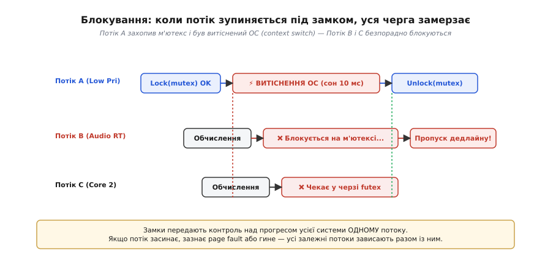
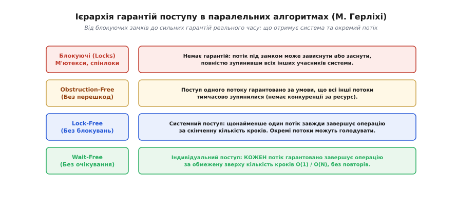
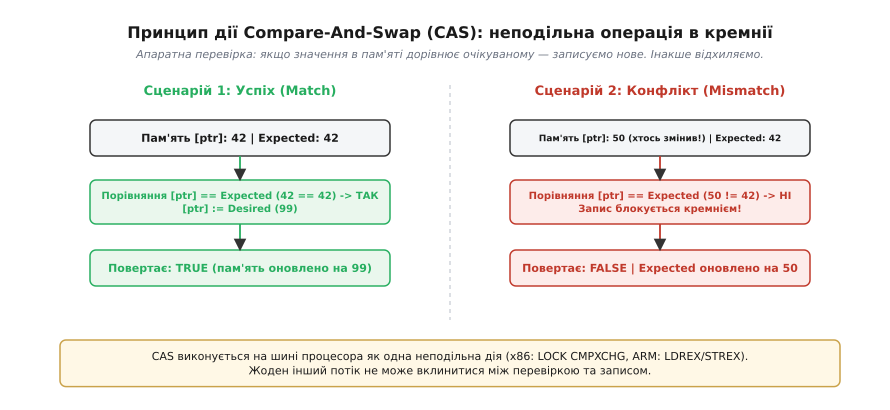
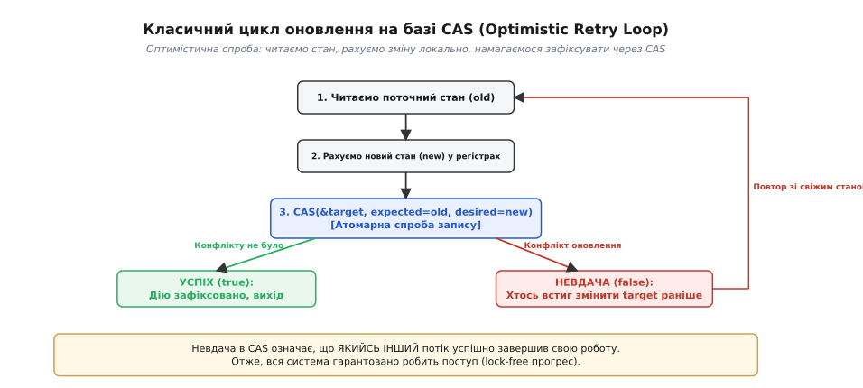
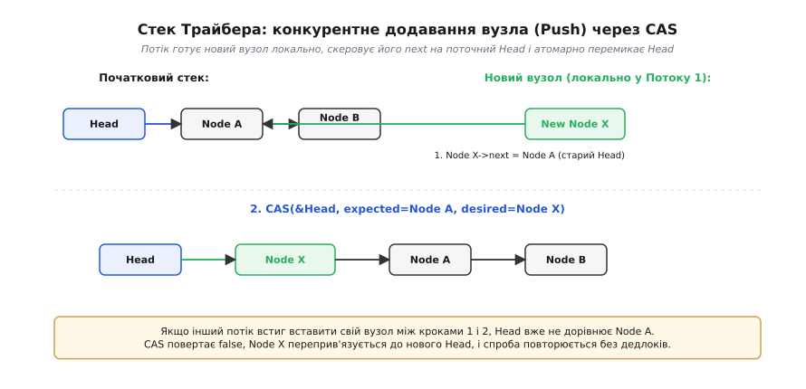
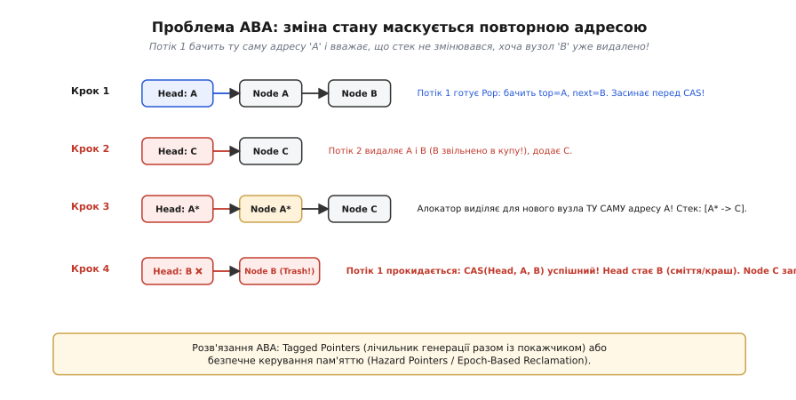
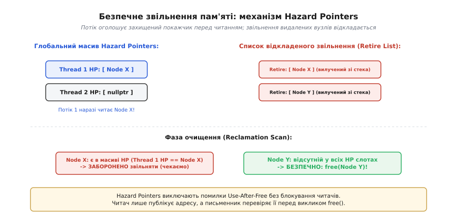

# Без замків

<preknowlist>
- [Атомарність і гонки даних](topic:sf-tasks/atomicity-races) — неподільність операцій і захист спільних змінних від непередбачуваного втручання.
- [Упорядкування пам'яті та бар'єри](topic:sf-tasks/memory-ordering-barriers) — апаратні та компіляторні бар'єри пам'яті, упорядкування операцій читання й запису.
- [std::atomic та атомарні типи](topic:sys-plang-cpp/std-atomic) — базові атомарні операції, завантаження, збереження та семантика моделей пам'яті.
- [Хибне спільне використання кеш-лінії](topic:hw-arch/false-sharing) — збереження незалежних даних в одній 64-байтній лінії кеша та між'ядерний пінг-понг.
- [Вирівнювання даних: апаратні вимоги](topic:hw-arch/alignment-hardware) — зв'язок розміщення даних у пам'яті з атомарністю машинних інструкцій.
</preknowlist>

У високочастотному аудіорушії, що обробляє звук із дискретизацією 96 кГц (де часовий бюджет на заповнення буфера становить усього 10.4 мікросекунди), або в драйвері мережевої карти, що приймає пакети в обробнику апаратного переривання, потік реального часу ділить спільну чергу задач із фоновими робочими потоками операційної системи. Якщо чергу захищено звичайним системним м'ютексом, фоновий потік захоплює замок, і рівно в цю мікросекунду планувальник ядра витісняє його через вичерпання кванту часу або промах сторінки пам'яті (англ. *page fault*). Коли високопріоритетний аудіопотік звертається до черги, він натикається на закритий м'ютекс і засинає в очікуванні фонового процесу. Часовий дедлайн у 10 мікросекунд безповоротно зривається, звуковий буфер спустошується, і слухач чує характерний тріск.

Ще катастрофічнішим стає сценарій, коли потік, утримуючи замок, зазнає фатальної помилки (наприклад, аварійного завершення через виключення чи сигнал ОС). Ресурс назавжди залишається заблокованим, і всі інші потоки застосунку каскадно зависають у безвихідному очікуванні.

Ця вразливість є фундаментальною властивістю синхронізації на основі блокувань (м'ютексів та спінлоків). Будь-який замок тимчасово передає контроль над прогресом усієї системи одному-єдиному виконавцю. Якщо цей виконавець сповільнюється, засинає, зазнає переривання або гине, уся система зупиняється разом із ним.


*Потік A захопив м'ютекс і був витіснений планувальником ОС на 10 мілісекунд. Потоки B і C блокуються на замку: високопріоритетна задача зриває дедлайн реального часу, а обчислювальні ядра простоюють у черзі.*

Альтернативою блокуванням є **неблокувальна синхронізація** (англ. *non-blocking synchronization*) або програмування **без замків** (англ. *lock-free programming*). Це парадигма проектування алгоритмів і структур даних, у якій спільний ресурс модифікується за допомогою неподільних інструкцій процесора таким чином, що затримка чи аварія окремого потоку не здатна зупинити виконання інших потоків.

### Рівні гарантій поступу: від відсутності перешкод до гарантованого часу

У теорії паралельних обчислень неблокувальні алгоритми ділять на три строгі класи відповідно до гарантій поступу (англ. *progress guarantees*), які вони надають системі та кожному окремому виконавцю. Цю класифікацію сформулювали дослідники Моріс Герліхі (Maurice Herlihy) та Нір Шавіт (Nir Shavit).


*Ієрархія поступу: від блокуючих замків (де немає гарантій збереження прогресу при збої потоку) до Wait-Free алгоритмів із гарантованим детермінованим часом виконання кожного кроку.*

1. **Obstruction-Free (Без перешкод):**
   Найслабший рівень неблокувальних гарантій. Алгоритм називається Obstruction-Free, якщо окремо взятий потік гарантовано завершує свою операцію за скінченну кількість кроків за умови, що всі інші потоки в системі тимчасово призупинені або не створюють конкуренції.
   Якщо ж кілька потоків виконують операції одночасно, вони можуть нескінченно заважати один одному, потрапляючи в стан живого замка (англ. *livelock*). Цей рівень корисний тим, що не потребує складного апаратного арбітражу, але в умовах високої конкуренції вимагає зовнішніх механізмів розведення потоків у часі (наприклад, випадкових затримок).

2. **Lock-Free (Без блокувань — системний поступ):**
   Головний і найпоширеніший клас неблокувальних алгоритмів. Алгоритм є Lock-Free, якщо за умови нескінченного виконання обчислювальних кроків система як єдине ціле гарантовано виконує нескінченну кількість корисних операцій.
   Це означає, що якщо `N` потоків одночасно змагаються за оновлення структури даних, щонайменше один потік завжди гарантовано завершить свою дію за скінченну кількість тактів. Решта `N - 1` потоків можуть зазнати невдачі через конфлікт і піти на повторне коло. Окремий потік теоретично може голодувати (англ. *starvation*), постійно програючи конкуренцію сусідам, але вся система ніколи не застрягне: прогрес системи гарантовано. Зависання чи загибель будь-яких `N - 1` потоків ніяк не заважає останньому активному потоку завершити свою роботу.

3. **Wait-Free (Без очікування — індивідуальний поступ):**
   Найсильніший рівень гарантій. Алгоритм є Wait-Free, якщо **кожен** потік гарантовано завершує свою операцію за обмежену зверху кількість власних кроків `O(1)` або `O(N)`, незалежно від поведінки, затримок, швидкості чи аварійного завершення будь-яких інших потоків.
   У Wait-Free структурах відсутні не лише блокування, але й цикли повторних спроб: алгоритм детерміновано виконує фіксовану послідовність інструкцій. Це ідеальний вибір для систем жорсткого реального часу, де кожна дія повинна вкладатися у суворий часовий норматив.

Повний математичний апарат класифікації поступу, доведення універсальності примітивів та поняття консенсусних чисел наведено у вставці [Ієрархія поступу: формальні моделі та консенсусні числа](topic:sf-tasks/lock-free-basics/math-progress-hierarchy.md).

Як ці ідеї виникли у відповідь на появу перших багатопроцесорних комплексів у 1980-х роках і які відкриття зробили Р. Кент Трайбер та Моріс Герліхі, розказано у вставці [Від очікування до прогресу: історія неблокувальних структур](topic:sf-tasks/lock-free-basics/hist-lock-free-milestones.md).

### Апаратне серце: Compare-And-Swap (CAS)

Основою більшості неблокувальних алгоритмів є атомарна апаратна інструкція **Compare-And-Swap** (CAS, порівняння з обміном; в архітектурі x86 — `LOCK CMPXCHG`, в архітектурі ARM — пара `LDREX`/`STREX` або інструкція `CAS`).

Принцип роботи CAS полягає в неподільній перевірці та оновленні комірки пам'яті за один неподільний крок на шині процесора:
1. Процесор порівнює поточне значення за вказаною адресою пам'яті з очікуваним значенням (`expected`).
2. Якщо значення в пам'яті **точно збігається** з очікуваним, процесор записує туди нове значення (`desired`) і повертає `true`.
3. Якщо значення в пам'яті **відрізняється** (оскільки інше процесорне ядро встигло змінити комірку раніше), запис блокується кремнієм, комірка залишається недоторканою, а інструкція повертає `false` і повідомляє фактичний поточний стан пам'яті.


*Апаратне виконання CAS: зліва — успішний збіг значення, запис дозволено; справа — конфлікт (значення змінено іншим ядром), запис блокується процесором, повертається актуальне значення.*

Жодне інше ядро процесора не може вклинитися між фазою порівняння та фазою запису інструкції CAS: операція або відбувається повністю, або не відбувається зовсім.

#### Оптимістичний цикл оновлення (CAS Retry Loop)

Завдяки властивостям CAS будується універсальний патерн оптимістичного оновлення стану:
1. **Зчитування:** Потік читає поточний стан спільної змінної у локальний регістр (`old_val = atomic_read(&target)`).
2. **Локальне обчислення:** Потік у приватних регістрах розраховує новий бажаний стан (`new_val = transform(old_val)`). Спільні ресурси на цьому кроці не блокуються.
3. **Спроба фіксації:** Потік викликає `CAS(&target, old_val, new_val)`.
4. **Реакція на результат:**
   - Якщо CAS повернув `true` — конфлікту не було, новий стан опубліковано, операція завершена.
   - Якщо CAS повернув `false` — інший потік встиг змінити `target` раніше. Локальне значення `new_val` відкидається як застаріле, змінна `old_val` автоматично оновлюється свіжими даними з пам'яті, і потік миттєво повторює обчислення з першого кроку.


*Оптимістичний цикл CAS: потік готує новий стан локально; якщо за час підготовки пам'ять не змінилася — CAS фіксує зміну. У разі конфлікту потік бере свіже значення й повторює спробу без дедлоків.*

Зверніть увагу на ключову властивість: невдача в CAS означає, що **хтось інший щойно успішно виконав свій запис**. Тобто в системі завжди відбувається корисна робота.

Детальний опис сигнатур, моделей пам'яті та відмінностей між слабким і сильним CAS (`compare_exchange_weak` проти `compare_exchange_strong`) наведено у довідковій вставці [Атомарні примітиви CAS: контракт апаратури та компілятора](topic:sf-tasks/lock-free-basics/api-atomic-cas.md).

### Побудова неблокувальних структур: Стек Трайбера

Найпростішою ілюстрацією використання CAS для побудови динамічної структури даних є стек Трайбера (англ. *Treiber stack*), запропонований у 1986 році.

Стек організовано як однозв'язний список, де єдиною спільною змінною є атомарний покажчик на вершину `head`.


*Потік 1 готує новий вузол X у приватній пам'яті, скеровує його next на Node A і намагається перемкнути Head через CAS. Якщо інший потік втрутився, Head переприв'язується до нової вершини без блокувань.*

Розгляньмо, як реалізуються базові операції стека мовами C та C++:

:::tabs
```c
#include <stdatomic.h>
#include <stdbool.h>
#include <stdlib.h>

typedef struct Node {
    int value;
    struct Node* next;
} Node;

typedef struct {
    _Atomic(Node*) head;
} TreiberStack;

void stack_init(TreiberStack* stack) {
    atomic_init(&stack->head, NULL);
}

void stack_push(TreiberStack* stack, int value) {
    Node* new_node = (Node*)malloc(sizeof(Node));
    new_node->value = value;

    // Зчитуємо поточну вершину
    Node* old_head = atomic_load_explicit(&stack->head, memory_order_relaxed);

    // Оптимістичний цикл CAS
    do {
        new_node->next = old_head;
        // memory_order_release гарантує, що ініціалізація полів вузла
        // стане видимою іншим ядрам до того, як оновиться покажчик head
    } while (!atomic_compare_exchange_weak_explicit(
        &stack->head,
        &old_head,
        new_node,
        memory_order_release,
        memory_order_relaxed));
}

bool stack_pop(TreiberStack* stack, int* result) {
    // memory_order_acquire гарантує коректне отримання полів вузла
    Node* old_head = atomic_load_explicit(&stack->head, memory_order_acquire);

    while (old_head != NULL) {
        Node* next_node = old_head->next;

        if (atomic_compare_exchange_weak_explicit(
                &stack->head,
                &old_head,
                next_node,
                memory_order_acquire,
                memory_order_relaxed)) {
            *result = old_head->value;
            // Увага: фізичне видалення потребує безпечного керування пам'яттю
            free(old_head);
            return true;
        }
    }
    return false; // Стек порожній
}
```
```cpp
#include <atomic>
#include <memory>
#include <optional>

template <typename T>
class TreiberStack {
public:
    TreiberStack() : head_(nullptr) {}

    ~TreiberStack() {
        Node* current = head_.load(std::memory_order_relaxed);
        while (current != nullptr) {
            Node* next = current->next;
            delete current;
            current = next;
        }
    }

    TreiberStack(const TreiberStack&) = delete;
    TreiberStack& operator=(const TreiberStack&) = delete;

    void push(T value) {
        auto* new_node = new Node(std::move(value));
        Node* old_head = head_.load(std::memory_order_relaxed);

        // Оптимістична публікація з семантикою release
        while (!head_.compare_exchange_weak(
            old_head,
            new_node,
            std::memory_order_release,
            std::memory_order_relaxed)) {
            new_node->next = old_head;
        }
    }

    std::optional<T> pop() {
        Node* old_head = head_.load(std::memory_order_acquire);

        while (old_head != nullptr) {
            Node* next_node = old_head->next;

            if (head_.compare_exchange_weak(
                    old_head,
                    next_node,
                    std::memory_order_acquire,
                    std::memory_order_relaxed)) {
                T result = std::move(old_head->value);
                delete old_head;
                return result;
            }
        }
        return std::nullopt;
    }

private:
    struct Node {
        T value;
        Node* next{nullptr};
        explicit Node(T val) : value(std::move(val)) {}
    };

    std::atomic<Node*> head_;
};
```
:::

У наведеному коді зверніть увагу на дві тонкощі:
- Використання `compare_exchange_weak`: на архітектурах із роздільними інструкціями завантаження й збереження (ARM, RISC-V) слабкий CAS не витрачає тактів на фільтрацію випадкових хибних збоїв (spurious failures), оскільки вони автоматично опрацьвуються циклом `while`.
- Моделі пам'яті: `memory_order_release` під час `push` гарантує, що ініціалізація `value` та покажчика `next` потрапить у кеш до того, як адреса вузла з'явиться у `head`. А `memory_order_acquire` під час `pop` гарантує, що читання вмісту елемента не буде виконано процесором завчасно.

Повний аналіз коду, крайових випадків та реалізації захисту стека розглянуто у вставці [Стек Трайбера: реалізація LIFO-структури без блокувань](topic:sf-tasks/lock-free-basics/proj-treiber-stack.md).

### Черга Майкла–Скотта: кооперативна допомога між потоками

Поки стек має одну точку синхронізації (вершину), черга (FIFO) містить два незалежні кінці — покажчик голови `head` (звідки елементи вилучаються) та покажчик хвоста `tail` (куди елементи додаються).

Спроба додати новий вузол у зв'язану чергу стикається з фундаментальною дилемою: операція вимагає модифікації **двох різних покажчиків**:
1. Спочатку потрібно зв'язати останній вузол черги з новим: `tail->next = new_node`.
2. Потім потрібно оновити глобальний покажчик хвоста: `tail = new_node`.

Оскільки процесор не має стандартної інструкції для атомарного запису у дві довільні адреси пам'яті одночасно, операція розбивається на два окремих CAS. Якщо потік витісняється планувальником ОС між кроком 1 і кроком 2, черга зависає в проміжному, неузгодженому стані: хвіст `tail` відстає від реального кінця списку.

У 1996 році Магед Майкл та Майкл Скотт винайшли витончений патерн **кооперативної допомоги** (англ. *helping mechanism*):
- Черга завжди містить один штучний фіктивний вузол-вартовий (Sentinel Node), що усуває крайовий випадок одночасного оновлення `head` і `tail` у порожній черзі.
- Коли потік `B` намагається виконати вставку нового вузла і бачить, що `tail->next != nullptr` (тобто попередній потік `A` встиг додати вузол, але ще не пересунув `tail`), потік `B` не чекає і не блокується.
- Потік `B` самостійно виконує `CAS(&tail, current_tail, current_tail->next)`, просуваючи хвіст черги вперед замість потоку `A`.
- Лише після відновлення інваріанту структури потік `B` переходить до додавання власного елемента.

Завдяки цьому зависання окремого потоку не блокує чергу: кожен наступний учасник системи самостійно «доробляє» незавершену роботу застряглих попередників.

### SPSC-кільцевий буфер: черга без блокувань і без CAS

Коли завдання обмежується взаємодією рівно двох потоків (один потік лише записує, а другий лише читає — Single-Producer Single-Consumer), алгоритм можна спростити ще більше: повністю позбутися інструкції CAS і досягти суворих гарантій **Wait-Free `O(1)`**.

В основі SPSC-буфера лежить масив фіксованого розміру `2ⁿ` та два атомарних індекси: `head` (індекс запису) та `tail` (індекс читання).

```
               Кільцевий буфер розміром 2ⁿ:
             
                 ┌───┬───┬───┬───┬───┬───┬───┬───┐
                 │ 0 │ 1 │ 2 │ 3 │ 4 │ 5 │ 6 │ 7 │
                 └───┴───┴───┴───┴───┴───┴───┴───┘
                           ▲               ▲
                           │               │
                      tail (споживач)   head (виробник)
```

Чому тут не потрібен CAS?
- Змінну `head` змінює **виключно виробник**. Споживач лише зчитує її.
- Змінну `tail` змінює **виключно споживач**. Виробник лише зчитує її.

Оскільки в кожної змінної є лише один автор, між записами не існує стану гонки. Достатньо звичайних атомарних операцій читання (`load`) та збереження (`store`) з бар'єрами `acquire`/`release`.

:::tabs
```c
#include <stdatomic.h>
#include <stdbool.h>
#include <stddef.h>

#define CAPACITY 1024
#define MASK (CAPACITY - 1)

typedef struct {
    int buffer[CAPACITY];
    // Розділення кеш-ліній (64 байти) для усунення False Sharing
    _Alignas(64) _Atomic(size_t) head;
    _Alignas(64) _Atomic(size_t) tail;
} SpscQueue;

bool spsc_push(SpscQueue* q, int item) {
    size_t h = atomic_load_explicit(&q->head, memory_order_relaxed);
    size_t t = atomic_load_explicit(&q->tail, memory_order_acquire);

    if (h - t >= CAPACITY) return false; // Черга заповнена

    q->buffer[h & MASK] = item;
    atomic_store_explicit(&q->head, h + 1, memory_order_release);
    return true;
}

bool spsc_pop(SpscQueue* q, int* item) {
    size_t t = atomic_load_explicit(&q->tail, memory_order_relaxed);
    size_t h = atomic_load_explicit(&q->head, memory_order_acquire);

    if (t == h) return false; // Черга порожня

    *item = q->buffer[t & MASK];
    atomic_store_explicit(&q->tail, t + 1, memory_order_release);
    return true;
}
```
```cpp
#include <atomic>
#include <array>
#include <cstddef>
#include <optional>

template <typename T, std::size_t Capacity = 1024>
class SpscQueue {
    static_assert((Capacity & (Capacity - 1)) == 0, "Capacity must be a power of 2");
    static constexpr std::size_t Mask = Capacity - 1;

public:
    bool push(T item) {
        const std::size_t h = head_.load(std::memory_order_relaxed);
        const std::size_t t = tail_.load(std::memory_order_acquire);

        if (h - t >= Capacity) return false;

        buffer_[h & Mask] = std::move(item);
        head_.store(h + 1, std::memory_order_release);
        return true;
    }

    std::optional<T> pop() {
        const std::size_t t = tail_.load(std::memory_order_relaxed);
        const std::size_t h = head_.load(std::memory_order_acquire);

        if (t == h) return std::nullopt;

        T item = std::move(buffer_[t & Mask]);
        tail_.store(t + 1, std::memory_order_release);
        return item;
    }

private:
    std::array<T, Capacity> buffer_{};
    alignas(64) std::atomic<std::size_t> head_{0};
    alignas(64) std::atomic<std::size_t> tail_{0};
};
```
:::

Зверніть увагу на атрибут `alignas(64)`: він розміщує `head` та `tail` у різних 64-байтних лініях процесорного кеша. Якби вони опинилися в одній лінії, запис у `head` на одному ядрі постійно інвалідував би кеш другого ядра, що призвело б до катастрофічного падіння швидкості через явище [хибного спільного використання кеш-лінії](topic:hw-arch/false-sharing).

Детальний аналіз та оптимізації локального кешування індексів наведено у вставці [SPSC-кільцевий буфер: черга без блокувань і без CAS](topic:sf-tasks/lock-free-basics/proj-spsc-ringbuf.md).

### Проблема ABA: прихована зміна стану

При проектуванні неблокувальних динамічних структур (таких як стек чи черга) інженери регулярно потрапляють у найвідомішу пастку паралельного програмування — **проблему ABA** (англ. *ABA problem*).

Суть проблеми полягає в тому, що інструкція CAS перевіряє **рівність бітового значення** комірки (значення покажчика), але не здатна визначити, чи змінювався стан системи між моментом читання та моментом виконання CAS.


*Анатомія катастрофи ABA: Потік 1 бачить вершину A (яка веде на B) і засинає. Потік 2 вилучає A і B, звільняє пам'ять і створює новий вузол за тією самою адресою A*. Потік 1 прокидається: CAS(Head, A, B) успішний, але Head тепер вказує на видалений вузол B!*

Розгляньмо покроковий сценарій аварії:
1. Стек містить елементи `[Node A -> Node B -> Node C]`. Вершина `head` вказує на `A`.
2. **Потік 1** збирається виконати операцію `pop()`. Він читає `old_head = A`, а потім зчитує `next_node = A->next` (тобто покажчик на `B`).
3. Рівно в цю мить операційна система витісняє Потік 1 з процесора. Потік 1 засинає перед викликом CAS.
4. Поки Потік 1 спить, **Потік 2** вилучає `Node A` зі стека (`pop()`) і звільняє його пам'ять через `free(A)`.
5. Потім Потік 2 вилучає `Node B` (`pop()`) і також викликає `free(B)`. Стек тепер містить лише `[Node C]`.
6. Потім Потік 3 створює новий елемент для додавання у стек (`push()`). Системний алокатор пам'яті повторно використовує щойно звільнену пам'ять і виділяє для нового елемента **ту саму адресу `A`**! Потік 3 пов'язує його з `C` і встановлює вершину стека: `[Node A* -> Node C]`.
7. **Потік 1 прокидається.** Він виконує `CAS(&head, expected = A, desired = B)`.
8. Оскільки адреса в `head` дійсно дорівнює `A` (алокатор перепризначив ту саму адресу), інструкція CAS вважає, що стек не змінювався, і успішно замінює `head` на `B`.
9. **Катастрофа:** Вершина стека тепер вказує на `Node B`, пам'ять якого вже була давно звільнена або затерта іншими даними! Вузол `Node C` безповоротно втрачається, а перший наступний доступ до стека призводить до аварійного падіння програми (Segmentation Fault) або руйнування пам'яті.

#### Як долають проблему ABA

Існує три основні інженерні методи усунення проблеми ABA:

1. **Теговані покажчики (Tagged Pointers / Double-Word CAS):**
   Разом із 64-бітним покажчиком на вузол зберігається 64-бітний монотонний лічильник модифікацій (тег версії). Щоразу, коли стек оновлюється, лічильник збільшується на одиницю. Для атомарного оновлення використовується подвійний 128-бітний CAS (`cmpxchg16b` на x86-64 або `LDXP`/`STXP` на ARM64). Навіть якщо покажчик повернувся до старої адреси `A`, його версійний тег змінився (`A, версія 1` ≠ `A, версія 3`), і CAS надійно повертає помилку.

2. **Пакування тега у невикористані біти (Pointer Packing):**
   На 64-бітних архітектурах віртуальний адресний простір зазвичай використовує лише молодші 48 бітів адреси. Старші 16 бітів покажчика залишаються вільними. У них можна розмістити 16-бітний лічильник генерацій без необхідності подвійного 128-бітного CAS.

3. **Безпечне керування пам'яттю (Safe Memory Reclamation):**
   Унеможливлення повторного виділення адреси вузла, поки хоча б один паралельний потік утримує на нього посилання.

### Безпечне керування пам'яттю (Safe Memory Reclamation)

У мовах програмування без автоматичного збирача сміття (C та C++) неблокувальні структури даних стикаються з парадоксом часу життя об'єктів:
- У структурах із м'ютексами потік захоплює замок, вилучає вузол зі списку і спокійно викликає `free(node)`: замок гарантує, що жоден інший потік не читає цей вузол у цю мить.
- У неблокувальних структурах вилучення вузла відбувається без блокування читачів. Якщо Потік 1 вилучив вузол `X` зі списку і негайно викликав `free(X)`, Потік 2 міг зчитати покажчик на `X` за наносекунду до цього і наразі збирається прочитати `X->next`. Виникає критична помилка **Use-After-Free** (розіменування звільненої пам'яті).

Для розв'язання цієї проблеми застосовують алгоритми безпечного відкладеного звільнення пам'яті (англ. *Safe Memory Reclamation*, SMR).


*Принцип Hazard Pointers: потік оголошує захищений вузол у глобальному слоті HP. Письменник переміщує вилучений вузол до списку відкладеного видалення і звільняє його лише тоді, коли жоден HP-слот більше не вказує на цей вузол.*

#### 1. Метод Hazard Pointers (Небезпечні покажчики)

Алгоритм Hazard Pointers, розроблений Магедом Майклом у 2002 році, працює за принципом публікації намірів:
- Кожен потік володіє виділеним атомарним слотом (Hazard Pointer).
- Перш ніж розіменувати покажчик на вузол, потік записує його адресу у свій слот HP.
- Коли потік вилучає вузол зі структури, він **не викликає `free()` одразу**, а поміщає його у локальний список відкладеного звільнення (Retire List).
- Періодично (коли накопичується певна кількість видалених вузлів) потік сканує слоти HP усіх потоків у системі:
  - Якщо адреса вузла знайдена хоча б в одному слоті HP — вузол залишається у списку (хтось прямо зараз читає його).
  - Якщо адреси вузла немає в жодному слоті HP — потік безпечно викликає `free()`.

#### 2. Епохальне звільнення (Epoch-Based Reclamation, EBR)

Епохальний підхід групує операції у глобальні покоління (епохи):
- Глобальний лічильник епохи набуває значень `0, 1, 2` по колу.
- Потік, розпочинаючи операцію читання, реєструється у поточній глобальній епосі.
- Вилучені вузли потрапляють у кошик поточної епохи.
- Глобальна епоха перемикається, коли всі активні потоки завершили роботу в попередній епосі. Пам'ять кошика епохи `E - 2` гарантовано звільняється, оскільки жоден потік у системі більше не може мати активних посилань на об'єкти двох епох тому.

EBR має значно менші накладні витрати на одне читання порівняно з Hazard Pointers, але якщо один потік у системі зависне всередині критичної секції, звільнення пам'яті буде заблоковано для всіх епох.

### Апаратна ціна: коли Lock-Free програє звичайним замкам

У середовищі розробників існує поширена омана, нібито алгоритми без замків автоматично є швидшими за структури з м'ютексами. На практиці це далеко не завжди так.

Головним прихованим ворогом неблокувальних алгоритмів є **трафік когерентності кешів** (англ. *cache coherency traffic*):
- У сучасних багатоядерних процесорах кожне ядро має власні кеші L1 та L2. Коли потік виконує інструкцію CAS, процесор зобов'язаний захопити відповідну 64-байтну лінію кеша в ексклюзивний стан (Modified/Exclusive за протоколом MESI).
- Для цього ядро надсилає широкомовний запит інвалідації лінії (Invalidate Request) усім іншим ядрам через між'ядерну шину або кільцеву магістраль.
- Якщо на 64-ядерному сервері всі 64 ядра одночасно намагаються виконати CAS над однією вершиною стека Трайбера, 63 ядра щоразу зазнають невдачі. Кеш-лінія з шаленою швидкістю стрибає між ядрами (явище *cacheline bouncing*), забиваючи пропускну здатність внутрішньої шини процесора.
- У результаті час виконання однієї операції зростає з одиниць наносекунд до сотень наносекунд, а сумарна продуктивність системи падає пропорційно квадрату кількості активних ядер `O(N²)`.

```
Шторм інвалідацій кеша при високій конкуренції CAS:

   Ядро 0           Ядро 1           Ядро 2           Ядро 3
 ┌─────────┐      ┌─────────┐      ┌─────────┐      ┌─────────┐
 │ CAS OK! │      │ CAS FAIL│      │ CAS FAIL│      │ CAS FAIL│
 └────┬────┘      └────┬────┘      └────┬────┘      └────┬────┘
      │                │                │                │
 ─────┴────────────────┴────────────────┴────────────────┴─────
            Між'ядерна магістраль когерентності (Шторм Invalidate)
```

Для пом'якшення цього ефекту в циклах CAS обов'язково використовують алгоритми експоненційної паузи (Backoff): якщо CAS повернув `false`, потік не атакує пам'ять негайно, а виконує паузу за допомогою процесорної інструкції зменшення енергоспоживання (`_mm_pause()` на x86 або `__yield()` на ARM), випадковим чином збільшуючи час очікування при кожній наступній невдачі.

### Порівняння підходів до синхронізації

| Критерій | Системний м'ютекс (Mutex) | Спінлок (Spinlock) | Lock-Free CAS (Treiber / MS-Queue) | Wait-Free SPSC / Ring Buffer |
| :--- | :--- | :--- | :--- | :--- |
| **Поведінка при очікуванні** | Сон у черзі ядра ОС (`futex`) | Активне обертання в циклі | Оптимістичний повтор CAS | Відсутність повторів / негайна відповідь |
| **Ціна перемикання контексту** | Висока (1500–5000 нс) | Нульова (але спалює CPU) | Нульова | Нульова |
| **Вразливість до витіснення** | Висока (зависають усі) | Катастрофічна (спалює кванти) | Немає (система продовжує поступ) | Немає (повна ізоляція потоків) |
| **Використання в ISR/перериваннях** | Заборонено | Ризиковано | Дозволено | Ідеально |
| **Складність реалізації** | Низька | Низька | Висока (ABA, SMR, memory models) | Середня (вирівнювання, пам'ять) |

> 🔧 **Навіщо це.** Справжня цінність неблокувального програмування полягає не в абстрактному «прискоренні чисел у бенчмарках», а в **надійності, передбачуваності затримок та стійкості до збоїв**:
> - **У системах реального часу (DSP, звук, відео, драйвери):** Заборонено блокувати високопріоритетні переривання та потоки м'ютексами. Використання Lock-Free або Wait-Free SPSC-буферів гарантує детермінований час відгуку без зриву дедлайнів.
> - **В обробниках сигналів та переривань (ISR):** Усередині обробника переривання не можна захоплювати м'ютекс (це призведе до дедлоку, якщо переривання перебило власника замка). Неблокувальні структури — єдиний законний спосіб передачі даних між перериванням та основним кодом.
> - **Захист від інверсії пріоритетів та дедлоків:** Неблокувальний код у принципі не може створити взаємне блокування (Deadlock), оскільки ресурси не утримуються монопольно.

Обирайте структури з простими м'ютексами для загальних фонових завдань із низькою конкуренцією (де м'ютекс простий і надійний), та переходьте до неблокувальних структур (SPSC-буферів, стеків Трайбера або черг Майкла–Скотта) там, де виникають жорсткі вимоги реального часу, чутливості до затримок або обміну даними з обробниками переривань.
