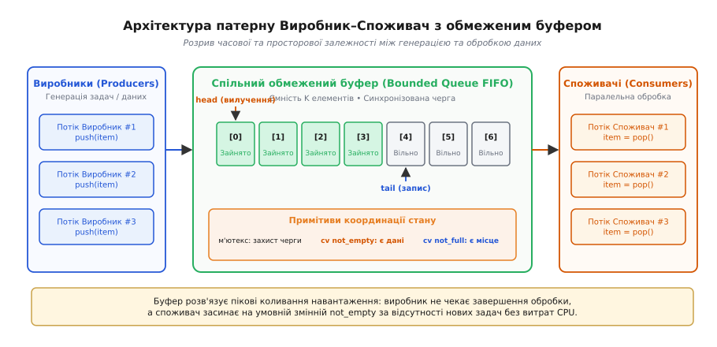
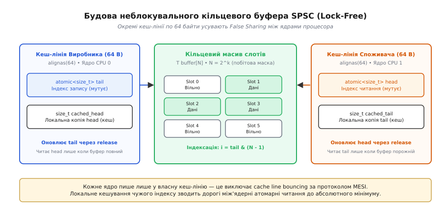
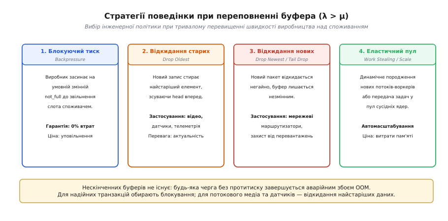
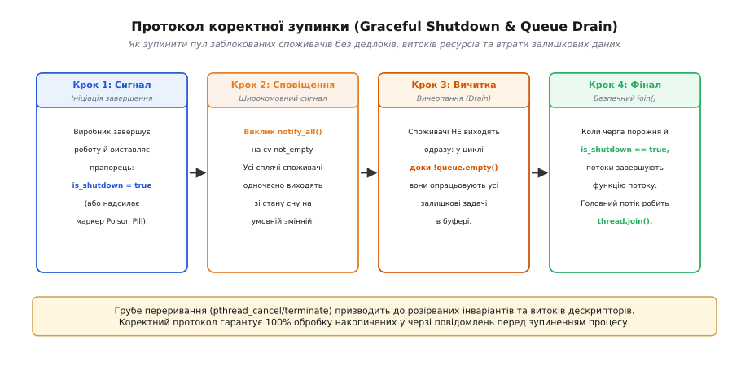

# Патерн Виробник–Споживач

<preknowlist>
- [Атомарність і гонки даних](root:sf-tasks/atomicity-races) — проблеми конкурентного доступу до спільної пам'яті та критичні секції.
- [Перегони даних і замки](root:sf-tasks/data-races-locks) — блокування за допомогою м'ютексів та захист інваріантів.
- [Дедлок](root:sf-tasks/deadlock) — взаємне блокування потоків та умови Кофмана.
- [Черги та семафори](root:sf-tasks/task-ipc) — міжзадачна взаємодія через буферизовані повідомлення та лічильники.
- [Кільцевий буфер](root:sf-algorithms/ring-buffer) — фіксована циклічна структура без динамічного виділення пам'яті.
</preknowlist>

Камера промислового відеоспостереження захоплює 4K-відеопотік із частотою 60 кадрів на секунду: новий нестиснений кадр розміром 33 мегабайти надходить від сенсора через інтерфейс прямого доступу до пам'яті (DMA — *Direct Memory Access*) строго кожні 16.6 мілісекунди. Потік захоплення передає ці кадри на конвеєр розпізнавання об'єктів нейромережею. Час інференсу нейромережі на графічному прискорювачі не є константним: обробка порожнього кадру без руху займає 6 мілісекунд, але коли в полі зору з'являється група автомобілів і пішоходів, алгоритм детекції та просторового відстеження витрачає до 42 мілісекунд на складний кадр.

Якщо викликати нейромережу синхронно прямо в потоці захоплення камери, то під час першого ж складного кадру потік захоплення заблокується на 42 мілісекунди. За цей час апаратний FIFO-буфер сенсора на відеокарті переповниться, і наступні два кадри будуть безповоротно втрачені з порушенням часових міток. Якщо ж піти протилежним наївним шляхом і породжувати окремий системний потік ОС (`pthread_create`) на кожен новий кадр, система миттєво зазнає колапсу: сотні паралельних потоків виділять десятки гігабайтів пам'яті, ядра процесора спалюватимуть до 90% часу на перемикання контексту ядра (*context switch*), а постійна взаємна інвалідація процесорних кешів заблокує шину оперативної пам'яті.

Ця криза узгодження швидкостей вимагає фундаментального розриву прямого зв'язку між стороною, яка створює дані, та стороною, яка їх обробляє. Архітектурний підхід, що забезпечує цей розрив через проміжний синхронізований буфер зі строго контрольованим доступом, отримав назву **патерн Виробник–Споживач** (*Producer–Consumer pattern*, від латинського *producere* — «виводити вперед, створювати» та *consumere* — «вичерпувати, вживати»).

---

### Анатомія патерну: просторове та часове розв'язування

Сутність патерну полягає в розподілі обов'язків між трьома автономними компонентами системи:

1. **Виробник (Producer):** Один або кілька незалежних потоків виконання, процесів чи апаратних контролерів, які генерують робочі задачі, події, мережеві пакети або сенсорні вимірювання.
2. **Споживач (Consumer):** Один або кілька робочих потоків (*worker threads*), які вилучають задачі та виконують над ними корисну роботу (обчислення, запис на диск, передачу через сокет, інференс нейромережі).
3. **Спільний буфер (Shared Bounded Buffer):** Потокобезпечна структура даних фіксованої місткості (зазвичай черга FIFO або кільцевий масив), розташована в спільній пам'яті.


*Архітектура патерну: виробники додають задачі в обмежений FIFO-буфер, а споживачі паралельно вилучають їх, синхронізуючись через м'ютекси та умовні змінні.*

Введення проміжного буфера забезпечує два види розв'язування (*decoupling*):
- **Часове розв'язування (Temporal Decoupling):** Виробник і споживач більше не зобов'язані функціонувати синхронно в одному часовому такті. Короткочасний сплеск інтенсивності генерації даних поглинається буфером і плавно опрацьовується споживачами під час наступного спаду вхідного навантаження.
- **Просторове розв'язування (Spatial Decoupling):** Виробник повністю ізольований від логіки виконання, розміщення та внутрішнього стану споживачів. Він лише поміщає пакет у буфер і негайно повертається до генерації наступних даних.

Повний програмний контракт черги, її методи та системні гарантії детально систематизовано у вставці [специфікація інтерфейсу блокуючої черги та операцій синхронізації](root:sf-tasks/producer-consumer/api-bounded-queue.md).

---

### Три фундаментальні інваріанти узгодження

Щоб паралельна система функціонувала стабільно без збоїв пам'яті, втрат даних чи взаємних блокувань, спільний буфер зобов'язаний підтримувати три залізні правила узгодження:

1. **Інваріант непорожнього читання:** Споживач не має права вилучати елемент із порожнього буфера. Якщо в буфері немає задач, споживач повинен заснути й чекати появи хоча б одного елемента, не навантажуючи процесор.
2. **Інваріант непереповненого запису:** Виробник не має права додавати елемент у повністю заповнений буфер (якщо буфер обмежений). Виробник повинен заснути доти, доки споживач не вилучить хоча б один елемент і не звільнить місце.
3. **Інваріант атомарності та цілісності структури:** Внутрішні покажчики буфера (`head`, `tail`, лічильник `count`), а також виділена пам'ять слотів повинні бути захищені від паралельної мутації кількома ядрами одночасно. Розірваний стан покажчика призводить до пошкодження пам'яті процесу (*memory corruption*).

---

### Чому наївні рішення призводять до дедлоку або виснаження CPU

Розглянемо типові інженерні пастки, що виникають при спробах наївної реалізації міжпотокової черги.

#### Пастка 1: Активне опитування (Busy Waiting / Spinlock)

Наївна спроба вирішити проблему очікування полягає в нескінченному циклі опитування прапорця:

:::tabs
```c
// Споживач у нескінченному циклі опитування
while (queue_is_empty(&queue)) {
    // Активне марнування процесорних тактів
}
void* item = queue_pop(&queue);
```
```cpp
// Споживач у нескінченному циклі опитування
while (queue.is_empty()) {
    // Активне марнування процесорних тактів
}
auto item = queue.pop();
```
:::

**Механізм руйнування продуктивності:**
Потік-споживач завантажує відповідне процесорне ядро на 100%. Якщо операційна система виконується на системі з обмеженою кількістю ядер, потік у стані активного очікування з високим пріоритетом може взагалі не віддати процесорний час потоку-виробнику. Крім того, неперервні атомарні читання викликають шторм трафіку когерентності на шині пам'яті (*cache line bouncing*), блокуючи роботу сусідніх ядер.

#### Пастка 2: Наївне блокування м'ютексом без сповіщень

Спроба захистити чергу звичайним м'ютексом без спеціальних примітивів очікування:

:::tabs
```c
pthread_mutex_lock(&lock);
while (queue_is_empty(&queue)) {
    // М'ютекс захоплено намертво!
    // Інші потоки заблоковані на вході
}
void* item = queue_pop(&queue);
pthread_mutex_unlock(&lock);
```
```cpp
std::unique_lock<std::mutex> lock(mutex);
while (queue.is_empty()) {
    // М'ютекс захоплено намертво!
    // Інші потоки заблоковані на вході
}
auto item = queue.pop();
```
:::

**Механізм виникнення дедлоку:**
Споживач захопив м'ютекс, виявив, що черга порожня, і завис усередині критичної секції. Виробник, який намагається додати новий елемент, викликає операцію замикання на тому самому м'ютексі й блокується планувальником ОС. Оскільки виробник не може потрапити в критичну секцію, черга ніколи не отримає нових даних, а споживач ніколи не вийде з циклу перевірки. Виникає класичний взаємний дедлок.

Для подолання цієї суперечності потрібен механізм, який дозволяє **атомарно відпустити замок і перевести потік у режим сну**, а потім автоматично захопити замок назад після настання події появи даних чи звільнення місця.

---

### Синхронізація через умовні змінні (Condition Variables)

Сучасним стандартом багатопотокової синхронізації в просторі користувача є **умовна змінна** (*condition variable*, `pthread_cond_t` у POSIX, `std::condition_variable` у C++).

Умовна змінна завжди функціонує виключно в нерозривній парі з м'ютексом і надає три ключові операції:
1. `wait(lock)`: Атомарно звільняє м'ютекс `lock` і переводить поточний потік у чергу сплячих потоків ядра ОС. Коли інший потік надсилає сигнал пробудження, операційна система виводить потік зі стану сну й автоматично захоплює м'ютекс `lock` перед тим, як повернути керування в код програми.
2. `signal()` / `notify_one()`: Пробуджує один потік, що очікує на цій умовній змінній.
3. `broadcast()` / `notify_all()`: Пробуджує абсолютно всі потоки, що заблоковані на цій умовній змінній.

Для повної координації обмеженого буфера застосовують **дві незалежні умовні змінні**:
- `not_empty` — на якій засинають споживачі, коли в буфері немає елементів;
- `not_full` — на якій засинають виробники, коли в буфері немає вільних слотів.

#### Семантика Меса проти семантики Гоара: чому обов'язковий `while`

У теорії моніторів існують дві концептуальні моделі передачі керування:
- **Семантика Гоара (*Signal-and-Wait*):** Сигналізуючий потік негайно зупиняється та віддає квант процесора пробудженому потоку, гарантуючи, що стан буфера за цей мікросекундний інтервал не змінився.
- **Семантика Меса (*Signal-and-Continue*):** Сигналізуючий потік продовжує виконання своєї критичної секції. Пробуджений потік лише переводиться зі списку сну в чергу планувальника на загальних підставах.

Усі сучасні операційні системи (Linux, Windows, macOS) та мови програмування реалізують **семантику Меса**.

З цього випливає критично важливий інженерний наслідок: між моментом, коли виробник надіслав сигнал `signal(not_empty)`, і моментом, коли сплячий споживач реально прокинувся та захопив м'ютекс, сторонній третій потік-споживач може вклинитися, захопити м'ютекс і вилучити щойно доданий елемент. Коли перший споживач нарешті отримає замок, черга знову виявиться порожньою.

Крім того, ядра ОС допускають так звані **хибні пробудження** (*spurious wakeups*), коли системний потік виходить зі стану очікування через системні сигнали або оптимізації диспетчера без явного виклику `signal`.

> **Залізне правило багатопотокового програмування:**
> Перевірка умови готовності буфера повинна завжди виконуватися виключно в циклі `while`, і ніколи в одинарному умовному блоці `if`!

:::tabs
```c
// КАТЕГОРИЧНО НЕПРАВИЛЬНО:
if (queue->count == 0) {
    pthread_cond_wait(&queue->not_empty, &queue->lock);
}
// Тут черга все ще може бути порожньою через гонку або хибне пробудження!

// ПРАВИЛЬНО (семантика Меса):
while (queue->count == 0 && !queue->is_closed) {
    pthread_cond_wait(&queue->not_empty, &queue->lock);
}
```
```cpp
// КАТЕГОРИЧНО НЕПРАВИЛЬНО:
if (count_ == 0) {
    not_empty_cv_.wait(lock);
}

// ПРАВИЛЬНО (семантика Меса з лямбда-предикатом):
not_empty_cv_.wait(lock, [this] {
    return count_ > 0 || is_closed_;
});
```
:::

#### Проблема «Громового стада» (Thundering Herd Problem)

Якщо в системі працюють 64 потоки-споживачі, і виробник додає в чергу **один** елемент, виклик `pthread_cond_broadcast()` (або `notify_all()`) призведе до масової неефективності. Усі 64 потоки одночасно прокинуться і почнуть змагатися за єдиний м'ютекс. Перший потік захопить замок і вилучить елемент; решта 63 потоки послідовно захоплять замок, перевірять умову `while (count == 0)`, переконаються, що черга порожня, і знову заснуть у ядрі.

Таке масове пробудження спалює тисячі процесорних тактів на марні перемикання контексту. Саме тому під час додавання одного елемента викликають `pthread_cond_signal()` (`notify_one()`), і лише під час зупинки черги чи додавання великого пакета елементів застосовують `broadcast()`.

Детальний аналіз відмінностей між моніторами Гоара та Меса викладено в історичному огляді [історію патерну від багатозадачної системи THE Дейкстри до моніторів Гоара](root:sf-tasks/producer-consumer/hist-dijkstra-semaphores.md).

---

### Семафорне рішення Дейкстри

Історично першим і математично найбільш симетричним способом розв'язання задачі є класична схема Едсгера Дейкстри на основі трьох семафорів:

:::tabs
```c
#include <semaphore.h>
#include <pthread.h>

sem_t empty_slots; // Початкове значення = N (місткість)
sem_t full_slots;  // Початкове значення = 0
pthread_mutex_t mtx; // Початкове значення = 1

void producer(void* item) {
    sem_wait(&empty_slots); // P(empty_slots): чекаємо вільного місця
    pthread_mutex_lock(&mtx);

    // Критична секція: запис у буфер
    enqueue(item);

    pthread_mutex_unlock(&mtx);
    sem_post(&full_slots);  // V(full_slots): сповіщаємо про новий елемент
}

void* consumer(void) {
    sem_wait(&full_slots);  // P(full_slots): чекаємо появи даних
    pthread_mutex_lock(&mtx);

    // Критична секція: вилучення з буфера
    void* item = dequeue();

    pthread_mutex_unlock(&mtx);
    sem_post(&empty_slots); // V(empty_slots): сповіщаємо про звільнення місця
    return item;
}
```
```cpp
#include <semaphore>
#include <mutex>

constexpr std::ptrdiff_t BUFFER_CAPACITY = 16;
std::counting_semaphore<BUFFER_CAPACITY> empty_slots(BUFFER_CAPACITY);
std::counting_semaphore<BUFFER_CAPACITY> full_slots(0);
std::mutex mtx;

void producer(Data item) {
    empty_slots.acquire(); // Очікування вільного слота
    {
        std::lock_guard<std::mutex> lock(mtx);
        enqueue(std::move(item));
    }
    full_slots.release();  // Сповіщення про наявність даних
}

Data consumer() {
    full_slots.acquire();  // Очікування заповненого слота
    Data item;
    {
        std::lock_guard<std::mutex> lock(mtx);
        item = dequeue();
    }
    empty_slots.release(); // Звільнення слота для виробників
    return item;
}
```
:::

**Фатальна помилка інверсії порядку захоплення:**
Якщо розробник помилково поміняє місцями виклики `sem_wait(&empty_slots)` та `pthread_mutex_lock(&mtx)`, у переповненому буфері виробник спочатку захопить м'ютекс, а потім засне на семафорі вільних слотів. Споживач більше не зможе пройти крізь м'ютекс, щоб вилучити елемент і виконати `sem_post(&empty_slots)` — система миттєво впадає в непереборний дедлок.

---

### Високопродуктивні неблокувальні черги (Lock-Free SPSC)

У високочастотній обробці пакетів (високочастотний трейдинг HFT, мережеві драйвери 100 GbE карт, ядро цифрової обробки звуку DSP) використання системних м'ютексів та умовних змінних є неприпустимим:
1. Системний виклик переходу в режим сну (наприклад, `futex` у ядрі Linux) забирає від 1.5 до 4 мікросекунд;
2. Змагання багатьох ядер за одну лінію кешу м'ютекса руйнує пропускну здатність процесорної шини через протокол когерентності MESI/MOESI.

Для випадку **одного виробника та одного споживача (SPSC — Single-Producer Single-Consumer)** існує високоефективний алгоритм кільцевого буфера, який не використовує жодного блокування.


*Будова lock-free SPSC кільця: окремі 64-байтні кеш-лінії для head і tail виключають False Sharing, а локальні копії мінімізують між'ядерні атомарні операції.*

#### Ключові інженерні принципи Lock-Free SPSC:

1. **Розділення ролей мутації:** Виробник є єдиним потоком, який модифікує змінну `tail`. Споживач є єдиним потоком, який модифікує змінну `head`. Оскільки жодна змінна не змінюється двома ядрами одночасно, інструкції атомарного порівняння з обміном (CAS — *Compare-And-Swap*) непотрібні — достатньо звичайних атомарних читань і записів.
2. **Усунення False Sharing:** Якщо розмістити змінні `head` та `tail` поруч у пам'яті, вони потраплять в одну 64-байтну кеш-лінію процесора. Щоразу, коли виробник змінюватиме `tail`, ядро споживача отримуватиме сигнал інвалідації своєї кеш-лінії, що уповільнює роботу в 10–50 разів. Поля `head` і `tail` необхідно примусово розносити в різні кеш-лінії за допомогою директиви `alignas(64)`.
3. **Бар'єри пам'яті (Acquire/Release):**
   - Виробник записує дані в слот буфера, після чого виконує `atomic_store(tail, next, memory_order_release)`. Бар'єр `release` гарантує процесору та компілятору, що дані в пам'яті слота стануть видимими для інших ядер ДО того, як оновиться значення індексу `tail`.
   - Споживач читає `tail` з порядком `memory_order_acquire`, що гарантує, що наступні читання тіла об'єкта зі слота не будуть виконані спекулятивно раніше, ніж перевірка індексу.
4. **Локальне кешування індексів:** Щоб не звертатися до кешу сусіднього ядра на кожній ітерації, виробник тримає локальну неатомарну копію `cached_head`. Він оновлює її з глобальної атомарної пам'яті лише тоді, коли буфер, за його локальними підрахунками, виявився переповненим.
5. **Маска замість ділення:** Якщо місткість черги є степенем двійки (`capacity = 2^k`), операція обчислення індексу в кільці `i % capacity` замінюється надшвидкою порозрядною операцією `i & (capacity - 1)`.

Повну програмну реалізацію lock-free буфера з розбором асемблерних інваріантів наведено у вставці [реалізація блокуючого MPMC-буфера та lock-free SPSC-кільця](root:sf-tasks/producer-consumer/proj-bounded-buffer.md).

---

### Неблокувальні черги для багатьох учасників (Lock-Free MPMC)

Коли виробників і споживачів багато, розведення індексів `head` і `tail` по окремих потоках стає неможливим: кілька ядер намагаються одночасно збільшити `tail` для запису нового елемента.

Класичним рішенням є **алгоритм Дмитра В'юкова (Vyukov MPMC Queue)** або архітектура кільцевого буфера **LMAX Disruptor**.

У черзі В'юкова кожна комірка кільцевого масиву містить не лише корисні дані, а й атомарний номер послідовності (*sequence number*):

1. **Ініціалізація:** Для слота з індексом `i` початковий номер послідовності встановлюється рівним `i`.
2. **Протокол запису (Push):**
   - Виробник читає поточний глобальний `tail`.
   - Він перевіряє номер послідовності у слоті `tail & mask`: якщо номер дорівнює `tail`, комірка вільна для запису.
   - Виробник намагається атомарно збільшити глобальний `tail` на 1 за допомогою інструкції CAS (`compare_exchange_weak`).
   - Якщо CAS успішний, виробник записує дані в слот і виставляє номер послідовності в `tail + 1` (сповіщаючи споживачів, що дані готові).
3. **Протокол читання (Pop):**
   - Споживач читає глобальний `head`.
   - Він перевіряє номер послідовності у слоті: якщо номер дорівнює `head + 1`, слот заповнено даними.
   - Споживач атомарно збільшує `head` через CAS, копіює дані та скидає номер послідовності слота в `head + capacity` (звільняючи слот для наступного кола виробників).

Цей двоетапний протокол повністю усуває блокування ядрами одне одного, проте при високій конкуренції (сотні потоків) часті невдачі CAS викликають підвищене навантаження на шину кешу, що лікується експоненційною затримкою (*exponential backoff*).

#### Патерн LMAX Disruptor: кільце послідовностей
У біржовій системі LMAX розробники відмовилися від традиційних черг на користь попередньо виділеного кільцевого буфера (*RingBuffer*) із послідовними курсорами (*Sequence Barriers*). Кожен споживач володіє власним атомарним курсором вичитки, а виробник записує дані за принципом одного автора (*Single-Writer Principle*), що забезпечує обробку понад 6 мільйонів транзакцій на секунду з субмікросекундним джиттером.

---

### Масштабування, протитиск (Backpressure) та стратегії переповнення

Що відбувається, коли швидкість надходження задач від виробників `λ` протягом тривалого часу стабільно перевищує швидкість їх обробки споживачами `μ` (`λ > μ`)?


*Чотири стратегії боротьби з переповненням: блокування виробника, відкидання найстаріших або нових даних та динамічне розширення пулу воркерів.*

Оскільки оперативна пам'ять комп'ютера завжди обмежена, нескінченних черг не існує. Спроба зробити чергу необмеженою (`unbounded queue` на базі динамічного зв'язного списку) неминуче завершується аварійним знищенням процесу ядром операційної системи через механізм OOM Killer (*Out Of Memory*).

Інженер зобов'язаний обрати одну з чотирьох стратегій поведінки при переповненні:

1. **Блокуючий протитиск (Blocking Backpressure):**
   Виробник примусово переводиться в режим сну на умовній змінній `not_full`. Швидкість генерації задач автоматично сповільнюється до фізичної швидкості їх споживання. Це єдина стратегія зі 100% гарантією збереження даних, що застосовується в транзакційних базах даних та білінгових системах.
2. **Відкидання найстаріших даних (Drop Oldest / Circular Overwrite):**
   Коли черга заповнена, виробник не блокується, а зсуває покажчик читання `head` на один крок уперед і перезаписує найстаріший елемент у буфері. Ця стратегія ідеально підходить для потокового відео, аудіо-моніторингу та датчиків телеметрії IoT, де свіже поточне значення завжди важливіше за застаріле минуле.
3. **Відкидання нових даних (Drop Newest / Tail Drop):**
   Новий елемент негайно ігнорується, якщо в буфері немає вільного місця. Застосовується в мережевих маршрутизаторах і протоколах UDP для захисту системи від повного колапсу під час шторму трафіку.
4. **Еластичне масштабування споживачів (Dynamic Worker Scaling):**
   При досягненні чергою критичного порогу заповненості (наприклад, 80% місткості), система динамічно породжує додаткові робочі потоки або передає задачі в сусідні пули за алгоритмом розкрадання роботи (*Work-Stealing*).

#### Протитиск у розподілених та асинхронних системах

Концепція протитиску виходить далеко за межі спільної пам'яті одного процесу:
- **Мережевий рівень (TCP Flow Control):** Одержувач передає в TCP-заголовку розмір вікна прийому (*Receive Window*). Якщо буфер сокета заповнений, розмір вікна падає до нуля, і відправник примусово припиняє передачу пакетів.
- **Реактивні потоки (Reactive Streams):** У стандартах реактивного програмування споживач явно надсилає запит на фіксовану кількість елементів через виклик `Subscription.request(n)`. Виробник не має права надіслати жодного пакета понад запитаний ліміт `n`.
- **Брокери повідомлень (Kafka / RabbitMQ):** Споживачі самі витягують повідомлення з черги в зручному темпі (*Pull model*), що унеможливлює переповнення клієнтських серверів.

Математичний апарат розрахунку ймовірності переповнення буфера `P_loss` та зв'язок між затримкою і місткістю за законом Літтла наведено у вставці [математика буферизації: закон Літтла, марковські черги M/M/1/K та ймовірність переповнення](root:sf-tasks/producer-consumer/math-queueing-backpressure.md).

---

### Коректна зупинка системи (Graceful Shutdown)

Одна з найскладніших проблем при промисловій експлуатації патерну — як коректно зупинити додаток (наприклад, при отриманні процесом сигналу `SIGTERM` або завершенні пакетної обробки файлу).

Якщо просто викликати примусове знищення потоків (`pthread_cancel` або `std::terminate`), у системі виникнуть розірвані інваріанти: напівзаписані структури в пам'яті, незакриті файлові дескриптори та заблоковані назавжди м'ютекси. Якщо ж просто завершити функцію `main()`, частина завдань, що вже лежать у черзі, ніколи не будуть оброблені.


*Протокол Graceful Shutdown: активація прапорця закриття, широкомовне сповіщення сплячих потоків, вичитка залишків буфера та безпечне завершення потоків.*

#### Протокол коректної зупинки реалізується за 4 послідовні кроки:

1. **Активація прапорця зупинки:** Виробник або керівний потік захоплює м'ютекс і встановлює атомарний прапорець `is_closed = true`. Після цього будь-які нові виклики `push()` негайно відхиляються.
2. **Широкомовне сповіщення (Broadcast):** Викликається `pthread_cond_broadcast(&not_empty)` (або `notify_all()`). Усі потоки-споживачі, які спали на порожній черзі, одночасно пробуджуються.
3. **Вичерпання черги (Drain Phase):** Споживачі перевіряють комбіновану умову:
   ```cpp
   if (queue.empty() && is_closed) {
       break; // Тільки тепер можна виходити з робочого циклу
   }
   ```
   Якщо черга ще містить залишкові елементи, споживачі продовжують вилучати їх і обробляти до повного спустошення буфера.
4. **Синхронізація потоків (`join`):** Головний потік викликає `thread.join()` для кожного воркера, гарантуючи повне вивільнення стеків, дескрипторів та пам'яті перед виходом із програми.

**Альтернатива: Патерн «Отруйна пігулка» (Poison Pill / Sentinel):**
Для зупинки `M` споживачів виробник кладе в чергу рівно `M` спеціальних маркерних об'єктів (наприклад, `nullptr` або структуру з прапорцем `is_poison = true`). Кожен споживач, який витягує такий маркер, розуміє, що це персональний сигнал до самознищення, і негайно виходить із циклу обробки.

---

### Апаратні витрати, топологія NUMA та оптимізація пропускної здатності

При проєктуванні високопродуктивних систем необхідно враховувати фізичні обмеження кремнієвої архітектури:

| Механізм організації буфера | Затримка однієї операції | Пропускна здатність | Масштабованість за ядрами | Ризик дедлоку |
| :--- | :--- | :--- | :--- | :--- |
| **MPMC на м'ютексах (`std::mutex`)** | 50–250 нс (без сну) / 1.5–4 мкс (зі сном) | 2–10 млн оп/с | Падає при > 8 ядрах через Contention | Високий (при помилках інверсії) |
| **MPMC Семафори Дейкстри** | 40–180 нс | 5–15 млн оп/с | Середня | Середній |
| **Lock-Free MPMC (CAS-черга)** | 15–60 нс | 15–40 млн оп/с | Добра (залежить від частоти колізій CAS) | Відсутній |
| **Lock-Free SPSC (Кільцевий масив)** | 2–8 нс | 100–350 млн оп/с | Ідеальна (строго 1 виробник і 1 споживач) | Відсутній у принципі |

#### Вплив архітектури NUMA (Non-Uniform Memory Access)
На багатопроцесорних серверах ядра CPU згруповані у вузли NUMA з локальною оперативною пам'яттю. Якщо виробник виконується на Сокеті 0, а споживач на Сокеті 1, кожна операція читання або запису буфера проходить крізь міжпроцесорну шину (Intel UPI / AMD Infinity Fabric), що збільшує затримку доступу в 3–4 рази порівняно з локальним сокетом. Для критичних шляхів застосовують прив'язку потоків до ядер одного сокета (*Thread Pinning* через системний виклик `pthread_setaffinity_np`).

#### Пакетизація (Batching): амортизація накладних витрат
Найефективніший спосіб підвищити пропускну здатність MPMC-черги в 10 разів — передавати елементи не по одному, а пакетами (батчами по 32–64 штуки). Замість того, щоб захоплювати м'ютекс і будити умовну змінну 1000 разів на 1000 елементів, виробник захоплює замок один раз і копіює весь масив цілком. Це скорочує накладні витрати синхронізації на 97%.

#### Інверсія пріоритетів та захист реального часу
Якщо низькопріоритетний потік захопив м'ютекс буфера, а потік середнього пріоритету витіснив його з процесора, високопріоритетний виробник реального часу заблокується на невизначений термін (явище інверсії пріоритетів). У системах реального часу (RTOS / Linux PREEMPT_RT) для запобігання цій аварії м'ютекси буфера ініціалізують із протоколом успадкування пріоритету (`PTHREAD_PRIO_INHERIT`).

---

> 🔧 **Навіщо це в реальній розробці:**
> 1. **Драйвери мережевих карт (Linux NAPI / DPDK):** Мережевий адаптер записує Ethernet-кадри через DMA в кільцевий RX-буфер (виробник), а ядро Linux забирає їх через переривання та опитування (споживач).
> 2. **Аудіо-сервери (JACK, PulseAudio, CoreAudio):** Аудіо-потік реального часу вичитує семпли зі строго фіксованим джиттером із lock-free SPSC кільця, куди декодери записують розпаковані байти музики. Будь-який м'ютекс тут викликав би тріск у навушниках.
> 3. **Графічні рушії (Vulkan / DirectX 12):** Потік логіки гри (виробник) формує списки команд рендерингу (*Command Buffers*) і складає їх у чергу черги графічного драйвера GPU (споживач).
> 4. **Логування у високонавантажених серверах (Async Logger):** Бізнес-потоки додають повідомлення в неблокуючу чергу за кілька наносекунд, а фоновий потік-споживач скидає накопичені логи на повільний SSD-накопичувач.
