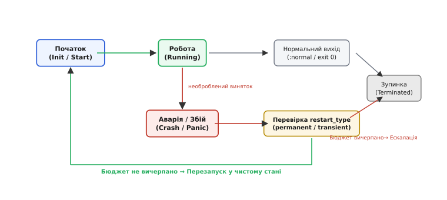
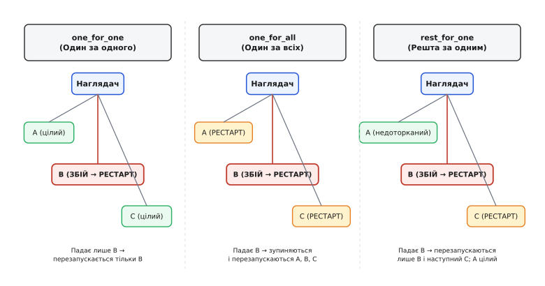
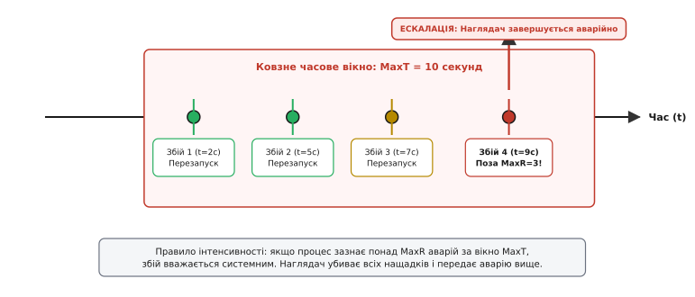
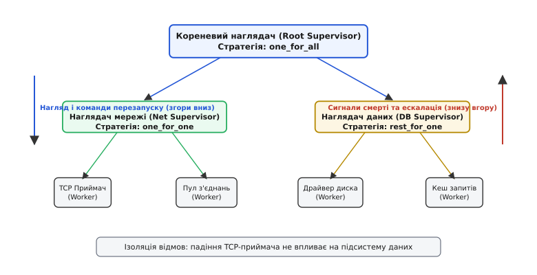

# Дерева нагляду

<preknowlist>
- [Процеси й потоки](topic:sf-os/process-vs-thread) — ізоляція адресного простору, життєвий цикл і стан виконання окремих потоків і процесів.
- [Модель акторів](topic:sf-tasks/actor-model) — обмін повідомленнями без спільної пам'яті, ізольований стан і поштові скриньки.
- [Сигнали POSIX](topic:sf-os/posix-signals) — асинхронні сповіщення про зміну стану нащадків та коди завершення.
- [Кооперативне скасування](topic:sf-tasks/cooperative-cancellation) — коректна зупинка тривалої роботи за сигналом або прапорцем.
</preknowlist>

Мережевий шлюз обробляє п'ятдесят тисяч одночасних клієнтських підключень. Один із клієнтів надсилає нестандартний, пошкоджений бінарний пакет, який потрапляє на рідкісну гілку парсера й викликає розіменування нульового покажчика або паніку в пам'яті. У монолітній програмі зі спільною пам'яттю необроблений виняток негайно вбиває весь процес операційної системи, обриваючи зв'язок для всіх п'ятдесяти тисяч користувачів одночасно. Якщо ж розробник наївно спробує перехопити збій глобальним блоком `catch (...) {}`, потік виконання лишає за собою наполовину оновлені структури даних, незакриті сокети та назавжди замкнені м'ютекси. За кілька хвилин це неминуче призводить до глухого кута (*deadlock*) або тихого пошкодження пам'яті, яке валить увесь кластер.

Спроба писати код, який «ніколи не падає», принципово не масштабується: у складних розподілених комплексах із мільйонами рядків логіки, сторонніми бібліотеками та нестабільним залізом збої є статистичною неминучістю. Щоб одиничний збій не ставав катастрофою для всього сервісу, системну архітектуру будують довкола протилежного принципу: **зробити падіння ізольованим, дешевим і керованим**. Структурою, яка формалізує цей підхід і перетворює хаотичні аварії на прогнозоване самовідновлення, є **дерево нагляду**.

## Філософія «Хай падає» та ізоляція стану

Традиційне оборонне програмування вимагає від автора кожної функції передбачити будь-яку можливу помилку й спробувати виправити її на місці: перевірити кожен покажчик, загорнути кожен виклик у вкладені блоки відловлювання винятків і спробувати повернути внутрішній стан об'єкта до попередньої версії.

Практика системного програмування виявила фундаментальну ваду такого підходу: **найнебезпечніші помилки виникають там, де їх не чекали**. Коли трапляється непередбачений збій (англ. *Heisenbug* — плаваючий баг, викликаний гонкою потоків або порушенням інваріантів), внутрішній стан процесу вже скомпрометовано. Спроба продовжити виконання коду всередині пошкодженого адресного простору призводить до того, що початкова дрібна помилка розповзається сусідніми підсистемами, немов радіація, псуючи кеші, системні таблиці та персистентні файли.

Альтернативою стала філософія **«Хай падає»** (англ. *Let it crash*), сформульована під час розробки високонадійних телефонних комутаторів. Її суть спирається на три жорстких правила:

1. **Повна ізоляція пам'яті (від лат. *insula* — «острів»):** Обчислення розбиваються на незалежні процеси чи актори, які не ділять між собою жодної спільної пам'яті й спілкуються виключно копіями незмінних повідомлень. Якщо процес падає, його локальна пам'ять (стек і купа) миттєво знищується операційною системою чи віртуальною машиною. Жоден інший процес не зазнає пошкодження своїх даних.
2. **Розділення обов'язків (чиста логіка проти відновлення):** Робочий процес (*worker*) пишеться виключно під успішний шлях виконання (*happy path*) та очікувані прикладні валідації. Він не займається самолікуванням. Якщо стається непередбачена аварія, процес негайно припиняє роботу.
3. **Винесення обробки відмов на зовнішнього наглядача (англ. *supervisor*, від лат. *super* — «над, згори» та *videre* — «дивитися, бачити»):** Окремий виділений процес стежить за життєвим циклом підпорядкованих йому робочих задач і перезапускає їх із чистого, гарантовано валідного початкового стану.

> 🔧 **Навіщо це.** Перезапуск у початковий стан усуває транзієнтні (перехідні) збої, на які припадає до 90% аварій у розподілених системах: тимчасове вичерпання дескрипторів, тайм-аути в мережі, переповнення буфера через піковий сплеск трафіку чи витік пам'яті. Новий процес стартує з чистого аркуша й успішно підхоплює наступні запити.

Про те, як цей підхід еволюціонував від простих парних зв'язків до стандарту промислових систем, детально розказано у вставці [як зв'язки процесів перетворилися на дерево нагляду](topic:sf-tasks/supervision-trees/hist-erlang-supervision.md).

## Примітиви зв'язку, моніторингу та сигналів виходу

Щоб наглядач міг своєчасно відреагувати на аварію підлеглого, середовище виконання або операційна система повинні надати надійні примітиви асинхронного спостереження за життєвим циклом процесу. Існують три базові моделі такого спостереження:

```
Примітиви спостереження за процесами:
┌─────────────────────┬───────────────────────────┬─────────────────────────────────────────────────┐
│ Примітив            │ Напрямок зв'язку          │ Поведінка при аварії напарника                  │
├─────────────────────┼───────────────────────────┼─────────────────────────────────────────────────┤
│ Link (Зв'язок)      │ Двосторонній (симетричний)│ Обидва процеси гинуть за замовчуванням          │
│ Trap Exit           │ Односторонній фільтр      │ Сигнал смерті перетворюється на повідомлення    │
│ Monitor (Монітор)   │ Односторонній (асиметричний)│ Спостерігач отримує сповіщення; ціль не знає   │
└─────────────────────┴───────────────────────────┴─────────────────────────────────────────────────┘
```

У середовищі ОС POSIX наглядач виступає батьківським процесом, який породжує працівників через системний виклик `fork()` або `clone()`. Коли дочірній процес гине, ядро ОС надсилає батькові асинхронний сигнал `SIGCHLD`. Батьківський процес вичитує код виходу через системний виклик `waitpid()`:

:::tabs
```c
int status;
pid_t dead_child = waitpid(-1, &status, WNOHANG);
if (dead_child > 0) {
    if (WIFSIGNALED(status)) {
        // Процес упав від сигналу (наприклад, SIGSEGV або SIGABRT)
        int sig = WTERMSIG(status);
        handle_crash_signal(dead_child, sig);
    } else if (WIFEXITED(status)) {
        // Процес вийшов самостійно через exit()
        int exit_code = WEXITSTATUS(status);
        handle_exit_code(dead_child, exit_code);
    }
}
```
```cpp
int status = 0;
pid_t dead_child = ::waitpid(-1, &status, WNOHANG);
if (dead_child > 0) {
    if (WIFSIGNALED(status)) {
        // Процес упав від сигналу (наприклад, SIGSEGV або SIGABRT)
        int sig = WTERMSIG(status);
        handle_crash_signal(dead_child, sig);
    } else if (WIFEXITED(status)) {
        // Процес вийшов самостійно через exit()
        int exit_code = WEXITSTATUS(status);
        handle_exit_code(dead_child, exit_code);
    }
}
```
:::

У середовищах із моделлю акторів (Erlang/OTP, Akka, CAF) наглядач викликає системну функцію перехоплення сигналів виходу (*trap_exit*). Сигнал смерті не вбиває наглядача, а трансформується у структуроване повідомлення у його поштовій скриньці:

```
{'EXIT', Pid, Reason}
```

Отримавши це повідомлення, наглядач точно знає:
1. Який саме процес завершився (`Pid`).
2. Чому він завершився (`Reason`: нормальне завершення `:normal`, виняток `badarg`, помилка тайм-ауту `:timeout` або апаратна паніка).
3. Що робити далі згідно зі специфікацією нащадка.

### Відмінність моніторів від зв'язків
Ключова відмінність між `link` та `monitor` полягає в асиметрії та унікальності посилань. Зв'язок `link` є парним: якщо процес `A` зв'язався з `B`, то смерть `A` за замовчуванням вб'є `B`, якщо той не перехоплює виходи. Монітор `monitor` є строго одностороннім: процес `A` починає спостерігати за `B`, але `B` навіть не знає про існування спостерігача. 

Крім того, виклик створення монітора повертає унікальне посилання (*Reference*). Це усуває стан гонки (*race condition*), коли процес `B` падає і миттєво перезапускається з новим PID: спостерігач гарантовано отримає сповіщення `{'DOWN', Ref, process, Pid, Reason}` саме щодо того екземпляра процесу, за яким він починав стежити, і не сплутає його з новонародженим нащадком.

## Специфікація дочірніх процесів та типи перезапуску

Наглядач не має права застосовувати довільні евристики під час збоїв: поведінка кожного компонента жорстко описується у **специфікації нащадка** (*child specification*). Повний опис полів та конфігураційних прапорців наведено у довіднику [контракт специфікації дочірніх задач і стратегій нагляду](topic:sf-tasks/supervision-trees/api-supervisor-spec.md).

Ключовим полем специфікації є **режим перезапуску** (*restart strategy of child*), який визначає життєвий цикл задачі:

```
Режими перезапуску нащадка:
┌─────────────────┬───────────────────────────────────┬─────────────────────────────────────────────┐
│ Режим           │ Коли перезапускається             │ Типове застосування                         │
├─────────────────┼───────────────────────────────────┼─────────────────────────────────────────────┤
│ permanent       │ Завжди (і при аварії, і при нормі)│ Сервери БД, мережеві демони, черги завдань  │
│ transient       │ Лише при аварійному завершенні    │ Міграції БД, фонові обчислювачі, обробники  │
│ temporary       │ Ніколи (навіть при аварії)        │ Одноразові діагностичні утиліти, вимірювачі │
└─────────────────┴───────────────────────────────────┴─────────────────────────────────────────────┘
```

Поведінка системи під час завершення дочірнього процесу розгортається за чітким графом станів:


*Життєвий цикл дочірнього процесу під наглядом: перевірка типу перезапуску та бюджету збоїв.*

Якщо процес налаштовано як `transient`, і він повертає код `0` (успішне виконання), наглядач видаляє його зі списку активних і не робить жодних дій: робота виконана. Якщо ж `transient`-процес падає від винятку, наглядач перевіряє ліміт аварій і здійснює його рестарт.

Коли настає час зупинити процес (під час перезапуску сусідів або вимкнення системи), наглядач використовує двофазну схему:
1. Надсилає запит на м'яку зупинку (`SIGTERM` або повідомлення `shutdown`).
2. Запускає таймер очікування (*shutdown timeout*, типово 5–10 секунд), даючи процесу змогу скинути буфери на диск і закрити мережеві сесії.
3. Якщо після завершення тайм-ауту процес усе ще живий, наглядач беззастережно надсилає `SIGKILL` (*brutal_kill*).

## Стратегії перезапуску (Restart Policies)

Коли наглядач керує кількома процесами, між цими процесами можуть існувати різні ступені залежності. Наприклад, обробники двох незалежних TCP-з'єднань не мають нічого спільного, тоді як драйвер шини SPI та підключений до нього сенсор утворюють нерозривну пару: якщо переініціалізувати драйвер шини, стан сенсора також стане недійсним.

Для відображення цих зв'язків наглядач підтримує три класичні стратегії перезапуску:


*Порівняння трьох головних стратегій перезапуску при збої середнього вузла B: кого наглядач перезапускає, а кого лишає недоторканим.*

### 1. `one_for_one` (Один за одного)
При аварії нащадка перезапускається **виключно цей самий процес**. Усі його сусіди продовжують працювати без найменшої паузи.
- *Коли застосовувати:* Процеси повністю ізольовані й не зберігають залежного стану.
- *Приклад:* Пул незалежних клієнтських підключень до веб-сервера, ізольовані обробники повідомлень із черги RabbitMQ/Kafka.

### 2. `one_for_all` (Один за всіх)
При аварії будь-якого нащадка наглядач **послідовно зупиняє всіх інших дітей у зворотному порядку, після чого перезапускає весь набір процесів з нуля**.
- *Коли застосовувати:* Процеси перебувають у жорсткому спільному транзакційному контексті. Падіння одного означає, що стан інших став некоректним або несинхронізованим.
- *Приклад:* Підсистема бездротового модема: процес керування AT-командами, процес стека PPP та процес маршрутизатора пакетів. Якщо потік AT-команд упав і перезапустив модем, PPP-сесія та маршрутизація обов'язково мають бути перепідняті з нуля.

### 3. `rest_for_one` (Решта за одним)
Процеси шикуються в лінійний ланцюг залежностей: `A -> B -> C -> D` (де `B` залежить від `A`, `C` залежить від `B` тощо). Якщо падає процес `B`, наглядач:
1. Залишає процес `A` недоторканим (бо `A` не залежить від `B`).
2. Послідовно зупиняє процеси `D` та `C` у зворотному порядку.
3. Перезапускає процес `B`.
4. Запускає наново процеси `C` та `D` у прямому порядку.

- *Коли застосовувати:* Конвеєри обробки та ієрархічні підсистеми з лінійною залежністю.
- *Приклад:* Сервіс обробки платежів: процес `A` (з'єднання з базою даних) -> процес `B` (менеджер транзакцій) -> процес `C` (API-контролер). Якщо впав API-контролер `C`, база `A` та менеджер `B` не чіпаються. Але якщо впала база `A`, наглядач зупиняє `C` і `B`, піднімає `A`, а потім перезапускає `B` і `C`.

### Динамічні наглядачі (`DynamicSupervisor`)
Коли кількість дочірніх процесів невідома заздалегідь (наприклад, кожне нове TCP-з'єднання породжує окремого нащадка), статичний список специфікацій не підходить. Для цього використовують **динамічний наглядач**. Він має одну шаблонну специфікацію й надає API динамічного породження:

```erlang
DynamicSupervisor:start_child(SupPid, [Socket])
```

Динамічний наглядач застосовує стратегію `one_for_one`, керуючи десятками тисяч короткоживучих процесів-клієнтів.

## Бюджет перезапусків, ковзні вікна та ескалація

Що станеться, якщо робочий процес падає не через випадковий збіг обставин, а через фатальну помилку конфігурації (наприклад, неправильний пароль до бази даних або пошкоджений файл на диску)?

Без додаткових обмежень наглядач за стратегією `one_for_one` миттєво перезапустить процес. Той упаде через 1 мілісекунду, наглядач знову його підніме, і система увійде в **шторм перезапусків** (*crash loop*). Програма почне споживати 100% CPU, забивати диск гігабайтами логів і генерувати тисячі марних запитів.

Щоб запобігти цьому, кожен наглядач має ліміт інтенсивності збоїв: **`MaxR` (максимальна кількість аварій) за `MaxT` (період часу в секундах)**.


*Ковзне часове вікно контролю інтенсивності збоїв: якщо кількість аварій перевищує MaxR за час MaxT, локальний наглядач здійснює ескалацію на рівень вище.*

Алгоритм контролю працює наступним чином:
1. Наглядач веде ковзний список часових позначок останніх аварій `[t₁, t₂, ...]`.
2. При кожному новому збої наглядач видаляє з історії позначки, старіші за `поточний_час − MaxT`.
3. До списку додається час поточної аварії.
4. Якщо довжина списку перевищує `MaxR`, наглядач визнає свою нездатність вирішити проблему локально.
5. Наглядач примусово зупиняє всіх живих нащадків і **завершується аварійно сам**.

Цей перехід називається **ескалацією відмови** (англ. *fault escalation*, від лат. *scala* — «сходи»). Аварія передається на щабель вище — до батьківського наглядача.

Точні математичні розрахунки ймовірності хибної ескалації та підбору параметрів `(MaxR, MaxT)` наведені у статті [математичний розрахунок інтенсивності збоїв і вікна перезапусків](topic:sf-tasks/supervision-trees/math-restart-intensity.md).

## Ієрархія дерева: як будується велика система

Один плаский наглядач не здатен керувати складним сервісом: якщо в системі є 50 процесів, падіння одного не повинно перезапускати решту 49, а ескалація збою бази даних не повинна гасити підсистему ведення метрик.

Розв'язок полягає в об'єднанні наглядачів у **дерево нагляду**:


*Ієрархічна побудова дерева нагляду: наглядачі верхніх рівнів керують підсистемами, а локальні збої ізолюються у піддеревах без зупинки всієї системи.*

У цій ієрархії:
- **Листки дерева** — це виключно робочі процеси (*workers*), які виконують бізнес-логіку.
- **Внутрішні вузли** — це проміжні наглядачі (*supervisors*), які відповідають за ізольовані функціональні зони.
- **Корінь дерева** — це головний наглядач застосунку (*root supervisor*), який керує життєвим циклом підсистем найвищого рівня.

### Сценарій багаторівневої локалізації та ескалації

Розглянемо, як дерево нагляду обробляє збої різного масштабу:

1. **Дрібний збій:** Падає окремий `TCP Приймач`. `Наглядач мережі` за стратегією `one_for_one` миттєво піднімає його. `Пул з'єднань` та підсистема даних навіть не знають про аварію.
2. **Локальна криза:** `TCP Приймач` потрапляє в нескінченний цикл аварій через відсутність мережевого інтерфейсу. За 10 секунд він падає 4 рази при `MaxR = 3`. `Наглядач мережі` вичерпує свій ліміт і завершується аварійно.
3. **Ескалація на рівень підсистем:** `Кореневий наглядач` бачить смерть `Наглядача мережі`. Оскільки на корені встановлено стратегію `rest_for_one`, він зупиняє залежні підсистеми, переініціалізує всю мережеву гілку (скидаючи апаратний драйвер мережі) і перезапускає мережу заново.
4. **Ізоляція відмовостійкості:** Протягом усієї цієї кризи `Підсистема даних` продовжувала працювати в штатному режимі, скидаючи накопичені дані на диск.

### Інваріанти порядку запуску та зупинки

Дерево нагляду гарантує суворий детермінізм життєвого циклу:

```
Порядок запуску (Forward / Depth-First):
Корінь ──> DB Supervisor ──> Драйвер диска ──> Кеш запитів ──> Net Supervisor ──> TCP Приймач

Порядок планової зупинки (Strict Reverse):
TCP Приймач ──> Net Supervisor ──> Кеш запитів ──> Драйвер диска ──> DB Supervisor ──> Корінь
```

Завдяки зворотному порядку зупинки споживач (`Кеш запитів`) ніколи не зіткнеться з ситуацією, коли ресурс, який він використовує (`Драйвер диска`), уже закритий під час вимкнення сервера.

## Відновлення стану та персистентність

Принцип «хай падає» не означає, що програма забуває всі накопичені дані клієнтів. Він стверджує інше: **нестійкий оперативний стан, який призвів до збою, має бути беззастережно знищений, а стійкий стан — відновлений із надійного джерела**.

У системному програмуванні розрізняють два види стану:
1. **Ефемерний стан (Transient State):** Проміжні буфери парсера, стан поточного сокета, локальні змінні стека. Цей стан відкидається разом із загиблим процесом.
2. **Персистентний стан (Persistent State):** Баланс рахунку, історія транзакцій, конфігурація кластера. Цей стан зберігається в енергонезалежному сховищі — журналі випереджального запису (WAL), розподіленому сховищі ключ-значення (Raft/etcd) або реляційній базі даних.

Коли новий робочий процес стартує після аварії свого попередника, він виконує процедуру ініціалізації:
- Зчитує останній валідний знімок стану (*snapshot*) або вичитує журнал транзакцій із точки фіксації (*checkpoint*).
- Відновлює зв'язок із мережевими сусідами.
- Починає приймати нові запити.

Якщо ж аварія трапилася в процесі виконання транзакції, незавершена транзакція автоматично відкочується (*rollback*) базою даних або координатором за тайм-аутом втрати з'єднання. Таким чином досягається атомарність операцій: система або переходить у новий валідний стан, або повністю повертається до попереднього.

## Реалізація патерну в системному програмуванні

Хоча дерева нагляду народилися в мовах із середовищем BEAM (Erlang, Elixir), цей патерн є універсальним архітектурним принципом системної інженерії.

### 1. Рівень операційної системи (systemd, s6, runit)
Системні менеджери ініціалізації (на зразок `systemd`) реалізують дерево нагляду безпосередньо над процесами операційної системи:
- `systemd` виступає кореневим наглядачем (PID 1).
- Директиви `Restart=always` або `Restart=on-failure` у unit-файлах відповідають режимам `permanent` та `transient`.
- Директиви `StartLimitBurst=5` та `StartLimitIntervalSec=10s` задають параметри `(MaxR, MaxT)`.
- Таргети (`targets`) та механізми `Requires=` / `After=` формують залежності за принципом `rest_for_one`.
- Використання контрольних груп Linux (*cgroups*) гарантує, що при падінні головного демона всі його нащадки (дочірні процеси-сироти) будуть надійно виявлені та знищені ядром без утворення процесів-зомбі.

### 2. Рівень потоків у C++ та Rust
Усередині одного процесу ОС дерево нагляду можна збудувати на пулі ізольованих потоків execution worker:
- Робочий потік обертається у границю перехоплення паніки (`std::panic::catch_unwind` у Rust або блок перехоплення винятків у потоці C++).
- Потік-наглядач володіє дескрипторами каналів зв'язку і, при отриманні сповіщення про завершення воркера, перезапускає його за обраною стратегією.
- Для гарантії ізоляції пам'яті потік-наглядач не передає воркеру сирих спільних покажчиків, використовуючи виключно потокобезпечні черги повідомлень без блокувань.

Повноцінна практична реалізація ядра наглядача на мовах C та C++ представлена у вставці [реалізація ядра дерева нагляду](topic:sf-tasks/supervision-trees/proj-supervisor-engine.md).

### 3. Порівняння з оркестрацією контейнерів (Kubernetes)
Сучасні платформи оркестрації контейнерів використовують аналогічний принцип на макрорівні:
- `kubelet` виступає наглядачем на рівні фізичного вузла.
- Політика `restartPolicy: Always` або `OnFailure` керує перезапуском контейнерів усередині пода.
- Liveness-проби (*liveness probes*) виступають зовнішнім монітором зависання: якщо процес не відповідає на HTTP/TCP пінг, `kubelet` примусово перезапускає контейнер.

Проте оркестрація контейнерів є занадто грубозернистою (перезапуск контейнера триває від 1 до 10 секунд і обриває тисячі з'єднань), тоді як дерево нагляду всередині програми виконує локальний перезапуск за лічені мікросекунди, залишаючи решту сервісу непорушною.

### 4. Апаратний наглядач: Сторожовий таймер (Watchdog)
На самому верху ієрархії будь-якої фізичної системи знаходиться апаратний сторожовий таймер (*hardware watchdog*). Якщо вся програмна система — включаючи кореневий наглядач — зависає в мертвому дедлоку ядра чи вичерпанні пам'яті (OOM), сторожовий таймер не отримує регулярного скидання (*kick watchdog*) і апаратно перезавантажує процесор через лінію RESET. 

Апаратний watchdog є граничним наглядачем останнього рубежу: він страхує дерево програмних наглядачів там, де софт втратив здатність виконувати інструкції.

## Пастки та крайові випадки

Навіть найдосконаліше дерево нагляду не захистить систему, якщо припуститися типових архітектурних помилок:

1. **Отруєння персистентного стану (Poison Pill):** Якщо воркер падає під час обробки транзакції з бази даних або повідомлення з черги, простий перезапуск призведе до того, що новий процес візьме те саме повідомлення і впаде знову. Для боротьби з цим повідомлення, що викликало аварію, має позначатися лічильником спроб і після 2–3 невдач скидатися в чергу недоставлених повідомлень (*Dead Letter Queue*).
2. **Ефект натовпу при рестарті (Thundering Herd):** Якщо під час падіння наглядача 100 підпорядкованих процесів перезапускаються одночасно, вони одномоментно надсилають сотні запитів на підключення до бази даних, викликаючи її перевантаження. Під час перезапуску нащадків слід використовувати експоненційне уповільнення (*exponential backoff*) із випадковим розкидом часу (*jitter*).
3. **Витік ресурсів за межами процесу:** Якщо робочий процес відкриває тимчасові файли або захоплює апаратні семафори ядра, аварійне падіння процесу не повинно залишати сміття в ОС. Ресурси мають прив'язуватися до дескрипторів із прапорцем `O_CLOEXEC` або автоматично звільнятися через механізми ядра при закритті дескриптора процесу.
4. **Каскадна лавина ескалацій:** Якщо тайм-аут `MaxT` налаштовано занадто великим, а `MaxR` — занадто малим, звичайна зміна мережевого маршруту може призвести до перезапуску кореневого наглядача і скидання всього кластера. Параметри `(MaxR, MaxT)` мають розраховуватися виходячи зі статистичної інтенсивності випадкових шумів.
5. **Приховування критичних дефектів (Silent Rot):** Самовідновлення настільки ефективно гасить аварії, що розробники можуть місяцями не помічати грубих помилок у коді. Кожна аварія процесу під наглядом повинна обов'язково супроводжуватися структурованим записом у системі телеметрії (*structured logging / Sentry / OpenTelemetry*) із повним дампом стека викликів для подальшого аналізу.
