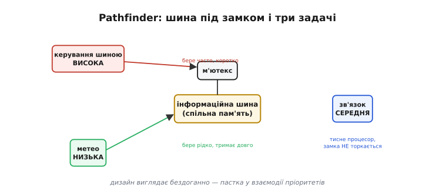
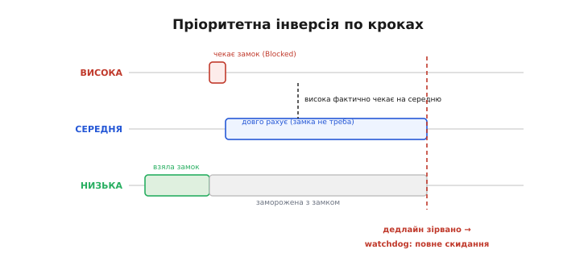

# 📜 Mars Pathfinder: пріоритетна інверсія за 190 мільйонів кілометрів

М'ютекс — простий на вигляд замок «один за раз»: одна задача всередині, решта чекають. Але та сама конструкція 1997 року мало не вбила найуспішнішу космічну місію десятиліття. Врятувало її саме **успадкування пріоритету** — той механізм, який розбирає вставка [⚙️ Успадкування пріоритету](root:sf-tasks/task-ipc/proj-priority-inheritance.md). Чому захищати спільні дані замком виявилося мало? Що замок мусить уміти ще — і яку ціну платять, коли це ігнорують? Відповідь летіла 190 мільйонів кілометрів, щоб приземлитися на Ares Vallis. Ця історія про те, як слова «власник» і «успадкування пріоритету» обернулися реальними наслідками в реальній місії.

4 липня 1997 року — День незалежності США — у ЦУП Лабораторії реактивного руху (JPL, NASA) в Пасадені нікого не відпустили додому. Апарат Mars Pathfinder сідав на Марс — і в ЦУП затамували подих. Посадка не схожа на жодну попередню: замість ретро-двигунів, що гальмують до останнього, апарат увійшов в атмосферу, розкрив парашут, надув навколо себе кілька подушок безпеки і впав на поверхню, відскочивши кілька разів, як тенісний м'яч. Потім усе змовкло. Команда чекала. А потім — сигнал. Станція приземлилася цілою. Апарат назвали Carl Sagan Memorial Station на честь астронома, що помер за шість місяців до посадки і все своє наукове життя мріяв про роботи на Марсі.

На борту станції сидів шестиколісний марсохід **Sojourner** — перший у світі позаземний ровер, названий на честь американської аболіціоністки та правозахисниці Соджорнер Трут. Він важив лише 10 кг і переміщався зі швидкістю до одного сантиметра за секунду. На перший погляд — іграшковий масштаб. Але Sojourner передавав знімки каміння, результати хімічного аналізу ґрунту й телеметрію з рухомих частин — усе те, за чим планетологи стежили з Пасадени з виразом дітей у день народження. Команда JPL планувала, що ровер попрацює тиждень, а станція — місяць. Місія несла прапор нової NASA — **Faster-Better-Cheaper**: дешевше й швидше замість грандіозних і дорогих проєктів попередніх десятиліть. Pathfinder коштував менш ніж чверть від типових місій до Марса. Перші дні були тріумфом.

Потім, десь на п'ятому-шостому **солі** (марсіанська доба — 24 години 37 хвилин), апарат почав **перезавантажуватися**. Не зависати, не мовчати — саме перезавантажуватися, гублячи весь напрацьований за день результат. У ЦУП бачили лише «total system reset» у телеметрії: система сама себе скидає, причина невідома. Планетологи втрачали зібрані вимірювання, інженери — голову від здивування. Апарат долетів до іншої планети й ніде не підвів — а тут спотикається без видимої причини.

Машина, що подолала 190 мільйонів кілометрів, зупинялася не через радіацію і не через марсіанський холод. Вона зупинялася через **порядок, у якому три програмні задачі брали один спільний замок**. Це і є пріоритетна інверсія — і вона ховалася рівно в тому [м'ютексі, що серіалізує обмін між задачами](root:sf-tasks/task-ipc). Щоб зрозуміти збій, треба спочатку побачити, як був влаштований «мозок» апарата.

---

## Архітектура мозку: інформаційна шина під замком

Pathfinder керувався комерційною операційною системою реального часу **VxWorks** компанії Wind River Systems — тією самою, що й сьогодні стоїть у супутниках, медичних пристроях і промисловому обладнанні. Польотним програмним забезпеченням керував **Гленн Рівз (Glenn Reeves)** з JPL. VxWorks — витісняюча RTOS із [пріоритетним планувальником](root:sf-os/scheduler): рівно той дизайн, де [незалежні задачі](root:sf-os/tasks) діляться процесором за пріоритетом.

Центральним елементом архітектури була **інформаційна шина** (*information bus*) — спільна ділянка оперативної пам'яті, через яку різні підсистеми апарата обмінювалися поточними даними: телеметрія, стан давачів, команди. Це не апаратна шина на кшталт SPI чи I²C — просто структура в пам'яті, спільна для всіх задач. Щоб кілька задач не записували туди одночасно й не читали наполовину оновлені дані, доступ до шини серіалізувався **м'ютексом** — точно тим механізмом «один за раз», що [захищає спільний ресурс між задачами](root:sf-tasks/task-ipc).

Навколо цієї шини оберталися три ключові задачі, що й утворили пастку.

Перша — **задача керування шиною** (*bus management task*) — мала **найвищий пріоритет** серед усіх задач на борту. Вона часто й коротко брала м'ютекс, щоб оновити або прочитати дані в шині. Критичні секції — короткі, але часті. Саме ця задача мала жорсткий дедлайн: вона мусила «відмічатися» через watchdog-таймер регулярно, інакше — повне скидання системи.

Друга — **метеозадача ASI/MET** (*Atmospheric Structure Instrument / Meteorology*) — відповідала за збір даних про атмосферний тиск, температуру й вітер на поверхні Марса. Наукові вимірювання — заради чого, власне, місія і летіла. Вона мала **найнижчий пріоритет** серед трьох і теж зверталася до тієї самої шини через той самий м'ютекс, але рідко — і коли брала замок, тримала його **довго**: потрібно було записати цілий пакет метеоданих.

Третя — задачі **зв'язку й обробки даних** — мали **середній пріоритет**. Вони не торкалися шинного м'ютекса взагалі: просто виконували тривалі обчислення й підготовку пакетів для передачі на Землю, активно споживаючи процесорний час. Саме ця «непричетність» до замка і стала ключовою деталлю: задача, що не торкається спільного ресурсу, опосередковано блокувала найважливішу систему на борту.

Погляньте на цю конфігурацію очима інженера RTOS: витісняючий планувальник, [м'ютекс на спільному ресурсі](root:sf-tasks/task-ipc), пріоритети розставлені за важливістю задач. Жодної екзотики — саме так і радять будувати систему підручники. У цьому й суть: **правильний на вигляд дизайн містив пастку** — і пастка ховалася не в окремій задачі, а в їхній взаємодії в часі.

Зверніть увагу на важливий факт: ніхто в команді не написав «неправильного» коду. Кожна задача поводиться рівно так, як і має: висока задача бере замок і чекає, якщо він зайнятий; низька тримає замок, поки не завершить свою роботу; середня просто виконується, коли має вищий пріоритет за поточну активну задачу. Весь механізм збою — у **взаємодії** цих трьох правильних поведінок у певній послідовності. Саме тому пріоритетна інверсія така підступна: її не знайти аналізом окремих задач — лише розглядом системи загалом.

*Інформаційна шина Pathfinder під м'ютексом і три задачі навколо неї: висока (керування шиною) і низька (метео) ділять один замок, середня (зв'язок) тисне процесор. Дизайн виглядає бездоганно правильним; пастка — у взаємодії пріоритетів.*

> 🔧 **Навіщо це.** Якщо у вашому проєкті є три задачі — висока і низька ділять спільний ресурс через замок, а середня активно з'їдає процесор, не торкаючись того замка, — перед вами класичний **трикутник ризику** пріоритетної інверсії. Розпізнавати цю конфігурацію важливо ще до першого запуску: вона виглядає бездоганно, але поводиться непередбачувано.

Тепер, коли видно трьох гравців і один замок, можна простежити фатальну послідовність покроково.

---

## Як народжується інверсія: крок за кроком

Пріоритетна інверсія — не аварія з видимою іскрою. Це тихе зміщення, що накопичується за мілісекунди і б'є із запізненням, коли вже пізно. Ось як вона народжувалася на Pathfinder.

**Крок 1.** Метеозадача (низька) прокидається за розкладом і бере м'ютекс шини. Вона починає тривалу операцію — запис пакета даних. М'ютекс зайнятий.

**Крок 2.** Поки низька задача сидить у критичній секції, **прокидається задача керування шиною** — найвища. Вона теж хоче м'ютекс. Але він зайнятий! За правилами [блокування задач](root:sf-os/tasks), висока задача **блокується** — переходить у стан Blocked і чекає, поки низька не звільнить замок. Це абсолютно правильна поведінка: саме так м'ютекс і мав працювати.

**Крок 3.** Поки висока задача спить на замку, **прокидається середня** задача зв'язку. Їй м'ютекс не потрібен — але вона важливіша за метеозадачу. [Витісняючий планувальник](root:sf-os/scheduler) чесно робить своє: витісняє низьку задачу і передає процесор середній. Низька задача замирає посередині критичної секції — із м'ютексом у руках, але без процесора.

**Крок 4.** Середня задача виконується. Довго. Вона обробляє і формує пакет для передачі — жодного дедлайну немає, вона просто рахує. Низька задача з замком не отримує процесора: за нею стоїть середня, що важливіша. Віддати замок і розблокувати високу вона не може.

**Підсумок.** Висока задача чекає на низьку. Низька не може завершити роботу, бо її витіснила середня. Отже, **висока фактично чекає на середню**, з якою вона не пов'язана ні замком, ні жодною залежністю. Пріоритети перевернулися: найвища задача зупинена через задачу середнього пріоритету. Це і є **пріоритетна інверсія** (*priority inversion*) — і на Pathfinder вона тривала стільки, скільки виконувалася середня задача.

Тут у сценарій входить [**сторожовий таймер**](root:sf-devices/watchdog) (*watchdog*). Задача керування шиною мала жорсткий дедлайн: вона мусила регулярно «відмічатися» — підтверджувати, що ще жива. Якщо вона не встигала відмітитися вчасно, watchdog вирішував, що критична задача зависла, і виконував **повне скидання системи** — рятівний рефлекс, якому доручили найважливіший ресурс. Watchdog робив рівно те, для чого створений. Але тут його «рятівний рефлекс» перетворювався на щоденну катастрофу: не підозрюючи про пріоритетну інверсію, він кожного разу скидав апарат, щойно ланцюжок затримок тривав надто довго.

*Пріоритетна інверсія по кроках: низька задача з замком віддає процесор середній, а висока спить на замку — отже, висока чекає на середню, з якою не пов'язана. Дедлайн високої зривається, watchdog робить повне скидання. Ось чому м'ютекс мусить уміти більше, ніж просто «один за раз».*

Підступність цього збою — в його **рідкісності й недетермінованості**. Щоб інверсія виникла, три події мусили збігтися в часі: низька задача саме тримає замок, висока щойно прокинулася й заблокувалася — і рівно в цей момент прокидається середня. Будь-яке незначне зміщення в розкладі — і ланцюжок не замикається. Той самий код із тими самими задачами за трохи іншого навантаження поводиться бездоганно; варто мікросекундам скластися інакше — і висока чекає нескінченно. Ось чому тест у лабораторії не гарантує відсутності проблеми: він лише підтверджує, що проблема не виникла за **конкретного** збігу обставин у конкретний день.

На Землі під час тестів команда бачила такий «невідтворюваний скид» один раз — і списала на апаратну дрібницю: лінія налагодження показувала якесь дивне поводження планувальника, але відтворити не вдалося. Це рівно та сама пастка, що коштувала жертв у Therac-25: баг, якого «не видно в лабораторії», стає смертельним у польових умовах за іншого збігу навантажень.

Якщо хвороба — у тому, що низька задача з замком може бути витіснена середньою, то ліки мають **не давати середній цю перевагу**, поки низька тримає замок.

---

## Ліки, що вже були в коробці: успадкування пріоритету

Рішення елегантне й відоме: **успадкування пріоритету** (*priority inheritance*). Логіка проста: якщо висока задача заблокована на замку, що тримає низька, — значить, від низької зараз залежить висока. Тому м'ютекс **тимчасово піднімає** пріоритет низької задачі до пріоритету тієї, що чекає. Поки низька тримає цей замок — вона для планувальника «рівня високої». Середня задача вже не може її витіснити. Низька швидко добігає до кінця критичної секції, віддає замок — і тут же повертає свій справжній, низький пріоритет назад. Висока задача розблоковується й іде.

Інверсія розривається. Висока задача чекає лише стільки, скільки потрібно низькій, щоб завершити критичну секцію, — а не стільки, скільки виконується середня. Затримка стає обмеженою й передбачуваною. Саме цього і вимагає реальний час: не «мінімальна затримка», а **відома максимальна затримка**, на яку можна покладатися при проєктуванні.

Важливо також побачити, що успадкування пріоритету не прибирає кооперацію — воно виправляє виключно аномалію. Якби середньої задачі між ними не було, висока і низька взаємодіяли б без проблем: низька тримала б замок рівно доти, поки треба, а висока чекала б лише цей час. Успадкування пріоритету повертає систему до цього природного стану навіть за наявності задач між ними.

Тут криється родзинка всієї історії: **VxWorks уже вмів це**. Успадкування пріоритету — вбудована опція м'ютекса VxWorks, увімкнена одним прапорцем при ініціалізації. Але для того конкретного м'ютекса, що захищав інформаційну шину, прапорець **виявився вимкненим** — за замовчуванням або задля мінімальних накладних витрат. Ліки лежали в коробці. Замок поруч. Лише один параметр — і на іншому боці 190 мільйонів кілометрів від Землі апарат щодня скидав себе.

Це не чиясь груба помилка. Це класична пастка систем реального часу: механізм є, але активований не там, де потрібно — і дає про себе знати лише за рідкісного збігу обставин, якого не відтворити на тестах.

Варто чесно назвати авторство теорії, що за цим стоїть. Протокол **успадкування пріоритету** (*Priority Inheritance Protocol*) і суміжний **протокол пріоритетної стелі** (*Priority Ceiling Protocol*) — це добре задокументована, опублікована наукова робота. Її авторами є **Луї Ша (Lui Sha)**, **Рагунатан «Радж» Раджкумар (Ragunathan «Raj» Rajkumar)** і **Джон П. Легоцкі (John P. Lehoczky)** з Університету Карнегі — Меллона: стаття в IEEE Transactions on Computers вийшла в 1990 році. Тобто ліки не вигадали в паніці за одну ніч — готова, математично обґрунтована теорія реального часу лежала в літературі за **сім років до місії**. Знати ці механізми — означає не наступати на відомі граблі.

> 🔧 **Навіщо це — для ESP32/FreeRTOS.** М'ютекс FreeRTOS, створений через `xSemaphoreCreateMutex()`, має успадкування пріоритету **вбудованим і увімкненим за замовчуванням** — саме тому для спільного ресурсу між задачами [беруть м'ютекс, а не бінарний семафор](root:sf-tasks/task-ipc) (`xSemaphoreCreateBinary`). Бінарний семафор не знає поняття «власник», не має успадкування і не захищає від інверсії. М'ютекс має все три. Ця різниця не абстрактна: вона відокремила Pathfinder від повного провалу місії.

Детальний механізм — як саме м'ютекс піднімає й повертає пріоритет і чому це не завжди рятує — у вставці [⚙️ Успадкування пріоритету](root:sf-tasks/task-ipc/proj-priority-inheritance.md).

Лишилося найдраматичніше — як той прапорець знайшли й перемкнули за десятки мільйонів кілометрів від Землі.

---

## Лагодити по радіо: як знайшли прапорець і ввімкнули його

Популярний переказ цієї частини зводиться до романтичного образу: «один геній за одну ніч знайшов баг, і місія була врятована». Це міф. Назвемо, що правда, а що спрощення.

Героєм тут була не одна людина, а **команда JPL під керівництвом Гленна Рівза**. Ключовим рятівним рішенням виявилося не натхнення в паніці, а те, що команда **залишила в польотному образі повноцінну діагностику** — ще під час розробки, коли ніхто не планував нею скористатися на Марсі.

У VxWorks є можливість журналювати події планувальника — яка задача запустилася, яка заблокувалася, коли змінився стан. Крім того, польотне ПЗ зберегло **консоль налагодження**, через яку можна читати внутрішні змінні системи і навіть змінювати їх **на льоту**, без перезапуску. Під час розробки це рішення виглядало як «зайва вага в польотному образі» — але саме воно виявилося різницею між провалом і успіхом.

Коли повторні скидання стали системними, команда зробила те, без чого будь-яка діагностика неможлива: **відтворила збій на Землі**. У JPL був **повний наземний дублікат** апарата — і команда налаштувала навантаження так, щоб відтворити марсіанський сценарій: три задачі з тим самим пріоритетним розкладом і тим самим таймінгом. Увімкнули трасування планувальника. І побачили: висока задача блокується на замку, середня займає процесор, низька стоїть із замком без шансу добігти. Класична пріоритетна інверсія.

Рівз описав ситуацію — і його команда розпізнала в ній те саме, що описала теорія Ша–Раджкумара–Легоцкі десятьма роками раніше. Виправлення виявилося радикально простим: не міняти алгоритм, не переписувати задачі — лише **перемкнути параметр ініціалізації м'ютекса**. Технічно це правка значення змінної в пам'яті живої системи через консоль VxWorks. Новий стан завантажили **по радіо** на борт — радіосигнал іде між Землею і Марсом від 3 до 22 хвилин залежно від положення планет — і виконали командою безпосередньо в запущеній системі, без перезавантаження.

Є ще один аспект, який варто назвати прямо. Команда виправила параметр у живій системі, але не могла ризикувати лише одним виправленням без перевірки: скидання могли мати й іншу природу. Тому паралельно з польотним виправленням наземний дублікат тримали під навантаженням із увімкненим успадкуванням — і спостерігали відсутність скидань. Лише після того, як обидва — і борт, і земля — показали стабільну роботу, команда підтвердила діагноз упевнено. Це методична робота, а не щасливий одиничний постріл у темряві.

Після ввімкнення успадкування пріоритету скидання **припинилися**. Місія, розрахована на тиждень для ровера й місяць для станції, відпрацювала значно довше: Carl Sagan Memorial Station передавала дані до вересня 1997 року — майже три місяці після посадки, — а останній зв'язок із Sojourner датується тим же місяцем. Повний збій телеметрії стався лише через поступовий розряд батарей і марсіанський холод, а не через програмний збій.

Що зробило таке виправлення можливим? Лише одне рішення, прийняте роками раніше: не прибирати засоби налагодження з польотного образу. Це рішення здавалося неочевидним у лабораторії. На Марсі воно стало різницею між «полагодили по радіо» і «втратили апарат».

---

## Що з цього винесла інженерія (і що це означає для вашого ESP32)

Pathfinder — не унікальний випадок, а класичний підручниковий зразок: він містить усі три типові помилки проєктування систем реального часу і всі три правильні відповіді на них, наочно показані в одній місії. Добре те, що все завершилося успіхом — і тому ми знаємо деталі. Більшість подібних збоїв зникають у непримітних сервісних перезавантаженнях вбудованих пристроїв, про які ніхто так і не напише звіту.

**М'ютекс — не просто замок «один за раз».** Для спільного ресурсу між задачами різних пріоритетів потрібен м'ютекс **з успадкуванням пріоритету**, а не голий бінарний семафор. Саме тому варто [наполегливо розрізняти семафор і м'ютекс](root:sf-tasks/task-ipc): семафор не знає власника, м'ютекс знає. Це не педантизм, а структурний захист від пріоритетної інверсії.

**Пріоритетна інверсія реальна й недетермінована.** Вона мовчить на тестах і б'є за рідкісного збігу навантажень — і якщо одного разу «не відтворилося», це не означає «немає». Її не ловлять постфактум — від неї захищаються **дизайном**: м'ютекс із успадкуванням там, де задачі різних пріоритетів ділять ресурс. Перегук з Therac-25: баг, якого не видно в лабораторії, рано чи пізно знаходить своє навантаження.

**Лишайте діагностику в релізі.** Трасування планувальника, журнал подій, можливість підглянути й змінити стан живої системи — це не «зайва вага», а різниця між «полагодили по радіо» і «втратили апарат». Для ESP32 це логування через UART, [watchdog](root:sf-devices/watchdog) з розбором причини скидання, хук переповнення стека FreeRTOS, можливість читати стан задач через `vTaskGetRunTimeStats()`.

**Watchdog рятує, але лікує симптом.** На Pathfinder watchdog кожного разу повертав апарат до життя — і саме це дало команді час знайти справжню причину. Але сам по собі він ховав корінь, а не усував його. Сторожовий таймер — остання сітка безпеки, а не заміна правильному дизайну. Якщо система регулярно скидається через watchdog — шукайте причину, а не збільшуйте таймаут.

**Теорія реального часу — не академічна забавка.** Протокол успадкування пріоритету (Ша–Раджкумар–Легоцкі, 1990) існував за сім років до місії. Якби команда JPL знала й застосувала його при виборі параметрів м'ютекса — збою не було б узагалі. Знати теорію планування реального часу означає не наступати на відомі граблі, описані в рецензованій літературі. Теорія реального часу написана саме для таких ситуацій — не щоб прикрасити дисертації, а щоб апарати не скидалися за 190 мільйонів кілометрів від Землі.

Ваш ESP32 не полетить на Марс. Але FreeRTOS у ньому несе той самий м'ютекс із тим самим успадкуванням пріоритету — і трикутник ризику «висока + низька ділять замок, середня тисне CPU» спрацює на ньому рівно так само, лише без watchdog у вигляді NASA і без команди з JPL на іншому кінці. Дисципліна «бери м'ютекс, а не семафор, для спільного ресурсу» — це не формальність. За нею стоїть апарат, що мало не замовк на іншій планеті через один вимкнений прапорець.
