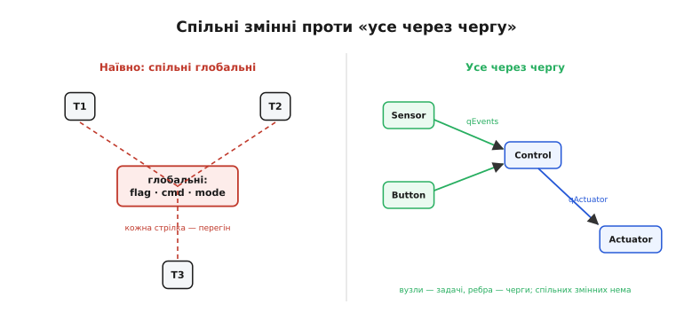
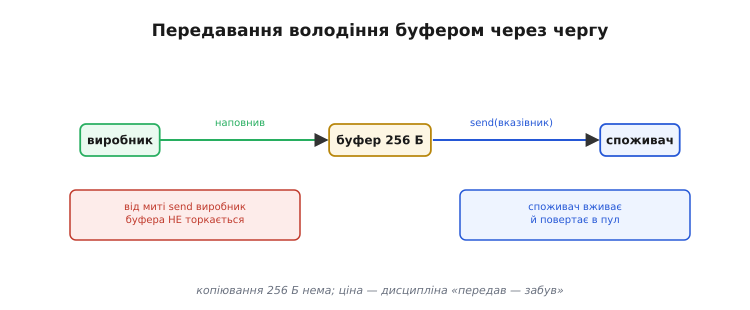

# ⚙️ Усе через чергу: producer–consumer без спільних змінних

Це вставка про **стиль мислення** в багатозадачності. Маючи в руках [чергу й уміння передати нею дані між двома задачами](topic:sf-tasks/task-ipc), пораду «чим менше спільного між задачами, тим безпечніше» можна довести до краю — прибрати спільний стан зовсім. Черга тоді стає єдиним місцем, де задачі зустрічаються, а кожна з них лишається простою послідовною програмою.

## Задача

Типова перша реакція на багатозадачність — завести кілька глобальних змінних, які задачі читають і пишуть «за домовленістю»: `volatile bool hasData` — прапорець «є нові дані»; `struct Cmd command` — структура-команда від кнопки до виконавця; `int mode` — поточний режим роботи пристрою. Здається зручно: усі бачать одне й те саме. Та кожна така змінна — мовчазне джерело [перегонів](topic:sf-devices/freertos): дві задачі можуть одночасно читати й писати її, і без м'ютекса результат невизначений. Тому до кожної змінної з'являється свій м'ютекс, до кожного м'ютекса — правила блокування, і архітектура обростає невидимими залежностями.

Проблема навіть не лише в перегонах як таких. Спільний стан **розмазує логіку** по всій системі: щоб зрозуміти, хто й коли змінює `mode`, треба тримати в голові всі задачі одночасно. Це повернення до того самого «спагеті», від якого тікали, [покинувши super-loop](root:embedded/super-loop-limits); тільки тепер спагеті не в `loop()`, а в мережі неявних залежностей між задачами. Задачу більше не можна читати як [окрему просту програму](topic:sf-os/tasks) — доводиться враховувати всіх, хто звертався до тієї самої змінної.

Питання вставки: чи можна збудувати багатозадачну систему, в якій задачі координуються **без жодної спільної змінної** — так, щоб кожну й далі читати як окрему просту послідовну програму?

## Ідея

Принцип називається «не діли пам'ять — передавай повідомлення» (share-nothing / message passing). Замість того щоб дві задачі **дивилися** на ту саму змінну, одна **кладе копію** в чергу, інша **бере** її звідти. У будь-який момент часу буфер даних **належить** рівно одній задачі: або виробникові, поки він його заповнює, або споживачеві — після того як черга передала. Разом із повідомленням «переїжджає» й **право доступу**. Звідси — немає спільного → немає перегонів → не потрібен м'ютекс на ці дані. М'ютекс лишається лише там, де без нього справді не обійтися: для неподільного заліза — шини SPI або I²C, де кілька задач розділяють одну фізичну периферію.

Але що саме передавати повідомленнями? Через чергу йдуть не лише вимірювання давача. **Будь-яка координація між задачами** може стати повідомленням: подія «кнопку натиснули», команда «увімкни реле», сигнал «змінився режим». Якщо закодувати це як єдиний тип із полем-тегом — `enum MsgType { MSG_SAMPLE, MSG_BUTTON, MSG_SETMODE }` у структурі `Msg` — то одна вхідна черга задачі стає її єдиним «поштовим ящиком». Сама задача перетворюється на цикл: «дістав повідомлення → обробив → повтори». Це і є **акторна модель** (actor model) у мініатюрі — кожна задача-актор знає лише власний стан і отримує ззовні тільки повідомлення.


*Ліворуч — наївна архітектура: задачі дивляться на спільні глобальні змінні (прапорець, структура-команда, режим), кожна стрілка-доступ — потенційний перегін і привід для м'ютекса. Праворуч — «усе через чергу»: задачі-вузли з'єднані ЛИШЕ чергами-ребрами; дані, події й команди передаються повідомленнями, спільних змінних немає зовсім.*

Якщо намалювати таку систему як граф, вузли — це задачі, ребра — черги. Стрілки завжди напрямлені: `taskSensor → qEvents → taskControl → qActuator → taskActuator`. Два виробники можуть надсилати в одну чергу — це «fan-in»: і `taskSensor`, і `taskButton` кидають повідомлення в `qEvents`, а `taskControl` розбирає звідти все підряд. Ключове: **жодної лінії «спільна змінна»** на цьому графі нема зовсім.

Ще одна властивість черги — розв'язка в часі (decoupling): виробник і споживач можуть мати різний ритм. [Розмір буфера й режими блокування](topic:sf-tasks/task-ipc) — окрема тема; тут важливе інше: коли черга порожня, споживач просто [спить і не займає процесор](topic:sf-os/tasks); коли черга повна, виробник або чекає, або явно відкидає надлишкове — залежно від обраної стратегії (повернемося до цього в «Складності»).

> 🔧 **Навіщо це.** Перш ніж завести спільну глобальну змінну між задачами, спитай: а чи не передати це повідомленням? Дев'яносто відсотків спільного стану зникає від такого питання, а разом із ним — перегони, м'ютекси на дані й найзагадковіші баги багатозадачності. Спільним лишай тільки те, що фізично не можна передати: неподільне залізо (шина) та константи лише для читання.

Де «усе через чергу» **не** є відповіддю? По-перше, неподільне залізо — там м'ютекс залишається. По-друге, сигнал «щось сталося» без жодних даних — там дешевший [task notification або семафор](topic:sf-tasks/task-ipc). По-третє, константи часу компіляції або дані лише для читання — їх ділити безпечно й без черги.

## Робочий код

### Як НЕ треба — «наївна» архітектура

*Показуємо, від чого тікаємо: глобальні змінні між задачами й приховані перегони.*

:::tabs
```cpp
// ─── антиприклад — НЕ робити так ────────────────────────────────────
volatile bool g_hasData   = false;   // ← перегін: Sensor пише, Control читає
volatile int  g_sample    = 0;       // ← перегін без м'ютекса
struct Cmd {
    bool  relayOn;
    uint8_t level;
} g_command;                         // ← перегін: Control пише, Actuator читає

// Якби боялись перегонів — довелось би ставити окремий м'ютекс
// на кожну зі змінних: SemaphoreHandle_t mx_data, mx_cmd;
// і брати/давати у кожній задачі. Це й є той «спагеті».

void taskSensor(void*) {
    for (;;) {
        g_sample  = analogRead(PIN_A);   // пише без захисту
        g_hasData = true;                // пише без захисту ← перегін!
        vTaskDelay(pdMS_TO_TICKS(100));
    }
}
void taskControl(void*) {
    for (;;) {
        if (g_hasData) {                 // читає без захисту ← перегін!
            g_hasData = false;
            g_command.relayOn = (g_sample > 512);   // пише без захисту
        }
        vTaskDelay(pdMS_TO_TICKS(10));
    }
}
```
```go
// ─── антиприклад — НЕ робити так ────────────────────────────────────
var gHasData bool // ← перегін: Sensor пише, Control читає
var gSample int   // ← перегін без м'ютекса

type Cmd struct {
    RelayOn bool
    Level   uint8
}

var gCommand Cmd // ← перегін: Control пише, Actuator читає

// Якби боялись перегонів — довелось би ставити окремий м'ютекс
// на кожну зі змінних: var mxData, mxCmd sync.Mutex
// і Lock/Unlock у кожній ґорутині. Це й є той «спагеті».

func taskSensor() {
    for {
        gSample = analogRead(pinA) // пише без захисту
        gHasData = true            // пише без захисту ← перегін!
        time.Sleep(100 * time.Millisecond)
    }
}

func taskControl() {
    for {
        if gHasData { // читає без захисту ← перегін!
            gHasData = false
            gCommand.RelayOn = gSample > 512 // пише без захисту
        }
        time.Sleep(10 * time.Millisecond)
    }
}
```
```python
# ─── антиприклад — НЕ робити так ────────────────────────────────────
g_has_data = False  # ← перегін: Sensor пише, Control читає
g_sample = 0        # ← перегін без м'ютекса

@dataclass
class Cmd:
    relay_on: bool = False
    level: int = 0

g_command = Cmd()   # ← перегін: Control пише, Actuator читає

# Якби боялись перегонів — довелось би ставити окремий м'ютекс
# на кожну зі змінних: mx_data, mx_cmd = Lock(), Lock()
# і брати/давати у кожному потоці. Це й є той «спагеті».

def task_sensor() -> None:
    global g_sample, g_has_data
    while True:
        g_sample = analog_read(PIN_A)  # пише без захисту
        g_has_data = True              # пише без захисту ← перегін!
        time.sleep(0.100)

def task_control() -> None:
    global g_has_data
    while True:
        if g_has_data:                 # читає без захисту ← перегін!
            g_has_data = False
            g_command.relay_on = g_sample > 512  # пише без захисту
        time.sleep(0.010)
```
:::

### Головне — усе через чергу

*`taskSensor` і `taskButton` — два виробники в одну `qEvents`; `taskControl` — споживач + виробник; `taskActuator` — кінцевий виконавець. Стан режиму — локальна змінна всередині `taskControl`, не глобальна.*

:::tabs
```cpp
// ─── тип повідомлення — єдиний «конверт» для будь-яких даних ─────────
enum MsgType : uint8_t { MSG_SAMPLE, MSG_BUTTON, MSG_SETMODE };
struct Msg {
    MsgType  type;
    int32_t  value;
};

// ─── черги — створюються один раз у setup() ──────────────────────────
static QueueHandle_t qEvents;    // fan-in: Sensor + Button → Control
static QueueHandle_t qActuator;  // Control → Actuator

// ─── PRODUCER 1: давач ────────────────────────────────────────────────
void taskSensor(void*) {
    for (;;) {
        Msg m{ MSG_SAMPLE, analogRead(PIN_A) };
        xQueueSend(qEvents, &m, portMAX_DELAY); // кладемо КОПІЮ — жодної спільної змінної
        vTaskDelay(pdMS_TO_TICKS(100));
    }
}

// ─── PRODUCER 2: кнопка (fan-in у ту саму qEvents) ───────────────────
void taskButton(void*) {
    for (;;) {
        if (digitalRead(PIN_BTN) == LOW) {
            Msg m{ MSG_BUTTON, 1 };
            xQueueSend(qEvents, &m, pdMS_TO_TICKS(5));
            vTaskDelay(pdMS_TO_TICKS(50));      // debounce
        }
        vTaskDelay(pdMS_TO_TICKS(10));
    }
}

// ─── CONSUMER + PRODUCER: логіка керування ───────────────────────────
void taskControl(void*) {
    static int mode = 0;  // ← стан ПРИВАТНИЙ всередині задачі, не глобальний!
                          //   жодного м'ютекса не потрібно
    for (;;) {
        Msg m;
        xQueueReceive(qEvents, &m, portMAX_DELAY);  // спить, поки немає пошти
        switch (m.type) {
            case MSG_SAMPLE:
                if (m.value > 512) {
                    Msg cmd{ MSG_SAMPLE, 1 };
                    xQueueSend(qActuator, &cmd, pdMS_TO_TICKS(10));
                }
                break;
            case MSG_BUTTON:
                mode = (mode + 1) % 3;
                break;
            case MSG_SETMODE:
                mode = (int)m.value;
                break;
        }
    }
}

// ─── CONSUMER: виконавець на залізі ──────────────────────────────────
void taskActuator(void*) {
    for (;;) {
        Msg m;
        xQueueReceive(qActuator, &m, portMAX_DELAY);
        // Якщо реле на спільній шині SPI — лише тут беремо м'ютекс на шину
        // xSemaphoreTake(busMutex, portMAX_DELAY);
        digitalWrite(PIN_RELAY, m.value ? HIGH : LOW);
        // xSemaphoreGive(busMutex);
    }
}

// ─── Ініціалізація ────────────────────────────────────────────────────
void setup() {
    qEvents   = xQueueCreate(8, sizeof(Msg));
    qActuator = xQueueCreate(4, sizeof(Msg));
    configASSERT(qEvents && qActuator);

    xTaskCreate(taskSensor,   "Sensor",   2048, NULL, 2, NULL);
    xTaskCreate(taskButton,   "Button",   1024, NULL, 2, NULL);
    xTaskCreate(taskControl,  "Control",  2048, NULL, 3, NULL);
    xTaskCreate(taskActuator, "Actuator", 1536, NULL, 4, NULL);
}
void loop() { vTaskDelay(portMAX_DELAY); }
// ЖОДНОЇ спільної змінної між задачами — лише черги.
// Кожну задачу читаємо як окрему просту послідовну програму.
```
```go
// ─── тип повідомлення — єдиний «конверт» для будь-яких даних ─────────
type MsgType uint8

const (
    MsgSample MsgType = iota
    MsgButton
    MsgSetMode
)

type Msg struct {
    Type  MsgType
    Value int32
}

// ─── PRODUCER 1: давач ────────────────────────────────────────────────
func taskSensor(qEvents chan<- Msg) {
    for {
        qEvents <- Msg{MsgSample, analogRead(pinA)} // канал передає КОПІЮ — жодної спільної змінної
        time.Sleep(100 * time.Millisecond)
    }
}

// ─── PRODUCER 2: кнопка (fan-in у ту саму qEvents) ───────────────────
func taskButton(qEvents chan<- Msg) {
    for {
        if digitalRead(pinBtn) == low {
            qEvents <- Msg{MsgButton, 1}
            time.Sleep(50 * time.Millisecond) // debounce
        }
        time.Sleep(10 * time.Millisecond)
    }
}

// ─── CONSUMER + PRODUCER: логіка керування ───────────────────────────
func taskControl(qEvents <-chan Msg, qActuator chan<- Msg) {
    mode := 0 // ← стан ПРИВАТНИЙ всередині ґорутини, не глобальний!
    //            жодного м'ютекса не потрібно
    for m := range qEvents { // спить, поки немає пошти
        switch m.Type {
        case MsgSample:
            if m.Value > 512 {
                qActuator <- Msg{MsgSample, 1}
            }
        case MsgButton:
            mode = (mode + 1) % 3
        case MsgSetMode:
            mode = int(m.Value)
        }
    }
}

// ─── CONSUMER: виконавець на залізі ──────────────────────────────────
func taskActuator(qActuator <-chan Msg) {
    for m := range qActuator {
        // Якщо реле на спільній шині SPI — лише тут беремо м'ютекс на шину
        // busMutex.Lock()
        digitalWrite(pinRelay, m.Value != 0)
        // busMutex.Unlock()
    }
}

// ─── Ініціалізація ────────────────────────────────────────────────────
func main() {
    qEvents := make(chan Msg, 8) // fan-in: Sensor + Button → Control
    qActuator := make(chan Msg, 4) // Control → Actuator

    go taskSensor(qEvents)
    go taskButton(qEvents)
    go taskControl(qEvents, qActuator)
    go taskActuator(qActuator)
    select {} // блокуємось назавжди

    // ЖОДНОЇ спільної змінної між ґорутинами — лише канали.
    // Кожну ґорутину читаємо як окрему просту послідовну програму.
}
```
```python
import queue
import threading
import time
from dataclasses import dataclass
from enum import IntEnum

# ─── тип повідомлення — єдиний «конверт» для будь-яких даних ─────────
class MsgType(IntEnum):
    SAMPLE = 0
    BUTTON = 1
    SETMODE = 2

@dataclass
class Msg:
    type: MsgType
    value: int

# ─── PRODUCER 1: давач ────────────────────────────────────────────────
def task_sensor(q_events: "queue.Queue[Msg]") -> None:
    while True:
        q_events.put(Msg(MsgType.SAMPLE, analog_read(PIN_A)))  # кладемо об'єкт — жодної спільної змінної
        time.sleep(0.100)

# ─── PRODUCER 2: кнопка (fan-in у ту саму q_events) ──────────────────
def task_button(q_events: "queue.Queue[Msg]") -> None:
    while True:
        if digital_read(PIN_BTN) == LOW:
            q_events.put(Msg(MsgType.BUTTON, 1))
            time.sleep(0.050)  # debounce
        time.sleep(0.010)

# ─── CONSUMER + PRODUCER: логіка керування ───────────────────────────
def task_control(q_events: "queue.Queue[Msg]", q_actuator: "queue.Queue[Msg]") -> None:
    mode = 0  # ← стан ПРИВАТНИЙ всередині потоку, не глобальний!
    #            жодного м'ютекса не потрібно
    while True:
        m = q_events.get()  # спить, поки немає пошти
        if m.type == MsgType.SAMPLE:
            if m.value > 512:
                q_actuator.put(Msg(MsgType.SAMPLE, 1))
        elif m.type == MsgType.BUTTON:
            mode = (mode + 1) % 3
        elif m.type == MsgType.SETMODE:
            mode = m.value

# ─── CONSUMER: виконавець на залізі ──────────────────────────────────
def task_actuator(q_actuator: "queue.Queue[Msg]") -> None:
    while True:
        m = q_actuator.get()
        # Якщо реле на спільній шині SPI — лише тут беремо м'ютекс на шину
        # with bus_lock:
        digital_write(PIN_RELAY, bool(m.value))

# ─── Ініціалізація ────────────────────────────────────────────────────
def main() -> None:
    q_events: "queue.Queue[Msg]" = queue.Queue(maxsize=8)   # fan-in: Sensor + Button → Control
    q_actuator: "queue.Queue[Msg]" = queue.Queue(maxsize=4) # Control → Actuator

    for target, args in (
        (task_sensor, (q_events,)),
        (task_button, (q_events,)),
        (task_control, (q_events, q_actuator)),
        (task_actuator, (q_actuator,)),
    ):
        threading.Thread(target=target, args=args, daemon=True).start()

    threading.Event().wait()  # блокуємось назавжди

# ЖОДНОЇ спільної змінної між потоками — лише черги.
# Кожен потік читаємо як окрему просту послідовну програму.
```
:::

### Передавання великих буферів вказівником

*Коли копіювання дороге — у чергу кладуть вказівник. Виробник після `send` назавжди «забуває» буфер — власником тепер стає споживач.*

```cpp
// ─── власний пул фіксованих буферів (краще за malloc/free —
//     причини: фрагментація купи) ────────────────────────────────
struct Frame { uint8_t data[256]; uint16_t len; };
static StaticQueue_t   poolSQ;
static uint8_t         poolBuf[4 * sizeof(Frame*)];
static QueueHandle_t   framePool;   // черга вільних вказівників

// PRODUCER: взяти з пулу, заповнити, передати
void taskADC(void*) {
    for (;;) {
        Frame* f = NULL;
        xQueueReceive(framePool, &f, portMAX_DELAY); // чекаємо вільний слот
        // заповнюємо буфер
        f->len = spi_read(f->data, sizeof(f->data));
        // send ТІЛЬКИ вказівника — копіювання 256 байт не відбувається
        xQueueSend(qFrames, &f, portMAX_DELAY);
        f = NULL;   // ← виробник «забуває» вказівник: більше не торкається
    }
}

// CONSUMER: прийняти вказівник, вжити, повернути у пул
void taskProcessor(void*) {
    for (;;) {
        Frame* f = NULL;
        xQueueReceive(qFrames, &f, portMAX_DELAY);
        process(f->data, f->len);
        xQueueSend(framePool, &f, 0); // повернули у пул; f тепер NULL у нас
    }
}
```


*Передавання володіння великим буфером через чергу вказівником: виробник наповнив буфер і поклав у чергу лише вказівник; від миті `send` він буфера НЕ торкається — володіння «переїхало» до споживача, який його вживає й повертає в пул. Так уникаємо дорогого копіювання, але платимо дисципліною «передав — забув».*

## Складність і пастки на МК

- **Переповнення черги — тиха втрата або зависання.** Глибину черги [розраховуйте під найгірший сплеск вхідних подій](topic:sf-tasks/task-ipc). Явно обирайте стратегію на повну чергу: `portMAX_DELAY` — виробник засне й підвисне, якщо споживач не встигає; `0` — нове повідомлення буде відкинуто; пул із власною чергою — буде витіснено найстаріше. Жодна з цих стратегій не «правильна» сама по собі, але стратегія замовчування рівно одна: виробник чекає вічно.

- **Черга копіює і витрачає RAM.** `xQueueCreate(n, sizeof(Msg))` виділяє `n × sizeof(Msg)` байтів [із купи](topic:sf-lang/task-stacks). Великі структури у `Msg` роздмухують цю область. Якщо елемент більший за кілька десятків байтів — передавайте **вказівником** (блок C), а не значенням, і обов'язково використовуйте пул замість `malloc`, щоб уникнути фрагментації купи.

- **Власник вказівника — «передав і забув».** Після `xQueueSend(q, &ptr, …)` виробник **не має права** читати або писати той буфер. Якщо він це зробить — повертається перегін, підступніший за прямий: помилки у вигляді «зіпсованих даних» будуть украй нерегулярними. Подвійний `free` (і виробник, і споживач звільняють буфер) — негайний крах. Дисципліна одна: відправив — присвоїв `NULL` — забув.

- **З ISR — тільки `xQueueSendFromISR`.** Стандартний `xQueueSend` в [обробнику переривань](topic:hw-arch/isr) може підвісити планувальник — лише варіанти `…FromISR` безпечні в контексті ISR; після них за потреби переключіть контекст через `portYIELD_FROM_ISR`.

- **Не плутайте засоби.** «Усе через чергу» стосується **даних і команд**. Сигнал «подія сталася» без жодних даних — семафор або task notification, вони дешевші за чергу. Неподільне залізо (шина) — м'ютекс. Замінювати одне одним без причини — і дорожче, і незрозуміліше.

- **Дедлок через зустрічні черги.** Якщо задача A блокувально надсилає в повну чергу задачі B, а B водночас блокувально надсилає в повну чергу A — вони взаємно застигають. Тримайте потік даних переважно **односпрямованим**; для відповіді на запит заводьте **окрему** чергу або task notification, а не зворотний блокувальний `send`.

## Підсумок

«Усе через чергу» — це доведення поради «менше спільного» до нуля спільного: дані, події й команди передаються повідомленнями, право доступу до буфера переходить разом із ними, а кожна задача лишається простою послідовною програмою з одним «поштовим ящиком». Ціна — [пам'ять під черги й стеки задач](topic:sf-lang/task-stacks) і сувора дисципліна власника вказівника; виграш — зникають перегони, м'ютекси на дані й найзагадковіші баги багатозадачності.
