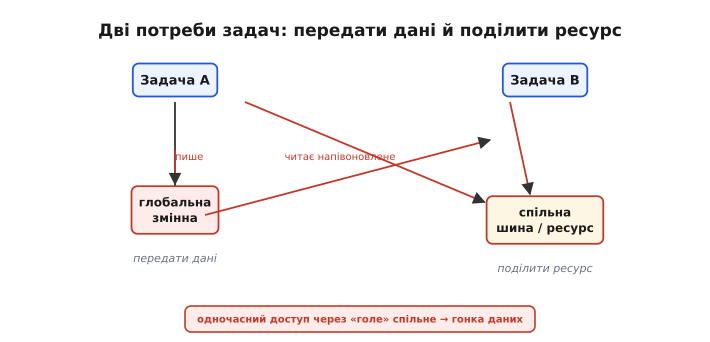
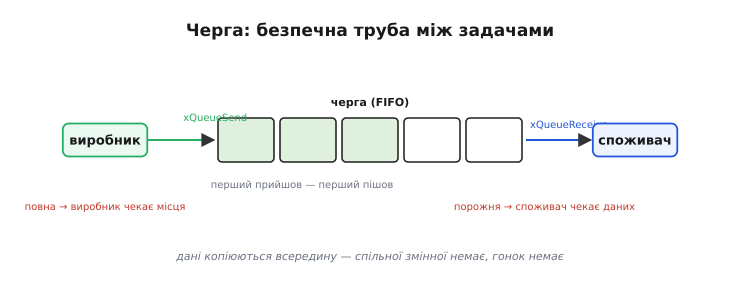
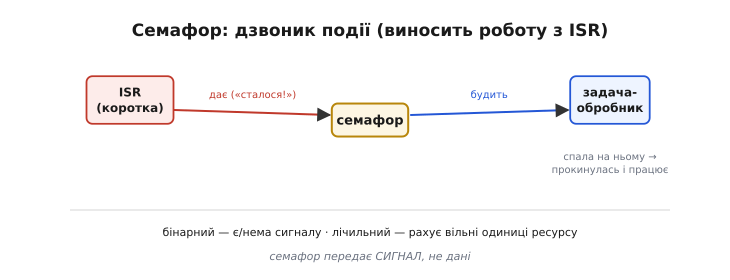
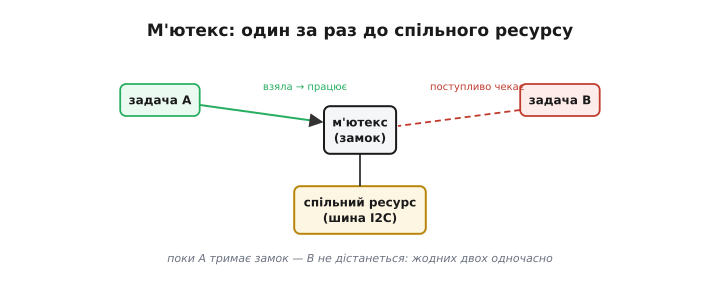
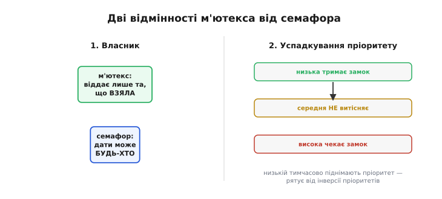
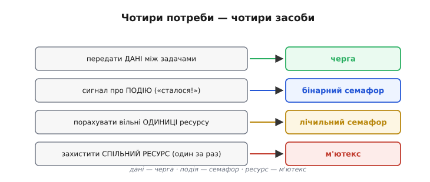

# Обмін між задачами: черги, семафори, м'ютекси

Незалежні задачі — це чудово. Та цілком ізольованими вони бути не можуть: одна читає давач, а інша має ці виміри показати; одна приймає команду по мережі, а інша її виконує; кілька задач діляться однією шиною чи однією змінною. А ділити «голі» спільні змінні наосліп — пряма дорога до **гонок даних**. Тому [RTOS](root:sf-devices/freertos) дає готові, **безпечні** засоби спілкування й поділу між задачами — те, що загально звуть **міжзадачним обміном** (англ. *inter-process communication*, IPC, дослівно «обмін між процесами»). Усі вони мають дві спільні чесноти: вони **поступливі** (задача, що чекає на них, блокується, не зупиняючи інших) і **захищені** від гонок. Три з них — головні: черга, семафор і м'ютекс.

### Проблема: спілкуватися треба безпечно

Спершу чітко окреслимо, що саме задачам потрібно одна від одної. По суті, дві речі: **передати дані** (відлік, команду, повідомлення) і **поділити ресурс** (одну шину I2C чи SPI, одну периферію, одну спільну змінну). І те, і те «голими» змінними робиться небезпечно.


*Задачам треба і передати дані, і поділити спільний ресурс. Робити це через «голу» спільну змінну небезпечно: одночасний доступ дає гонку. RTOS пропонує натомість безпечні засоби — чергу, семафор і м'ютекс, усі поступливі й захищені від гонок.*

Чому ж не можна просто покласти дані у звичайну глобальну змінну, щоб інша задача їх звідти взяла? Бо без захисту дві задачі (а надто на двох ядрах) можуть торкнутися її **одночасно**: одна пише, інша читає напівоновлене — і дістає сміття. Потрібен механізм, що або **передає** дані атомарно (без спільної змінної взагалі), або **впорядковує** доступ до спільного (щоб ніколи не було двох одночасно). Перше дає черга, друге — м'ютекс; а семафор стоїть поряд як засіб **сигналити** про події.

Це та сама біда, що чигає між циклом і перериванням — [гонка за спільні дані](root:sf-tasks/atomicity-races), — лише тепер між рівноправними задачами, а на двох ядрах іще й по-справжньому одночасна. Між циклом і ISR від неї рятує критична секція (на мить вимикають переривання); для задач цей прийом не годиться — їх багато й вони незалежні. Тому RTOS і дає засоби вищого рівня, що роблять доступ **атомарним** (неподільним) без грубого глушіння всієї системи.

### Черга: безпечно передати дані

**Черга** (англ. *queue* — «черга, хвіст») — найчистіший спосіб передати дані між задачами. Це безпечна труба, що працює за принципом «перший прийшов — перший пішов» (FIFO, *first in, first out*): одна задача-**виробник** кладе в неї елементи (`xQueueSend`), інша задача-**споживач** їх звідти бере (`xQueueReceive`). Найважливіше: черга **копіює** дані всередину себе, тож спільної змінної, яку можна було б зіпсувати, просто немає.


*Черга — безпечна FIFO-труба між задачами. Виробник кладе дані, споживач бере. Порожня черга — споживач поступливо чекає, доки щось прийде; повна — виробник чекає місця. Дані копіюються, тож гонок немає, а виробник і споживач біжать кожен у своєму ритмі.*

Черга приваблює одразу кількома речами. Вона **безпечна**: усю синхронізацію RTOS бере на себе, і про гонки думати не треба. Вона **поступлива**: коли черга порожня, споживач не крутиться в очікуванні, а чесно блокується (віддає процесор), доки виробник щось не покладе; коли черга повна, чекає вже виробник. І вона **розв'язує задачі в часі**: виробник може видавати дані ривками, а споживач — обробляти їх рівномірно; черга згладжує різницю їхніх ритмів, як буфер. Саме тому передавати дані між задачами майже завжди варто **через чергу**, а не через спільну змінну.

Створюючи чергу, ви задаєте дві речі: **скільки** елементів вона вміщає і якого вони **розміру**. Глибина черги — це і є той буфер, що згладжує ривки: більша черга стерпить довші сплески від виробника, та й пам'яті з'їсть більше. Ця проста пара «виробник кладе — споживач бере» зветься патерном **виробник-споживач** і є, мабуть, найуживанішою схемою багатозадачних систем: нею передають відліки давачів, мережеві пакети, події інтерфейсу — будь-який потік даних від того, хто його породжує, до того, хто його споживає.

> 🔧 **Навіщо це.** Головне правило обміну: **треба передати дані між задачами — бери чергу**, а не глобальну змінну. Класичний приклад — задача читає давач і кладе відліки в чергу, а задача-обробник їх звідти забирає й малює графік. Жодної спільної змінної, жодних гонок, і обидві задачі прості та незалежні. Черга — це той «поштовий канал», що дає змогу задачам спілкуватися, лишаючись розв'язаними. Як довести цей принцип до краю — прибрати спільні змінні взагалі — показано у вставці [⚙️ Усе через чергу](root:sf-tasks/task-ipc/proj-queue-pattern.md).

### Семафор: подати сигнал про подію

Інколи передавати дані й не треба — досить **сигналу**, що «сталася подія». Для цього є **семафор** (англ. *semaphore*, від грец. *sēma* — «знак» і *phoros* — «носій»; дослівно «знаконосій» — як той флотський сигнальник прапорцями, що подає знак, а не передає вантаж). **Бінарний семафор** — це по суті дзвоник: одна сторона його «дає» (сигналить), а інша на нього «чекає» (спить, доки не подзвонять).


*Бінарний семафор — «дзвоник» події. Коротка ISR лише дає семафор («сталося!») і миттю виходить, а задача-обробник, що спала на ньому, прокидається й робить важку роботу. Так переривання лишається блискавичним, а обробка йде в задачі. Лічильний семафор схожий, але рахує вільні одиниці ресурсу.*

Найкласичніше застосування семафора виростає з правила «[**ISR має бути коротка**](root:hw-arch/isr)»: обробник переривання лише схоплює подію і виходить. Семафор показує, **куди** піти: ISR, зафіксувавши подію (натискання, прихід байта), лише **дає** семафор — і миттю завершується; а спеціальна задача-обробник, що **чекала** (спала) на цьому семафорі, прокидається й робить усю важку роботу вже поза перериванням. Це зветься **відкладеним опрацюванням переривання**, і семафор — його природний інструмент. Поряд із бінарним є й **лічильний семафор**: він не просто «є/нема», а **рахує**, скільки одиниць ресурсу зараз вільно (взяв — на одну менше, дав — на одну більше, нуль — чекай). Та головне: семафор передає **сигнал**, а не дані; коли потрібні самі дані — це робота черги.

Поряд із семафором стоїть і його легша рідня — **сповіщення задачі** (англ. *task notification*). Це швидший і ощадніший спосіб подати задачі простий сигнал «прокинься» безпосередньо, без окремого об'єкта-семафора. У сучасному FreeRTOS саме сповіщення часто радять для будіння задачі з переривання — воно робить те саме, що бінарний семафор, лише дешевше. Принцип той самий, тож, маючи в руках семафор, ви легко опануєте й сповіщення, коли воно знадобиться.

### М'ютекс: один за раз до спільного ресурсу

Третя потреба — **поділити спільний ресурс** так, щоб ним користувалися не водночас, а по черзі. Для цього є **м'ютекс** (англ. *mutex*, скорочення від *mutual exclusion* — «взаємне виключення») — замок, що допускає до ресурсу лише одну задачу за раз.


*М'ютекс — як «паличка, що дає право говорити». Задача A бере замок, користується спільним ресурсом (скажімо, шиною I2C) і віддає замок; задача B, що теж хоче ресурс, поступливо чекає, доки A не звільнить. Жодних двох одночасно — отже, й жодної гонки.*

Працює це просто: задача, перш ніж торкнутися спільного ресурсу, **бере** м'ютекс (`xSemaphoreTake`); якщо він вільний — бере й користується, якщо зайнятий — поступливо чекає. Скінчивши, **віддає** м'ютекс (`xSemaphoreGive`), і тоді його дістає наступний охочий. Поки одна задача тримає замок, жодна інша до ресурсу не дістанеться. Це і є багатозадачний відповідник [**критичної секції**](root:sf-tasks/atomicity-races): ділянка, де може працювати лише хтось один. М'ютексом захищають спільну шину (I2C, SPI, якою користуються кілька задач), спільну периферію, спільну структуру даних — усе, що зламалося б від одночасного доступу.

З м'ютексами пов'язана й власна пастка — **взаємне блокування** (англ. *deadlock* — «мертвий затор»). Воно стається, коли дві задачі тримають по одному замку й кожна чекає на замок іншої: жодна не поступиться, і обидві застигають назавжди. Класична профілактика проста: тримайте замки **недовго**, не беріть кількох замків одночасно без потреби, а якщо вже доводиться — завжди в **однаковому порядку** в усіх задачах. Більшість дедлоків — наслідок саме безладного захоплення кількох замків нараз.

> ⚙️ Чотири умови дедлоку й дисципліна порядку захоплення — у вставці [⚙️ Дедлок: чотири умови Коффмана](root:sf-tasks/task-ipc/proj-deadlock.md).

> 🔧 **Навіщо це.** Якщо кілька задач користуються **одним** ресурсом — шиною, дисплеєм, файлом, складною спільною змінною, — обгорніть кожне звертання до нього парою «взяти м'ютекс → попрацювати → віддати м'ютекс». Це найдешевша страховка від найзагадковіших багатозадачних збоїв, коли дві задачі влізли в одну шину водночас і обидві дістали кашу. Лише не тримайте замок **довго**: узяли, швидко зробили потрібне, віддали — інакше решта задач даремно чекатимуть.

### М'ютекс проти семафора: власник і успадкування пріоритету

Може здатися, що м'ютекс — це той самий бінарний семафор (теж «взяти/віддати»). Та між ними дві важливі відмінності, через які м'ютекс і є правильним для захисту ресурсу.


*Дві відмінності м'ютекса від семафора. Власник: замок віддає лише та задача, що його взяла (семафор може дати будь-хто). Успадкування пріоритету: поки низькопріоритетна задача тримає замок, на який чекає високопріоритетна, їй тимчасово піднімають пріоритет — щоб вона швидше доробила й розблокувала. Це рятує від інверсії пріоритетів.*

Перша відмінність — **власник**: м'ютекс віддати може лише та задача, що його взяла (це логічно для замка), тоді як семафор-сигнал може дати будь-хто. Друга, тонша, — **успадкування пріоритету** (англ. *priority inheritance*), і вона лікує підступну ваду під назвою **інверсія пріоритетів** (англ. *priority inversion* — «перевертання пріоритетів»). Уявіть: низькопріоритетна задача взяла замок; високопріоритетна хоче той самий замок і чекає; аж тут середньопріоритетна витісняє низьку — і виходить, що **середня** задача не дає низькій доробити, а отже, блокує й **високу**. Високопріоритетна задача голодує через задачу, важливішу за низьку, але **менш** важливу за неї саму — це й є інверсія. Успадкування пріоритету вирішує це елегантно: поки низька тримає потрібний високій замок, їй **тимчасово піднімають** пріоритет до високого, тож її ніхто не витісняє, вона швидко доробляє й звільняє замок.

Це не книжкова вигадка: на ній колись «спіткнувся» космос. 1997 року марсіанський апарат **Mars Pathfinder** раз по раз самостійно перезавантажувався вже на Марсі — і причиною виявилася саме **інверсія пріоритетів** на одному з м'ютексів. Інженери NASA віддалено ввімкнули успадкування пріоритету — і апарат запрацював як слід. Тож ця, здавалося б, дрібна відмінність м'ютекса від семафора колись рятувала місію на іншій планеті; саме тому для захисту ресурсу беруть **м'ютекс**, а не бінарний семафор. Уся ця історія — у вставці [📜 Mars Pathfinder](root:sf-tasks/task-ipc/hist-pathfinder.md), а механіка успадкування крок за кроком — у [⚙️ Успадкування пріоритету](root:sf-tasks/task-ipc/proj-priority-inheritance.md).

### Що коли обирати

Зведімо все в просту мапу рішень, щоб не плутати засоби.


*Чотири потреби — чотири засоби. Передати дані між задачами — черга. Сигнал про подію («сталося!») — бінарний семафор. Порахувати вільні одиниці ресурсу — лічильний семафор. Захистити спільний ресурс (один за раз) — м'ютекс.*

Це правило вибору варто запам'ятати, бо саме плутанина між засобами — найчастіша помилка початківця в RTOS. Коротко: **дані — черга; подія — семафор; ресурс — м'ютекс**. Передаєте відліки давача іншій задачі — черга. Будите задачу з переривання — бінарний семафор. Стежите, скільки вільних місць у буфері — лічильний семафор. Захищаєте спільну шину від двох задач — м'ютекс. Звикнувши щоразу питати «що мені треба — передати дані, подати сигнал чи захистити ресурс?», ви майже завжди одразу доберете правильний інструмент.

І остання, найважливіша порада: **найкращий обмін — це якомога менше спільного**. Що менше спільного стану між задачами, то менше потрібно замків, то менше нагод для гонок і дедлоків. Тому добрий дизайн прагне не «захистити всі спільні змінні», а **позбутися** більшості з них — передавати дані чергами, а не тримати їх у глобальних змінних. Менше спільного — простіша, надійніша й зрозуміліша система; це, мабуть, головна мудрість усієї багатозадачності.

**Виробник-споживач через чергу, зі спільною шиною під м'ютексом.**

:::tabs
```c
QueueHandle_t    q;          // черга відліків давача
SemaphoreHandle_t busMutex;  // замок на спільну шину дисплея

void taskSensor(void *p) {                 // ВИРОБНИК
    for (;;) {
        int v = readSensor();
        xQueueSend(q, &v, portMAX_DELAY);      // безпечно передали відлік (копія)
        vTaskDelay(pdMS_TO_TICKS(100));
    }
}

void taskLog(void *p) {                    // СПОЖИВАЧ
    for (;;) {
        int v;
        xQueueReceive(q, &v, portMAX_DELAY);            // чекаємо й беремо (блок)
        xSemaphoreTake(busMutex, portMAX_DELAY);        // ← зайняли спільну шину
        writeToDisplay(v);                              //   працюємо з нею
        xSemaphoreGive(busMutex);                       // ← звільнили шину
    }
}
```
```python
import queue, threading, time

q = queue.Queue()          # черга відліків давача
bus_lock = threading.Lock()  # замок на спільну шину дисплея

def task_sensor():                          # ВИРОБНИК
    while True:
        v = read_sensor()
        q.put(v)                            # безпечно передали відлік (копія)
        time.sleep(0.1)

def task_log():                             # СПОЖИВАЧ
    while True:
        v = q.get()                         # чекаємо й беремо (блок)
        with bus_lock:                      # ← зайняли спільну шину
            write_to_display(v)             #   працюємо з нею
                                            # ← замок звільнено на виході з with
```
```go
q := make(chan int)     // черга відліків давача
var busMutex sync.Mutex // замок на спільну шину дисплея

func taskSensor() { // ВИРОБНИК
    for {
        v := readSensor()
        q <- v // безпечно передали відлік (копія)
        time.Sleep(100 * time.Millisecond)
    }
}

func taskLog() { // СПОЖИВАЧ
    for {
        v := <-q          // чекаємо й беремо (блок)
        busMutex.Lock()   // ← зайняли спільну шину
        writeToDisplay(v) //   працюємо з нею
        busMutex.Unlock() // ← звільнили шину
    }
}
```
:::

Дані з давача йдуть **через чергу** (жодної спільної змінної), а спільну шину дисплея береже **м'ютекс** (ніколи двох одночасно). Дві задачі співпрацюють, не заважаючи одна одній і без жодної гонки — і, що важливо, кожну з них досі можна читати окремо, як просту послідовну програму: уся складність їхньої взаємодії охайно прихована у двох надійних засобах RTOS (черзі й м'ютексі), а не розмазана плутаниною прапорців по всьому коду.

Отже, RTOS перетворює небезпечне «голе» ділення даних на безпечну, структуровану взаємодію: **черга** передає дані, **семафор** сигналить про події (і виносить роботу з ISR), **м'ютекс** береже спільний ресурс, рятуючи ще й від інверсії пріоритетів. З цими засобами задачі можуть і працювати незалежно, і злагоджено співпрацювати. Поряд лишаються ще два практичні питання надійної багатозадачності: скільки пам'яті відвести під [стек кожної задачі](root:sf-lang/task-stacks) — і як зробити так, щоб усе це працювало не просто «якось», а [**гарантовано вчасно**](root:sf-tasks/realtime-determinism).
