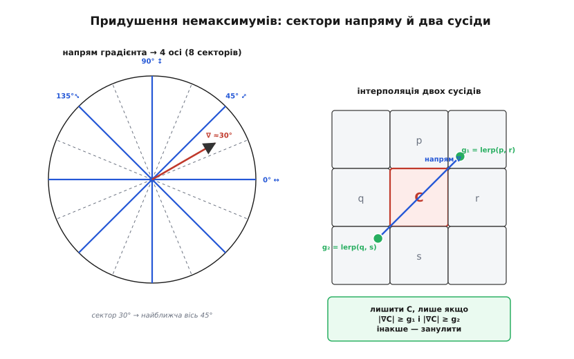
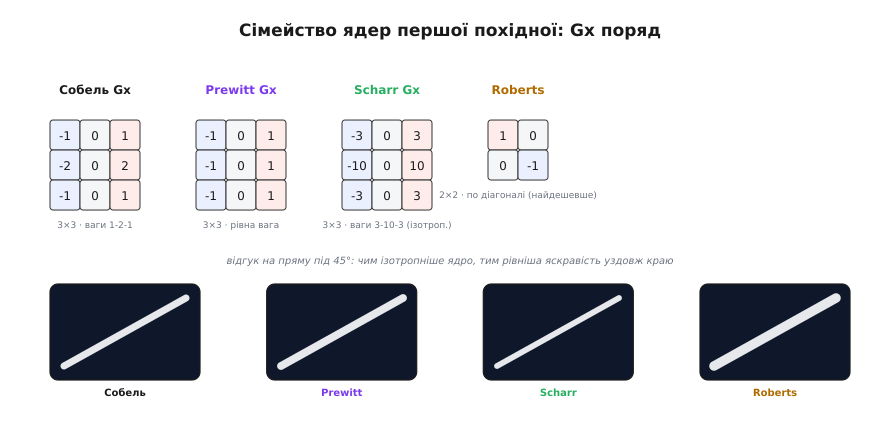
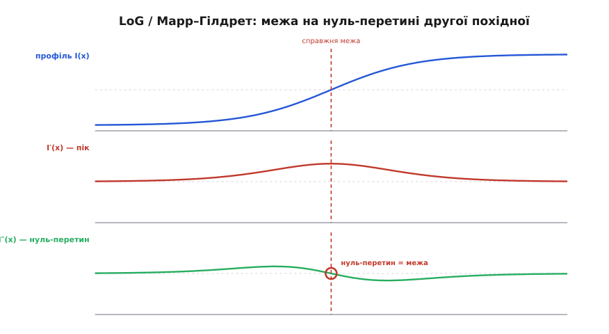
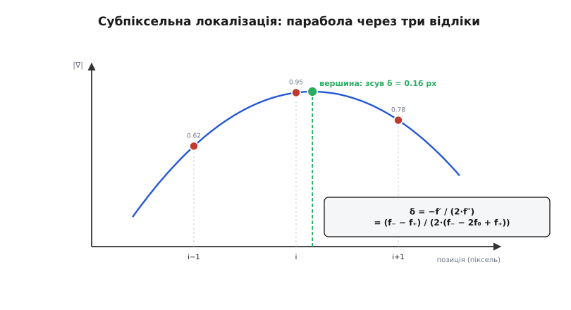

# Виділення меж: глибше

Базовий погляд на межі простий: межа — це місце різкої зміни яскравості, тобто великий [градієнт](topic:math-analysis/derivative), а порахувати його можна [згорткою](topic:sf-visual/convolution-filters) з ядром-похідною (Собель), або, для чистих контурів, конвеєром Канні. Цього досить, щоб дістати скелет сцени. Але майже за кожним рядком цього опису ховається питання «а **чому** саме так?», на яке базовий рівень не відповідає. Чому ваги Собеля саме 1-2-1, а не інші? У якому точному сенсі Канні **оптимальний** — і що та оптимальність математично означає? Як саме стоншити товсту смугу до лінії в один піксель, не порвавши її? Звідки беруть пороги? І чи можна знайти межу **точніше за піксель**? Тут ми пройдемо всі ці питання до дна — з виведенням формул, граничними випадками й робочим кодом.

## Математика оптимальності Канні

Найцінніше в роботі Джона Канні 1986 року («A Computational Approach to Edge Detection») — не сам алгоритм, а те, що він **поставив задачу як оптимізаційну**. До нього детектори меж винаходили інженерним чуттям: спробували ядро, глянули на картинку, підправили. Канні зробив інакше: спершу записав, **що взагалі означає «хороший детектор межі»**, у вигляді трьох формальних вимог, а тоді вивів фільтр, який ці вимоги найкраще задовольняє. Це перехід від ремесла до теорії, і саме він зробив Канні золотим стандартом.

Розгляньмо ідеалізовану одновимірну межу — **сходинку** яскравості, занурену в шум. Детектор — це деякий фільтр (функція `f`), яким ми згортаємо сигнал; межу оголошуємо там, де відгук фільтра має максимум. Три критерії Канні — це три вимоги до форми цього фільтра.

**Перший критерій: хороше виявлення (good detection).** Детектор має давати сильний відгук на справжній межі й слабкий на шумі — тобто мати велике **відношення сигнал/шум** (англ. *signal-to-noise ratio*, SNR). Якщо межа — сходинка висоти `A`, а шум має середньоквадратичне значення `n₀`, то відгук фільтра на сходинку пропорційний інтегралу від фільтра по сигналу, а шум на виході — кореню з інтеграла квадрата фільтра. SNR виходить таким:

```text
              A · | ∫ f(x) dx по краю |
   SNR  =  ─────────────────────────────
              n₀ · √( ∫ f(x)² dx )
```

Чисельник — наскільки сильно фільтр відгукується на справжній перепад; знаменник — наскільки він пропускає шум. Хочемо цю величину **велику**: щоб межу було добре чути на тлі шуму.

**Другий критерій: хороша локалізація (good localization).** Мало **виявити**, що межа є; треба ще поставити її **точно на місце**. Якщо через шум максимум відгуку зсувається від справжнього краю, локалізація погана. Формально беруть величину, обернену до середньоквадратичного відхилення позиції максимуму від істинного краю. Виявляється, вона залежить від **похідної** фільтра на межі:

```text
              A · | f′(0) |
   LOC  =  ──────────────────────
            n₀ · √( ∫ f′(x)² dx )
```

Що крутіший фільтр у точці краю (більше `|f′(0)|`) і що менше «розмазана» його похідна, то точніше максимум сідає на справжнє місце. Знову хочемо цю величину **велику**.

**Природний конфлікт двох критеріїв.** Тут і ховається суть. Щоб підняти SNR (виявлення), фільтр треба зробити **широким** — широкий фільтр усереднює багато точок і добре глушить шум. Але широкий фільтр **розмазує** межу, тож максимум відгуку стає пологим і його позиція гуляє — локалізація падає. І навпаки: вузький фільтр точно ставить межу (добра локалізація), але майже не усереднює шум (погане виявлення). Це не випадковість, а справжній **принцип невизначеності**: добуток виявлення на локалізацію обмежений зверху, і поліпшити одне можна лише ціною іншого. Канні показав, що цей добуток `SNR · LOC` досягає максимуму на цілком конкретній формі фільтра.

**Третій критерій: один відгук на один край (single response).** Двох критеріїв замало: фільтр, що максимізує лише їх, може давати на одну межу **кілька** близьких максимумів (через шум на схилах сходинки). Тому Канні додав третю вимогу — щоб середня відстань між максимумами відгуку на зашумленій сходинці була великою, тобто щоб поблизу справжнього краю був **рівно один** максимум, а не пучок. Математично це обмеження на відстань між нулями похідної відгуку; воно фіксує «ширину» фільтра й не дає йому дзвеніти.

**Розв'язок.** Канні поставив задачу так: знайти форму `f`, що максимізує добуток `SNR · LOC` за умови критерію єдиного відгуку. Це **варіаційна** задача (шукаємо не число, а цілу функцію), і її точний розв'язок — громіздка функція, сума експонент із синусами й косинусами. Але Канні помітив головне: цей точний оптимум **майже збігається з першою похідною гаусіани**. Тобто оптимальний детектор межі — це згортка з похідною від [гаусового](topic:sf-visual/convolution-filters) дзвона. Відмінність оптимуму від похідної гаусіани — лічені відсотки, а похідну гаусіани незрівнянно легше рахувати й вона має чудові властивості (гладка, локальна, розділювана). Тому на практиці беруть саме її.

Ось чому конвеєр Канні починається саме з гаусового розмиття, а не з якогось іншого. Це не «приглушити шум абияк» — це **перша половина оптимального фільтра**. Згладити гаусіаною і взяти похідну Собелем — це, з точністю до дискретизації, і є згортка з похідною гаусіани, тобто з тим самим оптимумом, який Канні вивів зі своїх трьох критеріїв. Параметр `σ` гаусіани задає **масштаб**: великий `σ` — широкий фільтр, добре виявлення грубих меж, гірша локалізація; малий `σ` — навпаки. Вибір `σ` і є вибором точки на кривій компромісу виявлення-проти-локалізації.

> 🔧 **Навіщо це.** Розуміння, що Канні — наближення оптимуму, прямо керує налаштуванням. Контури «пливуть» і двояться на шумній сцені — збільши `σ` (ширший фільтр, краще виявлення). Межі зсунуті чи злиплися деталі — зменши `σ` (краща локалізація). Це не підбір наосліп, а рух уздовж відомої кривої компромісу. І зрозуміло, чому не можна «просто взяти різкішу похідну»: вузький фільтр виграє локалізацію, але програє виявлення — принцип невизначеності не обійти.

**Worked-приклад: SNR Собеля проти ширшого фільтра.** Порівняймо чисельно, наскільки краще широкий фільтр глушить шум, на ідеальній сходинці висоти `A = 100` з шумом `n₀ = 10`. Візьмемо два одновимірні ядра-похідні: вузьке собелеподібне `[−1, 0, 1]` і ширше гаусо-похідне `[−1, −2, 0, 2, 1]`.

:::tabs
```cpp
#include <cmath>
#include <cstdio>
#include <numeric>
#include <vector>

// SNR ≈ A·|сума додатних ваг| / (n0·√(сума квадратів ваг))
static double snr(const std::vector<int> &k, double A, double n0) {
    double sig = 0, energy = 0;
    for (int w : k) {
        if (w > 0) sig += w;              // внесок у відгук на сходинку
        energy += static_cast<double>(w) * w;  // пропускання шуму
    }
    return A * sig / (n0 * std::sqrt(energy));
}

int main() {
    std::vector<int> sobel = {-1, 0, 1};
    std::vector<int> wide  = {-1, -2, 0, 2, 1};
    std::printf("вузьке  [-1 0 1]:      SNR = %.2f\n", snr(sobel, 100, 10));
    std::printf("ширше   [-1 -2 0 2 1]: SNR = %.2f\n", snr(wide,  100, 10));
    return 0;
}
```
```python
import math


# SNR ≈ A·|сума додатних ваг| / (n0·√(сума квадратів ваг))
def snr(k, A, n0):
    sig = sum(w for w in k if w > 0)   # внесок у відгук на сходинку
    energy = sum(w * w for w in k)     # пропускання шуму
    return A * sig / (n0 * math.sqrt(energy))


if __name__ == "__main__":
    sobel = [-1, 0, 1]
    wide = [-1, -2, 0, 2, 1]
    print(f"вузьке  [-1 0 1]:      SNR = {snr(sobel, 100, 10):.2f}")
    print(f"ширше   [-1 -2 0 2 1]: SNR = {snr(wide, 100, 10):.2f}")
```
:::

Порахуймо вручну. Для вузького: сума додатних ваг = 1, сума квадратів = `1+0+1 = 2`, тож `SNR = 100·1/(10·√2) = 100/14.14 ≈ 7.07`. Для ширшого: сума додатних = `2+1 = 3`, сума квадратів = `1+4+0+4+1 = 10`, тож `SNR = 100·3/(10·√10) = 300/31.6 ≈ 9.49`. Ширший фільтр дає SNR помітно вище (≈9.5 проти ≈7.1) — він краще «чує» межу на тлі шуму, бо усереднює більше точок. Це й є кількісне підтвердження першого критерію: ширший фільтр виграє виявлення. Платою буде гірша локалізація — широка похідна дає пологіший максимум, чию вершину шум легше зсуває; саме цей конфлікт Канні й балансує.

## Придушення немаксимумів: механіка

Базовий опис каже «лишити тільки гребінь». Але як саме комп'ютер вирішує, що піксель — на гребені? Гребінь — це локальний максимум сили **впоперек межі**, тобто **вздовж напряму градієнта**. Тож правило таке: піксель лишається, тільки якщо його сила не менша за силу двох сусідів, що лежать по обидва боки **вздовж напряму градієнта**. Уся складність — у тому, що напрям градієнта майже ніколи не дивиться точно в цілого сусіда.

**Квантований варіант: чотири осі, вісім секторів.** Найпростіше — округлити напрям градієнта до найближчої з чотирьох осей: 0° (горизонтальні сусіди), 45° (одна діагональ), 90° (вертикальні сусіди), 135° (інша діагональ). Повне коло 360° ділять на вісім секторів по 45°, але оскільки межа не має «лиця» й «вивороту» (напрями `θ` і `θ+180°` для стоншення однакові), вісім секторів зводяться до **чотирьох осей**. Потрапив напрям у сектор навколо 0° — порівнюємо з лівим і правим сусідом; навколо 45° — з двома по діагоналі; і так далі.


*Ліворуч: повне коло напрямів ділять на вісім секторів по 45°, що зводяться до чотирьох осей порівняння (бо напрями θ і θ+180° для стоншення тотожні). Вектор градієнта ≈30° потрапляє в сектор найближчої осі 45°. Праворуч: точніший підхід — не округлювати, а взяти силу двох сусідів **точно вздовж напряму** градієнта білінійною інтерполяцією між цілими пікселями (g₁ між p і r, g₂ між q і s). Піксель C лишається, тільки якщо його сила не менша за обидва інтерпольовані значення; інакше — занулюється.*

Псевдокод квантованого правила прозорий:

```text
для кожного пікселя (y, x):
    s ← сектор напряму градієнта (0, 1, 2 або 3)
    (a, b) ← два сусіди вздовж осі сектора s
    якщо mag[y][x] ≥ a  і  mag[y][x] ≥ b:
        лишити mag[y][x]
    інакше:
        занулити
```

А ось реальний C зі зрушеннями на 8-зв'язних сусідах — компактний, бо вибір пари сусідів зводиться до `switch` по сектору:

:::tabs
```cpp
// thin[] ← локальні максимуми сили вздовж квантованого напряму.
static void nms_quantized(int H, int W, const int *mag, const uint8_t *dir,
                          int *thin) {
    const int Wn = W;
    for (int i = 0; i < H * W; i++) thin[i] = 0;
    for (int y = 1; y < H - 1; y++)
        for (int x = 1; x < W - 1; x++) {
            int c = mag[y * Wn + x];
            int a, b;
            switch (dir[y * Wn + x]) {                 // сектор 0..3
                case 0: a = mag[y*Wn + x-1];     b = mag[y*Wn + x+1];     break; // ─
                case 1: a = mag[(y+1)*Wn + x-1]; b = mag[(y-1)*Wn + x+1]; break; // /
                case 2: a = mag[(y-1)*Wn + x];   b = mag[(y+1)*Wn + x];   break; // │
                default:a = mag[(y-1)*Wn + x-1]; b = mag[(y+1)*Wn + x+1]; break; // \
            }
            if (c >= a && c >= b) thin[y * Wn + x] = c; // на гребені — лишаємо
        }
}
```
```python
# thin ← локальні максимуми сили вздовж квантованого напряму.
def nms_quantized(H, W, mag, dir):
    thin = [[0] * W for _ in range(H)]
    for y in range(1, H - 1):
        for x in range(1, W - 1):
            c = mag[y][x]
            s = dir[y][x]                              # сектор 0..3
            if s == 0:                                 # ─
                a, b = mag[y][x - 1],     mag[y][x + 1]
            elif s == 1:                               # /
                a, b = mag[y + 1][x - 1], mag[y - 1][x + 1]
            elif s == 2:                               # │
                a, b = mag[y - 1][x],     mag[y + 1][x]
            else:                                      # \
                a, b = mag[y - 1][x - 1], mag[y + 1][x + 1]
            if c >= a and c >= b:
                thin[y][x] = c                         # на гребені — лишаємо
    return thin
```
:::

**Дробовий варіант: білінійна інтерполяція.** Округлення напряму до чотирьох осей — груба апроксимація. Межа під кутом, скажімо, 30° не лежить ні точно по осі 0°, ні по 45°; округливши її до 45°, ми порівнюємо силу не зовсім упоперек справжньої межі — і гребінь місцями двоїться або рветься. Точніший спосіб — **не округлювати напрям зовсім**, а взяти силу двох «сусідів» **точно вздовж** напряму градієнта, інтерполюючи між цілими пікселями.

Якщо напрям градієнта задає одиничний вектор `(uₓ, u_y) = (cos θ, sin θ)`, то точка на відстані один піксель уперед має координати `(x+uₓ, y+u_y)` — і вона, взагалі кажучи, **дробова**, лягає між чотирма цілими пікселями. Її силу беремо білінійним змішуванням цих чотирьох:

```text
   tx = fx − ⌊fx⌋,  ty = fy − ⌊fy⌋
   верх = mag(⌊fy⌋,   ⌊fx⌋)·(1−tx) + mag(⌊fy⌋,   ⌊fx⌋+1)·tx
   низ  = mag(⌊fy⌋+1, ⌊fx⌋)·(1−tx) + mag(⌊fy⌋+1, ⌊fx⌋+1)·tx
   g    = верх·(1−ty) + низ·ty
```

Так само беремо точку на піксель **назад** — `(x−uₓ, y−u_y)`. Піксель лишається, тільки якщо його сила не менша за обидва інтерпольовані значення. Білінійний NMS дає рівну тонку лінію навіть на діагональних і плавно вигнутих контурах, де квантований лишає сходинки. Повний робочий код білінійного NMS (з функцією `bilerp`) розібрано у [реалізації конвеєра Канні на C](topic:sf-visual/edge-detection/proj-canny-c.md).

Граничний випадок, про який легко забути: коли сила градієнта в пікселі **нульова** (рівна ділянка), напрям не визначений — `atan2(0,0)` беззмістовний. Такі пікселі треба пропускати **до** обчислення напряму, інакше дістанеш ділення на нуль або сміттєвий сектор. У коді це рядок `if (m == 0) continue;` перед нормуванням градієнта.

## Гістерезис: вибір порогів

Гістерезис лишає сильні межі завжди, слабкі — лише як продовження сильних. Механіку обходу (BFS від сильних пікселів по слабких) детально розібрано в реалізації нижче; тут зосередимося на питанні, яке базовий рівень обходить: **звідки беруть два пороги** `T_low` і `T_high`.

**Емпіричне правило відношення.** Класична рекомендація самого Канні — тримати `T_high / T_low ≈ 2..3`. Логіка така. Верхній поріг визначає, що **напевно** межа: його ставлять досить високо, щоб майже жоден шумовий сплеск його не перетнув. Нижній визначає, що **точно не** межа: усе під ним — геть. Проміжна зона (між `T_low` і `T_high`) — це «можливо межа», і доля цих пікселів вирішується зв'язністю. Якщо `T_low` зробити надто близьким до `T_high`, проміжна зона вузька — справжні контури рвуться на слабких ділянках, бо ланцюжок «можливих» пікселів переривається. Якщо `T_low` надто низький, проміжна зона широка — у неї потрапляє шум, і він «прилипає» до справжніх контурів, подовжуючи їх несправжніми вусами. Відношення 2-3 — практичний баланс між цими бідами.

**Зв'язок із розподілом сили градієнта.** Абсолютні значення порогів не можна зашивати «магічними числами»: те, що годиться для одного кадру, на іншому (темнішому, контрастнішому, шумнішому) дасть або порожнечу, або кашу. Правильніше прив'язати пороги до **гістограми сили градієнта** саме цього кадру. Типовий підхід: побудувати гістограму `|G|` по всіх пікселях, узяти `T_high` як такий поріг, вище якого лишається верхні кілька відсотків найсильніших пікселів (скажімо, верхні 20% або 30% — це називають «процентильним» порогом), а `T_low` покласти як `T_high / 2` чи `T_high / 3`. Так пороги **самі підлаштовуються** під яскравість і контраст сцени.

:::tabs
```cpp
// Поріг за процентилем сили: T_high такий, що вище нього — верхні (1-keep) пікселів.
// keep, напр., 0.7 → відсікаємо верхні 30% як «сильні кандидати». Сила в [0..MAXMAG).
static int high_threshold_by_percentile(const int *mag, int n,
                                        int maxmag, double keep) {
    std::vector<int> hist(maxmag, 0);
    for (int i = 0; i < n; i++) {
        int m = mag[i];
        if (m >= maxmag) m = maxmag - 1;     // захист від виходу за гістограму
        hist[m]++;
    }
    long target = static_cast<long>(keep * n);  // стільки лишаємо НИЖЧЕ порога
    long acc = 0;
    int t = 0;
    for (; t < maxmag; t++) {                 // йдемо від слабких угору
        acc += hist[t];
        if (acc >= target) break;             // тут накопичили keep частку
    }
    return t;                                 // T_high; T_low беремо як t/2..t/3
}
```
```python
# Поріг за процентилем сили: T_high такий, що вище нього — верхні (1-keep) пікселів.
# keep, напр., 0.7 → відсікаємо верхні 30% як «сильні кандидати». Сила в [0..maxmag).
def high_threshold_by_percentile(mag, maxmag, keep):
    hist = [0] * maxmag
    for m in mag:
        if m >= maxmag:
            m = maxmag - 1                    # захист від виходу за гістограму
        hist[m] += 1
    target = keep * len(mag)                  # стільки лишаємо НИЖЧЕ порога
    acc = 0
    for t in range(maxmag):                   # йдемо від слабких угору
        acc += hist[t]
        if acc >= target:                     # тут накопичили keep частку
            return t                          # T_high; T_low беремо як t/2..t/3
    return maxmag
```
:::

**Worked-приклад: процентильний поріг на маленькій гістограмі.** Хай кадр має `n = 1000` пікселів, `keep = 0.8` (відсікаємо верхні 20% як сильних кандидатів), а сила розподілена так: 600 пікселів мають силу 0–9, 250 — силу 10–29, 100 — силу 30–59, 50 — силу 60+. Шукаємо `T_high`: ідемо від слабких угору, накопичуючи кількість, доки не набереться `0.8·1000 = 800`. Перші 600 (сила <10) дають 600 — мало. Додаємо наступні 250 (сила 10–29) → 850 ≥ 800: поріг падає десь у діапазоні 10–29. Значить, `T_high ≈ 30` (вище нього лишаються ті 150 пікселів — 100 у 30–59 і 50 у 60+, тобто верхні 15%, близько до бажаних 20%). Тоді `T_low = T_high / 2 ≈ 15`. Видно, як це самопідлаштування працює: якщо завтра кадр буде контрастніший і сильних пікселів стане більше, той самий код підніме `T_high` автоматично — без жодного ручного втручання.

## Сімейство ядер першої похідної

Собель — лише один представник цілого сімейства ядер, що оцінюють першу похідну яскравості. Усі вони — згортки, усі дають `Gx` і `Gy`, різниця — у вагах, розмірі й тому, наскільки **ізотропно** (однаково в усіх напрямах) вони оцінюють градієнт. Вибір між ними — це вибір точки в трикутнику «дешевизна — ізотропність — шумостійкість».


*Чотири ядра Gx першої похідної. **Собель** (ваги 1-2-1 по середньому стовпцю) — компроміс згладження й похідної. **Prewitt** — рівна вага в усіх рядках, простіший, але менш ізотропний. **Scharr** (3-10-3) — ваги дібрані так, щоб оцінка градієнта якнайменше залежала від напряму межі (найізотропніший із 3×3). **Roberts** — крихітне ядро 2×2 по діагоналі, найдешевше, але найчутливіше до шуму й зі зсувом на півпікселя. Унизу — відгук кожного на пряму під 45°: що ізотропніше ядро, то рівніша яскравість уздовж косого краю (ілюстративно).*

**Prewitt** (Джудіт Прюїтт, англ. *Judith Prewitt*) — те саме 3×3, що Собель, але з **рівною вагою** в усіх трьох рядках: `Gx = [−1 0 1; −1 0 1; −1 0 1]`. Різниця з Собелем — лише в середньому рядку (вага 1 проти 2). Собель навмисне зважує центральний рядок удвічі — це додає **поперечне згладження** (фактично гаус-подібне усереднення вздовж межі), тож Собель трохи стійкіший до шуму й ізотропніший за Prewitt. Prewitt простіший і трохи дешевший, але на шумній сцені програє.

**Scharr** (Ганно Шарр, англ. *Hanno Scharr*) розв'язував саме задачу ізотропності. Ваги 1-2-1 у Собеля дібрані «на око» й не дають **найкращої** незалежності від напряму: на косих межах оцінка градієнта в Собеля помітно гірша, ніж на осьових. Шарр у своїй дисертації оптимізував ваги ядра 3×3 так, щоб мінімізувати кутову похибку напряму градієнта, і отримав `Gx = [−3 0 3; −10 0 10; −3 0 3]`. Це найізотропніше з ядер 3×3 — там, де важлива точність **напряму** градієнта (а не лише сили), Scharr помітно кращий за Собель за ту саму ціну (те саме 3×3). Тому в задачах, де з меж далі збирають [кути, лінії та форми](topic:sf-visual/corner-detection) — а там критичний саме напрям, — нерідко беруть Scharr.

**Roberts** (Лоренс Робертс, англ. *Lawrence Roberts*; той самий, що згодом став однією з ключових постатей у створенні ARPANET — попередника інтернету) — найстаріший і найдешевший: крихітне ядро **2×2**, що рахує різницю **по діагоналях**: `Gx = [1 0; 0 −1]`, `Gy = [0 1; −1 0]`. Усього два множення (а фактично два віднімання) на піксель — швидше нікуди. Платять за це двома вадами: 2×2 майже не усереднює, тож Roberts дуже **чутливий до шуму**; і відгук виходить зсунутим на **півпікселя** (бо центр ядра 2×2 лежить між пікселями), що псує локалізацію. Roberts беруть хіба там, де тактів обмаль, а кадр уже чистий.

Зведімо в таблицю:

| Ядро | Розмір | Ваги | Ізотропність | Шумостійкість | Ціна |
|---|---|---|---|---|---|
| Roberts | 2×2 | діагональні 1/−1 | низька | низька | найнижча |
| Prewitt | 3×3 | рівні 1-1-1 | середня | середня | низька |
| Собель | 3×3 | 1-2-1 | добра | добра | низька |
| Scharr | 3×3 | 3-10-3 | найкраща (з 3×3) | добра | низька |

Спільне в усіх — це **перша похідна**: ядра антисиметричні (сума ваг = 0), тож на рівній ділянці дають нуль, а на перепаді — сплеск. Розмір ядра задає компроміс: більше ядро краще глушить шум і точніше оцінює напрям, але дужче розмиває й дорожче коштує.

## Підхід другої похідної: LoG і Марр–Гілдрет

Методи градієнта шукають межу як **максимум першої похідної**. Але є інший шлях, ідейно глибший: шукати межу як **нуль другої похідної**. Це підхід Девіда Марра (англ. *David Marr*) й Еллен Гілдрет (англ. *Ellen Hildreth*), і він дає дещо, чого перша похідна не вміє, — субпіксельну точність і замкнуті контури.

**Чому нуль другої похідної.** Розглянь профіль яскравості впоперек межі — гладку сходинку. Її перша похідна має **максимум** у точці найкрутішого схилу (це і є межа). А друга похідна в цій точці **перетинає нуль**: зліва від краю вона додатна (схил наростає), справа — від'ємна (схил спадає), а рівно на краю — нуль. Цей **нуль-перетин** (англ. *zero crossing*) і є точне місце межі.


*Згори вниз: профіль яскравості I(x) — гладка сходинка; перша похідна I′(x) — має **пік** у точці найкрутішого схилу; друга похідна I″(x) — **перетинає нуль** рівно там, де перша має пік. Місце межі — це нуль-перетин другої похідної (обведено). Перевага: нуль можна локалізувати **між** пікселями (субпіксельно), бо нуль шукають інтерполяцією знаку, а не «найбільшим пікселем». Вада: друга похідна вдвічі чутливіша до шуму, тож сигнал спершу сильно згладжують гаусіаною.*

**Лапласіан і чому його гаусять.** У двох вимірах роль «другої похідної» грає **лапласіан** (англ. *Laplacian*, на честь П'єра-Симона Лапласа) — сума других похідних по `x` і по `y`: `∇²I = ∂²I/∂x² + ∂²I/∂y²`. Він ізотропний (не виділяє напряму) і дорівнює нулю на межі. Але гола друга похідна **катастрофічно чутлива до шуму**: якщо перша похідна підсилює шум, то друга підсилює його ще вдвічі сильніше. Тому сигнал спершу **сильно згладжують** гаусіаною, а вже тоді беруть лапласіан. Поєднання «гаусіана, тоді лапласіан» називають **LoG** — Laplacian of Gaussian, лапласіан гаусіани. За формою фільтр LoG нагадує **мексиканський капелюх** (англ. *Mexican hat*): додатний горб у центрі, оточений від'ємним кільцем. Як і з Канні, тут спрацьовує тотожність «лапласіан від (гаусіана ∗ сигнал) = (лапласіан гаусіани) ∗ сигнал», тож усе зводиться до однієї згортки з ядром-капелюхом.

**Переваги.** Перша й головна — **субпіксельна точність**: нуль другої похідної можна знайти **між** пікселями, інтерполюючи за зміною знаку (де `I″` міняє знак з + на −, там і нуль), а не обмежуючись «найбільшим пікселем», як у методі максимуму. Друга — **замкнуті контури**: нуль-перетини за самою своєю природою утворюють неперервні замкнуті криві (бо це лінії рівня функції, що міняє знак), тож контури LoG не мають розривів, які доводиться зшивати гістерезисом.

**Недоліки.** Платять за це двома речами. По-перше, **чутливість до шуму** другої похідної вимагає сильного згладження, а сильне згладження **округлює кути** й зміщує криві межі (контур кола виходить трохи меншим за справжній). По-друге, нуль-перетини ловлять **усі** перепади, зокрема слабкі й несуттєві, тож без додаткової перевірки крутості (наскільки різкий перепад у нуль-перетині) LoG плодить безліч дрібних замкнутих петель на текстурі й шумі. Тому на практиці LoG доповнюють порогом на величину градієнта в нуль-перетині — лишають тільки ті нулі, де перепад справді крутий.

## Субпіксельна локалізація

І метод максимуму першої похідної, і нуль-перетин другої впираються в одне питання: чи можна знайти межу **точніше за один піксель**? Сітка пікселів дискретна, але справжня межа лежить будь-де — зокрема й між центрами пікселів. Субпіксельна локалізація відновлює це дробове положення, і коштує вона лічених операцій.

**Параболічна апроксимація гребеня.** Ідея спирається на просте спостереження: поблизу максимуму будь-яка гладка функція схожа на **параболу**. Сила градієнта вздовж напряму впоперек межі має максимум у точці справжнього краю; візьмемо три цілі відліки сили — у пікселі максимуму `f₀` та двох сусідах `f₋` (попередній) і `f₊` (наступний) — і проведемо через них параболу. Вершина параболи лежить, узагалі кажучи, **не в цілому пікселі**, а зі зсувом `δ` від центрального — це і є субпіксельне положення межі.

Виведемо формулу зсуву. Параболу запишемо як `f(t) = a·t² + b·t + c`, де `t` — відстань від центрального пікселя в пікселях (`t = −1, 0, +1` для трьох відліків). Підставимо три точки:

```text
   f(−1) = a − b + c = f₋
   f( 0) =         c = f₀
   f(+1) = a + b + c = f₊
```

Звідси одразу: `c = f₀`, а додавши перше й третє рівняння (і віднявши подвоєне друге) — `a = (f₋ + f₊)/2 − f₀`, а віднявши перше від третього — `b = (f₊ − f₋)/2`. Вершина параболи там, де похідна `f′(t) = 2a·t + b` дорівнює нулю, тобто `t = −b/(2a)`. Підставляючи `a` і `b`:

```text
              −b           (f₋ − f₊)
   δ  =  ──────────  =  ─────────────────────
              2a         2·(f₋ − 2·f₀ + f₊)
```


*Три цілі відліки сили градієнта на гребені — у пікселі максимуму (i) і двох сусідах (i−1, i+1) — однозначно задають параболу. Її **вершина** лежить між пікселями, зі зсувом δ = −f′/(2f″) = (f₋−f₊)/(2(f₋−2f₀+f₊)) від центрального відліку. Цей дробовий зсув і є субпіксельне положення межі — точніше за «найбільший піксель» у рази, коштом лічених операцій на три відліки.*

Знаменник `f₋ − 2·f₀ + f₊` — це дискретна **друга похідна** (вона від'ємна в максимумі, бо парабола опукла донизу), а чисельник `(f₋ − f₊)/2` зі знаком — дискретна **перша похідна**. Тож формула `δ = −f′/(2f″)` — це один крок методу Ньютона до вершини, і вона універсальна: годиться і для уточнення піка сили (метод максимуму), і для уточнення піка відгуку будь-якого детектора. Робочий код:

:::tabs
```cpp
#include <cstdint>
#include <optional>

// Субпіксельний зсув вершини параболи через три відліки fm, f0, fp.
// Повертає δ у пікселях (−0.5..+0.5 для коректного локального максимуму).
// nullopt, якщо точка не є максимумом (знаменник невід'ємний) — δ невизначений.
static std::optional<double> subpixel_offset(double fm, double f0, double fp) {
    double denom = fm - 2.0 * f0 + fp;        // ~друга похідна (має бути < 0)
    if (denom >= 0.0) return std::nullopt;    // не максимум — не уточнюємо
    double d = (fm - fp) / (2.0 * denom);     // δ = −f′/(2f″)
    if (d >  0.5) d =  0.5;                    // зсув > пів-пікселя — не сусідній гребінь
    if (d < -0.5) d = -0.5;
    return d;
}

// Приклад: уточнити позицію межі вздовж рядка в точці максимуму x0.
// Повертає координату субпіксельної межі по x.
static double refine_edge_x(const int *mag_row, int x0) {
    auto d = subpixel_offset(mag_row[x0 - 1], mag_row[x0], mag_row[x0 + 1]);
    return d ? x0 + *d : static_cast<double>(x0);
}
```
```python
# Субпіксельний зсув вершини параболи через три відліки fm, f0, fp.
# Повертає δ у пікселях (−0.5..+0.5 для коректного локального максимуму).
# None, якщо точка не є максимумом (знаменник невід'ємний) — δ невизначений.
def subpixel_offset(fm, f0, fp):
    denom = fm - 2.0 * f0 + fp                # ~друга похідна (має бути < 0)
    if denom >= 0.0:
        return None                           # не максимум — не уточнюємо
    d = (fm - fp) / (2.0 * denom)             # δ = −f′/(2f″)
    return max(-0.5, min(0.5, d))             # зсув > пів-пікселя — не сусідній гребінь


# Приклад: уточнити позицію межі вздовж рядка в точці максимуму x0.
# Повертає координату субпіксельної межі по x.
def refine_edge_x(mag_row, x0):
    d = subpixel_offset(mag_row[x0 - 1], mag_row[x0], mag_row[x0 + 1])
    return x0 + d if d is not None else float(x0)
```
:::

Два граничні випадки в коді не випадкові. Перевірка `denom >= 0` відсікає точки, що **не є** максимумом (там парабола опукла вгору — вершина була б мінімумом, уточнювати безглуздо). Затискання `δ` в межах `±0.5` ловить ситуацію, коли через шум формула дає зсув більший за пів-пікселя — це означало б, що справжній максимум насправді в сусідньому пікселі, а не в цьому, тож довіряти такому `δ` не можна.

> 🔧 **Навіщо це.** Субпіксельна локалізація — це різниця між «приблизно» і «точно» у вимірюванні. Коли апарат за камерою міряє **ширину об'єкта**, відстань до орієнтира чи зсув цілі між кадрами, цілопіксельна межа дає похибку до пів-пікселя з кожного боку — на тонкому об'єкті це відсотки. Параболічне уточнення збиває цю похибку до **~0.1 пікселя** ціною трьох відліків і кількох операцій. У машинному зорі для метрології (а не просто «де тут контур») без субпіксельної межі не обійтися: саме вона дозволяє міряти розміри в частках пікселя, не нарощуючи роздільність камери.

## Як це збирається разом

Повний конвеєр Канні — гаусове згладження, собелів градієнт, придушення немаксимумів (квантоване чи білінійне) і двопороговий гістерезис обходом у ширину — реалізовано до останнього рядка C у [вставці-реалізації цієї теми](topic:sf-visual/edge-detection/proj-canny-c.md). Там же розібрано пастки, на яких така реалізація зазвичай ламається: переповнення цілочислового акумулятора, запис у буфер, який ще читаєш, обробка граничних пікселів, помилки в секторах напряму, вибір порогів і коректне позначання пікселів у стеку гістерезису.

Підсумуємо глибший погляд. Канні — не вдале ядро, а **наближення математично оптимального детектора**: він максимізує добуток виявлення на локалізацію за умови єдиного відгуку, і цей оптимум майже збігається з похідною гаусіани — звідси гаусове згладження плюс градієнт. Придушення немаксимумів стоншує гребінь, порівнюючи силу з двома сусідами вздовж напряму градієнта — квантовано (чотири осі) або точно (білінійна інтерполяція). Гістерезис відсіває шум і зшиває контури двома порогами, які краще рахувати з гістограми сили щокадру, а не зашивати числами. Сімейство ядер першої похідної (Roberts, Prewitt, Собель, Scharr) — це вибір у трикутнику дешевизна-ізотропність-шумостійкість. Підхід другої похідної (LoG, Марр–Гілдрет) знаходить межу як нуль-перетин — субпіксельно й замкнутими контурами, але ціною чутливості до шуму. А параболічна апроксимація гребеня дає субпіксельне положення межі майже задарма — і саме вона відкриває двері до вимірювань у частках пікселя.
