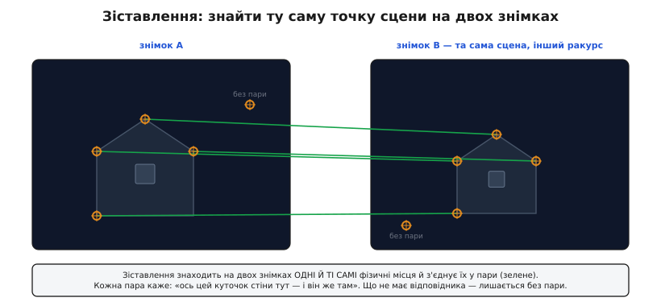
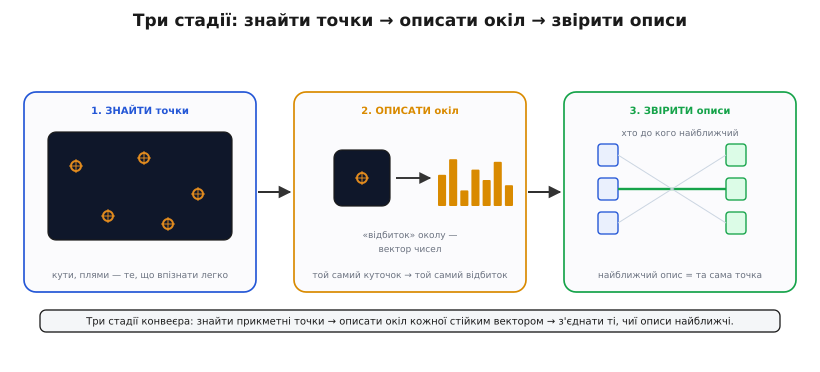
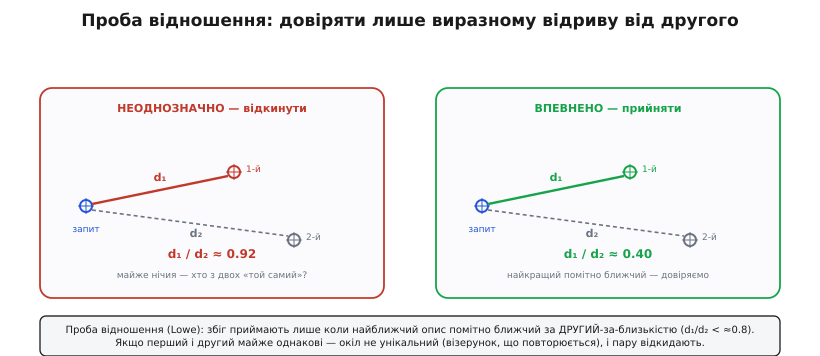
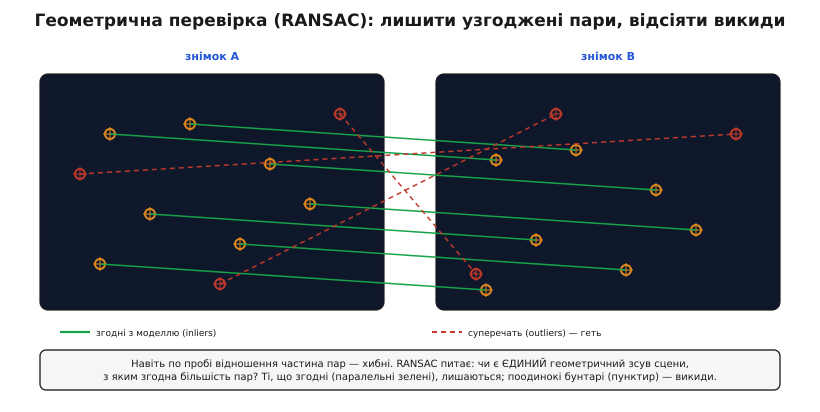

# Зіставлення ключових точок

Наведіть телефон на будівлю з одного місця, потім ступіть крок убік і клацніть удруге. Два знімки — та сама стіна, ті самі вікна, той самий ріг даху, — але жоден піксель не збігається: усе трохи зсунулось, повернулось, стало більшим чи меншим. І все ж людське око миттю каже, що це один і той самий кут будинку тут — і він же там. **Зіставлення ключових точок** (англ. *feature matching*) — це вміння навчити машину тому самому: знайти на двох зображеннях **одні й ті самі фізичні місця сцени** й з'єднати їх у пари, попри зсув, поворот, масштаб і зміну освітлення.

Навіщо взагалі шукати такі пари? Бо майже все, що ми хочемо дістати з кількох знімків, тримається саме на них. Знаєте, що ця цятка на лівому кадрі — це та сама цятка на правому, — і можете **зшити панораму** (зсунути кадри так, щоб спільні точки лягли одна на одну). Знаєте зсув тієї самої точки між лівим і правим оком стереопари — і за ним рахуєте **глибину** ([стереозір](root:embedded/stereo-vision) стоїть на цьому цілком). Ведете сотні таких точок з кадру в кадр відео — і відновлюєте, **як рухалась камера** і яка форма сцени. Прибираєте пари з двох фото та накладаєте одне на інше — і **вирівнюєте** знімки з різних сенсорів. Спільний корінь усіх цих задач один: спершу знайти надійні відповідники між зображеннями.


*Зіставлення знаходить на двох знімках однієї сцени ті самі фізичні місця й в'яже їх у пари. Кожна пара каже: «цей куточок стіни тут — і він же там». Що видно лише на одному знімку (зайшло чи вийшло з кадру), лишається без відповідника. Далі ці пари живлять усе: панораму, глибину, рух камери.*

Одразу відділімо це від сусідньої задачі, щоб не плутати. [Виявлення об'єктів](root:sf-visual/object-detection) відповідає на питання «що це за річ» — «тут машина, там людина», за **категорією**. Зіставлення не цікавить категорія; його питання — «це та сама конкретна точка чи ні», за **тотожністю**. Детектор об'єктів каже «обидві плями — машини»; зіставлення каже «оцей болт на бампері лівого фото — це той самий болт на правому». Різні питання, різний апарат.

## Чому не звірити пікселі напряму

Найпростіша думка: візьмімо клапоть навколо точки з лівого фото й посуньмо ним по правому, шукаючи, де пікселі найсхожіші. Для двох майже однакових кадрів (сусідні кадри відео, крихітний зсув) це навіть працює — саме на цьому стоїть [оптичний потік](root:sf-visual/optical-flow). Але щойно ракурс змінюється по-справжньому, підхід розсипається, і варто зрозуміти чому — бо саме ці поломки диктують, яким має бути правильний метод.

Клапоть пікселів **не переживає перетворень**. Повернули камеру — і той самий ріг даху тепер лежить під іншим кутом, піксель у піксель уже не той. Підійшли ближче — вікно стало вдвічі більшим, клапоть не налазить. Сонце зайшло за хмару — усі яскравості просіли, різниця пікселів підскочила, хоча сцена не змінилась. Пряме звіряння яскравостей плутає **«виглядає інакше»** з **«це інша точка»**, а нам треба рівно навпаки: упізнавати ту саму точку, **хоч би як вона виглядала** під новим ракурсом і світлом.

Друга біда — **однорідність**. Точка посеред чистої стіни чи ясного неба не має прикмет: її окіл такий самий, як у тисячі сусідів. Посуньте по правому фото клапоть неба — він однаково «пасує» будь-де. Такі місця в принципі не можна надійно зіставити, хоч як старайся, бо вони не унікальні. Годяться лише **прикметні** місця: кути, плями, контрастні вузли, чий окіл ні на що навколо не схожий.

Звідси — уся будова методу. Раз пікселі напряму не годяться, треба (1) вибирати лише прикметні, стабільні точки; (2) описувати їхній окіл так, щоб опис **не мінявся** від повороту, масштабу й світла; (3) зіставляти вже ці стійкі описи, а не сирі пікселі. Три стадії — **знайти, описати, звірити**.


*Конвеєр зіставлення в трьох кроках. Детектор знаходить прикметні точки — кути й плями, які легко впізнати. Дескриптор описує окіл кожної стійким вектором-«відбитком»: той самий куточок дає той самий відбиток попри поворот чи масштаб. Зіставлювач в'яже точки з двох знімків за найближчим описом.*

## Знайти: прикметні точки

Перша стадія — **детектор ключових точок** (англ. *keypoint detector*): пройти зображення й позначити місця, які варто зіставляти. Критерій — **повторюваність**: точка мусить знаходитися **на тому самому місці сцени** з іншого ракурсу. Ріг вікна — чудова точка: він лишається рогом вікна, звідки не дивись. Точка посеред стіни — погана: її неможливо знайти вдруге саме там.

Що робить місце придатним? **Двовимірна виразність**: яскравість навколо мусить помітно мінятися в **обох** напрямках. Уздовж рівного краю (межа даху на тлі неба) можна ковзати — усі точки краю схожі, годі сказати, котра з них котра; це проблема **апертури**, та сама, що мучить оптичний потік. А от **кут** — де сходяться два краї — прибитий у обох напрямках: зсунь у будь-який бік, і окіл зміниться. Тому детектори полюють саме на кути й дрібні плями. Класика тут — [детектори кутів Гарріса, Ші–Томасі та FAST](root:sf-visual/corner-detection): усі вони по-своєму міряють, наскільки сильно міняється окіл при зсуві, і лишають місця з найбільшою зміною.

Лишається клопіт **масштабу**. Кут вікна на фото зблизька — велика деталь; те саме вікно здалеку — дрібна цятка. Детектор, що дивиться в вікно фіксованого розміру, знайде кут на одному фото й проґавить на іншому. Рятує **масштабний простір**: зображення розмивають і зменшують сходинками, будуючи піраміду, і шукають точки на **всіх** рівнях відразу. Тоді велика деталь спрацює на грубому рівні, дрібна — на тонкому, і та сама точка знайдеться на обох фото, дарма що там вона вдесятеро більша. Як будують цю піраміду й чому саме гаусове розмивання — у [масштабному просторі й піраміді Гауса](root:sf-visual/scale-space).

> 🔧 **Навіщо це.** На дроні, що зшиває карту місцевості з кадрів камери, вибір точок вирішує все. Наберете точок на однорідних полях і воді — зіставлення попливе, бо ці точки неможливо надійно знайти вдруге, і карта «попливе» разом із ними. Наберете стабільних кутів — рогів дахів, перехресть доріг, кутів полів — і кадри зійдуться намертво. Тому детектор налаштовують на **якість, а не кількість**: краще двісті певних точок, ніж дві тисячі хитких.

## Описати: стійкий відбиток околу

Знайшли точку — тепер її треба **описати** так, щоб упізнати на іншому фото. Цим займається **дескриптор** (англ. *descriptor*, від лат. *describere* — описувати): він бере окіл точки й згортає його в короткий **вектор чисел** — свого роду відбиток. Уся сила методу — у тому, які саме числа брати. Гарний дескриптор має дві властивості, що тягнуть у різні боки, і мистецтво в тім, щоб дати обидві.

Перша — **інваріантність** (лат. *in-* — не, *variare* — змінюватися): відбиток тієї самої точки має лишатися майже тим самим попри поворот, масштаб і зміну світла. Цього досягають хитрощами. Проти світла дескриптор дивиться не на самі яскравості, а на **відмінності** між сусідніми пікселями ([градієнти](root:sf-visual/edge-detection)): додайте до всього кадру сталу яскравість — різниці не зміняться. Проти повороту — точці спершу приписують **власний напрямок** (куди сильніш за все «тече» яскравість поблизу) і описують окіл **відносно цього напрямку**; повернеться точка — повернеться й напрямок, і опис лишиться той самий. Проти масштабу — окіл беруть **того розміру, на якому точку знайшли** в піраміді.

Друга властивість тягне навпаки — **розрізнюваність**: відбитки **різних** точок мають бути **різними**, інакше зіставляння переплутає їх. Тут напруга очевидна: що грубіший опис (аби пережити всі перетворення), то легше двом несхожим точкам випадково злитися в один відбиток. Класичний дескриптор SIFT ловить баланс так: окіл ділять на сітку 4×4 клітинки, у кожній рахують, куди дивляться градієнти (гістограма з 8 напрямків), і зшивають усе в **128 чисел**. Виходить достатньо грубо, щоб пережити поворот і масштаб, і достатньо детально, щоб не плутати різні кути. Звідки взявся SIFT, чому його патент двадцять років стримував вільне застосування і як йому на зміну прийшли швидкі **двійкові** дескриптори — у [історії від SIFT до ORB](root:sf-visual/feature-matching/hist-sift-to-orb.md).

## Звірити: найближчий опис

Тепер, коли кожна точка на обох фото — це вектор, зіставляння стає задачею геометрії векторів: для кожного вектора з лівого фото знайти **найближчий** вектор із правого. «Найближчий» міряють **відстанню** між векторами; для звичайних числових дескрипторів (як SIFT) це проста евклідова відстань — сума квадратів різниць по всіх координатах. Менша відстань — схожіші околи — імовірніше та сама точка.

Найпростіший спосіб — **повний перебір** (англ. *brute force*): кожен вектор ліворуч звірити з кожним праворуч і взяти найближчий. Коштує це `N × M` порівнянь для N точок ліворуч і M праворуч — для кількох сотень точок цілком по кишені навіть слабкому процесору. Коли точок тисячі й треба швидше, будують просторові структури (k-вимірні дерева, хеші), що дають наближено-найближчого, не звіряючи всі пари, — але суть та сама: знайти найсхожіший опис.

Тут ховається пастка, через яку наївне «взяти найближчого» раз у раз бреше.

## Проба відношення: коли не довіряти найближчому

Уявіть точку на цеглині стіни. Стіна викладена однаковими цеглинами, тож на правому фото знайдеться **сотня** майже однакових кутів цеглин, і всі вони приблизно однаково близькі до нашого вектора. «Найближчий» серед них переможе на випадковий волосок — і виявиться зовсім не тією цеглиною. Це не рідкість: будь-який **повторюваний візерунок** (вікна багатоповерхівки, плитка, паркан, листя) плодить юрбу схожих околів, і найближчий сусід серед них — майже лотерея.

Девід Лоу, автор SIFT, дав напрочуд простий і дієвий запобіжник — **пробу відношення** (англ. *ratio test*). Замість дивитися лише на найближчого, знайдіть **два** найближчі вектори праворуч і порівняйте їхні відстані. Якщо найкращий помітно ближчий за другого — окіл унікальний, збігові можна вірити. А якщо перший і другий майже врівень — околів-двійників багато, вибір ненадійний, **пару відкидають**. Формально приймають збіг, лише коли

```
d₁ / d₂  <  поріг        (типово ≈ 0.8)
```

де `d₁` — відстань до найближчого, `d₂` — до другого. Лоу зміряв на реальних даних: поріг **0.8** відсіює близько **90%** хибних збігів, а правильних губить менш ніж **5%**. Разюча вигода за одне ділення.


*Проба відношення. Ліворуч: перший і другий кандидати майже однаково близькі (d₁/d₂ ≈ 0.92) — окіл не унікальний, годі сказати, котрий «той самий», пару геть. Праворуч: найкращий виразно ближчий за другого (d₁/d₂ ≈ 0.40) — окіл прикметний, збігові довіряємо. Одне число розрізняє впевнений збіг і випадковий.*

Часто додають ще й **перехресну перевірку** (англ. *cross-check*): пара лишається, лише якщо точка A ліворуч обирає B праворуч **і** та сама B, звірена назад, обирає саме A. Взаємний вибір відсіює однобокі випадкові збіги. Два запобіжники разом — проба відношення й перехресна перевірка — прибирають більшість сміття ще до геометрії.

> 🔧 **Навіщо це.** Без проби відношення панорама з видом на цегляну стіну чи ряд однакових вікон розповзеться: сотні хибних збігів між цеглинами-двійниками потягнуть кадри врізнобіч, і шов піде хвилею. Поставте поріг 0.8 — і дев'ять із десяти цих пасток відпадуть самі, перш ніж дійдуть до геометрії. У прошивці це буквально одне порівняння `d1 < 0.8f * d2` на кожен збіг — копійчана ціна за різницю між рівним швом і кашею.

## Двійкові дескриптори й відстань Гаммінга

SIFT потужний, та його 128 чисел рахувати недешево, а звіряти евклідовою відстанню — довго. Для бортового заліза дрона чи телефона, де кадри йдуть по 30 на секунду, придумали радикально дешевшу породу — **двійкові дескриптори**. Замість вектора чисел окіл описують **рядком бітів**: беруть кількасот заздалегідь визначених пар точок навколо ключової й для кожної пари ставлять `1`, якщо перша точка яскравіша за другу, і `0`, якщо ні. Двісті-п'ятсот таких «яскравіше?» — і весь опис поміщається в 32–64 байти. Так влаштований BRIEF (англ. *Binary Robust Independent Elementary Features*), а на його основі — популярний **ORB** (англ. *Oriented FAST and Rotated BRIEF*), що поєднав швидкий детектор FAST із поверненим BRIEF; ORB працює на два порядки швидше за SIFT, лишаючись у багатьох задачах не гіршим.

Головний виграш — у **звірянні**. Відстань між двома двійковими описами — це **відстань Гаммінга** (англ. *Hamming distance*, на честь Річарда Гаммінга): скільки бітів у них різні. А її процесор рахує майже задарма двома операціями: побітове **виключне «або»** (XOR дає `1` рівно там, де біти різняться) і **підрахунок одиниць** у результаті — окрема машинна інструкція `popcount`. Там, де евклідова відстань SIFT потребувала сотні множень і додавань, тут — один XOR і один popcount на пару слів.

**Умова.** Два ORB-дескриптори по 256 бітів — кожен лежить як 8 слів по 32 біти. Порахуймо відстань Гаммінга й перевіримо, чи це достатньо близький збіг, щоб узяти його за кандидата.

:::tabs
```cpp
#include <cstdint>
#include <bit>      // std::popcount (C++20)

// відстань Гаммінга двох 256-бітних ORB-дескрипторів (8 слів по 32 біти)
int hamming256(const uint32_t a[8], const uint32_t b[8]) {
    int dist = 0;
    for (int i = 0; i < 8; ++i)
        dist += std::popcount(a[i] ^ b[i]);  // XOR → лічба різних бітів
    return dist;                             // 0 = однакові, 256 = усе навпаки
}

// для кожного дескриптора ліворуч знайти найближчий і другий праворуч,
// прийняти лише за пробою відношення (для Гаммінга — теж відношення відстаней)
int match_one(const uint32_t query[8],
              const uint32_t train[][8], int m,
              float ratio) {
    int best = 1 << 30, second = 1 << 30, best_j = -1;
    for (int j = 0; j < m; ++j) {
        int d = hamming256(query, train[j]);
        if (d < best) { second = best; best = d; best_j = j; }
        else if (d < second) { second = d; }
    }
    // збіг певний, лише коли найкращий помітно ближчий за другий
    if (second > 0 && (float)best < ratio * (float)second)
        return best_j;      // прийнято
    return -1;              // неоднозначно — відкинути
}
```
```python
# відстань Гаммінга двох 256-бітних ORB-дескрипторів (8 слів по 32 біти)
def hamming256(a, b):
    dist = 0
    for x, y in zip(a, b):
        dist += (x ^ y).bit_count()  # XOR → лічба різних бітів
    return dist                      # 0 = однакові, 256 = усе навпаки

# для кожного дескриптора ліворуч знайти найближчий і другий праворуч,
# прийняти лише за пробою відношення (для Гаммінга — теж відношення відстаней)
def match_one(query, train, ratio):
    best, second, best_j = 1 << 30, 1 << 30, -1
    for j, t in enumerate(train):
        d = hamming256(query, t)
        if d < best:
            second, best, best_j = best, d, j
        elif d < second:
            second = d
    # збіг певний, лише коли найкращий помітно ближчий за другий
    if second > 0 and best < ratio * second:
        return best_j      # прийнято
    return -1              # неоднозначно — відкинути
```
:::

Порахуймо один XOR-крок вручну для двох 8-бітних шматків, щоб побачити механіку:

```
a = 1011 0010
b = 1001 0110
a XOR b = 0010 0100      біти різняться у двох позиціях
popcount(0010 0100) = 2  → внесок цього слова у відстань = 2
```

Кожне слово додає свою жменьку різних бітів, сума по всіх словах — повна відстань Гаммінга. Мала відстань (скажімо, менш як 40 із 256) — околи майже однакові; велика (за 100) — різні. Та сама проба відношення відсіює неоднозначні збіги й тут. Повний перебірний зіставлювач ORB із пробою відношення на C — у [проєкті двійкового зіставлення](root:sf-visual/feature-matching/proj-orb-match-c.md); а чому евклідова відстань пасує числовим дескрипторам, а Гаммінгова — двійковим, і як поріг відношення пов'язаний зі статистикою хибних збігів, розібрано в [математиці відстаней між дескрипторами](root:sf-visual/feature-matching/math-descriptor-distance.md).

## Геометрична перевірка: RANSAC відсіює викиди

Навіть після проби відношення й перехресної перевірки серед пар лишаються **хибні** — випадкові збіги, що проскочили всі фільтри. Останнє слово каже **геометрія**. Ключова думка: усі **правильні** пари не свавільні — вони підкоряються **одному** закону того, як сцена перейшла з лівого фото на праве. Якщо камера трохи посунулась, усі точки плоскої стіни зсунуться **узгоджено** (це перетворення зветься гомографією); якщо сцена жорстка, а камера повернулась, узгодженість інша, та вона є. **Правильні пари згодні між собою; хибні — випадкові й із цього закону вибиваються.**

Проблема: закону ми не знаємо наперед, а вивести його з **усіх** пар не можна — хибні пари його спотворять. Класичний вихід — **RANSAC** (англ. *RANdom SAmple Consensus* — згода на випадковій вибірці), даний Мартіном Фішлером і Робертом Боллсом у SRI International 1981 року. Ідея зухвало проста й напрочуд дієва: **вгадуй і перевіряй**. Візьми **навмання мінімум пар**, потрібний, щоб задати закон (для гомографії — лише чотири), побудуй по них модель і полічи, **скільки решти пар з нею згодні** (лягають близько до передбаченого — це «свої», *inliers*). Повтори багато разів із різними випадковими вибірками й лиши модель із **найбільшою згодою**. Кілька хибних пар, що затесались у вибірку, дадуть безглузду модель, з якою майже ніхто не згоден, — і вона програє. А вибірка з самих правильних пар дасть закон, до якого пристане більшість, — вона й переможе. Наостанок усе, що з переможною моделлю не згодне, **викидають як викиди** (*outliers*).


*Геометрична перевірка. Правильні пари підкоряються одному зсуву сцени — їхні лінії узгоджені (паралельні зелені). Хибні пари випадкові й з цього закону вибиваються (пунктир урізнобіч). RANSAC знаходить модель, з якою згодна більшість, і лишає тільки згодні пари — рештки сміття відпадають.*

Після RANSAC на руках дві коштовності: **чистий набір правильних пар** і **сама модель** — те перетворення, що переводить одне зображення в інше. І пари, і модель — саме те, чого чекає все наступне: модель гомографії кладе кадри в панораму, жорстке перетворення дає рух камери, а вивірені пари стереопари дають глибину. Механіку RANSAC — скільки ітерацій треба, як рахувати згоду й коли спинятись — розгорнуто в окремій темі про [RANSAC](root:sf-algorithms/ransac/detail).

> 🔧 **Навіщо це.** Уявіть, що зшиваєте панораму й серед двохсот пар двадцять — хибні. Спробуєте вирівняти кадри по **всіх** двохстах — двадцять брехливих потягнуть шов убік, і стик поповзе. RANSAC мовчки відкине ці двадцять і порахує зсув по ста вісімдесяти чесних — шов ляже точно. Це той запобіжник, що відрізняє зіставлення, придатне для роботи, від купи пар, серед яких сховані міни. Без нього жоден серйозний конвеєр — панорама, стереозір, відновлення руху — не працює.

## Куди йде зіставлення

Само по собі зіставлення точок — не мета, а фундамент. Його продукт — **вивірений набір відповідників між зображеннями плюс перетворення між ними** — це той цокольний поверх, на якому стоять великі задачі комп'ютерного зору.

**Панорама й вирівнювання**: гомографія з RANSAC каже, як накласти кадри, щоб спільні точки збіглися, — і сусідні знімки зливаються в один широкий. Так само вирівнюють знімки з різних сенсорів (звичайна камера й теплова) чи з різних моментів часу.

**Глибина зі стерео**: знаючи ту саму точку в лівому й правому оці, за різницею їхніх положень (диспаритетом) рахують відстань до неї; на цьому цілком стоїть [стереозір](root:embedded/stereo-vision).

**Рух камери й карта сцени**: ведучи сотні точок крізь кадри відео, відновлюють водночас **траєкторію камери** і **тривимірну форму сцени** — серце одночасної локалізації й побудови карти (SLAM) та візуальної одометрії, якими дрон чи робот розуміють, де вони й що навколо.

У всіх цих випадках вимога до зіставлення однакова: пари мають бути **правильні** (хибна пара отруює геометрію) і **добре розкидані** по кадру (пари, збиті в кутику, дають хитку модель). Тому весь конвеєр — прикметні точки, стійкі описи, проба відношення, геометрична перевірка — служить одному: віддати наступному кроку **жменю відповідників, яким можна вірити**.

## Підсумок теми

Зіставлення ключових точок знаходить на двох зображеннях **одні й ті самі місця сцени** й в'яже їх у пари, попри зсув, поворот, масштаб і світло. Пряме звіряння пікселів для цього не годиться — воно плутає «виглядає інакше» з «інша точка» й безпорадне на однорідних ділянках, — тож метод стоїть на трьох стадіях. **Знайти**: детектор бере лише прикметні, повторювані точки — кути й плями, стійкі в масштабному просторі. **Описати**: дескриптор згортає окіл у стійкий відбиток — числовий (SIFT, 128 чисел) чи двійковий (ORB, рядок бітів), інваріантний до перетворень і водночас розрізнюваний. **Звірити**: для кожної точки шукають найближчий опис — евклідовою відстанню для числових, дешевою відстанню Гаммінга (XOR + popcount) для двійкових. Наївному «найближчому» вірити не можна: **проба відношення** приймає збіг, лише коли найкращий помітно ближчий за другого (поріг ≈ 0.8 відсіює 90% хиби), а **перехресна перевірка** вимагає взаємного вибору. Рештки сміття прибирає **геометрія**: RANSAC вгадує єдиний закон переходу сцени й лишає тільки згодні з ним пари. На виході — вивірені відповідники й перетворення між знімками, той фундамент, на якому тримаються панорами, стереоглибина, рух камери й карта сцени.
