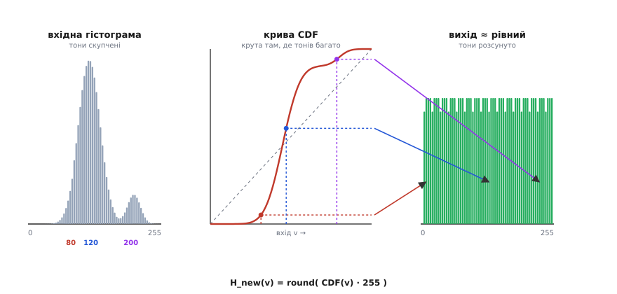

# Гістограма: еквалізація, CLAHE й реалізація на залізі

Базовий погляд на гістограму дає інтуїцію: це розподіл яскравостей кадру, його тоновий відбиток, за формою якого видно, темний кадр чи світлий, контрастний чи млявий. Виправляють тон двома лінійними діями — зсувом (яскравість) і розтягом (контраст). Але за простим словом «вирівняти гістограму» ховається точна математика, а за словами «зробити це на камері» — інженерні рішення, від яких залежить, чи піде картинка в реальному часі й чи не зіпсується тихо на крайовому випадку. Тут ми розберемо механіку до дна: чому застосування власної кумулятивної функції розподілу випрямляє гістограму, чому глобальне вирівнювання підсилює шум і як це лікує локальний метод з обрізанням піку, чому не можна вирівнювати кольоровий кадр по каналах окремо, і як усе це лягає в кілька проходів коду на скромному мікроконтролері — без плаваючої точки й без ділення в гарячому циклі.

## CDF і виведення формули вирівнювання

Вирівнювання гістограми (англ. *equalization*, від лат. *aequalis* — рівний) застосовує до яскравості одне коротке перетворення:

```
H_new(v) = round( CDF(v) · 255 )
```

де `v` — стара яскравість (0…255), `CDF(v)` — нормована кумулятивна функція розподілу в точці `v`, `H_new(v)` — нова яскравість. Питання не в тому, як це порахувати (це тривіально), а **чому саме ця формула** дає на виході майже рівний розподіл. Відповідь випливає строго, і вона варта того, щоб побачити її цілою — бо саме з неї ростуть усі межі методу.

**Від гістограми до розподілу імовірностей.** Кадр має `N` пікселів. Гістограма `h(v)` — лічильник: скільки пікселів мають яскравість рівно `v`. Сума всіх стовпчиків дорівнює `N`. Поділивши кожен на `N`, дістаємо нормовану гістограму `p(v) = h(v)/N` — частку пікселів даної яскравості; сума тепер одиниця, і `p(v)` читається як імовірність, що навмання взятий піксель має яскравість `v`. Це дискретний розподіл імовірностей по 256 кошиках.

**Кумулятивна функція розподілу** (англ. *cumulative distribution function*, від лат. *cumulare* — нагромаджувати) — накопичена сума цього розподілу. У точці `v` вона дорівнює частці пікселів, не темніших за `v`:

```
CDF(v) = p(0) + p(1) + … + p(v) = ( h(0) + … + h(v) ) / N
```

`CDF(0)` — частка найтемніших пікселів; `CDF(255)` — це вже всі пікселі, тож завжди рівно 1. CDF починається біля нуля, тільки росте (додаємо невід'ємні частки) і впирається в одиницю. Вона **монотонно неспадна** — і саме ця властивість несе все доведення.

**До чого прагнемо.** Мета вирівнювання — щоб кожна яскравість на виході траплялася приблизно однаково часто, тобто щоб вихідна гістограма була плоскою. Запитаймо: а яка CDF у *ідеально рівномірного* розподілу? Якщо яскравості трапляються однаково часто, то частка пікселів, не темніших за `v`, росте прямо пропорційно до `v` — до половини шкали припадає половина пікселів, до чверті чверть. Отже CDF рівномірного розподілу — **пряма лінія**:

```
CDF_рівн(v) = v / 255
```

Звідси головний зв'язок: **плоска гістограма ⇄ лінійна CDF**. Це дві сторони одного. Сказати «хочу рівний вихід» — те саме, що «хочу, щоб CDF виходу була прямою». Тож ідея вирівнювання одним реченням: підберімо перетворення яскравості так, щоб CDF результату стала прямою.

**Виведення.** Стверджуємо, що шукане перетворення — це **сама нормована CDF кадру**, розтягнута на 0…255: `T(v) = CDF(v) · 255`. Подивімося, чому вихід виходить рівним. Розгляньмо неперервний випадок — він прозоріший, а дискретний відрізняється лише округленням. Нехай `X` — випадкова яскравість з CDF `F(x)`. Застосуємо перетворення й дістанемо нову змінну `Y = F(X)` (множник 255 поки опустимо — він лише масштабує). Знайдімо CDF нової змінної — частку пікселів, чиє нове значення не більше за поріг `y`:

```
CDF_Y(y) = P( Y ≤ y ) = P( F(X) ≤ y )
```

Тепер ключовий крок, де працює монотонність. Оскільки `F` неспадна, нерівність `F(X) ≤ y` рівносильна `X ≤ F⁻¹(y)` (застосували до обох боків обернену функцію):

```
CDF_Y(y) = P( X ≤ F⁻¹(y) )
```

Але `P(X ≤ щось)` — це за означенням сама `F`, узята в тій точці:

```
CDF_Y(y) = F( F⁻¹(y) ) = y
```

Функція й обернена скасувалися, лишилося `y`. А `CDF_Y(y) = y` — це означення рівномірного розподілу на [0, 1]. Тобто `Y = F(X)` розподілена **рівномірно**, хай якою химерною була форма `X`. Це класичний результат — **інтегральне перетворення ймовірності**: пропусти будь-яку неперервну величину через її ж CDF, дістанеш рівномірну. Розтягнувши з [0, 1] на [0, 255], маємо рівно `T(v) = CDF(v) · 255`. Ось чому формула працює: ми **нав'язуємо** кадру те перетворення, яке за побудовою випрямляє його власний розподіл, а пряма CDF — це і є рівний вихід. Повне покрокове виведення з малим числовим прикладом винесене окремо — [деталь виведення через CDF](topic:sf-visual/histogram/math-equalization.md) показує кожен крок руками.

**Чому на реальному кадрі лише *майже* рівно.** У неперервному світі вихід ідеально рівномірний; на дискретному кадрі — майже. Причина — округлення. Формула дає дробове `CDF(v)·255`, а яскравість мусить бути цілою, тож округляємо. Через це кілька різних вхідних значень можуть округлитися в одне вихідне (там, де CDF стрімка — у скупченні тонів — сусідні `v` злипаються), а там, де CDF майже пласка (тонів обмаль), цілі ділянки вихідної шкали лишаються порожні. Звідси характерний «частокіл» вихідної гістограми: не гладенька поличка, а рідкі стовпчики з прогалинами. Кількість *різних* тонів не зростає — вирівнювання не вигадує нових, лише розсуває наявні. Тому плоским стає радше **накопичений** розподіл (CDF виходу лягає близько до прямої), а не сама гістограма. Для зору це й важливо: тони розсунулися, деталі стали відрізнятися.

## Фігура: як CDF перетворюється на LUT-відображення


*Чому CDF випрямляє розподіл. Ліворуч — вхідна гістограма зі скупченням тонів посередині. У центрі — крива CDF: там, де тонів багато, вона росте круто, де мало — майже пласка. Праворуч — вихід, наближений до рівного. Стрілки показують відображення `H_new = round(CDF(v)·255)`: близькі вхідні значення зі скупчення (80 → 120) розтягуються в далекі вихідні, бо круту ділянку CDF проходять різні рівні; рідкі тони (200) майже не зсуваються. Саме крутість CDF у зоні скупчення «розсуває» збиті докупи тони.*

Графік варто читати так. Крута ділянка CDF — це місце, де в кадрі багато тонів; пройшовши її, два близькі вхідні значення дістають далекі вихідні (розтяг). Пласка ділянка — де тонів мало; там вихідні значення майже не різняться (стиск). Отже вирівнювання автоматично віддає **більше місця на шкалі тим тонам, яких у кадрі багато** — а це й є деталі, що тулилися докупи. Уся таблиця замін — це просто зчитана з кривої відповідність «вхід → вихід», 256 наперед порахованих чисел.

## CLAHE: чому глобальне вирівнювання підсилює шум і як це лікують

Глобальне вирівнювання має вроджену ваду, і вона прямо випливає з виведення. Перетворення будується по **одній** CDF на весь кадр, тож воно підсилює те, чого в кадрі багато. А найбільше в типовому кадрі — великих **однорідних ділянок**: небо, стіна, рівна підлога, тепле тло на знімку тепловізора. На такій ділянці тисячі пікселів мають близькі яскравості — отже в гістограмі це вузький високий пік, а в CDF — дуже крута сходинка. Вирівнювання, побачивши крутий підйом CDF, розтягує ці майже однакові тони на широкий шмат шкали. Разом із корисними дрібними переходами воно розтягує й **шум сенсора**, який доти ховався в межах одного-двох рівнів. Результат упізнаваний: рівне небо після глобального вирівнювання вкривається зернистими плямами, плаский фон тепловізора закипає «сніжком». Контраст ми підняли, але здебільшого підняли шум там, де сигналу й не було.

Лікування на ім'я **CLAHE** (англ. *Contrast Limited Adaptive Histogram Equalization* — вирівнювання гістограми з адаптацією й обмеженням контрасту) лагодить це двома ідеями.

**Перша ідея — локальність (адаптивність).** Замість однієї CDF на весь кадр ділимо кадр на сітку невеликих прямокутників — **тайлів** (англ. *tile* — плитка), наприклад 8×8 на весь кадр. У кожному тайлі будуємо **свою** гістограму й свою CDF і вирівнюємо тайл за його власним локальним розподілом. Сенс: тон, що в межах темної ділянки є «світлим», у межах усього кадру міг бути «темним» — локальне вирівнювання розкриває контраст там, де він є *локально*, не оглядаючись на решту кадру. Темний кут і пересвітлений центр обробляються кожен за своїм законом.

**Друга ідея — обмеження контрасту (обрізання піку).** Сама по собі локальність не прибрала б шуму — на однорідному тайлі (шматок неба) гістограма так само вузький пік, і локальне вирівнювання так само його розтягне. Тому **перед** побудовою CDF тайла гістограму **обрізають**: задають межу `clipLimit` — максимально дозволену висоту кошика. Усе, що вище межі, зрізають, а зрізану «масу» рівномірно розкладають по всіх кошиках. Сенс прямий: висота кошика — це і є крутість майбутньої CDF у цій точці, а крутість — це сила розтягу. Обрізавши пік, ми обмежуємо, **наскільки сильно** вирівнювання може розтягнути будь-яку вузьку групу тонів — тобто ставимо стелю підсиленню контрасту, а отже й шуму. Звідси «contrast limited» у назві.

**Третя складова — білінійна інтерполяція, щоб не було швів.** Якби ми просто вирівняли кожен тайл своєю CDF і склали назад, на межах тайлів з'явилися б різкі стрибки яскравості — сітка швів, бо сусідні тайли мають різні перетворення. CLAHE прибирає їх так: для кожного пікселя беруть не одну CDF його тайла, а **чотири** CDF найближчих тайлів (за чотирма кутами навколо пікселя) і змішують їхні результати **білінійно** — за відстанню пікселя до центрів цих тайлів. Піксель у центрі тайла дістає майже чисту CDF свого тайла; піксель біля межі — суміш, що плавно переходить у сусідній закон. Так локальні перетворення зшиваються в гладке поле без видимих границь.

Порівняймо на кадрі **тепловізора** — там різниця разюча. Тепловий кадр часто має велике рівне тло (стіна кімнати десь близько 20 °C) і дрібну гарячу ціль (людина, витік тепла, перегрітий контакт). Глобальне вирівнювання, побачивши, що тлом зайнята більшість пікселів, віддасть більшу частину шкали саме тлу — і розтягне його тепловий шум у мерехтливе зерно, а дрібну ціль ледь зачепить. CLAHE натомість у тайлі з ціллю розкриє локальний контраст між ціллю та її найближчим оточенням (ціль «вистрелить»), а в тайлах рівного тла **обрізаний пік** не дасть розтягнути шум — тло лишиться спокійним. Тому теплові камери, медичні знімки, дефектоскопія майже завжди показують саме CLAHE, а не голе глобальне вирівнювання: воно витягує локальні деталі, не перетворюючи рівні зони на «сніг».

> 🔧 **Навіщо це.** Правило в полі: рівне глобальне вирівнювання беріть, коли весь кадр треба однаково «розтягнути» й шум не критичний (швидкий контраст для подальшого порогу). CLAHE беріть, коли в кадрі співіснують дуже різні за яскравістю зони (тінь і сонце, тло й гаряча ціль) і є помітний шум на однорідних ділянках. Два головні регулятори: `tileSize` (дрібніші тайли — локальніший контраст, але дорожче й більше ризик артефактів) і `clipLimit` (нижчий — менше шуму, але й менше підсилення). Їх підбирають під кадр і сцену, не наосліп.

## Фігура: тайли CLAHE й білінійне зшивання


*Будова CLAHE. Кадр поділено на сітку тайлів; у кожному — власна локальна гістограма. Горизонтальна лінія `clipLimit` показує стелю висоти кошика: пік над нею зрізають, а зрізану масу розкладають по всіх кошиках (це обмежує силу розтягу, а отже й шуму). Піксель біля межі тайлів дістає не одну CDF, а білінійну суміш CDF чотирьох найближчих тайлів — за відстанню до їхніх центрів; так локальні перетворення зшиваються в гладке поле без швів на границях.*

## Колір і канал яскравості

Поки кадр сірий, усе просто — є одна шкала тонів. З кольором постає пастка, в яку легко впасти: вирівняти кожен канал R, G, B **окремо**. Здавалося б, логічно — у кожного каналу своя гістограма, вирівняймо всі три. Але це псує колір, і ось чому. Колір пікселя — це **співвідношення** трьох каналів (скажімо, тепло-помаранчевий — це багато червоного, помірно зеленого, мало синього). Кожен канал має власну форму гістограми, тож три незалежні CDF розтягнуть канали **по-різному**: червоний зсунеться на одну величину, синій на іншу. Співвідношення зламається — і кадр попливе у відтінку: тілесні тони позеленіють, небо стане бірюзовим, нейтральне сіре дасть кольоровий полиск. Контраст ми, може, й підняли, але ціною спотворення кольору.

Правильний шлях — **відокремити яскравість від кольору**. Для цього кадр переводять у простір, де одна вісь несе світлість, а інші — колірність. Два поширені варіанти: **Lab** (вісь *L* — світлість, *a* й *b* — колірні осі) і **HSV** (англ. *Hue, Saturation, Value* — відтінок, насиченість, яскравість; вісь *V* несе яскравість). Далі вирівнюють **лише** канал світлості (*L* або *V*), не чіпаючи колірних осей, і переводять кадр назад у RGB. Тоді тони розтягуються — кадр стає контрастнішим, — а відтінок і насиченість лишаються на місці, бо колірні канали не зрушили.

Чому це працює: око сприймає контраст насамперед по світлості, а колір — окремо. Розтягнувши тільки світлість, ми даємо оку потрібний контраст, не торкаючись того, що відповідає за «який це колір». Перетворення RGB↔Lab чи RGB↔HSV коштує трохи арифметики на піксель, але це невелика ціна за коректний колір. Уявімо той самий кадр двічі: вирівняний по RGD-каналах окремо — з повзучим відтінком і неприродними плямами кольору; і вирівняний по каналу *L* — з тим самим піднятим контрастом, але чистим, незрушеним кольором. Різниця між ними і є відповідь, чому професійні інструменти ніколи не вирівнюють колір по каналах.

> 🔧 **Навіщо це.** Якщо обробляєте кольорове відео й хочете підняти контраст — ніколи не ганяйте вирівнювання по R, G, B нарізно. Переведіть у HSV (дешевше) чи Lab (точніше за сприйняттям), вирівняйте канал яскравості, поверніть назад. Коли кольору взагалі нема (сіра камера, тепловізор у псевдокольорі будується вже *після* обробки яскравості) — питання знімається, працюйте просто з тонами.

## LUT-реалізація на мікроконтролері

Тепер опустімося на залізо. Сила вирівнювання в тому, що вся його «математика» — це 256 наперед порахованих чисел **таблиці замін** (англ. *look-up table*, LUT) «старе значення → нове». Порахувавши таблицю один раз, далі весь кадр обробляють підстановкою, без жодного множення чи ділення на піксель. Тому метод тягне навіть копійчаний контролер у реальному часі. Робота ділиться на три проходи.

**Прохід перший — гістограма, O(N).** Масив із 256 лічильників; ідемо по кожному пікселю й збільшуємо відповідний кошик.

:::tabs
```c
#include <stdint.h>
#include <string.h>

void build_histogram(const uint8_t *img, uint32_t n, uint32_t hist[256])
{
    memset(hist, 0, 256 * sizeof(uint32_t));   // обнулити кошики
    for (uint32_t i = 0; i < n; ++i)
        hist[img[i]]++;                        // піксель сам індексує свій кошик
}
```
```python
import numpy as np

def build_histogram(img):
    # img — 1-вимірний масив байтів (яскравості 0…255)
    hist = np.zeros(256, dtype=np.uint32)      # обнулити кошики
    for v in img:
        hist[v] += 1                           # піксель сам індексує свій кошик
    return hist
```
:::

Чому лічильник — `uint32_t`, а не `uint16_t`. На суцільному кадрі один кошик набирає всі `n` пікселів. Кадр 256×256 — це 65536 пікселів, що вже **переповнює** `uint16_t` (максимум 65535) і тихо обнуляє лічильник; CDF поїде, картинка зіпсується без жодного сигналу — а тиха помилка найгірша. `uint32_t` тримає до 4.29 млрд — запас на будь-який реальний кадр. Ціна — один кілобайт ОЗП (256 × 4 байти), і він того вартий.

**Прохід другий — LUT із CDF, по 256 кошиках.** Накопичуємо суму лічильників (це `CDF·n`) і одразу пишемо результат. Тут важлива хитрість заради швидкості: жодної плаваючої точки. Тримаємо цілий накопичувач і рахуємо нове значення цілочисельно — а бажане округлення `round` робимо без `float`, додаючи половину знаменника до чисельника перед діленням.

:::tabs
```c
void build_lut(const uint32_t hist[256], uint32_t n, uint8_t lut[256])
{
    if (n == 0) {                              // порожній кадр — ділити нема на що
        for (int v = 0; v < 256; ++v) lut[v] = (uint8_t)v;   // тотожна таблиця
        return;
    }
    uint32_t acc = 0;                          // накопичена сума = CDF·n
    for (int v = 0; v < 256; ++v) {
        acc += hist[v];                        // acc = h(0)+…+h(v)
        // round( (acc/n)·255 ) = (acc·255 + n/2) / n   — цілочисельно
        uint32_t mapped = (acc * 255u + n / 2u) / n;
        lut[v] = (uint8_t)mapped;              // 0…255 гарантовано (acc ≤ n)
    }
}
```
```python
import numpy as np

def build_lut(hist, n):
    lut = np.empty(256, dtype=np.uint8)
    if n == 0:                                 # порожній кадр — ділити нема на що
        return np.arange(256, dtype=np.uint8)  # тотожна таблиця
    acc = 0                                    # накопичена сума = CDF·n
    for v in range(256):
        acc += int(hist[v])                    # acc = h(0)+…+h(v)
        # round( (acc/n)·255 ) = (acc·255 + n/2) // n   — цілочисельно
        mapped = (acc * 255 + n // 2) // n
        lut[v] = mapped                        # 0…255 гарантовано (acc ≤ n)
    return lut
```
:::

Чому це коректно. Після кроку `v` маємо `acc = CDF(v)·n`; множимо на 255, ділимо на `n` — дістаємо `CDF(v)·255`. Доданок `n/2` перед діленням — цілочисельне округлення до найближчого: дробова частина ≥ 0.5 штовхає вгору. На межі `acc == n`, тож `mapped = (n·255 + n/2)/n = 255` точно, без вилазу. Перевірка переповнення множення: `acc ≤ n`, а `acc·255u` для кадру 320×240 — це 76800×255 ≈ 19.6 млн, спокійно під 2³². Межа близько `n ≈ 16.8 млн` пікселів (≈4096×4096) — для MCU астрономія; для більших кадрів чисельник рахують у `uint64_t`.

**Прохід третій — застосування, O(N).** Найдешевший крок: кожен піксель замінюємо на значення з таблиці. Можна писати в той самий буфер (на місці), бо піксель залежить лише від себе.

:::tabs
```c
void apply_lut(uint8_t *img, uint32_t n, const uint8_t lut[256])
{
    for (uint32_t i = 0; i < n; ++i)
        img[i] = lut[img[i]];                  // старе значення індексує нове
}
```
```python
def apply_lut(img, lut):
    # старе значення індексує нове — на місці, векторизовано
    img[:] = lut[img]
    return img
```
:::

Усе разом — три проходи по кадру плюс один по 256 кошиках:

:::tabs
```c
void equalize_gray(uint8_t *img, uint32_t n)
{
    uint32_t hist[256];
    uint8_t  lut[256];
    build_histogram(img, n, hist);
    build_lut(hist, n, lut);
    apply_lut(img, n, lut);
}
```
```python
def equalize_gray(img):
    n = img.size
    hist = build_histogram(img)
    lut = build_lut(hist, n)
    apply_lut(img, lut)
```
:::

Пам'яті — трохи більш як кілобайт (1 КБ під гістограму, 256 байтів під LUT), і його можна звільнити одразу. Жодного множення на піксель у гарячих циклах, жодної плаваючої точки. Саме тому вирівнювання роблять прямо на камері-сенсорі чи на дешевому контролері в реальному часі. Повна збірка з докладними поясненнями кожного рядка — у вставці [реалізація на MCU](topic:sf-visual/histogram/proj-histogram-lut.md). Та сама таблиця, до речі, універсальна: поміняй вміст `lut[]` — і тим самим циклом дістанеш розтягнення, гамма-корекцію чи поріг; вирівнювання лише один з мешканців механізму LUT.

## Граничні випадки й пастки

Теорія чиста, а ламається все на краях — тут зібрані випадки, що тихо псують результат.

**Повністю чорний (чи однорідний) кадр.** Якщо всі пікселі однакові, CDF — одна сходинка з 0 до 1 на єдиному зайнятому кошику. Перетворення вироджується: усі ці пікселі дістають значення 255 (бо CDF у тій точці вже дорівнює 1) — чорний кадр стане **білим**. Це не баг, а чесний наслідок «розтягни єдиний тон на всю шкалу», але часто небажаний. Якщо такий кадр треба лишити як є, додають перевірку: зайнятий лише один кошик → тотожна таблиця. Окремо випадок `n == 0` (порожній буфер) ми вже закрили тотожною таблицею — інакше було б ділення на нуль.

**Переповнення лічильника на 16-бітних зображеннях.** Тепловізор, медичний чи науковий сенсор дають 12–16 біт на піксель. Тут дві окремі пастки. Перша: гістограма на 65536 кошиків — це 256 КБ під `uint32_t[65536]`, чого на MCU зазвичай нема, та й більшість кошиків порожні; тому роздільність гістограми зменшують — групують по 16–64 сусідні значення в один кошик. Друга, підступніша: у `build_lut` множник стає `acc * 65535u`, і `uint32_t` переповнюється вже близько `n ≈ 65 тисяч пікселів` — мізерний кадр. Для 16 біт чисельник **обов'язково** рахують у `uint64_t`, інакше тиха катастрофа з зіпсованою таблицею. Це класична помилка переносу 8-бітного коду на 16-бітні дані.

**Залежність `tileSize` ↔ `clipLimit` ↔ розмір кадру в CLAHE.** Тут немає універсальних чисел — усе зав'язане на розмір кадру. Якщо тайли надто **дрібні** (скажімо, 16×16 тайлів на маленький кадр), у кожному тайлі замало пікселів, гістограма стає рідкою й «шумною» сама по собі, а перетворення — нестабільним від тайла до тайла; ще й білінійна інтерполяція не врятує від артефактів, бо сусідні CDF надто різні. Якщо тайли надто **великі** (2×2 на весь кадр), CLAHE вироджується назад у майже глобальне вирівнювання й знову підсилює шум на рівних зонах. `clipLimit` теж не абсолютний: розумна межа — це частка від «рівного» рівня (скільки кошик мав би, якби гістограма тайла була плоскою), а не фіксоване число, бо в дрібному тайлі пікселів менше й абсолютна висота кошиків інша. Тому на практиці `tileSize` беруть так, щоб у тайлі лишалися тисячі пікселів (для кадру 640×480 типово 8×8 тайлів), а `clipLimit` задають відносно — і підкручують під конкретну сцену й рівень шуму.

**Обрізані тони не повертаються — жодним вирівнюванням.** Останнє, найважливіше. Якщо деталь утрачена через обрізання (тони прилипли до 0 чи 255 ще при зйомці), її в числах **просто немає**, і ні глобальне вирівнювання, ні CLAHE її не відновлять — вони лише перерозподіляють те, що є. Тому послідовність завжди така: спершу за гістограмою **перевір**, чи кадр не обрізаний і не млявий, і лише тоді **нормалізуй**. Вирівнювання — потужний, але тупий інструмент: воно завжди штовхає розподіл до прямої, не питаючи, чи це доречно саме тут.

Усі ці дії — поточкові: кожен піксель обробляється сам, без огляду на сусідів. Коли ж для обробки треба врахувати **оточення** пікселя — розмити, прибрати шум, підняти різкість, знайти краї, — поточкових таблиць уже не досить, і до роботи стають [згортки й фільтри](topic:sf-visual/convolution-filters), що рахують кожен новий піксель із вікна сусідніх.
