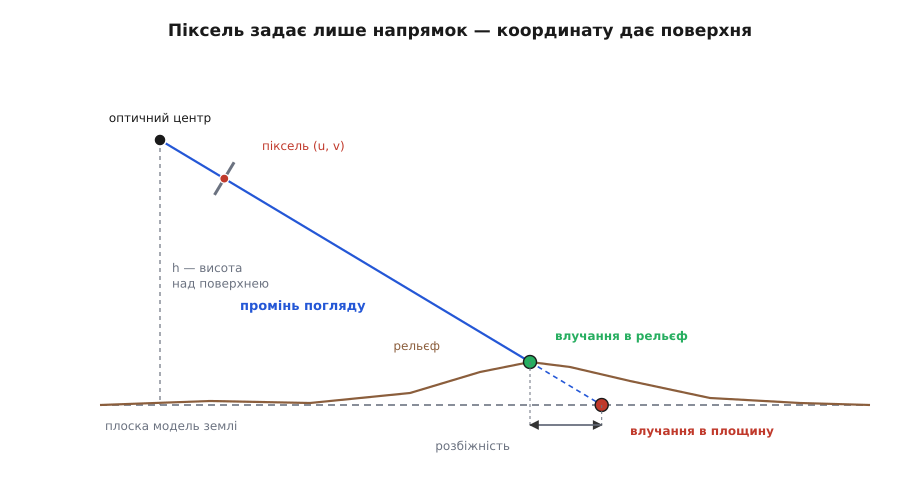
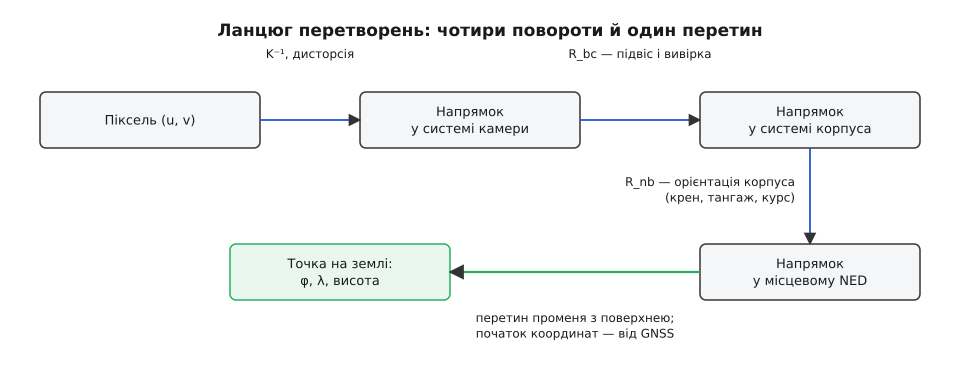
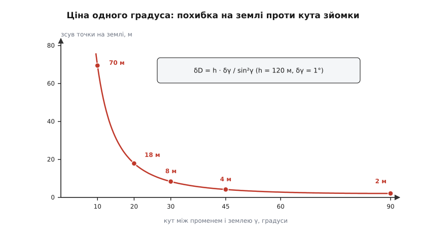

# Геоприв'язка аерознімка: від пози камери до координат на землі

<preknowlist>
- [Модель камери-обскури](root:sf-visual/camera-model) — як тривимірна точка стає пікселем: внутрішня матриця K, фокусні відстані в пікселях, головна точка.
- [Матриці повороту](root:math-algebra/rotation-matrices) — поворот як ортонормована матриця 3×3; добуток матриць — це послідовно виконані повороти.
- [Кути Ейлера](root:math-geometry/euler-angles) — крен, тангаж і курс та як із трьох кутів складають матрицю повороту.
- [ECEF, NED і ENU](root:math-geometry/ecef-ned-enu) — земна система координат і місцева «північ–схід–вниз», перехід між ними.
- [WGS-84](root:math-geometry/wgs84-datum) — еліпсоїд і датум, у яких GNSS видає широту, довготу й висоту.
- [Геоїд, AMSL і висота над еліпсоїдом](root:math-geometry/geoid-and-amsl) — дві різні «висоти», що розходяться на десятки метрів.
</preknowlist>

На екрані оператора — кадр із дрона: дах ангара, поруч вантажівка. Оператор наводить перехрестя на вантажівку й тисне кнопку. За мить поруч зʼявляється пара чисел: 50.450647, 30.520796. Ці числа комусь передадуть, за ними поїде бригада або ляже маршрут — тож питання не пусте: звідки вони взялися?

У самому знімку їх немає. Файл — це прямокутна таблиця яскравостей; піксель має номер рядка й стовпця, і жодне число всередині файла не знає ні про широту, ні про довготу. Значить, координати приходять іззовні — з того, що ми знаємо про камеру в мить, коли спрацював затвор: де вона була і як була повернута. Ці шість чисел (три на положення, три на орієнтацію) на борту вже є: положення дає приймач GNSS, орієнтацію — інерціальна система разом із кутами підвісу.

І от тут виявляється неприємне: навіть повного знання про камеру **не досить**, щоб перетворити піксель на координату. Саме з цієї нестачі й починається вся задача.

## Піксель — це не точка, а промінь

Зйомка стискає простір. Точка з координатами (X, Y, Z) у системі камери потрапляє в піксель діленням на глибину: горизонтальна координата на сенсорі виходить пропорційною X/Z, вертикальна — Y/Z. Помножимо всю трійку на два, на десять, на тисячу — обидва відношення не зміняться, піксель буде той самий. Тобто цілий промінь, що виходить із оптичного центра, стискається зйомкою в одну точку кадру.

Обернена дія відновлює те, що збереглося, і не може відновити те, що зникло. З пікселя ми дістаємо **напрямок** — промінь у просторі; глибина вздовж цього променя загублена безповоротно. Знімок каже «ціль десь у цьому напрямку» і принципово не може сказати «на такій-то відстані».

Отже, щоб отримати точку, до знімка треба додати ще одне рівняння. І воно є, тільки береться не з камери, а зі здорового глузду: **знята ціль лежить на землі**. Промінь перетинає земну поверхню — цей перетин і є шукана точка.


*Геоприв'язка — це перетин променя погляду з моделлю поверхні; яку модель узяли, така й відповідь.*

Звідси одразу видно головну особливість цієї задачі. «Земля» в обчисленні — не реальний ґрунт, а **модель поверхні**, яку ми обрали: горизонтальна площина на висоті дрона під ним, сітка висот рельєфу, поверхня еліпсоїда. Похибка моделі перетворюється на похибку координати напряму, без жодного пом'якшення. Знімок тут ні до чого — камера чесно дала свій промінь.

## Напрямок променя в системі камери

Промінь із пікселя дістають оберненням внутрішньої матриці. Для пікселя (u, v) нормовані координати на площині знімка — це

```
x = (u − cx) / fx
y = (v − cy) / fy
d_c = (x, y, 1) / √(x² + y² + 1)
```

де fx, fy — фокусні відстані в пікселях, (cx, cy) — головна точка. Вектор **d**_c одиничний і показує напрямок у системі координат камери: вісь x — праворуч по кадру, y — униз по кадру, z — уздовж оптичної осі.

Перед цим піксель треба **виправити за дисторсією**: реальний об'єктив зміщує точки тим сильніше, чим далі вони від центра кадру, і на краю широкого об'єктива це десятки пікселів. Коефіцієнти дисторсії разом із fx, fy, cx, cy дає [калібрування камери](root:sf-visual/camera-calibration) — процедура, у якій камера знімає взірець із відомою геометрією й із розбіжностей обчислює власні параметри. Некомпенсована дисторсія на краю кадру дає такий самий кутовий зсув, як помилка орієнтації на пів градуса, — і коштує потім рівно стільки ж метрів на землі.

## Ланцюг поворотів

Напрямок **d**_c записаний в осях камери, а відповідь потрібна в осях, прив'язаних до Землі. Між ними — три ланки, і кожна має своє фізичне джерело.

Камера сидить у підвісі, підвіс — на корпусі дрона. Кути підвісу (їх видають енкодери сервоприводів) дають поворот **R**_bc з осей камери в осі корпуса. До нього домішується **вивірка** (англ. *boresight*) — невеликий сталий кут між оптичною віссю й осями, у яких міряє інерціальний блок: жодне складання не буває ідеальним, і цей залишок у частки градуса просто вимірюють один раз на калібрувальному польоті над відомими точками, а далі вносять як поправку.

Орієнтацію самого корпуса відносно землі дає [AHRS](root:com-signal/ahrs) — система, що зводить свідчення гіроскопів, акселерометрів і магнетометра в трійку кутів «крен, тангаж, курс». З неї складають поворот **R**_nb з осей корпуса в місцеву систему **NED** — «північ, схід, вниз». Разом:

```
d_n = R_nb · R_bc · d_c
```

Це той самий одиничний вектор, тільки тепер його складові кажуть, скільки в ньому півночі, сходу й «низу».


*Кожну ланку живить свій давач: об'єктив — калібрування, підвіс — енкодери, корпус — AHRS, початок координат — GNSS.*

Початок променя — оптичний центр камери. GNSS-приймач міряє не його, а фазовий центр своєї антени; між ними — **важіль**, сталий вектор у осях корпуса, який теж треба повернути через **R**_nb й додати. На дрона з важелем 15 см це дрібниця поряд з іншими похибками, але у зйомці з точністю в одиниці сантиметрів важіль стає одним із головних доданків.

> 🔧 **Навіщо це.** Ті самі шість чисел пози можна дістати й із самого зображення — так працює [відновлення пози за точками](root:sf-visual/pose-estimation), коли в кадрі є об'єкт із відомою геометрією. Але над лісом чи полем таких об'єктів немає, тож поза береться з телеметрії. Тому спосіб і називають **прямою геоприв'язкою**: між знімком і координатою немає жодного впізнавання — самі повороти й одна геометрична задача. Як фотограмметрія прийшла до цього від опорних точок, розставлених по землі, — у [історичній вставці](root:sf-visual/image-georeferencing/hist-direct-georeferencing.md).

## Перетин із поверхнею

Тепер геометрія. Помістимо початок місцевої системи в оптичний центр, осі — «північ, схід, вниз». Точки променя:

```
P(t) = t · d_n,     t ≥ 0
```

Найпростіша модель поверхні — горизонтальна площина на висоті h під камерою. Умова «третя складова дорівнює h» дає одне рівняння з одним невідомим:

```
t · d_вниз = h        →        t = h / d_вниз
```

Величина t — це **похила дальність** до цілі в метрах, а горизонтальні складові t·**d** — зсуви на північ і на схід.

Тут ховається пастка, на якій регулярно горять реалізації. Розв'язок існує лише коли d_вниз > 0, тобто коли промінь справді нахилений до землі. Якщо камера дивиться в горизонт, d_вниз коливається біля нуля, і формула чесно видає дальність у десятки кілометрів; якщо трохи вище горизонту — від'ємне t, тобто точку **позаду** камери. Код мусить перевіряти d_вниз на мінімальний поріг і відповідати «розв'язку немає», а не показувати оператору координату в сусідній області.

**Кадр 4000×3000, fx = fy = 2400 px, головна точка (2000, 1500). Камера на висоті 120 м над рівним полем, оптична вісь нахилена на 45° від горизонту й спрямована на північ. Ціль — у пікселі (3000, 2100).**

```
напрямок у системі камери
x   = (3000 − 2000) / 2400 = 0.41667
y   = (2100 − 1500) / 2400 = 0.25000
|·| = √(0.41667² + 0.25² + 1) = 1.11180
d_c = (0.37477, 0.22486, 0.89945)

осі камери, виражені в місцевій системі (північ, схід, вниз)
праворуч по кадру → ( 0,        1,  0      )
вниз по кадру     → (−0.70711,  0,  0.70711)
оптична вісь      → ( 0.70711,  0,  0.70711)

d_n = 0.37477·(0,1,0) + 0.22486·(−0.70711,0,0.70711) + 0.89945·(0.70711,0,0.70711)
    = (0.47701, 0.37477, 0.79501)

перетин із площиною
t  = 120 / 0.79501 = 150.94 м      ← похила дальність
ΔN = 150.94 · 0.47701 =  71.99 м
ΔE = 150.94 · 0.37477 =  56.57 м
```

Ціль лежить за 72 м на північ і 57 м на схід від точки під дроном.

Реальне поле рідко буває площиною. Якщо під променем горб, справжнє влучання буде **ближче** до дрона й вище, і розбіжність між двома відповідями росте тим швидше, чим пологіший промінь. Тому замість площини беруть [цифрову модель рельєфу](root:sf-visual/terrain-elevation-model) — сітку висот із кроком у десятки метрів — і шукають перший перетин чисельно: крокують уздовж променя, на кожному кроці порівнюють висоту променя з висотою рельєфу під ним (інтерполюючи між вузлами сітки), ловлять зміну знака різниці й уточнюють половинним діленням. Робочий розв'язувач на C — від пікселя й телеметрії до широти й довготи, з проходом по рельєфу й усіма перевірками — у [коді вставки](root:sf-visual/image-georeferencing/proj-pixel-to-ground.md).

На великих дальностях озивається ще й кривина Землі: поверхня «тікає» вниз приблизно на D²/(2R), де R ≈ 6371 км. За три кілометри це 0.7 м, за десять — майже 8 м. Для дрона з висоти 120 м цим можна знехтувати; для похилої зйомки з висоти двох кілометрів — уже ні, і тоді промінь перетинають не з площиною, а з еліпсоїдом.

## Назад у широту й довготу

Зсуви ΔN і ΔE — це метри в **місцевій дотичній площині**, дотичній до еліпсоїда в точці зйомки. Щоб дістати з них градуси, потрібні два радіуси кривини еліпсоїда на цій широті: M — уздовж меридіана, N — упоперек нього ([що це за радіуси й звідки беруться](root:math-geometry/local-tangent-plane)). Один метр на північ повертає широту на 1/(M + h) радіана; один метр на схід повертає довготу на 1/((N + h)·cos φ) радіана — множник cos φ тому, що паралель тим коротша, чим ближче до полюса.

**Точка зйомки: φ₀ = 50.45000°, λ₀ = 30.52000°; висота поля над еліпсоїдом h = 160 м.**

```
M = 6 373 450 м        ← радіус кривини меридіана на широті 50.45°
N = 6 390 870 м        ← радіус кривини першого вертикала

Δφ = 71.99 / (6 373 450 + 160)                = 1.12949·10⁻⁵ рад = 0.000647°
Δλ = 56.57 / ((6 390 870 + 160) · cos 50.45°) = 1.39011·10⁻⁵ рад = 0.000796°

φ = 50.45000° + 0.000647° = 50.450647°
λ = 30.52000° + 0.000796° = 30.520796°
```

Ось звідки взялися числа на екрані оператора.

## Куди насправді вказує відповідь

Обчислення дало точку, де промінь зустрів **обрану поверхню**. Якщо ціль лежить на землі, це й є ціль. А якщо вона підноситься над землею — антена на даху, верхівка щогли, машина на естакаді, — промінь дістає до поверхні вже **за** нею, і геоприв'язка покаже точку, зсунуту від надира. Зсув той самий ctg γ, тільки помножений на висоту об'єкта:

```
об'єкт заввишки 12 м, промінь під γ = 30°
δ = 12 · ctg 30° = 12 · 1.7321 = 20.8 м від справжнього місця, у бік від дрона
```

Це не похибка давачів — усе пораховано правильно, просто питання було поставлене про землю, а відповідь потрібна була про дах. Прямовисний знімок від цього вільний: при γ = 90° котангенс нульовий, і висота об'єкта нічого не зсуває. У фотограмметрії те саме явище зветься **зсувом за рельєфом**: воно ж перекошує будинки на краю кадру, ніби ті розходяться від центра.

Та сама процедура, застосована не до однієї точки, а до чотирьох кутів кадру, дає **слід знімка** — чотирикутник на землі, що його камера справді бачила. Це відповідь на питання «яку ділянку накрив цей кадр», і саме нею планують перекриття між сусідніми знімками під час зйомки. Чотирикутник виходить нерівнобічним: дальній край кадру розтягується тим самим множником 1/sin²γ, тож при похилій зйомці слід має форму трапеції, що розширюється вдалину.

## Скільки це коштує в метрах

Ланцюг зійшовся, але кожна його ланка внесла свою похибку. І тут виявляється, що доданки геть не рівноправні.

Візьмімо головну залежність у чистому вигляді. Якщо промінь іде під кутом γ до горизонталі, горизонтальна відстань до цілі D = h/tg γ. Продиференціюймо це по куту:

```
dD/dγ = − h / sin²γ        →        δD ≈ h · δγ / sin²γ
```

Похибка кута перетворюється на похибку на землі з множником 1/sin²γ. Прямовисно вниз (γ = 90°) множник дорівнює одиниці; на пологому промені він росте як лавина.


*За висоти 120 м один градус помилки орієнтації коштує 2 м під собою і 70 м на пологому промені.*

```
h = 120 м, помилка орієнтації δγ = 1°
γ = 90°  →  δD =  2.1 м
γ = 45°  →  δD =  4.2 м
γ = 30°  →  δD =  8.4 м
γ = 20°  →  δD = 17.9 м
γ = 10°  →  δD = 69.5 м
```

Той самий множник розтягує й піксель на землі: у нашому прикладі при γ = 52.6° піксель накриває 8 см уздовж дальності замість 5 см під собою. А заразом стає видно порядок величин. Крок пікселя — сантиметри, похибка від одного градуса орієнтації — метри. **Точність геоприв'язки визначають кути, а не мегапікселі**: камера вдесятеро дрібнішого зерна не додасть тут нічого.

Решта доданків шикується так само за геометрією:

- **Похибка висоти поверхні** входить із множником ctg γ: якщо модель рельєфу помилилася на 5 м по висоті, на пологому промені під 20° точка поїде на 13.7 м убік. Сюди ж потрапляє класична плутанина двох висот: GNSS видає висоту над **еліпсоїдом**, а карти й барометр — над **рівнем моря**, і розходяться вони на десятки метрів ([чому саме так](root:math-geometry/geoid-and-amsl)). Змішати їх — значить внести сталу помилку висоти, яка тим самим ctg γ обернеться на систематичний зсув усіх координат в один бік.
- **Похибка положення** приймача переноситься на ціль один до одного й не залежить від дальності: 1.5 м у звичайного [GNSS](root:hw-sensing/gnss)-приймача, одиниці сантиметрів у режимі RTK.
- **Розсинхронізація часу** б'є двічі. Дрон на 15 м/с за 100 мс неузгодженості міток пролітає 1.5 м. Гірше з підвісом: якщо він повертається зі швидкістю 30°/с, ті самі 50 мс дають 1.5° помилки кута — а це вже 12.6 м на землі при γ = 30°. Тому знімок, телеметрію й кути підвісу мітять [одним годинником](root:sf-distributed/timestamps), а не «часом отримання пакета».
- **Рядкова заслінка** розмазує позу всередині одного кадру: рядки знімаються не одночасно, і за десятки мілісекунд зчитування дрон устигає повернутися ([як це влаштовано](root:hw-sensing/rolling-shutter)).

Похибки поводяться по-різному: випадкові (шум орієнтації, шум GNSS) розмивають точку навколо правильної, систематичні (невивірений підвіс, переплутана висота) зсувають усі точки в один бік і не зникають від усереднення — саме тому вивірку варто виміряти один раз, а не сподіватися, що вона «десь у межах». Повне виведення чутливостей і те, як із них складають еліпс похибки на землі, — у [математичній вставці](root:sf-visual/image-georeferencing/math-georef-error.md).

> 🔧 **Навіщо це.** Координата без радіуса невірогідності — це напівправда, за якою хтось поїде. Бюджет вище дає той радіус безкоштовно: підстав у формули паспортні похибки орієнтації й GNSS, і отримаєш чесне «± стільки метрів» для конкретного кадру. Той самий розрахунок відповідає й на питання, як знімати: підняти дрон і дивитися крутіше вниз майже завжди дешевше, ніж покращувати давачі.

## Коли телеметрії замало

Пряма геоприв'язка впирається в кути, а кути на малому дроні хороші рівно настільки, наскільки хороша інерціальна система. Якщо потрібно краще, беруть додаткове джерело — саме зображення.

Кадр можна зіставити з еталонною картою місцевості: знайти в обох ключові точки, [зіставити їх за дескрипторами](root:sf-visual/feature-matching), відсіяти хибні пари [через RANSAC](root:sf-algorithms/ransac) — і дістати перетворення кадру в карту. Якщо ділянка достатньо рівна, це перетворення — [гомографія](root:sf-visual/homography), вісім чисел, які кладуть весь кадр на карту без жодної телеметрії. Класичний і найточніший шлях — [опорні точки на місцевості](root:sf-visual/ground-control-points): марковані знаки з поміряними координатами, за якими всю зйомку зрівнюють [оптимізацією пучком](root:sf-visual/bundle-adjustment).

Коли геоприв'язку роблять не для однієї цілі, а для кожного пікселя кадру, знімок перетворюється на шматок карти — з нього прибирають перспективу й нахил рельєфу й отримують [ортотрансформований знімок](root:sf-visual/orthorectification), який можна класти на карту й міряти по ньому відстані.

Різниця між двома шляхами глибша за кілька метрів точності. У прямій геоприв'язці похибка росте разом із дальністю, бо все впирається в кут; у прив'язці за зображенням вона впирається в точність еталонної карти й від дальності майже не залежить. Тому перша дає відповідь миттєво й над будь-якою місцевістю, а друга працює лише там, де є з чим зіставляти, — зате однаково добре і за сто метрів, і за три кілометри.
