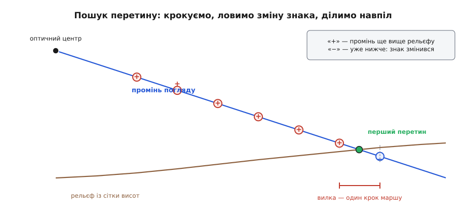

# ⚙️ Розв'язувач «піксель → широта й довгота» на C

Нижче — повний код, який приймає номер пікселя й телеметрію польоту, а віддає координати точки на землі. Він недовгий, але кожен його крок відповідає окремому давачу зі своєю системою відліку, своєю одиницею й своїм способом збрехати — тож більша частина роботи тут не в арифметиці, а в тому, щоб на стику двох сусідніх кроків нічого не переплуталося.

## Що подають на вхід

Вхід — не «зображення», а знімок разом з усім, що борт знав про себе в мить затвора.

```c
#include <math.h>
#include <stdio.h>

#define DEG 0.017453292519943295    /* градус у радіанах */

typedef struct {
    double fx, fy, cx, cy;          /* внутрішні параметри, пікселі */
    double k1, k2, k3, p1, p2;      /* дисторсія, у нормованих координатах */
} Camera;

typedef struct { double roll, pitch, yaw; } Euler;   /* радіани, порядок Z-Y-X */

typedef struct {
    double u, v;        /* піксель, куди навів оператор */
    Camera cam;         /* калібрування об'єктива */
    Euler  body;        /* AHRS: корпус відносно «північ, схід, вниз» */
    Euler  gimbal;      /* енкодери підвісу: камера відносно корпуса */
    Euler  bore;        /* вивірка: сталий залишок в осях камери */
    double lat0, lon0;  /* радіани — фазовий центр антени GNSS */
    double h0;          /* метри над ЕЛІПСОЇДОМ, не над рівнем моря */
    double lever[3];    /* антена → камера в осях корпуса: вперед, праворуч, вниз */
} Shot;
```

У цій структурі зійшлися чотири незалежні джерела: оператор із пікселем, AHRS із кутами корпуса, енкодери підвісу й приймач GNSS. Кожне приходить своїм каналом і зі своєю затримкою, тому перше, що робить справжня система, — зводить їх до **однієї мітки часу** й інтерполює телеметрію на момент затвора, а не бере «останнє, що прийшло». Решта — геометрія.

Одиниці зафіксовано жорстко: усередині структури немає жодного градуса й жодної висоти над рівнем моря. І те, і те живе лише на межі — там, де числа читає людина або чужий формат.

## Промінь: із пікселя в напрямок

Об'єктив зміщує точку тим сильніше, чим далі вона від центра кадру, тож першим ділом піксель треба повернути туди, де він був би в ідеальної камери. Формула **Брауна–Конраді** (доцентрову частину вивів Александер Конраді 1919 року, звів обидві до знайомого сьогодні вигляду Дуейн Браун 1966-го) рахує в зворотний бік — зі справжньої точки спотворену. Оберненої формули в елементарних функціях немає, зате є проста нерухома точка: підставляємо здогад, дивимось, у що він спотворився, поправляємо.

```c
/* Обернути дисторсію: із записаного пікселя дістати нормовані координати
   ідеальної камери. Вісім проходів — із великим запасом навіть для широкого кута. */
static void undistort(const Camera *c, double u, double v, double *x, double *y)
{
    double xd = (u - c->cx) / c->fx, yd = (v - c->cy) / c->fy;
    double xx = xd, yy = yd;
    for (int i = 0; i < 8; i++) {
        double r2  = xx*xx + yy*yy;
        double rad = 1.0 + r2*(c->k1 + r2*(c->k2 + r2*c->k3));
        double dx  = 2.0*c->p1*xx*yy + c->p2*(r2 + 2.0*xx*xx);
        double dy  = c->p1*(r2 + 2.0*yy*yy) + 2.0*c->p2*xx*yy;
        xx = (xd - dx) / rad;
        yy = (yd - dy) / rad;
    }
    *x = xx; *y = yy;
}
```

Цикл збігається тому, що дисторсія — мала добавка: кожен прохід зменшує нев'язку приблизно в стільки разів, у скільки сама поправка менша за координату, тож для звичайного об'єктива вистачає трьох-чотирьох проходів, а вісім лишають запас на край кадру. Для «риб'ячого ока», де поправка порівнянна з координатою, ця нерухома точка вже не стягується — там беруть іншу модель проєкції, а не інші коефіцієнти.

Далі — три повороти. Кути Ейлера в аеронавігаційному порядку дають матрицю **R** = Rz(курс)·Ry(тангаж)·Rx(крен):

```c
typedef double M3[3][3];

static void euler_zyx(M3 r, Euler e)
{
    double cr = cos(e.roll),  sr = sin(e.roll);
    double cp = cos(e.pitch), sp = sin(e.pitch);
    double cy = cos(e.yaw),   sy = sin(e.yaw);
    r[0][0] = cy*cp; r[0][1] = cy*sp*sr - sy*cr; r[0][2] = cy*sp*cr + sy*sr;
    r[1][0] = sy*cp; r[1][1] = sy*sp*sr + cy*cr; r[1][2] = sy*sp*cr - cy*sr;
    r[2][0] = -sp;   r[2][1] = cp*sr;            r[2][2] = cp*cr;
}

static void m3_apply(double out[3], M3 a, const double v[3])
{
    double t[3];
    for (int i = 0; i < 3; i++)
        t[i] = a[i][0]*v[0] + a[i][1]*v[1] + a[i][2]*v[2];
    out[0] = t[0]; out[1] = t[1]; out[2] = t[2];
}

/* Одиничний напрямок погляду в місцевих осях «північ, схід, вниз». */
static void ray_ned(const Shot *s, double d_n[3])
{
    double x, y;
    undistort(&s->cam, s->u, s->v, &x, &y);
    double inv = 1.0 / sqrt(x*x + y*y + 1.0);
    double d_c[3] = { x*inv, y*inv, inv };      /* праворуч, униз по кадру, оптична вісь */

    M3 Rbore, Rg, Rb;
    euler_zyx(Rbore, s->bore);
    euler_zyx(Rg,    s->gimbal);
    euler_zyx(Rb,    s->body);

    double d[3];
    m3_apply(d, Rbore, d_c);                    /* вивірка живе в осях камери */
    double d_mount[3] = { d[2], d[0], d[1] };   /* стала перестановка осей у кріплення */
    m3_apply(d, Rg, d_mount);                   /* кути підвісу */
    m3_apply(d_n, Rb, d);                       /* крен, тангаж, курс */
}
```

Перестановка `{ d[2], d[0], d[1] }` — уся «камера проти корпуса»: оптична вісь стає «вперед», права сторона кадру — «праворуч», низ кадру — «вниз». Вивірку прикладаємо **раніше** за неї, ще в осях камери, бо це залишковий кут між оптичною віссю й механічними осями кріплення. Якщо калібрувальний політ дав вивірку відносно інерціального блока, її місце інше — після кутів підвісу, з боку корпуса. Переплутані боки не видно на прямовисному кадрі й видно на похилому: помилка з'являється тільки на ненульових кутах підвісу й росте разом із ними.

## Перевірка на горизонт

Складова `d_n[2]` — це «скільки в погляді низу». Її знак вирішує, чи задача взагалі має розв'язок: при нулі промінь паралельний землі, при від'ємному дивиться вгору. Порогом тут не варто ставити абстрактне мале число — чесніше зафіксувати **дальність, за якою відповідь усе одно нікому не потрібна**, і відкидати все, що за неї виходить.

```c
#define RANGE_MAX 5000.0        /* далі геоприв'язка за телеметрією не варта довіри */

typedef enum { GEO_OK, GEO_HORIZON, GEO_NO_HIT } Status;
```

Ця стеля сама переводиться в кут. З висоти 120 м дальність 5 км означає, що «низу» в погляді має бути щонайменше 120/5000 = 0.024, тобто промінь нахилений до землі хоч на 1.4°. Усе, що пологіше, розв'язку не отримує — і це правильно: там один градус шуму орієнтації коштує більше, ніж уся відповідь.

Ключове — що відмова повертається **окремим станом**, а не координатою. Спокуса віддати «хоч щось» тут особливо сильна, бо число ж порахувалося; але оператор не побачить, що воно взялося з променя, який пройшов над горизонтом, і повірить йому так само, як усім іншим.

## Перетин: площина і рельєф

Для горизонтальної площини на висоті `h_g` над еліпсоїдом усе замикається одним діленням. Промінь виходить із оптичного центра, а той зміщений від антени на важіль, повернутий у місцеві осі:

```c
static void cam_origin(const Shot *s, double p0[3])
{
    M3 Rb; euler_zyx(Rb, s->body);
    m3_apply(p0, Rb, s->lever);        /* зсув від антени до камери, метри NED */
}

static Status hit_plane(const Shot *s, const double p0[3], const double d[3],
                        double h_g, double *t)
{
    if (d[2] <= 0.0) return GEO_HORIZON;
    *t = (s->h0 - h_g - p0[2]) / d[2];
    return (*t > 0.0 && *t <= RANGE_MAX) ? GEO_OK : GEO_HORIZON;
}
```

Рельєф замкненої формули не має: висота під променем змінюється разом із самим променем. Модель поверхні тут — сітка вузлів із відомим кроком, а висота між вузлами добудовується [білінійною інтерполяцією](root:math-numeric/bilinear-interpolation) чотирьох сусідів:

```c
typedef struct {
    const double *h;      /* h[i*ne + j] — метри над еліпсоїдом; i на північ, j на схід */
    int    nn, ne;
    double step;          /* крок сітки, метри */
    double n0, e0;        /* місцеві координати вузла [0][0], метри */
} Grid;

static int grid_height(const Grid *g, double n, double e, double *h)
{
    double fi = (n - g->n0)/g->step, fj = (e - g->e0)/g->step;
    int i = (int)floor(fi), j = (int)floor(fj);
    if (i < 0 || j < 0 || i >= g->nn - 1 || j >= g->ne - 1) return 0;
    double a = fi - i, b = fj - j;
    const double *r0 = g->h + i*g->ne + j, *r1 = r0 + g->ne;
    *h = (1-a)*((1-b)*r0[0] + b*r0[1]) + a*((1-b)*r1[0] + b*r1[1]);
    return 1;
}

/* Наскільки промінь вище рельєфу в точці t. Додатне — ще летимо. */
static int gap(const Shot *s, const double p0[3], const double d[3],
               const Grid *g, double t, double *out)
{
    double h_ter, h_ray = s->h0 - (p0[2] + t*d[2]);
    if (!grid_height(g, p0[0] + t*d[0], p0[1] + t*d[1], &h_ter)) return 0;
    *out = h_ray - h_ter;
    return 1;
}
```

Далі — те, заради чого все це писалося. Ідемо вздовж променя сталим кроком і чекаємо, поки різниця висот змінить знак; той крок, на якому вона змінилася, і є вилка, всередині якої лежить **перший** перетин. Уточнюємо його половинним діленням — методом, якому досить лише різних знаків на кінцях і не потрібно ні похідної, ні гладкості, а рельєф гладким і не буває.

```c
static Status hit_terrain(const Shot *s, const double p0[3], const double d[3],
                          const Grid *g, double step, double eps, double *t_out)
{
    double g0;
    if (d[2] <= 0.0) return GEO_HORIZON;
    if (!gap(s, p0, d, g, 0.0, &g0) || g0 <= 0.0) return GEO_NO_HIT;

    double lo = 0.0;
    for (double t = step; t <= RANGE_MAX; t += step) {
        double gt;
        if (!gap(s, p0, d, g, t, &gt)) return GEO_NO_HIT;   /* промінь вийшов за сітку */
        if (gt <= 0.0) {
            double hi = t;                                   /* знак змінився: вилка [lo, hi] */
            while (hi - lo > eps) {
                double mid = 0.5*(lo + hi), gm;
                gap(s, p0, d, g, mid, &gm);
                if (gm > 0.0) lo = mid; else hi = mid;
            }
            *t_out = 0.5*(lo + hi);
            return GEO_OK;
        }
        lo = t;
    }
    return GEO_NO_HIT;
}
```


*Марш дає вилку, половинне ділення — точність: перше коштує лінійно, друге майже нічого.*

> 🔧 **Навіщо це.** Крок маршу — не параметр швидкодії, а параметр **правильності**. Пагорб, вужчий за крок, промінь просто перестрибне: обидві проби лишаться додатними, і розв'язувач знайде другий перетин замість першого — точку за гребенем, куди камера не бачить. Тому крок беруть не більший за пів клітинки сітки: дрібніших горбів у самій сітці однаково немає.

## Назад у градуси

Зсуви на північ і схід — це метри в дотичній площині. Щоб зробити з них градуси, потрібні два радіуси кривини еліпсоїда на цій широті: уздовж меридіана й упоперек нього.

```c
#define WGS84_A  6378137.0
#define WGS84_F  (1.0/298.257223563)
#define WGS84_E2 (WGS84_F*(2.0 - WGS84_F))

static void ned_to_geodetic(double lat0, double lon0, double h,
                            double dN, double dE, double *lat, double *lon)
{
    double s = sin(lat0), W = sqrt(1.0 - WGS84_E2*s*s);
    double M = WGS84_A*(1.0 - WGS84_E2)/(W*W*W);   /* радіус кривини меридіана */
    double N = WGS84_A/W;                          /* радіус першого вертикала */
    *lat = lat0 + dN/(M + h);
    *lon = lon0 + dE/((N + h)*cos(lat0));
}
```

Обидва радіуси беруться на широті **зйомки**, а не цілі: у межах кількох кілометрів вони змінюються в сьомому знаку, і різниця губиться далеко за шумом орієнтації. Висоту `h` сюди подають уже цільову — ту, на якій промінь зустрів поверхню.

## Збірка й запуск

```c
typedef struct { double lat, lon, h, range; } Fix;   /* радіани, метри */

static Status georef(const Shot *s, const Grid *dem, double h_plane, Fix *f)
{
    double p0[3], d[3], t;
    cam_origin(s, p0);
    ray_ned(s, d);

    Status st = dem ? hit_terrain(s, p0, d, dem, 10.0, 0.01, &t)
                    : hit_plane(s, p0, d, h_plane, &t);
    if (st != GEO_OK) return st;

    double dN = p0[0] + t*d[0], dE = p0[1] + t*d[1];
    f->h     = s->h0 - (p0[2] + t*d[2]);
    f->range = t;
    ned_to_geodetic(s->lat0, s->lon0, f->h, dN, dE, &f->lat, &f->lon);
    return GEO_OK;
}

#define GN 24                 /* вузлів сітки на північ і на схід */

int main(void)
{
    Shot s = {
        .u = 2938.65, .v = 2063.66,             /* піксель, ЯК ЙОГО ЗАПИСАЛА камера */
        .cam    = { 2400, 2400, 2000, 1500, -0.28, 0.09, 0.0, 0.0006, -0.0004 },
        .body   = { 0.0, 0.0, 0.0 },            /* рівний політ курсом на північ */
        .gimbal = { 0.0, -45.0*DEG, 0.0 },      /* камера нахилена на 45° униз */
        .bore   = { 0.0, 0.0, 0.0 },
        .lat0 = 50.45*DEG, .lon0 = 30.52*DEG, .h0 = 280.0,
        .lever = { 0.0, 0.0, 0.0 }
    };
    Fix f;

    if (georef(&s, NULL, 160.0, &f) == GEO_OK)  /* поле — площина на 160 м */
        printf("площина: %.6f %.6f  висота %.1f м, похила дальність %.1f м\n",
               f.lat/DEG, f.lon/DEG, f.h, f.range);

    static double dem_h[GN*GN];                 /* рівний схил 8 % на північ */
    for (int i = 0; i < GN; i++)
        for (int j = 0; j < GN; j++)
            dem_h[i*GN + j] = 160.0 + 0.08*(-200.0 + 20.0*i);
    Grid dem = { dem_h, GN, GN, 20.0, -200.0, -200.0 };

    if (georef(&s, &dem, 0.0, &f) == GEO_OK)
        printf("рельєф:  %.6f %.6f  висота %.1f м, похила дальність %.1f м\n",
               f.lat/DEG, f.lon/DEG, f.h, f.range);
    return 0;
}
```

```
площина: 50.450647 30.520796  висота 160.0 м, похила дальність 150.9 м
рельєф:  50.450618 30.520760  висота 165.5 м, похила дальність 144.0 м
```

Перший рядок — ті самі числа, що дає розрахунок на папері. Другий відрізняється на **4.2 м**: схил підняв поверхню назустріч променю, той зустрів її раніше, і жодного способу дізнатися про це з самого знімка немає.

Дорогою видно ціну кроків, які легко пропустити. Записаний піксель (2938.65, 2063.66) після виправлення дисторсії став рівно (3000.00, 2100.00) — зсув на 71 піксель; подати сирий піксель просто в K⁻¹ означало б промазати повз ціль на **3.67 м**. А якщо поставити `lever = { 0.05, 0.0, 0.18 }` — камера на 5 см уперед і 18 см нижче антени, — відповідь зрушиться на 10 см. Поряд із метровою похибкою звичайного [GNSS](root:hw-sensing/gnss) це ніщо, але саме заради таких сантиметрів і ставлять RTK: коли решта похибок падає до одиниць сантиметрів, важіль стає одним із найбільших доданків.

## Складність

Марш робить L/Δs проб, кожна — чотири звертання до сітки й десяток множень, тобто стала. [Половинне ділення](root:math-numeric/bisection) додає log₂(Δs/ε) проб. Разом:

```
O(L/Δs + log₂(Δs/ε))

L = 5000 м, Δs = 10 м, ε = 0.01 м
марш            до 500 проб  (у прикладі знак змінився на 15-й)
ділення навпіл      10 проб
```

Друга частина фактично безкоштовна: за десять кроків вилка з десяти метрів стискається до сантиметра. Уся ціна — у першій, і платять її дальністю пошуку, а не потрібною точністю. Дрібнити крок заради точності безглуздо; дрібнити його треба лише тоді, коли рельєф має горби, вужчі за крок.

Арифметики тут на кілька сотень множень — мікросекунди. Реальний час з'їдає інше: сітка висот лежить у файлах-плитках, і промінь на п'ять кілометрів перетинає їх кілька. Тому в бойовій системі `grid_height` читає не масив, а кеш плиток, і саме промах цього кешу, а не 500 проб маршу, вирішує, встигне розв'язувач за кадром чи ні. Пристрій самої сітки — [цифрова модель рельєфу](root:sf-visual/terrain-elevation-model).

## Пастки

- **Дві різні висоти.** `h0` мусить бути над **еліпсоїдом**, як його й видає приймач; сітка рельєфу майже завжди роздається над **рівнем моря**. В Україні розбіжність близько 25 м — постійний зсув висоти, що обертається на систематичну помилку координати ([звідки береться це розходження](root:math-geometry/geoid-and-amsl)). Або приводьте сітку до еліпсоїда, або віднімайте хвилю геоїда — але не змішуйте.
- **Знак осі «вниз».** У NED додатне z спрямоване до землі, тож висота — це `h0 − p[2]`, з мінусом. Переплутаний знак не дає жодної помилки компіляції: код спокійно шукає перетин угорі й повертає «розв'язку немає» на цілком нормальному кадрі.
- **Градуси й радіани.** Тригонометрія C рахує в радіанах, телеметрія приходить у градусах, оператор бачить градуси. Тримайте градуси лише на межі системи. Заразом про друк: один шостий знак широти — це 11 см, тож «%.6f» — це не косметика, а межа роздільності виводу.
- **Мітки часу.** Знімок, поза корпуса й кути підвісу міряються різними пристроями. Підвіс, що повертається зі швидкістю 30°/с, за 50 мс розсинхронізації дає 1.5° помилки — на пологому промені це десятки метрів. Мітки мають бути [від одного годинника](root:sf-distributed/timestamps), а телеметрія — інтерпольована на момент затвора.
- **Дисторсія й вивірка — сталі, тому найпідступніші.** Вони не шумлять і не усереднюються: помилка в них однаково зсуває **всі** кадри польоту в один бік, і на карті це виглядає як бездоганно точна зйомка, зміщена на кілька метрів. Обидві дістають один раз — [калібруванням камери](root:sf-visual/camera-calibration) й калібрувальним польотом над відомими точками.
- **Сітка скінченна.** `grid_height` повертає нуль за межами покриття, і `hit_terrain` чесно віддає `GEO_NO_HIT`. Спокуса «підставити останній вузол» тут дорого коштує: користувач отримає координату замість відмови й не дізнається, що вона взята зі стелі.
