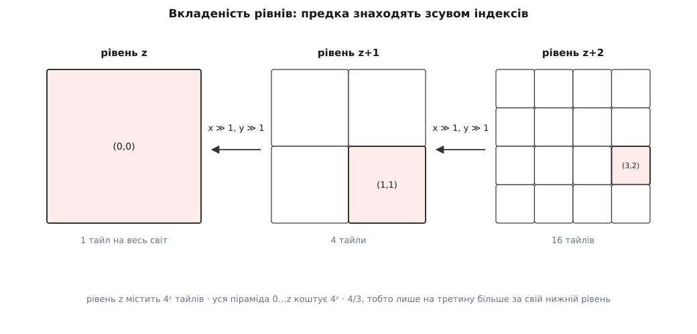
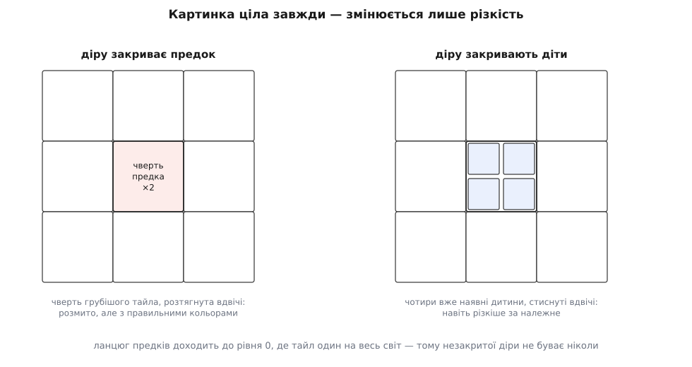

# Тайловий конвеєр карти: завантаження, кеш, рівні деталізації

<preknowlist>
- [Web Mercator і тайлова сітка](topic:math-geometry/web-mercator-tiles) — як довгота й широта лягають на квадрат світу і як цей квадрат ділять на клітинки з адресою z/x/y.
- [Кеш](topic:hw-arch/cache) — копія даних ближче до споживача, влучання й промах, витіснення старого.
- [HTTP](topic:com-protocol/http) — запит і відповідь, коди станів, заголовки кешування: шматки карти приходять саме так.
</preknowlist>

Карта їде за пальцем без ривків і без чорних прогалин. За цим враженням стоїть сховище на терабайти десь за океаном, канал, який у поганий день дає сто кілобайтів на секунду, і шістнадцять мілісекунд на кадр. Тайловий конвеєр — це машина, яка перетворює «куди дивиться око зараз» на «які шматки картинки, звідки і в якому порядку дістати», і робить це так, щоб розрив між бажаним і наявним не було видно.

## Чому карту ріжуть наперед

Карта світу, на якій видно окремі будинки, — це приблизно 0.6 метра на піксель. Земля по екватору має 40 075 016.686 м, отже такий знімок світу мав би ширину близько 67 мільйонів пікселів і стільки ж у висоту. Це чотири з половиною петабайти в одному файлі. Такий файл не передати, не відкрити й не проіндексувати, а оку за раз потрібна з нього мільярдна частка.

Звідси єдиний вихід: різати наперед і віддавати частинами однакового розміру, щоб їх можна було однаково зберігати, передавати й викидати. Такий шматок називають **тайл** (англ. *tile* — плитка), звичайний його розмір — 256 × 256 пікселів. Це число не випливає з жодної фізики: це давня домовленість, ухвалена під канали й браузери свого часу, яка виявилася такою живучою, що пережила свої причини.

Самого поділу мало. Головна вимога інша: клієнт мусить обчислити адресу потрібного шматка сам, з координат і масштабу, нікого не питаючи. Якби на кожне «які тайли покривають цей прямокутник» треба було спершу сходити по відповідь, кожен рух карти коштував би зайвого кола затримки, а рухів за секунду десятки. Тому сітка розрізу регулярна, а адреса — чиста функція від географії та масштабу: [Web Mercator](topic:math-geometry/web-mercator-tiles) вкладає світ у квадрат, рівень *z* ділить цей квадрат на 2ᶻ × 2ᶻ клітинок, і адреса тайла — трійка **z/x/y**. Наслідок дуже практичний: тайл-сервер у найпростішому вигляді не має логіки взагалі — це дерево тек `z/x/y.png`.

## Піраміда рівнів

Одного розрізу теж мало. Щоб оглянути цілу країну, довелося б завантажити мільйони найдрібніших шматків і стиснути їх у кілька сотень пікселів — безглузда робота з безглуздим результатом. Отже, для кожного масштабу перегляду потрібен свій готовий розріз зі своєю деталізацією.

Так виникає **піраміда тайлів**: рівень 0 — один тайл на весь світ, кожен наступний удвічі докладніший по кожній осі, рівень z містить 4ᶻ тайлів.

```
рівень z містить    4ᶻ тайлів
уся піраміда 0…z    4ᶻ · 4/3          — лише на третину більше за нижній рівень
предок(z, x, y)   = (z−1, x >> 1, y >> 1)
```

Крок саме вдвічі дає дві речі. Сітки виходять **вкладені**: кожен тайл рівно накриває чотири тайли наступного рівня, тому адресу предка знаходять не пошуком, а зсувом індексів на один біт. І вся піраміда коштує лише на третину більше за свій найглибший рівень, бо це сума прогресії зі знаменником ¼ — тримати всіх предків дешево.



*Крок «удвічі» робить сітки вкладеними, тому предка знаходять самим зсувом індексів, без жодного пошуку.*

Грубший рівень — не зменшена копія детальнішого. Його малюють наново: дрібні вулиці зникають, річка спрощується, підписи перебирають, щоб не налізали один на одного. Це називають **генералізацією** (лат. *generalis* — загальний), і саме через неї грубий рівень лишається читабельним сам по собі.

## Який рівень потрібен зараз

Рівень вибирає арифметика, а не людина: один піксель тайла має лягти приблизно на один піксель екрана. Візьмеш грубіший — картинку доведеться розтягувати, і карта буде розмита. Візьмеш детальніший — витратиш учетверо більше трафіку на деталі, яких не видно.

Рівні цілі, тож між сусідніми немає нічого, а перехід між ними щоразу вчетверо змінює обсяг роботи. Плавний масштаб роблять так: беруть цілий рівень, домальовують дробову частину розтягом, а на цілому кроці перемикають рівень і ховають момент перемикання плавним проявленням нового поверх старого.

Обсяг роботи варто відчути в числах. Вікно 3200 × 1800 фізичних пікселів накриває близько сотні тайлів по 256 пікселів — і це на один нерухомий кадр, без запасу по краях. Сотня незалежних дрібних справ, кожна зі своєю затримкою.

## Конвеєр: різні станції — різні дефіцити

Шлях одного тайла складається зі стадій, які впираються в **різні** ресурси: скласти потребу кадру → заглянути в кеш у пам'яті → дістати байти з диска чи мережі → розпакувати → віддати відеокарті. Мережа обмежена каналом і затримкою, і коштує від мілісекунд до секунд. Розпакування коштує процесора — одиниці мілісекунд на тайл, тобто сотня тайлів це десятки кадрів суцільного рахунку, тому воно живе тільки у фонових потоках ([пул потоків](topic:sf-tasks/thread-pool)). Завантаження текстури у відеопам'ять платиться прямо з часу кадру, а кадр при 60 на секунду триває 16.6 мілісекунди.

Саме тому стадії не зливають в одну дію: спільне обмеження на всіх або задушить мережу, або з'їсть кадр. Кожна станція має власну межу паралельности й власну чергу обмеженої довжини. І жодна нікого не чекає: кадр малюють із того, що вже є, а тайл, який дозрів, просто з'являється в наступному кадрі.

Зберігається тайл теж по-різному на різних поверхах. Розпакований растр 256 × 256 у чотирьох байтах на піксель — це 256 КіБ, той самий тайл у PNG — близько двадцяти. Розпакування роздуває дані разів у тринадцять, і на цій межі проходить головний розділ: ближче до екрана тримають мало й швидко, далі — багато й повільно, аж до диска й [офлайн-запасу](topic:sf-visual/offline-tile-cache). Звідси два правила, які порушують найчастіше. Обмежувати кеш треба в байтах, а не в штуках: тайли бувають 256 і 512, з альфа-каналом і без, і лічильник штук бреше в рази. А витісняти треба не за давністю, а за відстанню від того, що зараз на екрані, — інакше при русі туди-сюди щойно викинуті тайли вантажаться заново по колу.

Коли карта рушила, потреба кадру змінюється швидше, ніж встигає задовольнятися: за півсекунди руху в чергу впаде кілька тисяч адрес, і майже всі застаріють, не дочекавшись своєї черги. Тому черга запитів — це [купа з пріоритетом](topic:sf-algorithms/priority-queue-adt): свіжа потреба попереду застарілої, свій рівень раніше за сусідні, центр екрана раніше за краї. Однакові адреси, замовлені двічі, зливають в один запит, а тайл, який приїхав уже застарілим, у відеопам'ять не йде, але в кеш його все одно кладуть — байти вже заплачено.

## Діри не показують ніколи

Карта в русі **завжди** має незавантажені місця: канал завжди повільніший за руку. Це не аварія, а нормальний режим, і питання лише в тому, що намальовано на місці тайла, поки він летить. Порожній квадрат читається як поломка, тому контракт формулюють інакше: картинка ціла завжди, змінюється тільки її різкість — окремий випадок [м'якої деградації](topic:sf-devices/graceful-degradation).

Виконати цей контракт дозволяє вкладеність сітки. Немає тайла — беруть ту чверть предка, що йому відповідає, і розтягують удвічі; немає й предка — беруть на рівень вище, і так аж до нульового рівня, який є завжди, бо це один-єдиний тайл. Коли карту віддаляють, працює зворотний хід: грубий квадрат складають із чотирьох дітей, які щойно були на екрані.



*Вкладеність дає дві заміни на кожну діру, а ланцюг предків доходить до єдиного тайла нульового рівня — тому незакритої прогалини не буває.*

Заміну малюють під справжнім тайлом і прибирають, коли той приїхав, а перехід роблять не миттєвим, а плавним за 100–200 мілісекунд: різка підміна привертає око до кожного тайла окремо й читається як мерехтіння, плавна — як наведення різкости.

> 🔧 **Навіщо це.** Правило «спершу намалюй чимось грубим, потім уточнюй» переносять далеко за межі карти — на перегляд великих зображень, на списки з підвантаженням, на діаграми з потоку даних. Суть скрізь та сама: у людини має бути повна, хай і груба, модель того, на що вона дивиться, з першої ж миті. Тоді очікування сприймається як уточнення, а не як поломка.

Тайловий конвеєр зручно бачити не як завантажувач картинок, а як планувальник над кількома дефіцитними ресурсами з жорстким терміном: ресурси — канал, процесор, відеопам'ять і час кадру, термін — шістнадцять мілісекунд. Усе решта виводиться з вкладености сітки, і тому той самий конвеєр майже без змін везе не лише картинки: у [векторних картах](topic:sf-visual/vector-vs-raster-maps) станція «розпакувати» стає станцією «розібрати геометрію й застосувати стиль», а в тайлах [моделі рельєфу](topic:sf-visual/terrain-elevation-model) замість кольорів лежать висоти.
