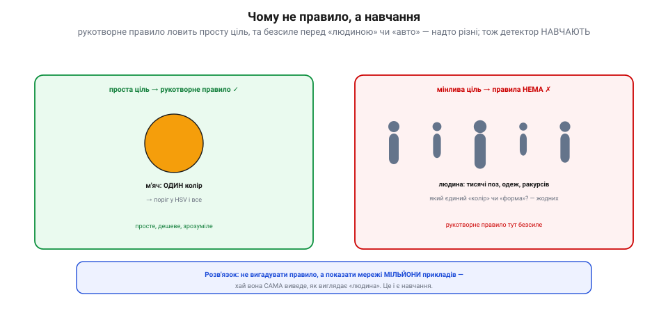
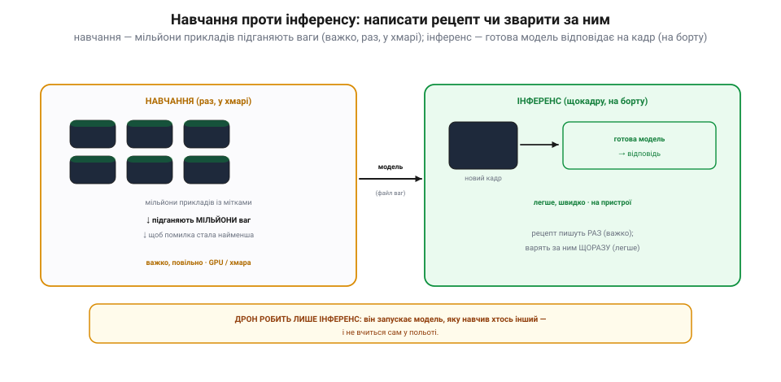
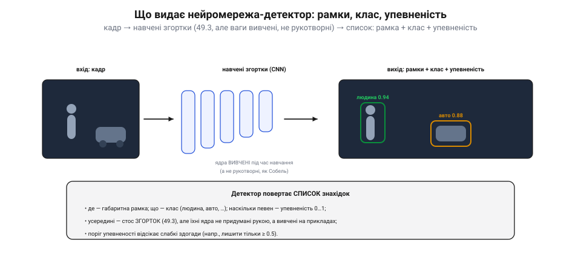
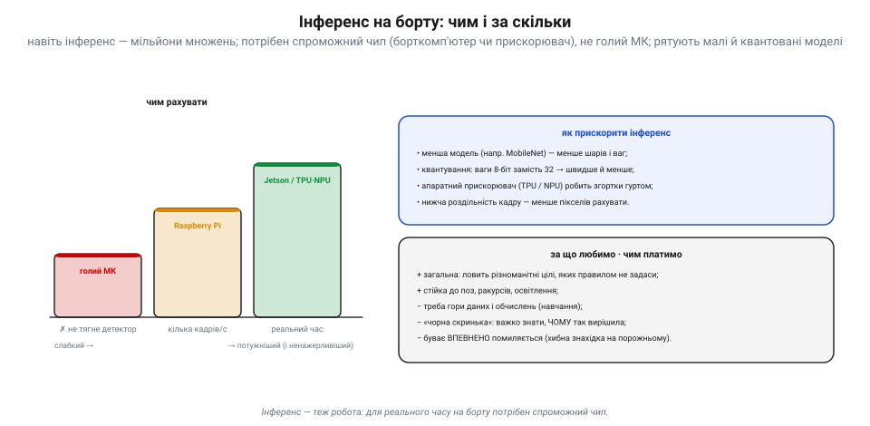

# Нейромережі-детектори: що таке навчена модель (інференс)

<preknowlist>
- [Виявлення об'єктів](topic:sf-visual/object-detection) — детектор шукає ціль за рукотворним правилом (поріг за кольором чи формою) і повертає, де вона на кадрі.
- [Згортки й фільтри](topic:sf-visual/convolution-filters) — маленьке ядро ковзає кадром і підсвічує ознаки: краї, текстури, плями.
</preknowlist>

[Класичні детектори](topic:sf-visual/object-detection) тримаються на **рукотворному правилі**: ти сам кажеш, за якою прикметою шукати. Та для багатьох цілей такого правила просто **немає** — і тоді детектор не програмують, а **навчають** на прикладах. Це і є нейромережі. Ця тема не про математику навчання, а про головне для апарата: що таке **навчена модель** і що означає запустити її на борту — **інференс** (*inference* — виведення).

> 📜 Глибша історія теми: [від перцептрона до AlexNet](topic:sf-visual/nn-detectors/hist-neural-nets.md) — як ідею «машини, що вчиться бачити», двічі ховали як глухий кут, і двічі вона верталася, аж поки 2012-го не перемогла остаточно.

### Чому не правило, а навчання

Візьми помаранчевий м'яч: один колір — і правило в HSV ловить його чудово. А тепер спробуй написати правило для «**людини**»: який у неї колір? форма? Жодного єдиного — людина буває в тисячах поз, одеж і ракурсів. Рукотворна прикмета тут безсила.

*Ліворуч: проста ціль (м'яч — один колір) чудово ловиться **рукотворним правилом** (поріг у HSV) — дешево й зрозуміло. Праворуч: мінлива ціль (людина — тисячі поз, одеж, ракурсів) не має єдиного «кольору» чи «форми», тож правила не напишеш. Розв'язок: показати мережі **мільйони прикладів** і дати їй самій вивести, як виглядає «людина».*

Замість вигадувати правило, ми **показуємо** мережі мільйони прикладів — фото з підписами «тут людина», «тут авто» — і вона **сама** виводить, які ознаки відрізняють одне від одного. Це і є машинне навчання: не запрограмувати прикмету, а **вивчити** її з даних. Так детектор стає **загальним** — ловить те, що жодним простим правилом не задаси.

### Навчання проти інференсу

Ось найважливіше розрізнення. Життя нейромережі ділиться на дві геть різні фази — [навчання та інференс](topic:sf-ml/train-vs-inference) стосуються будь-якої моделі, а тут дивимося на них очима бортового детектора.

*Зліва **навчання**: мережі дають мільйони прикладів із мітками, і вона підганяє свої **мільйони ваг**, щоб помилка стала найменшою — важко, повільно, раз, на потужних машинах (GPU, хмара). Результат — **модель** (файл ваг). Справа **інференс**: цю готову модель запускають на **новому** кадрі й дістають відповідь — легше, швидко, на пристрої. Як рецепт: написати його — морока (раз), а зварити за ним — щоразу легше.*

**Навчання** (*training*): мережі згодовують мільйони прикладів із мітками, і вона потроху підкручує свої внутрішні **ваги** (мільйони чисел), доки не навчиться вгадувати правильно. Це важко й повільно, потребує гір даних і потужних машин (GPU, хмара) — і робиться **один раз**. Результат — **навчена модель**: по суті, файл із вивченими вагами. **Інференс** (*inference*): цю **готову** модель запускають на **новому** кадрі — і вона видає відповідь. Це легше й швидше, і робиться **щокадру**, на самому пристрої. Аналогія — кулінарія: скласти рецепт (навчання) важко й робиться раз; варити за ним (інференс) — щоразу й легше. **Ключове для нас**: дрон робить **лише інференс** — він запускає модель, яку навчив хтось інший, і **не вчиться сам** у польоті.

### Що видає детектор: рамки, клас, упевненість

Що ж усередині навченого детектора — і що він повертає? Усередині — стос [**згорток**](topic:sf-visual/convolution-filters), але їхні ядра не придумані рукою (як Собель), а **вивчені** під час навчання. Це й називають [згортковою нейромережею (**CNN**)](topic:sf-ml/cnn).

*Кадр проходить крізь стос **навчених згорток** (CNN) — тих самих згорток, але з ядрами, **вивченими** на прикладах, а не рукотворними. На виході — **список знахідок**: де (габаритна **рамка**), що (**клас** — людина, авто…) і наскільки певен (**упевненість** 0…1). Поріг упевненості відсікає слабкі здогади.*

На вході — кадр; на виході — **список знахідок**, де кожна має три речі: **рамку** (де об'єкт), **клас** (що це — людина, авто, собака…) і **упевненість** (число 0…1, наскільки мережа певна). Скажімо, «людина 0.94», «авто 0.88». Це типовий вихід сучасних детекторів (на кшталт YOLO). **Поріг упевненості** дає змогу відсікти слабкі здогади — лишити, наприклад, тільки знахідки ≥ 0.5. Згортки роблять ту саму роботу, що й [рукотворні фільтри](topic:sf-visual/convolution-filters) (шукають ознаки, текстури, [межі](topic:sf-visual/edge-detection)), та оскільки їхні ваги **вивчені**, мережа сама склала з простих ознак складні — від країв до «вух», «коліс», «облич».

> 📜 **Нейрон, що побачив край: Г'юбел і Візел і котячий мозок (1959).** Чому згорткова мережа складає образ саме з **країв і простих ознак**? Бо так влаштований живий зір — і відкрили це майже випадково. Наприкінці 1950-х двоє нейрофізіологів, **Девід Г'юбел** і **Торстен Візел**, устромляли тонесенький електрод у зорову кору **кота** й світили йому на екран різні плями, намагаючись змусити нейрон озватися. Виходило кепсько — аж доки одного разу, коли вони міняли скляну пластинку в проєкторі, її **край** ковзнув екраном тонкою лінією під певним кутом — і нейрон **вистрілив** чергою імпульсів. Дослідники збагнули: ця клітина реагує не на пляму, а на **орієнтований край**. Виявилося, що в корі є **прості клітини** (ловлять межу під певним кутом і в певнім місці) і **складні** (ловлять край будь-де) — тобто зір будується **шарами**, від простих ознак до складних. За це відкриття 1981 року їм дали Нобелівську премію, а ще воно надихнуло інженерів: сучасні [згорткові мережі](topic:sf-visual/convolution-filters) — це і є рукотворна копія тих шарів, де кожен наступний складає зі знайдених країв усе складніші форми. Твій бортовий детектор бачить світ так, як півстоліття тому навчив нас бачити кіт у лабораторії.

### Інференс на борту: чим і за скільки

Здавалося б, інференс легкий — та «легкий» тут відносний. Прогнати кадр крізь мережу — це все одно **мільйони множень**, тож голий мікроконтролер його **не потягне**.

*Чим рахувати: голий **МК** детектор не тягне; **Raspberry Pi** дасть кілька кадрів за секунду; **Jetson** чи апаратний прискорювач (**TPU/NPU**) — реальний час. Прискорюють інференс меншою моделлю (MobileNet), **квантуванням** (ваги 8-біт замість 32), апаратним прискорювачем і нижчою роздільністю. Плата за загальність: гори даних і обчислень, «чорна скринька» (важко знати, **чому** так вирішила) і ризик **упевнено** помилитися.*

Для інференсу на апараті потрібен **спроможний чип**: бортовий комп'ютер (Raspberry Pi дасть кілька кадрів за секунду, Jetson — реальний час) або апаратний **прискорювач** (TPU/NPU), що робить згортки гуртом. Швидкість міряють у **кадрах за секунду**, і її має вистачати для керування. Прискорюють інференс кількома шляхами: **менша** модель (MobileNet — менше шарів), [**квантування** (ваги по 8 біт замість 32)](topic:sf-ml/tinyml) → швидше й компактніше, апаратний прискорювач, нижча роздільність кадру. А за загальність нейромережі платять трьома цінами: потрібні **гори даних і обчислень**; модель — «**чорна скринька**» (важко сказати, **чому** вона так вирішила); і вона буває **впевнено помиляється** — бачить ціль там, де її нема. Тому вихід детектора завжди **перевіряють**: порогом упевненості, здоровим глуздом сцени, іншими давачами.

І навіть перевірена знахідка — це ще не дія. Рамка з класом і впевненістю каже апаратові лише «отут на кадрі щось є»; щоб із цього вийшов маневр, піксель треба звести до [кута й трека](topic:sf-visual/tracking) — перетворити знахідку на кадрі на **керування**. Оце й є те, за що береться апарат, щойно детектор віддав список рамок.

> 🔧 **Навіщо це.** Бери нейромережу-детектор, коли ціль **надто мінлива** для правила (люди, авто, тварини, перешкоди різного вигляду). Запускай **готову, наперед навчену** модель — завантаж і розгорни, **не намагайся вчити** її на борту. Для інференсу постав **спроможний чип** (Jetson чи Pi з прискорювачем), а не голий МК, і переконайся, що **кадрів за секунду** вистачає для керування. Бери **малу/квантовану** модель, аби влізти в [бортові ват і байти](topic:hw-arch/compute-cost). І ніколи не вір детектору сліпо: став **поріг упевненості**, перевіряй знахідки іншими даними — «чорна скринька» вміє впевнено брехати. А для простих, чітко заданих цілей **[класика](topic:sf-visual/object-detection) дешевша й прозоріша** — не тягни нейромережу там, де досить порога в HSV.
