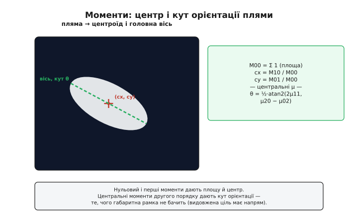
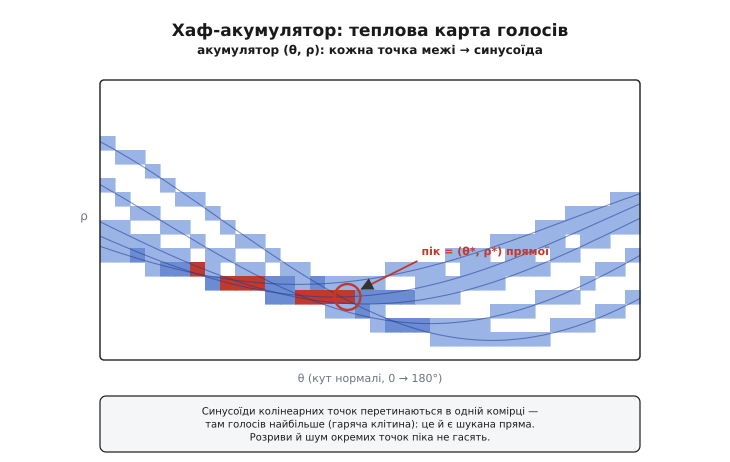
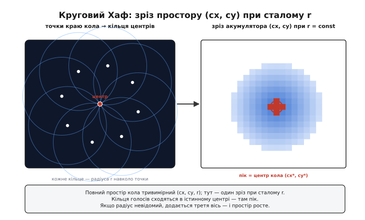
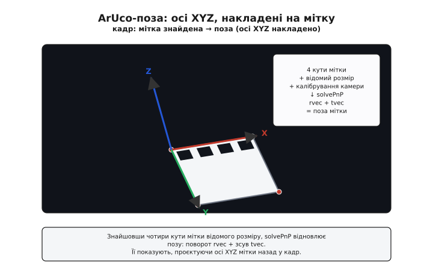
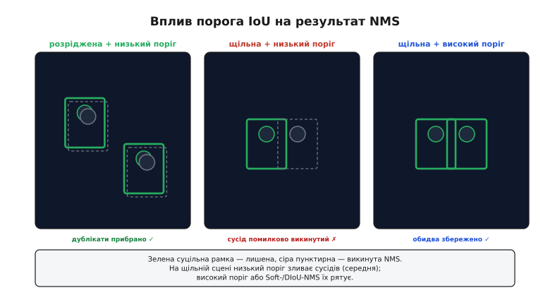

# Виявлення об'єктів — детально

[Базова стаття](root:sf-visual/object-detection) показала головну думку класичного виявлення: обери **прикмету**, якою ціль виділяється — колір, форму, геометричний примітив чи взірець, — і зведи кадр до **габаритних рамок**. Тут розберемо кожен із цих детекторів до дна: виведемо формули, на яких вони стоять, пройдемо повні робочі конвеєри на C, і — головне — побачимо, **де** кожен ламається. Бо саме межі застосовності відрізняють того, хто запустив приклад з підручника, від того, хто змусив детектор працювати на реальному брудному кадрі з борту апарата.

Підемо так: спершу колірна пляма з усією арифметикою моментів; тоді перетворення Хафа — від виведення `ρ = x·cosθ + y·sinθ` до кругової версії; далі контурний аналіз із алгоритмом обходу й спрощенням; тоді мітки [ArUco/AprilTag](root:sf-visual/aruco-apriltag) з відновленням пози; і нарешті проріджування рамок — IoU, NMS і його розумніші родичі. Кожен крок — з пастками, на яких він провалюється.

## Колірна пляма: від HSV до моментів

Колір — найдешевший сигнал, тож почнімо з нього й розберемо до останнього байта. Уся ідея: перевести кадр у простір, де «помаранчевість» сидить в **одному** числі, лишити порогом тільки це число, почистити маску й дістати з плями геометрію.

### Чому саме HSV і як рахується тон

У RGB колір розмазаний по трьох каналах і повзе разом з яскравістю: той самий м'яч на сонці й у тіні дає різні (R, G, B). Простір **HSV** (Hue-Saturation-Value: тон-насиченість-яскравість) розділяє «який це колір» (тон) від «наскільки він яскравий» (яскравість), тож тон майже не залежить від освітлення.

Виведемо перехід RGB→HSV від суті. Візьмемо канали в частках 0…1. Нехай `M = max(R,G,B)`, `m = min(R,G,B)`, а `C = M − m` — **хрома** (наскільки колір далекий від сірого). Яскравість у моделі HSV — це просто найсвітліший канал, `V = M`. Насиченість — частка хроми від яскравості, `S = C/M` (для `M>0`; чорний піксель сірий, його тон не визначений). Тон — це **кут на колірному колі**, і він залежить від того, який канал найбільший:

```
        ⎧ 60° · ((G−B)/C mod 6),   якщо M = R
H  =    ⎨ 60° · ((B−R)/C + 2),     якщо M = G
        ⎩ 60° · ((R−G)/C + 4),     якщо M = B
```

Чому саме так? Колір розміщують на колі: червоний на 0°, зелений на 120°, синій на 240°. Якщо найбільший канал — червоний, то колір лежить у секторі навколо 0°, а нахил усередині сектора задає різниця двох інших каналів `(G−B)`, поділена на хрому (щоб нормувати). Кожні наступні 120° додають за зміни «головного» каналу. Так шість секторів кола склеюються в неперервний тон 0…360°.

На мікроконтролері плаваючу арифметику уникають: тон тримають цілим, а щоб 0…359 влізло в байт, ділять навпіл (0…179) — точно як OpenCV. Повний робочий код переходу й порогу — в [конвеєрі кольорової плями](root:sf-visual/object-detection/proj-color-blob.md); тут зосередимося на тому, що з цього виходить геометрично.

### Поріг із wraparound: пастка червоного

Поріг лишає тільки потрібний тон, але з **червоним** криється підступ, який ловить кожного. Червоний сидить на **стику кола**: він і трохи більший за 0°, і трохи менший за 360°. Тобто червоне — це водночас `H ≈ 0…10°` **і** `H ≈ 350…360°`. Наївна перевірка «тон у `[350, 10]`» через `H ≥ 350 && H ≤ 10` ніколи не спрацює — немає числа, одночасно більшого за 350 і меншого за 10, — і маска вийде порожньою.

Причина в тім, що тон **циклічний**, а число в пам'яті — ні: на переході 360°→0° лінійний поріг рветься (англ. *wraparound*, «перехід через край»). Лікування — два вікна через АБО:

```c
// червоний перетинає 0°: два діапазони (h2 — тон/2, 0..179)
int red = (h2 <= 8 || h2 >= 172) && s >= 120 && v >= 60;
```

Правило просте: будь-який колір, чий тон близький до нуля (червоний, рожевий, частина тілесних), перевіряй **двома** діапазонами; кольори всередині шкали (помаранчевий, жовтий, зелений, синій) обходяться одним.

> 🔧 **Навіщо це.** Wraparound — найчастіша причина «не бачить червоне» у новому коді детектора. Якщо твоя ціль червона (а червоних маркерів і кульок повно), один наївний діапазон дасть порожню маску, і ти годинами шукатимеш помилку в морфології чи камері, тоді як вона в одному рядку порогу. Запам'ятай: тон по колу, поріг по прямій — на стику вони не сходяться.

### Центроїд через моменти

Чиста маска готова — тепер дістанемо з плями геометрію. Центр рахують через **моменти зображення** — зважені суми координат білих пікселів. Це не магія статистики, а пряма арифметика. Момент порядку (p, q) — це сума добутків координат у відповідних степенях по всіх білих пікселях:

```
M_pq = Σ  x^p · y^q       (сума по всіх пікселях маски, де піксель = 1)
```

Три перші моменти дають усе потрібне. **Нульовий** `M00 = Σ 1` — просто кількість білих пікселів, тобто **площа** плями. **Перші** `M10 = Σ x` і `M01 = Σ y` — суми координат. Центр маси (**центроїд**, від лат. *centrum* — осердя) — їхнє відношення:

```
cx = M10 / M00       cy = M01 / M00
```

Чому відношення дає центр? `M10` — сума всіх іксів; поділивши на їхню кількість `M00`, дістаємо **середній** ікс. Середнє координат і є центр маси — точка, навколо якої пляма «зрівноважена». Те саме по вертикалі.


*Моменти дають не лише центр, а й напрям. Нульовий момент — площа, перші два дають центроїд (cx, cy). А центральні моменти другого порядку (μ20, μ02, μ11 — ті самі суми, але відносно центра) задають кут головної осі: θ = ½·atan2(2μ11, μ20 − μ02). Габаритна рамка цього не бачить — видовжена ціль має напрям, і моменти його знаходять.*

А якщо ціль **видовжена** (маркер-смужка, стрілка), корисний ще й **кут орієнтації**. Його дають **центральні** моменти — ті самі суми, але відносно вже знайденого центра: `μ20 = Σ(x−cx)²`, `μ02 = Σ(y−cy)²`, `μ11 = Σ(x−cx)(y−cy)`. Кут головної осі:

```
θ = ½ · atan2( 2·μ11 ,  μ20 − μ02 )
```

Це той самий кут, під яким еліпс інерції плями найбільше витягнутий. Габаритна рамка напряму не знає — вона завжди по осях кадру; моменти ж дають справжню орієнтацію цілі. Повний C-конвеєр із захопленням, порогом, морфологією й цим обчисленням моментів зібрано в [окремій вставці](root:sf-visual/object-detection/proj-color-blob.md), щоб тут не дублювати код.

### Оцінка відстані через кутовий розмір

Площа плями дає **грубу дальність**. Якщо ми знаємо реальний розмір цілі (діаметр м'яча `D`), то видимий кутовий розмір спадає обернено до відстані. Через фокусну віддаль камери `f` (у пікселях) видимий діаметр у кадрі:

```
d_пікс ≈ f · D / Z          →          Z ≈ f · D / d_пікс
```

де `Z` — відстань до цілі. А видимий діаметр зв'язаний із площею плями: `d_пікс ≈ 2·√(area/π)` (з площі круга). Звідси відстань прямо з площі:

```
Z ≈ f · D / ( 2·√(area/π) )
```

Це груба оцінка (ціль має бути приблизно круглою й цілком у кадрі), але для «ближче-далі» в стеженні її досить. Пастка очевидна: щойно ціль частково виходить за край кадру, площа падає, і дальність «стрибає» — тож на оцінку дальності покладаються лише доки рамка цілком усередині.

## Перетворення Хафа: простір параметрів

Колірна пляма безсила, коли ціль задана не кольором, а **геометрією** — прямою лінією чи колом, та ще й розірваними шумом. Тут править [перетворення Хафа](root:sf-visual/object-detection/hist-hough.md) (за прізвищем Пола Хафа). Його ідея — **голосування**: кожна точка межі голосує за всі форми, що крізь неї проходять; де голоси збіглися, там форма. Розберемо математику, бо саме вона пояснює всю силу й усі межі методу.

### Виведення ρ = x·cosθ + y·sinθ

Чому точка стає **синусоїдою**, а не прямою? Це найважливіше місце, і його варто вивести, а не завчити. Опишемо пряму не звичним `y = k·x + b`, а парою (ρ, θ): `ρ` — перпендикулярна відстань від початку координат до прямої, `θ` — кут цього перпендикуляра. Візьмемо точку `P = (x, y)` на прямій. Проєкція її радіус-вектора на напрямок нормалі `n = (cosθ, sinθ)` дорівнює саме відстані до прямої:

```
ρ = x·cosθ + y·sinθ
```

Тепер прочитаймо це рівняння, **зафіксувавши точку (x, y)** і пустивши `θ`. Сума `x·cosθ + y·sinθ` — це косинус і синус однієї частоти, а їхня сума згортається в один косинус:

```
ρ(θ) = R·cos(θ − φ),     R = √(x²+y²),   φ = atan2(y, x)
```

Отже **одна точка зображення — одна синусоїда** в площині (θ, ρ) з амплітудою, що дорівнює відстані точки від початку координат. Точки, що лежать на одній прямій, дають синусоїди, які перетинаються в одній комірці (θ*, ρ*) — параметрах тієї прямої. Повне виведення з геометрії нормалі, з обґрунтуванням меж параметрів, — у [математичній вставці](root:sf-visual/object-detection/math-hough.md).

### Чому «нахил-зсув» ламається на вертикалі

Перший патент Хафа (1962) задавав пряму звичним `y = k·x + b`, і саме на цьому спіткнувся. Нахил `k` **необмежений**: для майже вертикальної лінії він мчить у нескінченність, для строго вертикальної — взагалі не існує. Простір (k, b) безмежний, його не накрити скінченною сіткою лічильників — а вертикальні краї (стовпи, борти, стіни) у кадрі неминучі.

Полярна параметризація Дуди й Гарта (1972) лагодить це одним вибором координат: `θ ∈ [0°, 180°)`, `ρ ∈ [−D, D]` (D — діагональ кадру). Обидва параметри **скінченні**, вертикаль перестає бути особливою (їй просто `θ = 0°`). Чому полярна форма усуває вироджені вертикалі — детально розписано в [математиці Хафа](root:sf-visual/object-detection/math-hough.md); тут досить підсумку: безмежний простір став прямокутником, який кладеться в масив лічильників фіксованого розміру.

### Акумулятор і розмір комірки

**Акумулятор** (англ. *accumulator*, «накопичувач») — двовимірний масив цілих, проіндексований дискретними (θ, ρ). Голосування: для кожної точки межі пробігаємо всі `θ`, рахуємо `ρ`, додаємо одиницю до комірки. Тоді шукаємо локальні максимуми — це знайдені прямі.


*Реальний акумулятор Хафа. Кожна точка межі малює синусоїду ρ(θ); синусоїди п'яти колінеарних точок перетинаються в одній комірці — там голосів найбільше (гаряча клітина, обведений пік). Це й є шукана пряма (θ*, ρ*). Окремі шумові точки додають голоси врозсип і піка не створюють, а розрив у лінії лише трохи знижує пік — він не зникає.*

Розмір комірки (Δθ, Δρ) — **компроміс точність ↔ стійкість**. Дрібна комірка локалізує пряму точно й розрізняє близькі паралельні лінії, але голоси однієї прямої розмазуються по сусідніх комірках (через шум координат), пік нижчає й може потонути. Груба комірка дає високий чіткий пік, стійкий до шуму, але грубшу точність і ризик злити дві близькі лінії в одну. Типово беруть `Δθ ≈ 1°`, `Δρ ≈ 1…2` пікселі: брудний кадр просить грубшої комірки, чистий із близькими лініями — дрібнішої.

### Кругова версія: голосування в (cx, cy, r)

Та сама ідея ловить **кола** — лише простір параметрів стає тривимірним. Коло задають центр (cx, cy) і радіус `r`: `(x−cx)² + (y−cy)² = r²`. Кожна точка краю голосує не за синусоїду, а за **поверхню** в просторі (cx, cy, r): для кожного пробного радіуса вона могла б лежати на колі, чий центр сам лежить на колі того радіуса навколо неї.


*Круговий Хаф у зрізі. Зафіксуймо радіус r. Кожна точка краю кола голосує за кільце можливих центрів (радіуса r навколо себе) — ліворуч. Усі кільця сходяться в одній точці — справжньому центрі кола; у зрізі акумулятора (cx, cy) при цьому r там виникає пік (праворуч). Якщо радіус невідомий, додається третя вісь, і простір (а з ним — ціна) росте.*

Якщо радіус відомий (посадковий майданчик відомого діаметра з відомої висоти), `r` фіксують, і простір стає двовимірним, як для прямих, — дешево й швидко. Якщо невідомий, перебирають діапазон радіусів, і ціна множиться. Складність прямих — `O(N·M)` (N точок, M кутів), кіл — `O(N·M·R)` із зайвим множником `R` (число радіусів); виведення обох оцінок — у [математиці Хафа](root:sf-visual/object-detection/math-hough.md). Практичне правило: **звужуй простір, де можеш** — обмежений радіус чи діапазон кута прямо ріже і час, і пам'ять.

> 🔧 **Навіщо це.** Знаючи приблизний розмір посадкового кола з висоти польоту, ти обмежуєш `r` вузьким вікном — і круговий Хаф із важкого тривимірного голосування стає легким двовимірним, що крутиться в реальному часі на борту. Те саме з лінією горизонту: вона майже горизонтальна, тож діапазон `θ` можна звузити до ±20° навколо нуля — і акумулятор схудне в кілька разів. Кожне апріорне знання про сцену — це прямий виграш у швидкості.

### Пастка: Хаф на кривих об'єктах

Головна пастка Хафа — він знаходить **рівно ту форму, яку шукає**, і не вміє сказати «тут нема прямої». Якщо нацькувати пошук прямих на **криву** межу (дугу, хвилясту лінію), акумулятор усе одно дасть піки: короткі майже-прямі ділянки дуги зберуть локальні максимуми, і метод упевнено «знайде» кілька прямих, яких насправді нема. Так само пошук кіл на овалі чи частково затуленому колі дасть зміщений або розмитий пік. Лікування — не довіряти піку наосліп: перевіряти знайдену форму назад на зображенні (скільки точок межі справді лягають на неї) і відкидати слабкі. Хаф — потужний голосувальник, але рішення «це справді пряма» лишається за тобою.

## Контурний аналіз: від обходу до круглості

Коли ціль задана **формою** (трикутна мітка, квадратна площадка, кругла ціль), її впізнають через контур: обведи пляму, спрости до многокутника, порахуй кути або круглість. Розберемо механіку.

### Обхід контуру за Сузукі–Абе

Спершу контур треба **дістати** з бінарної маски — упорядкований список пікселів межі. Класичний алгоритм — **Сузукі–Абе** (Satoshi Suzuki, Keiichi Abe, 1985; те, що під капотом у `findContours` OpenCV). Ідея: скануємо зображення рядок за рядком, доки не натрапимо на перший піксель межі (білий, у якого є чорний сусід). Звідти **обходимо межу по колу**: на кожному кроці дивимося на 8 сусідів за годинниковою стрілкою від напрямку, звідки прийшли, і знаходимо наступний піксель межі. Так, тримаючись краю, обходимо весь контур, поки не вернемося в старт. Алгоритм заразом розрізняє **зовнішні** межі й межі **дір** усередині та будує їхню ієрархію (хто в кому вкладений) — корисно, коли мітка має внутрішній малюнок.

Результат — замкнений ланцюжок координат. Він точний, але **надлишковий**: пряма ділянка контуру описана десятками пікселів, хоч її задають дві точки. Тому наступний крок — спрощення.

### Спрощення Дугласа–Пекера

Ланцюжок із сотень точок зводять до кількох вершин многокутника алгоритмом **Дугласа–Пекера** (David Douglas, Thomas Peucker, 1973). Логіка рекурсивна й проста. Візьми відрізок від першої до останньої точки контуру. Знайди точку, найдальшу від цього відрізка. Якщо її відстань менша за поріг `ε` — уся ділянка майже пряма, викинь усі проміжні точки. Якщо більша — ця точка важлива (тут контур згинається), лиши її й **рекурсивно** спрости дві половини ліворуч і праворуч від неї.

```
спростити(точки, ε):
    знайти точку P, найдальшу від хорди [перша..остання]
    d = відстань(P, хорда)
    якщо d < ε:  лишити тільки кінці        ← ділянка пряма
    інакше:      лишити P, рекурсія на [перша..P] і [P..остання]
```

Поріг `ε` — важіль грубості. Малий `ε` лишає всі дрібні згини (контур точний, але шумний, зайві вершини). Великий `ε` різко спрощує (квадрат точно зведеться до 4 вершин, але кутик надламаної мітки згладиться). Типово `ε` беруть як малу частку периметра контуру (`ε ≈ 0.02·P`), щоб поріг сам масштабувався під розмір фігури.

### Кути й круглість

Спрощений многокутник уже майже все каже **числом вершин**: 3 — трикутник, 4 — чотирикутник. Але «4 вершини» ще не квадрат: треба перевірити **кути**. Кут при вершині — це кут між двома сусідніми відрізками; його беруть через скалярний добуток векторів:

```
cos(кут) = (v1 · v2) / (|v1|·|v2|)        v1, v2 — сторони, що сходяться у вершині
```

Для квадрата всі кути ≈ 90° (косинус ≈ 0), сторони ≈ рівні. Так відсіюють випадкові чотирикутники.

А коло вершин не має — його ловлять **круглістю** (англ. *circularity*). Це міра, наскільки фігура схожа на ідеальне коло, через площу `A` і периметр `P`:

```
circularity = 4π·A / P²
```

Для ідеального кола вона дорівнює рівно 1 (бо `A = πr²`, `P = 2πr`, тож `4π·πr²/(2πr)² = 1`). Для будь-якої іншої фігури — менша: у квадрата ≈ 0.785, у видовженого прямокутника ще менша, бо периметр на ту саму площу більший. Поріг `circularity > 0.85` надійно відрізняє кола.

### Worked-приклад: знайти коло, відсіяти не-кола

Зберімо контурний детектор кола на C: обходимо знайдені контури, рахуємо площу й периметр, лишаємо тільки ті, чия круглість і площа в потрібних межах.

🔧 **Умова.** Маємо список контурів (кожен — масив точок). Знайти серед них кола: круглість понад 0.85 і площа понад мінімум (відсіяти шумові цятки).

:::tabs
```cpp
typedef struct { int x, y; } Pt;

// площа замкненого контуру (формула шнурівки) і периметр
static void contour_geom(const Pt *c, int n, double *area, double *perim) {
    double A = 0.0, P = 0.0;
    for (int i = 0; i < n; i++) {
        Pt a = c[i], b = c[(i + 1) % n];
        A += (double)a.x * b.y - (double)b.x * a.y;     // шнурівка (Гаусса)
        double dx = b.x - a.x, dy = b.y - a.y;
        P += sqrt(dx * dx + dy * dy);                    // довжина сторони
    }
    *area  = fabs(A) * 0.5;
    *perim = P;
}

static int is_circle(const Pt *c, int n, double min_area) {
    if (n < 5) return 0;                                 // замало точок на коло
    double A, P;
    contour_geom(c, n, &A, &P);
    if (A < min_area || P <= 0.0) return 0;              // шум або вироджений контур
    double circularity = 4.0 * 3.14159265 * A / (P * P);
    return circularity > 0.85;                           // близько до ідеального кола
}
```
```python
import math

# контур — список точок (x, y)

# площа замкненого контуру (формула шнурівки) і периметр
def contour_geom(c):
    n = len(c)
    A = P = 0.0
    for i in range(n):
        (ax, ay), (bx, by) = c[i], c[(i + 1) % n]
        A += ax * by - bx * ay                          # шнурівка (Гаусса)
        P += math.hypot(bx - ax, by - ay)               # довжина сторони
    return abs(A) * 0.5, P

def is_circle(c, min_area):
    if len(c) < 5:                                       # замало точок на коло
        return False
    A, P = contour_geom(c)
    if A < min_area or P <= 0.0:                         # шум або вироджений контур
        return False
    circularity = 4.0 * math.pi * A / (P * P)
    return circularity > 0.85                            # близько до ідеального кола
```
:::

Площу беремо **формулою шнурівки** (Гаусса) — знакова сума добутків координат сусідніх вершин дає подвоєну площу многокутника; модуль і навпіл — сама площа. Працює для будь-якого простого контуру, не лише опуклого. Підставмо коло радіуса 30 (з контуру ≈ `A ≈ 2827`, `P ≈ 188`):

```
circularity = 4π · 2827 / 188²  =  35522 / 35344  ≈  1.005
```

Близько до 1 — це коло, лишаємо. Для квадрата 50×50 (`A = 2500`, `P = 200`) вийшло б `4π·2500/200² ≈ 0.785` — нижче порога, відкидаємо. Так арифметика над контуром розрізняє форми без жодного навчання.

## Мітки ArUco/AprilTag: від квадрата до пози

Коли потрібні не лише «де об'єкт», а й **точна поза** (положення й кути) — на сцену виходять [фідуційні мітки](root:sf-visual/aruco-apriltag) (від лат. *fiducia* — довіра): спеціально намальовані чорно-білі квадрати, як-от **ArUco** та **AprilTag**. Розберемо механіку від виявлення квадрата до відновлення пози.

### Виявлення квадрата й декодування ID

Мітку шукають у три кроки. Спершу **поріг** робить кадр чорно-білим (мітка контрастна за побудовою). Тоді **контурний аналіз** (той самий Сузукі–Абе + Дуглас–Пекер) знаходить чотирикутники: замкнені контури, що спрощуються рівно до 4 вершин з ≈прямими кутами. Кожен такий квадрат — кандидат на мітку.

Далі квадрат **декодують**. Знаючи 4 кути, його «розпрямляють» (перспективним перетворенням приводять до прямого квадрата) і ділять на сітку клітинок (для ArUco — типово 6×6 чи більше з рамкою). Кожну клітинку читають як **біт**: чорна — 0, біла — 1. Виходить бітова матриця; її звіряють зі **словником** відомих міток. Тут криється головна цінність: коди в словнику дібрані так, щоб відрізнятися один від одного багатьма бітами (велика **відстань Геммінга**), тож кілька неправильно прочитаних клітинок не перетворять одну мітку на іншу — код самовиправний. Так мітка віддає свій **ID** надійно, навіть під кутом і в шумі.

### Розв'язок PnP: від кутів до пози

Маючи 4 кути мітки в кадрі та знаючи її **реальний розмір**, можна відновити, **де** мітка в просторі відносно камери. Це задача **PnP** (англ. *Perspective-n-Point*, «перспектива за n точками»): знайти поворот і зсув камери, за яких відомі тривимірні точки (кути мітки в її власних координатах: (0,0,0), (s,0,0), (s,s,0), (0,s,0)) спроєктувалися б рівно туди, де їх видно в кадрі.

Розв'язок дає дві величини: **rvec** (вектор повороту — як мітка повернута) і **tvec** (вектор зсуву — де її центр у просторі камери). Разом це повна **поза**. Для PnP потрібне ще **калібрування камери** — її фокусна віддаль і центр (матриця камери), бо без них не зв'язати пікселі з кутами зору.


*Від мітки до пози. Детектор знаходить чотири кути мітки (червоні точки). Знаючи її реальний розмір і калібрування камери, solvePnP розв'язує задачу PnP і повертає позу: поворот rvec + зсув tvec. Позу показують, проєктуючи осі мітки назад у кадр — X (червона) і Y (зелена) лежать у площині мітки, Z (синя) виходить із неї перпендикулярно. Саме ця поза каже автопілоту, де він відносно посадкової мітки.*

### Worked-приклад: поза мітки й кути Ейлера

На реальному борту це робить готова бібліотека (OpenCV/ArUco), але важливо розуміти потік даних. Ось скелет на C++ від виявлення до кутів орієнтації:

🔧 **Умова.** Кадр із камери, відоме калібрування й розмір мітки 0.15 м. Знайти мітку, відновити позу, дістати кути Ейлера (крен, тангаж, рискання).

```cpp
cv::Mat frame = grab_frame();
std::vector<int> ids;
std::vector<std::vector<cv::Point2f>> corners;

// 1. знайти мітки та їхні кути в кадрі
cv::aruco::detectMarkers(frame, dict, corners, ids);

if (!ids.empty()) {
    std::vector<cv::Vec3d> rvecs, tvecs;
    // 2. PnP для кожної мітки: розмір 0.15 м, відомі K (матриця) і dist
    cv::aruco::estimatePoseSingleMarkers(corners, 0.15f, K, dist, rvecs, tvecs);

    // 3. поворот rvec → матриця → кути Ейлера
    cv::Mat R;
    cv::Rodrigues(rvecs[0], R);                  // вектор повороту → матриця 3×3
    double yaw   = atan2(R.at<double>(1,0), R.at<double>(0,0));
    double pitch = atan2(-R.at<double>(2,0),
                         hypot(R.at<double>(2,1), R.at<double>(2,2)));
    double roll  = atan2(R.at<double>(2,1), R.at<double>(2,2));
    // tvecs[0] = (X, Y, Z) зсув мітки в метрах відносно камери
}
```

Потік ясний: `detectMarkers` дає кути й ID; `estimatePoseSingleMarkers` розв'язує PnP і повертає rvec/tvec; `Rodrigues` перетворює вектор повороту на матрицю 3×3, з якої добувають кути Ейлера. `tvec` одразу в метрах (бо розмір мітки задано в метрах) — це і є «де мітка» для автопілота.

### Пастка: мітка має бути плоскою

PnP мовчки припускає, що чотири кути мітки лежать в **одній площині** на відомій відстані один від одного. Якщо мітка **деформована** — наклеєна на вигнуту поверхню, зім'ята, надрукована з викривленням, — реальні кути вже не утворюють ідеального квадрата, і PnP дасть **хибну позу**: поворот і зсув, що «найкраще» підганяють криві дані під пласку модель. Похибка тим більша, чим сильніша деформація. Тому мітку для точної посадки клеять на **жорстку пласку** основу й бережуть від згинання; на м'якій тканині чи вигнутому борту точність пози розсиплеться, хоч ID прочитається.

## Проріджування рамок: IoU, NMS і родичі

Майже кожен детектор — від ковзного шаблону до [нейромережі](root:sf-visual/nn-detectors) — видає на один об'єкт **купу** майже однакових рамок. Лишити всі — об'єкт «потроїться». Потрібні міра схожості рамок і правило відбору.

### IoU формально

Міра — **IoU** (англ. *Intersection over Union*, «перетин поділити на об'єднання»): площу спільної частини двох рамок ділять на площу їхнього об'єднання. Повний збіг — 1, без перекриття — 0. Та сама міра лежить в основі [оцінки якості стеження](root:sf-visual/tracking), де знайдену рамку звіряють з еталонною. Формально, для рамок `A` і `B`:

```
IoU = площа(A ∩ B) / площа(A ∪ B)
    = inter / (area_A + area_B − inter)
```

Площу об'єднання беруть як суму площ мінус перетин (інакше перетин порахується двічі). Робочий C-код IoU і покроковий приклад — у [базовій статті](root:sf-visual/object-detection); тут зосередимося на правилах відбору, що на цій мірі будуються.

### NMS і чому жадібний варіант оптимальний для одного класу

**Придушення немаксимумів** (англ. *non-maximum suppression*, NMS) працює жадібно: бери рамку з найбільшою впевненістю, викидай усі, що сильно з нею перетинаються (IoU вище порога), повторюй з рештою.

```
NMS(рамки, поріг):
    відсортувати за впевненістю спадно
    поки є рамки:
        узяти найвпевненішу B  →  у результат
        викинути всі рамки з IoU(·, B) > поріг
```

Чому для **одного класу** жадібний вибір оптимальний? Бо коли всі рамки змагаються за той самий тип об'єкта, рамка з найвищою впевненістю — найкраща кандидатура на кожне місце, а всі, що сильно її перекривають, — це дублікати того ж об'єкта, тож їх безпечно прибрати. Жодна викинута рамка не могла б дати кращого результату, ніж лишена: вона або дублікат (гірша версія того самого), або належить іншому об'єкту й тоді мало перекривається, тож переживе поріг. За одного класу й коректного порога це міркування строге — оптимальнішого вибору за жадібний нема.

Тонкість виникає за **багатьох класів**: рамки різних класів не повинні придушувати одна одну (кіт за собакою — два об'єкти, що сильно перекриваються, але обидва правильні). Тому NMS застосовують **окремо в межах кожного класу**.

### Soft-NMS і DIoU-NMS

Жадібний NMS має ваду на **щільних** сценах. Якщо два справжні об'єкти стоять близько (їхні рамки сильно перекриваються), NMS викине другий як «дублікат» — і об'єкт зникне. Звідси розумніші варіанти.

**Soft-NMS** замість того, щоб **викидати** рамку з високим IoU, **знижує** їй впевненість пропорційно перекриттю. Сильно перекрита рамка стає менш певною, але не зникає; якщо вона належить окремому об'єктові, то переживе поріг впевненості й лишиться. Так два близькі об'єкти мають шанс уціліти обидва.

```
для кожної рамки, що перекриває переможця з IoU = v:
    score ← score · (1 − v)        ← плавне зниження замість викидання
    (рамку лишають, якщо score не впав нижче порога)
```

**DIoU-NMS** додає до правила **відстань між центрами** рамок (англ. *Distance-IoU*). Дві рамки можуть мати чималий IoU, але рознесені центри — ознака, що це **різні** об'єкти, які лише трохи зачепилися. DIoU-NMS карає за перекриття менше, коли центри далеко: рамку придушують, лише якщо вона і перекрита, **і** її центр близько до переможця. Це ще точніше розділяє сусідні об'єкти, ніж голий IoU.

### Вибір порога під щільність сцени

Поріг IoU у NMS — не константа з підручника, а важіль під **щільність** об'єктів на сцені. Зведемо логіку в таблицю:

| Сцена | Об'єкти | Поріг IoU | Чому |
|---|---|---|---|
| Розріджена (кілька цілей нарізно) | далеко одна від одної | низький (0.3–0.4) | дублікати агресивно прибираються; злиття сусідів не загрожує |
| Звичайна | помірно | середній (0.5) | стандартний компроміс |
| Щільна (натовп, зграя) | майже торкаються | високий (0.6–0.7) + Soft/DIoU | низький поріг злив би сусідів у одного; пускаємо більше перекриття |


*Вплив порога IoU. На розрідженій сцені низький поріг сміливо прибирає дублікати. Але на щільній (натовп) той самий низький поріг помилково зливає двох сусідів у одну рамку — другий об'єкт зникає. Високий поріг (або Soft-/DIoU-NMS) пускає більше перекриття й зберігає обидва. Тож поріг добирають під густоту сцени, а не беруть раз і назавжди.*

> 🔧 **Навіщо це.** Якщо твій детектор «втрачає» об'єкти в щільних групах (двоє людей поруч бачаться як один), винен майже завжди не детектор, а **поріг NMS**: він зливає сусідів. Підніми поріг IoU або візьми Soft-NMS — і другий об'єкт повернеться. А на розрідженій сцені, навпаки, низький поріг чистіше прибирає дублікати. Один параметр, а різниця між «бачить усіх» і «губить половину натовпу».

### Пастка: NMS у щільному натовпі

Підсумуймо найгіршу пастку проріджування. У дуже щільному натовпі **кожна** особа близька до сусідів, тож рамки неминуче сильно перекриваються — і будь-який жадібний NMS почне різати справжні об'єкти, хоч би як ти крутив поріг. Підняти поріг до краю — повернуться дублікати; опустити — зникнуть сусіди. Тут уже не врятує сам NMS: треба або Soft-/DIoU-варіанти, або детектор, що від початку видає менше дублікатів. Це фундаментальна межа: проріджування за перекриттям перестає працювати там, де перекриття справжніх об'єктів — норма, а не виняток.

## Що з цього в апараті

Зведімо все докупи — не переказом, а як **карту рішень**. Класичне виявлення — це завжди вибір прикмети, якою ціль виділяється, і зведення кадру до габаритних рамок.

Якщо ціль **кольорова** — переведи кадр у HSV (тон стійкий до світла), лиши порогом потрібний тон (для червоного — два вікна через wraparound), почисти морфологією й дістань із плями центроїд через моменти `M10/M00`, `M01/M00`, а заразом площу (груба дальність) і — для видовжених цілей — кут орієнтації через центральні моменти.

Якщо ціль — **пряма чи коло**, та ще й розірвана, — голосуй перетворенням Хафа: точка стає синусоїдою в (ρ, θ), пік голосів видає пряму; для кіл простір стає (cx, cy, r), тож звужуй радіус, де можеш. Пам'ятай, що Хаф «знайде» форму навіть там, де її нема, — перевіряй піки назад на зображенні.

Якщо ціль — **геометрична фігура**, обведи контур (Сузукі–Абе), спрости (Дуглас–Пекер з порогом ε) і суди за числом кутів чи круглістю `4πA/P²`.

Якщо потрібна **поза** — став [фідуційну мітку](root:sf-visual/aruco-apriltag): знайди квадрат контуром, прочитай ID із бітової матриці, розв'яжи PnP (rvec + tvec) — і тримай мітку **пласкою**, бо деформована зруйнує позу.

А коли детектор видає **купу рамок** — прорідь їх через IoU і NMS, добираючи поріг під щільність сцени (Soft-/DIoU-NMS для натовпу).

І остання межа, варта пам'яті: усе це працює, поки ціль **чітко задана** рукотворною прикметою. Щойно об'єкт стає надто мінливим (сотні порід «собаки», люди в усіх позах), рукотворні правила здаються — і настає черга [нейромережних детекторів](root:sf-visual/nn-detectors), що виводять прикмету з мільйонів прикладів. Класика й нейромережа не конкуренти, а два інструменти: дешевий і прозорий — для заданих цілей, навчений і важкий — для мінливих. Гарний інженер тримає в руках обидва й знає, коли який брати.
