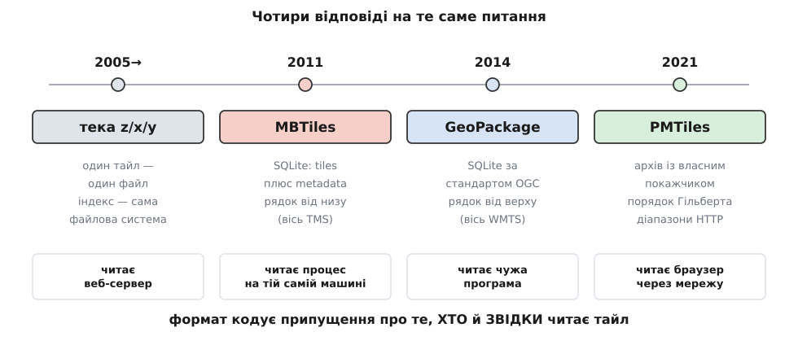
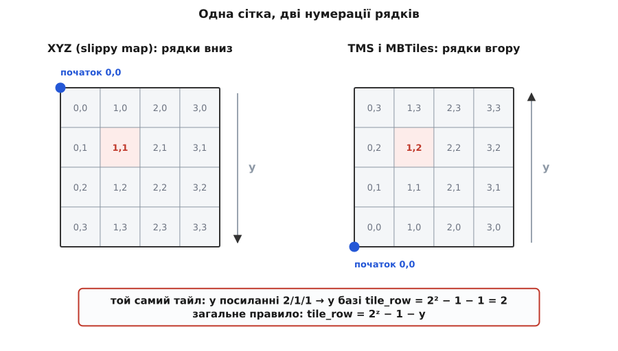

# 📜 Як тайли переїхали з тек у єдиний файл

Чотири рази за двадцять років картографи розв'язували ту саму задачу — де тримати мільйон готових картинок — і щоразу діставали інший розв'язок, бо щоразу мінявся не обсяг даних, а **той, хто ці дані читає**. Тека `z/x/y`, MBTiles, GeoPackage і PMTiles різняться не стисненням і не швидкістю: кожен із них закодував у собі припущення про читача, і саме припущення, а не техніка, робило формат влучним або застарілим. Тому історію цих чотирьох варто читати не як «ставало краще», а як «читач переїжджав, і сховище їхало за ним».


*Один рядок задачі, чотири відповіді. Ліворуч читає веб-сервер із власної теки, праворуч — браузер, що тягне шматки чужого файлу через мережу. Усе інше в форматі випливає з цього.*

## Тека `z/x/y`: коли сховищем була файлова система

8 лютого 2005 року Google запустив Google Maps — карту, яку можна було тягнути мишею, і вона доїжджала слідом, замість перемальовуватися після натискання кнопки. Технологію Google придбав у жовтні 2004 року разом із австралійською компанією Where 2 Technologies, яку заснували брати Ларс і Єнс Расмуссени разом із Ноелом Ґордоном і Стівеном Ма; варто називати всіх чотирьох, бо в переказах зазвичай лишаються самі брати. Спочатку то була програма для настільного комп'ютера мовою C++, і саме перенесення її в браузер зробило те, що потім назвуть **slippy map** (англ. «слизька, ковзка карта»).

Тут потрібне застереження про пріоритет. Плитковий підхід — порізати карту на квадрати й підвантажувати лише видимі — не був вигаданий у Google: мозаїчні мапи в мережі існували й до 2005 року, і навіть обережна довідкова стаття каже про Google Maps лише те, що це був один із перших великих картографічних сайтів, який застосував цей прийом. Твердження «Google винайшов тайли» — типовий приклад того, як популярність задним числом перетворюється на пріоритет; що Google Maps **зробив цей прийом усезагальним** — це вже факт, який ніхто не заперечує. Точнішої дати першості я тут не називаю, бо перевірити її по-справжньому не вдалося.

Разом зі slippy map розійшовся і спосіб адресувати шматки. Тайл має три числа — рівень `z`, стовпець `x`, рядок `y` — і посилання на нього виглядає як `/tiles/14/9134/5567.png`. Оця форма посилання і є вся суть першого сховища: **шлях у посиланні дослівно дорівнює шляху у файловій системі**. Ніякого коду між ними немає. Веб-сервер бере рядок після імені хоста, приліплює до кореня теки й робить `open()`. Індексом слугує сама файлова система, покажчиком — дерево каталогів, кешем — сторінковий кеш ядра, роздачею — звичайний статичний сервер, який ніхто не писав. За задарма, без жодного рядка своєї програми, виходило сховище на мільярди об'єктів.

Це не було наївне рішення — це було рішення **точно під свого читача**. Читач тайла жив на тій самій машині, що й тека, мав до неї постійний доступ, тримав відкритими скільки завгодно дескрипторів і ніколи не мусив цю теку кудись перевозити. За таких умов файлова система — не милиця, а найкращий із можливих контейнерів.

Ламатися все почало тоді, коли той самий набір тайлів захотіли покласти в кишеню. Щойно читачем стає застосунок на ноутбуці чи планшеті, кожна з переваг обертається на свою протилежність: місце, яке файлова система видає цілими блоками, дрібні тайли витрачають намарне; півмільйона файлів роблять теку повільною сама по собі; перервана закачка не лишає по собі жодного спільного стану; а «передай цей район колезі» перетворюється на багатогодинне копіювання дрібноти. Жодна з цих бід не є вадою файлової системи — це наслідок того, що припущення про читача перестало бути правдою.

## Дві нумерації рядків, народжені майже одночасно

Поки практика теки `z/x/y` розходилася сама собою, спільнота OSGeo спробувала її записати — так з'явилася **Tile Map Service Specification** версії 1.0, документ, який відтоді заморожено й більше не редагують. Він описує саме те, що всі й так робили: рівні масштабу, сітку, шлях до тайла. Але в одному місці він зробив вибір, який дорого обійшовся всім наступним.

TMS каже, що номер тайла росте разом із координатою просторової системи: збільшується `x` системи — збільшується номер стовпця, збільшується `y` системи — збільшується номер рядка. Оскільки в географічних системах `y` росте на північ, початок відліку опиняється **в лівому нижньому куті**, і рядки рахуються знизу вгору. Це математично охайно: сітка тайлів упорядкована так само, як сама карта.

Тим часом slippy-map рахує інакше, і довідка OpenStreetMap попереджає про це просто-таки з окликом: тайли slippy map і Google рахують `0,0` **згори вниз** від лівого верхнього кута, а специфікація TMS — знизу вгору від лівого нижнього. Причина в тому, що slippy map — це не картографія, а верстка: у растровому зображенні й у вікні браузера початок координат завжди зверху ліворуч, і рахувати рядки згори означало не робити зайвого перевороту при малюванні. Обидва рішення правильні; кожне правильне у своїй системі відліку. Про саму сітку — як 2ᶻ × 2ᶻ клітинок лягають на глобус і звідки береться така їхня кількість — є [окрема тема](topic:math-geometry/web-mercator-tiles).

Отже, ще до появи першого контейнера в обігу вже було дві несумісні нумерації рядків для однієї й тієї самої сітки. Далі це успадкували всі.

## MBTiles: лютий 2011 і формат, якого немає

Найранішим документальним слідом MBTiles є перший внесок у сховище специфікації: **7 лютого 2011 року**, автор — Том Макврайт, повідомлення «Adding spec version 1.0». Це доказ того, коли текст став публічним; сам формат міг існувати в інструментах Mapbox трохи раніше, а поширену дату «січень 2011» підтвердити з першоджерел мені не вдалося, тож тут вона свідомо не наводиться як факт. Специфікація до того ж від початку колективна: у переліку авторів стоять Ерік Фішер, Константін Кефер, Том Макврайт, Джастін Міллер, Пол Норман, Блейк Томпсон і Вілл Вайт — це не винахід однієї людини, а домовленість групи.

Найцікавіше в MBTiles те, що це **не формат файлу**. Немає ні власного заголовка, ні власного покажчика, ні парсера, який довелося б писати. Є звичайна база SQLite і домовленість про те, як у ній назвати дві таблиці. Специфікація 1.0 вимагає рівно цього: таблиці `tiles` із трьома цілими колонками `zoom_level`, `tile_column`, `tile_row` і однією колонкою-блобом `tile_data`, та таблиці `metadata` з двох колонок `name` і `value`.

```sql
CREATE TABLE tiles (
    zoom_level  integer,
    tile_column integer,
    tile_row    integer,
    tile_data   blob
);
CREATE TABLE metadata (name text, value text);
```

Уся сила рішення сидить у слові «звичайна». Щоб прочитати MBTiles, не треба вчити формат — треба вміти `SELECT`. Транзакції, індекси, довговічність запису, ущільнення, перевірка цілості вже написані, налагоджені й перевірені мільярдом інсталяцій; автору картографічної програми лишається придумати ім'я таблиці. Це рідкісний випадок, коли формат переміг не тому, що добре спроєктований, а тому, що **його майже немає**: за ним стоїть [вбудована база даних](topic:sf-data/embedded-database), яка й робить усю роботу.

Друга таблиця виявилася не менш важливою за першу. Мішок тайлів без опису марний: не знаючи меж набору й діапазону рівнів, програма мусить обмацувати базу запитами, щоб зрозуміти, що їй дали. Тому `metadata` від початку вимагала назви, типу, версії й опису, а до версії 1.3 перелік перебудували під реальну потребу: обов'язкові `name` і `format`, наполегливо рекомендовані `bounds`, `center`, `minzoom`, `maxzoom`. Це і є та мінімальна анотація, якої досить, щоб намалювати рамку району й повзунок масштабу, жодного разу не зазирнувши в самі тайли.

Формат ріс далі за тим самим принципом «додати домовленість, не міняючи двигуна». У жовтні 2011 року почалася робота над версією 1.2, яка винесла інтерактивні сітки UTFGrid в окрему специфікацію; у жовтні 2016 року Ерік Фішер заклав версію 1.3, скопіювавши 1.2 як основу, — і саме в ній серед припустимих значень `format` з'явився `pbf`. Це технічна дрібниця з великим наслідком: у контейнер, придуманий для картинок, офіційно заїхали [векторні тайли](topic:sf-visual/vector-vs-raster-maps), де в блобі лежить не растр, а стиснена геометрія. Колонка `tile_data` не змінилася жодним чином — змінилося те, що в ній розуміють.

## Пастка осей: 2ᶻ − 1 − y

А тепер найдорожча деталь усієї цієї історії. Специфікація MBTiles 1.0 сказала про свої три числа буквально таке: колонки будуються **за специфікацією TMS**, а профіль вважається global-mercator. Одне речення — і формат успадкував нижній лівий початок відліку, тоді як посилання, з яких тайли беруть, рахують рядки згори.

Версія 1.3 уже проговорює це просто, бо на той час на пастку наступили всі: у схемі TMS вісь `Y` перевернута відносно системи XYZ, звичної для посилань, і тайл `11/327/791` лягає в базу з `tile_row` рівним 1256, бо 1256 — це 2¹¹ − 1 − 791.

```
XYZ (slippy map):   рядок 0 — угорі,  y росте вниз
TMS і MBTiles:      рядок 0 — унизу,  tile_row росте вгору

tile_row = 2ᶻ − 1 − y            назад — та сама дія:  y = 2ᶻ − 1 − tile_row

z = 11, y =  791  →  tile_row = 2048 − 1 −  791 = 1256     приклад із тексту 1.3
z =  0, y =    0  →  tile_row =    1 − 1 −    0 =    0     різниці немає
z =  1, y =    0  →  tile_row =    2 − 1 −    0 =    1     різниця вже є
```


*Клітинки ті самі, підписи різні: ліворуч рядки рахують згори, праворуч — знизу. Той самий тайл має два номери рядка, і перехід між ними залежить від рівня.*

У цій формулі захована причина, чому помилка з осями переживає перевірку. По-перше, перетворення **саме собі обернене**: застосуйте його двічі — дістанете вихідне число. Тому конвеєр, у якому переворот зроблено двічі (наприклад, і в конвертері, і в читачі), поводиться бездоганно, доки хтось не забере одну з ланок; а тоді ламається місце, якого не чіпали. По-друге, на нульовому рівні переворот нічого не робить: 2⁰ − 1 − 0 = 0. Перший тайл, який бачить розробник, коли відкриває свіжий набір, — саме `0/0/0`, і він на місці. Різниця з'являється з рівня 1 і росте разом із рівнем, тобто помилка виявляється рівно тоді, коли на карту вже дивиться користувач. По-третє, множник залежить від `z`, тож полагодити її одною сталою на весь застосунок неможливо — переворот доводиться робити на кожному зверненні:

```sql
-- тайл із посилання z/x/y: рядок перевертаємо просто в запиті
SELECT tile_data
  FROM tiles
 WHERE zoom_level  = :z
   AND tile_column = :x
   AND tile_row    = (1 << :z) - 1 - :y;
```

> 🔧 **Навіщо це.** Симптом переверненої осі підступний тим, що карта не порожня й не побита — вона виглядає майже правдоподібно. Тайли лягають щільно, підписи читаються, кордони є; просто ріка тече не туди, а село стоїть по інший бік дороги. Помилку «немає даних» видно за секунду, помилку «дані є, але дзеркальні» знаходять у полі, коли за нею вже поїхали.

## GeoPackage: та сама SQLite, але під стандартом

13 лютого 2014 року з'явився GeoPackage — і ключова відмінність від MBTiles тут не технічна, а інституційна. MBTiles є домовленістю кола картографів, записаною в сховищі однієї компанії. GeoPackage — **стандарт Open Geospatial Consortium**, консорціуму, що видає специфікації для галузі; він живе під номером документа 12-128 і має свою редакційну машинерію: версії від 1.0 до 1.4.0, редактора (Джеф Ютцлер), редактора-емерита (Пол Дейзі), коригенди між випусками. Довідкові джерела згадують ще й підтримку з боку військових відомств США на старті; з власних матеріалів консорціуму цього підтвердити не вдалося, тож тут це лишається твердженням із других рук.

Технічно GeoPackage — знову контейнер SQLite, але ширший за призначенням: у тому самому файлі можуть лежати і плиткові піраміди, і векторні об'єкти зі своїми геометріями, і опис систем координат. Це не мішок тайлів, а маленька база геоданих, яку можна віддати чужій програмі — і тут з'ясовується, навіщо взагалі знадобився стандарт. Читач MBTiles — це майже завжди програма, автор якої знає, що саме він поклав у файл. Читач GeoPackage — **чужий застосунок, з яким ніхто не домовлявся**: настільний ГІС, приймач, чиясь утиліта. Домовленості на сім прізвищ для такого читача замало; потрібен текст, на який можна послатися в тендерній вимозі. Формат сплатив за це складністю: там, де в MBTiles дві таблиці, у GeoPackage їх десятки — реєстри вмісту, матриці рівнів, описи систем координат, розширення. Про сусідні формати обміну геоданими — GeoJSON, KML, GPX — є [окрема тема](topic:sf-data/geo-data-formats); GeoPackage відрізняється від них тим, що це не текст для передавання, а база для читання на місці.

І тут відбулася річ, за яку цю історію варто розповідати цілком: **GeoPackage перевернув вісь назад**. Він рахує тайли від лівого **верхнього** кута, узгоджено з домовленістю WMTS, — тимчасом як TMS, а з ним і MBTiles, рахують від лівого нижнього. Тобто два формати, збудовані на тому самому SQLite, з майже однаковими за змістом таблицями, розходяться в тому, що означає число в колонці рядка.

Наслідок передбачуваний: кожен конвертер тепер мусить знати не «який формат», а «яка пара форматів», і перевороти в ланцюжку `сервер → конвертер → контейнер → читач` мають складатися в парне число. Стандарт не скасував розбіжність — він додав до неї третю сторону з власною правотою.

## PMTiles: читач — браузер за тисячу кілометрів

Сховище PMTiles з'явилося 16 лютого 2021 року; автор — Брендон Лю, проєкт Protomaps. Формат пережив три редакції, і текст чинної третьої ліг у сховище в жовтні 2022 року. Причина його появи вимірюється в грошах, і це рідкісний випадок, коли мотивацію можна назвати числом: викласти повну світову піраміду — близько 300 мільйонів тайлів — окремими об'єктами в хмарне сховище коштує близько 1500 доларів самих лише зборів за запити й триває днями. Не за місце. За те, що об'єктів багато.

Тобто повернулася біда теки `z/x/y`, але вже [в об'єктному сховищі](topic:sf-data/object-storage), де за кожне звернення виставляють рахунок. Природно було б узяти MBTiles — та не виходить, і документація Protomaps формулює причину точно: MBTiles розрахований на читання **з диска процесом сервера, що вже працює**, а PMTiles — на читання **віддалено через HTTP**, щонайбільше двома проміжними запитами, які можна кешувати.

Ця одна фраза й пояснює, чому SQLite тут не годиться. База читає власний файл довільними переходами: спуск по дереву індексу — це кілька непередбачуваних стрибків, і кожен із них локально коштує мікросекунди. Перенесіть той самий спуск у мережу — і кожен стрибок стане окремим запитом із затримкою в десятки мілісекунд, а скільки їх буде, наперед не знає ніхто. Отже, треба покажчик, зроблений не під диск, а **під затримку**: щоб число звернень було мале, наперед відоме й здебільшого закешоване.

PMTiles будує саме такий. На початку архіву — заголовок сталої довжини 127 байтів із зміщеннями всіх решти частин. Далі кореневий каталог, і специфікація вимагає, щоб він **уміщався в перші 16 384 байти**: клієнт, який дбає про затримку, витягує його наперед одним запитом і тримає весь сеанс. Кореневий каталог указує на листові, листові — на самі тайли. Записи в каталогах стиснено дельта-кодуванням: замість повних номерів зберігають різниці до попереднього, а однакові тайли поспіль позначають довжиною повтору.

```
кореневий каталог   ≤ 16384 Б    1 запит  — кешується на весь сеанс
листовий каталог    кілобайти     1 запит  — кешується на район
сам тайл                          1 запит

найгірше:  3 запити;  усталено після прогріву:  1
```

Порядок тайлів усередині теж інший. Замість пари `(x, y)` PMTiles адресує тайл одним числом — накопиченою позицією на **кривій Гільберта**, послідовно для всіх рівнів, починаючи з нульового. Крива Гільберта обходить квадратну сітку так, що сусідні на місцевості клітинки опиняються поруч і в лінійному порядку обходу; це той самий прийом просторової близькості, на якому тримається [просторовий індекс](topic:sf-algorithms/spatial-index), тільки тут він потрібен не для швидкості диска, а для того, щоб один діапазонний запит по HTTP витягав корисну латку тайлів, а не розкидані по файлу шматки. Дельта-кодування дешеве саме тому: сусіди в порядку Гільберта мають близькі номери, тож різниці малі.

Звідси ж береться й найгарніший побічний виграш. Океанські тайли на глибоких рівнях байт у байт однакові — тисячі порожніх синіх квадратів. У порядку Гільберта вони лежать поруч, а формат дозволяє кільком записам покажчика вказувати на той самий шматок даних, тож усі копії злипаються в одну. Розробники стверджують, що для світових векторних основ це прибирає понад 70 % обсягу.

Читає це все врешті-решт браузер, і читає звичайними діапазонними запитами [протоколу HTTP](topic:com-protocol/http) — заголовком, який просить у відповідь не весь файл, а вказаний проміжок байтів. Сервера в цій схемі немає взагалі: є файл на статичному сховищі й клієнт, який знає, у якому місці цього файлу лежить те, що йому треба.

## Чим платили за кожен переїзд

Кожен із трьох переїздів купував нового читача і щоразу віддавав за нього якусь здатність — і саме ці втрати найкорисніше знати наперед, бо в описах форматів їх не пишуть.

Тека `z/x/y`, ставши одним файлом, забрала з собою **зернистість**. Доки тайл був файлом, його можна було подивитися будь-яким переглядачем картинок, замінити один окремий квадрат, синхронізувати теку по мережі так, щоб перелетіли самі зміни, і роздати все це статичним сервером без жодного рядка коду. Усередині контейнера кожна з цих дій потребує програми, яка знає формат.

MBTiles, ставши GeoPackage, віддав **простоту**. Дві таблиці, які видно оком у будь-якому переглядачі баз, перетворилися на десятки взаємопов'язаних; натомість файл став читабельним для програм, з авторами яких ніхто не домовлявся. Це чесний обмін, але обмін: за здатність віддати файл невідомому читачеві платять тим, що написати такий файл самотужки за вечір уже не вийде.

GeoPackage, ставши PMTiles, віддав найбільше — **можливість писати**. Архів PMTiles незмінний: у ньому немає індексної структури, яку можна оновити на місці, дельти залежать від сусідів, каталоги зшиті зміщеннями. Додати один тайл до готового архіву не можна — його перезбирають. Для світової основи, яку оновлюють раз на тиждень і викладають цілком, це не втрата зовсім; для сховища, куди застосунок докладає тайли в міру того, як їх завантажив оператор, це вирок. Саме тому PMTiles не заступив MBTiles, а став поруч: перший — про роздавання незмінного назовні, другий — про накопичення змінного в себе.

Що дає готовий рецепт вибору, і рецепт цей не про формати, а про питання, яке їм передує: хто відкриє цей файл і звідки. Свій же процес на тій самій машині, який ще й дописуватиме в нього, — MBTiles. Чужа програма, з якою треба узгодитися формально, — GeoPackage. Браузер через мережу, без сервера й без права щось міняти, — PMTiles. Відповідь на це питання змінити потім найважче, бо разом із нею змінюється все інше.
