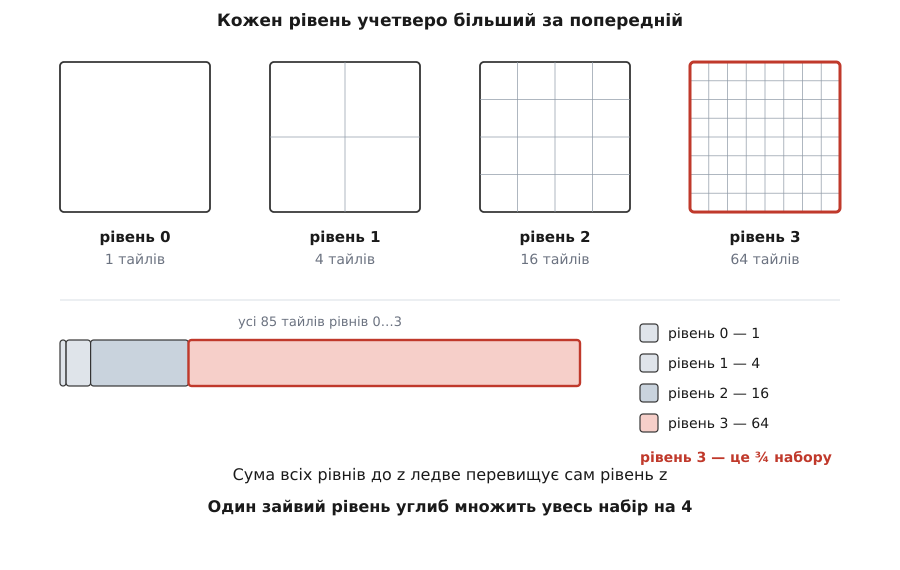
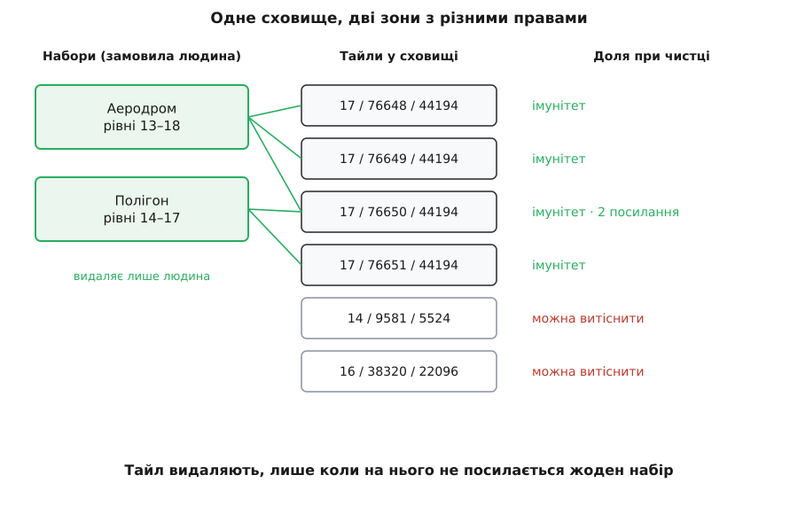

# Офлайн-карти й кеш тайлів

<preknowlist>
- [Web Mercator і тайлова сітка](topic:math-geometry/web-mercator-tiles) — як глобус ріжуть на квадратні клітинки з адресою z/x/y і чому на рівні z їх рівно 4ᶻ.
- [Патерни кешування](topic:sf-data/caching-strategies) — кеш як ближча копія даних, чий дім деінде; влучання й промах.
- [SQL](topic:sf-data/sql) — таблиця, первинний ключ, індекс, запит.
</preknowlist>

Оператор виїхав у поле за сорок кілометрів від містечка, розклав ноутбук, під'єднав радіомодем. Телеметрія йде, апарат відповідає, відео тече — і тільки на місці карти сірий прямокутник із бляклою сіткою. Нічого не зламалося: у цьому полі просто немає мобільного інтернету, а карта — єдина частина застосунку, якої фізично **немає на машині**. Вона живе на чужому сервері за тисячу кілометрів, і досі застосунок лише вдавав, ніби володіє нею. Отже, карту треба привезти з собою — і це виявляється не галочкою «кешувати», а окремою підсистемою зі своєю арифметикою, своїм сховищем і своїми способами зламатися.

Почати доводиться з того, що «карта району» — не файл. Карта в застосунку складена з **тайлів** (англ. *tile* — «плитка, кахля»): квадратних картинок 256×256 пікселів, які приклеюються одна до одної, як кахлі на стіні. Адреса тайла — три числа: рівень масштабу `z` та номери стовпця й рядка `x`, `y`. Чим глибший рівень, тим дрібніше порізано: на рівні `z` світ покрито сіткою 2ᶻ × 2ᶻ, тобто **4ᶻ тайлами**. Як застосунок вирішує, які тайли просити просто зараз і в якому порядку, — окрема механіка [тайлового конвеєра](topic:sf-visual/map-tile-pipeline); тут ідеться про життя тайла у сховищі.

Оця четвірка й керує всім далі. Один крок углиб — учетверо більше тайлів, тож «завантажити карту світу» не пропонує ніхто: завантажують район і діапазон рівнів. Візьмімо квадрат 20 × 20 км на широті 50° і рівні від 13 (видно села й дороги) до 18 (видно окремі будівлі):

```
рівень 13 →     64 тайли
рівень 14 →    196
рівень 15 →    729
рівень 16 →   2704
рівень 17 →  10609
рівень 18 →  42025
              -----
разом         56327 тайлів  ×  25 КіБ  ≈  1.34 ГіБ
```

Два висновки варті того, щоб їх запам'ятати. Найглибший рівень з'їдає три чверті всього набору — це властивість прогресії зі знаменником 4, а не збіг. І звідси правило планування: **додати один рівень углиб — це вчетверо збільшити весь набір**. Той самий квадрат із рівнем 19 у комплекті важив би вже 5.3 ГіБ, а оператор, який пересуває повзунок масштабу на одну поділку, про це не здогадується — тому пристойний застосунок показує оцінку **до** початку завантаження. (Двадцять п'ять кілобайтів — це растровий тайл, готова картинка; [векторні тайли](topic:sf-visual/vector-vs-raster-maps) описують геометрію замість пікселів і важать менше, але множник 4 на рівень від цього не змінюється.)


*Кожен наступний рівень ділить кожен тайл на чотири, тому сума всіх рівнів до `z` заледве перевищує сам рівень `z`.*

Тайли кешують і без жодного офлайну — щоб не тягнути ту саму картинку двічі. У цьому звичному режимі кеш є прискорювачем: промах коштує затримки, не більше. Тепер вимкніть мережу. Той самий промах перестає бути затримкою і стає **відсутністю даних назавжди**, бо джерело правди лишилося за тисячу кілометрів. Кеш, який щойно був копією, став **єдиним оригіналом** — і з цієї зміни випливає геть усе далі. Копію можна викидати, коли треба місце; оригінал викидати не можна. Копію не шкода втратити при аварійному завершенні; оригінал доводиться писати надійно. Ось чому «просто ввімкнути кешування» не дає офлайну: звичайний кеш спроєктовано так, що з нього **дозволено** зникати, а офлайн-карта тримається на тому, що зникати **заборонено**.

Розв'язок структурний: в одному сховищі живуть **дві зони з різними правами**. У принагідну зону самі собою потрапляють тайли, які оператор побачив дорогою: покрутив карту, наблизив, роздивився сусіднє село. Їх ніхто свідомо не замовляв, тож їх можна витісняти, коли місце кінчається. Закріплений набір — навпаки, замовлення людини: «район аеродрому, рівні 13–18». Він має ім'я, межі, діапазон рівнів і **імунітет до витіснення**; його видаляє лише той, хто його створив.

Тонкість, на якій спотикаються при першій реалізації: набори перетинаються. Сусідні райони мають спільну смугу тайлів, а половина замовленого району вже лежить у принагідній зоні з учорашнього перегляду. Отже, належність до набору не може бути прапорцем у рядку тайла — потрібен окремий зв'язок «набір ↔ тайл», тобто [підрахунок посилань](topic:sf-lang/reference-counting): тайл видаляють лише тоді, коли на нього не посилається жоден набір.


*Тайли лежать в одній таблиці, а поділяють їх зв'язки з наборами: спільний тайл двох наборів рахується посиланнями, а не копіюється.*

> 🔧 **Навіщо це.** Найпоширеніша скарга на офлайн-карти звучить так: «я ж завантажив район, а він зник». Причина майже завжди одна — один спільний кеш із загальним обмеженням розміру, з якого завантажений район вимило звичайним переглядом карти в іншому місці. Поділ на дві зони прибирає цей клас скарг цілком, і зробити його треба **до** першого релізу: домалювати імунітет у вже наповнене сховище означає міграцію схеми на пристроях користувачів.

Далі — куди класти тайли фізично. Найочевидніше рішення, окремий файл `z/x/y.png` на кожен тайл, розвалюється одразу з трьох боків. Файлова система видає місце блоками (типово 4 КіБ), а тайл однорідного поля — це кілька сотень байтів, тож більша частина блока пропадає намарне. Наш скромний район — це 56 тисяч файлів, кілька районів — за півмільйона: обхід теки триває хвилини, видалення набору перетворюється на півмільйона системних викликів, кожне читання коштує `open()` і `close()`. І жодного спільного стану: після обриву завантаження картину світу відновлюють тим самим обходом теки.

Тому тайли пакують у **контейнер** (лат. *contineo* — «вміщую»): один файл, усередині якого лежать усі тайли плюс покажчик, де саме лежить кожен. Практично завжди цим контейнером стає [вбудована база даних](topic:sf-data/embedded-database) — не сервер за мережею, а бібліотека всередині того самого процесу, що тримає всю базу одним файлом на диску. Розробники SQLite поміряли це на десятикілобайтових блобах: приблизно **20 % економії місця** й **35 % швидшого читання** проти окремих файлів, бо файл у базі відкривають один раз на весь сеанс. До того ж база дає транзакції й безкоштовне «видалити набір» одним запитом; на цьому підході стоїть формат обміну MBTiles — звичайна база SQLite із таблицею тайлів, яку можна віддати оператору файлом на флешці. Одну пастку контейнера варто знати заздалегідь: вставляти тайли треба **пакетами** по сотні-дві в одній транзакції, бо транзакція на кожен тайл упирає завантаження не в мережу, а в диск.

Ще одна річ, яку легко проґавити: ідентичність тайла — це не лише `(z, x, y)`. Якщо оператор перемкне шар із супутникового знімка на дорожню схему, а сховище пам'ятає тайли тільки за трійкою, половина екрана лишиться супутником, половина стане схемою — ті самі ключі, різні картинки. До ключа має входити й джерело: постачальник і конкретний шар.

Окремо перевертається питання свіжості. Онлайн воно має точну відповідь: сервер віддає разом із тайлом мітку версії, клієнт надсилає її назад і дістає або новий вміст, або коротке «не змінилося» — [звичайні умовні запити HTTP](topic:com-protocol/http-caching). Офлайн цей механізм міняє знак. Прострочений тайл у звичайному кеші вважають непридатним і викидають; в офлайн-сховищі прострочений тайл — це все, що у вас є, і сірий прямокутник замість нього не кращий. Звідси правило, яке варто вписати в код явно: **строк придатності керує оновленням, а не видаленням**. Тайл із вичерпаним терміном лишається у сховищі й далі показується, лише позначений як такий, що варто перевірити, коли з'явиться мережа. Видалити тайл можна через брак місця (і тільки в принагідній зоні) або за явною дією людини — але не через застарілість.

Місце в принагідній зоні все ж закінчується, і тоді викидають ті тайли, до яких найдовше не зверталися ([одна з усталених політик витіснення](topic:sf-data/cache-eviction-policies)). Для карти це майже точний портрет користування: оператор працює в районі й повертається до тих самих місць, а краєвиди, побачені дорогою, більше не знадобляться. Чистити варто не на кожну вставку, а за двома межами: доки сховище не перевищило верхню — не робимо нічого, перевищило — за один прохід видаляємо до нижньої.

Хай як добре все спроєктовано, оператор врешті наблизить карту глибше, ніж завантажив. Малювати порожній квадрат — найгірше з можливого, бо порожнеча не несе жодної інформації, а вона насправді є. Тайлова сітка вкладена рівно: тайл рівня `z` покриває **чверть** тайла рівня `z−1`. Тож коли потрібного тайла немає, а його предок у сховищі є, потрібну чверть (або чверть чверті) вирізають із предка й розтягують. Карта стане розмитою — але розмита карта показує берегову лінію, дорогу й ліс, а порожня не показує нічого. Одна умова: підстановка має бути **видимою**, інакше оператор оцінить деталі місцевості за розмиттям, якого на місцевості немає.

Лишається межа, яка не є технічною. Політика користування тайловим сервісом OpenStreetMap прямо забороняє попереднє масове викачування, а з ним і функції штибу «зберегти місто для офлайну»; чимало комерційних постачальників забороняють офлайн-копію умовами ліцензії. Тож офлайн будують або на джерелах, які це дозволяють, або на готових пакетах тайлів, які постачальник роздає саме для такого вжитку.

Усе разом складається в один зсув мислення, вартий більшого, ніж сама карта. Звичайний застосунок будують від мережі: дані **там**, а локально осідає те, що встигло. Офлайнова карта перевертає залежність — дані **тут**, а мережа є способом їх поповнювати й освіжати. Найдешевший спосіб перевірити, чи справді цей зсув стався в коді, а не лише в описі, — вимкнути мережу **на початку** розробки, а не в кінці.
