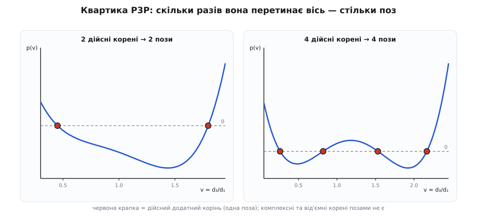
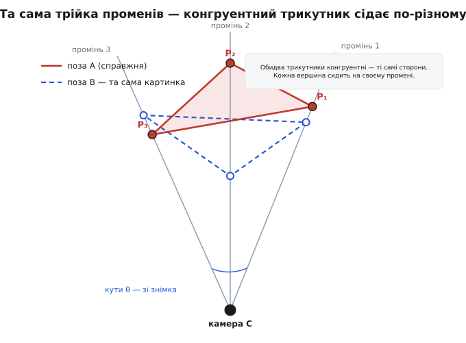

# 🧮 P3P: три косинуси, одна квартика, до чотирьох поз

Ця вставка доводить до кінця те, що в теорії P3P зазвичай проголошують одним рядком: **три точки задають до чотирьох поз камери**. Доведемо це чесно — зведемо три рівняння теореми косинусів до одного многочлена четвертого степеня на невідомі відстані, порахуємо, скільки в нього коренів і чому, покажемо це й алгеброю, і геометрією, розв'яжемо конкретний числовий приклад і доведемо відстані до самої пози (**R**, **t**). Жодного «очевидно» дорогою не буде.

## Три рівняння, три невідомі відстані

Знімок дає нам три **промені погляду** з центра камери C — по одному на кожен орієнтир. Промінь — це напрямок: піксель разом із калібруванням камери задає одиничний вектор **r**ᵢ, під яким точку Pᵢ видно. Напрямки відомі, тож відомі й **кути** між ними: косинус кута між двома променями — це їхній скалярний добуток,

```
cos θᵢⱼ = rᵢ · rⱼ
```

Модель об'єкта дає **довжини сторін** трикутника орієнтирів |PᵢPⱼ| (це просто відстані між відомими 3D-точками). А шукаємо ми три **відстані** d₁, d₂, d₃ від центра камери до кожної точки — саме їх бракує, щоб знати, де все лежить у системі камери.

Тепер ключове спостереження. Візьмімо одну бічну грань піраміди — трикутник C–Pᵢ–Pⱼ. У ньому відомі дві речі: кут при вершині C (це θᵢⱼ зі знімка) і протилежна цьому куту сторона (це |PᵢPⱼ| з моделі). А сторони при вершині C — це якраз невідомі dᵢ і dⱼ. Трикутник із відомим кутом і протилежною стороною — це рівно та ситуація, для якої існує теорема косинусів. Кожна з трьох граней дає одне рівняння:

```
|P₁P₂|² = d₁² + d₂² − 2·d₁·d₂·cos θ₁₂
|P₁P₃|² = d₁² + d₃² − 2·d₁·d₃·cos θ₁₃
|P₂P₃|² = d₂² + d₃² − 2·d₂·d₃·cos θ₂₃
```

Три рівняння, три невідомі. Здавалося б, розв'язуй. Але рівняння **квадратні** й **зчеплені**: у кожному сидять добутки dᵢ·dⱼ, і жодну відстань не можна виразити з одного рівняння, не тягнучи за собою дві інші. Просто «підставити» тут не вийде — систему треба згорнути.

## Згортання до однієї квартики

Придивімося, як саме входять невідомі. Дві з трьох відстаней з'являються тільки через **відношення** до першої. Введімо ці відношення як нові невідомі:

```
u = d₂/d₁,     v = d₃/d₁
```

і поділімо кожне рівняння на d₁². Відстань d₁ винесеться множником, а всередині лишаться u, v і відомі косинуси:

```
|P₁P₂|² = d₁²·(1 + u² − 2u·cos θ₁₂)
|P₁P₃|² = d₁²·(1 + v² − 2v·cos θ₁₃)
|P₂P₃|² = d₁²·(u² + v² − 2u·v·cos θ₂₃)
```

Тепер d₁² — спільний зайвий множник у всіх трьох. Виженімо його діленням: поділімо перше й третє рівняння на друге. Множник d₁² скоротиться, і лишаться дві відомі сталі —

```
p = |P₂P₃|² / |P₁P₃|²,     q = |P₁P₂|² / |P₁P₃|²
```

— а система стисне до **двох** рівнянь на **дві** невідомі u, v:

```
(1)   u² + v² − 2u·v·cos θ₂₃  =  p·(1 + v² − 2v·cos θ₁₃)
(2)   1  + u² − 2u·cos θ₁₂    =  q·(1 + v² − 2v·cos θ₁₃)
```

Обидва досі квадратні за u й досі зчеплені. Але тут спрацьовує хитрість, заради якої все й затівалося: **відніміть (2) від (1)**. Член u² стоїть однаково в обох рівняннях — і при відніманні зникає. Разом із ним зникає квадратичність за u: воно виживає лише в першому степені.

```
v² − 1 − 2u·v·cos θ₂₃ + 2u·cos θ₁₂  =  (p − q)·(1 + v² − 2v·cos θ₁₃)
```

Зберімо u в один доданок:

```
2u·(cos θ₁₂ − v·cos θ₂₃)  =  (p − q)·(1 + v² − 2v·cos θ₁₃) + 1 − v²
```

— і ось u вже виражене через саму лише v, звичайним діленням:

```
          (p − q)·(1 + v² − 2v·cos θ₁₃) + 1 − v²
u(v)  =  ─────────────────────────────────────────
                  2·(cos θ₁₂ − v·cos θ₂₃)
```

У чисельнику — квадратний многочлен від v, у знаменнику — лінійний. Тепер лишається один крок: підставити це u(v) назад у рівняння (2), яке квадратне за u. Помножимо (2) на квадрат знаменника, щоб позбутися дробу. Порахуймо старший степінь: u² дає v⁴ поділити на v², а права частина q·(…)·(знаменник)² — теж степінь 4. Найвищий степінь, що виживає, — v⁴, а все нижче — відомі числа. Результат:

```
A₄·v⁴ + A₃·v³ + A₂·v² + A₁·v + A₀ = 0
```

**Одна квартика — многочлен четвертого степеня на одну невідому v.** Її п'ять коефіцієнтів A — громіздкі, але цілком визначені комбінації трьох косинусів і сталих p, q; усі вони відомі з входу. Оце згортання трьох зчеплених квадратних рівнянь в одне четвертого степеня і є вся суть класичного зведення, яке 1841 року опублікував Йоганн Ґрунерт (це найдавніший відомий друкований розв'язок P3P; геодезичний і фотограмметричний родовід задачі — в історичній нотатці теми). Усе, що далі, — це вже читання коренів.

> 🔧 **Навіщо це.** Квартика — причина, чому P3P має **замкнений** розв'язок, придатний для реального часу: жодних ітерацій, жодного початкового здогаду. Порахував п'ять коефіцієнтів, розв'язав рівняння четвертого степеня — формулами Феррарі або через власні числа супровідної матриці 4×4 — і за мікросекунди маєш відповідь. Саме ця миттєвість дозволяє відсіювачеві викидів RANSAC запускати мінімальний розв'язувач тисячі разів на кадр.

## Чому коренів до чотирьох — алгебра і геометрія

**Алгебра.** Многочлен четвертого степеня має рівно чотири корені в комплексних числах (основна теорема алгебри). Кожен **дійсний додатний** корінь v — кандидат на позу: він дає u = u(v) > 0, а тоді з рівняння (2) відновлюється й сама перша відстань, і решта дві:

```
d₁² = |P₁P₃|² / (1 + v² − 2v·cos θ₁₃),     d₂ = u·d₁,     d₃ = v·d₁
```

Три додатні відстані — це одна поза камери. А корені комплексні, або від'ємні, або такі, що дають від'ємну відстань (точка позаду об'єктива — це відсіює перевірка знаку глибини, *cheirality*), геометрії не несуть і викидаються. Тому число справжніх поз дорівнює числу дійсних додатних коренів квартики — **щонайбільше чотири**.


*Та сама задача в двох конфігураціях. Ліворуч квартика перетинає вісь двічі — дві дійсні відстані-корені, дві пози; праворуч чотири рази — чотири пози. Комплексні й від'ємні корені на вісь не лягають і позами не є.*

**Геометрія.** Чому взагалі чотири різні розташування можуть дати той самий знімок? Зафіксуймо два орієнтири P₁ і P₂. Звідки камера бачить відрізок P₁P₂ рівно під кутом θ₁₂? На площині відповідь відома: вершина трикутника з фіксованою основою й фіксованим протилежним кутом ходить по **дузі кола**, проведеного через кінці основи (теорема про вписаний кут — усі точки дуги «бачать» хорду під тим самим кутом). Оберни цю дугу навколо прямої P₁P₂ — і вона замете поверхню обертання, тор-веретено. Центр камери мусить лежати на цьому торі; на іншому — для пари (P₁, P₃); на третьому — для (P₂, P₃). Три поверхні в просторі перетинаються в окремих точках, і алгебра обмежує їхнє число чотирма. Кожна така точка — місце, звідки стати, щоб усі три кути вийшли правильними, тобто одна поза.


*Камеру й три промені зафіксовано знімком; конгруентний трикутник орієнтирів сідає на них не одним способом, і кожна вершина щоразу лягає на свій промінь. Кожна посадка — інші три відстані dᵢ, інша поза, але той самий кадр.*

Ці дві картини — одна річ із двох боків: скільки разів крива перетинає вісь, стільки разів твердий трикутник встигає «клацнути» на трьох нерухомих променях. Межа в чотири пози **точна** — конфігурації з усіма чотирма дійсними коренями справді існують (права панель квартики — саме така). Повну відповідь на те, коли коренів один, два, три чи чотири, дає «повна класифікація розв'язків» Гао, Гоу, Тана й Чена (2003). На практиці ж вимога додатних відстаней і того, щоб точки були **перед** камерою, зазвичай проріджує чотири до двох.

## Четверта точка знімає неоднозначність

Три точки — це мінімум: шість рівнянь на шість чисел пози. Але мінімум не означає однозначності — квартика лишає до чотирьох кандидатів. Одна додаткова відповідність усе розв'язує. Четверта точка P₄ зі своїм пікселем додає обмеження, яких жодна хибна поза підробити не може. Перевірка дешева: для кожної пози-кандидата (**R**, **t**) спроєктуй P₄ у кадр і зміряй, як далеко проєкція лягла від **спостереженого** пікселя — це похибка перепроєкції. Справжня поза кладе точку майже точно на місце; хибні розкидають її далеко. Обираємо кандидата з найменшою похибкою. Саме тому мінімальні розв'язувачі **перебирають** за трьома точками, а **звіряють** за четвертою; і саме тому RANSAC бере малі вибірки й оцінює їх на решті даних.

## Числовий приклад

Пройдімо весь ланцюг на числах. Знімок дав три промені, з них — три кути; модель дала три сторони:

```
cos θ₁₂ = 0.8964      |P₁P₂| = 1.3638   (|P₁P₂|² = 1.86)
cos θ₁₃ = 0.9380      |P₁P₃| = 1.2083   (|P₁P₃|² = 1.46)
cos θ₂₃ = 0.9426      |P₂P₃| = 1.2806   (|P₂P₃|² = 1.64)
```

(Числа підібрано так, щоб справжні відстані були (3.074, 2.700, 3.454) м, — але розв'язувач їх не бачить, він має лише кути й сторони.) Дві відомі сталі:

```
p = |P₂P₃|²/|P₁P₃|² = 1.64/1.46 = 1.12329
q = |P₁P₂|²/|P₁P₃|² = 1.86/1.46 = 1.27397
```

Складаємо квартику (підставивши u(v) у рівняння (2) і звівши до старшого коефіцієнта одиницю):

```
v⁴ − 3.92271·v³ + 5.75810·v² − 3.73868·v + 0.90191 = 0
```

Її чотири корені:

```
v = 1.1236              (дійсний, додатний)
v = 0.7139              (дійсний, додатний)
v = 1.0426 ± 0.1933·i   (комплексна пара — відкидаємо)
```

Два дійсні додатні корені — **дві пози**. Комплексна пара геометрії не несе. Відновлюємо відстані для кожного кореня за d₁² = |P₁P₃|²/(1 + v² − 2v·cos θ₁₃), далі d₂ = u·d₁, d₃ = v·d₁:

```
v = 1.1236,  u = 0.8783  →  (d₁, d₂, d₃) = (3.074, 2.700, 3.454) м   ← справжня
v = 0.7139,  u = 1.0395  →  (d₁, d₂, d₃) = (2.928, 3.044, 2.090) м   ← хибна
```

Обидві трійки **точно** задовольняють усі три рівняння теореми косинусів — сама лише геометрія трьох точок їх не розрізнить. Розрізняє четвертий орієнтир: під першою позою його проєкція лягає на свій піксель, під другою — промахується на багато пікселів. Виживає тільки (3.074, 2.700, 3.454).

## Від відстаней до пози (R, t)

Відстані знайдено — далі вже бухгалтерія. Місце кожного орієнтира в системі камери — це просто його відстань уздовж свого променя:

```
Qᵢ = dᵢ · rᵢ        (i = 1, 2, 3)
```

Отже, ми тримаємо ті самі три фізичні точки двічі: як Pᵢ у системі світу (дано) і як Qᵢ у системі камери (щойно порахували). Поза (**R**, **t**) — це те жорстке перетворення, що переносить один набір в інший:

```
Qᵢ = R·Pᵢ + t,     R ортонормована (RᵀR = I, det R = +1)
```

Це задача **абсолютної орієнтації** — суміщення двох наборів точок жорстким рухом ([абсолютна орієнтація](root:sf-visual/absolute-orientation) розв'язує її для будь-якого числа точок). Для трьох неколінеарних точок вона визначена точно й має охайну замкнену форму. Спершу приберемо зсув, відцентрувавши обидва набори на їхні центроїди P̄, Q̄:

```
P′ᵢ = Pᵢ − P̄,     Q′ᵢ = Qᵢ − Q̄
```

тоді поворот — це той, що найкраще суміщає дві відцентровані хмарки. Будуємо крос-коваріаційну матрицю 3×3 і беремо її сингулярний розклад (SVD):

```
H = Σᵢ Q′ᵢ · P′ᵢᵀ = U·Σ·Vᵀ   →   R = U·diag(1, 1, s)·Vᵀ,   s = sign(det(U·Vᵀ))
```

а зсув повертаємо з центроїдів:

```
t = Q̄ − R·P̄
```

Множник s = ±1 у середині — запобіжник: без нього SVD іноді видає **дзеркальне** відображення замість повороту, і його треба повернути назад у чесний [поворот](root:math-algebra/rotation-matrices) із визначником +1. Для трьох точок підгонка точна; коли ж точок багато, як у повній задачі PnP, той самий SVD повертає [найкращий за найменшими квадратами](root:math-probability/least-squares) поворот. Оце й останній крок: квартика дає відстані, відстані дають точки в системі камери, а абсолютна орієнтація перетворює дві трійки точок на шість чисел пози.
