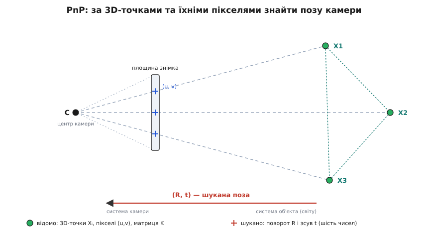
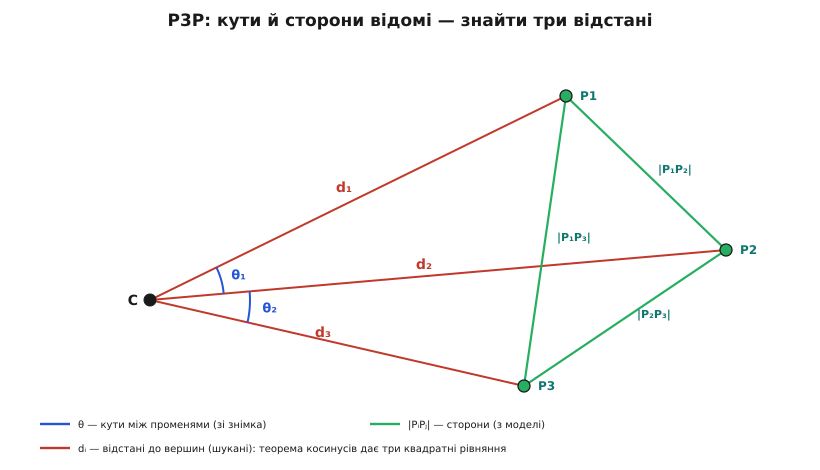
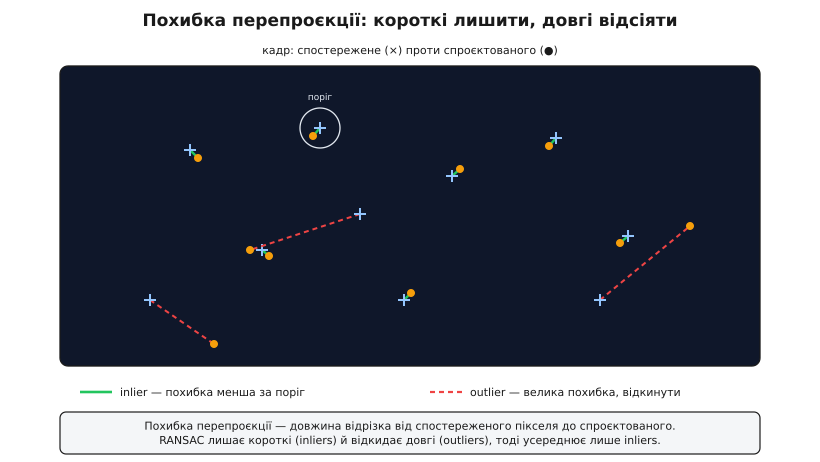
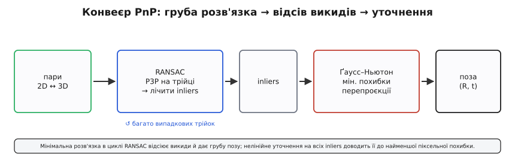

# Відновлення пози за точками (PnP)

<preknowlist>
- [Модель камери-обскури](root:sf-visual/camera-model) — як 3D-точка стає пікселем: рівняння s·x = K·[R|t]·X, внутрішня матриця K (фокуси, головна точка).
- [Матриці повороту](root:math-algebra/rotation-matrices) — R як ортонормована матриця 3×3, що задає орієнтацію; шість чисел пози = поворот R плюс зсув t.
- [Однорідні координати](root:math-algebra/affine-transform) — запис точки як (X, Y, Z, 1), щоб поворот і зсув злилися в одне множення матриць.
- [Найменші квадрати](root:math-probability/least-squares) — коли рівнянь більше за невідомі, беруть розв'язок із найменшою сумою квадратів похибок.
- [Зіставлення ключових точок](root:sf-visual/feature-matching) — звідки беруться пари «піксель ↔ 3D-точка»: збіги за дескрипторами.
- [RANSAC](root:sf-algorithms/ransac) — як відсіяти хибні пари: підігнати модель на випадковій мінімальній вибірці й лишити тільки згодних із нею.
</preknowlist>

Уяви, що камера сфотографувала знайомий об'єкт — шахову дошку на столі, паперову мітку на стіні, фасад будинку, тривимірну модель якого ти вже маєш. Ти знаєш, де на самому об'єкті лежать певні точки: кути клітинок дошки, ріг мітки, вікна фасаду — тобто їхні координати в метрах у власній системі об'єкта. І ти бачиш, у які пікселі знімка вони впали. Питання одне: **де стояла камера і як була повернута** тієї миті, коли спрацював затвор?

Це і є задача відновлення пози (англ. *pose* — положення й орієнтація разом), а її класична назва — **Perspective-n-Point**, PnP, «перспектива за n точками». Вона обернена до звичайної зйомки. Зйомка бере тривимірну точку та вже відому позу камери й каже, в який піксель точка спроєктується — це проста дія вперед. PnP іде назад: маємо пікселі й тривимірні точки, а шукаємо позу. Саме ця поза потрібна роботові, щоб зрозуміти, де він у кімнаті; окулярам доповненої реальності — щоб поставити віртуальну вазу рівно на реальний стіл; дрону — щоб сісти на позначку. Назву Perspective-n-Point увели Мартін Фішлер і Роберт Боллз 1981 року — у тій самій праці, що подарувала комп'ютерному зору RANSAC (як народилася задача, ще в геодезії позаминулого століття, і хто її розв'язував — у [історичній вставці](root:sf-visual/pose-estimation/hist-pnp-lineage.md)).


*Вхід задачі — тривимірні координати точок і їхні пікселі; шукане — поза камери (R, t), яка кладе кожну точку рівно на свій промінь погляду.*

## Що таке «поза»

Тверде тіло в просторі повністю задають шість чисел: три кажуть, куди зсунутий його центр, і три — як воно повернуте. Тому «поза камери» — це **шість ступенів вільності**, не більше й не менше. Формально це жорстке перетворення з системи координат об'єкта («світу») в систему координат камери. Візьмемо точку об'єкта з відомими координатами **X**_w (наш вхід). У системі камери та сама фізична точка має координати

```
X_c = R · X_w + t
```

де **R** — матриця повороту 3×3, що каже, як орієнтована камера, а **t** — вектор зсуву 3×1. Пара (**R**, **t**) і є поза. Хоч у матриці повороту дев'ять чисел, незалежних серед них лише три — вона мусить лишатися [ортонормованою](root:math-algebra/rotation-matrices) (стовпці одиничної довжини й під прямими кутами); плюс три числа зсуву — разом ті самі шість.

> 🔧 **Навіщо це.** Робот-пилосос, окуляри AR, автономне авто, рука-маніпулятор — усі вони весь час відповідають на одне питання: «де я відносно сцени?». Якщо в кадрі є щось із відомою геометрією — мітка, впізнаний раніше об'єкт, орієнтир із карти, — PnP перетворює звичайний знімок на точний вимір цих шести чисел, без жодного додаткового давача, самою лиш камерою.

## Дорога вперед: як точка стає пікселем

Щоб іти назад, спершу треба точно знати дорогу вперед. [Камера-обскура](root:sf-visual/camera-model) переводить тривимірну точку в піксель у два кроки. Перший — те саме жорстке перетворення (**R**, **t**): точку світу переносимо в систему камери, **X**_c = **R**·**X**_w + **t**. Другий — **перспективна проєкція**: точку **X**_c = (X, Y, Z) «кидають» на площину сенсора діленням на глибину Z і масштабують внутрішніми параметрами — фокусними відстанями fx, fy (у пікселях) і головною точкою (cx, cy), центром кадру. Внутрішні параметри збирають у матрицю

```
    ⎡ fx   0   cx ⎤
K = ⎢  0  fy   cy ⎥      fx, fy — фокуси в пікселях;  (cx, cy) — головна точка
    ⎣  0   0    1 ⎦
```

Разом в [однорідних координатах](root:math-algebra/affine-transform) обидва кроки зливаються в одне множення:

```
s · x̃  =  K · [R | t] · X̃,     x̃ = (u, v, 1),     X̃ = (X, Y, Z, 1)
```

Тут (u, v) — піксель; **K** відома (її дає [калібрування камери](root:sf-visual/camera-calibration)); [**R**|**t**] — склеєні поворот і зсув, матриця 3×4, і **саме її ми шукаємо**; s — множник масштабу, який дорівнює глибині точки перед камерою і невідомий окремо для кожної точки.

Розкриймо це множення покоординатно — і одразу видно всю суть задачі:

```
u = fx · (R₁·X_w + t_x) / (R₃·X_w + t_z) + cx
v = fy · (R₂·X_w + t_y) / (R₃·X_w + t_z) + cy
```

де R₁, R₂, R₃ — рядки матриці **R**. Відомо в цих рівняннях усе, крім самих **R** і **t**. Невідоме стоїть і в чисельнику, і в **знаменнику** — у тій самій глибині (R₃·X_w + t_z), на яку ділять. Через це ділення рівняння **нелінійне**, і в цьому вся складність PnP.

Чому глибина так заважає: перспектива стирає її. Дальня велика будівля й ближній сірник можуть дати однаковий силует у кадрі — знімок сам по собі не каже, котре з них котре. Кожна точка приносить своє невідоме s, і задача, яку розв'язали б одним махом, якби не ділення, стає нелінійною. Уся подальша історія методів PnP — це різні способи обійти або приборкати цей поділ на глибину.

## Скільки треба точок

Порахуймо баланс рівнянь і невідомих. Невідомих у позі — шість. Кожна пара «піксель ↔ точка» дає **два** рівняння: одне на координату u, друге на v. Отже, **три пари** дають шість рівнянь на шість невідомих — рівно стільки, скільки треба. Це мінімальний випадок, і він має власну назву — **P3P**, «перспектива трьох точок».

Але для нелінійної системи «стільки ж рівнянь, скільки невідомих» не означає єдиного розв'язку. P3P — система квадратних рівнянь, і вона дає **до чотирьох** геометрично можливих поз. Інтуїція проста: трикутник орієнтирів можна «націлити» на камеру кількома способами так, що всі три його вершини все одно впадуть у ті самі пікселі. Щоб вибрати серед чотирьох правильну, досить **четвертої** точки: вона майже завжди узгоджується лише з однією з поз. Тому навіть у мінімальних схемах беруть чотири точки, а не три.

Ось звідки «n» у назві PnP: n — це скільки в нас пар. Три — мінімум із неоднозначністю; чотири — щоб її зняти; десятки й сотні — щоб придушити шум вимірювання. Два великі шляхи розв'язку прямо відповідають цим крайнощам: **мало точок** — геометрична розв'язка в лоб; **багато точок** — усереднити шум найменшими квадратами.

## Мало точок: геометрія трьох променів

Почнімо з трьох. Тут працює чиста геометрія, без ітерацій. Ключ у тому, що піксель кожної точки разом із відомою **K** задає **промінь** із центра камери — напрямок, під яким точку видно. Отже, для трьох точок ми знаємо три промені з одного центра, а значить, і **кути** між ними (кут між двома напрямками дає скалярний добуток одиничних векторів). Знаємо ми й довжини сторін трикутника самих точок — вони задані тривимірними координатами. Лишилося знайти три відстані d₁, d₂, d₃ від камери до кожної точки.


*Три промені з центра камери защемлюють піраміду: кути θ між ними дає знімок, довжини сторін |PᵢPⱼ| дає модель об'єкта, а невідомі відстані dᵢ знаходять теоремою косинусів.*

Кожна грань цієї піраміди — трикутник «центр — точка — точка», у якому відомі кут при вершині-центрі та протилежна сторона. Теорема косинусів дає для кожної пари одне рівняння:

```
|P₁P₂|² = d₁² + d₂² − 2·d₁·d₂·cos(θ₁₂)
```

і так само для пар (1, 3) та (2, 3). **Три квадратні рівняння на три невідомі відстані** — їх зводять до одного многочлена четвертого степеня, і його до чотирьох додатних коренів дають ті самі до чотирьох поз (повне виведення й класифікація коренів — у [математичній вставці про P3P](root:sf-visual/pose-estimation/math-p3p-cosines.md)). Коли відстані знайдено, кожна точка вже має координати в системі камери (одиничний промінь × відстань), а поруч ті самі точки задані в координатах світу — і поза (**R**, **t**), що суміщає два ці набори з трьох точок, знаходиться прямо, задачею абсолютної орієнтації.

## Багато точок: пряме лінійне перетворення

Тепер інша крайність — точок багато, зате вони зашумлені. Тут хочеться скористатися надлишком, а не мучитися з квадратними коренями. Найпростіший спосіб — прикинутися, що дванадцять чисел матриці [**R**|**t**] незалежні, і забути на мить, що **R** мусить бути поворотом. Тоді проєкційне рівняння стає **лінійним** відносно цих дванадцяти чисел.

Позбудьмося невідомого масштабу s хитрістю: у трійці рядків (s·u, s·v, s) поділимо перші два на третій — множник скоротиться, і кожна пара дасть два лінійні рівняння на елементи [**R**|**t**]. Дванадцять невідомих (з точністю до спільного масштабу — насправді одинадцять) вимагають щонайменше **шести** пар. Складаємо всі рівняння в одну велику однорідну систему **A**·**p** = 0, де **p** — витягнуті в стовпчик дванадцять чисел, і шукаємо ненульовий **p**, що дає найменше ‖**A**·**p**‖. Це [власний вектор](root:math-algebra/eigenvalues) при найменшому власному значенні матриці **A**ᵀ**A**, який на практиці дістають сингулярним розкладом (SVD) матриці **A**. Цей прийом — **пряме лінійне перетворення** (Direct Linear Transform, DLT).

Розплата за простоту: розв'язок ігнорує, що перші три стовпці мали б утворювати матрицю повороту. Тому «сиру» матрицю з DLT наприкінці силоміць виправляють до найближчої [ортонормованої](root:math-algebra/rotation-matrices) (найближчий поворот теж знаходять сингулярним розкладом). DLT швидкий і не потребує початкового здогаду, але він мінімізує **не ту** похибку, яку хотілося б — алгебраїчну замість піксельної, — і чутливий до шуму. Тому його майже завжди беруть лише як перше наближення, яке потім уточнюють.

Між грубим DLT і повільною нелінійною оптимізацією є елегантний середній шлях — **EPnP** (Vincent Lepetit та співавтори, 2009). Ідея: замість дванадцяти чисел пози ввести чотири «опорні» точки й виразити кожну з n тривимірних точок як їхню зважену суму. Тоді невідомими стають лише координати чотирьох опорних точок у системі камери — їх фіксовано мало, незалежно від n. Систему розв'язують лінійно, а роботи рівно стільки, скільки точок — складність O(n). EPnP дає точну позу вже за n ≥ 4 і став типовим «робочим конем» там, де точок багато й потрібна швидкість.

## Правильна похибка: перепроєкція

Усі ці способи — компроміси, аби обійти нелінійне ділення. Але яку, власне, похибку ми хочемо зробити найменшою? Ту, яку справді бачимо очима. У нас є **спостережений** піксель кожної точки. Візьмімо нашу оцінку пози, спроєктуймо тривимірну точку назад у кадр — отримаємо, куди вона мала б упасти за цієї пози. Відстань у пікселях між спостереженим і спроєктованим — це **похибка перепроєкції** (reprojection error). Правильна поза — та, що робить суму квадратів цих відстаней по всіх точках найменшою:

```
E(R, t) = Σᵢ ‖ (uᵢ, vᵢ)_спостережене − π(K, R, t, Xᵢ) ‖²
```

де π(...) — проєкція точки **X**ᵢ за поточної пози. Чому саме ця похибка, а не алгебраїчна з DLT: шум сидить у вимірюванні **пікселів** — детектор кутів знайшов ріг мітки з точністю до частки пікселя. Тож [найменші квадрати](root:math-probability/least-squares) саме в пікселях — статистично правильне усереднення цього шуму, тоді як алгебраїчна похибка змішує пікселі з метрами й ваговими множниками, що не мають фізичного сенсу.

Ця E нелінійна за (**R**, **t**) — але її мінімум шукають надійно, бо є добрий початок. Беруть позу з P3P або EPnP і уточнюють кроками **[Ґаусса–Ньютона](root:math-numeric/gauss-newton)**: на кожному кроці функцію лінеаризують навколо поточної пози, розв'язують маленьку лінійну задачу найменших квадратів на поправку й роблять крок. Кілька ітерацій — і поза сходиться до тієї, що дає найменшу піксельну похибку (як саме виглядає ця лінеаризація — похідна похибки перепроєкції за позою — виведено у [математичній вставці про якобіан](root:sf-visual/pose-estimation/math-reprojection-jacobian.md)). Ця зв'язка «швидка мінімальна розв'язка → нелінійне уточнення» і є золотий стандарт PnP.

Тонкість, яку уточнення не може оминути: **як саме підправляти поворот**. Матриця **R** має дев'ять чисел, але лише три ступені вільності. Якщо на кроці оптимізації просто додати до дев'яти чисел дев'ять поправок, результат перестане бути поворотом — стовпці втратять одиничну довжину й прямі кути. Тому поправку повороту беруть не як дев'ять чисел, а як **три** — маленький вектор осі-й-кута ([формула Родриґа](root:math-geometry/rodrigues-rotation): вектор, чий напрям — вісь, а довжина — кут повороту) — і застосовують його **множенням**, а не додаванням. Так поза на кожному кроці лишається чесним поворотом. Альтернатива — вести орієнтацію [кватерніоном](root:math-geometry/quaternions); суть та сама: параметризувати трьома-чотирма числами так, щоб не випасти з множини поворотів.

## Коли пари брешуть: RANSAC

Досі ми мовчки припускали, що всі пари «піксель ↔ точка» правильні. У житті це не так. Пари дає [зіставлення дескрипторів](root:sf-visual/feature-matching), і частина збігів хибні — дескриптор сплутав схожі візерунки. Одна така пара — груба помилка (outlier) — тягне за собою всю суму квадратів: найменші квадрати намагаються догодити й брехливій точці, і поза «попливе».


*Кожен відрізок — похибка перепроєкції однієї пари. Правильна поза тримає inliers короткими; викиди дають довгі відрізки, і RANSAC відкидає їх за порогом, перш ніж усереднювати решту.*

Рятує та сама логіка, що й скрізь у геометрії зору, — [RANSAC](root:sf-algorithms/ransac). Береться випадкова **мінімальна** вибірка (три пари для P3P), по ній рахується поза-кандидат, і перевіряється, скільки з **усіх** пар із нею згодні: у скількох похибка перепроєкції менша за поріг (кілька пікселів). Ці згодні — inliers. Процедуру повторюють багато разів із різними трійками й лишають ту позу, що зібрала найбільше inliers. Хибні пари в жодну спільну позу не складаються, тож раз за разом опиняються серед незгодних і відпадають. Наприкінці позу перераховують нелінійним уточненням уже **на всіх inliers** — щоб отримати й точність, і стійкість. Ця схема — RANSAC на P3P плюс фінальне уточнення — те, що насправді працює всередині, коли викликають готове `solvePnPRansac`. Повний робочий розв'язувач — DLT для початку, крок Ґаусса–Ньютона для уточнення, RANSAC-обгортка проти викидів — розібраний із кодом у [проєкті-вставці](root:sf-visual/pose-estimation/proj-pnp-solver.md).

## Де геометрія ламається

PnP надійний, поки геометрія «здорова»; є кілька конфігурацій, де він ламається, і їх варто впізнавати.

- **Точки на одній прямій.** Три колінеарні точки не задають трикутника — промені не защемлюють позу, P3P вироджується. Орієнтири треба брати непарно розкидані у просторі.
- **Усі точки в одній площині.** Дуже поширений випадок: одна пласка [мітка ArUco](root:sf-visual/aruco-apriltag), шахова дошка, фасад. Тут проєкція зводиться до [гомографії](root:sf-visual/homography) — перетворення площини в площину, — і позу дістають розкладанням гомографії, а не загальним P3P (загальні розв'язувачі на копланарних точках плутаються). Це не поломка, а окремий, добре відомий шлях; чотирьох кутів мітки для нього досить.
- **Дзеркальна неоднозначність майже пласких сцен.** Коли об'єкт майже плоский і далекий, дві різні пози — об'єкт трохи нахилений «до нас» чи «від нас» — дають майже однакову картинку. Похибка перепроєкції в обох майже однакова, оцінка «перескакує» між ними від кадру до кадру — це знайоме тремтіння пози AR-мітки.
- **Точки за камерою.** Алгебра рівнянь не знає, що точка мусить бути **перед** об'єктивом; частина математичних розв'язків кладе точки за камеру (від'ємна глибина). Такі відкидають перевіркою знаку глибини (cheirality, від гр. *cheir* — рука: перевірка того, з «правильного боку» точка).
- **Далекі точки, слабка перспектива.** Коли всі орієнтири далеко й займають вузький тілесний кут, перспектива майже зникає (проєкція наближається до паралельної), і глибину та зсув уздовж осі погляду видно кепсько — поза вздовж променя визначається хитко.
- **Спотворення об'єктива.** Реальний об'єктив гне прямі (бочка, подушка); модель камери-обскури цього не знає. Тому пікселі спершу «випрямляють» за коефіцієнтами дисторсії з [калібрування](root:sf-visual/camera-calibration), і лише тоді подають у PnP.

## Як це збирається докупи


*Типовий конвеєр: мінімальна розв'язка в циклі RANSAC відсіює викиди й дає грубу позу, а нелінійне уточнення на всіх inliers доводить її до найменшої піксельної похибки.*

Складімо все в один потік — саме так PnP і живе в реальній системі. На вхід ідуть пари «піксель ↔ 3D-точка»: їх дає або [зіставлення ознак](root:sf-visual/feature-matching) з картою орієнтирів, або декодована [мітка](root:sf-visual/aruco-apriltag), чиї чотири кути мають відомі координати. Далі RANSAC багато разів бере трійку, розв'язує P3P і лічить inliers; найкраща за кількістю inliers поза стає грубою оцінкою. Її уточнюють кроками Ґаусса–Ньютона на всіх inliers, мінімізуючи похибку перепроєкції, — і на виході маємо позу (**R**, **t**) з оцінкою її певності.

Побачити всю арифметику на одній точці найпростіше на прикладі похибки перепроєкції — тієї величини, яку весь конвеєр і мінімізує.

**Приклад: похибка перепроєкції однієї точки.** Нехай камера має fx = fy = 800, головну точку (cx, cy) = (320, 240). Оцінена поза повернула й зсунула точку об'єкта так, що в системі камери вона стала **X**_c = (0.10, −0.05, 2.00) метра — перед камерою, на глибині 2 м. Куди вона проєктується і яка похибка, якщо спостережений піксель був (365, 219)?

```
Проєкція (ділимо на глибину Z, множимо на фокус, додаємо центр):
u = fx · X/Z + cx = 800 · 0.10/2.00     + 320 = 40  + 320 = 360
v = fy · Y/Z + cy = 800 · (−0.05)/2.00   + 240 = −20 + 240 = 220

Похибка перепроєкції (пікселі):
Δu = 365 − 360 =  5
Δv = 219 − 220 = −1
r  = √(5² + (−1)²) = √26 ≈ 5.1 пікселя
```

Ця пара внесла б у суму E доданок ≈ 26. Уточнення посуне (**R**, **t**) так, щоб такі доданки по всіх точках разом стали найменшими. А RANSAC, якби поріг inlier був, скажімо, 3 пікселі, цю пару в inliers не взяв би — 5.1 > 3, — і або відкинув як хибну, або (якщо таких багато) виснував, що поза ще не збіглася.

Ось де PnP стає несучою конструкцією прикладного зору. Доповнена реальність тримає віртуальний об'єкт на місці, бо щокадру рахує позу камери відносно мітки чи впізнаної поверхні. Робот і дрон визначають своє положення, наводячи камеру на орієнтири з карти; у великих системах одночасної локалізації й картографування PnP — це той блок, що вставляє нову камеру в уже відому карту точок, а далі все разом доводить спільна оптимізація [пучком](root:sf-visual/bundle-adjustment). Рука-маніпулятор бере деталь, бо PnP за її CAD-моделлю сказав, як саме деталь лежить.

Глибша суть за всім цим одна: проєкція втрачає інформацію — три виміри стискає у два, — і повернути втрачене з одного знімка неможливо. Але щойно частину сцени відомо наперед, ця відома геометрія заступає втрачений вимір, і звичайний знімок обертається на точний вимір шести чисел, що ставлять камеру на її місце у світі.
