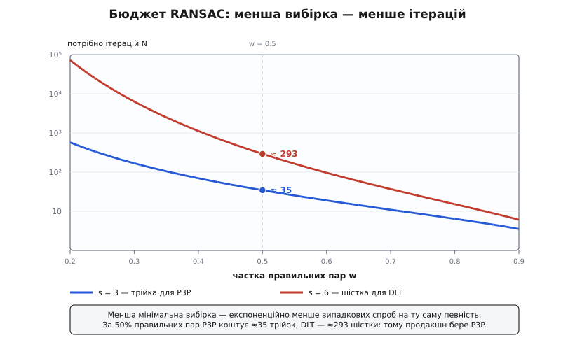

# ⚙️ Робочий розв'язувач PnP у коді: DLT → Ґаусс–Ньютон → RANSAC

Три ідеї — лінійний старт, нелінійне уточнення й стійка до брехні обгортка — тут перетворюються на десь півтори сотні рядків C++, що беруть пари «піксель ↔ 3D-точка» разом із матрицею K і повертають позу камери, яка не пливе навіть коли частина пар хибна. Мову взято не для галочки: OpenCV, Ceres, g2o — усі писані C++, а густа лінійна алгебра з розкладами й розв'язанням систем просить бібліотеки, що працює на голому залізі без зайвих копіювань. Уся числова робота лягає на Eigen — єдину залежність, суто заголовкову, тож увесь розв'язувач збирається одним `g++ -O2` без лінкування.

Будова — три шари, кожен окрема функція, і кожен наступний спирається на попередній:

- `dlt()` — з шести й більше пар складає лінійну систему й дає **грубу** позу без жодного початкового здогаду;
- `refine()` — бере цю позу й кроками Ґаусса–Ньютона зсуває її до **найменшої піксельної** похибки;
- `solvePnPRansac()` — обгортає `dlt()` у цикл випадкових вибірок, щоб **відсіяти** хибні пари, а наприкінці ще раз кличе `dlt()` і `refine()` уже на чистих inliers.

Збираємо знизу вгору. Спершу типи й три дрібні помічники, на які спираються всі шари.

```cpp
#include <Eigen/Dense>
#include <vector>
#include <random>
#include <cmath>
#include <algorithm>

using Eigen::Matrix3d;  using Eigen::Vector3d;  using Eigen::Vector2d;
using Eigen::MatrixXd;  using Eigen::VectorXd;

struct Camera { double fx, fy, cx, cy; };          // внутрішні параметри (матриця K)
struct Corr   { Vector3d X;  Vector2d uv; };        // 3D-точка світу ↔ спостережений піксель
struct Pose   { Matrix3d R;  Vector3d t; };         // X_камери = R·X_світу + t

// кососиметрична матриця вектора:  [w]× · v  =  w × v
static Matrix3d skew(const Vector3d& w) {
    Matrix3d S;
    S <<     0, -w.z(),  w.y(),
         w.z(),      0, -w.x(),
        -w.y(),  w.x(),      0;
    return S;
}

// експонента SO(3): вектор осі-кута → матриця повороту (формула Родриґа)
static Matrix3d expSO3(const Vector3d& w) {
    double th = w.norm();
    if (th < 1e-12) return Matrix3d::Identity();
    Matrix3d K = skew(w / th);
    return Matrix3d::Identity() + std::sin(th) * K + (1 - std::cos(th)) * K * K;
}

// проєкція точки світу в піксель за поточної пози (дорога вперед)
static Vector2d project(const Camera& c, const Pose& P, const Vector3d& X) {
    Vector3d Xc = P.R * X + P.t;
    return { c.fx * Xc.x() / Xc.z() + c.cx,
             c.fy * Xc.y() / Xc.z() + c.cy };
}
```

`expSO3` — це [формула Родриґа](topic:math-geometry/rodrigues-rotation) прямо в коді: три числа вектора `w` кажуть, навколо якої осі й на який кут повернути, а функція розгортає їх у матрицю 3×3. Вона знадобиться уточненню, щоб рухати поворот, не випадаючи з множини поворотів. `skew` перетворює векторний добуток на множення матриці — так похідні пози запишуться однією формулою. `project` — та сама дорога вперед: повертаємо точку в систему камери, ділимо на глибину, домножаємо на фокус.

## Шар 1: пряме лінійне перетворення

Найдешевший спосіб дістати позу — прикинутися, що дванадцять чисел [R|t] незалежні, і забути на мить, що R мусить бути поворотом. Спершу прибираємо K: віднімаємо головну точку й ділимо на фокус — піксель стає нормованою координатою променя (x, y). Тоді кожна пара дає два рядки лінійної системи A·p = 0, а її ненульовий розв'язок з найменшою нормою нев'язки — це правий сингулярний вектор найменшого сингулярного числа, тобто останній стовпець V у розкладі A = UΣVᵀ.

```cpp
// груба поза з ≥6 пар, без початкового здогаду
Pose dlt(const Camera& cam, const std::vector<Corr>& pts) {
    const int n = (int)pts.size();
    MatrixXd A(2 * n, 12);
    for (int i = 0; i < n; ++i) {
        // прибираємо K: працюємо в нормованих координатах променя
        double x = (pts[i].uv.x() - cam.cx) / cam.fx;
        double y = (pts[i].uv.y() - cam.cy) / cam.fy;
        const Vector3d& X = pts[i].X;
        A.row(2 * i)     << X.x(), X.y(), X.z(), 1,  0, 0, 0, 0,
                            -x * X.x(), -x * X.y(), -x * X.z(), -x;
        A.row(2 * i + 1) << 0, 0, 0, 0,  X.x(), X.y(), X.z(), 1,
                            -y * X.x(), -y * X.y(), -y * X.z(), -y;
    }
    // нуль-простір: правий сингулярний вектор найменшого сингулярного числа
    Eigen::JacobiSVD<MatrixXd> svd(A, Eigen::ComputeThinV);
    VectorXd p = svd.matrixV().col(11);

    Matrix3d M;
    M << p(0), p(1), p(2),
         p(4), p(5), p(6),
         p(8), p(9), p(10);
    Vector3d d(p(3), p(7), p(11));

    // глобальний знак: правильна M = γ·R має det = γ³ > 0, дзеркальний двійник −M — від'ємний
    if (M.determinant() < 0) { M = -M; d = -d; }

    // найближчий поворот і масштаб — через SVD матриці M ≈ γ·R
    Eigen::JacobiSVD<Matrix3d> ms(M, Eigen::ComputeFullU | Eigen::ComputeFullV);
    double gamma = ms.singularValues().mean();          // усі три ≈ γ, бо R ортонормована
    Matrix3d R = ms.matrixU() * ms.matrixV().transpose();
    if (R.determinant() < 0) {                          // рідкісний випадок від шуму
        Matrix3d V = ms.matrixV();  V.col(2) *= -1;
        R = ms.matrixU() * V.transpose();
    }
    return { R, d / gamma };
}
```

Три завершальні рядки — це вся тонкість DLT. По-перше, розв'язок визначений лише **з точністю до знаку**: і p, і −p однаково задовольняють A·p = 0. Правильний знак ловиться одним визначником — справжня матриця M = γR має det = γ³ > 0 (масштаб γ додатний, поворот дає det = 1), а її дзеркальний двійник −M — від'ємний. Ця перевірка знаку — то і є найдешевша cheirality: вона розвертає позу так, щоб точки лягли **перед** камерою, а не за нею. По-друге, «сира» M — це поворот, розтягнутий на невідомий масштаб γ; його дістаємо як середнє сингулярних чисел (у чистого повороту всі три дорівнюють одиниці), а t відновлюємо діленням d на γ. По-третє, силоміць виправляємо M до найближчого чесного повороту: R = UVᵀ, а якщо шум дав відображення (det = −1) — перевертаємо останній стовпець V. Усе це стабільне, бо спирається на єдиний SVD.

## Шар 2: уточнення Ґаусса–Ньютона

DLT мінімізує алгебраїчну похибку — не ту, що болить оку. Тому його результат подаємо в [Ґаусса–Ньютона](topic:math-numeric/gauss-newton), який зменшує саме суму квадратів **піксельних** відхилень. Поза живе на многовиді 3+3 чисел, тож поправку шукаємо як шестивектор ξ = (δt, δω): три на зсув і три на маленький поворот осі-кута. Похідна пікселя за позою розкладається на дві множини — як піксель залежить від точки в камері (матриця D розміром 2×3) і як точка в камері зсувається під поправкою (блок [I | −[X_c]×] розміром 3×6). Їхній добуток — якобіан J, а нормальні рівняння Ґаусса–Ньютона H·ξ = −b дають поправку.

```cpp
// уточнення пози: кроки Ґаусса–Ньютона по похибці перепроєкції
Pose refine(const Camera& cam, const std::vector<Corr>& pts, Pose P, int iters = 10) {
    for (int it = 0; it < iters; ++it) {
        Eigen::Matrix<double, 6, 6> H = Eigen::Matrix<double, 6, 6>::Zero();
        Eigen::Matrix<double, 6, 1> b = Eigen::Matrix<double, 6, 1>::Zero();
        for (const auto& c : pts) {
            Vector3d Xc = P.R * c.X + P.t;
            double z = Xc.z();
            if (z <= 1e-6) continue;                    // точка не перед камерою — пропустити
            Vector2d e(cam.fx * Xc.x() / z + cam.cx - c.uv.x(),   // нев'язка: проєкція − спостережене
                       cam.fy * Xc.y() / z + cam.cy - c.uv.y());
            Eigen::Matrix<double, 2, 3> D;              // ∂проєкція / ∂X_c
            D << cam.fx / z, 0, -cam.fx * Xc.x() / (z * z),
                 0, cam.fy / z, -cam.fy * Xc.y() / (z * z);
            Eigen::Matrix<double, 3, 6> G;              // ∂X_c / ∂ξ = [ I | −[X_c]× ]
            G.leftCols<3>()  = Matrix3d::Identity();
            G.rightCols<3>() = -skew(Xc);
            Eigen::Matrix<double, 2, 6> J = D * G;      // якобіан нев'язки (2×6)
            H += J.transpose() * J;
            b += J.transpose() * e;
        }
        Eigen::Matrix<double, 6, 1> xi = H.ldlt().solve(-b);     // H·ξ = −b
        Matrix3d dR = expSO3(xi.tail<3>());             // δω — множенням зліва, не додаванням
        P.R = dR * P.R;
        P.t = dR * P.t + xi.head<3>();
        if (xi.norm() < 1e-10) break;                   // збіглося
    }
    return P;
}
```

Найважливіший рядок — не розв'язання системи, а **оновлення пози**. Поворот виправляємо не додаванням дев'яти чисел (це вибило б R із множини поворотів — стовпці втратили б одиничну довжину), а множенням на `expSO3(δω)` зліва; зсув при цьому теж проходить крізь той самий доворот, `dR·t + δt`, — бо ми збурювали точку вже в системі камери. Так поза на кожному кроці лишається чесною. `H.ldlt()` — розклад Холецького для симетричної додатно-визначеної H; він удвічі дешевший за загальне обернення й чисельно стійкіший. А перевірка `z <= 1e-6` тихо викидає точки, що потрапили за камеру, щоб ділення на глибину не вибухнуло.

> 🔧 **Навіщо два розв'язувачі, а не один.** Здавалося б, навіщо DLT, якщо є точний Ґаусс–Ньютон? Бо Ґаусс–Ньютон **лінеаризує** задачу навколо поточної здогадки — без доброго початку він може перелетіти мінімум або розійтися. А DLT дає позу **з нічого**, але мінімізує не ту похибку й чутливий до шуму. Кожен сам по собі кульгає; разом вони — золотий стандарт: дешевий лінійний старт ставить нас у улоговину правильного мінімуму, а кілька нелінійних кроків доводять точність до частки пікселя.

## Шар 3: обгортка RANSAC

Досі всі пари вважалися чесними. Насправді частина збігів хибна, і одна груба помилка тягне за собою всю суму квадратів. Рятує [RANSAC](topic:sf-algorithms/ransac): багато разів беремо **мінімальну** випадкову вибірку, рахуємо по ній позу-кандидата й лічимо, скільки з усіх пар із нею згодні. Хибні пари в жодну спільну позу не складаються, тож раз за разом опиняються серед незгодних.

```cpp
struct PnPResult { Pose pose; std::vector<int> inliers; };

// стійка до викидів поза: RANSAC над DLT + фінальне уточнення на inliers
PnPResult solvePnPRansac(const Camera& cam, const std::vector<Corr>& pts,
                         double thr = 3.0, double conf = 0.99,
                         int maxIters = 2000, unsigned seed = 0) {
    const int n = (int)pts.size();
    const int s = 6;                                    // мінімум пар для DLT
    std::mt19937 rng(seed);
    std::vector<int> idx(n);
    for (int i = 0; i < n; ++i) idx[i] = i;

    PnPResult best;
    int bestCount = -1, N = maxIters;

    for (int iter = 0; iter < N; ++iter) {
        // випадкова мінімальна вибірка — частковий Фішер–Єйтс, s без повторів
        for (int i = 0; i < s; ++i) {
            std::uniform_int_distribution<int> pick(i, n - 1);
            std::swap(idx[i], idx[pick(rng)]);
        }
        std::vector<Corr> sample;
        for (int i = 0; i < s; ++i) sample.push_back(pts[idx[i]]);
        Pose hyp = dlt(cam, sample);

        // лічимо inliers: похибка перепроєкції < поріг, і точка перед камерою
        std::vector<int> in;
        for (int i = 0; i < n; ++i) {
            Vector3d Xc = hyp.R * pts[i].X + hyp.t;
            if (Xc.z() <= 0) continue;                  // за камерою — не inlier
            Vector2d q(cam.fx * Xc.x() / Xc.z() + cam.cx,
                       cam.fy * Xc.y() / Xc.z() + cam.cy);
            if ((q - pts[i].uv).norm() < thr) in.push_back(i);
        }

        if ((int)in.size() > bestCount) {
            bestCount = (int)in.size();
            best.pose = hyp;  best.inliers = in;
            // адаптивна межа: скільки ще вибірок треба за нинішньої частки inliers
            double w = double(in.size()) / n;
            double denom = std::log(1.0 - std::pow(w, s));
            if (denom < 0.0)
                N = std::min(maxIters, (int)(std::log(1.0 - conf) / denom) + 1);
        }
    }

    // фінал: перерахунок на всіх inliers + нелінійне уточнення
    if ((int)best.inliers.size() >= s) {
        std::vector<Corr> inl;
        for (int i : best.inliers) inl.push_back(pts[i]);
        best.pose = refine(cam, inl, dlt(cam, inl));
    }
    return best;
}
```

Три деталі варті ока. Мінімальну вибірку беремо **частковим** перемішуванням Фішера–Єйтса — лише перші шість елементів, без повторів і без витрат на повний shuffle. У лічбі inliers знову стоїть `Xc.z() <= 0`: без неї «дзеркальна» гіпотеза, що кладе половину точок за камеру, набирала б фальшивих inliers. І головне — **адаптивна межа** N: щойно з'явилася краща частка inliers w, оцінюємо, скільки вибірок іще потрібно для певності conf за формулою N = log(1−conf)/log(1−wˢ), і різко скорочуємо цикл. Наприкінці — не проста найкраща гіпотеза, а перерахунок DLT на всіх inliers і догляд Ґаусса–Ньютоном: так отримуємо і стійкість, і точність.

## Чи воно працює

Найшвидший спосіб повірити коду — синтетичний прогін: беремо відому позу, кидаємо хмару 3D-точок, проєктуємо їх із дрібним шумом, псуємо кожну п'яту пару випадковим пікселем — і дивимось, чи розв'язувач знайде істину.

```cpp
#include <iostream>
int main() {
    Camera cam{800, 800, 320, 240};
    Pose gt{ expSO3(Vector3d(0.10, -0.20, 0.15)), Vector3d(0.2, -0.1, 4.0) };  // істина

    std::mt19937 rng(42);
    std::normal_distribution<double> noise(0.0, 0.5);          // 0.5 пікселя шуму
    std::uniform_real_distribution<double> u(-1, 1), pix(0, 640);
    std::vector<Corr> pts;
    for (int i = 0; i < 60; ++i) {
        Vector3d X(u(rng), u(rng), u(rng));
        Vector2d uv = project(cam, gt, X) + Vector2d(noise(rng), noise(rng));
        if (i % 5 == 0) uv = Vector2d(pix(rng), pix(rng));     // 20% викидів
        pts.push_back({X, uv});
    }

    PnPResult r = solvePnPRansac(cam, pts);
    std::cout << "inliers: " << r.inliers.size() << " / " << pts.size() << "\n";
    std::cout << "|Δt| = " << (r.pose.t - gt.t).norm() << " м\n";
    std::cout << "|ΔR| = "
              << Eigen::AngleAxisd(r.pose.R * gt.R.transpose()).angle() << " рад\n";
    return 0;
}
```

На виході — близько 48 inliers із 60 (усі дванадцять викидів відкинуто), похибка зсуву в міліметрах і похибка повороту в тисячні радіана. Дванадцять брехливих пар не зрушили позу ні на йоту: у цьому й суть обгортки.

## Складність і чому мінімальна вибірка вирішує все

```
DLT:            O(n)          складання A і SVD матриці 2n×12
Ґаусс–Ньютон:   O(K · n)      K ітерацій, кожна лінійна за n; система 6×6 — стала
RANSAC:         O(N · n)      N випадкових вибірок × перевірка n пар щоразу

   N = log(1 − conf) / log(1 − wˢ)     conf — бажана певність, w — частка inliers,
                                       s — розмір мінімальної вибірки
```

Уся вага — в RANSAC, а точніше в кількості вибірок N. І N залежить від розміру вибірки s **нищівно**: у знаменнику стоїть wˢ, тож кожна зайва точка у вибірці підносить малу частку inliers до вищого степеня й роздуває N. Ось де захована ціна нашого вибору: DLT потребує щонайменше **шести** пар на вибірку, а мінімальний P3P — лише **трьох**.


*За тієї самої частки правильних пар менша вибірка коштує експоненційно менше спроб: при 50% inliers P3P обходиться ≈35 трійками, DLT — ≈293 шістками. Це головна причина, чому промислові конвеєри беруть за ядро RANSAC саме P3P.*

Різниця у вісім разів на реалістичних 50% викидів — і вона зростає, коли викидів більше. Тому реальні конвеєри реконструкції (SfM, SLAM) крутять RANSAC не над DLT, а над мінімальним P3P: менша вибірка означає менше спроб, а кожна спроба ще й дешевша. Наш DLT-варіант коротший, самодостатній і легший для читання — але за простоту платить ітераціями.

## Пастки

- **Вироджена вибірка.** Якщо шість випадкових точок лягли на одну пряму чи в одну площину, матриця A вироджується — її нуль-простір ширший за одну вісь, і DLT повертає сміття. У RANSAC така гіпотеза просто збирає нуль inliers і відпадає, але з'їдає ітерацію. Дешевий запобіжник — відкидати вибірку, де найменше значуще сингулярне число A замале (погана обумовленість). Для суто пласких сцен DLT нестійкий у принципі: там позу дістають розкладанням [гомографії](topic:sf-visual/homography), а не загальним DLT.
- **Точки за камерою.** Алгебра рівнянь не знає, що точка мусить бути перед об'єктивом — частина розв'язків кладе її за камеру, з від'ємною глибиною. Тому перевірка знаку глибини стоїть у трьох місцях: `det(M) > 0` розвертає весь DLT, `Xc.z() <= 0` відкидає окрему пару в лічбі inliers, а `z <= 1e-6` береже уточнення від ділення на нуль. Прибрати будь-яку — і дзеркальна поза почне набирати фальшиві inliers.
- **Збіжність уточнення.** Ґаусс–Ньютон сходиться лише з доброго старту — тому DLT попереду обов'язковий. З поганого початку крок може перелетіти, а H — виродитися. Промислове гартування — [Левенберґ–Марквардт](topic:math-numeric/levenberg-marquardt): доданок λ до діагоналі, `H + λ·diag(H)`, робить крок меншим і систему завжди визначеною, плавно перемикаючись між обережним градієнтним спуском і швидким Ньютоном. І ще один нюанс обумовленості: перед SVD координати варто відцентрувати й змасштабувати (нормалізація Гартлі) — інакше стовпці A різняться на порядки, і розв'язок «шумить».
- **Вибір порога inlier.** Поріг зав'язаний на шум детектора σ. Замалий — викидає добрі пари, лишається замало inliers, поза хитається від кадру до кадру; завеликий — впускає викиди, і поза зміщується до них. Практичне правило — 2–3 пікселі (приблизно 3σ для субпіксельного детектора кутів). Принциповіше — χ²-поріг: похибка перепроєкції на двох ступенях вільності лежить під 5.99·σ² у 95% чесних пар, звідки й беруть межу.
