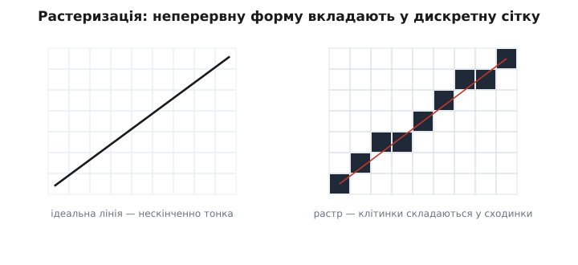
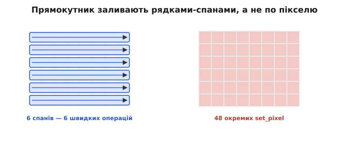
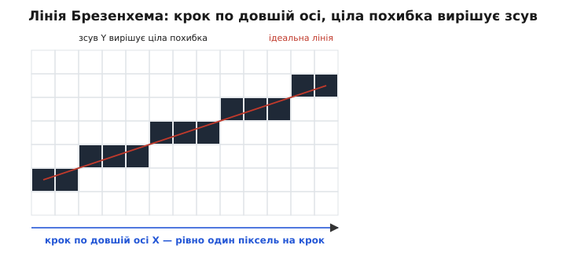
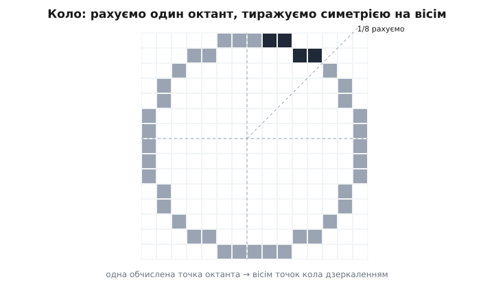
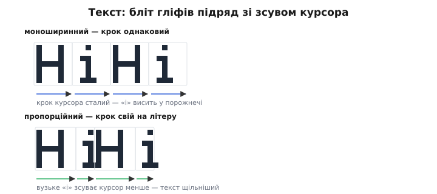
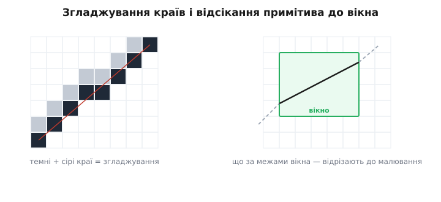

# Растеризація

Поставити один піксель у [кадровий буфер](root:sf-visual/framebuffer) і задати [його колір](root:sf-visual/color-formats) — справа нехитра. Та ніхто не малює інтерфейс цяткою за цяткою — ми мислимо **формами**: лінія, прямокутник, коло, рядок тексту. Завдання перетворити абстрактну форму (дві кінцеві точки, чотири кути, літеру) на той **набір пікселів**, що передає її на сітці екрана, зветься **растеризацією** (від нім. *Raster* «решітка, сітка», далі лат. *rastrum* «граблі», від *radere* «шкребти»). Назва влучна: растеризація наче «прочісує» форму граблями сітки, лишаючи від неї рядок засвічених клітинок. Саме растеризація стоїть між «я хочу лінію» і реальними записами в кадровий буфер.

Слово прийшло з телебачення: промінь електронно-променевої трубки малював зображення, проводячи екран рядок за рядком — і ці паралельні смуги-проходи назвали растром, бо вони й справді нагадують слід граблів. Перехід від гладкої геометрії до зернистої сітки робить екранну графіку одночасно простою в основі та сповненою дрібних хитрощів, які ми зараз і розберемо.

### Від пікселя до примітива: що таке растеризація

Корінь усієї задачі — у зіткненні двох світів. Форми, якими ми мислимо, **неперервні**: ідеальна лінія нескінченно тонка, коло гладке. А пікселі — **дискретні** квадратики жорсткої сітки. Растеризувати — означає чесно вибрати, які саме клітинки засвітити, щоб вони якнайкраще передали неперервну форму.


*Зліва — ідеальна лінія, нескінченно тонка. Справа — її растр: набір клітинок, що складаються в сходинки, бо інакше передати косу лінію на квадратній сітці неможливо. Уся растеризація — це пошук найкращого такого наближення.*

Через цю дискретність растеризація завжди **наближення**, і в нього є ціна — ті самі сходинки на косих лініях. Розгортати тему зручно від простого до складного: прямокутники, потім лінії, кола й текст.

Ця задача не зникає з ростом потужности — вона лише ховається глибше. І на крихітному монохромному екранчику, і на величезному щільному моніторі дилема та сама: неперервну форму треба вкласти в дискретну сітку, обравши клітинки. Різниця тільки в тому, що на густішій сітці сходинки дрібніші й менш помітні. Тож прийоми нижче — не милиці для бідного заліза, а сама основа комп'ютерної графіки; просто на мікроконтролері вони оголені до кістки, без апаратних помічників, що ховають їх у дорогих системах.

### Прямокутники й заливки: найлегше

Найпростіший примітив — **заповнений прямокутник**. Здавалося б, нічого думати: пройди подвійним циклом по всіх (x, y) у межах прямокутника й постав кожен піксель. Це працює, та коли так заливати весь екран, мільйони окремих викликів «постав піксель» гальмують. Хитрість — заливати **спанами**: оскільки рядок прямокутника — це суцільна горизонтальна смуга однакового кольору, її заповнюють **одним проходом**, як заповнюють ділянку пам'яті (memset), а не піксель за пікселем.


*Той самий прямокутник: ліворуч — шість спанів, тобто шість швидких операцій; праворуч — сорок вісім окремих set_pixel. Горизонтальний спан — заповнити цілий рядок одним махом — найшвидший будівельний блок графіки, на якому стоїть і заливка, і очищення екрана.*

Контур прямокутника — це просто його чотири сторони, тобто чотири лінії (дві горизонтальні — ті ж спани, дві вертикальні). Тож варто навчитися малювати **лінію** — і прямокутники з заливками виходять майже задарма. А от сама лінія — це вже цікаво.

Заливка, до речі, не конче суцільна. Тим самим спаном можна класти не один колір, а **візерунок** чи **градієнт** — просто значення в рядку рахують на льоту замість копіювати одне. А контур буває не в один піксель завтовшки: товсту рамку малюють або кількома вкладеними прямокутниками, або заливкою смуги по периметру. Та хоч як ускладнюй, прямокутник лишається найдешевшим примітивом — рівні, осьові межі дозволяють працювати цілими рядками, без жодної косої арифметики.

> 🔧 **Навіщо це.** Очищення екрана, фон вікна, кнопки, смуги прогресу, заливка тла під текст — усе це прямокутники. Якщо найдешевший примітив малювати найдорожчим способом (подвійний цикл по пікселях), кадр просідає ще до того, як ви намалювали бодай одну літеру. Звідси перше правило швидкої графіки: рівні ділянки — завжди спанами.

### Лінії: непроста простота

Як вирішити, які пікселі складають лінію від (x0, y0) до (x1, y1)? Шкільна відповідь — рівняння y = k·x + b: крокуй по x, рахуй y, округлюй до клітинки. Воно й працює, але має дві біди. Перша — **дробові числа**: множення й округлення з плаваючою комою на дрібному мікроконтролері повільні, а то й геть недоступні. Друга, підступніша: якщо лінія крута (йде більше вгору, ніж убік), крок по x лишає в ній **діри** — на один x припадає кілька y, і пікселі не змикаються.


*Секрет рівної лінії — крокувати по довшій осі (тут X), даючи на кожен її крок рівно один піксель. А коли зсувати другу координату, вирішує ціле число-похибка: наскільки лінія вже відійшла від поточного рядка. Переросла половину клітинки — зсунули Y, відняли назад. Жодного float.*

Розв'язок, що став класикою, оминає обидві біди. По-перше, крокують завжди по **довшій** осі — так на кожен крок припадає рівно один піксель, і дір не буває. По-друге, замість дробового y ведуть **цілу похибку** — накопичену відстань лінії від поточного рядка; коли вона переростає півклітинки, координату зсувають на піксель і похибку коригують. Усе на цілих числах, самими додаваннями й порівняннями. Це й є алгоритм Брезенхема (Jack Bresenham, IBM, 1962 — спершу для пера графобудівника, не для екрана), настільки ощадливий, що ліг в основу графіки на найскромнішому залізі.

Ось він на ділі — намалювати лінію прямо в [кадровий буфер](root:sf-visual/framebuffer), самими цілими числами:

**Лінія Брезенхема в кадровий буфер (будь-який нахил і напрям).** Працюємо з кроком ±1 по кожній осі й однією цілою похибкою:

:::tabs
```cpp
// fb — кадровий буфер W×H, набір пікселів кольору color.
void draw_line(uint16_t *fb, int W, int H,
               int x0, int y0, int x1, int y1, uint16_t color)
{
    int dx =  abs(x1 - x0);
    int dy = -abs(y1 - y0);      // dy від'ємний — спрощує крок похибки
    int sx = x0 < x1 ? 1 : -1;   // напрям по X
    int sy = y0 < y1 ? 1 : -1;   // напрям по Y
    int err = dx + dy;           // ціла похибка, старт = dx + dy

    for (;;) {
        if ((unsigned)x0 < (unsigned)W && (unsigned)y0 < (unsigned)H)
            fb[y0 * W + x0] = color;          // відсікання: лише видимі пікселі
        if (x0 == x1 && y0 == y1) break;      // дійшли кінця
        int e2 = 2 * err;                     // подвоєна похибка — порівнюємо без дробів
        if (e2 >= dy) { err += dy; x0 += sx; } // крок по X
        if (e2 <= dx) { err += dx; y0 += sy; } // крок по Y
    }
}
```
```python
# fb — кадровий буфер W×H (плаский список), набір пікселів кольору color.
def draw_line(fb, W, H, x0, y0, x1, y1, color):
    dx =  abs(x1 - x0)
    dy = -abs(y1 - y0)           # dy від'ємний — спрощує крок похибки
    sx = 1 if x0 < x1 else -1    # напрям по X
    sy = 1 if y0 < y1 else -1    # напрям по Y
    err = dx + dy                # ціла похибка, старт = dx + dy

    while True:
        if 0 <= x0 < W and 0 <= y0 < H:
            fb[y0 * W + x0] = color        # відсікання: лише видимі пікселі
        if x0 == x1 and y0 == y1:
            break                          # дійшли кінця
        e2 = 2 * err                       # подвоєна похибка — порівнюємо без дробів
        if e2 >= dy:                       # крок по X
            err += dy
            x0 += sx
        if e2 <= dx:                       # крок по Y
            err += dx
            y0 += sy
```
:::

Цикл робить на піксель лише пару цілих додавань і два порівняння — жодного множення в гарячій частині (множення на 2 компілятор оберне на зсув). Та сама `err` веде лінію будь-якого нахилу: коли `dx` більший, частіше спрацьовує крок по X, коли `dy` — по Y, тож «крок по довшій осі» виходить сам собою, без окремих гілок на круту й пологу лінію.

Реальні лінії бувають товсті й пунктирні, та обидва ускладнення лягають на той самий кістяк. Товсту лінію малюють або кількома паралельними тонкими, або як видовжений прямокутник під кутом; пунктир — просто пропускаючи частину пікселів за лічильником. Головне ж, заради чого вся ця хитрість, — швидкість: наївний спосіб на кожен піксель робить множення й округлення з комою, а Брезенхем — лише пару цілих додавань. На лінії в кількасот пікселів, ще й тисячі ліній на кадр, ця різниця й відділяє «плавно» від «гальмує».

Те, як саме виводиться крок похибки для лінії й кола, як заливають довільні фігури по рядках і як гасять сходинки півтонами, розібрано глибше в [детальній версії теми](root:sf-visual/primitives-raster/detail).

### Кола й дуги: симетрія на поміч

Коло растеризують спорідненою ідеєю — теж цілою похибкою, що веде криву по клітинках без тригонометрії на льоту. Та коло дарує ще й чудовий подарунок — **симетрію**. Воно однакове в усіх восьми октантах, тож порахувати треба лише **одну восьму** дуги, а решту сім дістати простим **відображенням** координат по осях і діагоналі.


*Кожна обчислена точка одного октанта дає одразу вісім точок кола — дзеркальним відображенням по горизонталі, вертикалі й діагоналі. Так симетрія економить сім восьмих роботи, а самі точки знаходять цілими числами.*

Цей прийом — рахувати малий шматок і **тиражувати симетрією** — наскрізний у графіці: він економить і час, і код, і його варто впізнавати скрізь, де форма має осі симетрії.

Із цього октанта легко дістати й більше, ніж контур. **Залитий** круг виходить, якщо між симетричними точками протягти горизонтальні спани — знову той самий спан, наш найшвидший інструмент. **Дугу** малюють, обчислюючи не весь октант, а лише потрібний діапазон кутів. А **еліпс** — це те саме коло, тільки з різними кроками по двох осях. Усе сімейство круглих форм виростає з однієї цілочислової ідеї плюс симетрія — і жодної тригонометрії в гарячому циклі.

### Текст: літера — це маленький бітмап

Найуживаніший примітив інтерфейсу — **текст**, і влаштований він простіше, ніж здається. Кожна літера зберігається як крихітний **бітмап** — **гліф** (від грец. *glyphē* «різьблення») у складі шрифту: маленький візерунок пікселів, що зображає саме цей символ. Намалювати рядок означає поставити гліф кожної літери в поточну позицію **курсора** — а це не що інше, як [бліт](root:sf-visual/framebuffer), копіювання прямокутного блоку пікселів, — і зсунути курсор на ширину літери.


*Кожна літера — маленький бітмап-гліф; малювання тексту блітить їх один за одним і щоразу посуває курсор. У моноширинному шрифті крок однаковий для всіх літер; у пропорційному — свій для кожної (вузьке «i» зсуває курсор менше за широке «H»), і текст виглядає природніше.*

Тут і ховається різниця між **моноширинним** шрифтом, де кожна літера займає однакову ширину (зручно, та «i» висить у завеликій порожнечі), і **пропорційним**, де ширина своя в кожної літери, і рядок виглядає як друкований. А **як саме** влаштований гліф усередині, як його роблять гладким і звідки беруть форми, — це окрема велика тема [про шрифти](root:sf-visual/fonts); тут досить бачити, що текст зводиться до тих самих блітів пікселів.

Сам шрифт при цьому — це просто **таблиця** гліфів, проіндексована кодом символу: щоб намалювати літеру, беруть її код (скажімо, ASCII), знаходять у таблиці потрібний бітмап і блітять його. Звідси й практичні турботи [роботи зі шрифтами](root:sf-visual/fonts): скільки символів покласти в таблицю (сама латиниця — це близько сотні гліфів, а кирилиця чи юнікод — куди більше, і всі вони їдять Flash), якої висоти їх тримати й чи рівняти проміжки між парами літер. Текст здається дрібницею — аж доки не порахуєш, скільки пам'яті з'їдає гарний великий шрифт.

Через цю вагу текст часто й стає найгарячішим місцем графіки — адже на екрані інтерфейсу літер зазвичай більше, ніж будь-чого іншого. Тому гліфи тримають у швидкій пам'яті наперед готовими, а не рахують щоразу; а незмінний текст (підписи, шкали) розумно не перемальовувати взагалі, доки він не змінився. Тут знову зринає те саме правило, що й зі спанами: найдешевша літера — та, яку не довелося малювати наново.

### Сходинки й межі: аліасинг і відсікання

Повернімося до ціни дискретности. Косі лінії й кола на квадратній сітці неминуче виходять **ступінчастими** — це **аліасинг** (від англ. *aliasing*, «підміна»: гладка форма прикидається сходинками), ті самі драбинки. Око їх помічає, надто на плавних кривих. Лікують їх **згладжуванням** (англ. *anti-aliasing*): крайові пікселі роблять не суто чорними чи білими, а **сірими** — пропорційно тому, яку частку клітинки накриває форма. Око зливає ці півтони в гладку межу. Найбільше згладжування важить [для шрифтів](root:sf-visual/fonts), де від нього прямо залежить читабельність.

Чому згладжування найважливіше саме для тексту? Бо літери — це маса дрібних косих і круглих штрихів, і на малому розмірі без згладжування вони розсипаються на нечитабельні сходинки. Великій діагональній лінії аліасинг лише псує вигляд, а дрібному шрифту відбирає **читабельність**, заради якої екран і існує. Тому в дисплеях, де багато тексту, згладжування гліфів — не косметика, а необхідність; на грубому ж монохромному екранчику від нього відмовляються, бо проміжного сірого там просто немає.


*Ліворуч: та сама коса лінія — ступінчаста й згладжена сірими крайовими пікселями. Праворуч: відсікання — усе, що виходить за межу екрана чи вікна, відрізають заздалегідь і не малюють.*

Друга турбота меж — **відсікання** (англ. *clipping*, «обрізання»). Малюючи примітив, треба не вийти за край екрана чи поточного вікна — інакше запис за межі [кадрового буфера](root:sf-visual/framebuffer) псує чужу пам'ять. Тому примітив **відсікають** до прямокутника видимої ділянки: або обрізають його геометрично ще до растеризації (швидко), або перевіряють кожен піксель на належність межам (просто, але повільніше) — саме таку перевірку `(unsigned)x < (unsigned)W` ви бачили в коді лінії вище. Відсікання — не дрібниця, а обов'язкова страховка кожної операції малювання.

### Швидкість: думати спанами, а не пікселями

Зведімо докупи наскрізну думку. Будь-який примітив зрештою розпадається на записи в кадровий буфер — але **як** ці записи робити, вирішує швидкість. Три правила, що проходять через усю тему: заповнюй **спанами** (цілий рядок за раз), а не пікселями; рахуй **цілими** числами (Брезенхем), а не дробовими; рухай готові шматки **блоками** (бліт), а не цяткою. Саме на цих трьох прийомах і стоїть швидка графіка на скромному залізі — а в потужніших системах ті самі спани, бліти й цілочислові лінії виконує вже апаратний 2D-прискорювач.

Є й четвертий, стратегічний прийом, що стоїть над усіма трьома: не перемальовувати того, що **не змінилося**. Найшвидший піксель — той, якого ти не торкнувся. Замість гнати весь кадр щоразу, відстежують, які ділянки справді оновилися, і чіпають лише їх. Цю економію бездіяльністю варто закласти в голову одразу: часто найбільший виграш дає не швидше малювання, а **відмова малювати** зайве.

> 🔧 **Навіщо це.** Коли картинка гальмує, винні майже завжди не самі пікселі, а **спосіб** їх ставити. Перш ніж оптимізувати алгоритм, спитайте: чи заливаю я спанами, а не подвійним циклом? чи цілі в мене обчислення, без float? чи блічу готові спрайти замість малювати їх щоразу? Найбільший виграш дає не хитрий код, а перехід від «по пікселю» до «гуртом».

Підсумок простий: усе розмаїття форм — пряма, прямокутник, коло, літера — звелося до жменьки прийомів над одним масивом пам'яті. Лінію й коло веде ціла похибка, прямокутник заливають спанами, текст і спрайти переносять блоками, а зайвого не малюють зовсім. Засвоївши ці чотири рухи, ви вмієте намалювати на екрані будь-що — бо складніша графіка є лише їхньою комбінацією.

---
