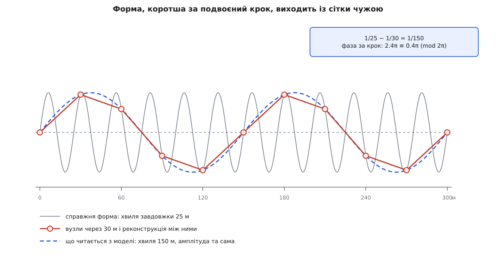

# 🧮 Ціна здогаду між вузлами: викладки про похибку реконструкції на сітці

<preknowlist>
- [Похідна](topic:math-analysis/derivative) — швидкість зміни функції. Тут потрібна **друга** похідна: саме вона міряє кривину, тобто наскільки поверхня відходить від дотичної до неї прямої чи площини.
- [Білінійна інтерполяція](topic:math-numeric/bilinear-interpolation) — саме правило реконструкції: чотири кутові висоти й пара часток u, v дають значення всередині комірки. Формулу беремо звідти готовою, тут рахуємо її похибку.
- [Матриця Гессе](topic:math-analysis/hessian-matrix) — таблиця других похідних функції двох змінних; знак її визначника відрізняє максимум і мінімум від сідлової точки.
- [Теорема Найквіста — Шеннона](topic:com-signal/sampling-theorem) — крок вибірки задає найкоротшу довжину хвилі, яку вибірка ще розрізняє; коротші хвилі вона не втрачає мовчки, а підмінює довшими.
</preknowlist>

Сітка тримає висоти тільки у вузлах, а відповідь треба видавати в будь-якій точці — отже кожне не-вузлове значення вигадане за правилом, і питання лише в тому, наскільки далеко вигадка може відійти від землі. Відповідей виявляється три, і різняться вони не точністю рахунку, а тим, що ми згодні припустити про саму поверхню: для двічі диференційовної похибка не перевищує Δ²/8 · max|h″|, для гребеня з ребром вона дорівнює s·Δ/2, а для форм, коротших за подвоєний крок, оцінки немає взагалі — бо в даних немає й самої форми.

Позначення далі такі. Крок сітки — Δ, і скрізь у числових прикладах Δ = 30 м. Комірка — квадрат між чотирма сусідніми вузлами; положення точки в ній задають частки u, v ∈ [0, 1], а висоти кутів звемо h₀₀ (u = 0, v = 0), h₁₀, h₀₁, h₁₁. Справжня поверхня — h(x, y), реконструйована — z(u, v).

## Хорда замість дуги

Почнімо з одного виміру: два сусідні вузли на відстані Δ, між ними реконструкція проводить пряму. Наскільки справжня функція може відійти від цієї хорди?

Питання поставлене так, що без додаткових умов відповіді не має. Через дві точки проходить нескінченно багато функцій, і жодного числа з двох значень не витиснеш. Тож припустімо мінімум: f двічі диференційовна на [a, b], де b − a = Δ.

Нехай p — хорда, пряма через (a, f(a)) і (b, f(b)). Похибка f − p обертається на нуль в обох вузлах, а найпростіша функція з такою самою парою нулів — добуток

```
w(t) = (t − a)(t − b)
```

Пропорційність похибки цьому добутку не треба вгадувати — її можна змусити справдитися в одній наперед узятій точці, і цього вистачить. Зафіксуймо x усередині проміжку й доберімо число K так, щоб функція

```
E(t) = f(t) − p(t) − K · w(t)
```

дорівнювала нулю при t = x. Оскільки E і так нульова в a та b, тепер у неї три нулі: a, x, b. Між сусідніми нулями похідна мусить десь обернутися на нуль ([теорема Ролля](topic:math-analysis/rolle-theorem)) — отже E′ має щонайменше два нулі, а між ними, тим самим міркуванням, E″ має щонайменше один: назвімо його ξ.

Порахуймо E″ навпростець. Хорда лінійна, тож p″ = 0; добуток w розкривається в t² − (a+b)t + ab, тож w″ = 2. Лишається

```
0 = E″(ξ) = f″(ξ) − 2K    →    K = f″(ξ)/2
```

Підставивши K назад у рівність E(x) = 0, дістаємо точний вираз похибки — не наближення, а тотожність, у якій невідоме лише розташування ξ:

```
f(x) − p(x) = f″(ξ)/2 · (x − a)(x − b),    ξ ∈ (a, b)
```

Звідси одразу два висновки, і перший важливіший за оцінку.

**Знак похибки не випадковий.** Усередині проміжку (x − a) > 0, а (x − b) < 0, тож добуток завжди від'ємний. Отже f − p має знак, протилежний до f″. Там, де поверхня опукла донизу (улоговина, f″ > 0), хорда йде **вище** землі; там, де опукла догори (гребінь, f″ < 0), хорда йде **нижче**. Реконструкція завжди зрізає верхівки й підсипає западини — і ніколи навпаки. Це означає, що вздовж маршруту похибки не гасять одна одну: на кожній вершині вони дивляться в один бік, і саме там, де запас над рельєфом важить найбільше.

**Величина.** Модуль |(x − a)(x − b)| найбільший посередині й дорівнює там (Δ/2)² = Δ²/4. Тому

```
|f − p| ≤ Δ²/8 · max|f″|
```

Множник Δ²/8 узято не зі стелі. Візьмімо пологу дугу кола радіуса R і подивімося на неї у вершині, де похідна нульова: там |f″| = 1/R, а вираз Δ²/(8R) — це відома в геометрії висота кругового сегмента, стріла, якою дуга відходить від хорди довжини Δ. Отже на пологій дузі оцінка не просто обмежує похибку згори — вона дає її саму; для крутіших схилів вона починає лишати запас.

Числа для Δ = 30 м, де Δ²/8 = 112.5 м²:

```
пологий схил, нахил міняється на 0.05 на 100 м
    |h″| = 0.05/100 = 5·10⁻⁴ 1/м  →  112.5 · 5·10⁻⁴ = 0.056 м

округла вершина, радіус кривини 300 м
    |h″| = 1/300 = 3.3·10⁻³ 1/м   →  112.5/300      = 0.375 м

крута маківка, радіус кривини 60 м
    |h″| = 1/60  = 1.7·10⁻² 1/м   →  112.5/60       = 1.875 м
```

Проти власної похибки глобальних моделей рельєфу — одиниці й десятки метрів — усе це шум. Поки поверхня гладка, реконструкція коштує сантиметри.

## Дві хорди замість комірки

У двох вимірах білінійна форма — це та сама хорда, застосована двічі. Запишімо це операторами. Хай Lₓ означає лінійне змішування вздовж x між двома вузловими вертикалями, а L_y — те саме вздовж y:

```
(Lₓ f)(x, y) = f(x₀, y)·(1 − u) + f(x₁, y)·u
(L_y f)(x, y) = f(x, y₀)·(1 − v) + f(x, y₁)·v
```

Застосуємо їх одне за одним: Lₓ h бере значення на двох вертикалях і змішує, далі L_y бере вже тільки чотири кутові числа. Результат L_y Lₓ h — це і є білінійна реконструкція z. Порядок значення не має: Lₓ L_y h дає той самий вираз.

Тепер розкладімо похибку на два одновимірні кроки, додавши й віднявши проміжну функцію Lₓ h:

```
h − z = (h − Lₓ h) + (Lₓ h − L_y Lₓ h)
```

Перший доданок — чиста одновимірна похибка хорди вздовж x при кожному фіксованому y. Готова оцінка дає |h − Lₓ h| ≤ Δ²/8 · max|hₓₓ|.

Другий доданок — така сама похибка хорди, але застосована вже до функції g = Lₓ h і вздовж y. Щоб її оцінити, потрібна друга похідна саме g. А вона рахується задарма: g є сумою двох членів, у яких залежність від y сидить лише в множниках h(x₀, y) і h(x₁, y), а ваги (1 − u) та u від y не залежать. Отже

```
g_yy = (1 − u)·h_yy(x₀, y) + u·h_yy(x₁, y)
```

Це опукла комбінація двох значень h_yy — а така комбінація ніколи не виходить за межі того, що комбінує. Тому |g_yy| ≤ max|h_yy| по комірці, і другий доданок не перевищує Δ²/8 · max|h_yy|. Разом:

```
|h − z| ≤ (Δ²/8) · ( max|hₓₓ| + max|h_yy| )
```

Варто зупинитися на тому, чого в цій оцінці **немає**: мішаної похідної h_xy. Вона керує формою латки — саме вона робить комірку сідлом, — але у величину похибки не входить. Причина проста: оцінку зібрано з двох суто одновимірних кроків, кожен уздовж своєї осі, і жоден з них про мішану похідну не питає.

Числа, знову Δ = 30 м:

```
купол із радіусом кривини 300 м в обох напрямках
    (900/8) · (1/300 + 1/300)  = 112.5 · 0.00667 = 0.75 м

той самий купол на сітці з кроком 90 м
    (8100/8) · (1/300 + 1/300) = 1012.5 · 0.00667 = 6.75 м
```

Крок виріс утричі — похибка вдев'ятеро. Квадратичний закон у дії: він однаково щедро винагороджує згущення сітки й карає її прорідження.

## Що саме натягнуто на чотири кути

Розкриймо білінійну форму в одночлени. Із чотирьох вагових доданків після зведення подібних лишається

```
z(u, v) = h₀₀ + a·u + b·v + D·u·v

    a = h₁₀ − h₀₀        приріст уздовж нижнього ребра
    b = h₀₁ − h₀₀        приріст уздовж лівого ребра
    D = h₀₀ − h₁₀ − h₀₁ + h₁₁
```

Три перші доданки — площина через три кути. Увесь надлишок сидить у D. Це **мішана друга різниця** чотирьох висот: різниця приростів уздовж двох протилежних ребер. Для гладкої поверхні D ≈ Δ²·h_xy. Назвімо D перекосом комірки: якщо чотири кути лежать в одній площині, перекіс нульовий і латка плоска; якщо ні — він показує, наскільки четвертий кут не дотягує до площини перших трьох.

Звідси всі властивості читаються прямо з формули.

**Уздовж осей — пряма.** Зафіксуймо v: доданок D·u·v стає лінійним за u, і вся функція лінійна. Так само за v при фіксованому u. Тому будь-який відрізок, паралельний осям сітки, реконструюється прямою — і його найвища точка лежить на кінці.

**Уздовж діагоналі — парабола.** Покладімо u = v = t. Тоді

```
z(t) = h₀₀ + (a + b)·t + D·t²
```

Квадратичний член має коефіцієнтом рівно D. Відхилення цієї параболи від власної хорди дорівнює D·t(t − 1) і найбільше посередині: |D|/4.

Візьмімо конкретну комірку — два протилежні кути вищі, два нижчі:

```
h₀₀ = 100   h₁₀ = 112   h₀₁ = 112   h₁₁ = 100

a = 112 − 100 = 12
b = 112 − 100 = 12
D = 100 − 112 − 112 + 100 = −24

z(u, v) = 100 + 12u + 12v − 24uv

по діагоналі 00 → 11 (u = v = t):   z = 100 + 24t − 24t²
    кінці 100 і 100, середина 100 + 6 = 106      ← максимум усередині

по діагоналі 10 → 01 (u = t, v = 1 − t):   z = 112 − 24t + 24t²
    кінці 112 і 112, середина 112 − 6 = 106      ← мінімум усередині
```

Обидві діагоналі приходять у ту саму точку 106 м — одна знизу, друга згори. Це підпис сідла.

**Це гіперболічний параболоїд.** Доведімо простим зсувом початку координат. Якщо D ≠ 0, покладімо u = u′ − b/D та v = v′ − a/D і підставмо:

```
z = h₀₀ + a(u′ − b/D) + b(v′ − a/D) + D(u′ − b/D)(v′ − a/D)
  = h₀₀ + a·u′ − ab/D + b·v′ − ab/D + D·u′v′ − a·u′ − b·v′ + ab/D
  = (h₀₀ − ab/D) + D·u′·v′
```

Лінійні члени скоротилися повністю. Лишається

```
z = C + D·u′·v′,    C = h₀₀ − ab/D
```

Це канонічна форма гіперболічного параболоїда: поверхня z = D·XY, яку поворотом на 45° переводять у z = D(X² − Y²)/2. Її лінії рівня — гіперболи u′·v′ = const, а їхні асимптоти паралельні осям сітки. Виродженою є єдина ізолінія z = C: рівність u′v′ = 0 задає не криву, а **хрест** із двох прямих через центр.

Для нашої комірки центр зсуву — це u = −b/D = 0.5, v = −a/D = 0.5, тобто саме середина, а C = 100 − (12·12)/(−24) = 106. Отже

```
z = 106 − 24·(u − 0.5)(v − 0.5)
```

Перевірка на кутах: z(0, 0) = 106 − 24·0.25 = 100 ✔, z(1, 0) = 106 + 6 = 112 ✔. Ізолінія 106 м на цій комірці — рівно хрест через центр, а всі інші — дуги гіпербол, що тиснуться до кутів.

Центр зсуву не мусить потрапляти всередину квадрата: при несиметричних висотах він виїжджає за комірку, і тоді видима латка — лише крайовий шматок того самого сідла.


*Перекіс D = −24 м — єдине, що відрізняє комірку від площини. Він задає і величину відхилення діагоналі від хорди (|D|/4 = 6 м), і гіперболічну форму ізоліній, асимптоти яких паралельні осям сітки.*

**Усередині комірки немає ні вершини, ні ями.** Похідні білінійної форми:

```
∂z/∂u = a + D·v        ∂z/∂v = b + D·u
```

Обидві обертаються на нуль в одній-єдиній точці u = −b/D, v = −a/D — у тому самому центрі зсуву. Матриця других похідних там

```
       │ 0  D │
  H =  │ D  0 │       det H = −D² < 0
```

Від'ємний визначник означає сідло, а сідло не буває ні локальним максимумом, ні мінімумом. Тож при D ≠ 0 крайні значення z по замкненій комірці лежать на її межі; на межі ж кожне ребро паралельне осі, отже z там лінійна, і крайні значення сповзають у кути. Реконструкція справді не вигадує ні піків, ні проваль. Але це твердження стосується комірки цілої — і воно нічого не обіцяє про окремий відрізок усередині неї.

**Похилий відрізок бачить параболу.** Пройдімо комірку прямою u = u₀ + p·t, v = v₀ + q·t. Підстановка дає

```
z(t) = сталий член + (a·p + b·q + D·(u₀q + v₀p))·t + D·p·q·t²
```

Квадратичний коефіцієнт — D·p·q. Для відрізка, паралельного осі, один із множників p, q нульовий: функція лінійна, шукати нема чого. Для похилого — це справжня парабола з вершиною в

```
t* = − (a·p + b·q + D·(u₀q + v₀p)) / (2·D·p·q)
```

і якщо t* потрапляє в пройдений відтинок, найвища точка маршруту в цій комірці лежить **строго всередині** неї. У нашій комірці маршрут із кута (0, 0) в кут (1, 1) дає z(t) = 100 + 24t − 24t², вершину при t* = 24/48 = 0.5 і висоту 106 м проти 100 м на обох кінцях. Перевірка запасу, що дивиться лише на вхід у комірку й вихід із неї, пропускає тут шість метрів.

## Значення сходяться, нахил — ні

Дві сусідні комірки ділять спільне ребро. Підставмо u = 1 у ліву комірку та u = 0 у праву:

```
ліва  при u = 1:   z = h₁₀ + (h₁₁ − h₁₀)·v
права при u = 0:   z = h₁₀ + (h₁₁ − h₁₀)·v
```

Вирази тотожні, і причина цьому проста: слід білінійної форми на ребрі є лінійною функцією, а лінійна функція на відрізку однозначно визначена своїми кінцевими значеннями — тобто висотами двох вузлів, що лежать **на самому ребрі**. Далекі кути в цей слід не входять зовсім, хоч у сусідніх комірок вони різні. Тому реконструкція неперервна на всій сітці: розриву висоти немає ніде.

З нахилом інакше. У лівій комірці частинна похідна за x дорівнює (a_L + D_L·v)/Δ, у правій — (a_R + D_R·v)/Δ, де a_L = h₁₀ − h₀₀ та a_R = h₂₀ − h₁₀. Різниця на межі:

```
стрибок = { (h₀₀ − 2h₁₀ + h₂₀) + (D_R − D_L)·v } / Δ
```

У першій дужці — друга різниця висот упоперек ребра, у другій — зміна перекосу. Щоб стрибок був нульовим при **всіх** v, обидві дужки мусять зникнути одночасно, а це означає, що дані навколо ребра лежать в одній площині. Досить будь-якої кривини рельєфу — і на межі комірок з'являється злам.

Конкретний приклад. Ряд із трьох вузлів через 30 м, уздовж ребра рельєф не змінюється (обидва перекоси нульові):

```
h₀₀ = 100    h₁₀ = 112    h₂₀ = 100

нахил ліворуч   (112 − 100)/30 = +0.400   → +21.8°
нахил праворуч  (100 − 112)/30 = −0.400   → −21.8°
стрибок         (100 − 2·112 + 100)/30 = −24/30 = −0.800
```

Злам на 43.6° зібрано в одну лінію нульової ширини. Разом із нахилом стрибком міняє напрямок і нормаль до поверхні — а на ній тримається будь-яке затінення, тож грані комірок проступають на картинці навіть там, де рельєф гладкий.


*Стрибок нахилу дорівнює другій різниці висот, поділеній на крок. Висота при переході через вузол не розривається — розривається похідна, і разом з нею напрямок нормалі.*

Оцінімо, як цей злам поводиться при згущенні сітки. Для гладкої поверхні друга різниця ≈ Δ²·hₓₓ, отже стрибок ≈ Δ·hₓₓ — спадає лише **лінійно** з кроком. Для нашого пологого схилу з hₓₓ = 5·10⁻⁴ і Δ = 30 м це 0.015, тобто півтора відсотка нахилу: непомітно оком, але не нуль. Реконструкція наближається до гладкої, коли крок меншає, проте гладкою не стає ніколи — тому похідні (нахил, експозицію, напрямок стоку) беруть не з неї, а зі [скінченних різниць](topic:math-numeric/finite-difference-method) по самих вузлах.

## Де межа Δ²/8 нічого не обіцяє

Уся оцінка Δ²/8 спирається на max|h″| по проміжку. Варто спитати, звідки взяти це число для справжнього рельєфу — і виявляється, що часто нізвідки: лінія хребта є ребром, урвище є розривом, і друга похідна там не просто велика, а не існує. Формула тоді каже «нескінченність» — і каже правду, бо через два вузлові значення справді проходить будь-яка поверхня, і дані не здатні відкинути жодну. Оцінка похибки міряє не сітку саму по собі, а пару «сітка + клас гладкости», якому ми довіряємо поверхню.

Візьмімо найпростішу негладку форму — клин із нахилом s обабіч. Вершина стоїть на відстані d від лівого вузла, обидва вузли лежать на схилах, а висоту лівого вузла беремо за нуль: вибір початку відліку не змінює ні хорди, ні похибки.

```
f(d) = s·d
f(Δ) = s·d − s·(Δ − d) = s·(2d − Δ)

хорда в точці d:   (d/Δ)·s·(2d − Δ)

похибка(d) = s·d − (d/Δ)·s·(2d − Δ) = 2s · d(Δ − d) / Δ
```

Знову виринає добуток d(Δ − d) — та сама форма, що й (x − a)(x − b) у гладкій теорії, і той самий висновок: найгірше, коли вершина стоїть точно посередині. Там похибка дорівнює

```
похибка_max = 2s · (Δ/2)(Δ/2) / Δ = s·Δ/2
```

Числа:

```
Δ = 30 м:   нахил 0.10 →  1.5 м     нахил 0.40 →  6.0 м
            нахил 0.20 →  3.0 м     нахил 0.70 → 10.5 м
                                    нахил 1.00 → 15.0 м

Δ = 90 м:   нахил 0.40 → 18.0 м

вершина не посередині, а за 5 м від вузла (Δ = 30, s = 0.40):
    2 · 0.40 · 5 · 25 / 30 = 3.33 м
```

Тут ховається наслідок, вартий окремого рядка. Для двічі диференційовної поверхні похибка спадає як Δ², для клина — лише як Δ¹. Половинний крок ділить гладку похибку на чотири, а клинову — тільки надвоє. Порядок точности не є властивістю методу: він є властивістю методу **разом із** гладкістю того, що метод наближає.

## Межа роздільности, яку ставить крок

Далі починається те, чого не лікує вже жодна формула інтерполяції. Досі ми питали, наскільки реконструкція розходиться з поверхнею. Тепер спитаймо гостріше: що з поверхні взагалі потрапило у вузлові числа.

**Одиночна форма, вужча за крок, може не лишити сліду.** Хай горб має горизонтальну протяжність w < Δ. Вузли стоять через Δ, отже між двома сусідніми є проміжок довжини Δ, у який відрізок довжини w вкладається цілком — і тоді всередині горба немає жодного вузла. Усі виміряні значення виходять точно такими, якими були б без горба: набір чисел збігається до останнього біта з набором для рівної землі. Реконструкція тут ні до чого — на однакових числах будь-яке правило (білінійне, бікубічне, сплайнове, навчене на мільйоні прикладів) дає однаковий результат. При Δ = 30 м скельна голка чи дамба завширшки двадцять метрів може бути відсутня в моделі повністю, і чи буде — залежить винятково від того, куди лягли лінії сітки.

**Повторювана форма не зникає, а бреше.** Тепер хай рельєф має періодичний складник — гофровані пасма, дюни, тераси — з довжиною хвилі λ. Вибірка бере його у вузлах:

```
значення у вузлі n:   A · sin(2π·nΔ/λ + φ)
```

Дві різні довжини хвилі дають **тотожні** вибірки, коли їхні прирости фази за крок різняться на ціле число обертів:

```
2πΔ/λ₁ − 2πΔ/λ₂ = 2πk   →   1/λ₁ − 1/λ₂ = k/Δ
```

Тобто просторові частоти f = 1/λ, що різняться на кратне 1/Δ, у даних не відрізнити взагалі. Усе, що лежить вище за f = 1/(2Δ), складається назад у смугу нижче — і виходить звідти з іншою довжиною хвилі, але з тією самою амплітудою.

Порахуймо для Δ = 30 м і гофри з λ = 25 м:

```
f = 1/25 = 0.040000 цикл/м
k = 1:   f_alias = |0.040000 − 1/30| = |0.040000 − 0.033333| = 0.006667 цикл/м
λ_alias = 1/0.006667 = 150 м

звірка приростів фази за крок:
    справжня хвиля:  2π · 0.040000 · 30 = 2.4π
    підмінна хвиля:  2π · (1/150) · 30  = 0.4π
    різниця 2π — отже у КОЖНОМУ вузлі значення однакові
```

Гофра з хвилею завдовжки двадцять п'ять метрів виходить із сітки хвилею на сто п'ятдесят метрів і на повну амплітуду. Це не шум і не прогалина — це правдоподібна форма рельєфу, якої немає.



*Дванадцять справжніх хвиль на трьохстах метрах дають у вузлах ті самі числа, що й дві підмінні. Модель не втрачає амплітуду — вона втрачає довжину хвилі, і будує з чисел форму, якої в рельєфі немає.*

**Рівно на межі λ = 2Δ відповідь залежить від фази.** При Δ = 30 м це хвиля 60 м, приріст фази за крок дорівнює π, і вузлові значення дорівнюють A·sin(πn + φ). Якщо φ = 0, вузли сідають на нулі хвилі: усі значення нульові, гофра зникла безслідно. Зсуньмо хвилю на чверть довжини — вузли сядуть на гребені й підошви, і амплітуда прочитається повністю, щоправда пилкою з прямими схилами замість синусоїди. Той самий рельєф, та сама сітка, дві протилежні відповіді залежно від того, куди випадково лягли вузли. Саме тому 2Δ називають межею, а не робочим порогом: на самій межі результат — справа випадку.

Підсумкова межа для кроку 30 м така: форми, коротші за 60 м, у сітці не подані; форми, лише трохи довші, подані з амплітудою, що залежить від фази; надійно подані ті, що в кілька разів довші за 2Δ. Ця межа стоїть **до** будь-якої інтерполяції й нею не зсувається — вибір правила реконструкції перерозподіляє похибку всередині доступної смуги, а смугу задає сам крок.

> 🔧 **Навіщо це.** З цих викладок у [бюджет похибок](topic:math-probability/error-budget) запасу над рельєфом ідуть три різні рядки, і плутати їх дорого. На гладкому схилі реконструкція коштує частки метра — її можна викреслити, вона тоне у власній похибці моделі. На гребені між вузлами вона коштує s·Δ/2, тобто шість метрів при нахилі 40 % і кроці 30 м, — цей рядок додають завжди, бо знак у нього сталий: хорда зрізає вершини, а не підсипає їх. А для форм, коротших за 60 м, ніякого рядка немає взагалі: там не «велика похибка», там немає даних, і єдині чесні відповіді — летіти вище або взяти сітку з дрібнішим кроком.
