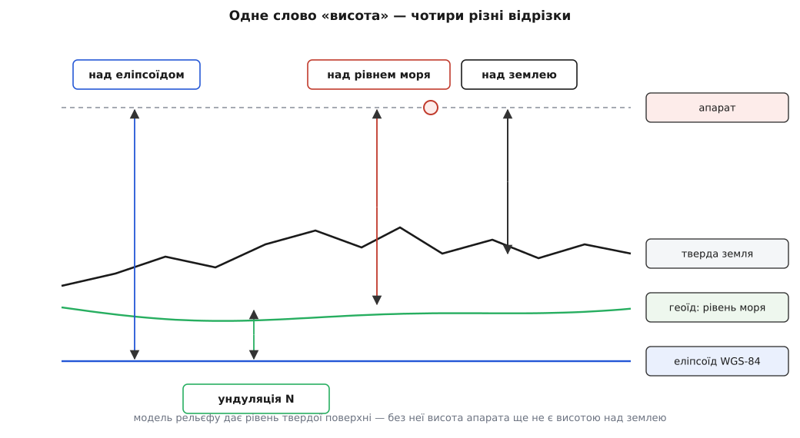
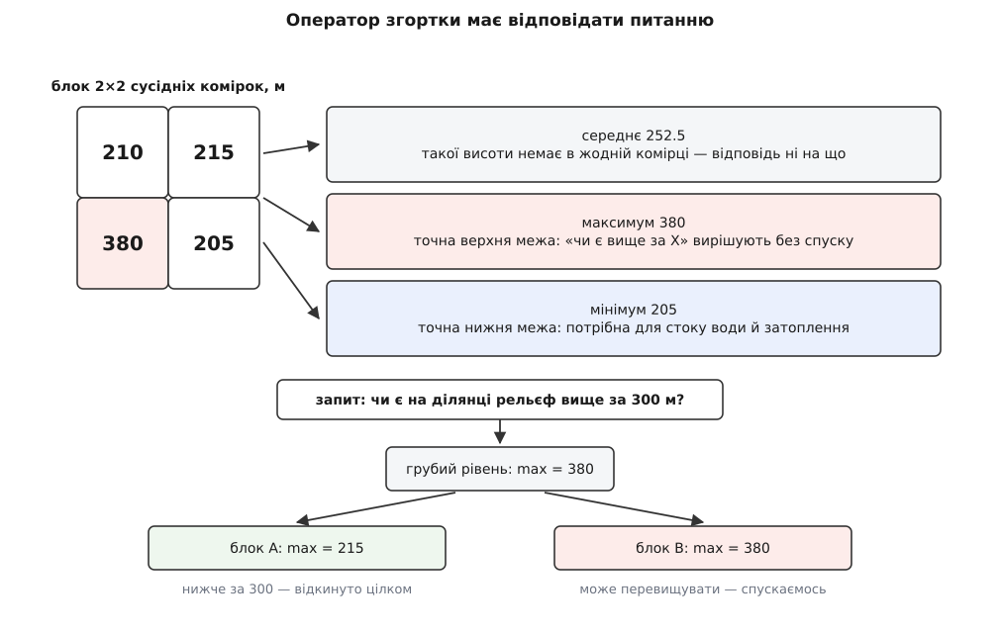
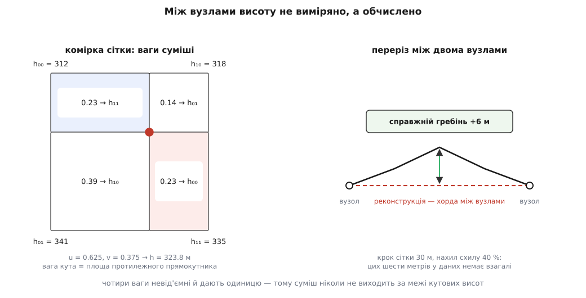
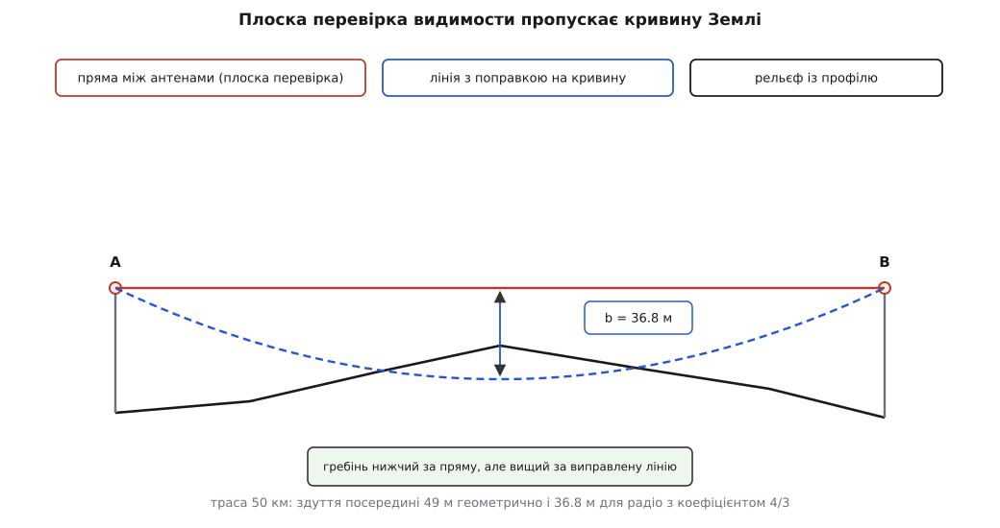

# Цифрова модель рельєфу і профіль висот

<preknowlist>
- [WGS-84: еліпсоїд і датум](topic:math-geometry/wgs84-datum) — гладка математична фігура, якою наближають форму Землі, і система, у якій задають широту й довготу.
- [Геоїд, AMSL і висота над еліпсоїдом](topic:math-geometry/geoid-and-amsl) — поверхня рівного потенціалу тяжіння, від якої відлічують «метри над рівнем моря», і чим вона відрізняється від еліпсоїда.
- [Відстань великого кола](topic:math-geometry/great-circle-distance) — як обчислити довжину відрізка маршруту на сфері, а не на площині.
- [Web Mercator і тайлова сітка](topic:math-geometry/web-mercator-tiles) — як світ вкладають у квадрат і ділять на клітинки з адресою z/x/y.
- [Доповняльний код](topic:hw-arch/twos-complement) — подання цілих зі знаком; звідки береться межа −32768 і чому саме її взяли за особливе значення.
- [Біти й порядок байтів](topic:sf-algorithms/bits-bytes-endianness) — як шістнадцятибітне число лежить у файлі двома байтами і що буває, коли їх прочитати не в тому порядку.
- [Аліасинг (теорема Найквіста)](topic:com-signal/aliasing) — крок вибірки визначає, що взагалі можна побачити у вибраному сигналі, а що зникає без сліду.
</preknowlist>

Апарат іде за завданням «на висоті 50 метрів». Поки під ним рівне поле, речення здається однозначним. Щойно маршрут виходить на схил, воно розпадається на чотири різні числа — і плутанина між ними коштує апарата.

## Над чим саме ці п'ятдесят метрів

Почнімо з чотирьох чисел, які в побутовій мові звуться однаково — «висота».

Приймач [супутникової навігації](topic:hw-sensing/gnss) видає **висоту над еліпсоїдом**: над гладкою математичною фігурою, до якої прив'язана вся система координат ([WGS-84](topic:math-geometry/wgs84-datum)). Еліпсоїд ніде не збігається з поверхнею води — це фігура зручности обчислень, а не фізичне тіло.

Карта, політне завдання й авіаційна фразеологія оперують **висотою над рівнем моря** — над **геоїдом** (гр. *gē* — Земля, *eîdos* — вигляд), поверхнею рівного потенціалу тяжіння, продовженою під суходіл. Саме геоїд є фізичним «нулем висот». Відстань між геоїдом і еліпсоїдом у даній точці називають **ундуляцією** (лат. *undula* — хвилька) і позначають N; світом вона змінюється приблизно від −105 метрів в Індійському океані до +85 метрів біля Нової Гвінеї, а як її обчислюють із моделі поля тяжіння — розібрано в [геоїді й AMSL](topic:math-geometry/geoid-and-amsl). Отже перші два числа різняться на десятки метрів, і різниця залежить від того, де ти стоїш:

```
H_AMSL = h_еліпсоїдна − N
```

Третє число дає [барометричний висотомір](root:embedded/barometric-altimeter): він міряє тиск і переводить його у висоту за модельною атмосферою. Це число пливе з погодою й вимагає прив'язки до відомого тиску на землі.

І є четверте, заради якого всі три й потрібні, — **висота над землею** просто тут, під апаратом. Тільки вона визначає, чи зачепиш ти схил. Її не дає жоден навігаційний приймач і жоден барометр: усі вони знають, де апарат, і не знають, де земля. Радіо- чи лазерний висотомір міряє її прямо, але лише під собою й лише зблизька — він не скаже, що буде за кілометр попереду, коли гальмувати вже пізно.

Звідси й потреба, з якої все виростає. Щоб знати висоту над землею наперед, потрібна **земля як дані**: функція, що на пару координат відповідає числом — рівнем твердої поверхні в цій точці, у тій самій системі відліку, що й висота апарата.

```
над_землею(λ, φ) = H_апарата_AMSL − H_рельєфу_AMSL(λ, φ)
```

Ця функція і є **цифрова модель рельєфу** (англ. *digital elevation model*, DEM). Труднощі починаються одразу за означенням: неперервної функції двох координат у машині не буває.



*Одне слово «висота» позначає чотири різні відрізки. Модель рельєфу дає передостанній із них — рівень твердої поверхні, — і лише разом із ним висота апарата перетворюється на висоту над землею.*

> 🔧 **Навіщо це.** Найпоширеніша аварія на цьому місці не має нічого спільного з алгоритмами: політне завдання складено у висотах над рівнем моря, а апарат тримає висоту з приймача над еліпсоїдом. У Європі ундуляція додатна й вимірюється десятками метрів, тож апарат систематично йде **нижче** за задане на цю величину. Помилка стала, тиха й не видна ні в логах, ні на карті — доки маршрут не зайде на пагорб. Тому перше, що перевіряють у будь-якому коді, який працює з висотами, — не формули, а відповідь на питання «від якої поверхні відлічене кожне з цих чисел».

## Чому поверхню зводять до правильної сітки

Форму твердої поверхні треба звести до скінченного набору чисел, і зробити це можна трьома способами. Вибір між ними вирішує одна вимога.

**Ізолінії** (горизонталі на паперовій карті) економні й читабельні оком, але висоту в довільній точці з них дістають доволі складною побудовою — знайти дві сусідні лінії, знайти відстані до них, поділити. Це геометрична задача пошуку, а не арифметика.

**Нерегулярна сітка трикутників** (англ. *triangulated irregular network*, TIN) чесно економить: на рівнині кілька великих трикутників, у горах — багато дрібних. Ціна — щоб дізнатися висоту в точці, треба спершу **знайти трикутник**, який її накриває, а це вже [просторовий індекс](topic:sf-algorithms/spatial-index) із деревом і спусками по ньому.

**Правильна сітка** ділить область на однакові комірки й тримає по числу у вузлі кожної. Місця вона витрачає однаково на альпійський хребет і на пласку рівнину, де всі числа однакові. Але індекс вузла вона дає **чистою арифметикою**:

```
i = ⌊ (λ − λ₀) / Δλ ⌋        стовпець
j = ⌊ (φ₀ − φ) / Δφ ⌋        рядок (від північного краю вниз)
адреса = база + (j · W + i) · 2      W — ширина сітки у вузлах
```

Ані пошуку, ані дерева, ані розгалужень — три множення й додавання. Це та сама причина, з якої карту ріжуть на регулярні клітинки з обчислюваною адресою, а не на довільні шматки: [тайловий конвеєр карти](topic:sf-visual/map-tile-pipeline) стоїть на тому, що адресу потрібного шматка клієнт рахує сам, без звертання по неї. Для рельєфу вимога ще жорсткіша, бо звертань більше на порядки: один кадр затінення схилів чи одна перевірка маршруту — це сотні тисяч запитів висоти. Пошук у дереві на такій частоті програє арифметиці не у відсотках, а в десятки разів.

Заплатити за це доводиться пам'яттю, і варто одразу побачити, скільки саме. Суходіл Землі — близько 149 мільйонів квадратних кілометрів. При кроці сітки 30 метрів кожен вузол відповідає за 900 квадратних метрів:

```
вузлів  = 1.49 · 10¹⁴ м² / 900 м²  = 1.66 · 10¹¹
байтів  = 1.66 · 10¹¹ · 2          = 3.3 · 10¹¹  ≈ 330 ГБ
```

Триста тридцять гігабайтів у сирому вигляді — уся тверда поверхня планети з кроком тридцять метрів. Це число варте того, щоб його запам'ятати: воно поміщається на один звичайний диск, а [стиснення без втрат](topic:math-information/lossless-huffman-lz) зменшує його ще в кілька разів, бо сусідні висоти майже завжди відрізняються на одиниці метрів і різниці кодуються дуже коротко. Ось чому регулярна сітка виграла попри свою марнотратність: марнотратність виявилася по кишені.

## Що саме виміряли: верх поверхні чи тверда земля

Перш ніж читати числа, треба знати, що вони означають фізично, — бо на цьому місці ховається помилка на десятки метрів, яку жодна арифметика не виправить.

Датчик, який знімає рельєф із космосу, міряє відстань до того, від чого відбилася хвиля. Над лісом вона відбивається від крон, над містом — від дахів. Отримана модель показує **верх усього, що стоїть на землі**, і зветься **цифровою моделлю поверхні** (англ. *digital surface model*, DSM). Модель, з якої рослинність і забудову прибрано і яка показує **тверду землю**, зветься **цифровою моделлю рельєфу** (англ. *digital terrain model*, DTM). Прибирання — це окрема обробка, і робиться вона не завжди.

Різниця не косметична. Радар C-діапазону з довжиною хвилі 5.6 см у ліс проникає лише частково: центр розсіювання лягає **нижче за верхівки, але вище за ґрунт**, і наскільки саме — залежить від висоти дерев, густоти крон, вологости деревини й кута падіння променя. Тому над лісом такі дані дають висоту, яка не є ні кроною, ні землею, а чимось проміжним і не цілком передбачуваним. Радар X-діапазону з коротшою хвилею проникає ще менше й тримається ближче до крон.

Для програми наслідок простий і жорсткий. Якщо модель насправді є моделлю поверхні, то «висота над рельєфом 50 метрів» над двадцятип'ятиметровим лісом означає 50 метрів **над кронами** — і це запас на користь безпеки. А над свіжою вирубкою, яку зняли ще з лісом, ті самі 50 метрів означають 75 метрів над реальною землею — запас, якого немає там, де ти його думаєш мати. Найгірше поводиться протилежна ситуація: модель земна (DTM), а над нею виріс ліс, якого в даних немає взагалі.

Звідки взагалі беруться числа, які покривають цілу планету, — питання не лише історичне. Глобальні набори з вільним доступом народилися з радарної інтерферометрії: дві антени, рознесені в просторі, приймають той самий відбитий сигнал, і різниця фаз між ними дає відстань до поверхні. Так знято майже весь суходіл між 56° південної й 60° північної широти, і саме тому всі ці дані є моделями поверхні, а не землі; чому крок сітки в них тридцять метрів, чому світ довго діставав утричі грубіший варіант, ніж США і що прийшло на зміну — розказано в [історії глобальної моделі рельєфу](topic:sf-visual/terrain-elevation-model/hist-srtm.md). Точніші дані бувають, але вони місцеві: лазерне сканування з літака дає крок у метр і окремо відділяє землю від рослинности, проте покриває область, за яку хтось заплатив.

## Число в комірці

Тепер про саме число. У всіх поширених моделях із глобальним покриттям воно ціле, шістнадцятибітне, зі знаком, у метрах, у [доповняльному коді](topic:hw-arch/twos-complement). Чому саме так — розкладається на три окремі рішення.

**Чому цілі метри.** Крок квантування має бути помітно меншим за похибку вимірювання, інакше він додає шум задарма, і помітно більшим за нуль, інакше платиш бітами за неіснуючу точність. Абсолютна вертикальна похибка глобальної моделі з супутникового радара — близько ±16 метрів на рівні довіри 90 % для даних місії SRTM і краще за 4 метри для сучасніших наборів на основі TanDEM-X. На тлі цих чисел квантування в один метр не додає нічого відчутного: воно дає рівномірний шум із середньоквадратичним значенням 1/√12 ≈ 0.29 метра. Дробові частки метра тут були б точністю подання без точности вимірювання.

**Чому шістнадцять біт.** Діапазон висот суходолу — від −430 метрів (узбережжя Мертвого моря) до 8849 метрів. Знакове шістнадцятибітне число покриває −32768…32767 — із запасом на батиметрію океану й на майбутнє.

**Чому −32768 особливе.** Радар не міряє там, де відбиття не повернулося: у крутих тінях гірських схилів, на дзеркально-гладкій воді, у піщаних пустелях. Такі комірки лишаються **прогалинами** (англ. *void*), і їх треба чимось позначити. Беруть найменше подання діапазону, −32768, — воно не може виникнути як справжня висота й водночас не потребує ані окремого бітового прапорця, ані паралельної маски.

Це рішення тягне за собою наслідок, про який забувають регулярно. Прогалина — **не число**, і арифметика з нею не має сенсу. Усереднення чотирьох сусідів, з яких один прогалина, дає −8000 метрів; лінійна інтерполяція між висотою 300 і прогалиною дає −16 000. Жодна з цих величин не викличе ані винятку, ані переповнення — вони просто попливуть далі трактом як звичайні висоти. Тому кожен код, що читає модель рельєфу, мусить перевіряти прогалину **до** будь-якої арифметики, а не після.

Байти в файлі лежать у старшому-першому порядку (англ. *big-endian*) — це спадок форматів, народжених на машинах із таким порядком. Прочитати їх на нинішньому процесорі, що працює в молодшому-першому порядку, без перестановки байтів — типова помилка: висота 300 (0x012C) перетвориться на 11265 (0x2C01), а прогалина −32768 (0x8000) — на 128 (0x0080), тобто на цілком правдоподібну висоту, яка мовчки пройде всі перевірки. Механіка цієї підміни — у [порядку байтів](topic:sf-algorithms/bits-bytes-endianness).

## Як рельєф зберігають і роздають

Тепер, коли зрозуміло, що лежить у комірці, лишається вирішити, як розкласти сотні гігабайтів так, щоб клієнт брав лише потрібне.

Історично склався поділ на **файли по одному градусу**. Файл покриває квадрат 1° × 1° і містить 3601 × 3601 значення при кроці в одну кутову секунду або 1201 × 1201 при кроці в три секунди. Крайні рядки й стовпці **дублюють** крайні рядки й стовпці сусіднього файла: сітка 3600 інтервалів має 3601 вузол, і вузол на самій межі належить обом квадратам. Це зроблено навмисно, щоб кожен файл був самодостатнім, і це ж — джерело двох помилок: подвійного врахування межової лінії при склеюванні й розриву на стику, коли дублювання, навпаки, забули.

Розміри рахуються прямо:

```
одна кутова секунда:  3601 · 3601 · 2 = 25 934 402 Б ≈ 24.7 МіБ на градус
три кутові секунди:   1201 · 1201 · 2 =  2 884 802 Б ≈  2.8 МіБ на градус
```

Крок сітки в кутових секундах означає, що комірка **не квадратна**. Одна кутова секунда по меридіану — це всюди приблизно 30.9 метра; по паралелі — 30.9 · cos φ:

```
на екваторі:      30.9 × 30.9 м
на широті 50°:    30.9 × 19.9 м
на широті 70°:    30.9 × 10.6 м
```

Ближче до полюсів комірка витягується у вузьку смужку: у напрямку схід–захід відліки стоять густіше, ніж треба, а в напрямку північ–південь — так само рідко, як і на екваторі. Це прямий наслідок того, що градусна сітка не є рівномірною на сфері; ту саму природу мають усі спотворення [картографічних проєкцій](topic:math-geometry/map-projections).

Градусні файли зручні для обробки й геть незручні для показу: щоб намалювати екран, доводиться тягнути двадцять п'ять мегабайтів заради ділянки в кілька кілометрів. Тому для клієнтів рельєф перепаковують у **тайли висоти** — на ту саму сітку z/x/y, що й звичайна карта, з тим самим розміром 256 × 256 і тією ж [пірамідою рівнів](topic:sf-visual/map-tile-pipeline). Виграш очевидний: та сама адресна арифметика, той самий кеш, той самий [офлайновий запас районів](topic:sf-visual/offline-tile-cache), той самий код завантаження. У тайлі замість кольорів лежать висоти.

Проте з піраміди для висот виходить зовсім не те, що з піраміди для картинок.

## Чому середнє — небезпечна відповідь

Грубий рівень піраміди отримують згорткою чотирьох сусідніх комірок в одну. Для кольору очевидний вибір — середнє: око не помічає підміни, бо саме так воно й усереднює дрібні деталі, коли їх не розрізняє.

Для висоти середнє **не відповідає на жодне питання**. Візьмімо чотири сусідні комірки на краю ущелини:

```
210  215        середнє = 252.5
380  205        максимум = 380
                мінімум = 205
```

Число 252 не описує тут нічого: такої висоти в цьому квадраті немає ніде. Якщо на грубому рівні спитати «чи можна пройти на 300 метрах», середнє відповість «так, запас 48 метрів», а насправді в куті стоїть скеля 380 — і апарат зіткнеться з нею на швидкості.

Правильна постановка звучить так: **оператор згортки має відповідати питанню, яке ставлять до грубого рівня**. Максимум відповідає на «чи є в цьому квадраті щось вище за X» — точно, без застережень: якщо максимум блоку не перевищує X, то жодна комірка блоку не перевищує X, і весь блок можна відкинути, не спускаючись у нього. Мінімум так само точно відповідає на дзеркальне питання й потрібен там, де рахують затоплення чи стік води. Середнє відповідає точно лише на «якого кольору цей квадрат приблизно» — тобто годиться на візуалізацію й ні на що більше.



*Згортка кольору й згортка висоти — різні операції з різних причин. Піраміда максимумів — це ієрархія верхніх меж, тому запит «чи є щось вище за X» вона розв'язує відкиданням цілих блоків; піраміда середніх на це питання відповісти не може взагалі.*

Ця властивість перетворює піраміду максимумів на **прискорювач запитів**, а не просто на набір зменшених копій. Запит «чи перетинає цей відрізок рельєф» починають з грубого рівня: якщо максимум блоку нижчий за найнижчу точку відрізка над цим блоком — блок відкидають цілком; якщо мінімум блоку вищий за найвищу точку відрізка — перетин доведено, і теж без спуску; лише невизначені блоки розкривають далі. Це та сама ідея ієрархії обмежувальних об'ємів, на якій стоять [просторові індекси](topic:sf-algorithms/spatial-index), тільки обмеження тут однобічне й уміщається в одне число на комірку.

Практичний висновок неприємний, але однозначний: **одна піраміда не обслуговує всі питання**. Або тримають дві згортки (максимум і мінімум), або грубі рівні використовують лише для показу, а всі рішення про безпеку ухвалюють на найдокладнішому рівні.

## Шістнадцять біт крізь трубу для картинок

Клієнтський тракт карти влаштований так, що переносити ним щось, крім зображень, дорого: кеш, HTTP-заголовки, декодер, текстура — усе розраховано на PNG і JPEG. Тому висоти в тайлах **упаковують у канали кольору**, і тракт возить їх, не підозрюючи, що це не картинка.

Схем усталилося дві, і обидві є афінними функціями від трьох байтів:

```
Terrain-RGB (Mapbox):    h = −10000 + (R · 65536 + G · 256 + B) · 0.1
Terrarium (Mapzen):      h = (R · 256 + G + B / 256) − 32768
```

Перша дає крок 0.1 метра й діапазон від −10 000 метрів угору; друга — крок 1/256 метра і симетричний діапазон ±32 768, що зручно для батиметрії. Обидві розсіюють одне число по трьох каналах у позиційній системі з основою 256.

І звідси випливає властивість, яку треба усвідомити до того, як писати перший рядок коду: **вага каналу різко нерівна**. Помилка на одну одиницю в кожному з каналів коштує:

```
Terrain-RGB:   B ±1 → 0.1 м     G ±1 → 25.6 м     R ±1 → 6553.6 м
Terrarium:     B ±1 → 0.004 м   G ±1 → 1.0 м      R ±1 → 256.0 м
```

Тепер стає видно, чому **стиснення з втратами тут не «трохи гірша якість», а руйнування даних**. JPEG квантує коефіцієнти косинусного перетворення й підвибірковує колірні канали — зміщення на чотири одиниці в зеленому каналі є для нього звичайною справою й оком не помітне. У тайлі Terrain-RGB ці чотири одиниці дають сто метрів: у шість разів більше за похибку самого вимірювання. Так само вбивчі й «оптимізатори PNG», що зводять зображення до палітри на 256 кольорів: після них у тайлі лишається 256 різних висот на весь квадрат. Придатне тут тільки стиснення **без втрат** — звичайний PNG із його передбачувальними фільтрами й [словниковим кодуванням](topic:math-information/lossless-huffman-lz) працює добре саме тому, що сусідні висоти близькі, а отже різниці малі.

Друга пастка стосується вже відеокарти. Спокусливо покласти тайл висот у текстуру й увімкнути білінійну фільтрацію — GPU згладить її задарма. Арифметично заперечень немає: декодування афінне за каналами, тож лінійна суміш каналів дає лінійну суміш висот. На практиці це все одно ламається з двох причин. Апаратна фільтрація рахує ваги з обмеженою точністю, і округлення на частку одиниці в **старшому** каналі коштує десятків метрів. А якщо текстуру завантажили як sRGB, драйвер застосує до каналів нелінійну криву, і від висоти не лишиться нічого. Тому правило коротке: **вибірка — найближчим сусідом, декодування — у шейдері, інтерполяція — вручну у float**.

```glsl
// Тайл висот лежить у текстурі БЕЗ фільтрації і БЕЗ sRGB.
float decodeHeight(vec3 rgb) {                 // Terrarium, канали 0…1
    return (rgb.r * 255.0 * 256.0 + rgb.g * 255.0 + rgb.b * 255.0 / 256.0) - 32768.0;
}

float sampleHeight(sampler2D dem, vec2 uv, vec2 texel) {
    vec2 f = fract(uv / texel - 0.5);          // положення всередині комірки
    vec2 base = (floor(uv / texel - 0.5) + 0.5) * texel;
    float h00 = decodeHeight(texture(dem, base                        ).rgb);
    float h10 = decodeHeight(texture(dem, base + vec2(texel.x, 0.0)   ).rgb);
    float h01 = decodeHeight(texture(dem, base + vec2(0.0, texel.y)   ).rgb);
    float h11 = decodeHeight(texture(dem, base + texel                ).rgb);
    return mix(mix(h00, h10, f.x), mix(h01, h11, f.x), f.y);
}
```

Порядок дій тут — увесь зміст: спершу чотири вибірки з декодуванням кожної, і лише потім змішування. Зворотний порядок компілюється так само гладко й дає правдоподібні на вигляд, але неправильні числа.

## Висота в точці, якої немає в сітці

Досі йшлося про вузли. Але жодна цікава точка у вузол не потрапляє: маршрут іде куди хоче, і між сусідніми вузлами лежить двадцять-тридцять метрів простору, про який у моделі немає жодного числа.

І тут потрібне пряме твердження: **модель рельєфу не знає висоти у твоїй точці**. Вона знає висоти у вузлах і дає правило, за яким з них будують значення між ними. Усе, що модель повертає для не-вузлової точки, є **реконструкцією**, і її похибка додається до похибки вимірювання.

Стандартне правило реконструкції на правильній сітці — **білінійна інтерполяція** (лат. *interpolare* — підправляти, оновлювати). Вона будується з двох застосувань лінійної. Нехай комірку задають чотири висоти в кутах, а положення точки всередині — пара часток u, v ∈ [0, 1]:

```
уздовж одного ребра:      hₐ  = h₀₀ + u · (h₁₀ − h₀₀)
уздовж протилежного:      h_b = h₀₁ + u · (h₁₁ − h₀₁)
між цими двома точками:   h   = hₐ + v · (h_b − hₐ)
```

Розкривши дужки, дістаємо вагову форму, з якої одразу видно суть:

```
h = h₀₀(1−u)(1−v) + h₁₀ · u(1−v) + h₀₁(1−u)v + h₁₁ · u·v
```

Чотири ваги невід'ємні й дають у сумі одиницю — отже результат ніколи не виходить за межі [min, max] чотирьох кутів. Це важлива гарантія: реконструкція не вигадає ні провалля, ні піка, яких немає у вузлах. Загальні властивості цього правила розібрано окремо в [білінійній інтерполяції](topic:math-numeric/bilinear-interpolation); тут потрібні дві з них.

Перша: попри назву, білінійна функція **не лінійна**. Через доданок u·v вона є лінійною лише вздовж ліній, паралельних осям сітки; уздовж діагоналі вона квадратична. Поверхня, яку вона будує на комірці, — гіперболічний параболоїд, лінійчата поверхня, натягнута на чотири кути. Через це максимум висоти на відрізку, що перетинає комірку навскіс, може лежати **всередині** комірки, а не в її кінцях, — і це доведеться врахувати, шукаючи найвищу точку маршруту.

Друга: реконструкція **неперервна, але не гладка**. На межі комірок значення сходяться (обидві комірки дають на спільному ребрі ту саму лінійну функцію), а нахил стрибає. Наслідок видно неозброєним оком у затіненні схилів: рельєф укривається сіткою ледь помітних граней рівно по комірках. Для алгоритмів, які працюють із похідною — нахилом, кривиною, напрямком стоку, — цей стрибок означає, що похідну треба брати не з реконструкції, а зі скінченних різниць по вузлах.



*Білінійна суміш чотирьох кутів дає значення, яке ніколи не виходить за їхні межі, — і саме тому гребінь, що піднявся між вузлами, для моделі не існує. Похибка реконструкції росте як квадрат кроку сітки, помножений на кривину поверхні.*

Тепер оцінімо, скільки коштує ця реконструкція.

**Симетричний гребінь із нахилом 40 % проходить рівно посередині між двома вузлами, віддаленими на 30 метрів; обидва вузли лежать на його підошві.**

```
відстань від вузла до гребеня  = 15 м
підйом на цій відстані         = 15 · 0.40  = 6.0 м
що дає реконструкція           = (h + h)/2  = h      (хорда)
чого вона не бачить                          = 6.0 м
```

Шість метрів рельєфу зникають без сліду, і жодне згущення точок уздовж маршруту їх не поверне: інформації про них у даних просто немає. Це прямий вияв того, що [крок вибірки визначає межу видимого](topic:com-signal/aliasing): форма, вужча за подвоєний крок сітки, у сітці не подана взагалі. Виведення оцінки похибки реконструкції через другу похідну поверхні й межу на роздільність, яку з неї видно, зібрано у [викладках про похибку реконструкції на сітці](topic:sf-visual/terrain-elevation-model/math-grid-reconstruction-error.md).

Ось компактна вибірка з градусного файла, яка враховує все сказане, — прогалини, порядок байтів і дублювання межового ряду:

```cpp
// Один градусний файл: N вузлів по стороні (3601 або 1201),
// рядки з півночі на південь, значення із заходу на схід, big-endian.
static constexpr int16_t VOID = -32768;

class DegreeTile {
public:
    // lat, lon — у градусах; повертає false, якщо будь-який із чотирьох
    // вузлів комірки є прогалиною: інтерполювати прогалину не можна.
    bool sample(double lat, double lon, double& out) const {
        const double gx = (lon - lon0_) * (N_ - 1);      // у вузлах, від заходу
        const double gy = (lat0_ + 1.0 - lat) * (N_ - 1); // у вузлах, від півночі
        const int i = static_cast<int>(std::floor(gx));
        const int j = static_cast<int>(std::floor(gy));
        if (i < 0 || j < 0 || i >= N_ - 1 || j >= N_ - 1) return false;

        const double u = gx - i, v = gy - j;
        const int16_t h00 = at(i,     j    ), h10 = at(i + 1, j    );
        const int16_t h01 = at(i,     j + 1), h11 = at(i + 1, j + 1);
        if (h00 == VOID || h10 == VOID || h01 == VOID || h11 == VOID) return false;

        const double a = h00 + u * (h10 - h00);
        const double b = h01 + u * (h11 - h01);
        out = a + v * (b - a);
        return true;
    }

private:
    int16_t at(int i, int j) const {                     // рядок j, стовпець i
        const uint8_t* p = raw_ + 2 * (static_cast<size_t>(j) * N_ + i);
        return static_cast<int16_t>((p[0] << 8) | p[1]); // старший байт перший
    }
    const uint8_t* raw_;   // відображений у пам'ять файл
    int   N_;              // 3601 або 1201
    double lat0_, lon0_;   // південно-західний кут квадрата, цілі градуси
};
```

Файл відображають у пам'ять, а не читають у буфер: операційна система підтягне лише ті сторінки, яких торкнулися, і сама викине їх під тиском пам'яті. Для маршруту, що перетинає квадрат по діагоналі, це означає кількасот кілобайтів фактичного вводу-виводу замість двадцяти п'яти мегабайтів.

## Профіль: маршрут перетворюється на ряд висот

Одна висота під однією точкою рідко буває метою. Мета — **профіль** (іт. *profilo* — обрис): висота рельєфу як функція пройденої відстані вздовж заданої лінії. З профілю читають усе практичне: чи вистачає запасу над землею на всій ділянці, де найвища точка, чи видно одну точку з іншої, скільки набирати висоти й де.

Найпростіший спосіб побудувати профіль — розбити відрізок на N рівних частин і взяти висоту в кожній. Він працює й водночас містить пастку, через яку профіль бреше саме там, де ціна брехні найвища.

**Ділянка маршруту 6 км; сітка рельєфу 30 м; профіль будують у 31 точці, тобто з кроком 200 метрів.**

```
крок профілю        = 6000 / 30      = 200 м
крок сітки          =                  30 м
комірок між точками = 200 / 30       ≈ 6.7
```

Між двома сусідніми точками профілю лежить майже сім комірок сітки, і жодну з них не спитали. Насип, скеля чи щогла завширшки з одну комірку опиняється в цьому проміжку з імовірністю близько шести сьомих — тобто **майже завжди**. Профіль вийде гладкий, правдоподібний і без перешкоди, яка на маршруті стоїть.

Звідси правило: **крок профілю не має перевищувати крок сітки**. Для 6 кілометрів на сітці 30 метрів це 200 точок замість 31 — вартість мізерна, а результат уже не пропускає комірок.

Але й це рішення не найкраще, бо рівномірний крок або пропускає комірки, або кілька разів питає ту саму. Точний спосіб — **пройти сіткою**: рухатися вздовж відрізка від одного перетину з лінією сітки до наступного, відвідавши кожну комірку рівно один раз. Кожен наступний перетин знаходять порівнянням двох параметрів — до найближчої вертикальної лінії сітки й до найближчої горизонтальної, — після чого крокують у той бік, де параметр менший. Це та сама покомірна хода, що й у растеризації відрізка, і коштує вона O(числа перетнутих комірок), тобто мінімуму з можливого.

Усередині кожної комірки реконструкція відома аналітично, тож максимум висоти на тій частині відрізка, що лежить у цій комірці, беруть не вибіркою, а точно: підставивши параметричне рівняння відрізка в білінійну форму, дістають квадратний тричлен від параметра, і його екстремум лежить або на кінцях відрізка в комірці, або в одній внутрішній точці, де похідна нульова. Зібрану реалізацію — хід сіткою, кеш градусних квадратів, точний максимум у комірці й запит запасу над рельєфом — розібрано в [профілі висот уздовж маршруту](topic:sf-visual/terrain-elevation-model/proj-terrain-profile.md).

Відстань уздовж профілю відкладають по великому колу, а не по прямій на екрані. Меркаторівська проєкція розтягує масштаб у 1/cos φ разів, тож на широті 50° він більший за справжній у 1.56 разу: п'ятдесят кілометрів місцевости, зміряні лінійкою по екрану, дадуть майже вісімдесят. Механіка обчислення — у [відстані великого кола](topic:math-geometry/great-circle-distance).

## Пряма видимість і запас над рельєфом

Профіль існує заради питань, які до нього ставлять, і два з них трапляються найчастіше.

**Чи вистачає запасу.** Задане завдання йде на висоті H над рівнем моря; профіль дає найвищу точку рельєфу на ділянці. Різниця — запас. Але брати цю різницю за чисту монету не можна: у ній сидять три незалежні похибки, і їх треба скласти явно, як роблять у будь-якому [бюджеті похибок](topic:math-probability/error-budget):

```
похибка самої моделі (SRTM, 90 %)      ±16 м
невидимий між вузлами гребінь          ~6 м   (для нахилу 40 % і кроку 30 м)
дрейф барометричної висоти апарата     ~10 м
──────────────────────────────────────────────
консервативно (сума)                    32 м
```

Отже завдання «50 метрів над рельєфом», побудоване на глобальній моделі, у найгіршому випадку лишає близько вісімнадцяти метрів справжнього запасу. Це не привід не літати — це привід не вважати п'ятдесят метрів п'ятдесятьма.

**Чи видно точку B з точки A.** Тут профіль порівнюють із прямою, проведеною від антени в A до антени в B. Здається, що досить перевірити, чи не піднімається профіль вище за цю пряму. На коротких відстанях так і є, а далі втручається кривина Землі.

Пряма між двома точками на сфері йде **хордою**, а поверхня від неї відходить. Опукле здуття поверхні над хордою на відстанях d₁ і d₂ від кінців:

```
b = d₁ · d₂ / (2 · k · R)        R = 6 371 000 м, k — коефіцієнт рефракції
```

Для радіохвиль атмосфера заломлює промінь донизу, і це враховують, збільшуючи радіус Землі в k = 4/3 разів — так промінь можна далі рахувати прямим. Порахуймо здуття посередині траси.

**Траса 50 км, точка посередині, d₁ = d₂ = 25 км.**

```
геометрично (k = 1):    625 · 10⁶ / (2 · 6.371 · 10⁶)   = 49.1 м
для радіо   (k = 4/3):  625 · 10⁶ / (2 · 8.495 · 10⁶)   = 36.8 м
```

Майже сорок метрів рельєфу, яких на плоскому профілі не існує. Перевірка, що не враховує кривини, оголосить видимою трасу, перекриту здуттям планети на висоту дванадцятиповерхового будинку. Тому пряму видимість перевіряють не проти профілю, а проти профілю, **піднятого на b(d)** — або, що те саме, проти прямої, опущеної на цю величину.



*Плоский профіль оголошує трасу вільною; поправка на кривину опускає лінію візування на десятки метрів посередині, і пагорб, який здавався нижчим, виявляється перешкодою. Для радіо радіус Землі беруть у 4/3 більшим, бо атмосфера трохи загинає промінь донизу.*

І ще одне застереження, без якого перевірка лишається оптимістичною: для радіозв'язку **геометричної видимости замало**. Хвиля йде не ниткою, а об'ємом, і перешкода, що вторгається в цей об'єм, послаблює сигнал, навіть не перетинаючи прямої. Скільки саме простору навколо лінії має бути вільним — предмет [зон Френеля](topic:com-medium/fresnel-zones); на профіль це лягає як додатковий просвіт, що залежить від частоти й довжини траси.

## Де це ламається

Помилки в роботі з рельєфом повторюються від проєкту до проєкту, і в кожної механізм уже названий.

**Змішані системи відліку висоти.** Висота з приймача над еліпсоїдом, рельєф над геоїдом, запас порахований відніманням. Помилка стала, у Європі — десятки метрів у небезпечний бік, і в жодному тесті на рівнині не виявляється.

**Модель поверхні замість моделі землі.** Двадцятип'ятиметровий ліс, що входить у дані, дає фальшивий запас над вирубками й полями поруч.

**Арифметика з прогалиною.** Одне значення −32768, що потрапило в усереднення чи інтерполяцію, дає висоту −8000 метрів, яка мовчки проходить далі трактом і перетворює запас на нескінченний.

**Байти прочитано не в тому порядку.** Прогалина −32768 стає висотою 128 метрів — правдоподібним числом, яке не спрацює на жодній перевірці діапазону.

**Середнє в піраміді.** Грубий рівень, побудований усередненням, приховує скелю в куті блоку. Для будь-яких рішень про безпеку грубі рівні мають бути пірамідою максимумів або не використовуватися взагалі.

**Стиснення з втратами на тайлах висот.** JPEG чи зведення PNG до палітри дають помилку в десятки й сотні метрів, розподілену по всьому тайлу нерівномірно, тому на око вона схожа на «трохи інший рельєф».

**Апаратна фільтрація закодованих висот.** Білінійна фільтрація текстури до декодування або завантаження тайла як sRGB руйнує старший канал; правильний порядок — вибірка найближчим, декодування, потім змішування.

**Крок профілю більший за крок сітки.** Профіль гладкий і правдоподібний, а перешкоди між точками вибірки в ньому просто немає.

**Плоска перевірка видимости.** Без поправки на кривину траса за півсотні кілометрів оголошується вільною, коли її перекриває саме здуття планети.

**Похибка моделі, узята за нуль.** ±16 метрів на рівні 90 % означає, що кожна десята точка гірша за це. Запас, менший за похибку даних, — не запас.

## Що з цього виходить

Цифрова модель рельєфу — це не «карта висот», а **дискретне поле з правилом реконструкції**, і майже все, що з нею роблять неправильно, походить із забування другої половини цього означення. У сітці є числа лише у вузлах; будь-яка відповідь про точку між ними — обчислена, а не виміряна, і має власну похибку, що росте з кроком сітки й кривиною поверхні.

Звідси й спільна форма всіх правил, які тут виведені. Щоразу, коли рельєф переходить із однієї форми в іншу — з відліків у грубший рівень, із грубшого рівня у відповідь, із файла в текстуру, з реконструкції в рішення, — перехід або зберігає потрібну властивість **точно**, або губить її **мовчки**. Максимум зберігає верхню межу точно, середнє не зберігає нічого. Стиснення без втрат зберігає число точно, стиснення з втратами не зберігає. Крок профілю, не більший за крок сітки, зберігає перешкоду, більший — не зберігає. Проміжного стану немає, і жоден із програшних варіантів не подає жодного знаку: на виході однаково лежить правдоподібне число в метрах.

Тому вся дисципліна роботи з рельєфом зводиться до бухгалтерії метрів: на кожному переході знати, скільки правди на ньому втрачено, і тримати запас над землею більшим за суму цих утрат.
