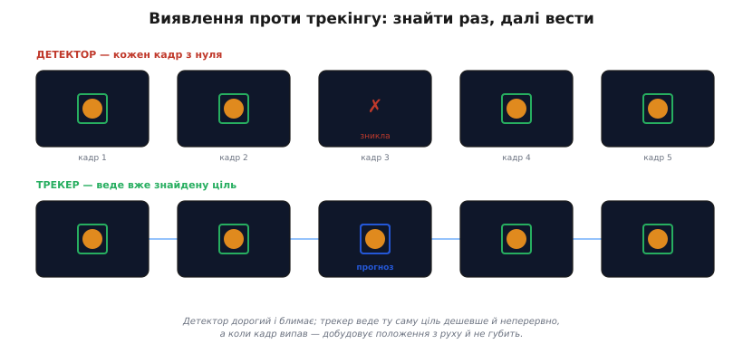
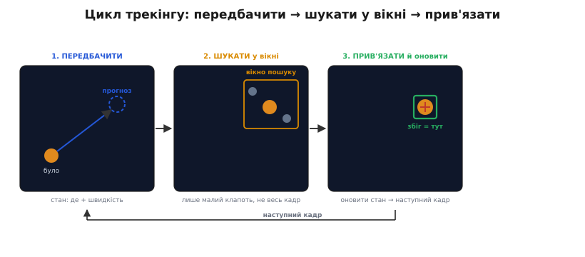
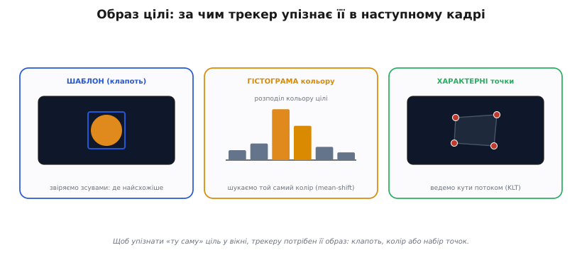
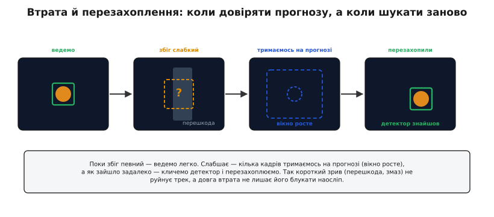

# Трекінг

[Виявлення](topic:sf-visual/object-detection) відповідає на питання «де ціль **у цьому кадрі**» — і відповідає щоразу заново, ніби бачить світ уперше. Але відео — це не купа незалежних знімків, а та сама сцена, що тече в часі: машина, яку ми бачили мить тому, нікуди не зникла, вона лише трохи зсунулась. Гріх щокадру шукати її з нуля, коли ми вже знаємо, **де вона щойно була**. Саме на цьому стоїть **трекінг** (англ. *tracking*, від *track* — слід, стежити по сліду): не шукати ціль наново, а **вести** вже знайдену з кадру в кадр, тримаючи її «особистість» тією самою.

Різниця тонша, ніж «дешевше». Детектор бачить лише поточний кадр, тож для нього кожна машина — просто «машина»: він не знає, чи це та сама, що й секунду тому, чи вже інша. Трекер натомість тримає **тяглість**: ось ця рамка — об'єкт №7, той самий, що й тридцять кадрів тому, з власною історією руху. Ця тяглість і робить можливим усе наступне — порахувати, скільки машин проїхало, утримати приціл на одній цілі, передбачити, куди вона зверне.

### Виявлення проти трекінгу: знайти раз, далі вести

Запускати важкий детектор на кожному кадрі — марнотратство, і не лише через ціну. Детекторна рамка ще й **блимає**: на одному кадрі вона є, на наступному ціль на мить сховалась за стовпом чи кадр змазався в русі — і рамки нема, об'єкт «зник», а потім «з'явився» вже як новий, без зв'язку з попереднім. Для лічби та наведення це катастрофа: один об'єкт розсипається на десяток коротких появ.


*Детектор працює щокадру з нуля: дорого, і коли кадр невдалий, рамка зникає (третій кадр). Трекер веде ту саму ціль — дешевше, неперервно, з єдиною «особистістю»; а коли збіг на мить випав, добудовує положення з руху й не губить. На практиці їх поєднують: важкий детектор пускають зрідка, а між його спрацюваннями ціль веде легкий трекер.*

Звідси й типова зв'язка: детектор — **зрідка**, щоб час від часу свіжо знаходити цілі (і нові, що щойно ввійшли в кадр), а трекер — **щокадру**, бо він легкий і гладкий. Детектор каже «ось де всі цілі зараз», трекер підхоплює кожну й веде далі сам, аж до наступної звірки. Так система і дешева, і неперервна.

> 🔧 **Навіщо це.** На дроні чи камері відеоспостереження бюджет обчислень крихітний, а кадри йдуть по 30 на секунду. Гнати нейромережу-детектор на кожному з них борт не потягне — він захлинеться й петля керування почне запізнюватися. Лови ціль детектором, скажімо, раз на пів секунди, а проміжні кадри веди легким трекером: навантаження падає вдесятеро, рамка перестає блимати, а лічба й наведення дістають стабільний об'єкт, а не рій коротких спалахів.

### Цикл трекінгу: передбачити, шукати у вікні, прив'язати

Як саме трекер «веде» ціль? Ключ у тім, що він тримає не лише «де ціль зараз», а її **стан**: положення плюс **швидкість** (а часом і розмір та його зміну). Маючи швидкість, він уміє головне — **передбачити**, де ціль опиниться на наступному кадрі. А це міняє все: замість обшукувати весь кадр, трекер дивиться лише в **маленьке вікно** навколо прогнозу.


*Цикл одного кроку. Зі стану (де + швидкість) трекер будує прогноз наступного положення. Шукає ціль лише у малому вікні навколо прогнозу — не в усьому кадрі. Серед кандидатів у вікні прив'язує найсхожіший і оновлює ним стан, який живить прогноз для наступного кадру. Так трек крутиться по колу: передбачив → пошукав → прив'язав → оновив.*

Розкладемо коло на чотири кроки, і стане видно, чому воно таке дешеве.

**Передбачити.** Об'єкт, що рухався вправо зі сталою швидкістю, на наступному кадрі майже напевно буде трохи правіше. Просте правило `нове ≈ старе + швидкість × Δt` дає прогноз — здогад, де шукати. Він не мусить бути ідеальним, лише приблизним.

**Шукати у вікні.** Навколо прогнозу окреслюють **область пошуку** (англ. *region of interest*, ROI — «область інтересу») — невеликий клапоть кадру. Усю важку роботу — звіряння образу цілі — роблять лише тут. Це і є джерело дешевизни: трекер обробляє кілька тисяч пікселів замість кількох мільйонів.

**Прив'язати.** У вікні може бути кілька кандидатів. Трекер обирає найсхожіший на ціль і [**прив'язує** його до треку](topic:sf-visual/measurement-to-track-association) (англ. *data association* — зв'язування даних). Коли цілей кілька, ця прив'язка стає окремою задачею: не переплутати, щоб об'єкт №7 не «перестрибнув» на сусідній об'єкт №8, який підійшов близько. Як зшити багато треків і багато детекцій у робочому коді — в окремій статті [Алгоритм трекінгу об'єктів SORT](topic:sf-visual/sort-tracking-algorithm).

**Оновити.** Прив'язаний збіг уточнює стан: нове положення, перерахована швидкість. Оновлений стан живить прогноз для наступного кадру — і коло замикається.

Чим ближчий прогноз до правди, тим менше вікно, тим дешевший і надійніший пошук. Тому якість передбачення — серце трекера.

### Образ цілі: за чим трекер упізнає ту саму ціль

У вікні треба ще **впізнати** ціль серед іншого. Для цього трекер тримає її **образ** — компактний опис того, як ціль виглядає, який можна швидко звірити з кожним місцем у вікні. Образ буває трьох ґатунків, від найгрубшого до найхитрішого.


*Щоб упізнати «ту саму» ціль у вікні, трекеру потрібен її образ. Шаблон — збережений клапоть зображення, який ковзають по вікну й шукають, де найсхожіше. Гістограма кольору описує ціль розподілом її тонів — і трекер сунеться туди, де цей колір густіший (так працює mean-shift). Характерні точки — кути й плями об'єкта, які ведуть від кадру до кадру оптичним потоком (метод KLT).*

**Шаблон** — найпрямолінійніший: запам'ятати клапоть зображення з ціллю і на наступному кадрі ковзати ним по вікну, шукаючи, де картинка найсхожіша. Працює, поки ціль не дуже міняє вигляд; щойно вона повернулась чи наблизилась — старий клапоть перестає пасувати.

**Гістограма кольору** грубша, зате витриваліша. Замість точної картинки ціль описують **розподілом її кольорів**: «здебільшого помаранчева з краплею чорного». Тоді в кадрі шукають місце, де цього кольору найгустіше, і посувають вікно туди — цей [зсув до середнього](topic:sf-ml/mean-shift) (англ. *mean-shift*) у бік густішого кольору й повторюють, аж доки вікно не сяде на пляму. Метод стійкий до поворотів і часткового затулення (колір ціль не міняє, навіть якщо її видно наполовину), але плутається, коли поряд є щось такого ж відтінку.

**Характерні точки** — найточніший образ. На цілі знаходять кілька **прикметних місць** — кутів, плям, контрастних вузлів, які легко впізнати, — і ведуть кожне окремо, дивлячись, куди змістилися сусідні пікселі (так званий [оптичний потік](topic:sf-visual/optical-flow)). Жменя таких точок переживає і поворот, і зміну розміру: навіть якщо частину втрачено, решта тримає ціль.

> 🔧 **Навіщо це.** Образ добирай під ціль, а не «найкращий узагалі». Літієш за яскравим повітряним змієм на тлі неба — бери колір: він дешевий і не боїться, що змій крутиться. Ведеш текстуровану мітку чи будівлю — бери характерні точки, вони дадуть і зсув, і поворот. Шаблон лиши на короткі епізоди зі сталим виглядом цілі. Помилка з образом коштує дорого: трекер тихо «з'їде» на схожий фон і поведе тебе не туди, ще й не повідомивши, що загубився.

### Передбачення, що переживає сліпий кадр: фільтр Калмана

Просте `положення + швидкість` уже непогане, але хибке з двох боків: детекції **зашумлені** (рамка дрижить на пікселі-два навіть на нерухомій цілі), а на сліпому кадрі прогнозу взагалі нема чим уточнити. Тут у пригоді стає [фільтр Калмана](topic:com-signal/kalman-filter) — той самий апарат, що зливає передбачення з виміром у спільну оцінку, важачи кожне за його певністю.

Для бокс-трекера фільтр веде восьмивимірний стан — рамку (центр і розмір) плюс їхні швидкості; як саме виглядають його матриці F, H, P, Q, R і як підбирати шуми, розписано в [математиці стану бокс-трекера](topic:sf-visual/tracking/math-kf-tracking-state.md).

Для трекера це дає дві коштовні речі. По-перше, він **згладжує** трек: замість тремкої детекторної рамки виходить плавна траєкторія, бо фільтр не вірить кожному зашумленому виміру беззастережно. По-друге, і головне, — він **тримає місток через прогалину**. Коли детекція на кадрі випала (ціль за стовпом, кадр змазався), фільтр просто **передбачає** наступне положення зі своєї моделі руху й веде ціль наосліп: не ідеально, але достатньо, щоб не загубити її на ці кілька кадрів. А щойно ціль виринула — звіряється з нею знов. Саме це й малює пунктирна рамка «передбачив» на схемі виявлення проти трекінгу: ланка, де трекер веде ціль, якої цієї миті не бачить.

> 🔧 **Навіщо це.** Дрон веде машину, та заїхала під міст — на пів секунди її не видно. Без передбачення трек умер би, і камера сіпнулася б шукати наосліп. Фільтр Калмана натомість веде ціль із моделі руху («їхала прямо — їде прямо»), і коли машина виїжджає з-під мосту, вона вже там, де трекер її чекає. Той самий фільтр гасить піксельне дрижання рамки, тож наведення на цілі не трясеться — а спокійний сигнал критичний, бо далі він піде в регулятор.

### Втрата й перезахоплення: коли довіряти прогнозу, а коли шукати заново

Передбачення рятує **короткий** зрив, та якщо тягти його надто довго, трек відірветься від реальності й поведе порожнечу. Тому в трекера мусить бути чесна відповідь на питання «а чи я ще бачу ціль?» — і план на випадок «ні».


*Поки збіг певний — ведемо легко. Коли він слабшає (ціль за перешкодою), трек кілька кадрів тримається на чистому прогнозі, а вікно пошуку росте, бо невпевненість у положенні більшає. Як зайшло задалеко — кличемо детектор і перезахоплюємо ціль наново. Так короткий зрив не руйнує трек, а довга втрата не лишає його блукати наосліп.*

Міру довіри дає **сила збігу**: наскільки добре найкращий кандидат у вікні пасує до образу цілі. Поки вона висока — все гаразд, ведемо. Коли падає, трек переходить у стан «не певен»: ще тримається на самому прогнозі, але **вікно пошуку росте** — що довше ми не бачили цілі, то більша невизначеність, де вона, тож і шукати треба ширше. Це природний наслідок фільтра: без свіжого виміру його невпевненість лише наростає кадр за кадром.

Якщо за кілька кадрів ціль так і не знайшлась, тримати прогноз далі шкідливо — він уже вигадка. Тоді трек **здається** й кличе на поміч **детектор**: хай той свіжо обшукає весь кадр і знайде ціль заново. Це **перезахоплення** (англ. *re-detection*) — той самий важкий детектор, що ми пускали зрідка, тут рятує загублений трек. Коли цілей багато, перезахоплену ціль ще треба **впізнати** — та сама вона чи нова? — і тут знов виручає образ: якщо колір і вигляд збігаються з тим, що ми вели, трек продовжують під тим самим номером.

Перевірити, чи новий бокс — та сама ціль, що й передбачений, допомагає проста міра перекриття рамок: **IoU** (англ. *intersection over union* — «перетин до об'єднання»): площу спільної частини двох прямокутників ділять на площу їхнього об'єднання. Один — рамки збігаються; нуль — не торкаються. Висока IoU між прогнозом і свіжою детекцією означає «це вона» — трек можна впевнено продовжити.

### Приклад: вікно пошуку та звіряння через IoU

Зберемо два кроки разом у коді прошивки: з поточного стану побудуємо вікно пошуку навколо прогнозу, а свіжу детекцію приймемо лише тоді, коли вона достатньо перекриває прогноз за IoU. Це кістяк прив'язки в реальному трекері.

**Умова.** Об'єкт №7 на минулому кадрі був у точці (300, 200) і рухався зі швидкістю (12, −4) пікселів за кадр; рамка цілі — 40×30. Детектор на новому кадрі дав бокс із центром (313, 195). Чи це той самий об'єкт?

```c
typedef struct { float x, y, w, h; } Rect;   // центр (x,y) і розмір

// перекриття двох рамок: перетин до об'єднання (0..1)
static float iou(Rect a, Rect b) {
    float ax0 = a.x - a.w/2, ax1 = a.x + a.w/2;   // ліва/права a
    float ay0 = a.y - a.h/2, ay1 = a.y + a.h/2;   // верх/низ a
    float bx0 = b.x - b.w/2, bx1 = b.x + b.w/2;
    float by0 = b.y - b.h/2, by1 = b.y + b.h/2;

    float ix = fmaxf(0.0f, fminf(ax1,bx1) - fmaxf(ax0,bx0));  // ширина перетину
    float iy = fmaxf(0.0f, fminf(ay1,by1) - fmaxf(ay0,by0));  // висота перетину
    float inter = ix * iy;
    float uni   = a.w*a.h + b.w*b.h - inter;       // об'єднання = сума − перетин
    return uni > 0.0f ? inter / uni : 0.0f;
}

// прийняти детекцію det у трек, якщо вона добре лягає на прогноз
bool associate(Rect prev, float vx, float vy, Rect det, float dt) {
    Rect pred = prev;
    pred.x += vx * dt;          // прогноз: положення + швидкість × Δt
    pred.y += vy * dt;
    return iou(pred, det) >= 0.3f;   // поріг перекриття — типово 0.3
}
```

Порахуймо прогноз і перекриття вручну:

```
прогноз центру:  x = 300 + 12·1 = 312
                 y = 200 + (−4)·1 = 196
прогноз рамки:   центр (312, 196), 40×30  →  x:[292..332]  y:[181..211]
детекція:        центр (313, 195), 40×30  →  x:[293..333]  y:[180..210]

перетин:  ширина = min(332,333) − max(292,293) = 332 − 293 = 39
          висота = min(211,210) − max(181,180) = 210 − 181 = 29
          площа  = 39 × 29 = 1131
об'єднання: 40·30 + 40·30 − 1131 = 1200 + 1200 − 1131 = 1269
IoU = 1131 / 1269 ≈ 0.89
```

IoU ≈ 0.89 — рамки майже збігаються, отже це той самий об'єкт №7: прив'язуємо детекцію до треку й оновлюємо ним стан. Якби детекція лягла далеко (скажімо, IoU 0.05), трек її б не прийняв — це інша ціль або хибне спрацювання, і об'єкт №7 лишився б на чистому прогнозі ще на кадр.

> 📜 **Звідки взялося ведення цілі.** Трекінг старший за нейромережі: ще 1981 року Брюс Лукас і Такео Канаде дали спосіб порахувати [оптичний потік](topic:sf-visual/optical-flow) (вести точки за рухом яскравості), а 1998-го Ґері Бредскі в Intel навчився вести **пляму** за кольором (CAMShift). Сучасні трекери на кшталт SORT і DeepSORT не скасували цих ідей, а вбудували їх у звичний цикл «передбачив → пошукав → прив'язав». Дві гілки, суперечка про «першість» і злиття в трекінг через детекцію — у [історії трекінгу](topic:sf-visual/tracking/hist-tracking-history.md).

### Куди йде трек

Вести ціль — це не самоціль; трек майже завжди годує щось далі. Найчастіше — **керування**: щоб апарат сам тримався на цілі, її піксельне положення з трека перетворюють на **кут** «наскільки ціль збоку від осі камери» (через поле зору й [калібрування](topic:sf-visual/image-as-data) камери), а цей кут подають як похибку в [регулятор PID](topic:com-signal/discrete-pid) — він і доверне дрон, підвіс чи камеру, доки ціль не стане в центр. У цій зв'язці трекер несе подвійну вагу: він дає **гладкий** сигнал (PID не любить тремкого входу) і **неперервний** (петля не повинна сліпнути на кожному пропущеному детектором кадрі). Тут варто пам'ятати про **затримку**: зір повільний, тож трек має не лише показувати, де ціль є, а й — через передбачення — де вона **буде**, поки сигнал дійде до моторів. Але це вже окрема історія про замикання петлі; для самого трекінгу досить знати, що його продукт — не картинка, а **надійний, гладкий, неперервний слід цілі в часі**.

### Підсумок теми

Трекінг веде вже знайдену ціль крізь кадри замість шукати її щоразу наново — і цим дає те, чого детектор сам не вміє: **тяглість**, єдину «особистість» об'єкта в часі. Серце трекера — короткий цикл: із стану (положення + швидкість) **передбачити** наступне положення, **пошукати** ціль лише в малому вікні навколо прогнозу, **прив'язати** найсхожіший кандидат і **оновити** ним стан. Упізнавати ціль допомагає її **образ** — клапоть-шаблон, гістограма кольору або характерні точки, кожен під свій випадок. **Фільтр Калмана** робить передбачення стійким: згладжує тремку рамку й тримає місток через сліпі кадри. А коли збіг слабшає, трек чесно нарощує вікно й тримається на прогнозі, а як ціль загубилась надовго — кличе детектор на **перезахоплення**, звіряючи рамки через **IoU**. Усе це разом перетворює рій блимких детекцій на гладкий неперервний слід — саме той, що потрібен, аби порахувати, наглядати чи навести апарат на ціль.
