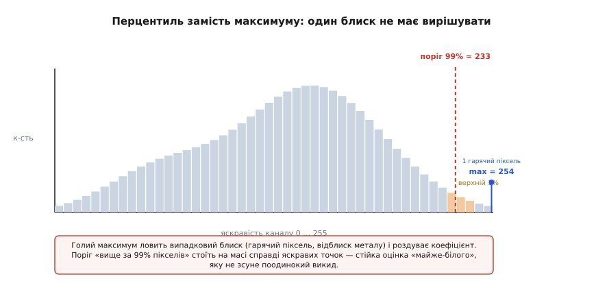
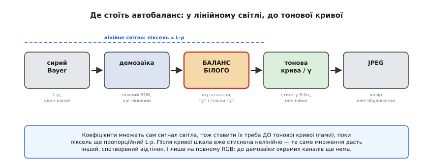

# ⚙️ Автобаланс білого: робочий C для контролера камери

**Задача.** На вході — повнокольоровий кадр `RGB img[H][W]`, уже зібраний з мозаїки, але з відтінком лампи: сцену знімали під теплим чи холодним світлом, і кадр «поплив» у бік цього світла. Треба самостійно, **без сірої картки й без підказки від людини**, оцінити три канальні коефіцієнти `g_R, g_G, g_B` і застосувати їх так, щоб нейтральне (сіре, біле) знову давало рівні канали. Усе це — на контролері камери, де часто **немає апаратної рухомої коми** (FPU), пам'яті кілька десятків кілобайтів, а часу на кадр — одиниці мілісекунд. Отже, оцінка мусить бути дешевою (один-два проходи по кадру), стійкою до сміття (відблиски, гарячі пікселі, пересвіт) і рахуватися в цілих числах.

**Ідея.** Коефіцієнтів у кадрі прямо не видно — сенсор дає лише добуток `освітлення × відбивність`, а розділити його на два множники без додаткового припущення неможливо. Тож ми беремо **два** дешевих припущення, кожне з яких дає свою оцінку освітлення, і **поєднуємо** їх, бо вони ламаються на різних сценах:

- **сірий світ** — середній колір різнобарвної сцени сірий; звідси коефіцієнти, що рівняють середні каналів. Дешево, один прохід, але падає на одноколірних кадрах (зелене поле, синє небо на весь кадр);
- **біла пляма** — найяскравіше в кадрі біле; звідси коефіцієнти, що тягнуть «майже-пік» кожного каналу до 255. Не потребує різнобарв'я, але тримається на найяскравіших пікселях, тож замість голого максимуму беремо **перцентиль** — поріг, вище за який лежить верхній ~1% пікселів.

Обидві оцінки дають ті самі три числа — різниться лише спосіб їх дістати. Ми зважено їх усереднюємо, застосовуємо до кожного пікселя й **обрізаємо переповнення** (clamp до 255), бо підсилення каналу легко вилітає за байт. А щоб усе жило без FPU, коефіцієнти тримаємо у **фіксованій комі Q8.8**: ціле число, де старші 8 біт — цілу частину, молодші 8 — дробову, тобто справжній коефіцієнт `× 256`.

Гола ідея сірого світу як оцінювача освітлення сходить ще до Еванса (1946), а строго як алгоритм її сформулював Ґершон Бухсбаум 1980 року (*усталено*); біла пляма — частина ретинексної лінії Едвіна Ленда. Нижче — не переказ теорії, а те, що реально складно: як звести обидві до цілочислового коду, який не збреше на краю.

## Формат даних і чому саме Q8.8

Спочатку домовимось про піксель і про число. Піксель — три байти:

```c
#include <stdint.h>
#include <string.h>

typedef struct { uint8_t r, g, b; } RGB;
```

Тепер коефіцієнт. У прикладах з теми виходили значення на кшталт `g_B = 1.923` або `g_R = 0.714` — дробові. На контролері без FPU множення `double` або емулюється сотнями тактів, або недоступне взагалі. Вихід — **фіксована кома**: домовляємось, що ціле число `q` насправді означає `q / 256`. Тоді `1.0` — це `256`, `1.923` — це `round(1.923 × 256) = 492`, `0.714` — це `183`. Формат називають **Q8.8**: вісім біт на цілу частину, вісім на дробову.

> 🔧 **Навіщо це.** Уся арифметика балансу стає цілочисловою. Помножити піксель на коефіцієнт — це `(px * q) >> 8`: одне цілочислове множення й зсув, які будь-яке ядро робить за такт-два. Ділення (найдорожча операція) лишається тільки на етапі **оцінки** коефіцієнтів — його там кілька штук на весь кадр, а не на кожен піксель. Розкладка, чому Q-формат саме так тримає точність і де він переповнюється, розібрана окремо: щоб не проґавити переповнення проміжного добутку, тримай його ширшим за операнди. [Фіксована кома: цілі числа з уявною комою, вибір позиції коми, переповнення](root:hw-arch/fixed-point).

Один тонкий момент одразу. Множимо `uint8_t px` (до 255) на `uint16_t q` (до кількох сотень). Добуток `255 × 492 = 125460` — це вже далеко за `uint16_t` (65535). Тому проміжок **обов'язково** тримаємо в `uint32_t`, інакше дістанемо тихе обгортання й кольорові плями там, де їх нема. Ця пастка — головна причина, чому фіксовану кому «не так» реалізують.

```c
#define Q 8                     // дробових біт: коефіцієнт у форматі Q8.8
#define ONE (1 << Q)            // 256 == коефіцієнт 1.0

// Помножити байт-канал на коефіцієнт q (Q8.8) з насиченням до 255.
static inline uint8_t apply_gain(uint8_t v, uint16_t q) {
    uint32_t p = (uint32_t)v * q;      // ШИРШЕ за операнди: до 255*65535 влазить у 32 біти
    p >>= Q;                           // назад із Q8.8 у цілі
    return (p > 255u) ? 255u : (uint8_t)p;   // clamp: переповнення каналу → 255
}
```

Це серце застосування, і в ньому вже сидять два з чотирьох головних рішень: **широкий проміжок** проти обгортання й **насичення** (clamp) проти переповнення каналу. Тепер — звідки беруться самі `q`.

## Оцінювач сірого світу

Сірий світ каже: усередни кадр, і якщо середнє не сіре — то винне світло, зроби його сірим. Один прохід накопичує суми трьох каналів; тоді коефіцієнти рівняють ці суми до опорного каналу. Опорним беремо зелений — він і найближчий до яскравості, і найгустіший у більшості сенсорів, тож найменше шумить.

Ключове рішення тут — **де взяти дробову точність без FPU**. Коефіцієнт `g_R = sumG / sumR` — дробовий, а ділити цілі не дасть дробу. Трюк той самий, що й у форматі: **спершу помнож на 256, тоді ділити**. Тоді `(sumG << 8) / sumR` дає вже коефіцієнт у Q8.8 як ціле — саме той `uint16_t q`, що потрібен `apply_gain`.

```c
// Оцінка коефіцієнтів методом «сірий світ».
// Пише в gR,gG,gB коефіцієнти у форматі Q8.8 (256 == 1.0). Опорний канал — G.
void estimate_gray_world(const RGB *img, int n,
                         uint16_t *gR, uint16_t *gG, uint16_t *gB) {
    uint64_t sumR = 0, sumG = 0, sumB = 0;   // 64 біти: сума мільйонів байтів переповнить 32
    for (int i = 0; i < n; i++) {
        sumR += img[i].r;
        sumG += img[i].g;
        sumB += img[i].b;
    }
    if (sumR == 0) sumR = 1;                  // захист від ділення на нуль (чорний канал)
    if (sumB == 0) sumB = 1;
    if (sumG == 0) sumG = 1;

    *gG = ONE;                                // зелений — опорний, коефіцієнт 1.0
    *gR = (uint16_t)((sumG << Q) / sumR);     // <<Q ПЕРЕД діленням → результат уже в Q8.8
    *gB = (uint16_t)((sumG << Q) / sumB);
}
```

Три речі варто побачити. По-перше, суми — `uint64_t`: кадр на 2 мегапікселі дає до `2·10⁶ × 255 ≈ 5·10⁸` на канал, що вже близько до межі `uint32_t` (4.3·10⁹) і переповнить її на більших кадрах — 64 біти знімають питання назавжди. По-друге, `sumR == 0` — не параноя: канал може бути справді чорним (нічний кадр, закритий об'єктив), і ділення на нуль на контролері — це або виняток, або сміття. По-третє, `(sumG << Q)` теж мусить бути широким: `sumG` уже 64-бітне, тож зсув безпечний; якби `sumG` було 32-бітним, `<< 8` могло б зрізати старші біти.

**Приклад: біла стіна під лампою розжарення.** Хай усереднення дало `sumR ∝ 210`, `sumG ∝ 150`, `sumB ∝ 78` на піксель (той самий жовтий перекіс, що й у темі). Тоді:

```text
gR = (150 << 8) / 210 = 38400 / 210 = 182   (Q8.8)  →  182/256 = 0.711
gG = 256                                     (Q8.8)  →  1.000
gB = (150 << 8) / 78  = 38400 / 78  = 492   (Q8.8)  →  492/256 = 1.922

перевірка на середньому пікселі (через apply_gain):
R' = (210 * 182) >> 8 = 38220 >> 8 = 149
G' = (150 * 256) >> 8 = 38400 >> 8 = 150
B' = (78  * 492) >> 8 = 38376 >> 8 = 149     → R'≈G'≈B'≈150, нейтраль
```

Розбіжність `149` проти `150` — це та сама втрата молодшого біта від округлення вниз при зсуві; на око вона непомітна, а прибрати її можна, додавши половину дільника (`+ (1<<(Q-1))`) перед `>> Q`. Метод коштує **один прохід** плюс два ділення на весь кадр — дешевше нікуди.

## Оцінювач білої плями через перцентиль

Тепер друга оцінка. Наївний білий-пляма шукає `max` кожного каналу й тягне його до 255. Пастка вже названа в темі: максимум тримається на **єдиному** пікселі, а один піксель бреше — гарячий піксель сенсора, лискучий гвинт, пересвічена лампа в кадрі задають максимум випадковим сміттям. Тож беремо не пік, а **перцентиль**: значення, вище за яке лежить лише верхній ~1% пікселів каналу. Це відкидає поодинокі викиди й лишає стійку оцінку «дуже яскравого».

Як знайти перцентиль дешево? Сортувати мільйони пікселів — задорого. Але канал — це байт, лише 256 можливих значень, тож будуємо **гістограму**: 256 лічильників, один прохід. Тоді йдемо від найяскравішого біна (255) вниз, накопичуючи кількість, доки не набереться 1% усіх пікселів — на якому біні набралось, той і є поріг 99-го перцентиля. Гістограма перетворює «знайти перцентиль» на один прохід підрахунку плюс дешевий обхід 256 комірок.


*Чому перцентиль, а не максимум. Маса пікселів каналу лежить під «горбом»; голий максимум (синя мітка, 254) — це один випадковий блиск далеко праворуч, і він роздув би коефіцієнт. Поріг «вище за 99% пікселів» (червона риска, ≈233) стоїть на масі справді яскравих точок — стійка оцінка «майже-білого», яку не зсуне поодинокий викид.*

Гістограма — сама по собі корисний інструмент, і той самий обхід дає ще й [еквалізацію та пороги](root:sf-visual/histogram); нам від неї треба лише верхній хвіст.

```c
// Поріг 99-го перцентиля одного каналу через гістограму 256 комірок.
// hist[v] — скільки пікселів мали значення v. Повертає найменше t, вище за яке
// лежить не більше ~1% пікселів (тобто «майже-максимум», стійкий до викидів).
static uint8_t percentile_top(const uint32_t hist[256], int total) {
    uint32_t cut = (uint32_t)total / 100;   // 1% пікселів дозволяємо відкинути як викиди
    uint32_t acc = 0;
    for (int v = 255; v >= 0; v--) {
        acc += hist[v];
        if (acc >= cut)
            return (uint8_t)v;               // на цьому біні набрався верхній 1%
    }
    return 0;                                // канал порожній — не станеться при total>0
}

// Оцінка коефіцієнтів методом «біла пляма» на перцентилі (Q8.8, опорний G).
void estimate_white_patch(const RGB *img, int n,
                          uint16_t *gR, uint16_t *gG, uint16_t *gB) {
    uint32_t hR[256] = {0}, hG[256] = {0}, hB[256] = {0};
    for (int i = 0; i < n; i++) {            // один прохід — три гістограми
        hR[img[i].r]++;
        hG[img[i].g]++;
        hB[img[i].b]++;
    }
    uint8_t pR = percentile_top(hR, n);      // «майже-пік» кожного каналу
    uint8_t pG = percentile_top(hG, n);
    uint8_t pB = percentile_top(hB, n);
    if (pR == 0) pR = 1;                      // захист від ділення на нуль
    if (pG == 0) pG = 1;
    if (pB == 0) pB = 1;

    // Рівняємо «майже-пік» кожного каналу до опорного pG (а не всі до 255):
    // так канали лишаються між собою збалансовані, а не роздуті поодинці.
    *gG = ONE;
    *gR = (uint16_t)(((uint32_t)pG << Q) / pR);
    *gB = (uint16_t)(((uint32_t)pG << Q) / pB);
}
```

Тут є свідоме рішення, варте пояснення. Класична біла пляма тягне кожен канал **до 255** окремо (`g = 255/pX`). Але це заразом і **розтягує яскравість** — робить кадр світлішим, змішуючи баланс білого з експозицією. А наша задача — тільки колір: прибрати відтінок, не чіпаючи загальну яскравість. Тому ми рівняємо «майже-піки» каналів **між собою**, до опорного `pG`, точнісінько як у сірому світі. Виходить чистий баланс кольору: якщо канали й так рівні, коефіцієнти будуть `1.0`, і кадр не посвітлішає. Якщо ж потрібне саме розтягнення до білого — заміни `pG` на `255` у чисельнику, і матимеш класичний варіант.

## Поєднання двох оцінок

Тепер найцікавіше — навіщо взагалі дві. Вони ламаються на **різних** сценах, тому підпирають одна одну. Але сліпо усереднити їх не можна: на одноколірній сцені сірий світ дає завідомо хибну оцінку, і тягти її в суміш — псувати результат. Тож поєднання має бути **зваженим**, і вага — не константа, а функція **довіри** до кожної оцінки в цьому конкретному кадрі.

Проста й дієва міра довіри до сірого світу — **колірне розмаїття** сцени. Якщо середні каналів і так майже рівні (кадр близький до сірого) — сірому світу вірити можна, він нічого не зіпсує. Якщо ж один канал сильно домінує над іншими (велике червоне тло, зелене поле) — сірий світ майже напевно бреше, і його вагу треба зрізати. Формалізуємо: беремо максимальне відносне відхилення середніх від їхнього спільного середнього; що воно менше, то вища довіра.

```c
// Зважене поєднання двох оцінок у форматі Q8.8.
// wGW — вага сірого світу в Q8.8 (0..256); вага білої плями = 256 - wGW.
static uint16_t blend(uint16_t a, uint16_t b, uint16_t wGW) {
    uint16_t wWP = ONE - wGW;
    uint32_t mix = (uint32_t)a * wGW + (uint32_t)b * wWP;
    return (uint16_t)(mix >> Q);              // назад у Q8.8
}

// Оцінити коефіцієнти обома методами й поєднати за довірою до сірого світу.
void estimate_awb(const RGB *img, int n,
                  uint16_t *gR, uint16_t *gG, uint16_t *gB) {
    uint16_t gwR, gwG, gwB, wpR, wpG, wpB;
    estimate_gray_world(img, n, &gwR, &gwG, &gwB);
    estimate_white_patch(img, n, &wpR, &wpG, &wpB);

    // Довіра до сірого світу = наскільки сцена різнобарвна.
    // Коефіцієнти сірого світу самі кажуть про перекіс: якщо gwR і gwB далеко
    // від 1.0 (ONE), сцена сильно кольорова → сірому світу віри менше.
    uint32_t devR = (gwR > ONE) ? (gwR - ONE) : (ONE - gwR);
    uint32_t devB = (gwB > ONE) ? (gwB - ONE) : (ONE - gwB);
    uint32_t dev  = (devR > devB) ? devR : devB;   // найгірший перекіс

    // Перекіс до ~половини (dev≈128 у Q8.8) уже вважаємо «дуже кольоровою» сценою.
    // wGW спадає від ONE (сіра сцена) до ~ONE/4 (сильний перекіс).
    uint16_t wGW;
    if (dev >= 128) wGW = ONE / 4;
    else            wGW = ONE - (uint16_t)((dev * (ONE - ONE / 4)) / 128);

    *gR = blend(gwR, wpR, wGW);
    *gG = ONE;                                 // опорний канал завжди 1.0
    *gB = blend(gwB, wpB, wGW);
}
```

Логіка ваги проста, але несе всю стійкість схеми. Коли сцена справді сіра (`dev` малий), `wGW ≈ ONE` — вирішує сірий світ, і це правильно, бо на різнобарвній сцені він точний. Коли один колір домінує (`dev` великий), `wGW` падає до `ONE/4` — вирішує біла пляма, яка одноколірності не боїться. Поріг `128` і мінімум `ONE/4` — інженерні числа, які підбирають під конкретний сенсор; головне тут не точні значення, а **принцип**: вагу дає не константа, а виміряна довіра до припущення в цьому кадрі. Реальні автобаланси додають до цього ще й відкидання пересвічених і надто насичених ділянок перед усередненням — про це в пастках.

## Застосування до кадру

Оцінка дала три `q`. Лишилось помножити кожен піксель — те, заради чого й затівалась фіксована кома. Тут `apply_gain` уже все робить: широкий проміжок, зсув, clamp.

```c
// Застосувати коефіцієнти до всього кадру на місці (in-place).
void apply_awb(RGB *img, int n, uint16_t gR, uint16_t gG, uint16_t gB) {
    for (int i = 0; i < n; i++) {
        img[i].r = apply_gain(img[i].r, gR);
        img[i].g = apply_gain(img[i].g, gG);
        img[i].b = apply_gain(img[i].b, gB);
    }
}

// Повний автобаланс: оцінити й застосувати.
void auto_white_balance(RGB *img, int H, int W) {
    int n = H * W;
    uint16_t gR, gG, gB;
    estimate_awb(img, n, &gR, &gG, &gB);
    apply_awb(img, n, gR, gG, gB);
}
```

Якщо опорний канал справді опорний (`gG == ONE`), його множення `(v * 256) >> 8 == v` нічого не змінює — але лишати виклик `apply_gain(img[i].g, gG)` варто задля однаковості коду; компілятор із оптимізацією сам його спростить. Хочеш зекономити такти вручну — обгорни зелений `if (gG != ONE)`.

**Приклад повного проходу на трьох пікселях.** Хай оцінка дала `gR=182, gG=256, gB=492` (Q8.8), і в кадрі є яскраво-синій піксель `(40, 60, 250)`:

```text
R' = (40  * 182) >> 8 = 7280   >> 8 = 28
G' = (60  * 256) >> 8 = 15360  >> 8 = 60
B' = (250 * 492) >> 8 = 123000 >> 8 = 480 → clamp → 255

піксель (40,60,250) → (28,60,255)
```

Ось де clamp себе показує: синій пішов у `480`, далеко за байт, і без насичення `(uint8_t)480 == 224` дало б **темніший** синій замість найяскравішого — грубу кольорову ману. Насичення чесно каже «яскравіше нікуди» й лишає `255`. Це не помилка округлення, а фізична межа 8-бітної шкали, і поводитись із нею треба саме затисканням, ніколи не обгортанням.

## Складність і пам'ять

Порахуймо чесно, бо на контролері кожен прохід коштує.

- **Оцінка сірого світу** — один прохід (`3n` додавань) + 2 ділення. `O(n)` за часом, `O(1)` за пам'яттю.
- **Оцінка білої плями** — один прохід на три гістограми (`3n` інкрементів) + обхід `3 × 256` комірок + 2 ділення. `O(n)` за часом; пам'ять — три масиви по 256 `uint32_t`, тобто **3 КБ**. Для контролера з десятками кілобайтів це відчутно, але посильно; хочеш економити — рахуй гістограми по одному каналу по черзі (1 КБ), ціною трьох проходів замість одного.
- **Поєднання** — кілька дій, `O(1)`.
- **Застосування** — один прохід (`3n` множень і зсувів), `O(n)`, `O(1)` пам'яті, **на місці** (без другого буфера кадру).

Разом: **три проходи** по кадру (сірий світ, гістограми, застосування — оцінки можна злити в один прохід, якщо суми й гістограми накопичувати разом) і кілька кілобайтів під гістограми. Жодного `float`, жодного `double`, жодного ділення на піксель — усе важке (ділення) винесено на етап оцінки, де його одиниці на весь кадр. Саме тому схема лягає навіть у скромний контролер камери й встигає в реальному часі.

> 🔧 **Навіщо це.** «Оцінки можна злити в один прохід» — це не дрібниця для потокової обробки. Контролер часто не тримає весь кадр у пам'яті, а обробляє його **рядок за рядком** прямо з сенсора. Тоді суми й гістограми накопичуються під час першого (потокового) проходу «безкоштовно», коефіцієнти рахуються в кінці кадру, а застосування йде вже до **наступного** кадру — класична схема «оцінив по цьому, застосував до дальшого», через яку AWB завжди трохи запізнюється й тому «доганяє» різку зміну освітлення за кілька кадрів.

## Пастки

**Одноколірна сцена валить сірий світ — і саме тому потрібна суміш.** Крупний план зеленого листя, синє небо на весь кадр, портрет на червоному тлі: середнє сцени не сіре, і сірий світ упевнено вибілює домінантний колір у сіре, вбиваючи саме той колір, що заповнив кадр. Це не крайовий випадок, а типова зйомка. Ліки — зважування за розмаїттям (вище): на такій сцені вага сірого світу падає, і вирішує біла пляма, якій одноколірність байдужа. Тримати сірий світ **сам-один** у камері — гарантована помилка на кожному другому кадрі.

**Відблиски й дзеркальні полиски валять білу пляму — тому перцентиль, а не max.** Лискучий метал, скло, мокра поверхня дають дзеркальні полиски, які **не** є білою поверхнею: це пряме відбиття джерела, часто саме кольорове (жовта лампа). Голий максимум ловить такий полиск і приймає його колір за колір освітлення — оцінка їде. Перцентиль (верхній 1%) поодинокі полиски відкидає; якщо ж полисків багато (мокрий асфальт під сонцем), додатково варто **не рахувати в гістограму пікселі, у яких хоч один канал уже на межі 255** — вони пересвічені й про колір нічого не кажуть.

**Пересвіт (clipping) — це вже втрачена інформація, і жоден коефіцієнт її не поверне.** Якщо під сильним теплим світлом червоний канал уперся в 255 ще на сенсорі, то справжнє значення (скажімо, «300») уже зрізано — і множення на коефіцієнт `< 1` дасть не «300 × 0.7 = 210», а «255 × 0.7 = 178», тобто **занижений** результат. Через це під сильним перекосом баланс білого над пересвіченими зонами систематично бреше, і білі поверхні можуть вийти кольоровими. Єдині справжні ліки — не пересвічувати на зйомці (правильна експозиція), а в коді — хоча б **не довіряти** пересвіченим пікселям при оцінці (виключати їх, як вище) і розуміти, що кадр із випаленими зонами баланс уже не врятує повністю.

**Порядок відносно демозаїки: тільки після неї.** Баланс білого множить **канали**, а до [демозаїки](root:sf-visual/bayer-demosaic) окремих каналів ще нема — є сира мозаїка, де кожен піксель несе лише одну складову. Спроба «збалансувати» сиру мозаїку помножила б сусідні пікселі на коефіцієнти різних каналів упереміш — вийшла б каша. Тож послідовність жорстка: спершу демозаїка збирає повний RGB, і лише тоді має сенс канальний коефіцієнт. (Технічно можна множити сиру мозаїку, якщо знати позицію кожного пікселя у візерунку й брати коефіцієнт за його кольором — деякі конвеєри так і роблять заради економії, — але це вже не «до демозаїки», а «узгоджено з нею».)

**Порядок відносно тонової кривої: тільки до неї, у лінійному світлі.** Це найтонша й найчастіша помилка. Коефіцієнт множить сам сигнал світла, і множення чесно скасовує перекіс освітлення лише **поки піксель пропорційний** `L·ρ` — тобто в **лінійному** просторі, ще до тонової кривої (гами). Тонова крива стискає яскравість нелінійно (світлі тони тисне сильніше за темні), і якщо застосувати коефіцієнт **після** неї, те саме множення дасть **інший, спотворений** відтінок: множник `1.9` на синьому у лінійному світлі й після гами — це дві різні поправки, і друга колір не випрямляє, а кривить. Тому баланс білого ставлять **рано** — після демозаїки, до тонової кривої й будь-якої нелінійної обробки.


*Де стоїть автобаланс. Сира мозаїка (один канал на піксель) → демозаїка збирає повний RGB, ще лінійний → БАЛАНС БІЛОГО множить канали тут і тільки тут → тонова крива/гама стискає в 8 біт нелінійно → JPEG, де колір уже вбудований. Коефіцієнти мають сенс лише в лінійній зоні (пунктир): раніше — каналів ще нема, пізніше — шкала вже нелінійна й множення кривить колір.*

**Ділення на нуль на темних кадрах.** Нічний кадр, закритий об'єктив, справді чорний канал — і `sumR` чи поріг перцентиля стають нулем. Ділення на нуль на контролері — виняток або сміття в коефіцієнті, після чого весь кадр стає різнобарвним шумом. Тому кожен дільник затискаємо в `1` перед діленням (вище в коді); краще безглуздий, але скінченний коефіцієнт, ніж збій.

**Дриґання коефіцієнтів між кадрами.** Якщо рахувати коефіцієнти щокадру наново, вони трохи стрибають від кадру до кадру (шум, рух у сцені), і у відео це видно як ледь помітне «дихання» кольору. Ліки — **згладжувати** коефіцієнти в часі: новий коефіцієнт брати не голим, а як зважене з попереднім, `g_new = (g_prev·7 + g_est) / 8` (усе в Q8.8, зсувом). Тоді баланс реагує на зміну освітлення плавно, за кілька кадрів, а не смикається. Це той самий прийом, що й експоненційне згладжування в будь-якому потоці, лише над трьома числами.

**Насичення проти обгортання — не переплутати.** І останнє, найдешевше й найгрубіше, якщо забути. Помножений канал регулярно вилітає за 255 (будь-який коефіцієнт `> 1` на яскравому пікселі). Обов'язково **насичувати** (clamp у 255), а не давати `uint8_t` тихо обгорнутись: `(uint8_t)480 == 224` перетворить найяскравіший піксель на середньо-темний, і на градієнтах з'являться рвані кольорові кільця там, де мав бути плавний перехід у білий. Один пропущений clamp — і кадр укривається артефактами; саме тому насичення зашите прямо в `apply_gain`, а не лишене «на потім».
