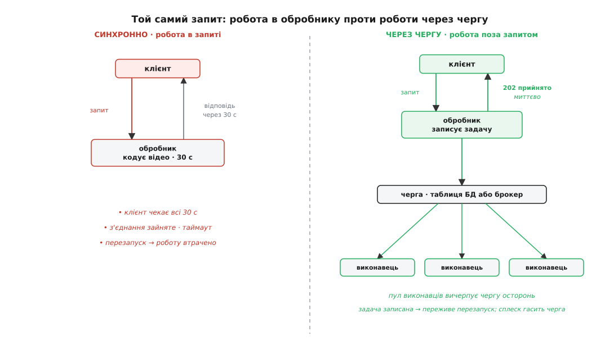
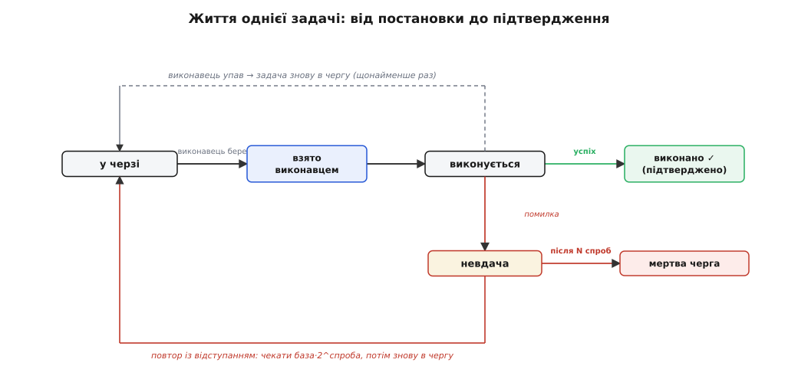

# Черга задач

<preknowlist>
- [HTTP](topic:com-protocol/http) — клієнт надсилає запит і чекає на відповідь по відкритому з'єднанні; час і кількість з'єднань обмежені таймаутом.
- [Транзакції та ACID](topic:sf-data/transactions-acid) — атомарний і довговічний запис: те, що транзакція зафіксувала, переживе аварію, а один рядок дістається рівно одному виконавцю.
</preknowlist>

Запит мусить відповідати швидко — за частки секунди. Поки він виконується, клієнт тримає відкрите з'єднання й чекає, а кожен проксі між ними веде відлік таймауту. Але робота, яку запит запускає, буває повільною за своєю природою: перекодувати завантажене відео, зібрати місячний звіт на кілька тисяч сторінок, звернутися до платіжного провайдера, що сам відповідає секунди, розіслати десять тисяч листів. Куди подіти повільну роботу, коли той, хто її замовив, не може чекати?

Найпростіше — зробити її просто в обробнику запиту. І тут вибудовується ланцюг біди. Клієнт тримає з'єднання тридцять секунд — пул з'єднань сервера заповнюється, іншим запитам немає де стати. Проксі на тридцятій секунді розриває зв'язок за таймаутом, і клієнт бачить помилку, хоча робота ще триває. А найгірше — деплой чи аварія перезапускає процес посеред роботи, і напівзроблене зникає, не лишивши й сліду, що його комусь винні. Користувач дістав помилку, а звіт так і не зібрався — або зібрався двічі, бо користувач повторив запит. Отже, робити повільну роботу в запиті — не просто повільно, а **ненадійно**: роботу ніде не записано.

Звідси єдиний вихід: розділити **приймання** роботи і її **виконання**. Обробник робить одну швидку й надійну річ — записує, що робота винна: **задачу** (англ. job — робота, доручення) — у довговічне сховище й одразу відповідає «прийнято». Окремий процес — **виконавець** (англ. worker) — читає задачі зі сховища й виконує їх у своєму темпі, осторонь від запиту.

Чому сховище має бути саме *довговічним*, а не списком у пам'яті чи потоком у тому самому процесі? Бо весь сенс — пережити ту саму аварію, що вбивала роботу в запиті. Задача, яка живе лише в оперативній пам'яті, згине разом із процесом — і ми повернулися туди, звідки почали. Тому задачу треба **зберегти на диску**: рядком у таблиці бази даних або в окремому брокері — [черзі повідомлень](topic:sf-distributed/message-queue). Спершу записати, потім зробити: навіть якщо перезапустяться всі сервери, задача лишається на місці й дочекається виконавця.


*Один і той самий запит: ліворуч робота тримається в обробнику, праворуч — записана в чергу й винесена до виконавців.*

Цей хід не винайшли одного дня: [те саме відокремлення приймання від виконання](topic:sf-web/background-jobs/hist-job-queues.md) визрівало поколіннями інструментів — від системного планувальника й корпоративних брокерів до сучасних веб-черг задач.

З довговічності одразу випливає незручна річ. Виконавець узяв задачу, почав — і впав, не закінчивши. Черга не може відрізнити «зробив» від «упав на півдорозі»: виконавець просто замовк. Безпечний вибір — віддати задачу іншому: краще двічі, ніж втратити. Тому черга гарантує доставку **щонайменше раз (at-least-once)** — [ніколи не нуль, іноді більш ніж раз](topic:sf-distributed/delivery-guarantees). «Рівно один раз» на цьому рівні — приємна казка, задарма її не буває.

А якщо задача може виконатися двічі, то виконати її двічі мусить означати те саме, що виконати раз — обробник має бути **ідемпотентним** (лат. idem potens — та сама дія). Списати гроші з картки вдруге — це справжнє друге списання; надіслати листа вдруге — справжній спам. Тому задача несе стабільний ключ, а сам ефект перед дією перевіряє: «а для цього ключа вже зроблено?». Це не полірування, а [пряма ціна довговічності](topic:sf-distributed/idempotency), і платити її доводиться завжди.

> 🔧 **Навіщо це.** Кожен обробник задачі, який ви пишете, живе з припущенням «мене можуть викликати двічі». Звичка вішати ключ ідемпотентності на будь-який запис, що має наслідок назовні — списання, лист, виклик чужого API, — це те, що відрізняє чергу, безпечну під час збою, від тієї, що під час інциденту спише з клієнтів удвічі.

Невдача буває й іншою: задача провалилась не тому, що хибна, а тому, що сусідній сервіс на мить кліпнув — мережа, ліміт звернень. Викинути задачу — неправильно; повторити миттєво — ще гірше: ми доб'ємо той сервіс, що ледь дихає, і заллємо логи. Тому повторюють **за наростальною затримкою** — експоненційне відступання (англ. backoff — відступ):

```
затримка ≈ база · 2^номер_спроби + випадковий_розкид
```

Випадковий розкид (jitter) додають, щоб тисяча задач не кинулася на повтор в один такт. За кілька спроб тимчасова хиба зазвичай минає — [про повтори й затримки окремо](topic:sf-distributed/retries-backoff). Але деякі задачі не виконаються ніколи: покручені дані, назавжди зниклий ресурс. Повторювати їх вічно — марно палити ресурс і ховати проблему. Тому після N спроб задачу відкладають убік, у **мертву чергу** — [відстійник, куди зазирає людина](topic:sf-distributed/dead-letter-queue), а не безкінечний цикл.

Ось як це виглядає з боку виконавця — вічний цикл «взяти, зробити, підтвердити»:

```go
for {
    job := queue.Claim()                         // застовпити задачу за собою
    if job == nil { sleep(); continue }          // черга порожня — трохи почекати
    if err := handle(job); err != nil {
        queue.Retry(job, backoff(job.Attempts))  // назад у чергу з відступанням
    } else {
        queue.Ack(job)                           // успіх — прибрати з черги
    }
}
```


*Стан задачі від постановки до підтвердження: повернення в чергу при падінні виконавця, повтор із відступанням, мертва черга після вичерпання спроб.*

Повний робочий приклад — [довговічна черга на таблиці бази](topic:sf-web/background-jobs/proj-durable-queue.md) із застовпленням задачі, відступанням і мертвою чергою — показує, як усі ці шматки складаються докупи в кільканадцять рядків.

Черга дає й дарунок понад надійність. Оскільки задачі чекають у довговічній лінії, сплеск не вимагає миттєвої потужності: десять тисяч завантажень за хвилину не потребують десяти тисяч виконавців — черга їх потримає, а стала жменька виконавців вичерпає лінію рівним темпом. Веб-частина й виконавці масштабуються незалежно, а черга між пікуватим постачальником і рівним споживачем працює як [амортизатор навантаження](topic:sf-distributed/queue-load-leveling). Межа тут одна й жорстка: якщо задачі надходять у середньому швидше, ніж виконавці їх завершують, лінія росте без упину, а затримка повзе вгору вічно — тож виконавці мусять, у середньому, встигати за припливом.

Є й сусід, з яким чергу задач легко сплутати. Задачу тут запускають **на вимогу** — хтось ставить її в чергу зараз. Інша річ — робота **за годинником**: щоночі о другій, щоп'ять хвилин; це робота [за розкладом](topic:sf-distributed/distributed-cron). Машинерія виконавців у них спільна, а відрізняє їх спусковий гачок.

Лишається питання: обробник повернув «прийнято» з номером задачі, а не результат — як же замовник дізнається, що готово? Ніяк не в тій самій відповіді: він або опитує окрему адресу стану, або дістає надіслане йому сповіщення. Ця звернена до клієнта форма — патерн [довгої операції](topic:com-protocol/long-running-operations); черга задач — її двигун.
