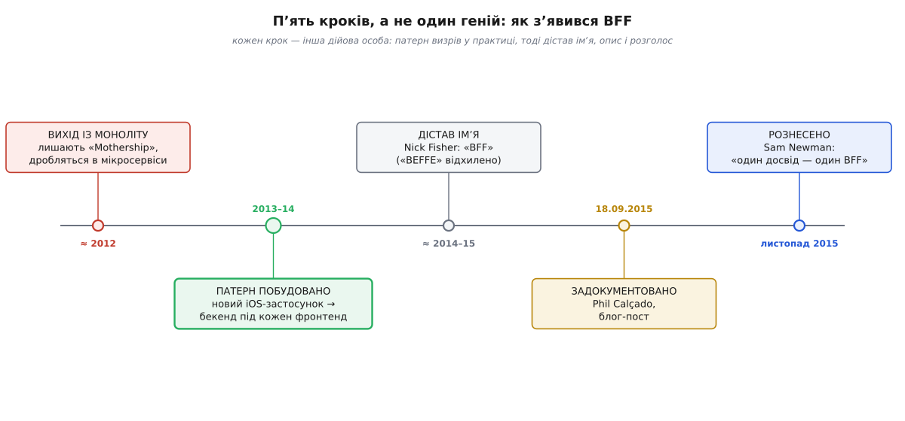

# 📜 Як BFF народився в SoundCloud

Патерни архітектури рідко народжуються за столом теоретика — частіше їх виштовхує з команди конкретна, набридла до зубовного скреготу біда. Так сталося й з BFF. Він не вигаданий у книжці й не виведений із перших принципів; він виповз із дуже приземленої халепи, у якій опинилися інженери SoundCloud — берлінського сервісу, де музиканти викладають свої треки, — приблизно між 2012 і 2015 роками. Історія коротка, але повчальна саме тим, що видно кожен окремий крок: як патерн спершу зліпили руками під тиском, тоді хтось дав йому назву, ще пізніше хтось його описав, і аж потім хтось рознic світом. Жодного «одного генія» — ланцюжок різних людей, кожен зі своїм внеском.

*Патерн не зʼявився готовим. Спершу команда SoundCloud побудувала його в коді під конкретну потребу; тоді він дістав імʼя, тоді — перший публічний опис, і лише потім — розголос. Кожен крок — інша дійова особа.*

## Моноліт на ім'я «Mothership»

Спочатку SoundCloud, як майже кожен стартап, був одним великим застосунком на Ruby on Rails. У команді його називали **«Mothership»** — «матка-корабель». Уся логіка сиділа в одному місці: одна кодова база, одна база даних, один застосунок, який і був **усім** SoundCloud. Поки продукт малий, так навіть зручно — усе поруч, усе під рукою.

Зручність скінчилася, коли команда виросла. Найдорожчим став не написати нову можливість, а **пропхати її крізь Mothership**: що більше людей одночасно правило той самий велетенський застосунок, то повільніше все котилося до релізу. У 2012-му вийшла велика перебудова сайту під назвою «Next SoundCloud», і відтоді головним інтерфейсом системи до світу став **публічний API** — той самий, яким користувалися й сторонні розробники.

Розчистити цей затор команда взялася розважливо: не рубати Mothership навпіл одним махом, а домовитися **нічого нового до нього не додавати**. Кожну нову можливість писали окремим [мікросервісом](topic:sf-apps/microservices) збоку, а коли якийсь шматок старого коду однаково доводилося серйозно переробляти — його при нагоді виймали з Mothership у власний сервіс. Моноліт помалу всихав, а навколо нього наростав вінок дрібних служб. Саме так, поступовим обплітанням і витісненням, з моноліту виповзають найакуратніше — цей спосіб згодом назвуть [душійною смоківницею (strangler fig)](topic:sf-apps/strangler-fig), за деревом, що обплітає стовбур-господар і врешті займає його місце.

## Новий застосунок під iOS і кепські мережі

Приблизно за рік після того, як нова мікросервісна архітектура стала на ноги, команда взялася до наступного великого діла — **нового застосунку під iOS**. І тут стара будова показала гострий край.

Кожен екран застосунку треба чимось наповнити, а дані тепер лежали не в одному моноліті, а розсипані по багатьох дрібних сервісах. Щоб намалювати один екран, застосунок мусив сходити по мережі до кількох служб і сам зшити відповіді докупи. На товстому дротовому інтернеті це ще терпимо. Але **головна маса користувачів сиділа на телефонах**, а мобільна мережа тих років була повільна й ненадійна — сам Філ Калсадо в описі патерну відзначив, що проблема боліла на всіх платформах, та найгірше вона діймала мобільних, які часто висіли на «unreliable and slow wireless networks» (ненадійних і повільних бездротових мережах). Кожен зайвий похід телефона по мережу — це помітна пауза, поки екран стоїть порожній.

Отут і зійшлися два невдоволення в одне. Дані розкидані по сервісах — отже, екран треба збирати з багатьох джерел. А збирати доводиться на боці телефона, по найгіршій із можливих мереж. Напрошувалося поставити цю збірку **не на телефон, а на сервер** — але який саме сервер?

## Глухий кут універсального API

Найпростіша думка — «хай застосунок ходить у наш публічний API, він же вже є» — і завела в глухий кут, і цей кут варто роздивитися, бо саме він і виштовхнув патерн на світ.

Публічний API SoundCloud був **спільний для всіх**: ним живилися і власні застосунки компанії, і сторонні розробники, що будували на платформі свої речі. Із цього випливали дві пастки, з яких годі було вибратися, не зачепивши когось.

Перша: якби власний iOS-застосунок живився **тільки** з публічного API, то все, що команда додала б для себе, автоматично ставало б доступним і кожному сторонньому клієнтові — адже API один на всіх. Зробити щось **виняткове для власного застосунку** означало щоразу городити перевірки прав доступу (OAuth-scope: «а цьому клієнтові цей шматок можна?»), і ця перевірка липла до кожної нової дрібниці. Спеціалізувати спільний API під свій застосунок було не можна, **не зламавши обіцянки стороннім**, що API стабільний і однаковий для всіх.

Друга: публічний API **за самою своєю природою** узагальнений. Він не знає й не повинен знати, який саме екран його смикає, тож віддає дрібно нарізані, нейтральні шматочки даних — а щоб зібрати з них один екран, треба зробити **багато** окремих HTTP-запитів. Для сторонніх це чесно й гнучко. Для власного мобільного застосунку на кепській мережі це рівно та біда, від якої тікали: купа повільних кругорейсів на один екран.

Отже, публічний API не можна ні спеціалізувати (зламаєш стороннім), ні лишити як є (мобільний захлинеться в дрібних запитах). Вихід був один і напрошувався сам: поставити **окремий серверний застосунок під власний фронтенд** — не спільний, не публічний, а свій, що знає рівно про цей застосунок і кроїть дані точно під його екрани. Не один бекенд на всіх, а **окремий бекенд для кожного фронтенду**.

## Хто дав імʼя: Нік Фішер і відхилений «BEFFE»

Ідея була, річ працювала — а звичної короткої назви ще не було. І тут історія робить свій найлюдськіший, майже анекдотичний поворот, який добре показує, що імена речам дають не завжди ті, хто ці речі вигадав.

**Філ Калсадо** (Phil Calçado) — бразильський інженер, який на SoundCloud вів усю виправу з моноліту в мікросервіси, — запропонував для нового шару абревіатуру **«BEFFE»** (від *back-end for front-end*). Її **відхилила голландськомовна частина команди**: сам Калсадо в описі патерну прямо каже, що його початковий варіант «BEFFE» наклали вето «our Dutch-speaking team mates» (голландськомовні колеги). Причини він не назвав — але вона легко вгадується всіма, хто знає трохи голландського вуличного слівника: корінь *bef-* там має відверто непристойне звучання, тож серйозно вимовляти назву сервісу з таким коренем ніхто в команді не збирався. *(Сам факт вето — з першоджерела; конкретну причину джерело не пояснює, це добре обґрунтований здогад, а не пряма цитата.)* Команда в SoundCloud була строката й багатонаціональна — досить сказати, що в тодішньому складі був, наприклад, інженер із фламандським прізвищем Крістоф Адріансенс (Kristof Adriaenssens), — тож голландськомовним було кому оцінити невдалий каламбур.

Замість «BEFFE» коротшу й безпечнішу назву **«BFF»** запропонував **Нік Фішер** (Nick Fisher), тодішній тех-лід вебнапряму SoundCloud. Вона й прижилася. Тут варто спинитися на одній тонкості, яку легко проґавити: людина, що дала патернові його вічну назву, — **не** та, що затіяла сам патерн і його першу (відхилену) абревіатуру. Калсадо збудував і описав річ; Фішер її влучно назвав. Уже на цьому кроці «BFF» — плід не одної голови.

## Філ Калсадо документує патерн (18 вересня 2015)

Кілька років BFF жив усередині SoundCloud як робоча практика, про яку в команді, за словами самого Калсадо, «говорили безліч разів, але жодного разу не описали до пуття». Публічним і задокументованим патерн став **18 вересня 2015 року**, коли Філ Калсадо виклав у себе в блозі допис «The Back-end for Front-end Pattern (BFF)» — перший розгорнутий публічний виклад того, що вони робили.

Важливо, чого цей допис **не** робив: він нічого не винаходив. Він **записав** уже усталену в команді практику й дав їй ім'я, під яким вона піде світом. І сам Калсадо чесно назвав це роботою гурту, а не своєю особистою: за BFF у SoundCloud відповідала команда Core Engineering — Крістоф Адріансенс, Бора Тунджа, Рахул Ґома Пхулоре, Ганнес Тюден, Вітор Пеллеґріно, Сем Старлінг і сам Філ Калсадо. Це важлива деталь для чесної історії: «хто придумав BFF» не має відповіді у вигляді одного прізвища — придумала й обкатала його команда, а Калсадо був тим, хто взяв на себе працю це записати.

> 🔧 **Навіщо це.** Різниця між «побудувати» і «задокументувати» тут не канцелярська дрібниця, а суть того, як узагалі розходяться патерни. Робоча практика, замкнена в одній компанії, впливає лише на цю компанію. Щойн її **описано загальними словами** — вона стає інструментом для всіх, хто впізнає в чужому описі свою власну біду. Допис Калсадо коштував авторові кількох вечорів, а сотням команд заощадив місяці намацування навпомацки того самого рішення. Тому в історії технологій крок «хтось нарешті це чітко описав» вартий не менше за крок «хтось це вперше зробив».

## Сем Ньюмен рознic патерн (листопад 2015)

За два місяці, у **листопаді 2015-го**, естафету підхопив **Сем Ньюмен** (Sam Newman) — британський інженер і автор книжки «Building Microservices», людина з широкою аудиторією в світі мікросервісів. Він переказав патерн своїми словами й дав те формулювання, яке потім цитуватимуть найчастіше: замість одного універсального бекенда — **«один бекенд на кожен користувацький досвід»** (*one backend per user experience*), і тут-таки чесно послався на Калсадо як на автора самого терміна «BFF».

Саме гасло, під яким патерн урешті розійшовся, — **«один досвід — один BFF»** (*one experience, one BFF*) — теж, як виявляється, не Ньюменове одноосібне. Ньюмен прямо приписує його **Стюартові Ґледову** (Stewart Gleadow) з австралійської компанії REA Group (сайт нерухомості realestate.com.au), а той, своєю чергою, кивав на Філа Калсадо й **Мустафу Сезгіна** (Mustafa Sezgin). Тобто навіть коротке гасло, яким описують BFF, проросло крізь кілька рук на двох різних континентах — Берлін і Мельбурн, — перш ніж дістатися до підручників.

Ньюмен додав до історії ще й корисне уточнення про **межу** патерну, бо бачив його в двох компаніях у двох різних формах. У REA різні мобільні платформи діставали **різні** BFF — окремий для iOS, окремий для Android. У SoundCloud натомість заводили по одному BFF на **тип інтерфейсу**. Сам Ньюмен схилявся до строгішого правила «один тип клієнта — один BFF» — і саме з цих спостережень і викристалізувалося гасло «один досвід — один бекенд», яке тепер найчастіше й згадують, коли пояснюють суть патерну.

## Що показує ця історія

Насамкінець варто чесно назвати **статус доказовості**: усе вище — **усталене**, і не з переказів, а з першоджерел. Дата 18 вересня 2015-го, історія з «BEFFE» й Ніком Фішером, склад команди — це з власного допису Філа Калсадо на **philcalcado.com**. Формулювання «один бекенд на кожен досвід», датування листопадом 2015-го й ланцюжок «Ґледов → Калсадо і Сезгін» — з тексту Сема Ньюмена на **samnewman.io**. Ім'я моноліту «Mothership» і перебудова «Next SoundCloud» 2012 року — з інженерного блогу SoundCloud і власних дописів Калсадо про виправу в мікросервіси. Єдине, що тут здогад, а не документ, — точна причина вето на «BEFFE» (голландський жарт), і це позначено просто у тексті.

А головний урок цієї маленької історії — не в датах, а в її **розсипаності по людях**. Патерн BFF **побудувала** команда SoundCloud під конкретний біль мобільного застосунку; **назвав** його Нік Фішер (а не автор ідеї); **задокументував** Філ Калсадо; **рознic** Сем Ньюмен; а найпам'ятніше гасло дійшло через Стюарта Ґледова від Калсадо й Мустафи Сезгіна. Спокуса розказати таке одним прізвищем — «BFF придумав такий-то» — завжди велика й завжди неправдива: як і майже все живе в інженерії, цей патерн — робота гурту, розтягнена в часі й підписана багатьма руками. І виріс він не з бажання додати ще один модний шар, а з простої, добре знайомої кожному мобільному розробникові муки: повільна мережа, розсипані дані й екран, який ніяк не хоче наповнюватися.
