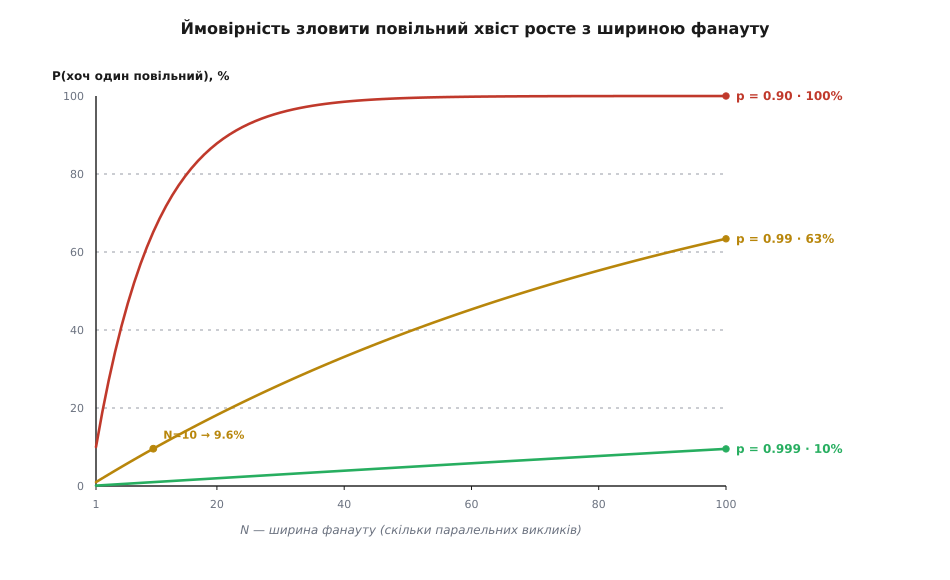

# 🧮 Математика хвостової затримки: чому широкий фанаут майже завжди чекає на повільного

Коли BFF пускає виклики паралельно, загальний час дорівнює не сумі, а **найповільнішому з них** — чекаємо, доки повернеться останній. Це звучить як добра новина: замість «80 + 120 + 60» платимо лише «120». Але в цій утісі ховається пастка, і що ширше розсипаний фанаут, то глибша вона. Бо «чекати на найповільнішого» означає, що досить **одному-єдиному** викликові з десятка сьогодні спіткнутися — і весь екран чекає на нього. А ймовірність, що бодай хтось спіткнеться, з кожним доданим викликом невблаганно росте.

Розберімо це не на відчуттях, а на числах: скільки насправді коштує ширина фанауту, звідки береться повільний хвіст і чому проти нього рятують саме дедлайни, хеджування й кеш, а не побажання «зробімо кожен сервіс трошки швидшим».

## Модель: що таке «швидкий» виклик

Щоб рахувати, треба спершу домовитися про слова. Зафіксуймо якийсь **поріг** L — скажімо, «відповів протягом 100 мілісекунд». Один виклик назвемо **швидким**, якщо він уклався в L, і **повільним** — якщо ні. Позначмо ймовірність того, що виклик швидкий, буквою p; тоді ймовірність, що повільний, — це q = 1 − p.

Для здорового сервіса p близьке до одиниці, але **не дорівнює** їй. p = 0.99 читається просто: дев'яносто дев'ять викликів зі ста вкладаються в поріг, а один — ні. І тут-таки виринає зв'язок із мовою, якою пишуть угоди про рівень сервісу, — з **перцентилями** (лат. *per centum* — «на сотню»). Сказати «99-й перцентиль (P99) затримки дорівнює 100 мс» — це рівно те саме, що сказати «99% викликів встигають за 100 мс», тобто p = 0.99 для порога L = 100 мс. Перцентиль і наша p — дві назви однієї величини, і далі ми вільно перекладатимемо з однієї на іншу.

Лишається одне припущення, без якого не порахувати нічого, — **незалежність**. Ми вважаємо, що N викликів спотикаються незалежно один від одного: те, що сервіс профілю сьогодні забарився, нічого не каже про сервіс порад. Це припущення чесно назвати **оптимістичним**. У житті виклики ділять спільну мережу, спільну базу, спільний момент складання сміття в рантаймі — а спільна причина робить повільність **корельованою**, і тоді все виходить ще гірше, ніж дасть наша арифметика. Тож усі числа нижче — це **найкращий випадок**, нижня межа біди. Реальність від неї лише відхиляється в гірший бік.

> 🔧 **Навіщо це.** Перш ніж сперечатися, «широкий фанаут — це погано чи стерпно», треба вміти покласти на терези число. Модель «швидкий із імовірністю p, N незалежних викликів» дає рівно це: перетворює туманне «здається, при багатьох викликах щось часто гальмує» на точну формулу, з якою можна проєктувати дедлайни й вирішувати, скільки листів фанауту система витримає. Основи ймовірності, на яких це стоїть, — окрема тема: [ймовірність](root:math-probability/probability-basics).

## Множення ймовірностей: усі швидкі — це pᴺ

Фанаут швидкий у цілому лише тоді, коли швидкий **кожен** його виклик: максимум із N вкладається в поріг тільки якщо всі N вклалися. А ймовірність того, що станеться і перше, і друге, і третє незалежне «швидко», — це **добуток** їхніх імовірностей. Звідси головна формула:

```
P(усі N швидкі) = p · p · … · p = pᴺ
```

Помножити число, менше за одиницю, саме на себе багато разів — значить неухильно його стирати. Ось як тане «всі швидкі» для дуже пристойного сервіса з p = 0.99:

**Сервіс із P99 (p = 0.99), розмноження порога на весь фанаут:**

```
N =   1 :  0.99¹   = 0.990    →  99.0% запитів «усі швидкі»
N =   5 :  0.99⁵   = 0.951    →  95.1%
N =  10 :  0.99¹⁰  = 0.904    →  90.4%
N =  50 :  0.99⁵⁰  = 0.605    →  60.5%
N = 100 :  0.99¹⁰⁰ = 0.366    →  36.6%
```

Вдумаймося в останній рядок. Кожен окремий виклик майже бездоганний — лишень один зі ста збоїть. Але зберіть екран зі ста таких викликів, і повністю швидким він буде **лише в третині** випадків. Не тому, що сервіси погані, а тому, що 0.99 у сотому степені — це вже 0.37. Експоненційне згасання будь-чого меншого за одиницю нещадне: кожен доданий лист домножує шанс на 0.99, і сотня таких домножень з'їдає майже дві третини.

Є зручний спосіб тримати цю формулу в голові без калькулятора. Запишімо pᴺ через експоненту: pᴺ = e^(N·ln p). Коли p близьке до одиниці, ln p ≈ −(1 − p) = −q, і тоді

```
pᴺ ≈ e^(−N·q)
```

Тобто ймовірність «усі швидкі» згасає експоненційно від добутку **N·q** — ширини фанауту, помноженої на частку повільних. Саме цей добуток, як побачимо за мить, і є очікуваною кількістю повільних викликів. Одна формула, два прочитання.

## Доповнення: хоч один повільний — це 1 − pᴺ

Перевернімо погляд, бо користувача мучить не «всі швидкі», а протилежне. Екран забарився — тобто чекає далі за поріг — рівно тоді, коли **хоч один** виклик виявився повільним. Ймовірність цього — доповнення до попередньої:

```
P(хоч один повільний) = 1 − pᴺ
```

Це і є число, що болить, бо його користувач відчуває на дотик як паузу перед готовим екраном. Погляньмо, як воно росте з шириною фанауту для сервісів різної якості.



*Що ширший фанаут, то вища ймовірність зловити повільний хвіст хоч одного виклику. Навіть «три дев'ятки» на виклик (p = 0.999) при ста паралельних викликах дають майже 10% повільних агрегатів; звичні «дві дев'ятки» (p = 0.99) — уже 63%. Крива тим крутіша, чим гірший окремий виклик.*

**Ймовірність повільного агрегату для сервісів різної якості:**

```
                          N = 10     N = 50     N = 100
p = 0.90  :  1 − 0.90ᴺ    0.651      0.995      1.000
p = 0.99  :  1 − 0.99ᴺ    0.0956     0.395      0.634
p = 0.999 :  1 − 0.999ᴺ   0.00996    0.0488     0.0952
```

Прочитаймо таблицю чесно. Сервіс із p = 0.99 — це той, яким пишаються: лише 1% повільних відповідей. Але вже при десяти паралельних викликах майже **кожен десятий** екран ловить повільний хвіст, а при ста — майже **два з трьох**. І навіть якщо героїчно дотягнути кожен виклик до «трьох дев'яток» (p = 0.999, один повільний на тисячу), сотня таких викликів усе одно дає повільний хвіст у кожному десятому запиті. Надійність, що виглядає розкішною на рівні одного виклику, стає посередньою на рівні агрегату.

Саме цей рахунок 2013 року винесли на видне місце інженери Google Джеффрі Дін (Jeffrey Dean) і Луїс Андре Барросо (Luiz André Barroso) у статті «The Tail at Scale» («Хвіст на масштабі», *Communications of the ACM*, лютий 2013). Їхній наскрізний приклад — рівно наш останній стовпчик: якщо запит користувача мусить зібрати відповіді зі ста серверів паралельно, а кожен має 99-й перцентиль затримки в одну секунду, то **63% запитів чекатимуть довше за секунду** — попри те, що на кожному окремому сервері секундну затримку ловить лише один запит зі ста. Це усталений, багатократно відтворений результат, і він же — головний доказ, що хвостова затримка на масштабі є системною проблемою, а не косметичною.

## Скільки саме повільних: очікувана кількість N(1 − p)

Ми знаємо ймовірність, що повільних **хоч один**. А скільки їх у середньому? Полічімо. Нехай X — кількість повільних викликів із N. Кожен виклик повільний із імовірністю q незалежно від інших, тож X розподілене **біноміально** — це класична «скільки успіхів у N спробах». Її середнє береться найпростішим і найнадійнішим інструментом теорії ймовірностей — **лінійністю сподівання**: очікувана кількість повільних дорівнює сумі очікувань по кожному виклику, а кожен дає рівно q:

```
E[повільних] = N · q = N · (1 − p)
```

**Очікувана кількість повільних листів у фанауті:**

```
N = 10,  p = 0.99  :  E = 10 · 0.01  = 0.1   повільних у середньому
N = 10,  p = 0.90  :  E = 10 · 0.10  = 1.0
N = 100, p = 0.99  :  E = 100 · 0.01 = 1.0
```

Перший рядок ховає гарний парадокс, який варто розкрити, бо він — ключ до всієї інтуїції хвоста. Очікувана кількість повільних при N = 10, p = 0.99 дорівнює **0.1** — менше за один виклик! А проте ймовірність, що повільний трапиться хоч один, ми щойно порахували як **9.6%**. Як «у середньому 0.1 повільного» уживається з «кожен десятий екран ловить повільного»?

Розгадка в тому, що середнє — оманливий орієнтир для рідкісних подій. Переважна більшість запитів має **нуль** повільних листів, зрідка трапляється **один**, і майже ніколи — два. Багато нулів тягнуть середнє вниз до 0.1, хоча кожен окремий «один» — це вже зіпсований екран. Зв'язати два числа точно допомагає наближення Пуассона (на честь Симеона Дені Пуассона): коли q мале, X поводиться як пуассонівська величина з параметром λ = N·q, і тоді

```
P(хоч один повільний) = 1 − e^(−λ),   λ = N·(1 − p)

λ = 0.1  →  1 − e^(−0.1) = 0.0952  ≈  9.5%
```

Що збігається з точним 1 − 0.99¹⁰ = 0.0956 до другої цифри. Отже, «очікувана кількість» і «ймовірність хоч одного» — це два обличчя того самого добутку λ = N·q. Перше каже «рідко буває більше за одного», друге — «зате той один буває часто». Жодне поодинці не описує хвіст: середнє заспокоює, ймовірність тривожить, і праві обидва.

## Зсув перцентиля: серце проблеми

Тепер перекладімо все на мову перцентилів — бо саме нею записують цілі («тримаємо P99 екрана під 200 мс»), і саме в цьому перекладі проблема хвоста показує своє справжнє обличчя.

Хай поріг L — це **P99 одного сервіса**, тобто p = 0.99. Тоді ймовірність, що агрегат укладеться в той самий L, дорівнює 0.99ᴺ. При N = 10 це 0.904 — отже, той самий поріг L, який для одного виклику був P99, для агрегату став лише **P90**. Скажімо одним реченням: розсипати виклик удесятеро перетворює P99 кожного листа на **P90 усього екрана**. Рідкісна, одновідсоткова забарність окремого сервіса стає буденною, майже десятивідсотковою забарністю зібраного екрана. Хвіст нікуди не подівся — він **пересунувся** з дальнього краю розподілу ближче до середини, туди, де користувач його регулярно зустрічає.

А тепер найкорисніше — обернімо задачу. Якщо ми хочемо втримати **агрегатну** ціль P (наприклад, P99, тобто 0.99), то яким мусить бути p кожного листа? З рівняння pᴺ = P одразу:

```
p = P^(1/N)
```

**Якої тісноти вимагає від кожного листа агрегатна ціль P99 (= 0.99):**

```
N = 10  :  p = 0.99^(1/10)  = 0.99900    →  кожен лист мусить бути на P99.9
N = 100 :  p = 0.99^(1/100) = 0.999899   →  кожен лист — майже на P99.99
```

Ось воно, **підсилення хвоста**. Щоб зібраний із десяти викликів екран тримав скромний P99, кожен окремий виклик мусить тримати вже P99.9 — удесятеро тіснішу межу, ніж ти хочеш на виході. Розсип на сто — і кожен лист зобов'язаний бути на P99.99. Гонитва за останніми дев'ятками дорожчає **експоненційно** з шириною фанауту: що більше листів, то нелюдськіші вимоги до кожного. Це не дрібна незручність, яку можна перечекати, — це стіна, у яку впирається саме **масштабування**, і саме тому хвостову затримку не можна залишити «на потім».

## Очікуваний максимум: чому форма хвоста вирішує все

Досі «швидко/повільно» було двійковим — уклався в поріг чи ні. Але насправді користувач чекає конкретну кількість мілісекунд — **максимум** із N часів відповіді. Наскільки великий цей максимум у живих числах? І ось тут з'ясовується, що відповідь залежить не від p, а від **форми хвоста** розподілу затримок, і два світи розходяться разюче.

**Легкий хвіст (експоненційний розподіл).** Хай час кожного виклику розподілений експоненційно із середнім μ. Тоді очікуваний максимум із N викликів дорівнює середньому, помноженому на **гармонічне число** Hₙ:

```
E[максимум] = μ · Hₙ,   де  Hₙ = 1 + 1/2 + 1/3 + … + 1/N
```

Звідки береться саме гармонічна сума — видно з механізму. В експоненційного розподілу є чарівна властивість безпам'ятності: коли N викликів іще в дорозі, час до першого завершення розподілений експоненційно із середнім μ/N; після нього лишається N−1 викликів, і завдяки безпам'ятності час до наступного — це знову «свіжий» експоненційний із середнім μ/(N−1), і так далі. Складаємо очікувані проміжки — і виходить μ·(1/N + 1/(N−1) + … + 1) = μ·Hₙ. А гармонічне число росте **логарифмічно**: Hₙ ≈ ln N + 0.577.

```
E[максимум] / μ = Hₙ :
N = 10  :  H₁₀  = 2.93    →  максимум ≈ 2.9× середнього одного виклику
N = 100 :  H₁₀₀ = 5.19    →  максимум ≈ 5.2×
```

Навіть із приязним експоненційним хвостом максимум із десяти викликів утричі перевищує середній час одного — а зі ста лише вп'ятеро. Логарифм добрий до нас: удесятеро більше викликів коштує лиш удвічі довшого чекання.

**Важкий хвіст (степеневий, розподіл Парето з показником α).** Тут добрий логарифм зникає. Максимум росте не як ln N, а як **степінь** N — порядку N^(1/α). Для α = 2 це √N:

```
E[максимум] / масштаб ≈ N^(1/α) :
α = 2, N = 100 :  √100 = 10    →  максимум ≈ 10×, і росте без насичення
```


*Форма хвоста вирішує ціну ширини. З легким експоненційним хвостом максимум росте як ln N — розсип удесятеро коштує лише вдвічі довшого чекання. З важким степеневим хвостом він росте як степінь N (тут √N для α = 2) і не насичується. Реальні затримки сервісів — паузи на складання сміття, черги, повторні спроби, холодні кеші — сумно відомі саме важкими хвостами.*

У цьому контрасті — уся суть. З легким хвостом ширший фанаут розтягує чекання лише логарифмічно, і жити можна. З важким — чекання росте як степінь ширини й не насичується. А живі затримки сервісів майже завжди **важкохвості**: одна пауза складання сміття, одна довга черга, один повтор після таймауту дають ту рідкісну, але велетенську відповідь, що й формує степеневий хвіст. Ось чому не можна безпечно припустити приязний логарифм — і чому хвіст доводиться приборкувати спеціально, а не сподіватися, що він розсмокчеться сам.

## Скільки реально можна фанаутити — і що рятує хвіст

Складімо всі три числа в одну картину. **1 − pᴺ** каже: широкий фанаут рано чи пізно — цього самого запиту — впіймає чиюсь погану мить. **N(1 − p)** і зсув перцентиля кажуть: кожен доданий лист тіснішає ту межу, яку зобов'язаний тримати сам лист. **E[максимум]** каже: скільки та погана мить коштує в мілісекундах, залежить від того, наскільки важкий твій хвіст. Разом вони й задають природну ширину фанауту — і підказують чотири важелі, якими хвіст приборкують.

**Тримати фанаут вузьким — найдешевший важіль.** Оскільки 1 − pᴺ невблаганно лізе вгору з кожним листом, найдієвіше — листів **поменшати**. Спитати сервіс про все гуртом одним викликом замість десятьох; викинути неістотні листи; частину даних дістати наперед із кешу. Кожен прибраний лист домножує шанс «усі швидкі» назад на 1/p. Ширші стратегії, як звужувати й пакувати розсип, — окрема тема: [стратегії фанауту](root:sf-distributed/fan-out-strategies).

**Дедлайни — обмежити максимум наказом.** Дедлайн D на кожен виклик каже: жоден виклик не сміє тривати довше за D; по спливі D ідемо далі без нього. Це перетворює необмежений, важкохвостий максимум на **тверду стелю** D — ціною втрати даних обрізаного листа (у середньому 1 − p_D частка викликів на кожен лист). Математика перевертається: замість «наскільки повільний максимум?» питаєш «як часто я гублю лист?» = 1 − p_D і «чи виживе екран без нього». Дедлайн міняє задачу про затримку на задачу про повноту — і це майже завжди вигідний обмін, бо екран без одного блоку кращий за екран, що не завантажився ніколи. Арифметика самих дедлайнів і спільного бюджету часу — окремо: [таймаути й дедлайни](root:sf-distributed/timeouts-deadlines).

**Хеджування — побороти хвіст дублікатом.** Пошли той самий запит на другу репліку, щойно перший провисів довше за, скажімо, 95-й перцентиль; бери, хто перший відповість, другого скасуй. Чому це працює — видно з арифметики. Виклик тепер повільний лише тоді, коли повільні **обидві** копії, а якщо репліки приблизно незалежні, ця ймовірність — близько **q²** замість q. Піднести мале число до квадрата означає розчавити його: q = 0.01 → q² = 0.0001, тобто лист із P99 стає фактично P99.99 — рівно тієї тісноти, якої вимагав широкий фанаут. А що дублюєш лише найповільніші ~5%, зайвого навантаження додається теж лише близько 5%. Дін і Барросо наводять читання з BigTable, де хеджований запит після 10-мілісекундної затримки збив 99.9-й перцентиль часу з 1800 мс до 74 мс, надіславши лише на 2% більше запитів. Хедж платить крихітний податок пропускної здатності, щоб викупити назад хвіст, який створив фанаут. Механіка й пастки — [хеджовані запити](root:sf-distributed/hedged-requests).

**Кеш — прибрати листи з перегонів.** Влучення в кеш відповідає миттєво: для такого листа p ≈ 1, і він **випадає** з добутку pᴺ зовсім. Якщо частка h листів обслуговується з кешу, дієва ширина «тих, що можуть загальмувати» стискається з N до N(1 − h), а шанс «усі швидкі» росте з pᴺ до p^(N(1−h)):

```
без кешу       :  P(усі швидкі) = pᴺ
частка h з кешу :  P(усі швидкі) = p^(N·(1−h))

p = 0.99, N = 100, h = 0.5  :  0.99⁵⁰ = 0.605   замість   0.99¹⁰⁰ = 0.366
```

Кеш не просто пришвидшує середнє — він **звужує дієвий фанаут**, тобто той самий показник степеня, що керує хвостом. Половина листів із кешу підняла шанс повністю швидкого екрана з 37% до 61%, не змінивши жодного сервіса. Підходи до кешування — окрема тема: [стратегії кешування](root:sf-data/caching-strategies).

Оце і є вся математика хвоста в одному подиху. pᴺ невблаганно тане, тож широкий фанаут гарантовано колись зачекає на чиюсь погану мить; N(1 − p) і зсув перцентиля показують, що кожен доданий лист вимагає від сервісів тіснішого хвоста, ніж ти хочеш на виході; E[максимум] показує, що ціна тієї миті залежить від того, наскільки важкі твої хвости. Дедлайн ставить стелю ціні, хедж підносить імовірність до квадрата, кеш зменшує показник степеня. Знай свою p, полічи свій N — і не фанаутить ширше, ніж твій бюджет хвоста здатен оплатити.
