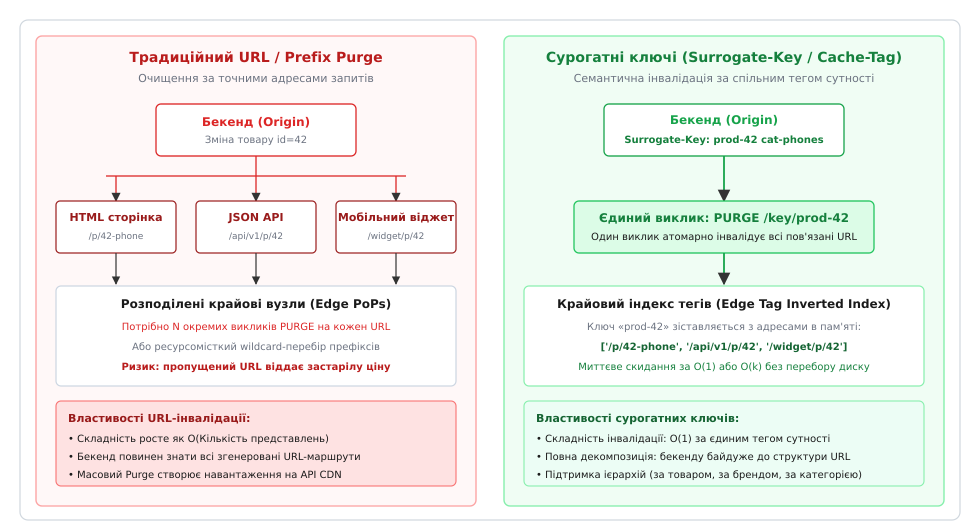
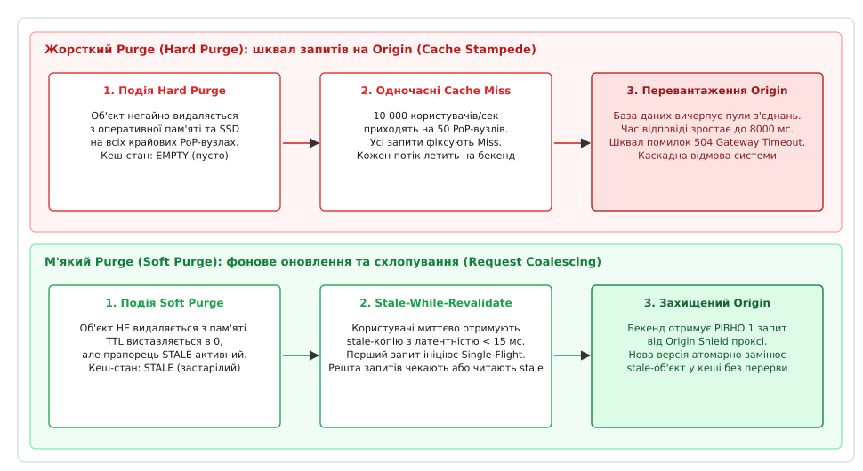

# Інвалідація кешу в CDN

<preknowlist>
- [Протокол HTTP](topic:com-protocol/http) — методи запитів, семантика заголовків `Cache-Control`, валідація за `ETag` та статус-коди `304 Not Modified`.
- [Зворотний проксі](topic:sf-web/reverse-proxy) — термінація з'єднань, буферизація трафіку та маршрутизація запитів між клієнтом і бекендом.
- [Незмінна статика: відбиток вмісту в адресі](topic:sf-distributed/content-addressed-assets) — версіонування файлів через хешування вмісту в URL для уникнення потреби в інвалідації.
- [Гримуча отара: Thundering herd і request coalescing](topic:sf-distributed/cache-stampede) — блокування лавинних запитів до бази даних під час інвалідації популярних ключів.
</preknowlist>

Коли інтернет-магазин під час святкового розпродажу помилково публікує флагманський телевізор за ціною 15 гривень замість 15 000, бекенд-інженери виправляють запис у базі даних за три секунди. Проте сторінка товару вже закешована на двох сотнях крайових вузлів глобальної мережі доставки контенту (англ. *Content Delivery Network*, CDN) з пасивним часом життя `max-age=86400` (доба). Протягом наступних десяти хвилин сорок тисяч користувачів з усього світу встигають оформити замовлення за помилковою ціною, оскільки крайові сервери в Лондоні, Франкфурті, Сінгапурі та Токіо продовжують миттєво віддавати застарілий HTML із власної оперативної пам'яті, навіть не звертаючись до центрального сервера. Спроба розробників терміново очистити кеш шляхом повного перезавантаження всього CDN призводить до того, що півмільйона паралельних запитів одночасно пробивають спорожнілий кеш і вмить кладуть базу даних джерела під лавиною промахів.

Ця криза виникає через фундаментальне протиріччя розподілених систем: що ближче контент розміщено до кінцевого користувача для забезпечення мілісекундного відгуку, то більшою стає кількість автономних копій даних і то складніше синхронно повідомити кожен географічно віддалений вузол про зміну першоджерела.

Вирішенням цієї суперечності є **інвалідація кешу (англ. *cache invalidation*, лат. *invalidus* — недійсний)** — сукупність протокольних, архітектурних та алгоритмічних механізмів, які дозволяють серверу-джерелу (англ. *origin server*) примусово оголосити застарілими копії об'єктів на всіх розподілених крайових серверах за мілісекунди, не перевантажуючи бекенд і не порушуючи доступності для користувачів.


*Порівняння архітектури інвалідації: каскадне розмноження URL-запитів проти семантичного очищення за сурогатними ключами*

## Анатомія крайового кешу: ієрархія та стан свіжості

Щоб зрозуміти, чому просте видалення файлу на локальному сервері не працює в CDN, необхідно простежити топологію сучасної крайової інфраструктури.

Типова комерційна CDN складається з трьох рівнів:
1. **Крайові точки присутності (Edge PoP — Points of Presence):** Сотні серверних кластерів, розташованих у точках обміну інтернет-трафіком (IXP) безпосередньо біля користувачів. Кожен PoP містить десятки проксі-серверів з оперативною пам'яттю та NVMe-накопичувачами. Маршрутизація користувачів до найближчого PoP виконується за допомогою протоколу BGP Anycast або географічного DNS (GeoDNS).
2. **Крайовий щит джерела (Origin Shield / Mid-Tier Cache):** Проміжний концентратор кешу, що стоїть між крайовими PoP та дата-центром компанії. Shield акумулює запити від сотень PoP, щоб бекенд бачив звернення лише від одного-двох регіональних концентраторів, а не від тисяч окремих серверів.
3. **Сервер-джерело (Origin Server):** Центральний стек застосунку (балансувальник навантаження, сервіси додатків, реляційні бази даних та об'єктні сховища).

```
[ Клієнт: Токіо ] ────► [ Edge PoP: Токіо ] ─────┐
                                                  ▼
[ Клієнт: Сідней ] ───► [ Edge PoP: Сідней ] ───► [ Origin Shield ] ───► [ Бекенд (Origin) ]
                                                  ▲
[ Клієнт: Сеул ] ─────► [ Edge PoP: Сеул ] ──────┘
```

Коли HTTP-запит клієнта потрапляє на крайовий вузол, проксі-двигун формує внутрішній ключ кешування (англ. *cache key*), який зазвичай складається з комбінації `Схема + Хост + Шлях + Рядок запиту + Нормалізовані заголовки Vary`. За цим ключем виконується пошук у дворівневому індексі (RAM + SSD).

Життєвий цикл кожного збереженого об'єкта описується скінченним автоматом із трьох базових станів:
- **Свіжий (Fresh):** Вік об'єкта (`Age`), розрахований від моменту генерації на бекенді, менший за встановлений час життя (`TTL`). Крайовий сервер віддає його клієнту негайно за 5–15 мілісекунд без жодних мережевих запитів до джерела (Cache Hit).
- **Застарілий (Stale):** Вік об'єкта перевищив `TTL`. Сервер більше не вважає його гарантовано дійсним. Залежно від конфігурації проксі або відправляє запит на бекенд (Cache Miss), або використовує застарілу версію у фоновому режимі (`stale-while-revalidate`).
- **Вилучений (Evicted / Purged):** Об'єкт фізично видалено або його ключ стерто з індексу пам'яті через брак місця за алгоритмом витіснення (LRU / SLRU / TinyLFU) або внаслідок явної команди інвалідації.

Історичний шлях того, як індустрія перейшла від перших повільних черг Akamai до сучасних субсекундних шин очищення, викладено в окремому нарисі: [Еволюція механізмів інвалідації в CDN](topic:sf-web/cdn-cache-invalidation/hist-invalidation-mechanisms.md).

## Стратегії інвалідації: пасивне згасання проти активного Purge

Керування актуальністю даних на крайових серверах спирається на дві фундаментальні стратегії: пасивне згасання за таймером та активне примусове вилучення.

### 1. Пасивне згасання (TTL-based Expiration)

При пасивному керуванні бекенд додає до HTTP-відповіді директиви тривалості життя:
- `Cache-Control: max-age=300` — браузер і всі проміжні проксі вважають ресурс свіжим протягом 300 секунд.
- `Cache-Control: s-maxage=86400, max-age=60` — спільні проміжні кеші (CDN) зберігають копію протягом 24 годин, тоді як браузер кінцевого користувача зобов'язаний перевіряти сторінку щохвилини.
- `CDN-Cache-Control: max-age=604800` — спеціалізована директива стандарту RFC 9213, яка має пріоритет над `s-maxage` для крайових провайдерів.

**Фундаментальне обмеження пасивного TTL:** Якщо виставити короткий TTL (наприклад, 2–5 секунд для динамічних цін), навантаження на базу даних зростає майже до рівня прямої роботи без CDN, а коефіцієнт попадання в кеш (англ. *Cache Hit Ratio*, CHR) падає нижче 60%. Якщо виставити довгий TTL (наприклад, 7 днів), система втрачає здатність оперативно доставляти бізнес-оновлення.

### 2. Активне вилучення (Active Invalidation / Purge)

При активному підході контенту виставляється максимально довгий час життя (`s-maxage=31536000`, 1 рік), а в момент зміни сутності в базі даних бекенд надсилає примусову команду очищення (англ. *purge*) до API провайдера CDN.

Це дозволяє досягти 98–99% попадання в кеш у нормальному стані й водночас оновлювати дані на краю мережі за лічені мілісекунди після зміни джерела.

Повні сигнатури HTTP-заголовків, правила їх пріоритету та формати запитів до REST API провідних провайдерів зібрані в довіднику: [Специфікація заголовків та API інвалідації](topic:sf-web/cdn-cache-invalidation/api-cdn-headers-and-purge.md).

## Гранулярність адресації: від URL до сурогатних ключів

Найбільша складність активної інвалідації полягає у визначенні того, які саме об'єкти потрібно вилучити з розподіленого сховища.

### Очищення за точним URL (URL / Path Purge)

Найпростіший підхід полягає у відправці команди видалити конкретний ресурс за його абсолютним або відносним шляхом:
```http
PURGE /articles/2026/quantum-computing.html HTTP/1.1
Host: cdn.example.com
```

**Проблема розмноження представлень:** Сучасні веб-застосунки віддають одну й ту саму бізнес-сутність під десятками різних адрес:
- Десктопний HTML: `/articles/quantum-computing`
- Мобільна адаптивна версія: `/m/articles/quantum-computing`
- JSON API для мобільного застосунку: `/api/v2/articles/9482`
- Стрічка новин: `/rss.xml` та `/feed.json`
- Головна сторінка зі списком останніх публікацій: `/`
- Віджет рекомендованих статей: `/widgets/trending`

Якщо журналіст виправляє фактичну помилку в статті, бекенду необхідно точно знати всі можливі URL-адреси, де ця стаття коли-небудь згадувалася. У мікросервісній архітектурі це призводить до сильного зачеплення (англ. *tight coupling*) сервісу публікацій з усіма клієнтськими представленнями.

### Очищення за маскою або префіксом (Wildcard / Prefix Purge)

Команда на зразок `PURGE /products/shoes/*` вимагає видалення всіх об'єктів у піддереві каталогу.

**Обчислювальна ціна:** Кеш-движки CDN організовані як хеш-таблиці в оперативній пам'яті (де ключ — це хеш від повного URL). Пошук за префіксом вимагає або повного лінійного сканування всієї таблиці ключів (`O(N)` операцій), або побудови додаткових префіксних дерев (trie). У масштабі сотень мільйонів ключів на одному вузлі операція префіксного очищення створює різке навантаження на процесор і може викликати затримки в обробці регулярного клієнтського трафіку.

### Сурогатні ключі та теги (Surrogate Keys / Cache-Tags)

Елегантним вирішенням проблеми є **семантичне тегування контенту**. Під час генерації відповіді бекенд знає, які саме бізнес-сутності брали участь у її формуванні, і додає спеціальний службовий заголовок:

```http
HTTP/1.1 200 OK
Content-Type: text/html
Surrogate-Key: article-9482 author-felenko topic-physics home-feed
Cache-Tag: article-9482,author-felenko,topic-physics,home-feed
```

Крайовий сервер розбирає значення заголовка, будує в пам'яті **інвертований індекс (англ. *inverted index*)** `Тег → Множина URL` і вирізає службовий заголовок перед передачею відповіді браузеру.

Коли автор редагує статтю, бекенд відправляє один лаконічний виклик:
```http
POST /service/PURGE/article-9482
```

Крайовий вузол за константний час `O(1)` знаходить за тегом `article-9482` всі пов'язані представлення (HTML, JSON API, RSS, віджети) та маркує їх як недійсні. Якщо ж автор змінює свою біографію, достатньо очистити ключ `author-felenko` — і всі його матеріали оновляться одночасно.

Програмну реалізацію такого інвертованого індексу та координатора інвалідації мовами C та C++ наведено в інженерному проекті: [Контролер інвалідації за сурогатними ключами на C та C++](topic:sf-web/cdn-cache-invalidation/proj-edge-tag-purger.md).

## Архітектура широкомовної шини інвалідації в сучасних CDN

Як команда інвалідації поширюється від серверного коду до тисяч серверів по всьому світу за 150 мілісекунд?

У сучасних крайових мережах керуюча площина (Control Plane) фізично відділена від площини обробки даних (Data Plane):

1. **Керуюча площина (Control Plane):** Бекенд надсилає HTTP POST запит до регіонального API інвалідації CDN. Запит потрапляє на кластер розподіленого консенсусу (Raft або Paxos), який присвоює операції монотонно зростаючий порядковий номер (Log Index / LSN).
2. **Високошвидкісна розсилка (Broadcast Tree Mesh):** Запис публікується у глобальну шину обміну повідомленнями (спеціалізовані рішення на базі Kafka, NATS або Quicksilver). Повідомлення транслюється по деревоподібній топології: від центрального ядра до регіональних шлюзів, а від них — по виділених постійних TLS-тунелях на кожен крайовий PoP.
3. **Обробка на крайових вузлах (Edge Data Plane):** На кожному крайовому сервері демон кешування слухає локальний сокет шини подій. Отримавши сигнал очищення тегу, він виконує операцію маркування в локальній оперативній пам'яті.

```
[ Бекенд ] ── POST /purge ──► [ Control Plane Raft ]
                                      │
                                      ▼ (Broadcast Mesh: <100 мс)
                  ┌───────────────────┼───────────────────┐
                  ▼                   ▼                   ▼
          [ PoP: Франкфурт ]   [ PoP: Вашингтон ]   [ PoP: Сінгапур ]
          ┌───────────────┐   ┌───────────────┐   ┌───────────────┐
          │ Lockless Index│   │ Lockless Index│   │ Lockless Index│
          │ Tag Eviction  │   │ Tag Eviction  │   │ Tag Eviction  │
          └───────────────┘   └───────────────┘   └───────────────┘
```

### Лічильники поколінь (Epoch-based Tag Invalidation)

Для уникнення блокування потоків при очищенні високонавантажених категорійних тегів застосовується патерн **лічильників поколінь (Epoch Counters)**.

Замість обходу тисяч елементів інвертованого індексу в пам'яті підтримується масив лічильників `tag_epochs[hash(tag)]`. Кожен збережений об'єкт кешу пам'ятає номер епохи тегів на момент свого запису (`entry.tag_epoch`).

Коли надходить сигнал `PURGE /key/category-42`, сервер просто атомарно інкрементує лічильник:
```
atomic_fetch_add(&tag_epochs[hash("category-42")], 1);
```

Під час вхідного клієнтського запиту потік порівнює збережену епоху об'єкта з поточною епохою тегу в таблиці. Якщо `entry.tag_epoch < current_tag_epoch`, об'єкт миттєво вважається застарілим. Це дозволяє здійснювати інвалідацію мільйонів об'єктів за одну процесорну інструкцію атомарного додавання без виділення пам'яті.

## Фізика узгодженості: гонки, лаги реплікації та порядок подій

У розподіленій системі інвалідація кешу — це асинхронна подія поширення сигналу через ненадійну мережу. Тут виникають класичні стани перегонів (англ. *race conditions*).

### Стан перегонів «Purge швидший за реплікацію бази даних»

Найбільш підступна аварійна ситуація виникає в архітектурах із реплікацією бази даних за моделлю «Лідер-Фоловер» (англ. *Leader-Follower*):

```
1. Клієнт надсилає POST /item/42 (нова ціна: 200 грн).
2. Сервер застосунку записує зміну в Primary DB.
3. Сервер застосунку НЕГАЙНО надсилає команду PURGE /key/item-42 у CDN.
4. CDN Edge очищає об'єкт за 150 мілісекунд.
5. Наступний клієнт виконує GET /item/42 -> Cache Miss на CDN Edge.
6. CDN Edge робить запит на бекенд для заповнення кешу.
7. Балансувальник бекенда скеровує читання на Read Replica DB.
8. Read Replica DB МАЄ РЕПЛІКАЦІЙНИЙ ЛАГ у 800 мілісекунд і повертає СТАРУ ціну (100 грн)!
9. CDN Edge зберігає стару ціну (100 грн) у кеш на наступні 24 години!
```

У результаті кеш CDN виявився «успішно інвалідованим», але знову закешував застарілу версію на повний TTL, звечерявши всю користь від команди очищення.

```
Часова шкала перегонів (Race Condition):
Час (мс):  0          150             200             250                     800
Подія:     [DB Write] ──► [Purge Done] ──► [New GET] ──► [Read Old Replica] ──► [Replica Synced]
                            Кеш порожній      Miss!       КЕШУЄ СТАРІ ДАНІ!       Запізно...
```

**Методи запобігання:**
1. **Інвалідація за подіями CDC (Change Data Capture):** Команда `PURGE` відправляється не із синхронного HTTP-обробника запису, а з фонового споживача черги журналів транзакцій (Debezium / Kafka), коли подія гарантовано записана в журнал реплікації.
2. **Маршрутизація після інвалідації на Primary:** При отриманні запиту з ознакою ревалідації або протягом 2 секунд після операції запису бекенд читає дані виключно з головного вузла бази даних.
3. **Двокроковий Purge (Dual Purge):** Відправка первинного `PURGE` негайно та повторного відкладеного `PURGE` через 3–5 секунд для зачистки можливих закешованих реплікаційних лагів.

## Інвалідація в подійно-орієнтованих та мікросервісних системах

У сучасних розподілених системах безпосередній виклик API інвалідації з монолітного контролера створює ризик втрати узгодженості при збоях мережі. Якщо транзакція в базі даних зафіксована, а мережевий виклик до CDN обірвався за таймаутом, кеш залишиться застарілим назавжди.

Для гарантування узгодженості застосовують патерн **Транзакційної вихідної скриньки (Transactional Outbox)**:

1. Під час збереження змін у бізнес-таблицю (наприклад, `orders` або `products`) в тій самій локальній транзакції створюється запис у службовій таблиці `outbox_events`:
   ```sql
   INSERT INTO outbox_events (aggregate_type, aggregate_id, event_type, payload)
   VALUES ('Product', '42', 'ProductPriceChanged', '{"tags": ["product-42", "catalog"]}');
   ```
2. Окремий фоновий процес (CDC-агент або Debezium) вичитує журнал випереджального запису (Write-Ahead Log, WAL) бази даних і публікує подію у чергу Kafka.
3. Спеціалізований мікросервіс `Purge-Dispatcher` вичитує повідомлення з Kafka, агрегує одночасні зміни по єдиних сурогатних ключах у пакети (batching) та надсилає їх до API CDN із підтримкою експоненційного відкату при помилках.

Така схема забезпечує гарантію доставки «щонайменше один раз» (at-least-once) для кожної команди інвалідації, захищаючи систему від втрати подій при тимчасовій недоступності CDN.

## Сесійні гарантії та читання після запису (Read-Your-Own-Writes)

Окремою проблемою крайового кешування є забезпечення сесійної узгодженості для користувача, який щойно виконав модифікацію даних.

Якщо користувач змінює своє ім'я або залишає коментар, відправляє форму `POST /profile` і негайно перенаправляється назад на сторінку профілю `GET /profile`, він очікує негайно побачити власні правки. Проте крайовий вузол CDN може ще утримувати застарілу версію або обробляти сигнал інвалідації.

Для досягнення сесійної гарантії «читання власних записів» (Read-Your-Own-Writes) застосовують такі підходи:
1. **Тимчасовий обхід кешу через Cookie:** Після успішного виконання мутації бекенд встановлює короткоживучий файл cookie `Set-Cookie: user_mutated_at=1708291044; Max-Age=5; Path=/`. Конфігурація CDN налаштована так, що за наявності цього cookie запит повністю оминає кеш (Bypass) і скеровується безпосередньо на бекенд.
2. **Патерн Post/Redirect/Get з прапорцем `no-cache`:** Відповідь на редирект повертається із заголовком `Cache-Control: private, no-cache`, що змушує браузер виконати пряму вибірку з джерела для одного конкретного запиту.
3. **Оптимістичне оновлення клієнтського стану (Optimistic UI):** Браузерний JavaScript-код негайно вносить зміну в локальне дерево стану (DOM / Redux / Pinia), не очікуючи оновлення глобального крайового кешу.

## Динамічна композиція на Edge: Edge Side Includes (ESI) та Edge Workers

Щоб уникнути повної інвалідації важких HTML-сторінок через зміну дрібних динамічних елементів (наприклад, лічильника товарів у кошику або блоку привітання користувача), застосовують розбиття документа на фрагменти.

### Включення на стороні краю (Edge Side Includes — ESI)

Сервер-джерело повертає статичний каркас сторінки зі спеціальними XML-тегами:

```html
<!DOCTYPE html>
<html>
<head><title>Каталог товарів</title></head>
<body>
  <header>
    <esi:include src="/fragments/user-cart" max-age="0"/>
  </header>
  <main>
    <!-- Основний контент, закешований на 7 днів із Surrogate-Key: catalog -->
    <div class="products">...</div>
  </main>
</body>
</html>
```

Крайовий сервер кешує основне тіло сторінки на тижні із сурогатним ключем `catalog`, а під час відправки клієнту «на льоту» зшиває документ:
- Статичний каркас віддається з пам'яті.
- Тег `<esi:include>` замінюється динамічним фрагментом із приватного мікросервісу.

При зміні ціни товару інвалідується лише основний каркас за тегом `catalog`, а персоналізовані фрагменти продовжують оброблятися ізольовано.

### Обчислення на краю (Edge Computing / Cloudflare Workers / Fastly Compute)

Сучасний розвиток ESI полягає у виконанні повноцінного коду (WebAssembly / JavaScript V8) на крайових вузлах. Edge Worker перехоплює запит клієнта, паралельно вичитує статичні фрагменти з глобального кешу та динамічні дані з найближчого сховища ключ-значення (KV / Durable Objects) і збирає відповідь безпосередньо на PoP-вузлі із затримкою до 10 мілісекунд.

## Жорсткий Purge проти м'якого: боротьба з гримучою отарою (Cache Stampede)

Коли популярний ресурс піддається примусовому видаленню, виникає серйозна небезпека для стабільності бекенда.


*Динаміка навантаження: аварійне перевантаження джерела при Hard Purge проти плавного фонового оновлення при Soft Purge*

### Проблема жорсткого видалення (Hard Purge)

При жорсткому очищенні запис негайно стирається з пам'яті крайового сервера. Якщо сторінка мала трафік 10 000 запитів на секунду, у першу ж мілісекунду після видалення всі 10 000 паралельних запитів отримають `Cache Miss`.

Кожен із цих потоків відкриє HTTP-з'єднання до бекенда, викликаючи класичну «гримучу отару» (англ. *thundering herd* або *cache stampede*). Пули підключень до бази даних вичерпуються, черги веб-сервера переповнюються, і бекенд падає з помилками `504 Gateway Timeout`.

### М'яке очищення (Soft Purge / Stale-While-Revalidate)

М'яке очищення переводить об'єкт у стан `STALE`, не видаляючи його тіло з пам'яті:

```http
Cache-Control: public, max-age=3600, stale-while-revalidate=60
```

Коли надходить команда `Soft Purge`:
1. Об'єкт позначається як застарілий (`TTL = 0`), але зберігається в оперативній пам'яті.
2. Коли перший користувач звертається до цього URL, крайовий вузол **миттєво віддає йому збережену застарілу версію** з латентністю менше 15 мілісекунд.
3. Одночасно крайовий вузол асинхронно у фоновому режимі відправляє **рівно один** запит на сервер-джерело для отримання нової копії.
4. Усі інші користувачі, які приходять у цей момент, також продовжують без затримок отримувати застарілу копію.
5. Щойно фонова відповідь бекенда успішно отримана, об'єкт у пам'яті атомарно замінюється на свіжий, і наступні користувачі починають отримувати оновлені дані.

### Схлопування запитів (Request Coalescing / Collapse Forwarding)

Якщо об'єкта взагалі не було в кеші або м'яке кешування не застосовувалося, від лавини запитів рятує алгоритм **схлопування запитів (англ. *request coalescing*)**.

Крайовий сервер блокує паралельні клієнтські потоки на внутрішньому м'ютексі (`FlightGroup`) і відправляє на бекенд лише один лідерський запит. Решта потоків очікують завершення цього єдиного польоту і після повернення відповіді одночасно читають результат із пам'яті.

## Умовна ревалідація: `ETag` та `304 Not Modified`

Інвалідація не завжди вимагає повної повторної передачі мегабайтів даних через інтернет. Якщо об'єкт застарів, крайовий сервер може перевірити, чи дійсно змінився його бінарний вміст, за допомогою механізму умовних запитів (англ. *conditional requests*).

Бекенд повертає заголовок валідації:
```http
HTTP/1.1 200 OK
ETag: "33a64df551425fcc55e4d42a148795d9f25f89d4"
Last-Modified: Wed, 19 Aug 2026 22:15:00 GMT
```

Коли термін свіжості об'єкта закінчується, крайовий сервер надсилає на джерело легкозважений умовний запит:
```http
GET /catalog/electronics HTTP/1.1
Host: api.example.com
If-None-Match: "33a64df551425fcc55e4d42a148795d9f25f89d4"
If-Modified-Since: Wed, 19 Aug 2026 22:15:00 GMT
```

Якщо дані на бекенді не змінювалися, сервер джерела повертає порожню відповідь без тіла:
```http
HTTP/1.1 304 Not Modified
Cache-Control: public, s-maxage=3600
```

Крайовий вузол просто оновлює внутрішній таймер `TTL` ще на одну годину і продовжує роздавати існуючий об'єкт, заощаджуючи мережевий трафік та ресурси серіалізації.

## Заголовок Vary та нормалізація ключів кешу

Однією з найпоширеніших причин несподіваної поведінки інвалідації є неправильне використання заголовка `Vary`.

Заголовок `Vary` повідомляє проксі-серверу, що для одного й того самого URL потрібно зберігати окремі варіанти відповідей залежно від значень указаних клієнтських заголовків:

```http
Vary: Accept-Encoding, User-Agent, X-Device-Type
```

Якщо бекенд надсилає `Vary: User-Agent`, кожен браузер зі своїм унікальним рядком `User-Agent` (яких налічуються десятки тисяч комбінацій) створює окремий запис у кеші. У результаті:
1. Коефіцієнт попадання в кеш падає до нуля.
2. Під час виконання команди `PURGE /index.html` крайовий сервер може видалити лише варіант для поточного `User-Agent` запиту Purge, залишивши застарілі копії для решти тисяч клієнтів.

**Правило проектування:** На рівні CDN завжди налаштовують **нормалізацію заголовків Vary**:
- `Accept-Encoding` нормалізується до трьох дискретних значень: `br`, `gzip` або `identity`.
- Поля на кшталт `User-Agent` видаляються перед формуванням ключа кешування або перетворюються на дискретний заголовок типу пристрою (`X-Device: mobile` чи `X-Device: desktop`).

## Канонізація ключів кешування (Cache Key Canonicalization)

Крім заголовків `Vary`, до фрагментації кешу та зриву інвалідації призводять параметри запиту (query parameters), які не впливають на серверне представлення:
- Маркетингові мітки відстеження: `utm_source`, `utm_medium`, `fbclid`, `gclid`.
- Порядок параметрів: запити `/search?category=pc&sort=price` та `/search?sort=price&category=pc` повертають ідентичний результат, але за замовчуванням утворюють різні ключі кешу.

Для запобігання дублюванню крайовий рушій виконує **канонізацію**:
1. Сортує всі параметри рядка запиту в алфавітному порядку.
2. Видаляє відомі службові параметри відстеження за білим списком.
3. Переводить шлях до нижнього регістру (якщо бекенд нечутливий до регістру).

Завдяки цьому команда інвалідації `PURGE /search?category=pc&sort=price` гарантовано знаходить потрібний об'єкт незалежно від того, в якому порядку параметри вводив користувач.

## Часткові запити та потокове відео: Range Invalidation

Окремим класом об'єктів у CDN є великі медіафайли та потокове відео (HLS / DASH).

Клієнти завантажують такі ресурси за допомогою часткових запитів із заголовком `Range: bytes=0-1048575` (RFC 7233). Крайовий кеш розбиває великий файл на фіксовані блоки (наприклад, по 2 МБ) і кешує кожен блок окремо зі статусом `206 Partial Content`.

Під час інвалідації потокового мовлення застосовується комбінований підхід:
- **Плейлисти маніфесту (`.m3u8` / `.mpd`):** Оновлюються кожні кілька секунд. Їм виставляють короткий TTL (2–4 секунди) у поєднанні з обов'язковим `stale-while-revalidate`.
- **Сегменти медіаданих (`.ts` / `.m4s`):** Є абсолютно незмінними. Вони іменуються за номерами або відбитками вмісту (`segment_04812.ts`) і кешуються на роки (`Cache-Control: public, max-age=31536000, immutable`), повністю виключаючи потребу в інвалідації.

## Порівняльний аналіз підходів до інвалідації

Зведемо фундаментальні характеристики розглянутих механізмів у єдину порівняльну матрицю:

| Критерій | Пасивний TTL | Точний URL Purge | Сурогатні ключі (Tags) | Хешування контенту (Asset Hash) |
|---|---|---|---|---|
| **Швидкість оновлення на Edge** | Залежить від TTL (секунди–дні) | Субсекундна (150–300 мс) | Субсекундна (150–300 мс) | Миттєва (новий URL) |
| **Навантаження на Origin** | Постійне періодичне опитування | Стрибкоподібне при очищенні | Мінімальне (особливо з Soft Purge) | Нульове (старі URL лишаються в кеші) |
| **Складність коду бекенда** | Мінімальна (лише заголовки) | Висока (треба знати всі URL) | Середня (тегування сутностей) | Автоматизована на етапі збірки |
| **Ризик віддачі застарілих даних** | Високий протягом вікна TTL | Низький (за умови знання всіх URL) | Нульовий для асоційованих сутностей | Абсолютно виключений |
| **Сфера застосування** | Фонова аналітика, некритичні API | Поодинокі статичні сторінки | Складний динамічний e-commerce, ЗМІ | JS/CSS бандли, шрифти, зображення |

## Експлуатація та спостережність у продуктовому середовищі

Експлуатація інфраструктури інвалідації вимагає суворого моніторингу ключових показників продуктивності (SLI):

1. **Затримка поширення команди інвалідації (Purge Propagation Latency):** Час від моменту виклику API CDN до моменту, коли 99% крайових серверів (`p99`) підтвердили вилучення ключа з індексу. Для сучасних рішень цей показник повинен залишатися в межах 100–300 мілісекунд.
2. **Коефіцієнт попадання в кеш (Cache Hit Ratio — CHR):** Падіння CHR нижче 90% після релізів свідчить про надмірну або неточну інвалідацію (англ. *over-purging*), коли очищення другорядного тегу зносить гігабайти корисного незмінного кешу.
3. **Частота викликів API інвалідації (Purge Rate):** Більшість провайдерів виставляють жорсткі ліміти (англ. *rate limits*) на запити очищення (наприклад, не більше 10 000 викликів на годину). Масові поодинокі виклики URL Purge повинні агрегуватися у пакетні запити (batching) або замінюватися на єдиний Surrogate Key.
4. **Коефіцієнт схлопування запитів (Coalescing Efficiency):** Відношення заблокованих паралельних клієнтських запитів до кількості фактично відправлених лідерських потоків на Origin Shield під час інвалідації. Показник, близький до `N:1`, свідчить про повну захищеність бекенда від деградації.

### Зниження радіуса ураження (Blast Radius Mitigation)

Аварійна команда «Очистити все» (Purge Everything) несе катастрофічний ризик для інфраструктури будь-якого масштабу. Якщо обсяг кешу становить терабайти, а вхідний трафік — сотні тисяч запитів за секунду, миттєве скидання кешу гарантовано спричиняє відмову сервера-джерела.

Для захисту від людських та програмних помилок у продуктових пайплайнах впроваджують інженерні запобіжники:
- **Заборона глобального Purge:** Кнопку «Очистити все» блокують на рівні прав доступу IAM, вимагаючи проходження двохфакторного підтвердження від чергового архітектора інфраструктури.
- **Канаркова інвалідація (Canary Purge):** Команда очищення спочатку застосовується на 1–2 тестових PoP або в одному регіоні. Протягом 60 секунд система автоматично моніторить метрики навантаження на CPU бази даних та час відповіді бекенда. Якщо параметри залишаються в нормі, сигнал інвалідації автоматично поширюється на решту глобальної мережі.

## Інженерний чекліст надійності крайової інвалідації

Для побудови відмовостійкої системи кешування та виключення людських факторів архітекторам рекомендується керуватися наступним чеклістом:
1. **Незмінна статика відокремлена від динаміки:** Усі JS/CSS бандли та медіафайли мають хеш вмісту в імені файлу (`app.a8f1b2.js`) та кешуються з директивою `immutable`.
2. **Семантичне тегування на бекенді:** Кожна динамічна сутність повертає сурогатні ключі (`Surrogate-Key` або `Cache-Tag`) для декомпозиції від структури URL.
3. **Soft Purge за замовчуванням:** Усі команди інвалідації виконуються в м'якому режимі зі `stale-while-revalidate` для ліквідації ризику Cache Stampede.
4. **Origin Shield активовано:** Захисний шар концентрації запитів захищає бекенд від одночасних звернень із сотень PoP-вузлів.
5. **Асинхронна доставка команд через Transactional Outbox:** Сигнали очищення генеруються фоновими воркерами з журналів WAL/CDC, усуваючи ризики розриву транзакцій.
6. **Захист від реплікаційного лагу:** Запити ревалідації після операцій запису скеровуються виключно на головний вузол бази даних (Primary).
7. **Моніторинг затримки p99 Purge:** Спостережність за швидкістю поширення сигналів інвалідації інтегрована в загальну систему алертів інфраструктури.

Побудова правильної архітектури інвалідації перетворює крайову мережу з ненадійного буфера на повноцінне високоефективне розширення вашого сервісу, здатне витримувати екстремальні навантаження без компромісів щодо свіжості та узгодженості даних.
