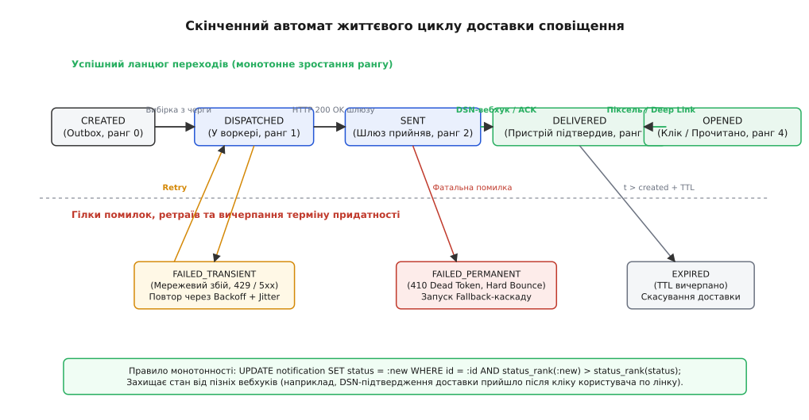
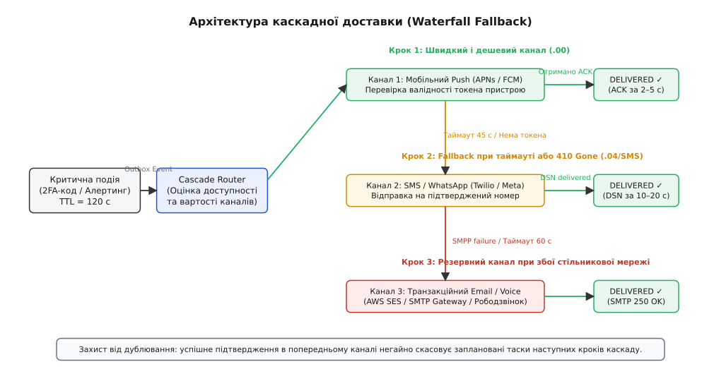

# Відстеження доставки сповіщень: стани, зворотний зв'язок і каскадні fallback-маршрути

<preknowlist>
- [REST і HTTP](topic:com-protocol/rest-api) — статус-коди відповідей 2xx/4xx/5xx, семантика POST-запитів та асинхронні DSN-вебхуки.
- [Черга задач](topic:sf-web/background-jobs) — асинхронне виконання важких операцій, відкладені таймери та обробка збоїв через воркери.
- [Вузол сповіщень (Fanout)](topic:sf-web/notification-fanout) — розгортання бізнес-подій у множину каналів зв'язку та батчинг.
- [Ідемпотентність методів як частина контракту](topic:com-protocol/api-idempotency) — захист від повторної обробки однакових квитанцій і вебхуків від провайдерів.
- [Push як канал ОС](topic:sf-apps/push-notifications) — мобільні push-шлюзи APNs/FCM, життєвий цикл фонових повідомлень та розширення сервісів.
</preknowlist>

Коли користувач інтернет-банкінгу підтверджує переказ коштів на суму 50 000 гривень із невідомого пристрою, сервіс аутентифікації генерує одноразовий код підтвердження (2FA/OTP), формує вихідний HTTP POST-запит до REST API телеком-провайдера, отримує статус-код `200 OK` із JSON-відповіддю `{"status": "queued", "msg_id": "sms_9012"}` і негайно записує в базу даних стан `SENT`. За дві секунди телеком-агрегатор відхиляє відправку через невалідний альфанумеричний підпис відправника або відсутність базової станції в зоні перебування абонента. Користувач не отримує код, десятихвилинна платіжна сесія завершується аварійним таймаутом, а служба технічної підтримки впевнено стверджує, що повідомлення «успішно надіслано», спираючись на статус у власній базі.

Ця розбіжність виникає через змішування факту відправки запиту з фактом фізичного отримання повідомлення людиною. У розподілених системах виклик провайдера — це лише фіксація наміру. Доставка сповіщень вимагає точного скінченного автомата станів, телеметрії зворотного зв'язку від шлюзів, суворого контролю термінів придатності (TTL) та автоматичного каскадного перемикання каналів (Waterfall Fallback).

## 1. Анатомія розриву доставки: п'ять меж між сервером і користувачем

Шлях повідомлення від моменту генерації бізнес-події до моменту появи тексту на дисплеї мобільного пристрою перетинає п'ять незалежних архітектурних меж передачі контролю:

```
[Бекенд-сервіс]
       │
       ▼ (Межа 1: Черга повідомлень)
[Черга задач / Брокер Kafka]
       │
       ▼ (Межа 2: HTTP API Шлюзу)
[Шлюз провайдера (Twilio / FCM / SES)]
       │
       ▼ (Межа 3: Інфраструктура доставки)
[Телеком-оператор / Мережа APNs / SMTP-сервер]
       │
       ▼ (Межа 4: Радіоефір та ОС)
[Фізичний пристрій (Android / iOS / Комп'ютер)]
       │
       ▼ (Межа 5: Людина)
[Екран користувача / Відкриття додатку]
```

### Межа 1: Сервіс бізнес-логіки → Брокер повідомлень

Сервіс авторизації або білінгу генерує повідомлення і надсилає його до черги повідомлень (RabbitMQ, Kafka або Amazon SQS). Якщо в момент відправки стається збій з'єднання з брокером, а в коді не налаштовано транзакційний шаблон Outbox, повідомлення втрачається ще до початку обробки. Якщо ж воркер черги падає посеред виконання без фіксації зміщення (offset commit), повідомлення буде зчитане повторно іншим воркером, створюючи небезпеку дублювання.

### Межа 2: Воркер бекенду → HTTP REST API провайдера

Воркер формує мережевий виклик до зовнішнього сервісу (наприклад, Twilio, SendGrid або Firebase Cloud Messaging). Ця межа схильна до класичних мережевих збоїв: розрив TCP-з'єднання, помилка TLS-рукостискання, таймаут читання сокета (Read Timeout), вичерпання лімітів частоти запитів (`429 Too Many Requests`) або внутрішня недоступність шлюзу (`503 Service Unavailable`). 

Якщо клієнтський HTTP-клієнт зазнає обриву з'єднання за таймаутом через 5 секунд після відправки, сервер опиняється в стані невизначеності: невідомо, чи встиг провайдер прийняти пакет до того, як обірвався сокет. Повторна відправка запиту наосліп без спеціального унікального ключа ідемпотентності (`Idempotency-Key`) неминуче спричиняє відправку двох однакових SMS або транзакційних листів, подвоюючи витрати компанії.

### Межа 3: Шлюз провайдера → Телеком-мережа або хмарна інфраструктура

Провайдер повертає клієнту успішний HTTP-статус `200 OK`. Це підтверджує виключно факт валідації вхідних полів та збереження повідомлення у внутрішній базі даних шлюзу. Провайдер призначає повідомленню власний ідентифікатор (`provider_message_id`) та ставить його в чергу на передачу в мережу стільникового оператора (через SMPP-з'єднання) або в поштову чергу SMTP.

На цьому етапі виникає безліч причин відмови, про які шлюз дізнається значно пізніше:
- Номер телефону абонента заблоковано або перенесено до іншого оператора (MNP — Mobile Number Portability) без оновлення глобальних таблиць маршрутизації.
- Текст повідомлення або альфанумеричне ім'я відправника (Sender ID) потрапили під евристичні фільтри захисту від спаму національного регулятора зв'язку.
- Поштовий сервер отримувача (наприклад, Gmail або Outlook) відхилив з'єднання через відсутність або некоректні підписи DKIM, SPF чи політику DMARC.

### Межа 4: Інфраструктура доставки → Фізичний пристрій

Повідомлення успішно передане в мобільну радіомережу або пуш-сервери Apple (APNs) та Google (FCM). Але фізичний пристрій абонента може перебувати поза зоною досяжності: телефон вимкнено, активовано «режим польоту», пристрій знаходиться в екранованому підвальному приміщенні або потрапив під обмеження енергозбереження операційної системи.

Сучасні мобільні операційні системи жорстко обмежують фонову активність радіомодулів:
- **Android Doze Mode**: система об'єднує мережеву активність у рідкісні періодичні вікна (maintenance windows). Пуш-повідомлення зі звичайним пріоритетом (`normal priority`) відкладаються на кілька годин до моменту, поки користувач не увімкне екран або не підключить зарядний пристрій.
- **iOS Low Power Mode та Focus Filters**: фонові оновлення даних блокуються, а доставка банерів відкладається до запланованого користувачем зведення (Scheduled Summary).

### Межа 5: Фізичний пристрій → Сприйняття людиною

Повідомлення фізично доставлене на пристрій, однак користувач міг повністю вимкнути банери сповіщень у системних налаштуваннях додатка, електронний лист автоматично переміщено алгоритмами сортування у вкладку «Промоакції» чи папку «Спам», або ж звук повідомлення заглушено режимом «Не турбувати».

З цих п'яти меж випливає головний закон проектування надійної доставки: **підтвердження прийому пакета зовнішнім API (`HTTP 200 OK`) означає лише фіксацію наміру провайдера обробити повідомлення, а не факт доставки сповіщення користувачеві.**

## 2. Скінченний автомат життєвого циклу сповіщення

Щоб відображати реальний стан повідомлення в розподіленому середовищі, життєвий цикл сповіщення моделюється як строго детермінований скінченний автомат (Finite State Machine, FSM). Кожен стан автомата має чітко визначену семантику, належить до одного з трьох типів і має числовий ранг.

| Стан (Status) | Ранг | Тип стану | Опис події та семантика |
| :--- | :--- | :--- | :--- |
| `CREATED` | 0 | Проміжний | Запис збережено в базі даних бекенду, визначено маршрут каскаду. |
| `DISPATCHED` | 1 | Проміжний | Повідомлення вичитано з черги воркером та передано у вихідний сокет. |
| `SENT` | 2 | Проміжний | Шлюз провайдера підтвердив прийом пакета (`200 OK` або `submit_sm_resp`). |
| `DELIVERED` | 3 | Фінальний успіх | Отримано квитанцію про фізичну доставку на пристрій абонента (DLR / ACK). |
| `OPENED` | 4 | Фінальний успіх | Користувач взаємодіяв зі сповіщенням (відкрив додаток, клікнув по банеру). |
| `CLICKED` | 5 | Фінальний успіх | Зафіксовано перехід за цільовим URL-посиланням усередині повідомлення. |
| `FAILED_TRANSIENT` | -1 | Помилка | Тимчасовий збій (таймаут, 429, 503). Дозволено повторні спроби (retry). |
| `FAILED_PERMANENT` | -2 | Фатальний збій | Неіснуючий номер, невалідний токен (410), Hard Bounce. Потрібен fallback. |
| `EXPIRED` | -3 | Фатальний збій | Вичерпано термін придатності (TTL). Подальші спроби заборонено. |


*Скінченний автомат життєвого циклу доставки сповіщень: монотонний рух статусів від створення до відкриття з обробкою тимчасових збоїв, фатальних відмов та вичерпання TTL.*

### Матриця дозволених переходів автомата

Не всі переходи між станами є фізично або логічно коректними. Скінченний автомат керується суворою матрицею валідності:

| Поточний стан | Дозволені наступні стани | Заборонені переходи (ігноруються) |
| :--- | :--- | :--- |
| `CREATED` | `DISPATCHED`, `FAILED_PERMANENT`, `EXPIRED` | `DELIVERED`, `OPENED`, `CLICKED` |
| `DISPATCHED` | `SENT`, `FAILED_TRANSIENT`, `FAILED_PERMANENT`, `EXPIRED` | `OPENED`, `CLICKED` |
| `SENT` | `DELIVERED`, `FAILED_TRANSIENT`, `FAILED_PERMANENT`, `EXPIRED` | `CREATED`, `DISPATCHED` |
| `DELIVERED` | `OPENED`, `CLICKED` | `CREATED`, `DISPATCHED`, `SENT`, `FAILED_PERMANENT` |
| `OPENED` | `CLICKED` | Усі стани з рангом < 4 |
| `CLICKED` | Фінальний термінальний стан | Будь-які переходи |
| `FAILED_PERMANENT` | Термінальний стан для поточної спроби | `SENT`, `DELIVERED` |
| `EXPIRED` | Фінальний стан для всього повідомлення | Будь-які переходи |

### Принцип монотонності та захист від неупорядкованих подій (Out-of-Order DSN)

У розподілених мережах пакети телеметрії від різних шлюзів та клієнтських додатків передаються через незалежні асинхронні канали і не гарантують збереження хронологічного порядку. 

Розглянемо типовий сценарій виникнення гонки статусів (Race Condition):
1. Користувач отримує SMS-повідомлення з одноразовим посиланням для входу в систему.
2. Протягом першої секунди користувач натискає на посилання. Браузер робить HTTP GET-запит на бекенд авторизації, і сервер негайно фіксує перехід стану сповіщення у фінальний статус `OPENED` (ранг 4).
3. Через чотири секунди телеком-провайдер пакетно обробляє чергу доставки і надсилає асинхронний DSN-вебхук зі статусом `DELIVERED` (ранг 3).

Якщо обробник вебхуків виконує прямий неконтрольований запис нового статусу в базу даних, старіша подія `DELIVERED` перезапише новіший стан `OPENED`. В результаті аналітична воронка втратить подію переходу, спотворивши показники конверсії бізнесу.

Для гарантії коректності діє правило монотонності: перехід між позитивними статусами дозволений лише за умови зростання рангу:

```
ранг(новий_стан) > ранг(поточний_стан)
```

У реляційній базі даних (наприклад, PostgreSQL) монотонне оновлення захищається на рівні атомарного SQL-запиту:

```sql
UPDATE notification_attempts
SET 
    status = :new_status,
    updated_at = NOW()
WHERE id = :attempt_id
  AND (
      -- Дозволяємо перехід уперед за прогресивною шкалою успіху
      status_rank(:new_status) > status_rank(status)
      -- Дозволяємо перехід у термінальну помилку лише до моменту фізичної доставки
      OR (:new_status IN ('FAILED_PERMANENT', 'EXPIRED') AND status_rank(status) < status_rank('DELIVERED'))
  );
```

Якщо жоден рядок не оновився (`rows_affected == 0`), це означає, що система вже зафіксувала вищий рівень прогресу, і старіший вебхук відхиляється як застарілий дублікат.

## 3. Протоколи та зворотний зв'язок за каналами

Кожен канал передачі інформації спирається на власні низькорівневі протоколи та має специфічну телеметрію зворотного зв'язку.

### Мобільні Push-сповіщення (Apple APNs та Google FCM)

- **Протокол передачі та синхронна відповідь**: бекенд взаємодіє з APNs за протоколом HTTP/2 через постійні мультиплексовані TLS-з'єднання. При успішному прийомі пакета Apple повертає статус `200 OK` із заголовком `apns-id`. Якщо ж користувач видалив мобільний додаток або скасував дозволи на сповіщення, APNs повертає синхронну помилку `410 Unregistered` або `400 BadDeviceToken`. Це сигнал для бекенду негайно видалити пристрій із реєстру активних токенів користувача.
- **Отримання підтвердження фізичної доставки (ACK)**: сервери Apple та Google з міркувань приватності та оптимізації трафіку не надсилають вебхуки про показ банера. Щоб зафіксувати перехід у стан `DELIVERED`, у клієнтський мобільний додаток вбудовують розширення сповіщень: `UNNotificationServiceExtension` для iOS та `FirebaseMessagingService` для Android. 
Коли пристрій отримує пуш-пакет із прапорцем `"mutable-content": 1`, операційна система пробуджує розширення у фоновому режимі до появи банера. Розширення виконує короткий фоновий HTTP POST-запит (`/api/v1/delivery/ack`) до API бекенду з ідентифікатором сповіщення. Якщо протягом встановленого таймауту (наприклад, 45 секунд) ACK-запит не надходить, система вважає доставку через Push невдалою і запускає резервний канал.

### SMS-повідомлення та месенджери (SMPP, Twilio, Viber)

- **Двоетапна квитанція SMPP**: взаємодія з телеком-шлюзами часто будується на бінарному протоколі SMPP версії 3.4. Бекенд надсилає пакет `submit_sm`. Шлюз повертає квитанцію `submit_sm_resp` із кодом `command_status = 0x00000000` (успішна постановка в чергу SMSC, стан `SENT`).
- **Звіт про доставку (Delivery Receipt, DLR)**: коли базовий комутатор оператора отримує сигнал від сім-карти абонента, шлюз генерує асинхронний пакет `deliver_sm` із полем `short_message`, яке містить розширений рядок телеметрії:
  - `stat:DELIVRD` (доставлено на телефон) → перехід у `DELIVERED`;
  - `stat:EXPRD` (термін зберігання в SMSC вичерпано, телефон не з'явився в мережі) → перехід у `FAILED_PERMANENT`;
  - `stat:UNDELIV` (неможливо доставити через збій комутатора або помилку маршрутизації) → перехід у `FAILED_PERMANENT`;
  - `stat:REJECTD` (відхилено спам-фільтром оператора або чорним списком) → перехід у `FAILED_PERMANENT`.
- **Складені SMS-повідомлення (Multipart Concatenated SMS)**: повідомлення довжиною понад 160 символів латинкою або 70 символів кирилицею розбиваються на кілька фрагментів (UDH — User Data Header). DLR-звіт надходить окремо для кожної частини. Статус `DELIVERED` для агрегату виставляється виключно тоді, коли мобільний комутатор підтвердив прийом усіх без винятку фрагментів, інакше абонент побачить обірваний текст.
- **Вплив кодування GSM-7 vs UCS-2 на білінг та фрагментацію**: текстове SMS у кодуванні GSM 03.38 вміщує до 160 символів в одному сегменті. Додавання хоча б одного кириличного символу або емодзі змушує шлюз перемкнути весь текст у кодування UCS-2 (UTF-16BE), де максимальна місткість сегмента падає до 70 символів, а для складених повідомлень — до 67 символів через накладні витрати 6-байтного заголовка UDH. Це збільшує кількість сегментів та собівартість відправки у 2.3 рази.

### Транзакційний Email (SMTP, AWS SES, SendGrid)

- **Класифікація помилок (Bounces за стандартом RFC 3463)**:
  - **Hard Bounce (5xx)**: перманентна помилка доставки (наприклад, `550 5.1.1 User unknown` — поштової адреси не існує, або домен не має MX-записів). Адреса автоматично поміщається в глобальний список блокувань (Suppression List), а повідомлення переходить у статус `FAILED_PERMANENT`.
  - **Soft Bounce (4xx)**: тимчасова помилка (наприклад, `452 4.2.2 Mailbox full` — поштова скринька переповнена, або `421 4.4.1 Service not available` — поштовий сервер перевантажений). Стан переходить у `FAILED_TRANSIENT`, воркер планує повторну відправку.
  - **Скарги на спам (Spam Complaints / Feedback Loops)**: поштовий сервіс надсилає звіт за стандартом ARF (Authentication Reporting Format), коли користувач натискає кнопку «Це спам». Подальша відправка повідомлень цій особі блокується.
- **Трекінговий піксель та аномалія Apple Mail Privacy Protection (MPP)**: класичний метод фіксації відкриття листа полягає у додаванні прихованого прозорого зображення розміром 1×1 піксель: ``. 
Проте починаючи з релізу iOS 15 та macOS Monterey, поштовий клієнт Apple Mail автоматично завантажує всі картинки через проксі-сервери одразу в момент прибуття листа на сервер, не чекаючи, поки людина його відкриє. Це генерує масові псевдовідкриття («Ghost Opens»). Єдиним надійним підтвердженням взаємодії з Email-повідомленням залишається перехід користувача за посиланням, підписаним криптографічним ключем HMAC.

### Внутрішні сповіщення (In-App, WebSockets, SSE)

- **Миттєва доставка в активній сесії**: якщо користувач тримає відкритим веб-додаток або активне вікно на комп'ютері, повідомлення передається через відкрите WebSocket-з'єднання. Клієнтська частина JavaScript надсилає зворотний кадр (ACK) одразу після рендерингу повідомлення в UI-компоненті. Якщо WebSocket-з'єднання розірвано або відсутній пінг протягом 5 секунд, сесія вважається неактивною, і повідомлення спрямовується в Push або SMS.

## 4. Каскадна маршрутизація та перемикання каналів (Waterfall Fallback)

Коли повідомлення має критичне значення для бізнесу або безпеки (двофакторна авторизація, підтвердження платіжної транзакції, сповіщення про зміну пароля), покладатися на один канал категорично заборонено. Каскадна доставка поєднує декілька каналів у єдиний маршрутизатор, де перехід між кроками відбувається за принципом висхідної вартості та спадної швидкості.

### Економічна та швидкісна матриця каналів

| Канал зв'язку | Собівартість (за 1 шт) | Середня затримка доставки | Ймовірність миттєвого перегляду |
| :--- | :--- | :--- | :--- |
| **Push (APNs / FCM)** | $0.0000 | 1–3 секунди | 60–80% (якщо телефон у руках) |
| **In-App (WebSocket)** | $0.0000 | < 500 мс | 95% (якщо активна веб-сесія) |
| **SMS-повідомлення** | $0.0300–$0.0800 | 5–15 секунд | 90–95% (працює без інтернету) |
| **Месенджери (Viber/WA)**| $0.0200–$0.0500 | 2–8 секунд | 75–85% (потрібен інтернет) |
| **Транзакційний Email** | $0.0008–$0.0015 | 10–60 секунд | 20–40% (перевіряють періодично) |
| **Голосовий дзвінок (IVR)**| $0.1000–$0.2500 | 5–10 секунд | 85–90% (прямий виклик абонента) |


*Архітектура каскадної доставки сповіщень: послідовний перехід між каналами за таймаутами або помилками зі скасуванням наступних кроків при отриманні підтвердження.*

### Алгоритм водоспаду (Waterfall Cascade)

1. **Крок 1 (Мобільний Push)**: диспетчер генерує безкоштовний Push-пакет до APNs/FCM і встановлює асинхронний таймер очікування квитанції T₁ = 45 секунд.
2. **Успішне підтвердження**: якщо протягом 45 секунд від мобільного додатка приходить клієнтський ACK (`DELIVERED`) або користувач розблоковує телефон і натискає на банер (`OPENED`), таймер T₁ негайно скасовується. Каскад зупиняється на першому кроці, заощаджуючи гроші бізнесу.
3. **Таймаут або фатальна помилка першого кроку**: якщо час T₁ спливає без квитанції, або шлюз APNs одразу повертає помилку `410 Unregistered`, диспетчер ініціює Крок 2 — відправку SMS-повідомлення, запускаючи наступний таймер T₂ = 60 секунд.
4. **Крок 3 (Транзакційний Email або голосовий виклик IVR)**: якщо від стільникового оператора надходить DLR-звіт про помилку доставки SMS або час T₂ вичерпано без підтвердження, система автоматично надсилає транзакційний Email або здійснює голосовий дзвінок (IVR), де робот зачитує одноразовий код голосом.

### Захист від гонки таймерів

Якщо користувач перебував у ліфті й отримав Push на 46-й секунді (коли SMS уже поставлено в чергу на відправку), він відкриває додаток, переводячи стан агрегату в `OPENED`. 

Воркер SMS-черги безпосередньо перед формуванням платного виклику до API провайдера зобов'язаний виконати перевірку актуального стану батьківського повідомлення: якщо статус уже дорівнює `DELIVERED` або `OPENED`, воркер скасовує вихідний запит до шлюзу, захищаючи користувача від спаму, а компанію — від списання коштів.

## 5. Термін придатності та дедлайни (Time-to-Live, TTL)

Повідомлення, доставлене з запізненням, створює загрозу безпеці або завдає прямих фінансових збитків бізнесу. Час життєвого циклу повідомлення визначається формулою:

```
t_expire = t_created + TTL
```

| Тип бізнес-події | Рекомендований TTL | Наслідок доставки після дедлайну |
| :--- | :--- | :--- |
| **2FA / OTP Паролі** | 90–180 секунд | Загроза перехоплення або блокування облікового запису |
| **Подача таксі / Кур'єр** | 3–10 хвилин | Клієнт не вийде вчасно, водій скасує замовлення зі штрафом |
| **Знижки та промоакції** | 6–24 години | Роздратування користувача застарілою пропозицією |
| **Щомісячна виписка банку** | 30 днів | Немає критичного впливу фактора часу |

### Прокидання дедлайнів у заголовки провайдерів

Диспетчер доставки передає параметри терміну придатності у низькорівневі заголовки транспортних протоколів:
- **APNs (Apple)**: HTTP/2 заголовок `apns-expiration: 1724108800` (Unix Epoch Timestamp). Якщо пристрій перебуває поза мережею, сервери Apple автоматично видаляють пакет зі своєї черги в зазначений момент, не намагаючись доставити його після ввімкнення телефону.
- **FCM (Android)**: поле в JSON-тілі `"time_to_live": 90` (час життя пакета в секундах).
- **SMPP (SMS)**: поле бінарного заголовка `validity_period` у форматі GSM 03.40 (наприклад, `"000000000200000R"` — відносний термін життя 2 хвилини).

Перед виконанням кожного кроку каскаду воркер перевіряє умову: якщо поточний час перевищує `expires_at`, спроба негайно скасовується, стан повідомлення переводиться в `EXPIRED`, а користувач не отримує застарілих повідомлень.

## 6. Архітектура сховища даних та обробка високих навантажень

Під час проведення масових транзакційних розсилок або ранкових піків активності (десятки мільйонів повідомлень) надходження DSN-вебхуків створює навантаження в десятки тисяч вхідних HTTP-запитів на секунду. 

Спроба оновлювати таблицю повідомлень синхронно на кожен вхідний вебхук призведе до блокування рядків у базі даних, вичерпання пулу з'єднань СУБД та падіння сервісу.

### Реляційна схема (PostgreSQL DDL)

Для ефективної обробки життєвого циклу дані розділяються на три рівні: агрегат повідомлення (`notifications`), історія спроб за кожним каналом (`notification_attempts`) та сирий буферний журнал подій (`delivery_events`).

```sql
CREATE TYPE delivery_status_enum AS ENUM (
  'CREATED', 'DISPATCHED', 'SENT',
  'DELIVERED', 'OPENED', 'CLICKED',
  'FAILED_TRANSIENT', 'FAILED_PERMANENT', 'EXPIRED'
);

-- Таблиця агрегатів повідомлень (секціонована за часом створення)
CREATE TABLE notifications (
  id UUID PRIMARY KEY,
  user_id UUID NOT NULL,
  cascade_route TEXT[] NOT NULL,
  current_status delivery_status_enum NOT NULL DEFAULT 'CREATED',
  expires_at TIMESTAMPTZ NOT NULL,
  created_at TIMESTAMPTZ NOT NULL DEFAULT NOW(),
  updated_at TIMESTAMPTZ NOT NULL DEFAULT NOW()
) PARTITION BY RANGE (created_at);

-- Таблиця окремих спроб відправки через кожен канал
CREATE TABLE notification_attempts (
  id UUID PRIMARY KEY,
  notification_id UUID NOT NULL,
  channel TEXT NOT NULL,
  provider TEXT NOT NULL,
  provider_msg_id TEXT,
  status delivery_status_enum NOT NULL,
  error_code TEXT,
  dispatched_at TIMESTAMPTZ NOT NULL,
  updated_at TIMESTAMPTZ NOT NULL
);

-- Буферний журнал сирих вебхуків для швидкого прийому телеметрії
CREATE TABLE delivery_events (
  event_id TEXT PRIMARY KEY,
  notification_id UUID NOT NULL,
  status delivery_status_enum NOT NULL,
  raw_payload JSONB NOT NULL,
  received_at TIMESTAMPTZ NOT NULL DEFAULT NOW()
);
```

### Асинхронна буферизація вебхуків через брокер повідомлень

1. **Швидкий прийом**: вхідний веб-сервіс приймає HTTP POST-запит від провайдера, перевіряє криптографічний підпис у заголовку (HMAC-SHA256), скидає сирий JSON-пакет у чергу Kafka або Redis Streams і негайно відповідає шлюзу статусом `HTTP 200 OK`. Час обробки запиту становить менше ніж 5 мілісекунд.
2. **Партиціонування в Kafka за ідентифікатором користувача**: повідомлення телеметрії відправляються в Kafka з ключем `user_id`. Це гарантує, що всі події доставки для конкретного користувача потрапляють до однієї партиції брокера і вичитуються строго послідовно, виключаючи стан гонки між паралельними воркерами.
3. **Пакетне оновлення (Batch Updates)**: фоновий воркер вичитує події з Kafka пачками (по 500–1000 штук), здійснює дедуплікацію за `event_id` та виконує оновлення бази даних одним SQL-запитом через конструкцію `UPDATE ... FROM (VALUES ...)`:

```sql
UPDATE notification_attempts AS na
SET 
    status = v.status::delivery_status_enum,
    updated_at = NOW()
FROM (VALUES 
    ('550e8400-e29b-41d4-a716-446655440001'::uuid, 'DELIVERED'),
    ('550e8400-e29b-41d4-a716-446655440002'::uuid, 'FAILED_PERMANENT')
) AS v(attempt_id, status)
WHERE na.id = v.attempt_id
  AND status_rank(v.status::delivery_status_enum) > status_rank(na.status);
```

## 7. Виробничі пастки та крайові випадки

1. **Фантомні відкриття («Ghost Opens») антивірусними сканерами**: корпоративні поштові системи безпеки (Proofpoint, Microsoft Defender) автоматично переходять за всіма URL-посиланнями в листі для перевірки на фішинг. Якщо зміна бізнес-стану (наприклад, підтвердження реєстрації або скидання пароля) відбувається за простим GET-запитом, бот-сканер самостійно активує дію користувача. Захист полягає у показі проміжної HTML-сторінки з кнопкою підтвердження, яка надсилає POST-запит із CSRF-токеном.
2. **Зомбі-повтори (Zombie Retries)**: якщо шлюз Twilio через внутрішнє перевантаження повертає помилку `504 Gateway Timeout`, але насправді встиг надіслати SMS оператору, повторна відправка воркером без унікального заголовка `Idempotency-Key` призведе до подвійного списання коштів та повторного повідомлення клієнту.
3. **Лавинні збої DSN-ендпоінта (Telemetry DOS)**: якщо ендпоінт прийому вебхуків стає недоступним на 15 хвилин, провайдери починають накопичувати та експоненційно повторювати всі невдалі вебхуки. Коли сервіс піднімається, його накриває лавина повторних запитів. Буферизація в чергу брокера без синхронного блокування таблиць бази даних усуває ризик падіння всієї інфраструктури.
4. **Аудитор завислих повідомлень (Reconciliation Cron)**: періодичний фоновий процес сканує записи, які перебувають у стані `DISPATCHED` понад 15 хвилин без оновлень, та ініціює прямий опитувальний REST-запит до API провайдера для примусового з'ясування реального статусу доставки.

## 8. Моніторинг, метрики здоров'я та SLA воронки доставки

Для забезпечення прозорості доставки на рівні інфраструктури розгортають систему метрик на базі Prometheus та OpenTelemetry:

```
notifications_dispatched_total{channel="push", provider="apns"}
notifications_delivered_total{channel="push", provider="apns"}
notifications_failed_total{channel="push", reason="unregistered"}
notification_delivery_duration_seconds{channel="sms", le="10"}
```

Ключові показники ефективності воронки (SLA Key Performance Indicators):
1. **Коефіцієнт доставки (Delivery Rate)**: відсоток повідомлень, які перейшли зі стану `SENT` у `DELIVERED`. Норма для мобільного Push становить 92–98%, для SMS — 95–99%, для транзакційного Email — 98–99.5%. Падіння показника нижче 90% сигналізує про аварію на стороні телеком-оператора або блокування IP-адрес відправника.
2. **Коефіцієнт конверсії відкриттів (Open Rate)**: відсоток повідомлень, які перейшли зі стану `DELIVERED` у `OPENED`. Для 2FA-паролів норма перевищує 90%, для маркетингових повідомлень становить 15–25%.
3. **Середній час доставки (P95 Delivery Latency)**: час між створенням повідомлення (`CREATED`) та фіксацією фізичної доставки (`DELIVERED`). Для Push-каналів P95 не повинен перевищувати 3.5 секунди, для SMS — 12 секунд.

## 9. Розподілене трасування (Distributed Tracing) через W3C TraceContext

Для наскрізного аудиту життєвого циклу повідомлення бекенд генерує унікальний ідентифікатор трасування за стандартом W3C:
`traceparent: 00-4bf92f3577b34da6a3ce929d0e0e4736-00f067aa0ba902b7-01`.

Цей заголовок прокидається крізь усі компоненти системи:
1. Зберігається як метадані в повідомленні Kafka при первинній ініціалізації.
2. Передається в HTTP-заголовках до REST API SMS-шлюзу або APNs.
3. Повертається назад у вхідному DSN-вебхуку від провайдера як кореляційний тег.
4. Вбудовується в structured JSON-логи сервісів для агрегації в Elasticsearch/Grafana Loki.

Це дозволяє інженерам під час розслідування інцидентів за одним кліком в інтерфейсі Jaeger або Grafana Tempo побачити повну хронологічну діаграму проходження повідомлення крізь усі черги, шлюзи та мережеві стрибки.

## 10. Аварійне перемикання при блекаутах телеком-провайдерів (Multi-Vendor Failover)

Жоден телеком-провайдер не застрахований від глобальних аварій: обривів магістрального оптоволокна, збоїв BGP-маршрутизації або перевантаження шлюзів SMSC під час масових свят. Якщо сервіс покладається лише на одного SMS-агрегатора (наприклад, тільки Twilio або тільки Infobip), будь-яка аварія на стороні партнера миттєво паралізує бізнес-процеси реєстрації та авторизації.

### Архітектура резервування провайдерів (Multi-Active Routing)

Для забезпечення безперебійної роботи розгортають мультипровайдерну схему з динамічним розподілом трафіку:

1. **Балансування ваг (Traffic Weighting)**: за нормальних умов 80% SMS-трафіку спрямовується на основного провайдера з найкращим тарифом, а 20% — на резервного провайдера для постійного прогріву з'єднань (SMPP bind) та перевірки актуальності маршрутів.
2. **Автоматичний запобіжник (Circuit Breaker)**: якщо протягом 60 секунд відсоток помилок від основного провайдера перевищує 15% (помилки з'єднання `5xx`, таймаути сокетів або сплеск статусів `stat:UNDELIV`), Circuit Breaker переходить у стан `OPEN`. Увесь вихідний потік SMS миттєво перенаправляється на резервний шлюз.
3. **Плавне повернення (Half-Open Probing)**: через 5 хвилин система надсилає тестову пачку з 50 повідомлень через основного постачальника. Якщо 100% спроб завершуються успіхом, балансування повертається до стандартного співвідношення.

## 11. Практичний висновок та реалізація

> 🔧 **Навіщо це.** Побудова надійного конвеєра відстеження доставки усуває ілюзію «відправив — значить дійшло», гарантує доставку критичних повідомлень через автоматичний каскад (Push → SMS → Email), захищає бізнес від перевитрат коштів на дорогі канали та надає прозору аналітику конверсії воронки.

[Повна інженерна реалізація скінченного автомата доставки, каскадного маршрутизатора та ідемпотентного приймача вебхуків](topic:sf-web/delivery-tracking/proj-delivery-tracker.md).
