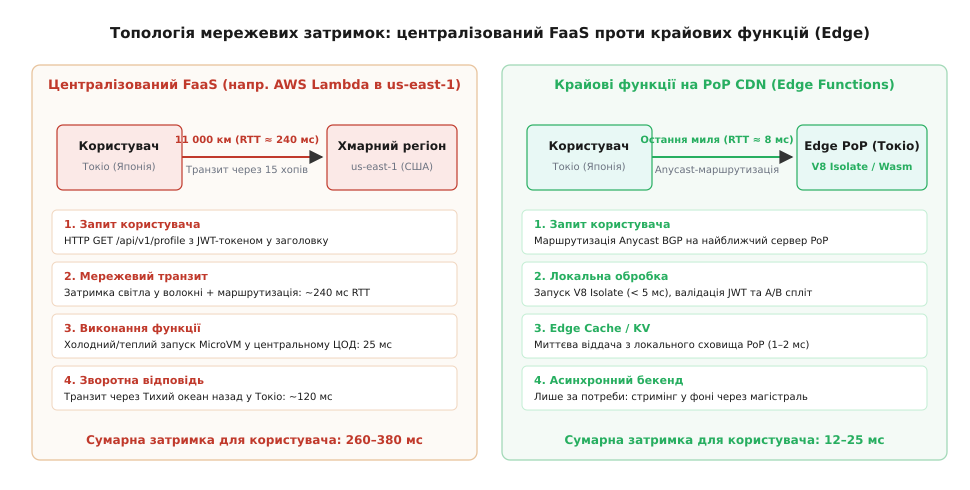
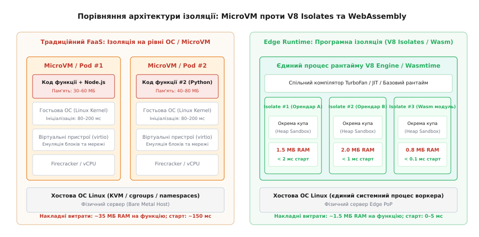
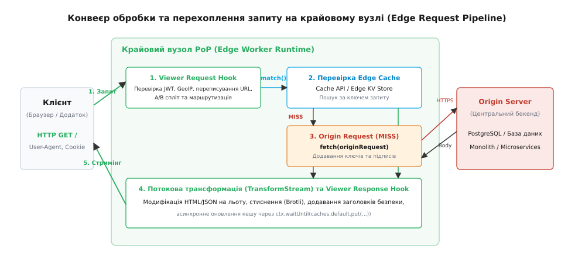

# Крайові функції: виконання коду на CDN-вузлах (Edge Functions)

<preknowlist>
- [Serverless/FaaS](root:sf-release/serverless-faas) — життєвий цикл функцій без виділеного сервера, події та холодний запуск.
- [Патерни кешування](root:sf-data/caching-strategies) — стратегії витіснення, інвалідація та час життя записів.
- [Контейнери](root:sf-os/containers) — ізоляція просторів назв, контрольні групи та межі ресурсів процесу.
- [HTTP-кешування](root:com-protocol/http-caching) — умовні запити, заголовки Cache-Control, ETag та поведінка проксі.
</preknowlist>

Коли мобільний додаток користувача в Токіо робить запит до бекенду, розгорнутого у дата-центрі Північної Вірджинії (`us-east-1`), мережевий пакет долає 11 000 кілометрів оптоволоконних магістралей. Через фізичну швидкість поширення світла в склі (близько 200 000 км/с) та затримки комутації на 15 проміжних маршрутизаторах мінімальний час кругового звернення (англ. *Round-Trip Time*, RTT) становить 240 мілісекунд. Навіть якщо центральний сервер виконує перевірку підпису токена або геолокаційне перенаправлення за 1 мілісекунду, користувач чекає чверть секунди на просте рукостискання TCP та TLS.

Традиційні мережі доставки контенту (англ. *Content Delivery Network*, CDN) розв'язували цю проблему розміщенням кешуючих серверів на точках присутності (англ. *Point of Presence*, PoP) в радіусі 5–15 мілісекунд від користувача. Проте класичний CDN працює виключно зі статичними файлами. Щойно виникає потреба перевірити заголовок автентифікації, провести A/B-тестування інтерфейсу, розібрати сесійні cookies чи виконати динамічний рендеринг сторінки (SSR), статичний кеш вимушено капітулює і перенаправляє весь трафік до центрального дата-центру.

Для подолання цього фізичного бар'єру виникли **крайові функції** (англ. *Edge Functions*, від англ. *edge* — край, межа; лат. *functio* — здійснення, виконання) — обчислювальна парадигма, що дозволяє виконувати користувацький код безпосередньо на сотнях розподілених PoP-вузлів CDN по всьому світу. Замість пасивного проксі крайовий сервер перетворюється на інтелектуальний програмований шлюз, який обробляє вхідний HTTP-трафік на відстані «останньої милі» від клієнта.


*Порівняння затримки клієнта в Токіо при зверненні до централізованого регіону us-east-1 (240+ мс RTT) та до локального крайового вузла CDN (5–12 мс).*

---

## Фізичний бар'єр затримки та межі централізованої хмари

Централізація хмарних обчислень створила нездоланну асиметрію між обчислювальною потужністю та мережевою затримкою. Процесори стають швидшими, ядра масштабуються до сотень потоків, але швидкість поширення електромагнітної хвилі в оптоволоконному кабелі залишається фундаментальною фізичною константою:

```
t_prop = (2 · d) ÷ (c ÷ n)
```

Де `d` — географічна відстань між клієнтом і дата-центром (м), `c` — швидкість світла у вакуумі (≈ 300 000 км/с), `n` — показник заломлення кварцового скла оптоволокна (≈ 1.468).

Для відстані між Токіо та Вірджинією (11 000 км в один бік) суто теоретична межа затримки світла туди й назад становить:

```
t_prop = (2 · 11 000 000) ÷ (300 000 000 ÷ 1.468)
       = 22 000 000 ÷ 204 359 673
       ≈ 0.1077 с = 107.7 мс
```

З урахуванням нелінійності прокладання підводних трансокеанських кабелів (коефіцієнт звивистості ≈ 1.3–1.5), затримок оптичних підсилювачів EDFA та часу буферизації в чергах маршрутизаторів BGP реальний RTT зростає до **220–260 мс**.

Якщо для завантаження сторінки веб-додаток здійснює послідовно TLS-рукостискання, перевірку сесії, отримання налаштувань користувача та завантаження персоналізованого контенту, сумарна затримка досягає 1–1.5 секунди. Перенесення коду обробки на найближчий PoP-вузол скорочує плече доставки до 50–200 км, зменшуючи фізичну затримку транспорту до **2–10 мс**.

Детально про те, як індустрія пройшла шлях від ранніх шаблонізаторів ESI та мови конфігурації Varnish VCL до повноцінних серверних середовищ виконання, розповідає [історія розвитку крайових обчислень від ESI до Isolates](root:sf-web/edge-functions/hist-edge-evolution.md).

---

## Мережева маршрутизація Anycast BGP: як запит знаходить найближчий край

Головний фундамент глобальної доступності крайових функцій — протокол динамічної маршрутизації **Anycast BGP** (Border Gateway Protocol).

У традиційній системі з фіксованими IP-адресами (Unicast) одна IP-адреса належить рівно одному фізичному серверу або балансувальнику в одному конкретному місті. Якщо клієнт із Сіднея робить DNS-запит для Unicast-адреси, розміщеної в Німеччині, пакети неминуче проходять через півсвіту.

У моделі Anycast сотні точок присутності CDN по всій земній кулі анонсують у глобальну таблицю маршрутизації Інтернету **одну й ту саму IP-адресу**:

```
                              ┌──► [PoP Франкфурт] (анонсує IP: 198.51.100.1)
[Клієнт (Берлін)] ──(BGP)────►┼──► [PoP Токіо]      (анонсує IP: 198.51.100.1)
                              └──► [PoP Сан-Паулу]  (анонсує IP: 198.51.100.1)
```

Коли інтернет-провайдер клієнта передає пакет, проміжні маршрутизатори обирають найкоротший шлях за метрикою кількості автономних систем (AS Path). Клієнт у Берліні автоматично з'єднується з дата-центром у Франкфурті, клієнт у Кіото — з Токіо, а клієнт у Ріо — з Сан-Паулу.

### Проблема зміни маршрутів (BGP Route Flapping)
Оскільки Anycast працює на мережевому рівні IP без збереження стану сесії, раптова зміна маршруту BGP у провайдера може призвести до того, що черговий TCP-пакет поточного з'єднання прилетить на інший дата-центр PoP. Крайові платформи вирішують це використанням розподілених протоколів узгодження сесій та інкапсуляції трафіку (наприклад, тунелювання через протокол Geneve або GRE між сусідніми PoP), гарантуючи, що активне з'єднання не обірветься.

---

## Чому традиційні контейнери та MicroVM провалюються на краю

У класичній моделі Serverless (наприклад, AWS Lambda або Google Cloud Functions) кожен обробник запускається у власному ізольованому контейнері або мікровіртуальній машині (MicroVM на базі гіпервізора Firecracker). Ця архітектура бездоганно працює в центральних дата-центрах, але виявляється фізично неспроможною в розподіленій крайовій інфраструктурі.

### 1. Вибух споживання оперативної пам'яті
Типова мережа CDN налічує від 300 до 450 точок присутності по всій планеті. На кожному крайовому вузлі працює обмежена кількість серверів, які одночасно повинні обслуговувати мільйони функцій тисяч різних клієнтів.
- Якщо запуск однієї функції в середовищі Node.js або Python усередині MicroVM вимагає мінімум **35–60 МБ** оперативної пам'яті (гостьове ядро Linux + копія середовища виконання + пам'ять програми);
- Утримання в теплому стані 50 000 активних функцій клієнтів на одному сервері вимагало б `50 000 · 40 МБ = 2 000 000 МБ ≈ 2 ТБ RAM` виключно під системний оверхед;
- Це робить підтримку теплих екземплярів економічно неможливою.

### 2. Катастрофа холодного старту (Cold Start Amplification)
Оскільки пам'яті бракує, платформа змушена миттєво знищувати віртуальні машини після завершення запиту. Коли трафік розподілений між 300 PoP-вузлами, ймовірність того, що наступний запит від конкретного користувача потрапить на вже прогріту MicroVM на даному конкретному PoP, падає нижче 5%.
- У результаті 95% крайових викликів зазнають **холодного запуску** тривалістю 150–500 мс (виділення vCPU, ініціалізація віртуальних пристроїв virtio, розгортання шарів образу, запуск ядра Linux);
- Холодний запуск повністю знищує будь-який виграш від географічної близькості PoP до клієнта.

---

## Архітектурна революція: V8 Isolates та WebAssembly

Вирішення проблеми пам'яті та холодного старту вимагало повної відмови від віртуалізації на рівні операційної системи на користь **програмної ізоляції всередині єдиного процесу**.


*Контейнери та MicroVM вимагають окремого ядра Linux та 30+ МБ пам'яті, тоді як V8 Isolates та модулі Wasm виконуються в єдиному процесі з мікросекундним запуском і 1–3 МБ на функцію.*

### 1. Модель V8 Isolates та стиснення вказівників (Pointer Compression)
Рушій JavaScript V8 (розроблений Google для Chromium) спочатку проектувався для ізоляції вкладок браузера, що виконують потенційно шкідливий JavaScript-код різних веб-сайтів в одному процесі.

**Ізолят (Isolate)** — це повністю незалежний екземпляр середовища виконання V8 із власною купою пам'яті (англ. *Heap*), власним збирачем сміття (Garbage Collector) та власним контекстом глобальних об'єктів.
- **Спільний базовий рантайм**: тисячі ізолятів різних клієнтів функціонують усередині одного системного процесу Linux;
- **Спільний JIT-компілятор**: механізми оптимізації TurboFan та компілятор Ignition завантажуються в пам'ять один раз і спільно обслуговують усі ізоляти;
- **Час створення ізоляту < 5 мілісекунд**: створення нового ізоляту зводиться до виділення кількох структур даних у пам'яті C++ без жодного системного виклику `fork()`, створення cgroups чи перемикання контексту ядра ОС;
- **Обсяг пам'яті 1–3 МБ на функцію**: на одному стандартному сервері PoP стає можливим одночасно утримувати понад 100 000 ізолятів.

Для максимальної економії пам'яті рушій V8 використовує технологію **Pointer Compression** (стиснення вказівників): замість 64-бітних абсолютних адрес у пам'яті всі об'єкти всередині ізоляту посилаються одне на одного 32-бітними відносними зміщеннями всередині виділеної 4-гігабайтної клітки (V8 Virtual Memory Cage). Це вдвічі знижує споживання RAM для об'єктів та масивів.

Безпека ізолятів гарантується строгим контролем адресного простору рушієм V8: код усередині ізоляту не має прямих вказівників на пам'ять процесу і може взаємодіяти з зовнішнім світом виключно через явно надані хостові функції (Bindings).

### 2. Модель WebAssembly (Wasm) та Wasmtime
Для мов системного рівня (Rust, C++, Go, Zig) застосовується компіляція у байткод WebAssembly під цільову архітектуру `wasm32-wasi`.
- **Лінійна пісочниця пам'яті (Linear Memory)**: модуль Wasm виконується в ізольованому безперервному масиві байтів. Будь-яке звернення за межі лінійного масиву апаратно перехоплюється захисними сторінками оперативної пам'яті (Guard Pages);
- **Ініціалізація за десятки мікросекунд**: завдяки компіляції Ahead-of-Time (AOT) модуль Wasm інстанціюється менш ніж за 50 мікросекунд;
- **Модель повноважень WASI**: скомпільований бінарний файл не має доступу до файлової системи, мережевих сокетів або системного годинника, якщо ці права явно не передані хостовим середовищем під час запуску.

---

## Безпека в багатоорендному середовищі: захист від атак побічними каналами

Виконання коду тисяч різних клієнтів усередині єдиного процесу операційної системи створює серйозні виклики безпеки, насамперед через апаратні вразливості процесорів (Spectre та Meltdown). Зловмисник міг би спробувати через спекулятивне виконання інструкцій процесора виміряти затримку доступу до кешу L1/L2 і прочитати байти пам'яті сусіднього ізоляту.

Для запобігання витоку даних крайові рантайми реалізують багаторівневий комплекс апаратного та програмного захисту:

1. **Штучне загрублення таймерів (Timer Fuzzing)**:
   Для успішної атаки Spectre необхідний доступ до таймера високої точності (із роздільною здатністю до наносекунд). У крайових рантаймах виклики `performance.now()` загрублюються до кількох мілісекунд і отримують випадковий псевдошум (Jitter), що робить вимірювання затримок кешу процесора статистично неможливим.
2. **Апаратна ізоляція кліток пам'яті (Memory Sandboxing)**:
   Усі інструкції звернення до пам'яті в V8 та WebAssembly транслюються у відносні зміщення від базового регістру клітки. Якщо код намагається звернутися за межі своєї 4 ГБ клітки, апаратна маска автоматично відсікає старші біти адреси, повертаючи вказівник усередину дозволеного діапазону.
3. **Фільтрація DDoS на рівні eBPF/XDP**:
   Перед тим як пакет потрапить у простір користувача та активує ізолят V8, мережева карта SmartNIC та ядро Linux фільтрують шкідливі SYN-флуди та аномальний трафік за допомогою програм eBPF (Extended Berkeley Packet Filter) за наносекунди без споживання ресурсів хоста.

---

## Конвеєр обробки запиту: життєвий цикл та точки перехоплення

Крайова функція не запускається постійно як фоновий демон і не слухає порт через системний виклик `listen()`. Вона вбудовується в конвеєр обробки трафіку зворотного проксі-сервера CDN як ланцюг перехоплювачів подій.


*Життєвий цикл запиту на Edge: перехоплення Viewer Request, перевірка кешу, формування Origin Request та потокова модифікація відповіді через TransformStream.*

Конвеєр складається з чотирьох послідовних точок перехоплення:

### 1. Перехоплювач запиту глядача (Viewer Request Hook)
Спрацьовує в момент прибуття HTTP-запиту від клієнта до крайового сервера PoP, **до перевірки локального кешу**.
- **Типові сценарії**:
  - Валідація токенів JWT / OAuth2 та негайне відсікання неавторизованих користувачів (`401 Unauthorized`) без навантаження на Origin;
  - Аналіз GeoIP-метаданих (`request.cf.country`, `city`) та перенаправлення на регіональний домен (`302 Redirect`);
  - Детермінований A/B-спліт користувачів на основі хешування сесійних cookies;
  - Нормалізація та канонізація URL-адрес для підвищення ефективності кешування (Cache Hit Ratio).

### 2. Перевірка крайового кешу (Cache Lookup)
Рантайм обчислює ключ кешування (Cache Key) та шукає збережену відповідь у локальному сховищі PoP (Cache API).
- **Cache HIT**: якщо ресурс знайдено і його термін придатності не закінчився, він негайно передається на четвертий етап (Viewer Response) за 1–3 мілісекунди;
- **Cache MISS**: запит переходить до наступного етапу перехоплювача.

### 3. Перехоплювач запиту до джерела (Origin Request Hook)
Спрацьовує, коли ресурсу немає в кеші, **перед тим, як відправити запит до центрального Origin-сервера**.
- **Типові сценарії**:
  - Динамічний вибір Origin-сервера (маршрутизація на найближчий бекенд у Франкфурті або Сінгапурі);
  - Додавання внутрішніх криптографічних підписів (HMAC-заголовків або клієнтських сертифікатів mTLS);
  - Збагачення запиту заголовками з розпізнаними даними користувача (`X-User-Id`, `X-User-Role`), що звільняє центральний бекенд від повторної автентифікації;
  - Заміна заголовка `Host` та модифікація шляху запиту.

### 4. Перехоплювач відповіді від джерела (Origin Response Hook)
Спрацьовує після отримання відповіді від центрального бекенду, **перед її збереженням у кеш PoP**.
- **Типові сценарії**:
  - Перевизначення заголовків кешування (`Cache-Control: s-maxage=3600`);
  - Видалення чутливих заголовків бекенду (`Set-Cookie`, `Server`, `X-Powered-By`) перед публічним кешуванням;
  - Обробка помилок бекенду (`500/502/503`) та повернення заздалегідь підготовленої резервної статичної сторінки (Graceful Fallback).

### 5. Перехоплювач відповіді глядачеві (Viewer Response Hook)
Спрацьовує безпосередньо перед відправленням фінальних байтів HTTP-відповіді назад клієнту.
- **Типові сценарії**:
  - Додавання безпекових HTTP-заголовків (`Strict-Transport-Security`, `Content-Security-Policy`, `X-Frame-Options`);
  - Налаштування заголовків міждоменного доступу (`Access-Control-Allow-Origin`);
  - Динамічна ін'єкція скриптів аналітики та персоналізованих блоків у вихідний HTML-потік.

Повні сигнатури типів, інтерфейси подій та параметри обробників детально описує [специфікація контракту стандартного середовища Edge Runtime](root:sf-web/edge-functions/api-edge-runtime.md).

---

## Потокова обробка даних без буферизації (Streams API)

Головне обмеження середовища V8 Isolates — суворий ліміт оперативної пам'яті (зазвичай **128 МБ** на ізолят). Якщо розробник спробує завантажити в пам'ять повний HTML-документ або великий файл відповіді бекенду для модифікації (`const data = await response.text()`), це призведе до фатальної помилки вичерпання пам'яті (Out-of-Memory).

Крайові функції використовують конвеєрну модель **Streams API**:
- Тіло запиту та відповіді представлено екземплярами `ReadableStream<Uint8Array>`;
- Обробка здійснюється потік-крізь-потік за допомогою класу `TransformStream`;
- Щойно перший чанк даних (зазвичай 16–64 КБ) надходить від Origin-сервера, він трансформується і негайно відправляється клієнту через мережевий сокет.

```
[Origin Response Body (ReadableStream)]
                  │
                  ▼ pipeThrough()
[TransformStream: чанки Uint8Array перетворюються на льоту]
                  │
                  ▼
[Клієнт отримує потік байтів із TTFB < 10 мс]
```

### Механізм протитиску (Backpressure)
Якщо клієнт підключений через повільну мобільну мережу 3G і читає дані зі швидкістю 50 КБ/с, а Origin-сервер віддає потік зі швидкістю 10 МБ/с, внутрішній буфер `TransformStream` заповнюється до порогового рівня (High Water Mark). Рантайм автоматично призупиняє зчитування байтів із вхідного сокета Origin-сервера, не дозволяючи незчитаним даним накопичуватися в оперативній пам'яті ізоляту.

Практичний приклад побудови такого конвеєра для JWT-валідації, A/B-тестування та динамічної модифікації потоку розбирає [реалізація виробничого шлюзу з JWT та A/B-тестуванням](root:sf-web/edge-functions/proj-edge-gateway.md).

---

## Пул з'єднань до Origin та магістральні Anycast-тунелі

Коли крайова функція робить підзапит до центрального сервера (`fetch('https://origin.internal/api')`), наївна реалізація відкривала б нове TCP-з'єднання та виконувала повне TLS-рукостискання для кожного звернення. Це додавало б 2–3 додаткові RTT (чверть секунди) до кожного промаху кешу.

Щоб мінімізувати цю затримку, сучасні платформи крайових обчислень використовують дворівневу магістральну інфраструктуру:

1. **Гарячі пули постійних з'єднань (Keep-Alive Connection Pools)**:
   Крайовий сервер PoP утримує постійно відкриті та автентифіковані TCP/TLS сесії до центральних Origin-серверів. Підзапит від ізоляту просто позичає вільний сокет із пулу, негайно надсилає HTTP-запит і повертає сокет у пул без жодного рукостискання.
2. **Оптимізовані магістральні тунелі (Smart Backbone Routing)**:
   Замість того, щоб пускати трафік через публічний непередбачуваний Інтернет (де пакети можуть губитися в чергах проміжних провайдерів), крайова мережа передає запит від PoP до Origin через виділену приватну оптоволоконну мережу (Software-Defined WAN) із власними оптимізованими алгоритмами керування перевантаженнями (наприклад, BBR). Це знижує затримку підзапитів на 30–50% порівняно зі стандартним маршрутом BGP.

---

## Дилема розподіленого стану на краю мережі

Крайові обчислення забезпечують глобальний паралелізм виконання коду із затримкою < 10 мс. Проте обчислення без даних мають обмежену цінність. Спроба зберегти або змінити стан стикається з фундаментальними обмеженнями теореми CAP та фізичною затримкою реплікації.

```
Дилема стану на краю:
Швидкий доступ на PoP (< 2 мс) ◄──[Конфлікт узгодженості]──► Синхронний консенсус у світі (250 мс)
```

Для вирішення цієї дилеми в крайових архітектурах застосовуються три спеціалізовані моделі даних:

### 1. Розподілене сховище ключ-значення (Edge KV)
- **Модель узгодженості**: узгодженість у кінцевому підсумку (англ. *Eventual Consistency*);
- **Механіка роботи**: операції читання `kv.get()` обслуговуються безпосередньо з локального кешу в оперативній пам'яті або локального SSD поточного PoP за **1–2 мс**. Операції запису `kv.put()` направляються до найближчого регіонального майстра, а потім асинхронно реплікуються на всі інші 300+ PoP протягом 10–60 секунд;
- **Сфера застосування**: прапорці конфігурації (Feature Flags), правила перенаправлення URL, статичні сесійні дані, публічні профілі користувачів.

### 2. Стійкі актори з транзакційним станом (Durable Objects)
Коли системі потрібна строга послідовна узгодженість (Strong Consistency) без стану гонитви (Race Conditions):
- Платформа гарантує, що для конкретного ідентифікатора (наприклад, `RoomID: 1042` або `CartID: user_998`) у світі в кожен момент часу існує **рівно один активний екземпляр класу** (Single Coordinator);
- Усі запити від користувачів з усього світу маршрутизуються мережею Anycast до того єдиного дата-центру, де зараз фізично розміщений цей екземпляр;
- Екземпляр зберігає стан в оперативній пам'яті та має локальне транзакційне сховище з підтримкою ACID;
- **Сфера застосування**: спільне редагування документів у реальному часі, кімнати чатів на WebSockets, координація складських залишків, глобальні лічильники обмеження частоти (Rate Limiting).

### 3. Крайові реляційні бази даних (Edge SQL та Read Replicas)
Сучасні крайові бази даних (такі як Cloudflare D1 на базі SQLite або Turso на базі libSQL) використовують модель **один лідер запису + розподілені репліки читання**:
- Усі SQL-запити на читання (`SELECT`) виконуються локально на поточному PoP за 1–3 мс;
- Усі транзакції на запис (`INSERT/UPDATE/DELETE`) автоматично проксуються до головного вузла, після чого зміни через журнал WAL (Write-Ahead Log) миттєво транслюються на локальні репліки.

---

## Динамічний рендеринг інтерфейсів на краю (Edge SSR)

Одним із найпопулярніших застосувань крайових функцій став серверний рендеринг сторінок (Server-Side Rendering, SSR) у сучасних веб-фреймворках (Next.js, Remix, SvelteKit, Astro).

Традиційний SSR на централізованому бекенді змушував браузер чекати повної генерації HTML у віддаленому регіоні (високий показник TTFB).

### Крайовий стримінговий SSR (Streaming SSR)
Крайова функція генерує персоналізовану сторінку частинами:
1. **Миттєвий каркас (Shell)**: функція за 5 мс формує та відправляє заголовок HTML-документа, метатеги, критичні стилі CSS та навігаційну панель;
2. **Браузер починає малювання**: клієнтський браузер отримує перші байти й негайно починає завантаження скриптів і шрифтів, не чекаючи готовності решти контенту;
3. **Потокова підстановка даних (Streaming Chunks)**: у міру того, як крайова функція отримує асинхронні відповіді від мікросервісів або бази даних, вона відправляє наступні фрагменти HTML через `Transfer-Encoding: chunked`.

Це скорочує час до першого візуального відображення (First Contentful Paint, FCP) з 1200 мс до 150 мс.

---

## Крайові обчислення для штучного інтелекту та векторного пошуку (Edge AI)

Розвиток апаратних прискорювачів на серверах PoP уможливив виконання квантованих моделей машинного навчання безпосередньо на краю мережі:

1. **Генерація векторних ембеддингів (Vector Embeddings)**:
   Текстові запити користувачів перетворюються на числові вектори за 1–3 мс за допомогою легких моделей (наприклад, `bge-small-en-v1.5`), скомпільованих у WebAssembly з використанням розширень SIMD (Single Instruction, Multiple Data).
2. **Семантичний пошук та RAG на краю (Vectorize / Edge Vector DB)**:
   Крайовий вузол виконує пошук за косинусною подібністю у локальній векторній базі даних на основі алгоритму HNSW (Hierarchical Navigable Small World), дозволяючи миттєво підбирати релевантний контекст для запитів без звернення до центрального кластера GPU.
3. **Інференс квантованих LLM**:
   Малі мовні моделі (4-бітне квантування LLaMA-3 або Gemma) запускаються на PoP для швидкої класифікації запитів, фільтрації спаму та виділення ключових сутностей за 15–30 мілісекунд.

---

## Ліміти ресурсів та обмеження середовища виконання

Робота в середовищі V8 Isolates накладає на код розробника суворі операційні обмеження, зумовлені колективним використанням ресурсів процесора та пам'яті хостового сервера:

| Параметр обмеження | Типове значення | Пояснення та наслідки для архітектури |
| :--- | :--- | :--- |
| **Ліміт процесорного часу (CPU Time)** | 10–50 мс на виклик | Враховує виключно активні такти процесора. Час очікування відповідей від мережі (I/O wait) сюди не входить. Спроба виконати важкий цикл майнінгу або складне навчання нейромережі призведе до аварійної зупинки функції з кодом `1102`. |
| **Ліміт пам'яті (RAM)** | 128 МБ на ізолят | Виділяється під купу V8. Вимагає обов'язкового використання потоків Streams для обробки великих файлів. |
| **Відсутність блокуючого I/O файлової системи** | Системні виклики `fs.*` заборонені | Крайові вузли є бездисковими пісочницями. Будь-який стан має зберігатися в Edge KV, Cache API або об'єктному сховищі. |
| **Обмеження POSIX-сокетів** | Заборонено відкривати сирі TCP/UDP сокети | Взаємодія з зовнішнім світом можлива виключно через стандартизований виклик `fetch()` (HTTPS/HTTP2/HTTP3) або WebSockets. |
| **Заборона порождення процесів** | `child_process.fork()` / `exec()` відсутні | Неможливо запустити зовнішній бінарний файл або системну утиліту Linux. |

---

## Спостережність, логування та розподілений трейсинг

Традиційні підходи до спостережливості (запис текстових логів у локальні файли `/var/log` або використання агентів Fluentbit/Filebeat) не працюють на бездискових крайових вузлах.

### 1. Потокова передача логів у реальному часі (Live Tail)
Розробник підключається до шлюзу управління CDN через захищений WebSocket-канал за допомогою консольної утиліти (`wrangler tail`). Хостовий процес кожного з 300+ PoP-вузлів фільтрує виклики `console.log()` для конкретного ідентифікатора додатку та транслює структуровані JSON-події безпосередньо в термінал інженера з мінімальною затримкою.

### 2. Розподілений контекст трейсингу (W3C TraceContext)
Крайова функція виступає точкою входу в глобальний розподілений трейс:
- Генерує унікальний заголовок `traceparent` (Trace ID + Span ID);
- Прокидає його в усі підзапити до мікросервісів бекенду;
- Через метод `ctx.waitUntil()` асинхронно відправляє бінарні спани стандарту OpenTelemetry до центрального колектора (Jaeger/Grafana Tempo).

---

## Економічна модель: чому мікросекундний білінг змінює вартість інфраструктури

Економіка крайових функцій суттєво відрізняється від традиційних віртуальних машин та централізованого FaaS:
- **Оплата суто за час CPU (CPU-only billing)**: у централізованій AWS Lambda користувач сплачує за гігабайт-секунди повного астрономічного часу (Wall-clock Time) — включно з часом, коли функція просто блокується в очікуванні відповіді від зовнішньої бази даних. У крайових рантаймах (Cloudflare Workers) тарифікація відбувається виключно за фактичні мілісекунди роботи CPU (наприклад, 0.5 мс на перевірку токена);
- **Нульова плата за I/O очікування**: якщо функція відправила запит до повільного бекенду й чекає 2 секунди, цей час не тарифікується як робота CPU;
- **Зниження витрат на вихідний трафік (Egress Cost Optimization)**: обробка та стиснення відповідей алгоритмом Brotli безпосередньо на PoP-вузлах зменшує обсяг трафіку, що передається через дорогі канали хмарних провайдерів (AWS/GCP), на 40–70%.

---

## Матриця вибору: Edge Functions, Centralized FaaS чи Origin Server?

Вибір правильного місця виконання коду є ключовим архітектурним компромісом між мережевою затримкою, обчислювальною потужністю та складністю роботи з даними:

| Критерій оцінки | Крайові функції (Edge Functions) | Централізований FaaS (AWS Lambda) | Власний сервер / Кластер Kubernetes |
| :--- | :--- | :--- | :--- |
| **Мережева затримка (TTFB)** | **Мінімальна (2–15 мс)** на PoP | Середня (150–350 мс) до ЦОД | Висока або середня залежно від регіону |
| **Холодний запуск (Cold Start)** | **0–5 мс** (V8 Isolate / Wasm) | 100–1500 мс (MicroVM / Docker) | 0 мс (процес запущений постійно) |
| **Ліміт обчислень (CPU Limit)** | Суворий (до 50 мс CPU) | Середній (до 15 хвилин) | **Необмежений** |
| **Ліміт оперативної пам'яті** | До 128–512 МБ | До 10 ГБ | **До терабайтів** |
| **Узгодженість даних** | Складна (Eventual Consistency) | Висока (прямий доступ до RDS/PostgreSQL) | **Повна (ACID транзакції в локальній мережі)** |
| **Найкраще підходить для:** | Шлюзів автентифікації, A/B спліту, гео-роутингу, SSR рендерингу, кешування | Асинхронної обробки подій, ETL-пайплайнів, генерації PDF/звітів | Монолітів, важких баз даних, машинного навчання, сокет-серверів |

### Архітектурне правило розмежування:
- Якщо завдання полягає в **маршрутизації, перевірці прав, захисті від атак, персоналізації, потоковому рендерингу або віддачі кешу** — код повинен виконуватися на **Edge**;
- Якщо завдання вимагає **важких транзакцій до реляційної бази даних, тривалих математичних розрахунків або генерації великих файлів** — запит із Edge проксується на **Origin-сервер**.
