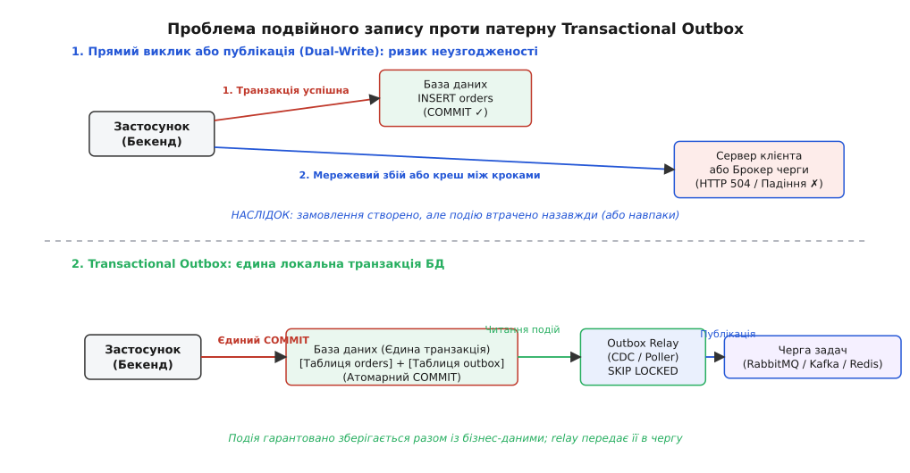
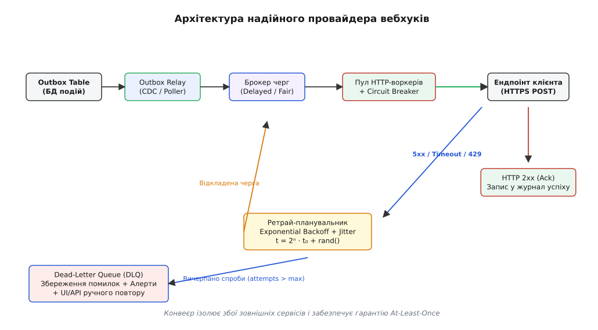
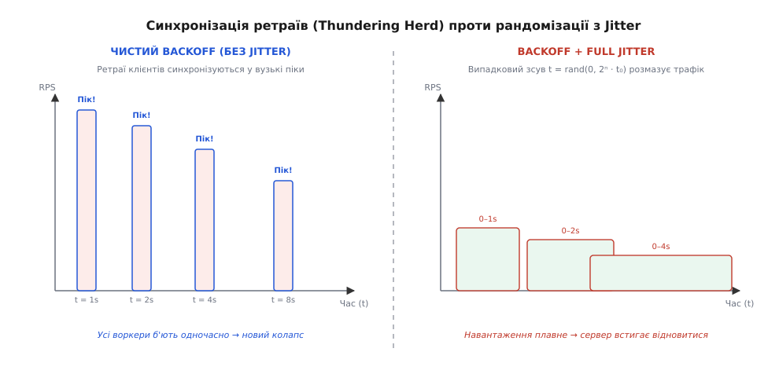
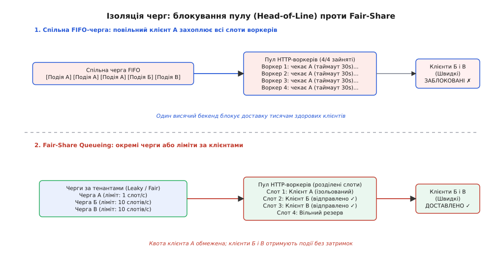
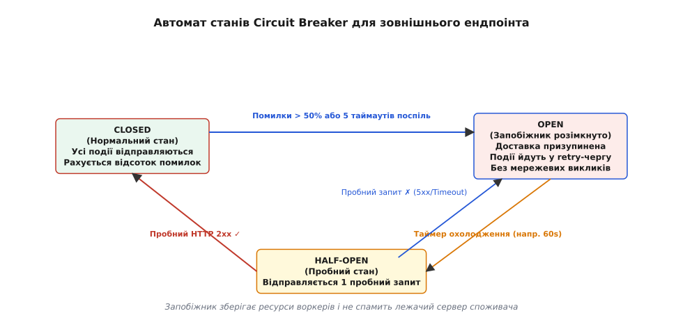

# Побудова надійного провайдера вебхуків: черги, ретраї, dead-letter

<preknowlist>
- [REST і HTTP](root:com-protocol/rest-api) — метод POST, коди 2xx/4xx/5xx, заголовки запитів і відповіді: вебхук є асинхронним викликом стороннього HTTP-ендпоінта.
- [Ідемпотентність методів як частина контракту](root:com-protocol/api-idempotency) — повторна доставка тієї самої події без небажаних побічних ефектів.
- [Черга задач](root:sf-web/background-jobs) — відкладення та асинхронна ізоляція операцій через воркери й брокери повідомлень.
- [Webhooks (бік СПОЖИВАЧА)](root:sf-web/webhooks) — вимоги до приймача подій: дедуплікація, перевірка підпису та швидка відповідь.
</preknowlist>

Уяви платіжну платформу: покупець успішно оплатив замовлення на сто тисяч гривень, транзакція в реляційній базі даних зафіксувала списання коштів, і бекенд безпосередньо в обробнику запиту робить вихідний HTTP POST на сервер інтернет-магазину, щоб повідомити про подію `payment.succeeded`. У цей самий момент сервер магазину зависає на тридцять секунд через внутрішнє блокування власної бази даних або повертає помилку 504 Gateway Timeout. Якщо вихідний HTTP-виклик виконувався всередині відкритої транзакції СУБД, пул з'єднань бази даних провайдера вичерпується за кілька секунд і повністю зупиняє прийом нових платежів у всій системі; якщо ж виклик робився після завершення транзакції без збереження події в черзі, клієнт назавжди втрачає сповіщення про гроші, хоча кошти з покупця вже знято.

Побудова провайдера вебхуків — це інженерна задача створення розподіленого конвеєра асинхронної доставки подій із гарантією щонайменше один раз (англ. at-least-once delivery). Провайдер не контролює інфраструктуру споживачів: їхні сервери перезавантажуються, зависають, зазнають мережевих розривів і страждають від сплесків трафіку. Надійний провайдер зобов'язаний гарантувати, що жодна бізнес-подія не буде втрачена, жоден збійний клієнт не заблокує доставку іншим користувачам, а повторні спроби відправки не перетворяться на нищівну лавину для відновлюваного сервісу.

## Пастка синхронного виклику та подвійний запис (Dual-Write)

Перша архітектурна спокуса при додаванні вебхуків до монолітного або мікросервісного бекенда — надіслати HTTP-запит клієнту прямо під час виконання бізнес-операції. Розробник відкриває транзакцію, оновлює стан замовлення та викликає HTTP-клієнт.

Цей підхід містить фундаментальну ваду: час утримання блокувань у базі даних стає заручником стороннього інтернет-з'єднання. Реляційна СУБД під час транзакції тримає монопольні блокування змінених рядків і займає одне з'єднання зі свого обмеженого пулу (типово 50–200 з'єднань на весь сервіс). Мережевий запит до стороннього сервера додає затримку від сотень мілісекунд до десятків секунд. Якщо кілька клієнтських серверів почнуть відповідати повільно, весь пул з'єднань СУБД буде заблокований очікуванням мережевого вводу-виводу (англ. socket I/O), що спричинить каскадну відмову всіх бізнес-функцій платформи.

Друга спроба — винести HTTP-виклик за межі транзакції:

```sql
BEGIN;
UPDATE accounts SET balance = balance - 100 WHERE id = 42;
COMMIT;
-- Далі в коді бекенда:
-- httpClient.post("https://client.com/webhook", eventPayload);
```

Тут виникає класична проблема подвійного запису (англ. Dual-Write Problem). Дві операції — фіксація стану в базі даних та сповіщення зовнішнього світу — здійснюються у двох незалежних розподілених системах без спільного координатора транзакцій:
1. Якщо процес застосунку буде примусово зупинено операційною системою (SIGKILL, перезапуск поду Kubernetes, вимкнення живлення) або станеться збій мережі рівно між `COMMIT` і викликом `httpClient.post()`, подія буде безповоротно втрачена. У базі даних платіж зафіксовано, але клієнт про нього ніколи не дізнається.
2. Якщо спробувати відправити запит до коміту транзакції, а сам коміт провалиться через порушення обмежень цілісності (constraint violation) або конфлікт серіалізації, клієнт отримає вебхук про операцію, якої насправді не відбулося (фантомна подія).

Пряма публікація в брокер повідомлень (RabbitMQ, Kafka або Redis) після завершення транзакції страждає від тієї самої проблеми: мережевий розрив або падіння вузла між записом у базу та викликом брокера призводить до неузгодженості. Розподілені транзакції на основі двофазного коміту (Two-Phase Commit, 2PC) у веб-середовищі не застосовуються через високу латентність, блокування ресурсів і відсутність підтримки протоколу XA у більшості сучасних черг та HTTP-сервісів.



*Прямий подвійний запис залишає вікно вразливості між базою даних і мережею. Патерн Transactional Outbox об'єднує збереження сутності та події в єдину атомарну транзакцію СУБД.*

## Патерн Transactional Outbox: атомарна фіксація подій

Єдиним надійним способом подолання проблеми подвійного запису є патерн вихідної скриньки (англ. Transactional Outbox Pattern, від лат. transactio — здійснення, угода).

Ідея патерну полягає в тому, що подія для зовнішнього споживача зберігається в спеціальну таблицю `outbox_events` у тій самій базі даних і в межах тієї самої локальної транзакції ACID, що й основні бізнес-дані:

```sql
BEGIN;

INSERT INTO orders (id, user_id, amount, status) 
VALUES ('ord_101', 'usr_55', 10000, 'paid');

INSERT INTO outbox_events (
    id, tenant_id, destination_url, secret_key, 
    event_type, payload, status, next_retry_at
) VALUES (
    'evt_999', 'tenant_abc', 'https://shop.example.com/webhooks', 'whsec_xyz',
    'order.paid', '{"order_id": "ord_101", "amount": 10000}', 'pending', NOW()
);

COMMIT;
```

Завдяки властивості атомарності (Atomicity) реляційної СУБД можливі лише два наслідки: або бізнес-запис і подія гарантовано збережуться разом на диску, або у випадку збою транзакція повністю відкотиться, не залишивши жодного сліду.

Після фіксації в таблиці подія має бути передана до конвеєра доставки. Для цього застосовують два інженерних підходи:

### 1. Транзакційне опитування (Transactional Polling Relay)

Окремий фоновий процес регулярно вибирає партії подій зі статусом `pending` за допомогою конструкції `SELECT ... FOR UPDATE SKIP LOCKED`:

```sql
UPDATE outbox_events
SET status = 'processing',
    locked_by = 'worker-node-1',
    locked_at = NOW()
WHERE id IN (
    SELECT id FROM outbox_events
    WHERE (status = 'pending' OR status = 'failed')
      AND next_retry_at <= NOW()
    ORDER BY next_retry_at ASC
    LIMIT 100
    FOR UPDATE SKIP LOCKED
)
RETURNING *;
```

Конструкція `SKIP LOCKED` наказує рушію бази даних миттєво пропускати рядки, які вже заблоковані паралельними воркерами. Це виключає затримки очікування блокувань (lock contention) і дозволяє запускати десятки паралельних процесів вибірки. Після підтвердження доставки статус рядка оновлюється на `delivered` або запис видаляється.

Для запобігання розростанню таблиці (table bloat) та деградації індексів у PostgreSQL застосовують партиціювання таблиці за днями (`PARTITION BY RANGE (created_at)`) або регулярне видалення завершених подій пакетами.

### 2. Захоплення змін даних (Change Data Capture, CDC)

Коли інтенсивність генерації подій перевищує десятки тисяч на секунду, навіть оптимізоване транзакційне опитування починає створювати помітне I/O-навантаження на базу даних. У таких масштабах застосовують Change Data Capture (CDC).

Спеціалізований коннектор (наприклад, Debezium на платформі Kafka Connect) підключається до механізму логічної реплікації СУБД — Write-Ahead Log (WAL) у PostgreSQL або Binary Log у MySQL. Коннектор виступає в ролі репліки: він асинхронно зчитує бінарний потік зафіксованих змін безпосередньо з дискового журналу, не виконуючи SQL-запитів `SELECT`. Кожен рядок, вставлений у таблицю `outbox_events`, автоматично транслюється у відповідний топік Apache Kafka або Redis Streams.

CDC гарантує нульове додаткове навантаження на таблицю, субмілісекундну затримку реакції та строге збереження послідовності подій у межах транзакційного журналу.

## Архітектура конвеєра доставки та пул HTTP-воркерів

Отримані з Outbox події потрапляють до ядра системи доставки. Провайдер вебхуків організовано як багатоланковий асинхронний конвеєр, у якому кожен компонент відповідає за свій рівень надійності.



*Повний конвеєр: події з Outbox через брокер черг надходять до пулу воркерів, проходять крізь Circuit Breaker, а у разі збоїв повертаються у відкладену чергу ретраїв або відправляються у DLQ.*

Конвеєр складається з таких обов'язкових вузлів:

1. **Диспетчер черг (Dispatcher & Queue Broker):** розподіляє вхідні події за категоріями, пріоритетами та клієнтськими потоками. У ролі брокера виступають RabbitMQ (з використанням dead-letter exchange та плагіна delayed message exchange), Redis Streams або Kafka.
2. **Пул асинхронних HTTP-воркерів:** група процесів або корутин на основі неблокуючого мережевого вводу-виводу (`epoll` у Linux, `kqueue` у BSD або `io_uring`), що беруть завдання з черги, формують HTTP-запит, встановлюють захищене TLS-з'єднання та очікують на відповідь споживача.
3. **Керування пулом сокетів (Connection Pooling & Keep-Alive):** високопродуктивний провайдер зобов'язаний перевикористовувати встановлені TCP-з'єднання до популярних хостів споживачів. Відкриття нового TLS-рукостискання на кожен вебхук створює колосальні накладні витрати CPU та мережевої латентності (3 RTT на TCP + TLS handshake). Пул з'єднань утримує відкриті сокети за протоколом HTTP Keep-Alive з обмеженням максимальної кількості з'єднань на один хост (`maxSocketsPerHost`, типово 10–50).
4. **Суворі тайм-аути доставки:** жоден вихідний виклик не повинен висіти нескінченно. Встановлюються три рівні дедлайнів:
   - `Connect Timeout` (1.0–2.0 с) — час на завершення DNS-резолвінгу, встановлення TCP-з'єднання та проходження TLS-автентифікації;
   - `Write Timeout` (1.0–2.0 с) — максимальний час передачі тіла POST-запиту в сокет;
   - `Read / Response Timeout` (5.0–10.0 с) — максимальний час очікування перших байтів відповіді від сервера клієнта. Загальний дедлайн на виклик вебхука зазвичай не перевищує 10–15 секунд.

### Контракт автентифікації та заголовки безпеки

Кожен HTTP POST-запит від провайдера містить обов'язковий набір заголовків, що визначають протокол взаємодії:

```http
POST /api/webhooks HTTP/1.1
Host: shop.example.com
Content-Type: application/json
User-Agent: Platform-WebhookEngine/2.0
X-Event-Id: 9b1deb4d-3b7d-4bad-9bdd-2b0d7b3dcb6d
X-Event-Type: invoice.payment_succeeded
X-Delivery-Attempt: 2
X-Timestamp: 1718800000
X-Signature-256: t=1718800000,v1=c3ab8ff13720e8ad9047dd39466b3c8974e592c2fa383d4a3960714caef0c4f2
```

Криптографічний підпис `X-Signature-256` обчислюється як HMAC-SHA256 від об'єднання мітки часу та сирого тіла запиту на спільному секретному ключі `secret_key`:

```
signature_payload = "t=" + timestamp + "." + raw_payload_bytes
signature = HMAC_SHA256(secret_key, signature_payload)
```

Включення мітки часу `t` у підписані дані запобігає атакам повторного відтворення (англ. replay attack), а передача `X-Event-Id` дозволяє споживачеві відсікати дублікати у власній базі даних без розбору складного тіла документа.

### Ротація ключів без зупинки сервісу (Zero-Downtime Key Rotation)

У процесі експлуатації секретний ключ клієнта може бути скомпрометований або підлягати плановій заміні за вимогами безпеки. Якщо провайдер миттєво замінить старий секретний ключ на новий, усі повідомлення, надіслані під час процесу оновлення конфігурації на боці споживача, зазнають відмови з кодом HTTP 401.

Промисловий стандарт ротації підтримує множинні версії підписів у заголовку:

```http
X-Signature-256: t=1718800000,v1=9a8b7c...,v2=3d4e5f...
```

Провайдер підписує тіло запиту одночасно двома діючими ключами (старим `v1` та новим `v2`) протягом перехідного періоду (наприклад, 48 годин). Споживач вважає запит валідним, якщо хоча б один із наданих підписів збігається з будь-яким із його активних секретів. Після підтвердження переходу старий ключ безпечно видаляється з реєстру провайдера.

### Захист від SSRF (Server-Side Request Forgery)

Оскільки URL-адреса вебхука вводиться користувачем у панелі керування, провайдер ризикує стати інструментом атаки на власну внутрішню інфраструктуру. Зловмисник може вказати адресу хмарного сервісу метаданих `http://169.254.169.254/latest/meta-data/` або внутрішньої СУБД `http://10.0.0.5:5432/`.

Диспетчер провайдера зобов'язаний виконувати захисну валідацію:
1. Заборона будь-яких схем, крім `https://` (і контрольованого `http://` для локальних тестів);
2. DNS-резолвінг домену перед з'єднанням і блокування підключень до приватних діапазонів IP-адрес (RFC 1918: `10.0.0.0/8`, `172.16.0.0/12`, `192.168.0.0/16`), локальних адрес (Loopback `127.0.0.0/8`, `::1`), адрес локального зв'язку (Link-Local `169.254.0.0/16`, `fe80::/10`) та багатоадресних мереж (Multicast);
3. Захист від підміни DNS (DNS Rebinding): встановлення сокета безпосередньо за перевіреною IP-адресою з передачею вихідного доменного імені лише в заголовку `Host` і в полі TLS SNI.

## Стратегія повторів: Exponential Backoff, Jitter та Thundering Herd

Мережеві помилки та перезапуски серверів споживача мають тимчасовий характер. Якщо перша спроба доставки провалилася, провайдер зобов'язаний повторити спробу через розрахований інтервал часу.

Помилки класифікують на дві категорії:
- **Тимчасові (Retryable):** помилки тайм-ауту, розриви TCP-з'єднань, коди HTTP 500 (Internal Server Error), 502 (Bad Gateway), 503 (Service Unavailable), 504 (Gateway Timeout), 408 (Request Timeout) та 429 (Too Many Requests). Для коду 429 враховується заголовок `Retry-After`, якщо він наданий споживачем.
- **Перманентні (Non-Retryable):** коди клієнтських помилок HTTP 400 (Bad Request), 401 (Unauthorized), 403 (Forbidden), 404 (Not Found), 410 (Gone). Якщо клієнт повернув 410 Gone або 404, це свідчить про видалення або неправильне налаштування ендпоінта — повторювати такий запит марно, він негайно переводиться в статус фатального збою.

### Експоненційний відступ (Exponential Backoff)

Негайні повтори неприпустимі: якщо сервіс клієнта впав через перевантаження бази даних, потік миттєвих повторних запитів лише поглибить аварію. Інтервал очікування повинен зростати експоненційно (від лат. exponere — виставляти напоказ, множити):

```
T(n) = min(t_max, t_0 · 2ⁿ)
```

де `t_0` — базовий інтервал (наприклад, 1 секунда), `n` — номер поточної спроби, а `t_max` — верхня межа (наприклад, 1–24 години).

### Проблема синхронізації та повний джиттер (Full Jitter)

Проте чистий експоненційний відступ містить приховану загрозу — синхронізацію ретраїв, відому як проблема стада, що біжить (англ. Thundering Herd Problem).

Якщо на боці великого споживача стався короткочасний мережевий збій тривалістю 10 секунд, тисячі паралельних вебхуків зазнають невдачі одночасно в момент часу `t = 0`. Якщо провайдер використовує детерміновану формулу `t_0 · 2ⁿ`, усі тисячі воркерів надішлють повторні запити в одну й ту саму секунду `t = 2`, потім наступною хвилею в момент `t = 4`, потім у `t = 8`. Сервер споживача, що щойно піднявся після перезавантаження, буде негайно збитий дельта-подібним імпульсом пікового навантаження (RPS spike).



*Детерміновані ретраї створюють періодичні нищівні піки трафіку на відновлюваний сервер. Додавання рандомізації (Full Jitter) рівномірно розподіляє навантаження в часі.*

Ліками проти Thundering Herd є джиттер (англ. jitter — «тремтіння, випадкове коливання») — додавання стохастичного шуму до інтервалу очікування. Найбільш ефективним за критерієм мінімізації пікового навантаження є алгоритм Full Jitter:

```
delay = Uniform(0, min(t_max, t_0 · 2ⁿ))
```

Фактичний час затримки вибирається як випадкове число, рівномірно розподілене між нулем та поточною експоненційною стелею. Детальний математичний доказ того, чому Full Jitter мінімізує дисперсію черги та пікове навантаження на споживача порівняно з Equal Jitter та Decorrelated Jitter, наведено у вставці [математичному аналізі поведінки джитеру та розподілу навантаження](root:sf-web/webhook-provider/math-backoff-jitter.md).

## Ізоляція клієнтів: Fair-Share Queueing та захист від блокування пулу

У багатокористувацькій (multi-tenant) системі один несправний або повільний клієнт не повинен впливати на якість обслуговування інших користувачів.

Уявімо спільну чергу FIFO: клієнт А налаштував вебхук на сервер, який зависає на максимальний таймаут у 30 секунд. Клієнти Б і В мають сервери, що відповідають за 20 мілісекунд. Якщо клієнт А згенерує сплеск із 500 подій, усі 100 воркерів пулу доставки захоплять події клієнта А і зависнуть у 30-секундному очікуванні сокетів. Події клієнтів Б і В опиняться заблокованими у черзі позаду подій клієнта А. Це явище має назву блокування початку черги (англ. Head-of-Line Blocking).



*У спільній черзі повільний клієнт монополізує всі потоки обробки. Fair-Share Queueing ізолює трафік за тенантами, гарантуючи швидке проходження здорових подій.*

Для усунення блокування початку черги провайдер реалізує три рівні ізоляції:

1. **Чесне планування (Fair-Share Queueing / Deficit Round Robin):** замість єдиної черги події маршрутизуються в окремі віртуальні черги за ідентифікатором клієнта (`tenant_id`) або доменом призначення. Диспетчер веде облік квантів часу або кількості запитів для кожного тенанта (алгоритм Deficit Round Robin). Коли настає черга чергового клієнта, йому нараховується кредитний ліміт. Якщо розмір черги клієнта перевищує ліміт, надлишкові події відкладаються на наступне коло планувальника. Це гарантує, що жоден масивний генератор трафіку не зможе відібрати понад `1/N` пропускної здатності у системи з `N` активних тенантів.
2. **Обмеження швидкості на рівні тенанта (Per-Tenant Rate Limiting & Concurrency Limits):** на кожного клієнта накладається жорсткий ліміт на кількість одночасно відкритих вихідних HTTP-з'єднань (наприклад, щонайбільше 10 активних з'єднань на клієнта) та алгоритм маркерного кошика (Token Bucket) на частоту викликів (наприклад, не більше 50 RPS). Якщо клієнт вичерпує ліміт, його надлишкові події залишаються в черзі очікування, не заважаючи іншим.
3. **Розділення смуг доставки (Lane Isolation):** події первинної доставки (attempt = 1) і повторні ретраї (attempt > 1) обробляються різними пулами воркерів. Швидка смуга (Fast Lane) гарантує, що свіжі події для здорових серверів доставляються за десятки мілісекунд, не чекаючи розбору повільної черги ретраїв (Retry Lane).

## Запобіжник (Circuit Breaker) для зовнішніх адрес

Якщо приймальний сервер клієнта повністю вийшов із ладу (наприклад, видалено DNS-запис, сервер вимкнено або база споживача лежить і стабільно видає 500 помилку), регулярні повторні запити кожні кілька хвилин є марним витрачанням ресурсів провайдера. Навіть із застосуванням джитеру тисячі спроб з'єднатися з мертвим хостом спалюють дескриптори сокетів, пам'ять та час воркерів.

Щоб запобігти цьому, диспетчер застосовує патерн Circuit Breaker (запобіжник, від лат. circuiter — обходити по колу):



*Автомат станів запобіжника: перехід у стан Open заморожує виклики до мертвого хоста на час охолодження, а Half-Open перевіряє готовність сервісу одним тестовим запитом.*

Автомат станів запобіжника працює за такою логікою для кожного окремого хоста:
- **CLOSED (Замкнений):** нормальний стан. Усі події надсилаються у штатному режимі. Ведеться підрахунок кількості помилок у ковзному вікні (наприклад, за останні 60 секунд). Якщо відсоток невдач перевищує 50% або фіксується 5 таймаутів поспіль, запобіжник розмикається.
- **OPEN (Розімкнений):** режим ізоляції хоста. Будь-які запити до цього домену негайно зупиняються на рівні диспетчера без спроби встановити мережеве з'єднання. Події одразу переплановуються у відкладену чергу ретраїв. Стан триває протягом фіксованого інтервалу охолодження (англ. cooldown period, наприклад, 60 секунд).
- **HALF-OPEN (Напіврозімкнений):** після завершення періоду охолодження запобіжник пропускає рівно один пробний HTTP-запит. Якщо пробний виклик повертає успішний статус HTTP 2xx, хост вважається відновленим, і запобіжник повертається в стан `CLOSED`. Якщо пробний запит знову зазнає невдачі, стан повертається в `OPEN`, а інтервал охолодження подвоюється.

Запобіжник зберігає ресурси провайдера й дає спокій інфраструктурі клієнта під час проведення аварійних робіт.

## Мертва черга (Dead-Letter Queue, DLQ) та експлуатаційний цикл

Коли повідомлення вичерпує максимальну кількість спроб доставки (типово 10–15 спроб за розкладом тривалістю від 24 до 72 годин) або отримує невідновну помилку HTTP 410 Gone, воно не може бути доставлене автоматично.

Викидати такі повідомлення заборонено — це порушить бізнес-облік. Подія переміщується у мертву чергу (англ. Dead-Letter Queue, DLQ, від англ. dead letter — лист без адреси, що не дійшов до адресата).

DLQ являє собою постійне сховище з повним аудиторським слідом невдалої доставки:
- Повний початковий payload події та її унікальний `event_id`;
- Історія всіх виконаних спроб: часові мітки, коди HTTP-статусів, тривалість у мілісекундах та збережений фрагмент тіла відповіді клієнта (перші 1–2 КБ для діагностики);
- Причина зупинки доставки (`attempts_exhausted`, `permanent_http_4xx`, `circuit_breaker_timeout`).

### Бізнес-процеси навколо DLQ

Життя події у мертвій черзі супроводжується трьома системними механізмами:

1. **Автоматичні алерти та деактивація ендпоінта:** якщо частка подій, що потрапляють у DLQ для конкретного клієнта, перевищує поріг (наприклад, понад 100 подій за добу), провайдер автоматично деактивує вебхук-підписку клієнта та надсилає сповіщення розробникам на електронну пошту зі звітом про причини збоїв. Це захищає провайдера від нескінченного обслуговування покинутих URL-адрес.
2. **Панель діагностики для користувача (Delivery Logs & Observability):** провайдер надає користувачам UI та API для перегляду журналу спроб доставки, сирих заголовків і кодів помилок. Це дає розробникам клієнта можливість локалізувати баг у власному коді без звернення до служби підтримки провайдера.
3. **API та інтерфейс ручного повтору (Manual Replay API):** після того, як розробники клієнта виправлять помилку на своєму сервері або оновлять URL ендпоінта, вони викликають endpoint `POST /v1/webhooks/replay`. Диспетчер вибирає накопичені події з DLQ, скидає лічильник спроб у нуль і повертає їх у чергу регулярної доставки зі збереженням оригінальних бізнес-даних.

### Штатне вимкнення та очищення воркерів (Graceful Shutdown)

Під час регулярного оновлення або масштабування кластера поду воркерів надсилається сигнал завершення `SIGTERM`. Негайне завершення процесу призвело б до обриву активних TCP-з'єднань прямо під час надсилання HTTP-запиту або отримання коду 200, спричинивши штучні повтори або завислі блокування в таблиці Outbox.

Штатне вимкнення воркера реалізує чотири кроки:
1. Воркер припиняє читання нових завдань із черги та відключається від вибірки `SELECT ... SKIP LOCKED`.
2. Запускається таймер очікування завершення активних викликів (drain period, типово 15–30 секунд).
3. Активні HTTP-запити доводяться до отримання відповіді або вичерпання індивідуального таймауту з фіксацією статусу в базі даних.
4. Якщо після вичерпання дедлайну залишилися незавершені події, воркер знімає з них блокування `locked_by = NULL`, повертаючи їх у статус `pending` для інших здорових вузлів, після чого процес безпечно завершує роботу з кодом 0.

Повну програмну реалізацію конвеєра диспетчера з пулом воркерів, Transactional Outbox, розрахунком Full Jitter, Circuit Breaker та підтримкою DLQ мовами TypeScript і C++ наведено у вставці [практичній реалізації диспетчера вебхуків](root:sf-web/webhook-provider/proj-webhook-dispatcher.md).

> 🔧 **Навіщо це.** Створення надійного провайдера вебхуків — це різниця між платформою корпоративного рівня та нестабільним сервісом. Провайдер без Transactional Outbox втрачає фінансові сповіщення при кожному перезапуску бекенда. Провайдер без ізоляції черг Fair-Share дозволяє одному висячому клієнту заблокувати доставку всій системі. Провайдер без джитеру та запобіжника Circuit Breaker добиває сервери власних клієнтів після аварій штормом повторних запитів. Надійний провайдер ізолює збої, захищає власну базу даних і гарантує доставку кожної події.

## Архітектурний синтез: гарантії та порядок подій

Усі компоненти провайдера формують єдину інженерну систему із чітко визначеними гарантіями.

Провайдер вебхуків забезпечує гарантію доставки **щонайменше один раз** (At-Least-Once). Через мережеві збої, коли клієнт успішно обробив подію, але мережевий пакет відповіді 200 загубився дорогою, провайдер зобов'язаний виконати повторну спробу. Це означає, що клієнт неминуче отримуватиме дублікати подій. Провайдер забезпечує клієнта всіма інструментами для безпечної обробки: передає унікальний `X-Event-Id`, мітку часу `X-Timestamp` та підпис `X-Signature-256`.

Друга критична межа моделі — **порядок доставки**. У розподіленій системі з паралельними воркерами та різною кількістю ретраїв неможливо гарантувати абсолютний загальний хронологічний порядок (Strict Global Ordering) без повної зупинки конвеєра на кожній помилці. Якщо подія `order.created` зазнала збою і чекає на ретрай 4 секунди, а наступна подія `order.updated` була успішно доставлена з першої спроби, споживач отримає їх у зворотному порядку.

Провайдер розв'язує цю проблему двома шляхами:
1. **Партиціювання за сутністю (Entity Partitioning):** події з однаковим ідентифікатором сутності (`order_id` або `account_id`) прив'язуються до одного партиційного ключа брокера черг. Якщо попередня подія сутності зазнає збою, наступні події тієї самої сутності призупиняються у черзі до завершення або скидання першої.
2. **Версіонування стану:** кожна подія містить монотонно зростаючий номер версії або мітку часу сутності. Це дозволяє приймачу на боці споживача ігнорувати застарілі оновлення стану, якщо в системі вже зафіксовано новішу версію.

Асинхронний конвеєр на основі Transactional Outbox, чесного планування черг, експоненційного відступу з рандомізацією та мертвої черги перетворює крихкий інтернет-протокол HTTP на відмовостійкий промисловий транспорт обміну корпоративними подіями.
