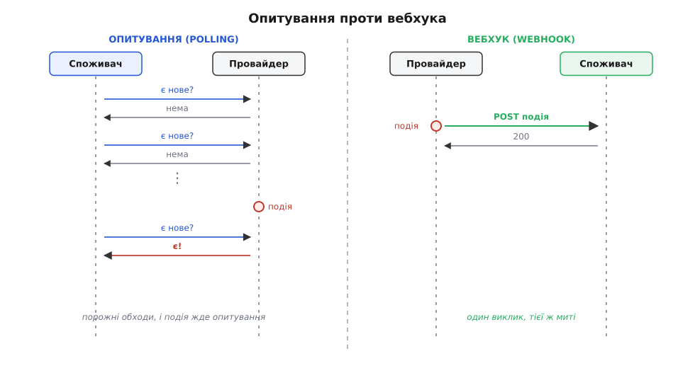
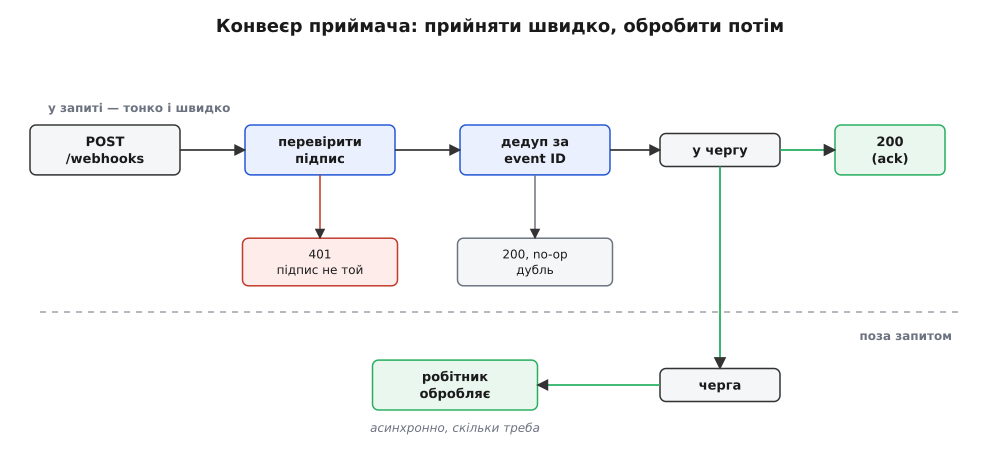
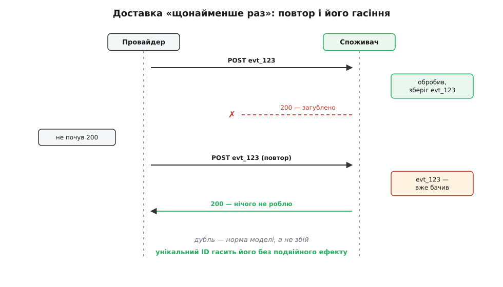

# Webhooks (бік СПОЖИВАЧА)

<preknowlist>
- [REST і HTTP](topic:com-protocol/rest-api) — запит-відповідь, метод POST, заголовки, коди 2xx/4xx/5xx: вебхук — це звичайний HTTP-запит, тільки надходить він до вас.
- [Ідемпотентність](topic:sf-distributed/idempotency) — операція, виконана двічі, лишає той самий стан, що й виконана раз; без цього дублікати подій ламають облік.
- [Черга задач](topic:sf-web/background-jobs) — винести повільну роботу з обробки запиту окремому робітнику; на цьому тримається правило «підтвердь швидко, обробляй потім».
</preknowlist>

Уяви, що твій застосунок мусить знати, коли клієнт оплатив рахунок у платіжного провайдера, коли колега запушив коміт у репозиторій, коли служба доставки забрала посилку. Подія стається не в тебе — у чужій системі. Питання просте: як ти про неї дізнаєшся?

**Очевидна відповідь — питати.** Раз на кілька секунд смикати чужий API: «є нове? є нове?». Це називають опитуванням (англ. polling — «обхід, промацування»). Працює, але дорого одразу з двох боків. Перший бік — марнота: якщо подія стається раз на годину, а ти питаєш щосекунди, то 3599 запитів із 3600 повертають «нічого». Помнож на десять тисяч інтеграцій — і чужий сервер тримає тисячі запитів на секунду, майже всі з відповіддю «ні». Другий бік — затримка: подія сталася відразу після твого запиту, і дізнаєшся ти про неї аж наступного оберту, через секунди чи хвилини. Ти платиш за постійне промацування — і все одно спізнюєшся.

**Ідея вебхука — перевернути напрям.** Не ти питаєш, а провайдер сам тебе кличе тієї ж миті, коли подія стається. Ти реєструєш у нього URL, і на кожну подію провайдер робить туди HTTP POST з її описом. Тепер марноти нуль — рівно один виклик на одну подію, — а затримка мінімальна: тебе сповіщають у момент, а не за розкладом. Назву склали з «web» + «hook» (англ. hook — «гак, зачіп»): гак — це місце, де твій код чіпляється до чужого потоку. Термін увів Джеф Ліндсей (Jeff Lindsay) 2007 року в дописі, задумавши «web hooks» як веб-аналог юніксових гаків — спосіб склеювати веб-застосунки простими HTTP-викликами (усталений факт).



*Опитування шле безліч запитів, майже всі — з відповіддю «нема», і все одно дізнається про подію із запізненням. Вебхук — рівно один виклик тієї ж миті.*

Але тут криється розворот, який легко проґавити. Опитування клало весь тягар на того, хто питає: ти сам вирішував, коли й скільки смикати. Вебхук кладе на тебе **інший** тягар — ти більше не клієнт, що ходить по відповідь, а сервер, до якого дзвонять. І чотири речі, що були клопотом провайдера, стають твоїми: **справжність** виклику, **встигнути** відповісти в строк, **дублікати** й **втрати**. Розберімо кожну — саме з них і складається коректний приймач.

## Справжність: твій URL публічний

Провайдер POSTить на адресу, доступну з інтернету. А отже, POSTити туди може будь-хто. Ніщо не заважає зловмиснику надіслати тобі підроблену подію «оплата пройшла» — і ти відвантажиш товар за так. Тому кожен запит треба перевіряти: чи він справді від провайдера.

Стандартний спосіб — спільний секрет і підпис. У вас із провайдером є спільний рядок-секрет, якого більше ні в кого немає. Надсилаючи подію, провайдер рахує від тіла запиту криптографічний код (HMAC) на цьому секреті й кладе його в заголовок. Ти береш свою копію секрету, рахуєш код від отриманого тіла сам і звіряєш зі значенням у заголовку. Збіглося — запит справжній; ні — викидаєш його з кодом 401. Тіло не варте довіри, доки підпис не збігся.

Одна тонкість критична вже на базовому рівні: рахуй підпис від **сирих байтів** тіла, а не від JSON, який ти розібрав і зібрав назад. Розбір-і-збирання може переставити пробіли чи ключі — байти зміняться, і чесний підпис «не збіжиться». Тому спершу візьми сире тіло, перевір підпис — і лише тоді розбирай. Повну схему — з міткою часу проти повторного відтворення старого запиту й із порівнянням сталого часу — до кінця розбирає [підпис і верифікація вебхука](topic:sf-web/webhook-security).

## Строк: підтвердь швидко, обробляй потім

Провайдер, який тебе кличе, — це клієнт, що чекає на твою відповідь. І чекає він недовго: типово кілька секунд, потім вважає доставку невдалою. Якщо твій обробник робить усю справжню роботу прямо в запиті — оновити базу, смикнути три сусідні сервіси, надіслати лист, — то одного повільного дня ти не вкладешся в строк. Провайдер вирішить, що ти впав, і надішле подію ще раз, а ти тим часом уже робиш ту саму повільну роботу вдруге.

Вихід — розділити дві ролі обробника. Його справа в запиті не **обробити** подію, а лише **прийняти**: перевірити підпис, надійно записати факт «подія прийшла» (чи покласти в чергу) і одразу повернути 200. Справжня обробка йде окремо — [фоновим робітником із черги](topic:sf-web/background-jobs). Тоді строк приймача — це «встиг надійно прийняти за десятки мілісекунд», а не «встиг усе доробити». Приймай тонко, працюй товсто — тільки не на очах у провайдера.



*Приймальний шлях лише пропускає подію крізь два вартові й одразу відповідає 200. Уся справжня робота — за чергою, окремим робітником.*

## Дублікати: те саме приходить двічі

Раз провайдер повторює доставку на будь-яку невдачу, а мережа буває губить відповіді, ти **неминуче** отримаєш ту саму подію більш ніж раз. Класика: ти обробив подію бездоганно й повернув 200, але відповідь загубилась дорогою. Провайдер твого 200 не почув, вважає доставку невдалою й [повторює зі зростаючою паузою](topic:sf-distributed/retries-backoff). До тебе вдруге приходить та сама `evt_123` — і якщо «оплата пройшла» виконається двічі, ти зарахуєш гроші двічі.

Це не збій, а норма моделі: доставку гарантовано **щонайменше раз** (англ. at-least-once), а не рівно раз — [гарантії доставки](topic:sf-distributed/delivery-guarantees) саме про цей вибір. І єдині ліки — зробити свій бік ідемпотентним. Кожна подія несе унікальний ідентифікатор; ти пам'ятаєш, які вже обробив; повтор упізнаєш і тихо пропускаєш — повертаєш 200, але нічого не робиш.

Ключ до пам'яті — не структура в оперативці, а стійкий запис. Заведи в базі таблицю оброблених подій, де ідентифікатор події — унікальний. Перед обробкою спробуй його **вставити**: пройшло — подія нова, працюй; база відмовила через порушення унікальності — цю подію вже брали, виходь. Сама відмова вставки і є твоя дедуплікація, і вона переживає рестарт. Це і є [вхідна скринька](topic:sf-distributed/inbox-pattern) (inbox): спершу надійно поклади подію під її ідентифікатором, потім обробляй — ідентифікатор працює ключем ідемпотентності.



*Провайдер не почув 200 і шле подію знову. Приймач упізнає вже бачений ідентифікатор і відповідає 200, нічого не роблячи вдруге.*

## Порядок теж не гарантований

Повтори й паралельна доставка означають, що події можуть приходити не в тому порядку, у якому сталися: «підписку оновлено» перед «підписку створено», старий стан після нового. Не будуй логіку на порядку прибуття. Дивись на власну мітку часу чи версію всередині події — або, ще надійніше, стався до вебхука як до **підказки** («щось змінилося, id=X») і дочитуй поточну правду з API провайдера. Підказка-і-дочитування заразом рятує від застарілого вмісту в тілі.

## Втрати: після невдалих спроб провайдер здається

Твій ендпоінт лежав двадцять хвилин під час деплою. Провайдер повторив кілька разів із паузами — і **облишив** подію. Тому вебхуки самі по собі — доставка «як вийде»: вони ніколи не мусять бути єдиним шляхом для того, чого не можна проґавити. Страхувальна сітка — [звірка](topic:sf-distributed/reconciliation) (reconciliation): періодично тягни API провайдера й порівнюй із тим, що в тебе записано, добираючи прогалини. Вебхуки роблять тебе швидким, звірка робить тебе правильним.

А для подій, які твій робітник раз за разом не може обробити — крива структура, баг у коді, — заведи [мертву чергу](topic:sf-distributed/dead-letter-queue): відклади їх убік, щоб одна отруйна подія не забила обробку всіх інших, і хай гляне людина.

> 🔧 **Навіщо це.** Платіжні провайдери й хостинги коду спілкуються зі світом саме вебхуками. Приймач, що бере їх без перевірки підпису, — це відвантаження товару за підробленою «оплатою». Приймач без дедуплікації — подвійне зарахування грошей на кожній загубленій відповіді. Приймач без звірки мовчки втрачає замовлення на кожному своєму перезапуску. Це не теорія акуратності, а прямі втрати грошей і довіри.

## Складається в один суворий обробник

Уся приймальна частина стискається в коротку, жорстко впорядковану послідовність: узяти сире тіло → перевірити підпис → розібрати й дістати ідентифікатор → спробувати відзначити його (уже є — тихо 200) → покласти в чергу → повернути 200. Ось вона на трьох поширених стеках:

:::tabs
```ts
import express from "express";
import crypto from "node:crypto";

const app = express();
const SECRET = process.env.WEBHOOK_SECRET!;
const seen = new Set<string>();          // насправді — стійке сховище, не пам'ять

// важливо: сирі байти тіла, а не розібраний JSON
app.post("/webhooks", express.raw({ type: "application/json" }), (req, res) => {
  const sig = req.header("X-Signature") ?? "";
  const expected = crypto.createHmac("sha256", SECRET)
    .update(req.body)                    // req.body — Buffer сирих байтів
    .digest("hex");
  // порівняння сталого часу — щоб через час відповіді не витік підпис
  const ok = sig.length === expected.length &&
    crypto.timingSafeEqual(Buffer.from(sig), Buffer.from(expected));
  if (!ok) return res.sendStatus(401);

  const event = JSON.parse(req.body.toString("utf8"));
  if (seen.has(event.id)) return res.sendStatus(200);   // вже бачили — тихо
  seen.add(event.id);

  queue.push(event);                     // зняти роботу з гарячого шляху
  return res.sendStatus(200);            // підтвердити ОДРАЗУ
});
```
```py
import hmac, hashlib, os
from flask import Flask, request, abort

app = Flask(__name__)
SECRET = os.environ["WEBHOOK_SECRET"].encode()
seen = set()                              # насправді — стійке сховище, не пам'ять

@app.post("/webhooks")
def receive():
    raw = request.get_data()              # сирі байти тіла, не розібраний JSON
    expected = hmac.new(SECRET, raw, hashlib.sha256).hexdigest()
    sig = request.headers.get("X-Signature", "")
    if not hmac.compare_digest(sig, expected):   # порівняння сталого часу
        abort(401)

    event = request.get_json()
    if event["id"] in seen:               # вже бачили — тихо
        return "", 200
    seen.add(event["id"])

    queue.put(event)                      # зняти роботу з гарячого шляху
    return "", 200                        # підтвердити ОДРАЗУ
```
```go
var seen sync.Map                         // насправді — стійке сховище, не пам'ять

func receive(w http.ResponseWriter, r *http.Request) {
    raw, _ := io.ReadAll(r.Body)          // сирі байти тіла, не розібраний JSON

    mac := hmac.New(sha256.New, secret)
    mac.Write(raw)
    expected := hex.EncodeToString(mac.Sum(nil))
    sig := r.Header.Get("X-Signature")
    if !hmac.Equal([]byte(sig), []byte(expected)) {   // порівняння сталого часу
        w.WriteHeader(http.StatusUnauthorized)
        return
    }

    var event Event
    json.Unmarshal(raw, &event)
    if _, dup := seen.LoadOrStore(event.ID, true); dup {  // вже бачили — тихо
        w.WriteHeader(http.StatusOK)
        return
    }

    queue <- event                        // зняти роботу з гарячого шляху
    w.WriteHeader(http.StatusOK)          // підтвердити ОДРАЗУ
}
```
:::

`seen` тут — спрощення: справжня дедуплікація це стійкий унікальний запис у базі, а не множина в пам'яті (яку зітре найближчий перезапуск). І навіть із нею робітник, що розгрібає чергу, мусить бути ідемпотентним сам: відмітити-і-покласти-в-чергу — не одна атомарна дія, тож між ними процес може впасти. Повний приймач — зі стійкою скринькою, робітником і задачею звірки — розібрано покроково в [проєкті-приймачі](topic:sf-web/webhooks/proj-robust-consumer.md).

## Зведімо докупи

Вебхук перевертає опитування, щоб виграти в затримці й ціні: замість вічного «є нове?» провайдер кличе тебе в мить події. Ця ж інверсія перекладає на тебе чотири обов'язки приймача, і коректний приймач — це рівно той код, що їх усі виконує. **Перевір** підпис над сирими байтами — бо публічний URL відкритий і для підробок. **Підтверди швидко**, а обробляй окремо — бо провайдер чекає лічені секунди. **Дедуплікуй** за ідентифікатором події — бо доставка «щонайменше раз» неминуче принесе повтори. **Звіряйся** з API — бо після невдалих спроб провайдер здається, і без звірки втрата тиха. Той самий набір турбот, тільки дзеркально, лягає на того, хто вебхуки [шле як провайдер](topic:sf-web/webhook-provider): підписати, повторити, дати унікальний ідентифікатор, витримати повільного приймача.
