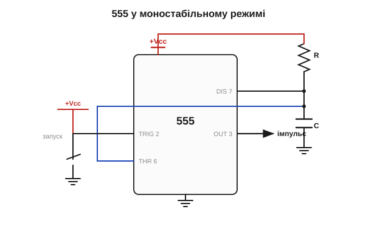
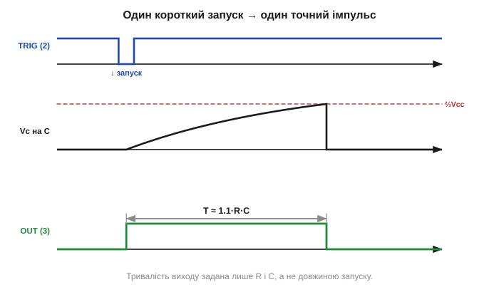

# 555 у моностабільному режимі: одновібратор

Другий класичний режим 555 — **моностабільний** (*monostable*), або **одновібратор** (*one-shot*). Якщо астабільний 555 коливається без упину, то моностабільний — навпаки: він має **один стійкий стан** (вихід «низько») і спокійно сидить у ньому, доки його не штовхнуть. Штовхнули коротким запуском — він видає **один-єдиний імпульс** заданої тривалості, після чого знову засинає до наступного поштовху. Це формувач: він перетворює будь-яку коротку подію на акуратний імпульс точно відміряної довжини.

### Обв'язка: один резистор і один конденсатор

Схема одновібратора ще простіша за астабільну: **один резистор R до живлення й один конденсатор C на землю**, а запуск подають на вхід TRIG (2).


*Моностабільний 555. У спокої розрядний ключ тримає конденсатор C розрядженим. Короткий імпульс на TRIG(2) (падіння нижче ⅓Vcc) встановлює тригер: вихід стрибає «високо», ключ розмикається, і C починає заряджатися через R. Дійшовши до ⅔Vcc, конденсатор спрацьовує верхній компаратор — тригер скидається, вихід повертається в «низько», ключ знову зливає C.*

Простежмо роботу:

1. **Спокій.** Тригер у стані «вихід низько», розрядний ключ замкнено — конденсатор притиснуто до землі (розряджений). Вихід «низько». Так може тривати скільки завгодно: це стійкий стан.
2. **Запуск.** На вхід TRIG приходить короткий **спад** напруги нижче ⅓ Vcc. Нижній компаратор спрацьовує, встановлює тригер: вихід стрибає в «**високо**», розрядний ключ **розмикається**.
3. **Відлік.** Конденсатор, звільнений від ключа, починає **заряджатися** через резистор R — за тією самою [експонентою RC-заряду](root:hw-analog/rc-time-constant). Вихід тримається «високо».
4. **Кінець імпульсу.** Конденсатор доходить до **⅔ Vcc**. Верхній компаратор спрацьовує, скидає тригер: вихід повертається в «низько», ключ замикається й миттю зливає конденсатор. Усе — повернулися до спокою (крок 1).


*Робота одновібратора. Вгорі — короткий запуск на TRIG. Посередині — напруга на конденсаторі: заряд від нуля до ⅔Vcc, потім миттєвий злив. Унизу — вихід: один імпульс, що триває від запуску до моменту, коли конденсатор дійшов до ⅔. Тривалість T ≈ 1.1·R·C задана лише R і C — і не залежить від того, наскільки коротким чи довгим був сам запуск.*

Зверніть увагу на відмінність від астабільного режиму, бо вона концептуальна. В астабільному вхід запуску TRIG був з'єднаний із конденсатором, тож схема сама себе перезапускала без упину. Тут TRIG **відв'язаний** від конденсатора й виведений назовні як окремий вхід — і саме тому коло не гойдається само, а чекає **зовнішньої** події. Один компаратор (нижній) тепер слухає світ ззовні через TRIG, а другий (верхній) стежить за конденсатором і завершує імпульс. Та сама [внутрішня архітектура «два пороги + тригер»](root:hw-analog/555-internals), але з іншим розведенням входів дає зовсім іншу поведінку. Це гарний урок: характер приладу задає не лише його начинка, а й те, **як її обв'язано** ззовні.

### Тривалість задають лише R і C

Найважливіша риса одновібратора — **тривалість вихідного імпульсу не залежить від тривалості запуску**. Запуск може бути коротким спалахом чи довгим натисканням — вихід усе одно видасть імпульс **своєї**, наперед заданої довжини. Чому так? Бо роль запуску — лише **встановити тригер** (штовхнути схему зі стану спокою), а завершує імпульс зовсім інша подія: конденсатор дійшов до ⅔ Vcc. Ці дві події незалежні. Тригер, раз встановившись, **тримає** свій [стан](root:hw-analog/555-internals) і не зважає на те, що там далі коїться на вході запуску, — він чекає тільки команди «скинути» від верхнього компаратора. Запуск ніби «зводить курок», а постріл відбувається сам, коли конденсатор добіжить. Тому довжину імпульсу диктує лише час заряду, тобто R і C. Класична формула:

```
T = 1.1 · R · C
```

Коефіцієнт 1.1 — це натуральний логарифм, що випливає з [експоненційного заряду](root:hw-analog/rc-time-constant) до рівня ⅔: заряд від 0 до ⅔ Vcc займає τ·ln(3) ≈ 1.0986·R·C. Звідси й «1.1». І знову, як в астабільному режимі, **живлення скорочується**: і поріг ⅔, і швидкість заряду масштабуються однаково, тож затримка від Vcc не залежить — лише від R і C.

Ця розв'язаність виходу від запуску — не дрібниця, а **суть** одновібратора. Вона означає, що прилад **очищує** час: яким би брудним, тремтливим чи невизначеним за довжиною не був вхідний поштовх, на виході народжується один чистий імпульс точно відомої тривалості. Одновібратор перетворює «щось сталося» на «імпульс рівно стільки-то мілісекунд» — і саме за це його цінують там, де треба надати події **визначену в часі форму**.

### Два режими поруч: коли який

Корисно поставити обидва режими 555 поруч. Різниця між ними не в начинці (кристал той самий), а в **обв'язці та призначенні**:

- **[Астабільний](root:hw-analog/555-astable)** — **немає** стійкого стану, схема коливається сама без упину. Вхід запуску з'єднано з конденсатором, тож таймер сам себе перезапускає. На виході — **безперервний** прямокутний сигнал. Це **генератор**: дай йому живлення, і він видає тон чи такт, доки живлення є.
- **Моностабільний** — **є** один стійкий стан (спокій), у якому схема сидить як завгодно довго. Вхід запуску виведено назовні, і таймер чекає **зовнішньої** події. На виході — **один** імпульс на кожен запуск. Це **формувач**: він мовчить, поки нічого не сталося, і відгукується точно відміряним імпульсом на кожен поштовх.

Інакше кажучи: астабільний сам себе питає «час перемикатися?» і відповідає «так» без упину; моностабільний питає світ «мене штовхнули?» і, отримавши поштовх, видає рівно один відповідний імпульс. Один тримає **ритм**, другий надає **форму** окремій події. Те, що одна й та сама мікросхема робить обидві такі різні роботи лише завдяки іншому з'єднанню кількох зовнішніх деталей, — і є причина, чому 555 настільки універсальний і живучий.

### Затримки, розтяг і пастка повторного запуску

Навіщо потрібен один точний імпульс? Застосувань багато, і всі вони — про **формування часу**:

- **Затримка**: подія сталася — а реакцію треба видати через задану мить (наприклад, увімкнути щось не одразу, а за секунду).
- **Розтяг короткої події**: давач видав надто короткий сплеск, який наступна схема (чи вхід мікроконтролера) не встигає помітити. Одновібратор «розтягує» його до зручної, гарантовано помітної тривалості.
- **Формування чистого імпульсу**: вхідний сигнал брудний, із дробом, а на виході треба один акуратний прямокутник відомої довжини.
- **Антибрязкіт** механічної кнопки: один імпульс на натискання, нечутливий до тремтіння контактів.

Помітьте спільну нитку всіх цих застосувань: одновібратор ніколи не **створює** інформацію й не несе енергії — він лише **перекладає час** події у зручну форму. Подія була миттєвою — він робить її помітно довгою; подія була неохайною — він робить її чистою; подія сталася зараз — він відсуває реакцію на потім. У всіх випадках на вхід приходить «коли», а на виході отримуємо «коли й на скільки» у точно заданому вигляді. Саме тому одновібратор так часто стоїть **між** двома вузлами схеми як перекладач: один вузол говорить подіями невизначеної довжини, другий розуміє лише імпульси певної тривалості — і одновібратор їх примирює. У цьому й полягає його скромна, але незамінна роль.

Тут чигає важлива **пастка** — поведінка при **повторному запуску** під час уже відлічуваного імпульсу. У базовій схемі 555, якщо новий запуск прийде, поки конденсатор ще заряджається, він на нього не зважає й добігає до кінця як є; але є нюанси з утриманням входу TRIG у низькому стані. Деталі цих режимів — і як зробити «перезапускний» одновібратор, що подовжує імпульс із кожним новим поштовхом, — розібрано в окремій алгоритмічній вставці разом з антибрязкотом ([⚙️ одновібратор у ділі](root:hw-analog/555-monostable/proj-monostable.md)).

Є й кілька суто практичних вимог, про які варто знати наперед. По-перше, запуск — це **спад нижче ⅓ Vcc**, тож вхід TRIG у спокої має бути підтягнутий **високо** (до живлення), інакше схема «самозапуститься». По-друге, сам запускний імпульс мусить бути **коротшим** за бажану тривалість виходу: якщо TRIG триматимуть унизу довше, ніж потрібен імпульс, базова схема не зможе нормально завершити цикл, бо нижній компаратор знову встановлюватиме тригер. На практиці на вхід запуску часто ставлять невелику [диференціювальну RC-ланку](root:hw-analog/rc-high-pass), яка з будь-якого, навіть довгого, перепаду робить **короткий голчастий** спад — рівно те, що потрібно для чистого запуску. По-третє, як і в астабільному режимі, точність задає конденсатор: великі електролітичні ємності з їхнім розкидом і витоками дають затримку радше «приблизно стільки», ніж до часток відсотка.

**Приклад (розтяг короткого сплеску давача).** Давач руху видає сплеск тривалістю лише 2 мс — надто короткий, щоб його напевно «впіймав» повільний вхід наступної схеми, якому потрібен імпульс щонайменше 200 мс. Розтягнемо подію одновібратором. Виберемо C = 2.2 мкФ і знайдемо R під T = 0.2 с:

```
Формула:        T = 1.1·R·C
Виражаємо R:    R = T / (1.1·C)
                R = 0.2 / (1.1 · 2.2·10⁻⁶)
                R = 0.2 / (2.42·10⁻⁶)
                R ≈ 82 600 Ом → стандартний 82 кОм

Перевірка:      T = 1.1 · 82 000 · 2.2·10⁻⁶ ≈ 0.198 с ≈ 198 мс

Запас за тривалістю запуску:
  імпульс давача 2 мс ≪ вихідні 198 мс  → запуск напевно коротший за вихід ✓
```

Вхідні 2 мс перетворюються на гарантовані ~198 мс на виході — наступна схема тепер напевно помітить подію. Це класична робота одновібратора: він **не підсилює** сигнал і не несе енергії, він лише надає події зручну в часі форму. І робить це двома деталями, без жодного рядка коду. Уся ця гнучкість виростає з однієї простої [внутрішньої начинки 555](root:hw-analog/555-internals) плюс правильної обв'язки.

> 🔧 **Навіщо це.** Одновібратор — це «таймер одного пострілу», і він незамінний скрізь, де треба перетворити подію на імпульс заданої довжини без участі процесора. Розтягнути надкороткий сигнал давача, щоб його напевно «побачив» вхід; видати фіксовану затримку реле; сформувати імпульс підсвічування на кілька секунд після натискання — усе це робить один 555 із резистором і конденсатором. Розуміючи формулу T ≈ 1.1·R·C, ви задаєте потрібну тривалість одним підбором номіналів.

**Приклад (імпульс підсвічування на 5 секунд).** Хочемо, щоб після короткого натискання кнопки вихід тримався «високо» рівно 5 секунд. Виберемо зручний конденсатор C = 47 мкФ і знайдемо R:

```
Формула:        T = 1.1·R·C
Виражаємо R:    R = T / (1.1·C)
                R = 5 / (1.1 · 47·10⁻⁶)
                R = 5 / (5.17·10⁻⁵)
                R ≈ 96 700 Ом ≈ 97 кОм

Беремо найближчий стандартний номінал R = 100 кОм:
                T = 1.1 · 100 000 · 47·10⁻⁶
                T = 1.1 · 4.7 ≈ 5.17 с
```

З резистором 100 кОм імпульс триватиме приблизно 5.2 секунди — досить близько до бажаних 5. Хочемо точніше — додаємо послідовно підстроювальний резистор і виставляємо тривалість «у живу». Бачимо знайому логіку: дві деталі задають час, незалежний від живлення.
