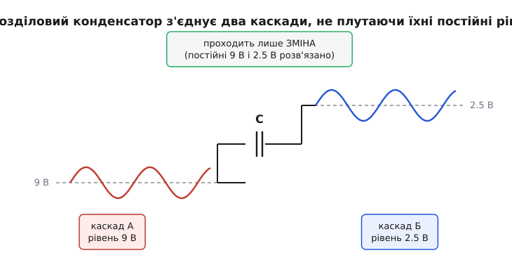
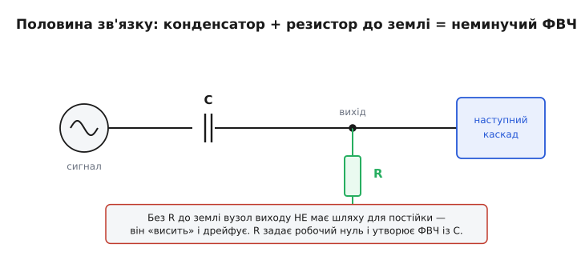
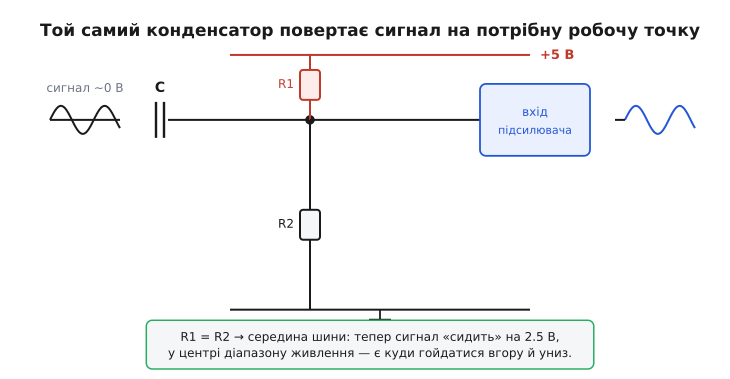
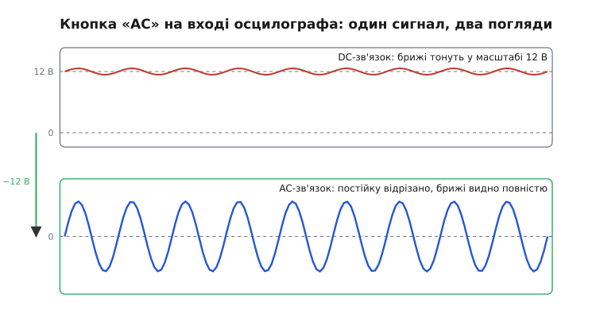

# AC-зв'язок: розділення сигналу конденсатором

Уявіть, що треба передати тихий шепіт сигналу від одного вузла схеми до іншого — але кожен із цих вузлів сидить на своїй власній постійній напрузі. Вихід першого гойдається навколо 9 вольт, вхід другого хоче жити навколо 2.5. З'єднати їх дротом не можна: дріт зрівняє постійні рівні, і другий вузол одразу втратить свій режим. Потрібен з'єднувач, який пропустить **зміну** (той самий шепіт) і відмовиться передавати **постійну складову** (різницю рівнів). Саме це робить **AC-зв'язок** (англ. *AC coupling*, «зв'язок за змінним струмом»), він же ємнісний зв'язок: один конденсатор у розрив сигнального шляху.

Назва говорить пряму річ: зі змішаного сигналу «постійка + брижі» через зв'язок проходить лише змінна частина (*alternating current*, AC), а постійна (*direct current*, DC) лишається по той бік. Це не якесь хитре коло — це звичайний послідовний конденсатор, що спирається на одну його властивість: [конденсатор не пропускає постійний струм, а змінному дає шлях](root:hw-components/capacitor) тим легший, чим швидша зміна. AC-зв'язок — це та властивість, поставлена на службу: розв'язати дві частини схеми за постійним струмом, лишивши їх з'єднаними за сигналом.

### Дві проблеми, одне рішення

Чому взагалі вузли сидять на різних постійних рівнях? Бо майже кожен підсилювальний каскад мусить мати свою **робочу точку** — постійну напругу й струм, навколо яких він підсилює. Транзистор підсилює лінійно лише у вузькій смузі режимів; щоб тримати його там, на нього подають постійне зміщення. У одного каскада це зміщення одне, у сусіднього — інше, бо вони збудовані по-різному. Тягнути постійку одного до іншого — означає збити обом режим. Тому каскади навмисне ізолюють за постійним струмом, але мусять обмінюватися сигналом.


*Вихід каскада А гойдається навколо 9 В, вхід каскада Б — навколо 2.5 В. Конденсатор у розриві пропускає однакові «брижі», але кожен бік лишає свою постійну: 9 і 2.5 нікуди не «перетікають» одна в одну. Форма сигналу та сама — змінився лише рівень, на якому вона сидить.*

Друга, ще приземленіша проблема — **паразитне зміщення**. Реальний давач, мікрофон, антена часто дають корисний змінний сигнал, що «сидить» поверх великої й нецікавої постійної напруги: пульсації ±50 мВ поверх шини 12 В, звукова доріжка поверх постійки мікрофонного капсуля, радіобрижі поверх рівня детектора. Якщо ту постійку пропустити далі, вона з'їсть увесь діапазон наступного каскада — підсилювач упреться в межу живлення й перестане підсилювати. AC-зв'язок зрізає постійну ще на вході: лишається тільки те, що змінюється.

Обидві проблеми — одна й та сама за суттю: «передай зміну, не передавай рівень». І розв'язує їх одна деталь. Постійний струм крізь конденсатор не тече ніколи (його [реактивний опір на нульовій частоті нескінченний](root:hw-components/capacitive-reactance), Xc = 1/(2πfC) → ∞ при f → 0), а змінному він дає тим легший шлях, чим вища частота. Конденсатор у розриві стає брамою, відчиненою лише для змінного.

### Половина зв'язку — це завжди ФВЧ

Тут ховається перша важлива правда, яку новачки пропускають: **сам по собі послідовний конденсатор сигнал нікуди не передасть**. Конденсатор передає зміну напруги на одному виводі — на інший, але напруга на виводі може змінюватися лише тоді, коли по ньому тече струм у щось. Якщо по той бік конденсатора немає шляху для струму на землю, вузол «висить»: на ньому накопичується невизначений заряд, він повільно дрейфує під дією мікроскопічних струмів витоку, і ніякого осмисленого сигналу там не буде.


*Конденсатор сам — лише пів-кола. Друга половина — резистор R, що дає вузлу виходу шлях на землю: він задає постійний нуль і разом із C утворює фільтр високих частот. Прибери R — і вузол «висить», дрейфуючи від струмів витоку.*

Отже, у AC-зв'язку завжди є **дві** деталі: послідовний конденсатор C і резистор R, що дає виходу шлях на землю (або на якийсь опорний рівень). А коло «послідовний C, потім R на землю, вихід знято з R» — це рівно [фільтр високих частот](root:hw-analog/rc-high-pass). Тобто AC-зв'язок — це не «ідеальне відсікання постійки», а реальний ФВЧ зі своєю **частотою зрізу**:

```
f_c = 1 / (2π · R · C)
```

Нижче за f_c сигнал слабшає й набирає фазовий зсув; вище — проходить майже без втрат. Постійка (f = 0) заборонена повністю. Це й добре, і погано: добре — бо саме f_c визначає, наскільки низькі корисні частоти ще пройдуть; погано — бо означає, що дуже повільний чи постійний сигнал через AC-зв'язок передати **неможливо в принципі**. Давач температури, чий корисний сигнал і є «постійкою», крізь розділовий конденсатор просто зникне.

Звідси перше робоче правило добору. Частоту зрізу ставлять **на декаду нижче** за найнижчу корисну частоту сигналу — щоб уся робоча смуга проходила рівною «полицею» ФВЧ, без втрат і без зайвого фазового зсуву.

> 🔧 **Навіщо це.** Найвідоміший AC-зв'язок у лабораторії — кнопка «AC» на вході [осцилографа](root:hw-sensing/oscilloscope). Натиснута, вона вмикає всередині послідовний конденсатор (зріз — одиниці герців) і дозволяє дивитися на дрібні пульсації поверх великої постійної напруги: брижі ±50 мВ на шині 5 В у режимі DC потонули б у масштабі, а в режимі AC видно їх у повний зріст. Але пам'ятайте про зворотний бік: повільний меандр у режимі AC «сповзає» й нахиляється — це не прилад зламався, це ваш власний ФВЧ чесно глушить низькі гармоніки. Повільні й постійні сигнали дивляться лише в режимі DC.

**Приклад (добір розділового конденсатора).** Аудіотракт має передавати від 20 Гц; вхідний опір наступного каскада, що й слугує нижнім плечем, R = 10 кОм. Ставимо зріз із запасом у декаду, f_c = 2 Гц. Тоді з f_c = 1/(2πRC):

```
C = 1 / (2π · f_c · R) = 1 / (2π · 2 · 10⁴) ≈ 8 мкФ   →  беремо 10 мкФ
перевірка на краю смуги:
K(20 Гц) = 1/√(1 + (f_c/f)²) = 1/√(1 + (2/20)²) ≈ 0.995   — сигнал майже цілий
```

Чому декада запасу, а не «зріз упритул»? На самій f_c сигнал уже втратив ~30 % амплітуди й набрав +45° фази — для краю робочої смуги забагато. До того ж каскадів зазвичай кілька, і їхні ФВЧ **множаться**: три зрізи «впритул» дадуть на нижній частоті 0.707³ ≈ 0.35 — утричі менший сигнал. Запас у декаду на кожному робить сумарний ефект непомітним.

### Де взяти той резистор — і чим він є насправді

Сказати «потрібен резистор на землю» легко; цікаве — звідки він береться. Часто його **не доводиться ставити окремо**, бо ним уже є щось у схемі:

- **вхідний опір наступного каскада.** Вхід підсилювача чи буфера сам має скінченний опір на землю — і цей опір автоматично стає нижнім плечем ФВЧ. Конденсатор зв'язку плюс вхідний опір наступного каскада — ось і вся пара;
- **резистор зміщення.** У транзисторних каскадах база сидить на дільнику зміщення; цей самий дільник дає базі шлях на землю — і він же закриває коло для AC-зв'язку;
- **окремий «стікаючий» резистор** (англ. *bleeder*), який ставлять навмисне там, де власного шляху на землю немає, — наприклад, перед входом із дуже високим власним опором.

Важливо тримати в голові: цей резистор робить **дві роботи одразу**. Він задає вузлу постійний нуль (куди «сповзає» заряд) і він же утворює ФВЧ. Тому його не можна обирати наосліп. Замалий R — і зріз f_c = 1/(2πRC) полізе вгору, з'їдаючи низькі частоти; завеликий R — і вузол стає чутливим до струмів витоку та наведень, на ньому накопичується шум. Тут той самий компроміс, що в будь-якому [дільнику напруги](root:hw-analog/voltage-divider): R має бути значно більший за вихідний опір джерела (щоб не підрізати сигнал дільником) і не настільки великий, щоб вузол «плив».

### Відновлення зміщення на тому боці

Прибрати постійку — півсправи. Часто на тому боці її треба **повернути** — але вже свою, потрібну. Класичний випадок — підсилювач на одному (однополярному) живленні. Він живиться від 0 до +5 В і може гойдати сигнал лише в цих межах. Якщо подати сигнал, що коливається навколо нуля, нижні півхвилі підуть «під землю» — у від'ємну область, якої живлення не має, — і зріжуться. Сигнал треба підняти на **середину** діапазону, на 2.5 В: тоді є однаковий запас угору й униз.


*Конденсатор зрізав стару постійку до чистого нуля. Дільник R1–R2 від шини живлення задає нову: рівні резистори ставлять середину, 2.5 В від шини 5 В. Тепер сигнал «сидить» по центру діапазону — є куди гойдатися в обидва боки.*

Механізм елегантний. Той самий резистор, що дає виходу шлях на землю, замінюють **дільником** від шини живлення: верхнє плече R1 до +5 В, нижнє R2 до землі. Дільник тримає вузол на своїй постійній напрузі (за рівних плечей — 2.5 В), а конденсатор тим часом домішує до цього рівня змінний сигнал. Постійку входу (нуль) конденсатор не передає, а постійку, задану дільником, він і не чіпає — вона народжується **після** конденсатора. Виходить точний поділ праці: дільник ставить рівень, конденсатор кладе на нього зміну. Цю операцію — «зняти стару постійку, поставити нову» — інколи звуть [зсувом рівнів](root:hw-digital/voltage-domain-interface), і AC-зв'язок робить її найдешевшим способом, який лише буває.

**Приклад (середина шини під однополярний підсилювач).** Маємо мікрофонний сигнал ±100 мВ навколо нуля; підсилювач на 3.3 В. Хочемо поставити сигнал на 1.65 В і пропустити від 50 Гц. Беремо рівний дільник R1 = R2 = 100 кОм (їхній паралель — 50 кОм — і є R для ФВЧ) і рахуємо C під зріз 5 Гц:

```
рівень:  V = 3.3 · R2/(R1+R2) = 3.3 · 100/(100+100) = 1.65 В     ✓ середина
R || для ФВЧ:  R1·R2/(R1+R2) = 100·100/200 = 50 кОм
C = 1/(2π · f_c · R) = 1/(2π · 5 · 5·10⁴) ≈ 0.64 мкФ   →  беремо 1 мкФ
перевірка: K(50 Гц) = 1/√(1+(5/50)²) ≈ 0.995              — край смуги цілий
```

Один конденсатор і два резистори — і сигнал з нульовою постійкою акуратно сів на 1.65 В, готовий до підсилення без обрізання.

### AC проти DC: коли який зв'язок

«Зв'язок» між двома вузлами буває двох видів, і вибір — змістовний. **DC-зв'язок** (пряме з'єднання, *direct coupling*) передає все: і постійку, і зміну, аж до нульової частоти. **AC-зв'язок** передає лише зміну, відсікаючи постійку нижче своєї f_c. Який потрібен — диктує сигнал.


*Згори — DC-зв'язок: брижі сидять на 12 В і тонуть у масштабі. Знизу — AC-зв'язок: постійку 12 В відрізано, нуль опустився на місце брижів, і та сама дрібна змінна видно в повний зріст. Один сигнал, два погляди — різниця лише в тому, чи є конденсатор у розриві.*

AC-зв'язок беруть, коли:

- корисний сигнал **змінний**, а постійка — лише заважає (звук, відео, радіо, пульсації живлення);
- треба **розв'язати робочі точки** двох каскадів, не плутаючи їхні зміщення;
- джерело має **повільний дрейф** постійки (від температури, старіння), який не хочеться тягти далі.

DC-зв'язок беруть, коли:

- корисний сигнал і є **постійкою** чи дуже повільною зміною (давач температури, тиску, струму, рівня);
- важлива **абсолютна** напруга, а не лише її коливання;
- сигнал треба передати **без фазового зсуву й провисання** на найнижчих частотах.

За DC-зв'язок платять окремим клопотом: постійні зміщення кожного каскада додаються й накопичуються по тракту, і цей дрейф доводиться приборкувати — найчастіше на [операційних підсилювачах](root:hw-analog/ideal-opamp) із від'ємним зворотним зв'язком або на симетричній [диференційній парі](root:hw-analog/opamp-input-stage), яка від природи нечутлива до спільного рівня. AC-зв'язок цей клопіт **знімає одним конденсатором** — ціною неможливості передати постійку. Це і є головний вибір: дешева розв'язка змінного проти повної прозорості з боротьбою за стабільність.

Історично саме цей вибір рухав схемотехніку. Перші багатокаскадні підсилювачі зв'язували каскади трансформаторами; потім, заради меншої ваги й ширшої смуги, перейшли на дешевий резисторно-конденсаторний зв'язок; а з появою операційних підсилювачів повернулися до прямого зв'язку там, де треба передавати постійку. Як цей маятник хитався — [окрема історія розвитку міжкаскадного зв'язку](root:hw-analog/ac-coupling/hist-coupling-evolution.md): від громіздкого трансформатора через дросель і RC до прямого зв'язку на ОП.

### Три пастки, яких варто стерегтися

**Провисання й вуса.** AC-зв'язок — це ФВЧ, а ФВЧ спотворює повільні прямокутні сигнали. Полиці довгих імпульсів «стікають» донизу зі сталою τ = RC (це **провисання**, *sag*), а на фронтах лишаються загострені викиди (**вуса**). Що нижча частота сигналу відносно f_c, то помітніше. Якщо передаєте логічні рівні чи широкі імпульси й бачите перекошену полицю — підозрюйте свій же розділовий конденсатор. Лікують підняттям RC (нижчий зріз) або переходом на DC-зв'язок.

**Полярність електроліта.** Щоб дістати велику ємність у малому корпусі (десятки й сотні мікрофарад на низькі зрізи), беруть електролітичні конденсатори — а вони **полярні**: мають плюс і мінус, і подати на них зворотну постійку не можна, інакше деградують і можуть здутися. У сигнальному шляху плюс орієнтують туди, де постійний потенціал **вищий**. Якщо ж на двох боках конденсатора постійка приблизно однакова чи невідомо, що вище (типово при двополярному живленні навколо нуля), ставлять **неполярний** конденсатор — плівковий або спеціальний біполярний електроліт.

**«Клац» при вмиканні.** У мить подачі живлення конденсатор зв'язку ще розряджений, і він заряджається через R до свого нового рівня за час τ = RC. Цей кидок проходить далі по тракту як коротка сходинка — у звуковій техніці чутна як «клац» у динаміку. Тому до підсилювача потужності сигнал часто подають **із затримкою**, даючи розділовим конденсаторам спершу тихо зарядитися.

### Зведення

AC-зв'язок — це передавання **зміни** з відсіканням **постійки** через один послідовний конденсатор. Працює він на тому, що [конденсатор блокує постійний струм і пропускає змінний](root:hw-components/capacitor) тим легше, чим вища частота. Сам конденсатор — лише половина: друга половина — резистор (часто це вхідний опір наступного каскада чи дільник зміщення), що дає вузлу шлях на землю. Разом вони — [фільтр високих частот](root:hw-analog/rc-high-pass) із зрізом **f_c = 1/(2πRC)**, який ставлять на декаду нижче робочої смуги. На тому боці постійку часто **відновлюють** дільником від шини — так сигнал саджають на потрібну робочу точку (типово середину живлення під однополярний підсилювач). Беруть AC-зв'язок для змінних сигналів і розв'язки робочих точок; для постійних і дуже повільних — лишається [прямий зв'язок](root:hw-analog/ideal-opamp) із його боротьбою за стабільність зміщень. Платять трьома відомими цінами: провисання повільних полиць, полярність електроліта в сигналі та «клац» при вмиканні. Усі вони передбачувані — і всі лікуються правильним добором тих самих двох деталей, C і R.
