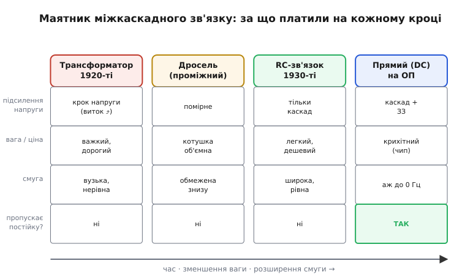

# 📜 Маятник міжкаскадного зв'язку: від трансформатора до прямого зв'язку

Один підсилювальний каскад майже ніколи не дає достатньо. Слабкий сигнал з антени чи мікрофона треба підсилити не вдвічі, а в тисячі разів — а отже, пропустити через кілька каскадів поспіль, де кожен бере вже підсилений виходом попереднього й підсилює далі. І тут одразу постає питання, яке здається дрібним, а насправді сто років визначало вигляд підсилювачів: **чим саме з'єднати вихід одного каскада зі входом наступного?**

Питання не пусте, бо з'єднати «просто дротом» здебільшого не можна. Кожен каскад сидить на своєму постійному рівні — на лампі це сотні вольтів на аноді, на транзисторі — своя робоча точка. Зв'язати два каскади дротом означає зрівняти ці рівні й збити обом режим. Потрібен з'єднувач, що пропустить **сигнал** і не пропустить **постійку**. А ще краще — щоб він заразом і підсилив сигнал, і не з'їв дорогоцінну енергію батареї, і не спотворив форму. Таких ідеальних з'єднувачів не буває; кожна епоха обирала свій компроміс. Історія цього вибору — це історія маятника, що хитнувся від громіздкого трансформатора до дешевого конденсатора й знову повернувся до прямого дроту, тільки вже на іншій елементній базі.

## Звідки взялася сама потреба: тріод, що нарешті підсилює

Усе почалося з лампи, яка вміла **підсилювати**. Двоелектродну лампу-діод (англ. *valve* — клапан, бо пропускає струм лише в один бік) збудував 1904 року Джон Емброуз Флемінг (John Ambrose Fleming) — вона випрямляла, але не підсилювала. Вирішальний крок зробив американець Лі де Форест (Lee de Forest): 1906 року він додав між катодом і анодом третій електрод — дротяну сітку — і назвав прилад «авдіон» (Audion). Патент на тріод (грец. *tri-* — три, *hodós* — шлях, тобто триелектродна лампа) він дістав 1907 року. Цікаво, що сам де Форест спершу погано розумів, **як** його лампа працює, і кілька років бачив у ній лише детектор. Підсилювальну здатність тріода — і саме каскадне ввімкнення, коли вихід однієї лампи живить вхід наступної, — почали усвідомлювати близько 1912 року, причому одразу кілька дослідників незалежно. *(Усталено: тріод — де Форест, 1906–1907; каскадне підсилення — ~1912, колективно.)*

Щойно стало ясно, що тріоди можна ставити ланцюжком, постало те саме питання про з'єднувач. І перша відповідь, яку дала інженерія 1910–1920-х, була не конденсатор.

> 🔧 **Навіщо це знати.** Здавалося б, навіщо розробникові 2020-х знати, чим зв'язували лампи сто років тому. Бо **компроміси нікуди не зникли** — змінилися лише деталі. Сьогодні ви так само щодня обираєте між «передати постійку» й «розв'язати рівні», між «дешево й широкосмугово» та «з трансформаторною гальванічною ізоляцією». Розуміючи, **чому** маятник хитався, ви бачите не випадковий набір схем у довіднику, а логіку: за що кожне рішення платить.

## Чому перші багатокаскадні підсилювачі взяли трансформатор

Тріод 1920-х — це лампа з **дуже високим внутрішнім опором** анодного кола (десятки тисяч ом) і **малим підсиленням за напругою** на самій лампі. Якщо просто з'єднати анод однієї лампи через конденсатор із сіткою наступної, ви передасте сигнал, але не виграєте ані вольта понад те, що дала сама лампа. А в епоху, коли кожен каскад коштував дорогої лампи, дорогої батареї й місця в шасі, віддати каскад лише на «передачу без виграшу» було розкішшю.

Трансформатор розв'язував це елегантно. Між анодом першої лампи й сіткою другої ставили **міжкаскадний трансформатор** (англ. *interstage transformer*) — дві обмотки на спільному осерді. Первинна обмотка вмикалася в анодне коло замість анодного резистора, вторинна йшла на сітку наступної лампи. І тут спрацьовувала фізика трансформатора: напруга на обмотках відноситься як кількість витків. Якщо вторинна обмотка має втричі більше витків, ніж первинна, то й змінна напруга на ній утричі більша:

```
U_втор / U_перв = N_втор / N_перв      (відношення витків)
типове підвищення в класі А:  1:3 … 1:6
```

Тобто трансформатор давав **безкоштовне** (з погляду енергії) підсилення за напругою — у 3–6 разів, ще до того, як сигнал торкнувся другої лампи. *(Усталено: підвищувальний коефіцієнт 1:3…1:6 типовий для каскаду класу А, де сітка вихідної лампи не споживає струму.)* До того ж він **узгоджував опори**: високий анодний опір тріода бачив із боку трансформатора зручне навантаження, а низький — сітка наступного каскада. І, що важило в добу батарейних приймачів, через первинну обмотку постійний анодний струм тік майже без втрат напруги: мідний дріт обмотки має малий опір за постійним струмом, тож батарея не марнувала вольтів на гріння резистора. На анодний резистор у RC-зв'язку, навпаки, частина високої анодної напруги падала намарно — а коли все живлення йде від батарей, це відчутно. Підручник з радіотехніки 1929 року прямо віддавав трансформаторному зв'язку перевагу саме за «більше підсилення за напругою при меншому споживанні батареї». *(Усталено: трансформаторний зв'язок панував у приймачах 1920-х; перевага за напругою й економією батареї — задокументована того часу.)*

Здавалося б, ідеальне рішення. Але трансформатор тяг за собою цілий хвіст вад, і кожна з них згодом стала причиною відмовитися від нього.

**Він важкий і дорогий.** Якісний звуковий трансформатор — це осердя з трансформаторної сталі й сотні метрів тонкого мідного дроту, намотаного з точністю. Така деталь важить більше за лампу, коштує дорого й займає місце. Для стаціонарного приймача в дерев'яній шафі це терпіли; щойно радіо захотіли носити з собою, вага трансформаторів стала головним ворогом.

**У нього вузька й нерівна смуга.** Це найглибша вада, і варто зрозуміти її механізм. Трансформатор передає змінний сигнал через магнітне поле в осерді — а магнітне поле піддається інерції й насиченню. На **низьких** частотах індуктивність первинної обмотки вже недостатньо велика, щоб «не закоротити» сигнал: бас провисає. На **високих** частотах вступають у гру паразитна ємність між витками й розсіювання магнітного потоку повз осердя — вони разом дають резонансні горби й завали. Між цими двома краями лишається відносно вузька середина, та й та з нерівностями. Тому трансформаторний підсилювач 1920-х звучав «телефонно»: середина є, країв немає.

**Він спотворює.** Осердя — феромагнетик, а намагнічення феромагнетика нелінійне (гістереза). Великий сигнал жене осердя в насичення, і на виході з'являються гармоніки, яких на вході не було. Що більший рівень — то помітніше.

Усі три вади мали один корінь: трансформатор спирається на **магнітне поле в залізі**, а залізо інерційне, нелінійне й важке. Поки за нього платили якістю звуку стаціонарних приймачів — терпіли. Та щойно змінилася задача, маятник хитнувся.


*Кожен спосіб виграє в одному й програє в іншому. Трансформатор дає підсилення напруги, але важкий і вузькосмуговий; RC легкий і широкий, але без виграшу за напругою; прямий зв'язок на операційному підсилювачі єдиний пропускає постійку аж до 0 Гц. Маятник рухався зліва направо — зменшення ваги й розширення смуги, аж поки задача не повернула до прямого дроту.*

## Дросель: половинчастий крок, що зберігав батарею

Перш ніж зовсім відмовитися від магнетизму, інженерія спробувала проміжне рішення — **дросельний зв'язок** (англ. *choke coupling*, або *impedance coupling* — зв'язок за повним опором). Ідея в тому, щоб лишити в анодному колі котушку (дросель), але **тільки одну обмотку**, без вторинної, а сигнал на наступну лампу зняти через окремий конденсатор.

Навіщо взагалі дросель, а не простий анодний резистор? Знову через батарею. Дросель — це котушка з товстого мідного дроту: його опір за **постійним** струмом малий, тож майже вся анодна напруга батареї доходить до лампи, а не падає на резисторі. А за **змінним** струмом котушка має велику реактивну індуктивну провідність (англ. *reactance*) — вона стає для сигналу високим навантаженням, на якому й виділяється підсилена змінна напруга. Виходить хитро: для постійки — майже дріт (батарея щаслива), для сигналу — високий опір (є з чого знімати підсилення).

```
дросель в анодному колі:
постійка → малий R мідної котушки → батарея майже не марнується
сигнал   → велика реактивність X_L = 2πf·L → є навантаження для підсилення
```

Дросель не давав **підвищення** напруги, як трансформатор (немає вторинної обмотки з більшим числом витків), зате був простіший, дешевший і не так спотворював. Та й він успадкував магнітні болячки: котушка з потрібною індуктивністю об'ємна, а її реактивність X_L = 2πf·L залежить від частоти, тож на **низьких** частотах навантаження падає й бас знову провисає. Дросельний зв'язок лишився **половинчастим кроком** — кращим за трансформатор у простоті й лінійності, гіршим у компактності й рівності смуги, ніж те, що йшло слідом. У серійних приймачах він так і не став головним; його роль — саме проміжна сходинка, на якій інженери вже відмовилися від вторинної обмотки, але ще не наважилися викинути магнетизм геть. *(Усталено: дросельний/імпедансний зв'язок — проміжний метод, малий DC-спад, але обмежений знизу й об'ємний; широкого вжитку в аудіо не здобув.)*

## 1930-ті: портативність змінює задачу — і перемагає RC

Справжній перелом приніс не новий винахід, а **нова задача**. У 1930-х радіо рушило з шафи: настільні приймачі дешевшали, з'являлися переносні моделі, і вага з ціною стали важити більше за бездоганний бас. А найважче й найдорожче в підсилювачі — саме трансформатори. Викинути їх означало одразу полегшити й здешевити приймач.

Заміна вже існувала й була до сміху простою — **резисторно-конденсаторний зв'язок** (англ. *resistance-capacitance coupling*, RC). У анодне коло першої лампи замість трансформатора чи дроселя ставили звичайний анодний резистор; з анода через розділовий конденсатор сигнал ішов на сітку наступної лампи, а сітка діставала шлях на землю (на свій рівень) через резистор витоку сітки. Усе з'єднання — три копійчані деталі: анодний резистор, конденсатор, сітковий резистор. Типові номінали тих років добре відомі: анодний резистор близько 100 кОм, розділовий конденсатор порядку 0.01–0.05 мкФ, сітковий резистор близько 0.5–1 МОм. *(Усталено: такі номінали — характерні для RC-зв'язку лампових каскадів; зустрічаються вже в батарейних приймачах кінця 1920-х.)*

Варто одразу розвіяти поширений міф. У деяких джерелах (зокрема в одній неавторитетній, без посилань, версії статті про RC-зв'язок) трапляється твердження, ніби «RC-зв'язок винайшли якісь конкретні особи 1964 року». Це **неправда**: RC-зв'язок використовували в лампових приймачах уже наприкінці 1920-х — на десятиліття раніше. У RC-зв'язку немає й не може бути «одного винахідника» з точною датою: це не хитрий пристрій, а **очевидне поєднання** трьох пасивних деталей, що виникло органічно разом із каскадним тріодом, щойно інженери побачили, що конденсатор пропускає сигнал, а резистор задає рівень. *(Статус: «винахід 1964 року конкретними особами» — недостовірне твердження, суперечить усій документованій історії; RC-зв'язок — колективне, очевидне рішення кінця 1910-х–1920-х.)*

Чому ж RC не перемогло одразу, а лише в 1930-х? Через ту саму батарею. RC-зв'язок має дві ціни, які в добу дорогих батарей і слабких ламп були відчутні:

**Він не підсилює за напругою.** Конденсатор лише передає те, що дала лампа, — жодного «безкоштовного» множення, як у трансформатора. Щоб дістати те саме сумарне підсилення, треба було **більше каскадів** (а кожен каскад — це знову лампа й живлення).

**На анодному резисторі марнується напруга.** Частина високої анодної напруги падає на резисторі намарно, гріючи його, тоді як трансформатор чи дросель пропускали постійку майже без втрат. За батарейного живлення кожен загублений вольт болів.

Що ж переважило ці ціни в 1930-х? По-перше, лампи стали кращими: з'явилися багатосіткові лампи (тетроди, пентоди) з куди більшим власним підсиленням, тож «безкоштовний» виграш трансформатора став менш потрібним — одна добра лампа з анодним резистором давала підсилення, заради якого раніше тягли трансформатор. По-друге, мережеве живлення поступово витісняло батарейне, і марнування кількох вольтів на анодному резисторі перестало бути трагедією. А натомість RC дарував те, чого магнетизм дати не міг: **широку й рівну смугу**. Анодний резистор однаково навантажує лампу на всіх частотах — немає ні низькочастотного провисання індуктивності, ні високочастотних резонансів осердя. Підсилювач нарешті звучав від глибокого баса до верхів рівною полицею. Плюс — мізерна вага, копійчана ціна й жодних нелінійних спотворень заліза.

Тут варто чесно назвати й матеріальне обмеження, що довго гальмувало RC. Від світанку лампової ери приблизно до кінця 1930-х конденсатори згортали з мідної або олов'яної фольги — дешевої алюмінієвої фольги й тонких полімерних плівок-діелектриків ще не було. Тому конденсатор навіть на одиниці мікрофарад був об'ємний і недешевий. Це не заважало самому RC-зв'язку (там потрібні соті частки мікрофаради), але показує, чому «просто конденсатор» не завжди був дешевим розв'язком і чому інженери так трималися за трансформатор, поки могли. *(Усталено: до кінця 1930-х — лише мідна/олов'яна фольга, без дешевого алюмінію й полімерів; великі ємності були дорогі.)*

Підсумок маятникового хитка 1930-х: задача змінилася (вага й ціна понад ідеальний бас), елементна база дозріла (кращі лампи, мережеве живлення), і RC-зв'язок витіснив трансформатор у масовому радіо. Трансформатор не зник — він лишився там, де потрібні саме його сильні сторони: на **виході** підсилювача потужності (узгодити високий опір лампи з низькоомним динаміком), у вхідних каскадах для мікрофонів і в апаратурі, де цінують гальванічну ізоляцію двох кіл одне від одного. Але міжкаскадним з'єднувачем загального вжитку став конденсатор.

> 🔧 **Навіщо це знати.** Та сама логіка діє й сьогодні, тільки замість «батарея чи мережа» питання звучить «скільки можна витратити мікроват і центів». RC-зв'язок (а в книзі — [AC-зв'язок одним конденсатором](topic:hw-analog/ac-coupling)) лишається найдешевшим способом розв'язати дві частини схеми за постійним струмом, лишивши їх з'єднаними за сигналом. Розуміючи, що це **фільтр високих частот**, а не «ідеальне відсікання постійки», ви свідомо ставите частоту зрізу нижче робочої смуги — і не дивуєтеся, чому повільний сигнал крізь нього не проходить.

## Повернення до прямого дроту: чому DC-зв'язок став можливим знову

Маятник хитнувся востаннє — назад, до **прямого зв'язку** (англ. *direct coupling*, DC), коли анод (а згодом колектор чи стік) однієї лампи з'єднують зі входом наступної **просто дротом**, без жодного конденсатора чи трансформатора. Звучить як крок назад до «з'єднати дротом», з якого ми починали зі словами «так не можна». То чому це раптом стало можна — і навіщо?

**Навіщо.** Бо за всю свою зручність AC-зв'язок має одну непереборну ваду: він **не пропускає постійку**. Сигнал давача температури, тиску, рівня, струму — це повільна зміна або й чиста постійна напруга; для нього конденсатор зв'язку — глуха стіна. Будь-яка задача, де важить **абсолютний** рівень сигналу, а не лише його коливання, вимагає прямого зв'язку. А ще прямий зв'язок не має ні провисання повільних полиць, ні фазового зсуву на низах — він прозорий аж до нульової частоти.

**Чому це важко.** Прямий зв'язок передає на наступний каскад **усе** — і сигнал, і постійний рівень. А отже, постійні зміщення каскадів **додаються й накопичуються** по тракту. Найгірше — вони **дрейфують**: робоча точка лампи чи транзистора повзе від нагрівання, старіння, коливань живлення. У багатокаскадному прямозв'язаному підсилювачі цей дрейф множиться, і на виході неможливо відрізнити корисний повільний сигнал від «сповзання» власних зміщень. Саме тому ранні підсилювачі тікали в AC-зв'язок: конденсатор автоматично відрізав увесь цей накопичений дрейф.

Прямий зв'язок намагалися приборкати ще в лампову добу. Класичний приклад — **підсилювач Лофтіна–Вайта** (Loftin–White): американці Едвард Лофтін (Edward H. Loftin) і Сайрус Вайт (Cyrus Y. White) опублікували його в журналі *Radio News* близько 1929–1930 років. Це двокаскадний підсилювач, де анод першої лампи з'єднано із сіткою другої **безпосередньо**, без розділового конденсатора й сіткового резистора, а рівні узгоджено хитрим розрахунком резисторів живлення. Схема давала на диво рівну для свого часу смугу — приблизно від 50 Гц до 10 кГц. Але вона була **примхлива**: рівні треба було вивіряти точно, і будь-який дрейф ламп зсував усю робочу точку. Прямий зв'язок працював — але лишався мистецтвом для ентузіастів, а не масовим рішенням. *(Усталено: Лофтін–Вайт, *Radio News*, ~1929–1930; пряме з'єднання анод–сітка без блокувального конденсатора; смуга ~50 Гц–10 кГц; чутливість до точності рівнів і дрейфу.)*

Що ж нарешті зробило прямий зв'язок **рутинним**? Не один винахід, а зустріч кількох ідей, що остаточно зійшлися в **операційному підсилювачі**.

Сам термін «операційний підсилювач» (англ. *operational amplifier*, бо разом із зовнішніми деталями виконує математичні **операції**) запропонували Джон Раджацціні (John Ragazzini) із співавторами Робертом Рендаллом і Фредом Расселом у статті 1947 року в *Proceedings of the IRE*. Перші операційні підсилювачі були **лампові** й слугували обчислювальними блоками аналогових обчислювальних машин, де треба було точно додавати й інтегрувати **постійні** напруги — отже, прямий зв'язок був обов'язковий. Знаковим масовим зразком став ламповий блок K2-W фірми Джорджа Філбрика (George A. Philbrick Researches), випущений 1952 року, — перший операційний підсилювач, який не треба було проєктувати самому, щоб ним користуватися. *(Усталено: термін — Раджацціні та ін., 1947; лампові ОП для аналогових ЕОМ; Philbrick K2-W, 1952.)*

Ключем до приборкання дрейфу стала **диференційна (різницева) пара** — два однакові підсилювальні елементи в симетричній схемі, що підсилює лише **різницю** двох входів і за природою своєю байдужа до спільного рівня й до синхронного дрейфу обох половин. Якщо обидві лампи (а згодом транзистори) повзуть від тепла однаково, їхня різниця не змінюється — дрейф самознищується. Додайте до цього **від'ємний зворотний зв'язок**, що жорстко прив'язує вихід до входу через зовнішні резистори, — і прямозв'язаний підсилювач нарешті став стабільним без чаклування над кожним резистором.

Остаточно прямий зв'язок переміг із приходом **монолітних** мікросхем-операційників — коли весь підсилювач разом із диференційною парою вмістили на одному кристалі кремнію. Тут варто розвіяти ще одну плутанину: інженер Боб Відлар (Bob Widlar) у фірмі Fairchild Semiconductor близько 1964 року спроєктував µA702 — **перший монолітний операційний підсилювач**, а потім µA709; його ж лінію продовжив славнозвісний µA741 (1968). Відлар винайшов **інтегральний операційник**, а не «RC-зв'язок» — це різні речі, які іноді плутають у недбалих джерелах. *(Усталено: Widlar, Fairchild, µA702 ~1964 — перший монолітний ОП; µA709; µA741 — 1968. Це винахід ІС-операційника, не RC-зв'язку.)* На кристалі всі транзистори лежать поруч, у тих самих умовах і за тієї самої температури, тож їхні параметри й дрейф збігаються майже ідеально — диференційна пара працює бездоганно, і прямий зв'язок усередині мікросхеми стає природним станом речей. До того ж перехід від германію до кремнію в 1960-х різко зменшив теплові струми витоку, що отруювали ранні прямозв'язані схеми.

Отак маятник завершив повний оберт. Почали з прямого дроту й сказали «так не можна» — бо дрейф. Утекли в трансформатор — заради підсилення напруги, заплатили вагою й смугою. Перейшли на конденсатор — заради ваги й смуги, заплатили неможливістю передати постійку. І повернулися до прямого дроту — але вже не наосліп, а всередині операційного підсилювача, де диференційна пара, від'ємний зворотний зв'язок і однорідний кремнієвий кристал нарешті приборкали той самий дрейф, що сто років тому гнав інженерів геть від прямого з'єднання. *(Усталено: диференційна пара + ЗЗ + монолітна інтеграція на кремнії зробили DC-зв'язок рутинним; історично — від аналогових ЕОМ 1950-х до ІС-операційників 1960-х.)*

## Що з цього лишилося в сьогоднішній схемі

Цікаво, що жоден зі способів не зник остаточно — кожен осів у своїй ніші, і всі чотири живі досі.

**Трансформатор** лишився там, де потрібні саме його унікальні риси: гальванічна розв'язка двох кіл (жодного спільного дроту — важливо для безпеки й проти завад), узгодження дуже різних опорів (вихід лампового підсилювача потужності й низькоомний динамік) і робота на високих частотах у радіотехніці. У звичайному міжкаскадному зв'язку його майже не побачиш, а на вході/виході спеціальної апаратури — постійно.

**Дросель** як міжкаскадний з'єднувач практично зник, але дроселі живуть у фільтрах живлення й імпульсних перетворювачах, де їхня здатність «пропускати постійку, опиратися зміні струму» — основа роботи.

**RC-зв'язок** (він же AC-зв'язок одним конденсатором) — досі найпоширеніший спосіб передати змінний сигнал, відрізавши постійку: від входу будь-якого звукового підсилювача до кнопки «AC» на осцилографі. Дешево, легко, прозоро по смузі — рівно те, заради чого його колись узяли.

**Прямий зв'язок** — стандарт усередині кожної аналогової мікросхеми й будь-якого тракту, де важлива постійна складова: давачі, вимірювання, прецизійні підсилювачі. Те, що сто років тому було примхливим мистецтвом Лофтіна й Вайта, нині сидить непомітно в кожному операційному підсилювачі за кілька центів.

Маятник не зупинився в якійсь одній точці — він розклав способи по задачах. І коли наступного разу ви ставите розділовий конденсатор між каскадами чи, навпаки, з'єднуєте їх прямо через операційний підсилювач, ви робите той самий вибір, що й інженери 1920-х біля своїх трансформаторів: **передати зміну — чи передати все**. Тільки тепер у вас є вся палітра рішень, і ви знаєте, за що кожне платить.
