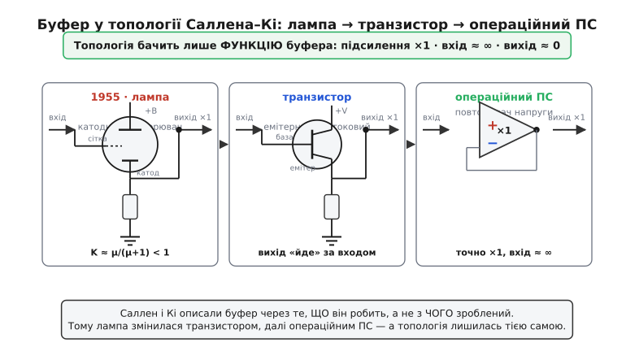

# 📜 Як народилася схема Саллена–Кі: фільтр без котушки в епоху ламп

Назва «фільтр Саллена–Кі» сьогодні звучить так буденно, що про неї майже не думають — узяв два резистори, два конденсатори, операційний підсилювач, і маєш гострий фільтр другого порядку. Але за цими двома прізвищами стоять двоє живих людей, конкретна лабораторія, конкретний рік і дуже конкретна біда, яку вони розв'язували. І найдивніше: у тій схемі **не було операційного підсилювача**. Його тоді ще не існувало як деталі. Підсилювачем була електронна лампа. Щоб зрозуміти, чому топологія саме така, варто повернутися в 1955 рік і побачити, об що саме вони билися.

## Двоє інженерів і одна лабораторія

Схему придумали **Рональд П. Саллен** (англ. *Ronald P. Sallen*) і **Ернест Л. Кі** (англ. *Ernest L. Key*) — двоє інженерів **Лінкольнівської лабораторії Массачусетського технологічного інституту** (англ. *MIT Lincoln Laboratory*). У підписах їхньої статті стоять ініціали — *R. P. Sallen* і *E. L. Key*, — і саме в такому вигляді, через дефіс між прізвищами, назва прижилася в усьому світі: **Sallen–Key**. Порядок прізвищ — алфавітний за латиницею, без жодного натяку на «головного»; це робота двох рівних авторів.

Лінкольнівська лабораторія — місце не випадкове. Її заснували 1951 року як федеральний дослідний центр при MIT, і початкове завдання було суто оборонне: побудувати систему протиповітряної оборони країни. З цього виросла велетенська система **SAGE** (англ. *Semi-Automatic Ground Environment*) — мережа радарів і обчислювальних центрів, що мала в реальному часі зводити докупи дані про повітряну обстановку. Це був самий передній край електроніки тих років — і весь він тримався на електронних лампах. Жодних кремнієвих мікросхем, жодних операційних підсилювачів у звичному нам сенсі: транзистор щойно народився (1947), а перший інтегральний ОП з'явиться аж за десятиліття. Інженер 1955 року, якому треба було підсилення, тягнувся до лампи.

> 🔧 **Навіщо це.** Корисно бачити, що знайома схема — не «формула з підручника, яка була завжди», а інженерна відповідь на конкретну скруту конкретної епохи. Коли розумієш, *від чого* тікали Саллен і Кі, стає очевидно, *чому* в топології саме повторювач, саме додатний зв'язок через конденсатор і саме два RC: кожен елемент там стоїть не з естетики, а тому що інакше задача в 1955 році не розв'язувалася. Це той тип розуміння, який потім дозволяє свідомо міняти схему під свою задачу, а не переписувати її напам'ять.

## Біда, з якої все почалося: котушка на низьких частотах

Щоб зробити гострий частотний фільтр класичним способом, потрібен резонанс, а резонанс дає пара різнорідних накопичувачів енергії — **конденсатор і котушка індуктивності**. На радіочастотах це не проблема: там котушки маленькі, бо потрібна індуктивність невелика. Але Саллену й Кі треба було фільтрувати **низькі частоти** — одиниці й десятки герців. І ось тут котушка стає кошмаром.

Річ у фізиці. Щоб котушка давала помітний опір (а отже й резонанс) на низькій частоті, її індуктивність мусить бути великою — а велика індуктивність означає багато витків дроту на масивному осерді. Така котушка виходить **громіздкою, важкою і дорогою**. Гірше: довгий дріт має чималий власний активний опір, тож котушка вже не «чиста» — вона помітно **втрачає** енергію на тепло, а саме втрати вбивають добротність, тобто ту гостроту, заради якої котушку й ставили. Додайте сюди, що велика котушка — чудова **антена для наводок**: вона ловить мережеву гуду 50/60 Гц і магнітні поля довкола, які на низьких частотах саме й заважають. Виходить замкнене коло: деталь, потрібна для гострого низькочастотного фільтра, на низьких частотах поводиться найгірше.

У самій статті 1955 року поріг названо прямо: приблизно **нижче 30 Гц** індуктивності стають надто великими, надто втратними й надто незручними, щоб будувати на них фільтри з пристойними характеристиками. Це не округла поетична межа — це інженерна констатація: ось тут класичний LC-підхід здається, і потрібен інший.

```
Чому котушка програє на низьких частотах:

   опір котушки     X_L = 2 · π · f · L
   мала частота f  →  щоб X_L був помітним, L мусить бути великим
   велике L        →  багато витків → громіздко, дорого, важко
                   →  довгий дріт    → великий R_втрат → падає Q
                   →  велика площа   → ловить наводки 50/60 Гц
```

Звідси й розвилка, перед якою стояли автори: або миритися з велетенськими котушками, або **зробити фільтр узагалі без індуктивності** — на самих лише резисторах і конденсаторах, які на низьких частотах якраз поводяться чудово (конденсатор тим менший, чим нижча частота йому байдужа — він не громіздкий і наводок майже не ловить). Проблема одна: пасивне коло з самих R і C не вміє давати високу добротність — пара RC застрягає на млявому [Q = 0.5](topic:hw-analog/quality-factor). Бракує другого, різнорідного накопичувача, який обмінювався б енергією з конденсатором. Котушку викинули — а її роль лишилася порожньою. Саллен і Кі знайшли, ким її заповнити: **підсилювачем**.

## Стаття 1955 року

Своє рішення вони виклали у статті з промовистою, дуже інженерною назвою — **«A Practical Method of Designing RC Active Filters»** («Практичний метод проєктування активних RC-фільтрів»). Слово «практичний» тут не випадкове: на той час теорія синтезу кіл уже вміла показати, що активний елемент *у принципі* може замінити котушку, але це лишалося абстракцією — формули без рецепта. Саллен і Кі дали саме **рецепт**: бери стільки резисторів і конденсаторів, з'єднай отак, постав підсилювач сюди — і дістанеш потрібну характеристику фільтра нижчого порядку, причому ланки можна **складати в каскад**, бо повторювач розв'язує їх одну від одної.

Вийшла стаття в **IRE Transactions on Circuit Theory** — журналі Інституту радіоінженерів (англ. *Institute of Radio Engineers*, IRE; згодом, 1963 року, IRE злився з AIEE в сучасний **IEEE**) із секції теорії кіл. Точні вихідні дані, що їх легко звірити в бібліографіях:

```
R. P. Sallen, E. L. Key.
«A Practical Method of Designing RC Active Filters».
IRE Transactions on Circuit Theory, том 2, число 1, с. 74–85.
березень 1955.
```

Маленька, але корисна деталь про назву: у каталогах і первинних бібліографічних записах вона стоїть зі словом **of** — «*Method **of** Designing*». У пізніших переказах і підручниках часто трапляється варіант «*Method **for** Designing*» — зміст той самий, але як точну цитату перводжерела беруть форму з *of*. Дрібниця, та коли посилаєшся на оригінал, дрібниці й відрізняють звірений факт від переказу переказу.

> Статус доказовості: **усталений факт**. Авторство (R. P. Sallen та E. L. Key), приналежність до Лінкольнівської лабораторії MIT, назва статті, журнал IRE Transactions on Circuit Theory, том 2 (число 1), сторінки 74–85 і дата (березень 1955) збігаються в незалежних довідкових джерелах. Так само усталене, що в оригіналі підсилювачем був ламповий катодний повторювач, а не операційний підсилювач.

## Підсилювач, якого не було: катодний повторювач

Ось місце, де сучасна інтуїція найчастіше підводить. Ми звикли, що «підсилювач у фільтрі Саллена–Кі» — це операційний підсилювач, увімкнений [повторювачем напруги](topic:hw-analog/voltage-follower). Але 1955 року операційного підсилювача як готової дешевої деталі **не існувало**. Тож постає природне питання: що ж тоді Саллен і Кі ставили в схему?

Відповідь: **катодний повторювач** (англ. *cathode follower*) на електронній лампі. Це класичний ламповий каскад, у якому сигнал знімають не з анода, а з **катода** лампи — і саме ця дрібниця дає рівно ті три властивості, яких топологія Саллена–Кі вимагає від свого підсилювача:

- **підсилення майже точно одиниця** (трохи менше за 1), тобто каскад нічого не міняє в амплітуді, лише повторює напругу;
- **дуже високий вхідний опір** — повторювач майже не бере струму з RC-кола перед собою, отже не навантажує його й не зсуває розрахунок;
- **низький вихідний опір** — твердий, незалежний вихід, яким можна живити петлю зворотного зв'язку, не боячись, що навантаження її просадить.

Це той самий портрет, що його потім успадкує операційний повторювач — лише зроблений лампою замість кремнію. Чому підсилення трохи **менше** за одиницю, а не точно одиниця? Бо щоб лампа взагалі проводила струм, між її сіткою (входом) і катодом (виходом) мусить лишатися невелика різниця напруг; катод не може повторити сітку *ідеально точно*, бо тоді керувати лампою стало б нічим. Для лампи з коефіцієнтом підсилення µ (мю) коефіцієнт катодного повторювача виходить приблизно

```
K ≈ µ / (µ + 1)
```

— тобто при µ = 20 це ≈ 0.95, при µ = 100 — ≈ 0.99. Завжди трішки нижче за одиницю, але дуже близько. Для топології цього вистачає: важливо, що повторювач **не навантажує** RC і дає **твердий вихід**, а те, що він віддає не 1.00, а 0.97, лише трохи зсуває добротність — і це враховують у розрахунку номіналів. Сам Саллен у статті й описує катодний повторювач саме як «розумне наближення до підсилювача з одиничним підсиленням» — не ідеал, а достатньо добрий практичний буфер.

Тут варто зупинитися й оцінити елегантність ходу. Котушку викинули через її низькочастотні біди. На її місце поставили активний елемент — але не як підсилювач *гучності* (підсилення ж одиниця, амплітуда не росте), а як **розв'язувач і джерело для зворотного зв'язку**. Уся «магія» резонансу береться не з підсилення, а з того, що твердий вихід повторювача повертають через конденсатор назад у коло — [додатним зворотним зв'язком](topic:hw-analog/negative-feedback), дозовано підпираючи характеристику. Підсилювач тут не «качає гучність», він **організовує обмін енергією**, якого пасивним R і C самим не вистачало. Саме тому каскад із підсиленням рівно одиниця — і при тому абсолютно необхідний.

## Чому саме «практичний метод»: рецепт, а не теорема

Варто наголосити на слові, винесеному в назву статті, бо в ньому — суть внеску. До 1955 року теорія вже знала, що активний елемент здатен синтезувати поведінку котушки; це випливало із загального синтезу кіл. Але знати, що *можна*, і мати в руках **готовий рецепт**, як це зробити чотирма деталями й однією лампою, — різні речі. Внесок Саллена й Кі був саме інженерний, «практичний»: вони дали схему, у якій частота зрізу й добротність керуються прозоро й майже незалежно, а ланки складаються в каскад без взаємного псування. Інженер міг узяти таблицю, підставити числа — і збудувати фільтр, не виводячи щоразу синтез із нуля.

Це типовий і дуже цінний рід винаходу — не нова фізика, а **робочий метод**, що перетворює абстрактну можливість на буденний інструмент. Саме тому топологія пережила свою елементну базу: лампа давно зникла зі схеми, а метод лишився, бо метод не залежав від того, *чим* саме зроблено повторювач.

## Як топологія пережила лампи

Тепер видно головне, чому ця історія взагалі варта окремої розповіді. Саллен і Кі описали топологію в термінах **функції** підсилювача — «потрібен буфер із одиничним підсиленням, високим входом і низьким виходом», — а не в термінах конкретної лампи. Тому щойно з'являлася краща деталь, що виконує ту саму функцію, її просто **підставляли на місце катодного повторювача**, а схема лишалася тією самою.

Так і сталося. Спершу місце лампового катодного повторювача зайняв **транзисторний** повторювач (емітерний на біполярному або витоковий на польовому транзисторі) — менший, без розжарення, без високих анодних напруг. А коли на ринок прийшов дешевий **інтегральний операційний підсилювач**, увімкнений повторювачем напруги, він виявився мало не ідеальним буфером для цієї ролі: підсилення з точністю до часток відсотка одиниця, вхідний опір величезний, вихідний — мізерний. Топологія Саллена–Кі, придумана для лампи, лягла на ОП так, наче для нього й створювалась.


*Топологія описана через функцію буфера (×1, високий вхід, низький вихід), а не через деталь. Тому катодний повторювач 1955 року спокійно змінився транзисторним, а далі операційним — схема лишилась тією самою.*

У цьому й полягає урок, ширший за саму схему. **Добре сформульований інженерний метод переживає технологію, на якій народився**, якщо описаний у термінах функції, а не реалізації. Саллен і Кі тікали від громіздкої низькочастотної котушки за допомогою лампи, якої сьогодні в схемі нема й сліду, — а їхня топологія досі стоїть на вході майже кожного аналого-цифрового перетворювача, тільки повторювач у ній уже інший. Прізвища лишилися, лампа пішла, метод працює.
