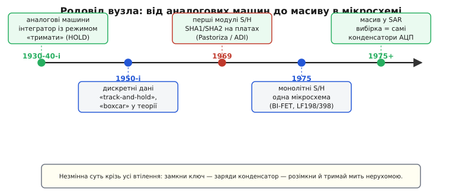

# 📜 Як народився вузол «заморозь мить»

Ідея взяти рухому величину, на коротку хвилю зупинити її й тримати нерухомою, поки з нею працюєш, — старша за будь-яку мікросхему. Вона визрівала майже півстоліття в зовсім різних головах: у людей, що рахували диференціальні рівняння колесами й дисками; у теоретиків, які довели, скільки знімків на секунду треба, щоб не втратити сигнал; у фізиків, що виловлювали слабкий відгук із-під шуму. Кожен приходив до одного й того самого прийому зі свого боку — і додавав слово, яке з нами й досі: «тримати» (hold), «стежити-й-тримати» (track-and-hold), «вагон» (boxcar). Ця вставка простежує, звідки взявся вузол вибірки-зберігання й чому його суть не змінилася від громіздких аналогових машин до мікронних конденсаторів усередині сучасного АЦП.


*П'ять зупинок одного родоводу. Прийом «замкни ключ — заряди конденсатор — розімкни й тримай» проходить крізь усі втілення незмінним; змінюється лише те, з чого зроблено конденсатор і ключ — від ламп на монтажній платі до нанометрового кремнію.*

## Машини, що рахували колесами: звідки взявся режим «тримати»

Щоб зрозуміти, де вперше знадобилося свідомо *зупинити й тримати* аналогову величину, треба зайти в епоху, коли складні рівняння розв'язували не числами, а фізичними величинами — обертами валів, напругами, струмами. Це аналогові обчислювальні машини.

Найвідоміша рання така машина — **диференціальний аналізатор** (differential analyzer) Веннівара Буша (Vannevar Bush) з його командою в Массачусетському технологічному інституті; перший діючий екземпляр збудували приблизно між 1928 і 1931 роками. У ньому інтегрування виконували механічно — колесо котилося по обертовому диску, і що далі від центра диска притиснуте колесо, то швидше воно крутилося; сума обертів і давала інтеграл. Головним досягненням Буша було не саме колесо-інтегратор (такі пристрої знали й раніше), а спосіб **зчепити** кілька інтеграторів так, щоб машина розв'язувала рівняння високого порядку. *(Усталений факт: авторство машини та її датування добре задокументовані; Буш — американський інженер, місце — MIT.)*

Механічний аналізатор ще не потребував «заморожування миті» в нашому сенсі — вал просто зупинявся, і його кут стояв сам собою, бо метал нікуди не тече. Але коли по Другій світовій війні на зміну колесам і валам прийшли **електронні** аналогові машини, картина змінилася. Тепер інтеграл жив як **напруга на конденсаторі**: підсилювач заганяв у конденсатор струм, пропорційний входу, і напруга на ньому росла як інтеграл. І тут одразу постала потреба, якої в металі не було так гостро.

Електронний інтегратор мусив уміти щонайменше три речі, і між ними його перемикали:
- **лічити** (compute) — конденсатор інтегрує вхід, напруга біжить;
- **скинути** (reset) — конденсатор розряджають до нуля або до заданого початкового значення перед новим прогоном;
- **тримати** (hold) — конденсатор **відрізають** від входу, і напруга **застигає** там, де була.

Ось воно — режим **HOLD** електронного інтегратора. Навіщо він був потрібен? Щоб зупинити «час» усередині машини й спокійно **зчитати** проміжний результат приладом, який сам по собі не миттєвий: підключити вольтметр, записати число на самописець, перевести значення в іншу частину установки. Поки машина «лічить», усі напруги біжать разом і зчитувати їх незручно; натиснеш «тримати» — усе завмирає, і можна не поспішаючи знімати показання. Це та сама думка, що й у нашому S/H: **знерухом величину, поки з нею працює повільний прилад**. Тільки тут заморожували не один канал перед оцифруванням, а весь стан машини перед зчитуванням.

> 🔧 **Навіщо це.** Спорідненість не випадкова, а буквальна. Режим HOLD аналогового інтегратора й фаза «зберігання» в S/H — це фізично **той самий прийом**: конденсатор, який відрізали від входу керованим ключем, щоб напруга на ньому перестала змінюватися. Хто зрозумів, чому інтегратор треба було «тримати» для зчитування, той уже наполовину зрозумів, навіщо АЦП потрібна вибірка-зберігання. Родовід тут прямий, а не за аналогією.

## Теорія наздоганяє: скільки знімків на секунду вистачає

Поки інженери будували машини, математики й зв'язківці розв'язували суміжне питання, без якого вся ідея дискретних знімків повисла б у повітрі: **чи можна взагалі відновити неперервний сигнал із окремих його миттєвих значень — і якщо так, як часто ці значення брати?** Відповідь на нього — фундамент, на якому стоїть будь-яка вибірка, зокрема наша.

Історія цієї відповіді повчальна тим, як по-різному люди до неї приходили — і як легко потім приписати її одній людині чи одній країні. Розкладемо чесно, хто що зробив, бо тут кожен вимір важливий.

- **Едмунд Тейлор Віттекер** (Edmund Taylor Whittaker), британський математик, ще **1915 року** дослідив, як через задані точки провести «найгладшу» функцію без зайвих високих частот — так звану кардинальну функцію. Це була чиста математика інтерполяції, **без жодного натяку на зв'язок чи радіо**.
- **Гаррі Найквіст** (Harry Nyquist), інженер шведського походження, що працював у США (Bell Labs), **1928 року** показав, скільки незалежних імпульсів на секунду може пронести телеграфний канал заданої смуги. Це дало ключову **частотну межу**, хоч Найквіст і не формулював теорему відновлення в сучасному вигляді.
- **Володимир Котельников** (Vladimir Kotelnikov), радянський інженер, **1933 року** сформулював і довів теорему саме в сигнальному сенсі: сигнал зі смугою до *F* повністю визначається відліками, взятими вдвічі частіше за *F*. Робота вийшла в матеріалах з'їзду 1933 року й **лишилася майже непоміченою**; коли 1936-го Котельников спробував передрукувати її в популярному журналі «Електричество», редакція відмовила — тема здалася їй надто вузькою. Через це його результат був **прихований від світу понад десятиліття**. *(Усталений факт; 1999 року фонд Едуарда Райна відзначив Котельникова нагородою «за перше теоретично точне формулювання теореми дискретизації».)*
- **Клод Шеннон** (Claude Shannon), американський математик, у праці **1949 року** дав теоремі строге й широко відоме формулювання в межах своєї теорії інформації — і саме через неї теорема ввійшла в масовий інженерний ужиток.

Хто ж «автор»? Чесна відповідь — **ніхто один**. Це класичний випадок колективного відкриття, до якого доклалися британець, швед-в-Америці, радянський інженер і американець, кожен зі свого боку й у свій час. Тому в літературі теорему й називають то ім'ям Найквіста-Шеннона, то Віттекера-Шеннона, то додають Котельникова — WKS-теорема (Whittaker-Kotelnikov-Shannon). Тут доречно **застерегти від двох крайнощів**. Приписати теорему самому лише Шеннону — несправедливо до Котельникова, який дав точне формулювання на шістнадцять років раніше; але й ліпити ярлик «російське відкриття» так само хибно — це було **паралельне визрівання ідеї** в кількох незалежних головах, а Котельников зробив свою частину як конкретний інженер із конкретною доведеною теоремою, не як уособлення держави.

Чому це стосується нашого вузла впритул? Бо теорема дискретизації каже, **коли** брати миттєві знімки, щоб нічого не втратити. А вузол вибірки-зберігання — це якраз **рука, що ці знімки бере**: він фізично реалізує ту «мить», про яку теорема міркує ідеально-точково. Теорія сказала «бери відліки вдвічі частіше за смугу»; S/H — інструмент, яким ці відліки насправді беруться в залізі. Докладніше про саму межу й про те, що буває, коли знімків замало, — у темі про [частоту дискретизації та накладання спектрів](root:com-signal/nyquist-aliasing).

## «Track-and-hold» і «boxcar»: слова з теорії дискретизованих систем

Слово «hold» жило в аналогових машинах; а звідки взялися дві інші назви нашого вузла — **track-and-hold** і особливо загадкове **boxcar**? Обидві виросли з теорії, що дозріла на початку 1950-х: теорії **систем із дискретизованими даними** (sampled-data systems).

Ключова робота тут — стаття Джона Раґацціні (John Ragazzini) і Лотфі Заде (Lotfi Zadeh) «Аналіз систем із дискретизованими даними» (*The analysis of sampled-data systems*), опублікована **1952 року** в працях Американського інституту інженерів-електриків (AIEE). Раґацціні керував групою в Колумбійському університеті; Заде — інженер і математик, згодом відоміший як батько нечіткої логіки, — був її учасником. Вони будували математику керування, де сигнал у якійсь точці існує не суцільно, а як **низка імпульсів чи послідовність чисел** — тобто дискретизований. Саме звідси в інженерний обіг широко ввійшов апарат z-перетворення. *(Усталений факт: авторство й датування статті задокументовані; Заде — азербайджансько-іранського походження, народився в Баку, здобував освіту в Тегерані та США.)*

У таких системах формально розрізняли дві ланки:
- **семплер** (sampler) — ідеалізований ключ, що на мить замикається кожні *T* секунд і випускає нескінченно вузький імпульс миттєвого значення сигналу;
- ланку, що цей вузький імпульс **розтягує** в рівну поличку на весь період *T*, — бо реальний виконавчий пристрій не може працювати з нескінченно вузькими сплесками, йому треба тримати рівень, поки не прийде наступний.

Оцю ланку-розтягувач і назвали в теорії **фіксатором нульового порядку** (zero-order hold), а в живій інженерній мові — **boxcar generator**, «генератор вагонів». Чому «вагон»? Бо на графіку його вихід — це **низка пласких горизонтальних поличок однакової висоти, стик у стик**, і кожна тримається весь період, поки не стрибне на нову. Якщо намалювати таку послідовність, вона до смішного схожа на **вервечку товарних вагонів** (англ. *boxcar* — критий залізничний вагон для вантажів; слово з'явилося в американській англійській близько 1856 року від *box* + *car*). Пласкі, прямокутні, однакової висоти, зчеплені один за одним — рівно як «пласкі дахи» замороженого сигналу. Математики й самі назвали прямокутний імпульс «boxcar-функцією» саме за цю схожість форми з вагоном. *(Усталений факт: етимологія «boxcar» від залізничного вагона; перенесення назви на прямокутну функцію та на розтягувальну ланку — усталене в літературі.)*

Тепер видно, звідки в S/H **дві** назви й чому вони не зовсім тотожні:

```
track-and-hold  →  наголос на фазі СТЕЖЕННЯ:
                   поки ключ замкнений, вихід весь час
                   ТЯГНЕТЬСЯ за входом (tracks), не чекає

boxcar / ZOH    →  наголос на фазі ЗБЕРІГАННЯ:
                   вихід — низка пласких поличок-«вагонів»,
                   кожна тримає рівень весь період T
```

«Track-and-hold» дивиться на вузол з боку входу — як він **стежить**; «boxcar» дивиться з боку виходу — які **полички** виходять. А «sample-and-hold» — найзагальніша назва, що просто каже «взяв і тримає». У побуті всі три часто вживають як синоніми, і це не помилка — вони описують той самий фізичний прийом із різних боків.

> 🔧 **Навіщо це.** Ці слова досі стоять у даташитах, і знати їхнє коріння практично корисно. Побачивши «track-and-hold» у швидкому АЦП, ви одразу знаєте: наголос на тому, що вузол **весь час тягнеться за входом**, поки не настане мить вибірки, — а отже, важлива крутість заряджання й ширина смуги стеження. Побачивши «zero-order hold» чи «boxcar» на **виході** ЦАП, ви знаєте, що йдеться про ті самі сходинкові полички, які потім доводиться згладжувати відновлювальним фільтром. Одне поняття, дві точки зору — і кожна підказує, на що дивитися.

## Boxcar, що ловить сигнал із-під шуму

Паралельно з теорією керування те саме слово «boxcar» зажило власним життям у фізичних лабораторіях — і цей бічний пагін варто згадати, бо він показує, наскільки природним був сам прийом.

Уявіть, що ви ловите слабенький відгук, який повторюється: короткий сплеск ядерного магнітного резонансу, спалах від імпульсного лазера, луна радара. Сам сплеск тоне в шумі — за один раз його не видно. Але він **повторюється** на тому самому місці в часі після кожного запуску. Тоді роблять так: після кожного запуску відкривають короткий часовий **проміжок-вікно** (gate) рівно там, де очікується сплеск, ловлять у ньому значення, тримають його — і **усереднюють** по багатьох повтореннях. Шум, що падає то так, то сяк, при усередненні гаситься, а корисний сплеск, завжди на тому самому місці, накопичується й проступає.

Прилад, що це робить, назвали **boxcar-усереднювачем** (boxcar averager) або **boxcar-інтегратором** — і знову за ту саму пласку прямокутну форму вікна-вагончика, яким «вирізають» потрібну мить. Техніка з'явилася **приблизно в 1950 році**, спершу в дослідах з імпульсним ядерним магнітним резонансом. Теоретичний ґрунт під «boxcar»-схеми заклала книга Джеймса Лоусона (James L. Lawson) і Джорджа Уленбека (George E. Uhlenbeck) «Порогові сигнали» (*Threshold Signals*, 1950) з відомої серії Радіаційної лабораторії MIT — тієї самої, де під час війни розвивали радар. *(Усталений факт щодо датування техніки й ролі книги; конкретні особи-першовинахідники приладу в джерелах названі непевно й без надійного посилання, тож імен не наводжу.)*

Тут «boxcar» — уже не розтягувач у теорії керування, а **вимірювальний ловець миті** в лабораторії. Але серце те саме: **відчинити ключ на потрібну мить, схопити значення, тримати його**. Той самий прийом, що й у режимі HOLD аналогової машини, що й у семплері систем із дискретизованими даними, — просто прикладений до іншої задачі. Це показує, наскільки прийом «заморозь мить» був носієм часу: до нього приходили незалежно скрізь, де повільний прилад мусив упоратися зі швидкою величиною.

## Від монтажної плати до однієї мікросхеми

Довго вузол вибірки-зберігання лишався **зібраним із розсипу**: окремий швидкий підсилювач, окремий ключ (спершу на лампах, потім на дискретних транзисторах), окремий добротний конденсатор, усе на монтажній платі. Це працювало, але коштувало місця, грошей і зусиль на налаштування. Перелом настав наприкінці 1960-х, коли S/H став **готовим виробом**, який можна купити й поставити.

Одними з перших **комерційних** вузлів вибірки-зберігання стали модулі **SHA1** і **SHA2**, які **1969 року** запропонував підрозділ Pastoriza щойно придбаної компанії Analog Devices. Це ще не мікросхеми — це складки з деталей на друкованій платі, розраховані на роботу з 12-розрядними АЦП послідовного наближення, теж тоді платними модулями. Цифри промовисто малюють епоху:

```
SHA1:  час набору 2 мкс до 0.01%,  спожив 0.9 Вт,  ≈ $225
SHA2:  час набору 200 нс до 0.01%, спожив 1.7 Вт,  ≈ $400
```

*(Усталений факт: дані з історичного нарису Analog Devices; авторство модулів — підрозділ Pastoriza у складі ADI.)* Двісті-чотириста доларів за один вузол вибірки-зберігання — і це в грошах 1969 року. Заморозити мить було дорогим задоволенням.

Далі шлях відомий і стрімкий: **гібридна** технологія (кристали в спільному корпусі) швидко здешевила модулі, а потім прийшла **монолітна** — увесь вузол на одному кристалі кремнію. Взірцем монолітного S/H стала родина **LF198 / LF298 / LF398** від National Semiconductor, що з'явилася приблизно **1975 року**. Її «секретною зброєю» був **BI-FET** — техпроцес, що поєднав на одному кристалі біполярні транзистори (для точного підсилення) і **польові транзистори з p-n-переходом** (JFET, для входу з мізерним струмом). Саме польовий вхід дав те, чого так бракувало дискретним схемам: буфер, що майже не забирає заряду з конденсатора пам'яті, — а отже, мале провисання й висока точність за прийнятну ціну. LF398 у дешевому пластиковому корпусі став робочою конячкою на десятиліття. *(Усталений факт щодо родини та BI-FET; конкретне персональне авторство схеми в надійних джерелах однозначно не підтверджене, тож не приписую його окремій особі.)*

Варто чітко розділити три щаблі, які легко злити в одне «винайшли S/H»:

- **ідея** заморозити мить конденсатором — жила ще в режимі HOLD аналогових машин 1940–50-х, автора-одинака не має;
- **робоча реалізація** як окремого готового вузла — модулі SHA1/SHA2 на платах, 1969, Pastoriza/ADI;
- **масовий комерційний продукт** — монолітна мікросхема LF398 (National Semiconductor, ~1975), яку міг купити й застосувати будь-хто.

Це різні речі, і плутати їх — та сама пастка, що й з теоремою дискретизації: «подумали» ≠ «зробили робочий вузол» ≠ «випустили дешевий продукт».

## Вибірка, що розчинилася в самому перетворювачі

Останній — і найтонший — поворот у цій історії стався тоді ж, у середині 1970-х, і полягав у тому, що окремий вузол вибірки-зберігання місцями **зник як окрема деталь**, бо злився з самим перетворювачем.

Ключова робота — стаття Джеймса Мак-Крірі (James McCreary) і Пола Ґрея (Paul Gray) з Каліфорнійського університету в Берклі «Методи аналого-цифрового перетворення на повністю МОН-структурі з перерозподілом заряду» (*All-MOS charge redistribution analog-to-digital conversion techniques*), опублікована в **грудні 1975 року** в *IEEE Journal of Solid-State Circuits*. Вона описала АЦП послідовного наближення, побудований на **масиві двійково-зважених конденсаторів** у звичайному МОН-техпроцесі. *(Усталений факт: стаття добре задокументована, входить до найцитованіших у цьому журналі; автори — інженери з Берклі.)*

Тонкість ось у чому. У цій архітектурі той самий масив конденсаторів робить **одразу дві роботи**:
- у фазі стеження **весь масив заряджається від входу** — це і є вибірка-зберігання;
- у фазі перетворення внутрішня логіка **перерозподіляє заряд** між конденсаторами масиву, порозрядно зважуючи заморожене значення.

Тобто конденсатор пам'яті тут — **не окрема деталь на вході**, а **самі конденсатори перетворювача**. Автори прямо відзначили, що така схема має **вбудовану функцію вибірки-зберігання** — за неї не треба платити окремим блоком, вона виникає задарма з самої будови. Замкнули ключі на вхід — масив набрав напругу; розімкнули — заряд заморожений; далі та сама «начинка» його й зважує. Механіка [перерозподілу заряду між конденсаторами](root:hw-analog/charge-redistribution) — саме та, що дає й вибірку, і зважування одним масивом.

Ось чому в даташиті сучасного мікроконтролерного АЦП ви часто **не знайдете** окремого блоку з написом «sample-and-hold»: він там є, але **розчинений** у самому перетворювачі. Замість нього стоїть реєстр «часу вибірки» й вимога до опору джерела — рівно те, що потрібно, аби внутрішній масив устиг набрати напругу перед розмиканням. Родовід замкнувся: вузол, який колись був дорогим окремим модулем за чотириста доларів, у SAR-архітектурі став **невід'ємною тканиною** мікросхеми, безплатним побічним даром її будови.

## Незмінна суть крізь усі втілення

Пройшовши весь шлях — від колеса на диску Буша через режим HOLD електронних машин, семплер і boxcar теорії дискретизованих систем, boxcar-ловець у лабораторії, модулі SHA1/SHA2, монолітний LF398 і аж до масиву конденсаторів у SAR, — легко побачити нитку, що не рветься ніде.

Змінювалося **все зовнішнє**: механіка стала лампою, лампа — дискретним транзистором, транзистор — кристалом, кристал — нанометровим МОН-ключем; окремий модуль розчинився в самому АЦП. Не змінилося **ядро прийому**:

```
замкни ключ  →  дай конденсатору набрати напругу входу
розімкни     →  відріж конденсатор, і мить застигне нерухомо
тримай       →  повільний прилад спокійно читає нерухоме
```

Це та сама думка, з якої почалася вся історія: **щоб надійно виміряти рухоме, спершу його заморозь**. Люди приходили до неї з різних боків — рахуючи рівняння, доводячи теореми, виловлюючи сигнал із шуму, будуючи перші перетворювачі, — і щоразу впиралися в один і той самий фізичний трюк із ключем і конденсатором. Тому вузол вибірки-зберігання й лишається одним із тих небагатьох рішень, чия суть за майже століття не постаріла ні на йоту: постаріло тільки залізо, яким її втілюють.
