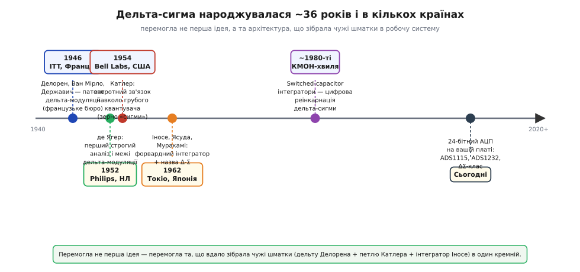
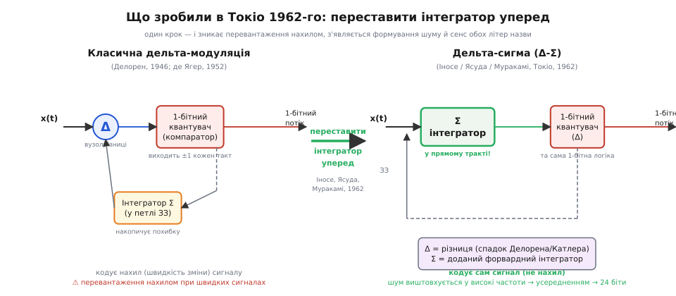

# 📜 Дельта-сигма: як грубий 1-бітний компаратор навчили бачити на 24 біти

> Ця історична вставка розповідає, як архітектура [дельта-сигма АЦП](root:hw-analog/adc-types) насправді виникла — через кілька незалежних кроків у різних країнах протягом приблизно 16 років — і чому вона носить таку химерну подвійну грецьку назву.

Дельта-сигма АЦП міряє дуже грубо (1 біт), але дуже часто, а потім усереднює ці грубі виміри в 24 «чесні» біти. Ця ідея на перший погляд суперечить здоровому глузду: як може один-єдиний компаратор — що відповідає лише «більше» чи «менше» — в підсумку дати точність, яку звичайний 12-бітний АЦП і не снив? Якщо один біт несе 1 одиницю роздільності, то звідки беруться 24 біти, коли їх мільйони надлишково швидких вимірів? І звідки узагалі взялася назва з двох грецьких літер — Δ і Σ?

Відповідь не в одному рядку — вона в ланцюгу з кількох незалежних кроків, що тягнеться приблизно з 1946-го по 1962-й і охоплює Францію, США, Нідерланди та Японію. У самій назві сидять обидва ключові слова: «різниця» (дельта-модулятор кодує різницю між поточним сигналом і попереднім) та «інтегрування» (сигма — сума, накопичення). Ця вставка пояснює, звідки фізично взялося кожне з двох слів — і чому їх врешті з'єднали в одну назву.

Відразу варто задати правильну рамку. Дельта-сигма не «винайшов один геній за одну ніч»: це складанка з телефонного інжинірингу 1940–50-х і японської лабораторної ідеї 1962-го, яка ожила вдруге аж через двадцять років завдяки цифровим КМОН-мікросхемам. Ланцюг виглядає так: ідея різниці → патент → перший строгий аналіз → зворотний зв'язок навколо грубого квантувача → форвардний інтегратор і сама назва → цифрова реінкарнація. Це чесний приклад колективного, поетапного винаходу. Точно така ж картина стоїть за [теоремою дискретизації](root:hw-analog/adc/hist-sampling.md): і там кілька незалежних відкриттів через кілька десятиліть, і там найгучніше ім'я аж ніяк не перше. Обидві історії розповідають одну й ту саму глибоку правду про природу технічного прогресу — тільки через різні архітектури.

*Дельта-сигма народжувалася ~36 років і в кількох країнах: телефонна ідея різниці (Франція, 1946) → строгий аналіз (Philips, 1952) і зворотний зв'язок навколо грубого квантувача (Bell Labs, 1954) → форвардний інтегратор і сама назва Δ-Σ (Токіо, 1962) → цифрова КМОН-реінкарнація (1980-ті) → 24-бітний АЦП у вашій платі. Перемогла не перша ідея, а та архітектура, що вдало зібрала чужі шматки.*

---

## Звідки взялася «дельта»: телефон і жадібність до смуги

Щоб зрозуміти, чому дельта-сигма виникла саме так, а не інакше, треба повернутися до 1940-х і уявити задачу, яка тоді справді пекла телефонних інженерів. Голос треба передати каналом — а канал дорогий: він характеризується смугою пропускання, і кожен зайвий біт коштує реальних грошей у вигляді апаратури та часу. Стандартний PCM (імпульсно-кодова модуляція) відправляє на кожен відлік цілий N-бітний код — повне число. Якщо кодувати голос з 8-бітною роздільністю, то на кожен відлік іде 8 біт; при 8000 відліків за секунду — це вже 64 кбіт/с на один телефонний канал. На магістральних лініях кількість одночасних каналів рахувалася тисячами, і будь-яка ощадність у бітах моментально перетворювалася на мільйони доларів заощадженого на обладнанні.

Але голос — це не довільний сигнал: сусідні відліки схожі між собою, бо голосова хвиля не стрибає хаотично, а змінюється плавно. Між двома послідовними відліками, розділеними 1/8000 с, голос встигає змінитися зовсім небагато. Тож цілком природна думка практичного інженера: навіщо щоразу слати повне значення, якщо воно майже таке саме, як попереднє? Набагато ощадніше передавати лише **зміну** — наскільки сигнал підріс або впав від попереднього відліку.

Це і є зерно «дельти» у назві архітектури. Уявіть, що ви описуєте гірський маршрут не координатами GPS кожного метра, а лише командами «вгору» чи «вниз». Кожна команда — один біт. Відстань між «вимірами» від сусіда до сусіда заміняє собою абсолютне значення, і весь маршрут — це різниці, нанизані одна за одною. Інформації в потоці набагато менше, канал менш завантажений. Але з'являється ризик: якщо на якомусь кроці сталася помилка передачі й команда «вниз» перетворилася на «вгору», всі подальші абсолютні значення зсунуться на постійний зсув, і вся «висота» стане хибною. Крім того, якщо реальний маршрут раптом сильно пішов угору — стрімкий підйом — а ваша система дозволяє лише один крок «вгору» за такт, то маршрут буде спотворений: система «не встигає» за реальністю.

Ця вразливість до накопичення похибки і споріднений з нею ефект «перевантаження нахилом» (*slope overload*) — коли сигнал змінюється швидше, ніж ±1 крок за такт, — і стануть головними мотивами для наступних удосконалень. Але спочатку ідею треба було кристалізувати в патент.

Сама ідея «передавати різницю» не є синонімом «дельта-сигма»: це ціла родина диференційних методів. DPCM (диференційна PCM) кодує різницю між реальним сигналом і прогнозованим наступним значенням — і ця різниця зазвичай мала кількість бітів. Дельта-модуляція іде на крайній крок: різниця кодується **одним** бітом — лише знак: сигнал зріс чи впав. Адаптивна DPCM і адаптивна дельта-модуляція варіюють розмір кроку залежно від крутизни сигналу. Але саме з цього гнізда диференційних методів, з найпростішої його гілки — однобітної дельта-модуляції — і виросте архітектура, що сьогодні сидить у кожному точному датчику ваги і термопари.

---

## Франція, 1946: команда ITT і перший патент дельта-модуляції

Першим, хто оформив ідею однобітної диференційної передачі в конкретну патентну схему, була команда французького підрозділу американського концерну ITT — *Laboratoire Central de Télécommunications* у Парижі. 10 серпня 1946 року **Е. Моріс Делорен** (*E. Maurice Deloraine*), **Сімон Ван Мірло** (*Simon Van Mierlo*) і **Богдан Державич** (*Bohdan Derjavitch*) подали французький патент № 932,140 на систему, що передає імпульси сталої амплітуди протилежної полярності, кодуючи приріст сигналу, а не саме значення. Це документально перша **дельта-модуляція** (*delta modulation*): якщо сигнал вище поточної оцінки — посилати «+», нижче — «−», а приймач відновлює сигнал, накопичуючи ці кроки. Пізніше — вже у 1947 р. (заявка) і 1953 р. (видача) — той самий принцип підтвердив американський патент US 2,629,857; він служить додатковим документальним якорем пріоритету — конкретна дата на конкретному документі, що закріплює, хто й коли вперше оформив ідею.

Тут варто бути чесним щодо атрибуції, бо стандартна помилка — приписати винахід «французам» чи «американцям» за корпоративною належністю. Делорен, Ван Мірло і Державич — інтернаціональна команда телеком-інженерів у французькій лабораторії американського концерну ITT. Делорен — людина з тривалою кар'єрою в міжнародному телекомі. Прізвище Державич (*Derjavitch*) має слов'янський корінь. Але їхня спільна робота — типовий корпоративний командний винахід, а не одноосібний геройський крок. Це і є головний урок: ранній технічний прогрес рідко має одного батька, а спроба присвоїти результат конкретній «нації» часто відображає лише те, чиє ім'я стоїть першим у заявці чи чий прапор висить над будівлею лабораторії.

При цьому важливо чітко розмежувати рівні внеску. Делорен і співавтори **запатентували робочий принцип дельта-модуляції** — і цей внесок реальний і документально підтверджений: мають ідею, назву, схему, дату. Але до дельта-сигми тут іще далеко: схема патенту 1946-го містить вузол різниці і 1-бітний квантувач, але ключового **форвардного інтегратора в прямому тракті** ще немає — і саме він є фізичним серцем дельта-сигмового noise shaping. До справжньої Δ-Σ лишалося два принципово нових кроки.

Головна вада раннього методу виявилась одразу ж, щойно інженери почали його застосовувати на реальних голосових сигналах. Дельта-модулятор добре справлявся з повільними, плавними сигналами невеликої амплітуди. Але коли сигнал змінювався швидко — «стрибав» більш як на один крок за такт — кодер катастрофічно «не встигав»: виходив монотонний «+−+−+−...» потік замість справжнього сигналу, і відновлений на приймачі звук спотворювався до невпізнанності. Ця вада дістала назву «перевантаження нахилом» (*slope overload*): система обмежена максимальним нахилом, який вона може відстежити. Подолання slope overload — і стало двигуном для пошуку кращого рішення.

---

## США та Нідерланди, 1950–1954: зворотний зв'язок і перший строгий аналіз

Другий крок — концептуально найважливіший для майбутньої дельта-сигми — зробили двоє людей по різні боки Атлантики, майже одночасно, кожен зі своєї задачі, жоден не спираючись безпосередньо на роботу іншого.

**Ф. де Ягер** (*F. de Jager*) з Philips Research (Нідерланди) опублікував у 1952 р. класичну статтю «Delta Modulation, a Method of PCM Transmission Using the 1-Unit Code», що вперше дала дельта-модуляції **строгу інженерну теорію**. Де Ягер розібрав метод кількісно: вивів формули для гранулярного шуму (квантувального шуму, що лишається навіть за відсутності slope overload), показав, як залежить відношення сигнал/шум від частоти дискретизації і кроку квантування, де проходить межа перевантаження нахилом і як усе це пов'язане зі смугою корисного сигналу. Раніше дельта-модуляція була лише «патентною ідеєю» з якісним описом принципу — де Ягер перетворив її на зрозуміле інженерне знання з конкретними числовими межами. Хто хотів будувати систему — тепер знав, що саме може вийти й чому. Це точно та сама роль, яку Раабе і Котельников відіграли для [теореми дискретизації](root:hw-analog/adc/hist-sampling.md): хтось будує строгий аналіз після первинної ідеї — і тільки тоді метод переходить зі стадії «цікавої думки» у стадію «можна проєктувати».

**К. Чапін Катлер** (*C. Chapin Cutler*) у Bell Labs (США) рухався паралельно, але зі своїм питанням: як взагалі поліпшити будь-який грубий квантувач, не тільки однобітний? У серії патентних заявок на диференційну PCM (DPCM) з прогнозуючим зворотним зв'язком (заявки близько 1950 р., окремий патент близько 1954 р.) Катлер сформулював принцип, який сьогодні є фізичним серцем дельта-сигми: **поставити квантувач у петлю зворотного зв'язку, яка дивиться на власну похибку і намагається її скомпенсувати**. Ідея така: якщо ми знаємо, що квантувач допустив похибку +ε, наступного кроку ми можемо «поправити прицілювання» і зменшити похибку. Модулятор перестає просто «квантувати», він починає активно «переслідувати» вхідний сигнал, і похибка квантування розподіляється по частотах нерівномірно — менше в корисній смузі, більше за її межами. Це і є зародок того, що в сучасних підручниках називають **формуванням шуму** (*noise shaping*) — головного принципу, завдяки якому однобітний компаратор може в підсумку дати 24 біти.

> 🔧 **Навіщо це.** Те, що [дельта-сигма АЦП](root:hw-analog/adc-types) «формує шум» і виштовхує похибку квантування у високі частоти петлею зворотного зв'язку, — це пряма спадщина Катлерової ідеї «квантувач + петля». Розробнику важливо бачити: noise shaping — не магія сучасних мікросхем, а 70-річний принцип. Грубий вимір плюс розумний зворотний зв'язок дають точність, яку неможливо отримати з того самого квантувача без петлі — незалежно від того, скільки коштує чип. Саме тому дельта-сигма АЦП порядно точніший за SAR при тій самій кількості бітів у номінальній специфікації: він постійно «виправляє сам себе».

Підсумок цього етапу — три чітко розмежованих внески. Делорен і співавтори (1946) запатентували ідею однобітного кодування різниці. Де Ягер (1952) перетворив її на суворо обґрунтований метод із відомими числовими межами. Катлер (1954) додав принципово новий інгредієнт — зворотний зв'язок, що активно компенсує похибку квантувача. Кожен ішов від власної практичної задачі і власного питання, жоден не спирався безпосередньо на роботу іншого, і кожен додав свій незамінний шматок. Без Катлерового зворотного зв'язку наступний японський крок не мав би куди вставити «сигму».

---

## Токіо, 1962: інтегратор іде вперед — і народжується Δ-Σ

Кульмінація цієї історії відбулася в Токійському університеті (*University of Tokyo*) в 1962-му, і вона досі лишається одним із найчіткіших прикладів того, як одна конструктивна перестановка блоків може перетворити добрий метод на видатний.

**Хіросі Іносе** (*Hiroshi Inose*), **Ясухіко Ясуда** (*Yasuhiko Yasuda*) і **Дж. Муракамі** (*J. Murakami*) опублікували статтю «A Telemetering System by Code Modulation — Δ-Σ Modulation» в журналі IRE Transactions on Space Electronics and Telemetry (том SET-8, вересень 1962, с. 204–209). Тут уперше з'явилися і сама архітектура в завершеному вигляді, і її ім'я — і той і інший залишилися незмінними донині.

Що вони зробили — звучить простіше, ніж є насправді. У класичній дельта-модуляції Делорена інтегратор стояв у петлі зворотного зв'язку на боці демодулятора: квантувач бачив не сам сигнал, а **його нахил** — похідну. Звідси й головна вада: slope overload, коли нахил перевищує допустимий. Іносе й співавтори зробили принципово інше: вони **переставили інтегратор уперед, у прямий тракт перед квантувачем**. Тепер вхідний сигнал не одразу потрапляє в компаратор — він спочатку **інтегрується** (накопичується в часі), і вже результат накопичення потрапляє в 1-бітний квантувач. Залишок після квантування через петлю зворотного зв'язку повертається назад і вираховується з майбутнього входу інтегратора — тобто система «запам'ятовує» свою попередню похибку і компенсує її на наступному кроці. Ця перестановка — з «інтегратор у петлі» на «інтегратор у тракті» — прибрала залежність від швидкості зміни сигналу: модулятор відтепер кодує не нахил, а сам сигнал, а похибка квантування «виштовхується» петлею у високі частоти, де її відрізає цифровий фільтр. Так з'явився noise shaping у повному, свідомо спроектованому вигляді.

*Що саме зробили в Токіо 1962-го. Класична дельта-модуляція (ліворуч) кодує нахил сигналу; переставивши інтегратор Σ уперед, у прямий тракт (праворуч), Іносе зі співавторами дістали дельта-сигму — і саму назву: Δ (різниця, спадок Делорена й Катлера) + Σ (доданий інтегратор). Це та сама петля «1-бітний модулятор + усереднення», що лежить в основі дельта-сигма АЦП.*

Тут же закривається інтрига вступу — питання про назву. **Δ (дельта)** — це спадок попередників: кодування різниці, що йде від Делорена і далі через де Ягера та Катлера. **Σ (сигма)** — форвардний інтегратор, доданий саме Іносе: він накопичує суму (звідси σ — sigma = сума), перш ніж сигнал потрапить до квантувача. Назва буквально склеєна з двох внесків, і тому вона така двоскладова — вона є картою авторства, прочитаною в одне слово. Прочитавши «дельта-сигма», ви тепер бачите в ній: Δ = чужа ідея різниці, Σ = власний новий інтегратор.

Важливо розмежувати внески точно, не применшуючи нічиїх. Іносе, Ясуда і Муракамі — **справжні автори архітектури Δ-Σ і її назви**. Саме вони зібрали чужі шматки в єдину конструкцію і показали, що вона працює як реальна телеметрична система. Водночас базовий принцип «петля зворотного зв'язку покращує грубий квантувач» вже належав Катлеру (1954). Японці не перевідкрили Катлера — вони **добудували** на його фундаменті, додавши форвардний інтегратор і зібравши все в конкретну робочу схему з ім'ям. Класичне «винахід — не одна іскра, а ланцюг». Примітна деталь, варта окремої згадки: Ясуда на той час був молодим дослідником — студент або аспірант. Це повторює знайомий візерунок: фундаментальні кроки часто роблять люди на самому початку кар'єри — як Котельников, якому в 1933-му було 25 років, коли він представляв [теорему дискретизації](root:hw-analog/adc/hist-sampling.md).

Контекст епохи теж показовий і пояснює, чому стаття вийшла саме в такому журналі. Це 1962-й — розпал космічної гонки, коли телеметрія ракет і супутників була справою національного пріоритету. Передавати точні вимірювання з борту — температуру, тиск, прискорення — треба було слабким зашумленим радіоканалом, і 1-бітний потік тут мав конкретну перевагу: його легко декодувати навіть за значних перешкод, бо він не вимагає точного вимірювання амплітуди — лише розрізнення «+» від «−». Архітектуру, що сьогодні сидить у копійчаному АЦП для ваги чи термопари, народила потреба передати дані з борту ракети надійно й ефективно.

> 🔧 **Навіщо це.** Та сама схема Іносе 1962-го — це і є блок-схема сучасного [дельта-сигма АЦП](root:hw-analog/adc-types): 1-бітний модулятор + цифровий фільтр-дециматор. Зовнішній ADS1115 чи будь-який 24-бітний АЦП для точного вимірювання термопари або ваги — пряма спадкоємиця токійського телеметра 1962 р. Між патентом Іносе і вашою платою з датчиком — лише одна ланка: цифровий кремній, якого в 1962-му ще не було, і без якого ідея ще двадцять років лежала на поличці.

---

## Двадцять «сплячих» років і цифрова реінкарнація

Тут треба чесно розповісти про паузу, без якої картина буде неповною і незрозумілою. Стаття Іносе 1962-го не викликала революції одразу. Навпаки — метод залишився майже непоміченим практиками більш як на десятиліття. Причина проста і технологічна: у той час аналогові інтегратори — основа дельта-сигмового модулятора — були дорогі, громіздкі й схильні до температурного дрейфу. Практичний інтегратор на операційному підсилювачі тих часів «повзав» за температурою, потребував індивідуального підстроювання і займав чималу площу на платі. Будувати на ньому точний АЦП, коли вже є добре відпрацьований SAR або двотактний інтегрувальний перетворювач, не мало ані економічного, ані практичного сенсу. Метод лишався лабораторною цікавинкою — цікавою на папері, але такою, що погано масштабується в реальне залізо за прийнятну ціну.

Воскресіння прийшло наприкінці 1970-х і протягом 1980-х — разом із **цифровою КМОН-мікроелектронікою**. Ключовим інгредієнтом стали **переключно-конденсаторні інтегратори** (*switched-capacitor integrators*, SC): замість дрейфуючого аналогового підсилювача — точна схема на конденсаторах і КМОН-ключах, що перемикаються тактовим сигналом. Такий SC-інтегратор не потребує підстроювання: точність визначається відношенням ємностей двох конденсаторів на одному кристалі, а таке відношення відтворюється у виробництві набагато краще, ніж абсолютні значення опорів чи ємностей. Стабільність за температурою теж висока — обидва конденсатори на тому самому кристалі гріються однаково, і відношення лишається постійним. Технологія з'явилася і здешевшала саме тоді, коли КМОН-процес досяг рівня, що дозволяє інтегрувати аналогові і цифрові блоки на одному кристалі без надзвичайних складнощів. Та сама технологічна хвиля живить і [SAR АЦП](root:hw-analog/adc-types), де внутрішній ЦАП так само будується на матриці конденсаторів.

Паралельно цифрова логіка подешевшала настільки, що складний фільтр-дециматор — мозок дельта-сигмового АЦП — перестав бути непідйомною апаратурою і вмістився на тому самому кристалі поруч із модулятором без надмірного збільшення площі або ціни. Це вирішальне: без дешевого цифрового фільтра дельта-сигмовий 1-бітний потік — лише шум; саме фільтр-дециматор перетворює мільйони грубих вимірів на кілька точних чисел на секунду. Іносе 1962-го поставив задачу — КМОН-мікроелектроніка 1980-х нарешті дала засоби для її масового вирішення.

Варто зауважити: у перебудові методу для КМОН-ери брало участь безліч груп — в Bell Labs, AT&T, Philips, академічних лабораторіях Стенфорда, Берклі, Массачусетського інституту технологій та інших. Це знову колективна інженерна хвиля, а не поодинокий геній. Імена на зразок Роберта Адамса (*Robert W. Adams*) або Бредфорда Вулі (*Bradford Wooley*) можна зустріти в контексті перших switched-capacitor дельта-сигма АЦП 1980-х — але головний урок той самий, що й у попередніх актах цієї історії: нова ідея потребує нової технології, і розцвітає лише тоді, коли технологія дозріває. Двадцять «сплячих» років — не аномалія, а звична доля ідеї, для якої ще не виросло залізо.

Так замкнулося коло. Телеметричний трюк 1962-го, переосмислений цифровою епохою, став стандартним способом отримати 16–24 біти точності там, де звичайний [SAR АЦП](root:hw-analog/adc-types) зупиняється на 12–16. Саме тому дельта-сигма — майже завжди **зовнішня** мікросхема: архітектура, що любить цифровий кремній — мало аналогу (один грубий компаратор), багато цифри (складний фільтр), а цифра в КМОН щороку стає дешевшою. Не випадково типові представники класу — ADS1115, ADS1232, CS1237 — окремі мікросхеми, що підключаються до мікроконтролера шиною I²C або SPI: вся їхня «розумність» у цифровому фільтрі всередині чипа.

---

## Що бере розробник: ланцюг за двома грецькими літерами

Зведемо ланцюг стисло і повно. Ідея «кодувати не значення, а різницю» — телефонна ощадність 1940-х, природна реакція інженерів на дорогу смугу каналу. Делорен, Ван Мірло і Державич у 1946-му дали їй патентне оформлення у вигляді конкретної схеми однобітної дельта-модуляції. Де Ягер у 1952-му перетворив ідею на строгу інженерну теорію з кількісними межами для шуму й перевантаження. Катлер у Bell Labs близько 1954-го додав принципово новий інгредієнт — зворотний зв'язок навколо грубого квантувача, зародок noise shaping. Іносе, Ясуда і Муракамі в Токіо в 1962-му переставили інтегратор уперед у прямий тракт, зібрали все в конкретну робочу систему і дали їй ім'я Δ-Σ — ім'я, що само є картою авторства. КМОН-мікроелектроніка 1980-х замінила дрейфуючий аналог точними switched-capacitor схемами і додала дешевий цифровий фільтр. Сьогодні ця спадкоємиця сидить у 24-бітному АЦП на вашій платі.

Як і [теорема дискретизації](root:hw-analog/adc/hist-sampling.md), дельта-сигма — не одноосібний винахід і не тріумф однієї нації. Вона народилася в кількох країнах, у різних лабораторіях, у відповідь на різні практичні потреби: ощадність телефонного каналу, строгість інженерного аналізу, надійність ракетної телеметрії, дешевизна КМОН-кристала. Урок один: перевіряй, кому насправді належить ідея; не вір, що найгучніше чи найновіше ім'я — завжди перше; і не приписуй командний, розтягнутий у часі результат одній людині чи одній країні. Великі технічні ідеї «дозрівають» поетапно, і «перемагає» не та, хто перша висловила думку, а та архітектура, що вдало зібрала чужі шматки і знайшла свою технологію.

Для розробника тут є іще один практичний подарунок — розуміння імені як мнемоніки архітектури. **Δ** нагадує, що модулятор відстежує різницю між сигналом і власною попередньою оцінкою: звідси висока частота дискретизації (треба «встигати»), повільний корисний вихід (треба накопичити багато вимірів) і стійкість до повільних дрейфів. **Σ** нагадує, що перед квантувачем стоїть інтегратор, який накопичує похибку і «виштовхує» її в шум вищих частот: звідси висока роздільність за правильного фільтра та зростаюча точність зі збільшенням порядку модулятора. Знаючи, що «дельта» — це спадок Делорена й Катлера, а «сигма» — конкретний крок Іносе 1962-го, ви назавжди запам'ятаєте: дельта-сигма повільна (потрібно багато надшвидких кроків, щоб усередніти), точна (noise shaping прибирає похибку з корисної смуги), і майже завжди зовнішня цифрова мікросхема (фільтр-дециматор — головна частина роботи, і вона вже всередині чипа). Тобто ця розповідь — не прикраса, а мнемоніка архітектури, і кожен її персонаж відповідає одній із рис [дельта-сигма АЦП](root:hw-analog/adc-types).

Тепер ім'я розшифроване, а ланцюг прослідкований від телефонного каналу 1940-х до кристала на вашій платі: дві грецькі літери виявилися стислою картою півстолітнього колективного винаходу.
