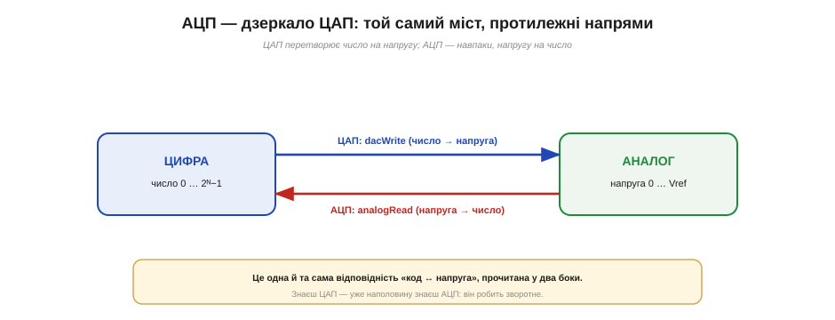
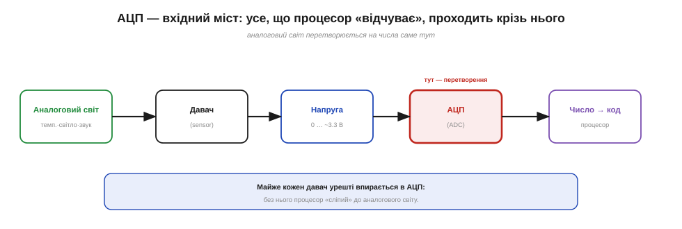
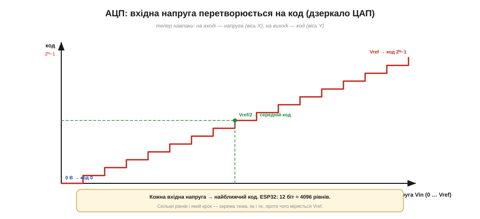
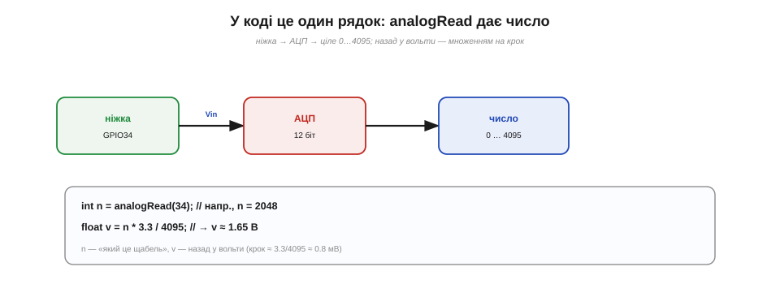
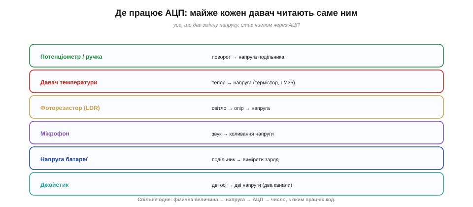
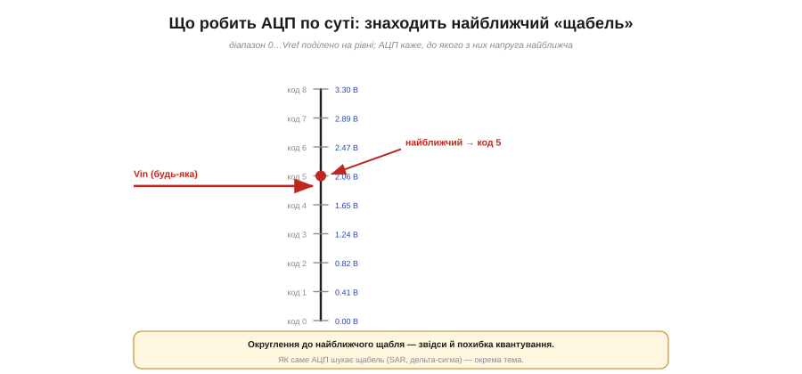

# АЦП: перетворити напругу в число (міст аналог→цифра)

Мікроконтролер уміє **говорити** аналоговою мовою — [ЦАП](root:hw-analog/dac) перетворює число на напругу. Та значно частіше потрібне зворотне: щоб машина **слухала** світ. Температура, освітленість, звук, положення ручки, заряд батареї — усе це неперервні аналогові величини, а процесор оперує самими лише числами. Хтось має стати перекладачем «з аналога в цифру»: виміряти напругу й сказати, **яким числом** вона є. Цей перекладач — **аналого-цифровий перетворювач (АЦП, англ. *analog-to-digital converter, ADC*)**, і він, без перебільшення, — найважливіший вхідний міст мікроконтролера. Тут — сама **ідея** перетворення «напруга → число»: як вона дзеркалить ЦАП, як це виглядає в коді й де застосовується.

### АЦП — дзеркало ЦАП

Найлегше зрозуміти АЦП через його дзеркало. [ЦАП](root:hw-analog/dac) бере число й видає пропорційну напругу: **код → напруга**. АЦП робить точно зворотне: бере напругу й видає пропорційне число — **напруга → код**. Це той самий міст між цифрою й аналогом, лише пройдений у другий бік.


*Та сама відповідність «код ↔ напруга», прочитана у два боки. ЦАП (`dacWrite`) синтезує напругу з числа; АЦП (`analogRead`) вимірює число з напруги — те саме перетворення у зворотний бік.*

Через цю дзеркальність розуміння АЦП багато в чому збігається з розумінням ЦАП. Та сама думка «діапазон напруги 0…Vref відповідає діапазону кодів 0…2ᴺ−1», лише читаємо її навпаки. Якщо ЦАП — це «синтезатор» напруги з числа, то АЦП — «вимірювач» числа з напруги. І так само, як у ЦАП, тут є дві ключові величини: [опорна напруга](root:hw-sensing/voltage-reference) Vref, що задає верхню межу шкали (проти чого міряємо), і [роздільність](root:hw-analog/adc-resolution) у бітах, що задає, на скільки рівнів поділено шкалу. Поки що тримаймо в голові саму симетрію.

Ця дзеркальність — не просто гарна аналогія. Якби ми ЦАП'ом виставили якусь напругу, а тоді виміряли її **назад** АЦП'ом, то в ідеалі дістали б те саме число, з якого почали: код → напруга → код. Саме тому АЦП і ЦАП часто живуть **поряд** в одному пристрої: у звукових кодеках, наприклад, один блок оцифровує мікрофон, а другий озвучує динамік. Освоївши одну половину мосту, ви майже задарма отримуєте розуміння другої — і дзеркальні формули, і дзеркальні поняття.

### Вхідний міст: де сидить АЦП

Щоб відчути роль АЦП, корисно побачити, де він стоїть у ланцюжку. Аналоговий світ — температура, світло, звук, тиск — спершу перетворюється давачем на **напругу**, а вже цю напругу АЦП обертає на число, з яким працює код. АЦП — це ворота, крізь які все «відчуте» процесором заходить усередину.


*АЦП — вхідний міст мікроконтролера. Фізична величина → давач → напруга (0…~3.3 В) → АЦП → число → процесор. Майже кожен давач урешті впирається в АЦП; без нього процесор «сліпий» до аналогового світу.*

Це пояснює, чому АЦП — одна з найуживаніших периферій. Хочеш виміряти температуру, освітленість, рівень звуку, кут повороту ручки, заряд акумулятора — усе це врешті зводиться до «прочитати напругу». Давачі бувають різні: одні дають напругу прямо (як давач температури LM35), інші змінюють опір (термістор, фоторезистор), і тоді напругу знімають із простого подільника. Та хоч би яким був давач, остання ланка завжди та сама — **АЦП**, що переводить напругу в число. Опанувавши його, ви відмикаєте собі майже всю «давачну» частину електроніки.

Варто наголосити на цій універсальності. Один давач сам видає напругу (як LM35, де 10 мВ відповідають одному градусу), інший лише змінює опір — тоді його ставлять у подільник із постійним резистором, і вже подільник перетворює зміну опору на зміну напруги. Третій дає крихітний сигнал, який спершу підсилюють. Та для самого АЦП ці відмінності неважливі: він бачить лише **напругу на своєму вході** й переводить її в число, байдуже, звідки вона взялася. Тому, навчившись читати один аналоговий вхід, ви вмієте читати їх **усі** — змінюється давач і обв'язка перед АЦП, а не сам спосіб вимірювання.

### Від напруги до числа

Тепер придивімося до самого перетворення. АЦП ділить свій робочий діапазон напруг (від 0 до Vref) на багато рівних щаблів і для кожної вхідної напруги повертає **номер найближчого щабля** — код. Передавальна характеристика — знову **сходинки**, тільки дзеркальні до ЦАП: на вході тепер напруга, на виході — код.


*Передавальна характеристика АЦП — дзеркало характеристики ЦАП: тепер вісь X — вхідна напруга, вісь Y — код. 0 В дає код 0, Vref — максимальний код 2ᴺ−1, а середина шкали — середній код. ESP32 має 12-бітний АЦП: 4096 рівнів.*

Зв'язок між напругою й кодом простий і прямо пропорційний. Якщо роздільність — N біт, а опорна напруга — Vref, то:

```
код  ≈  Vin / Vref × (2ᴺ − 1)      (напруга → число)
Vin  ≈  код × Vref / (2ᴺ − 1)      (число → напруга, назад)
```

Помічаєте? Друга формула — це буквально [формула ЦАП](root:hw-analog/dac). Тобто, отримавши код від АЦП, ми тим самим виразом перетворюємо його назад у вольти, коли хочемо знати «скільки ж там було напруги». Для ESP32 з його 12 бітами це 4096 рівнів (коди 0…4095) — досить дрібно, щоб виміряти напругу з точністю до приблизно мілівольта. Але **точне** число рівнів і [розмір кроку](root:hw-analog/adc-resolution), як і те, [проти якої саме Vref](root:hw-sensing/voltage-reference) усе міряється, — окремі важливі питання; тут нам досить знати, що зв'язок лінійний і дзеркальний до ЦАП.

Чому зв'язок саме лінійний? Бо щаблі **рівномірні**: уся шкала 0…Vref поділена на однакові кроки, тож удвічі більша напруга дає вдвічі більший код. Зручний образ — мірна склянка з рівними поділками: скільки рідини налито, на такій поділці й зупиниться рівень. Два краї шкали закріплено намертво — 0 В це код 0, а повна напруга Vref це найбільший код, — а все між ними лягає на пряму, що з'єднує ці два кінці. Через те й перерахунок такий простий: одне множення туди, одне назад.

### У коді це один рядок: `analogRead`

На щастя, уся ця механіка захована за однією функцією. У середовищі Arduino читання АЦП — це виклик `analogRead(pin)`, що повертає готове ціле число. На ESP32 за замовчуванням воно 12-бітне, тобто в діапазоні 0…4095.


*У коді — один рядок. `analogRead` дає ціле 0…4095 («який це щабель»); щоб дістати вольти, множимо на крок Vref/4095. Наприклад, число 2048 відповідає приблизно 1.65 В (середина шкали).*

Важливо тримати в голові, що `analogRead` повертає **число**, а не вольти. Це «номер щабля», і щоб перевести його в напругу, його треба домножити на крок (Vref/4095). Часто це й не потрібно: якщо ви просто стежите, «світліше стало чи темніше», вистачить і сирого числа — більше означає більшу напругу. А коли треба саме вольти (виміряти заряд батареї, опорну напругу давача), застосовуєте формулу назад. Ще одна практична дрібниця: не кожна ніжка вміє АЦП — на ESP32 для цього є спеціальні входи (позначені як ADC), і саме їх треба обирати.

На практиці сире число з `analogRead` часто і є кінцевою відповіддю. Якщо завдання — «темніше чи світліше», «ручку покрутили ліворуч чи праворуч», то порівнювати можна прямо коди, не переводячи їх у вольти взагалі. А коли потрібна фізична величина — градуси, люкси, вольти заряду, — між кодом і нею ставлять свій **перерахунок**, інколи з [калібруванням](root:hw-sensing/adc-errors) під конкретний давач. Тобто `analogRead` дає сирий «номер щабля», а сенсу — градуси це чи люкси — йому надає вже ваш код.

> 🔧 **Навіщо це.** Запам'ятайте різницю: `analogRead` дає **код**, а людині зазвичай потрібні **вольти** — тож майже завжди поряд живе рядок `v = n * Vref / макс`. І стережіться відомої пастки ESP32: один із двох його АЦП-блоків (**ADC2**) конфліктує з **Wi-Fi** — коли радіо ввімкнене, читати ним не можна. Тому для звичайних вимірів беріть ніжки першого блоку (**ADC1**), і «чому analogRead повертає сміття при ввімкненому Wi-Fi» більше вас не здивує.

### Де АЦП усюди

Варто окинути оком, наскільки АЦП поширений — це переконує краще за будь-яке означення.


*Усе, що дає змінну напругу, читають АЦП: ручка-потенціометр, давач температури, фоторезистор, мікрофон, подільник для напруги батареї, джойстик (дві осі — два канали). Спільне одне: фізична величина → напруга → АЦП → число.*

За всіма цими прикладами стоїть один і той самий шаблон: щось у фізичному світі змінює напругу, а АЦП перетворює її на число, з яким уже працює програма. [Потенціометр](root:hw-components/potentiometer) перетворює **поворот** на напругу подільника; термістор — **тепло** на зміну опору, а отже й напруги; фоторезистор — **світло**; мікрофон — **звук** на крихітні коливання напруги. Навіть щоб дізнатися, **наскільки сіла батарея**, її напругу через подільник заводять на АЦП. Один блок — і процесор «бачить», «чує» й «відчуває» десятки різних величин.

Розгляньмо крихітний приклад, як це сходиться докупи. Зробімо автоматичний нічник: фоторезистор у подільнику дає напругу, що падає в темряві; ми раз у раз читаємо `analogRead`, і коли число опускається нижче порога — вмикаємо світло, а коли підіймається — гасимо. Жодної математики з вольтами тут і не треба: досить **порівняти код із порогом**. Так само працює автояскравість екрана, давач присмерку вуличного ліхтаря, індикатор розрядженої батареї — усе це той самий АЦП, поріг і проста умова в коді. Бачите, як небагато треба, щоб залізо почало реагувати на світ.

### АЦП як лінійка: знайти найближчий щабель

Насамкінець — корисний образ того, що АЦП робить по суті. Уявіть лінійку напруги від 0 до Vref, поділену рисками на рівні щаблі. АЦП прикладає до неї вхідну напругу й каже, до **якого щабля** вона найближча, повертаючи його номер. Це і є код.


*Суть АЦП — округлення. Діапазон 0…Vref поділено на рівні; будь-яка вхідна напруга «приписується» до найближчого щабля, чий номер і є кодом. Саме це округлення породжує неминучу похибку квантування.*

З цього образу одразу видно дві речі. По-перше, відповідь АЦП **завжди округлена**: реальна напруга майже ніколи не лягає точно на щабель, тож між істинним значенням і виміряним лишається маленька різниця — її звуть **похибкою квантування** (*quantization error*), і вона тим менша, чим дрібніші щаблі. По-друге, видно, що «оцифрувати» — означає трохи **втратити**: безкінечно багату аналогову напругу ми замінюємо одним із скінченного набору номерів. Як саме [число рівнів](root:hw-analog/adc-resolution) впливає на якість і чим [один тип АЦП](root:hw-analog/adc-types) відрізняється від іншого — окремі питання; головний образ тут простий: **АЦП — лінійка, що знаходить найближчий щабель**.

І ще одна думка наостанок. Дрібніші щаблі (більше біт) дають точніший вимір, але задарма це не дається: точніший АЦП складніший, повільніший і дорожчий, тож роздільність завжди обирають **під задачу**, а не «якомога більшу». А оскільки кожен вимір округлено, оцифрування — це завжди трішки **необоротна** втрата: з коду ми відновимо напругу лише з точністю до щабля, не точніше. Ці компроміси — точність проти швидкості й ціни — наскрізні для всякого вибору АЦП: майже будь-яке рішення про оцифрування зрештою впирається саме в них.

> 🔧 **Навіщо це.** Округлення до щабля означає, що в кожному вимірі вже «вшита» невеличка похибка — і це нормально, аби вона була меншою за вашу потрібну точність. Тому, обираючи АЦП чи режим, завжди прикидайте: який крок (щабель) дає ця роздільність і чи дрібніший він за похибку, яку ви готові терпіти? Та сама логіка діє і з боку [ЦАП](root:hw-analog/dac) — там вона дзеркальна.

**Приклад (напруга ↔ код на 12-бітному АЦП ESP32).** Vref ≈ 3.3 В, N = 12.

```
рівнів = 2¹² = 4096,  коди 0…4095
крок (LSB) = 3.3 / 4095 ≈ 0.000806 В ≈ 0.81 мВ

Vin = 1.0 В  → код ≈ 1.0 / 3.3 × 4095 ≈ 1241
код 3000     → Vin ≈ 3000 × 3.3 / 4095 ≈ 2.42 В
```
Один щабель — менш як мілівольт: для більшості давачів цього з головою. А назад у вольти переводимо тією самою формулою, що й у ЦАП, — ще раз нагадуючи, що АЦП і ЦАП дзеркальні.

Отже, АЦП — це вхідний міст: він вимірює напругу й повертає число, дзеркально до ЦАП, округляючи вхід до найближчого щабля. На цьому загальна картина повна. Та за цією картиною ховаються **два різні** кроки, що насправді відбуваються окремо: спершу сигнал «фотографують» у певні моменти часу, а вже потім кожен знімок округляють до щабля. Те, як [дискретизація в часі й квантування за рівнем](root:hw-analog/sampling-quantization) розділяються, — окрема велика тема.

Саме «фотографування в часі» приховує неочевидне питання: а скільки ж знімків за секунду треба, щоб по них точно відновити весь сигнал, не загубивши нічого між ними? Відповідь дає одна з найкрасивіших теорем інженерії, а її історія — рідкісний приклад того, як одну глибоку істину незалежно відкрили кілька людей у різних країнах.

> 📜 Скільки вимірів за секунду досить, щоб не втратити сигнал, і чому в теореми про це стільки імен — [теорема дискретизації та її заплутана історія](root:hw-analog/adc/hist-sampling.md).
