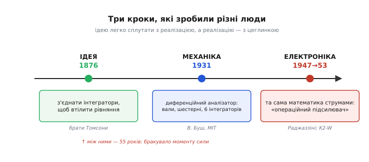
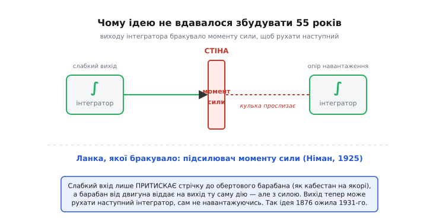

# 📜 Народження аналогового обчислювача

Є речі, які людство **придумало** на півстоліття раніше, ніж змогло **збудувати**. Машина, що розв'язує диференційне рівняння сама, крутінням коліс, — саме така річ. Її повну схему виклали в поважному науковому журналі 1876 року, з усією математикою й кресленнями. А перша така машина, що справді запрацювала на повну, з'явилася аж 1931-го. Між задумом і дійсністю лягло п'ятдесят п'ять років — і вся ця історія, по суті, про те, **що саме стояло в тій прірві** й хто його зрештою прибрав.

Це історія не про один винахід, а про **три різні кроки**, які легко сплутати в один, але які зробили різні люди в різні епохи: спершу **ідея** — що з'єднаних інтеграторів можна змусити втілити рівняння; потім **механічна реалізація** — громіздка машина з валів і шестерень, що його нарешті розв'язує; і вже наприкінці **електронна цеглинка** — крихітний підсилювач, що робить ту саму математику струмами замість зубчастих коліс. Розрізнити ці кроки — і значить зрозуміти, звідки взявся [аналоговий обчислювач](root:hw-analog/analog-computer).

*Уся історія в трьох кроках, які робили різні люди. Ідея з'єднати інтегратори в розв'язувач рівнянь — брати Томсони, 1876. Перша машина, що справді розв'язувала, — диференційний аналізатор Буша, 1931. Та сама математика, перенесена в електроніку, — «операційний підсилювач», 1947, і серійний модуль K2-W, 1953. Між ідеєю та її втіленням лягло півстоліття.*

## Брати Томсони і машина, що тільки малювала

Почнімо з людини, чиє ім'я носить шкала температур. **Вільям Томсон** (William Thomson, 1824–1907), згодом лорд Кельвін, народився в Белфасті в родині математика-ольстерця; коли хлопцеві було вісім, батько отримав кафедру в Глазго, і вся подальша наукова доля Вільяма — глазговська. Тож звичний ярлик «шотландський фізик» правдивий лише наполовину: за народженням він **ірландець з ольстерсько-шотландської родини**, за кар'єрою — британський учений глазговської школи. Дрібниця, та варто бути точним: походження тут не легенда, а добре задокументований факт.

У 1860-х Кельвін бився над цілком практичною бідою — **передбаченням морських припливів**. Приплив у даному порту — це сума кількох коливань: одне йде за Місяцем, інше за Сонцем, ще кілька — за тоншими астрономічними циклами. Кожне саме по собі проста синусоїда, але разом вони дають химерну криву, що її морякові треба знати наперед. Кельвін зрозумів, що цю криву можна **синтезувати механічно**: коли кожну гармоніку зображає своє обертове колесо потрібної швидкості й амплітуди, а їхні внески складати докупи, машина намалює приплив на рік уперед.

Так народилася **машина для передбачення припливів** (tide-predicting machine), збудована 1872 року. Це усталена дата й усталене авторство, але авторство тут — **колективне**, і чесно назвати всіх трьох. Задум і математику дав Кельвін. Креслення й узгодження астрономічних складових — **Едвард Робертс** (Edward Roberts, 1845–1933), помічник британського Морського альманаху, без чийого кропіткого розрахунку коліс машина лишилася б ідеєю. А виготовив її в металі лондонський механік **Александр Леже** (Alexander Légé). Машина складала десяток припливних гармонік і вимальовувала пером криву припливу на цілий рік — за кілька годин роботи, там, де людина-обчислювач витратила б тижні.

> 🔧 **Навіщо це.** Тут варто вловити тонку, але вирішальну річ, бо саме вона визначить усю подальшу історію. Припливна машина **складала** гармоніки — і тільки. Вихід кожного колеса йшов на спільну рейку, що рухала **перо**, а перу опиратися майже нічого: воно лиш дряпало папір. Машині не треба було своїм результатом крутити **наступну** машину. А щойно цього забажати — почнуться п'ятдесят років мук.

Бо паралельно з Вільямом працював його старший брат — **Джеймс Томсон** (James Thomson, 1822–1892), інженер. Саме він 1876 року описав у Лондонському королівському товаристві прилад, який стане серцем усієї дальшої історії: **кулько-дисковий інтегратор** (ball-and-disk integrator). Конструкція геніально проста — обертовий диск, кулька, що котиться по ньому на змінній відстані від центра, і вихідний циліндр, який кулька крутить. Що далі кулька від центра, то швидше біжить край під нею, то швидше крутиться вихід; математично вихідний оберт виходить **інтегралом** того, як рухали кульку. Один прилад — одне інтегрування, виконане суто механічно, без жодних чисел.

І ось тут Вільям зробив свій справді глибокий крок. Того ж 1876 року він опублікував у тих самих «Працях» статтю з довгою назвою про «механічне інтегрування загального лінійного диференційного рівняння будь-якого порядку зі змінними коефіцієнтами». Словами: він показав, **як з'єднати кілька кулько-дискових інтеграторів так, щоб вони разом розв'язували диференційне рівняння**. Вихід одного інтегратора керує кулькою наступного, петля замикається сама на себе — і машина мала б видати розв'язок крутінням валів. Це і є народження ідеї аналогового обчислювача в чистому вигляді: не порахувати рівняння числами, а **зібрати з фізичних інтеграторів його копію** й дати їй ожити.

Машину так і не збудували.

## П'ятдесят років, що їх з'їв момент сили

Чому? Причина гранично конкретна й гранично прозаїчна, і її варто назвати, бо саме вона — головний герой усієї прірви між задумом і дійсністю. Це **момент сили** (англ. *torque* — обертове зусилля на валу).

Згадаймо припливну машину: її колесам треба було ворушити лише перо. А тепер уявіть розв'язувач рівнянь Кельвіна: вихід **першого** інтегратора мусить рухати кульку **другого**, тобто долати тертя справжнього навантаженого механізму. Біда в тому, що кулько-дисковий інтегратор віддає на виході **мізерне зусилля** — кулька тримається на диску самим лиш легеньким тиском, і щойно навісити на її вихід бодай помітне навантаження, вона почне **прослизати**. А прослизнула кулька — інтеграл збрехав, і вся машина дала хибну відповідь. З'єднати два інтегратори послідовно означало, що другий своїм опором гальмує перший і псує його роботу. Один інтегратор працював; ланцюг із них — розсипався.

Це і є та невидима стіна, об яку розбилася ідея на півстоліття. Кельвін чудово її бачив — він **знав**, що момент сили на виході надто слабкий, — але способу його підсилити, не зіпсувавши самого інтеграла, у XIX столітті не було. Геніальна схема лежала надрукована й нездійсненна.

*Чому ланцюг інтеграторів розсипався. Кулько-дисковий інтегратор віддає на виході мізерне зусилля; щойно навісити на нього опір наступного інтегратора, кулька прослизає — і інтеграл бреше. Цю стіну прибрав підсилювач моменту сили Німана (1925): слабкий вхід лише притискає стрічку до обертового барабана, а той від двигуна віддає ту саму дію, але з силою.*

Стіну прибрав не математик, а інженер зі сталеливарної компанії. У 1925 році **Генрі Німан** (Henry W. Nieman) з Bethlehem Steel винайшов **підсилювач моменту сили** (torque amplifier). Принцип той самий, що в корабельного кабестана, яким одна людина вибирає важезний якірний ланцюг: вхідний слабкий сигнал лише **притискає** стрічку до невпинно обертового барабана, а вже барабан, живлений від двигуна, віддає на вихід зусилля в багато разів більше — і повторює рух входу з силою. Крихітний момент кульки тепер міг командувати потужним валом, нітрохи сам не навантажуючись. Ланка, якої бракувало півстоліття, нарешті знайшлася.

> 🔧 **Навіщо це.** Запам'ятайте цей сюжет — він повторюється в електроніці безліч разів під іншими масками. Корисний сигнал є, але він **заслабкий, щоб щось ним рухати**, не спотворивши себе; тож між ним і навантаженням ставлять підсилювач, що **повторює** сигнал, але вже з силою. Кабестан Німана для механіки — те саме, чим стане [операційний підсилювач](root:hw-analog/opamp) для електрики: пристрій, що віддає копію входу, здатну керувати, не висмоктуючи з джерела сили. Уся аналогова техніка стоїть на цій думці.

## Венівар Буш і машина, що нарешті розв'язувала

Маючи нарешті чим підсилити момент, ідею Кельвіна можна було втілити в металі. Це й зробив в Массачусетському технологічному інституті (MIT) **Венівар Буш** (Vannevar Bush, 1890–1974) — американський інженер, згодом одна з ключових постатей організації науки США воєнних років. У 1928–1931 роках Буш зі своїми аспірантами збудував машину, яку назвав **диференційним аналізатором** (differential analyzer).

Це була не настільна штука, а **машина завбільшки з кімнату**: довгі сталеві вали тяглися через залу, з'єднані сотнями шестерень, пасів і зчеплень, а серцем стояли **шість** кулько-дискових інтеграторів — кожен із Німановим підсилювачем моменту на виході. Шість інтеграторів означали, що машина бере рівняння аж до **шостого порядку**: достатньо, щоб моделювати траєкторії, електричні мережі, теплові процеси. Інженер «програмував» її буквально руками — переставляв зчеплення й перемикав вали так, щоб механічні зв'язки повторювали потрібне рівняння, на що йшли години, а то й дні. Зате потім машина **сама** крутила розв'язок і вимальовувала його кривою.

Кельвінова ідея 1876 року нарешті ожила — через п'ятдесят п'ять років, рівно тоді, коли до неї додали ланку, якої їй бракувало.

Машина виявилася такою корисною, що її стали **копіювати по світу**, і ці копії — окрема промовиста сторінка:

- **Абердинський полігон** (Aberdeen Proving Ground) і його Балістична лабораторія в США отримали диференційні аналізатори, де рахували **таблиці стрільби** — як летить снаряд за різних кутів, заряду й вітру. Це була робота, заради якої машину й цінували передусім.
- **Школа Мура** (Moore School of Electrical Engineering) при Пенсильванському університеті поставила свій аналізатор у підвалі — і саме там, на тих самих балістичних задачах, згодом виросте перша велика електронна цифрова машина. Аналог проклав цифрі дорогу буквально в тому самому будинку.
- У **Манчестерському університеті** теоретик **Дуглас Гартрі** (Douglas Hartree, 1897–1958), побачивши Бушеву машину 1933 року, разом з аспірантом **Артуром Портером** (Arthur Porter) збудував робочу модель аналізатора... з дитячого конструктора **Meccano**. Дешева іграшкова копія несподівано добре рахувала реальні задачі — і Манчестер згодом замінив її на повноцінну машину.
- За Манчестером пішов **Кембридж**, де свій аналізатор зробив Дж. Б. Братт (J. B. Bratt) близько 1935 року.

> 🔧 **Навіщо це.** Цей вибух копій — від військового полігона до іграшкового Meccano — показує, чим аналоговий обчислювач узяв свою епоху. Він давав **відповідь там, де числами було надто повільно**: порахувати траєкторію снаряда вручну — то дні роботи цілої кімнати людей-обчислювачів, а машина крутила її за хвилини. Поки цифрових машин ще не існувало, диференційний аналізатор був **єдиним** способом швидко прокручувати складну динаміку — і тому розповзся всюди, де така динаміка важила: балістика, енергомережі, фізика.

## Слово «операційний» — спадок саме обчислювача

А тепер найцікавіший для електроніки поворот, бо в ньому захована **етимологія**, яку щодня вимовляють, не задумуючись. Механічний аналізатор був громіздкий, повільний у перенастройці й вічно потребував змащування й вивіряння шестерень. Природно постало бажання робити ту саму математику **електрикою** — там, де замість валів течуть струми, а замість інтегратора крутиться конденсатор. Цеглинкою такої електронної машини став підсилювач, обвішаний резисторами й конденсаторами, що множив, складав та інтегрував **напруги** замість обертів.

І ось як він дістав ім'я. У травні **1947 року** в журналі *Proceedings of the IRE* вийшла стаття трьох інженерів Колумбійського університету — **Джона Раджаззіні** (John R. Ragazzini), **Роберта Рендалла** (Robert H. Randall) і **Фредеріка Расселла** (Frederick A. Russell) — під назвою «Аналіз задач динаміки електронними схемами». Робота виросла з військового замовлення воєнних років для американського Комітету наукових досліджень оборони (NDRC) — того самого відомства, яке очолював Венівар Буш. Коло замкнулося: будівничий механічного аналізатора керував відомством, з-під якого вийшла стаття, що охрестила електронну заміну його машини.

У цій статті й з'явилося формулювання, яке варто навести майже дослівно, бо воно прямо пояснює назву: оскільки так увімкнений підсилювач може **виконувати математичні операції** арифметики й аналізу над поданими на вхід напругами, його **відтепер називають «операційним підсилювачем»**. Ось і вся таємниця слова. «Операційний» — не від «операції» в сенсі дії взагалі й аж ніяк не від звукопідсилення: підсилювач назвали так, бо він — **операційний блок обчислювальної машини**, цеглинка, що виконує математичну **операцію**. Назва народилася не в радіо, а в **аналоговому обчислювачі**, і донесла його родовід аж до сьогоднішніх мікросхем.

> 🔧 **Навіщо це.** Коли наступного разу візьмете в руки операційний підсилювач — згадайте, що тримаєте нащадка машини для розв'язування рівнянь. Слово «операційний» у його назві — це закам'янілий слід тих часів, коли підсилювач був не «деталлю звукового тракту», а **сумником, масштабувальником і інтегратором** всередині лампового обчислювача. Розуміючи це, ви розумієте, чому навколо ОП завжди резистори й конденсатори в зворотному зв'язку: вони не «обвіска», вони **задають операцію**, яку блок виконує, — рівно як колись зчеплення задавали дію інтегратора.

## K2-W: цеглинку нарешті можна купити

Перші електронні операційні підсилювачі були не товаром, а **саморобними вузлами** всередині конкретних машин — кожна лабораторія паяла свої. Перетворити цеглинку аналогового рахунку на готовий **виріб**, що його просто береш із полиці й вставляєш, судилося компанії **George A. Philbrick Researches** (скорочено GAP/R), яку заснував американський інженер **Джордж Філбрик** (George A. Philbrick).

У 1952 році GAP/R випустила модуль **K2-W** — перший **серійний** операційний підсилювач у світі (широко в продаж він пішов 1953-го). Це була невелика чорна вставна колодка з двома лампами **12AX7** (подвійний тріод): одна лампа парою тріодів утворювала вхідний диференційний каскад, друга давала підсилення й вихід. Працював модуль від напруги ±300 В і коштував усього **22 долари** — настільки вдала ціна, що K2-W лишався однією з найдешевших і найкращих покупок такого роду аж до початку 1970-х. Його пізніше прозвали «Фордом моделі Т» серед операційних підсилювачів: не найдосконаліший, зате той, що зробив річ **масовою**.

> 🔧 **Навіщо це.** K2-W — це момент, коли аналоговий обчислювач перестав бути унікальною спорудою й став **конструктором**. Маючи коробку однакових K2-W, інженер збирав обчислювальну машину так само, як дитина збирає з кубиків: цей блок — на масштаб, цей — на суму, цей із конденсатором — на інтеграл. Та сама ідея Кельвіна про з'єднані інтегратори — але тепер «інтегратор» не точать роками на верстаті, а **вставляють у роз'єм за 22 долари**. Шлях від однієї нездійсненної машини до полиці зі стандартних цеглинок — і є дорослішання цілої галузі.

## Чому цифра зрештою перемогла

Лампові аналогові обчислювачі — стійки, повні K2-W та їхніх нащадків — у 1950-х панували там, де треба було швидко крутити динаміку: проєктування літаків, ракет, систем керування. Вони рахували **миттєво й безперервно**, паралельно всіма блоками. Та вже в 1960-х їх почала тіснити цифра, і програли вони не там, де були сильні.

Слабке місце аналогу — **точність і повторюваність**. Напруга на дроті — фізична величина: на ній сидить шум, її точить температурний дрейф підсилювачів, неточність самих резисторів і конденсаторів. Гарна аналогова машина давала похибку десь у соті частки відсотка — і вище стрибнути було майже неможливо, бо це впиралося у фізику деталей. Гірше: два запуски тієї самої задачі давали **трохи різні** криві, бо шум щоразу інший. Цифрова ж машина точна рівно настільки, скільки бітів ти взяв, і повторює результат **байт-у-байт** від запуску до запуску. А ще цифрову машину перепрограмовують **текстом**, а не перепаюванням валів і зчеплень. Коли цифрові машини в 1960–70-х подешевшали й пришвидшилися, ці три переваги — точність, повторюваність, програма-як-текст — переважили миттєвість аналогу, і велике аналогове обчислення відійшло.

Та відійшло не безслідно — і це головна думка всієї історії. Цеглинка пережила машину. Операційний підсилювач, народжений як **операційний блок обчислювача**, не зник разом із громіздкими аналоговими стійками, а став універсальною робочою конячкою **всієї** аналогової електроніки. Сьогодні він сидить у кожному фільтрі, давачі, регуляторі — і скрізь робить рівно те, заради чого його колись назвали: множить, складає, інтегрує напруги. А значить, кожен такий ланцюг — це досі, по суті, **маленький аналоговий обчислювач**, що розв'язує своє рівняння в реальному часі.

Озирнімося на всю дорогу. Спершу була **ідея** братів Томсонів: з'єднати інтегратори так, щоб вони втілили рівняння (1876) — геніальна й нездійсненна, бо момент сили був заслабкий. Через півстоліття інженерна ланка Німана (1925) прибрала цю стіну, і Буш зібрав **механічну** машину, що нарешті розв'язувала (1931). А ще за крок та сама математика перебралася в **електроніку**, де її носієм стала цеглинка з гучним ім'ям «операційний підсилювач» (1947), яку GAP/R виставила на полицю (1953). Машини змінилися, цифра витіснила аналог із великих задач — але **сама ідея**, що з кількох простих блоків можна змусити фізику розв'язувати рівняння, виявилася безсмертною. Вона просто перебралася з валів і шестерень у мовчазний кремній — і живе там досі.
