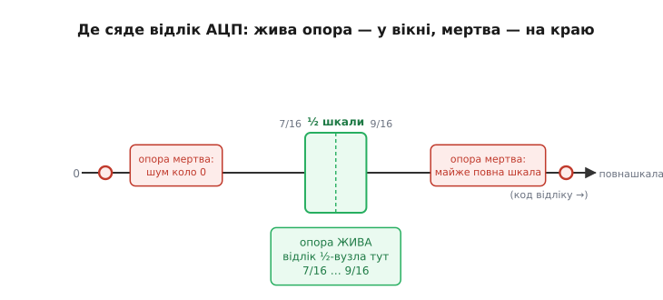

# ⚙️ Перевірка опори в прошивці: чи справді bandgap піднявся

> [Bandgap-джерело](topic:hw-analog/voltage-reference-sources) (*bandgap reference*) — це опорна напруга, яку аналого-цифровий перетворювач бере за «лінійку»: будь-який вимір — це частка цієї опори. Проблема в тому, що bandgap-осередок самозміщений і має дві стійкі рівноваги — робочу й мертву, з виходом 0 В, — і сам у робочу не завжди переходить. Стаття-власник [«Старт-схема bandgap-осередку»](topic:hw-analog/bandgap-startup) пояснює, *чому* так і як кремній це лікує старт-вузлом. Тут — інше: що з цим робити **в прошивці**, коли старт-вузол усе-таки не спрацював.

Застрягле bandgap-джерело — це біда не лише кремнію, а й коду: мертва опора не подає тривоги, вона просто видає число, яке виглядає легально. Розберімо до кінця, як на старті системи **довести** собі, що опора жива, перш ніж довірити їй бодай один вимір. Бо ціна помилки тут не «нуль на дисплеї», а тихо хибні рішення приладу — а це найгірший різновид збою: той, що не падає, а бреше.

### Задача: мертва опора виглядає як чесний нуль

Уявімо звичайний ланцюжок. Є датчик — скажімо, дільник, що віддає половину напруги акумулятора. Є [АЦП](topic:hw-analog/adc), який оцифровує цю напругу. АЦП міряє **не у вольтах** — він міряє **частку від опорної напруги**. Формула перетворення проста й безжальна:

```
відлік = (Vвх / Vref) × повна_шкала
```

Поки Vref дорівнює своїм законним ≈1.25 В (чи скільки там у конкретного чипа), усе чесно: половина акумулятора дає якесь осмислене число посеред шкали. А тепер уявімо, що bandgap застряг у мертвій точці й Vref ≈ 0. Що станеться з формулою? Знаменник прямує до нуля. Поділ на майже-нуль роздуває будь-який ненульовий вхід до **повної шкали** — АЦП покаже максимум, хоч на вході було пів-акумулятора, хоч мілівольт. А якщо й вхід коло нуля — відлік потоне в шумі десь коло нуля. Результат однаковий за наслідком і протилежний за виглядом: відлік опиняється **на краю** шкали, а не там, де мав би бути.

> 🔧 **Навіщо це.** Найпідступніше тут — що жодне з цих чисел не «неправильне» з погляду коду. `0xFFFF` — цілком легальний відлік 16-бітного АЦП. `0x0000` — теж. Ваша програма побачить рівне, добре сформоване число й піде з ним далі: спрацює на «розряджений акумулятор», коли той повний, або «перегрів», коли все холодне. Збій не в тому, що АЦП повернув помилку — він **не повернув** помилки. Він повернув брехню, невідрізнену від правди, якщо не знати, на що дивитися.

Сформулюймо рівно. **Дано:** на старті системи bandgap-опора могла піднятися, а могла застрягти. **Знайти:** спосіб у прошивці відрізнити «опора жива» від «опора мертва», не маючи зовнішнього еталона напруги — лише сам АЦП, який цю саму опору й використовує. Підступ замкнений: ми хочемо перевірити лінійку самою лінійкою. Здавалося б, неможливо. Та вихід є, і він елегантний.

### Ідея: виміряти вузол із відомою часткою живлення

Ключ — у тому, що ми насправді **знаємо** напругу одного-єдиного вузла наперед, без жодного еталона: вузол, заданий **точним дільником від самого живлення**. Поставмо два однакові резистори від шини живлення до землі — посередині буде рівно половина живлення. Не «приблизно», не «десь там»: відношення резисторів задає частку, а вона тримається сама собою, бо обидва резистори з того самого матеріалу, на тому самому кристалі чи з тієї самої партії, і їхні відхилення взаємно скорочуються.

> 🔧 **Навіщо це.** Чому саме **дільник**, а не якесь абсолютне джерело? Бо дільник дає **частку**, а не вольти, — і ця частка не залежить ні від точного значення живлення, ні від температури, ні від старіння резисторів (вони пливуть разом). Нам і потрібна частка: адже АЦП теж міряє частку. Половина живлення на вході, поділена на правильну Vref, має дати десь половину шкали — це передбачення, яке можна перевірити. Глибше про те, чому вимір частки живлення стійкіший за вимір абсолютної напруги, — у темі [ратіометричного вимірювання](topic:hw-sensing/ratiometric-measurement): коли і вхід, і вимір прив'язані до того самого живлення, спільні похибки взаємно гинуть.

Тепер — головний фокус. Підставмо цей відомий вузол у формулу перетворення для двох випадків.

Якщо опора **жива** (Vref на місці):

```
Vвх    = 0.5 × Vживлення        # точний дільник
Vref   ≈ 1.25 В                 # bandgap піднявся
відлік = (0.5 · Vживл / 1.25) × повна_шкала
```

При типовому живленні 3.3 В це дає (0.5·3.3/1.25)·повна_шкала ≈ 1.32·повна_шкала — тобто **зашкалює**, відлік сяде на стелю. Гм. Це означає, що половину живлення не можна міряти просто так, якщо опора менша за половину живлення, — вийдемо за шкалу навіть при живій опорі. Висновок не провал, а уточнення задачі: вузол-свідок треба обирати так, щоб при **живій** опорі він давав відлік **усередині** шкали, бажано ближче до середини, де АЦП найточніший і де найдалі до обох країв.

Тому реальний вузол-свідок беруть не «півживлення», а таку частку, що з живою опорою лягає коло середини шкали. Якщо опора 1.25 В, а живлення 3.3 В, повна шкала відповідає 1.25 В на вході; середина шкали — це ≈0.625 В. Дільник на таку напругу від 3.3 В — це коефіцієнт ≈0.19, тобто резистори приблизно 1:4.3. Тоді:

```
Vсвідок = 0.19 × 3.3 В ≈ 0.625 В      # ≈ середина шкали при живій опорі
відлік(жива) ≈ 0.5 × повна_шкала       # десь посеред шкали
```

А якщо опора **мертва** (Vref ≈ 0):

```
відлік(мертва) = (0.625 / ~0) × повна_шкала → впирається в стелю
                 (а якщо вхід просів — тоне коло нуля)
```

Ось і вся ідея, кристально чисто: **жива опора кладе відлік відомого вузла в середину шкали; мертва — викидає його на край.** Нам не треба знати точне значення Vref — досить того, що при живій опорі результат **правдоподібний** (коло очікуваного), а при мертвій — **неправдоподібний** (на краю). Перевірка лінійки самою лінійкою вдалася, бо ми спитали не «скільки вольтів», а «чи лежить відлік там, де мусив би, якби лінійка була ціла».


*Той самий вузол із відомою часткою живлення, два стани опори. Жива опора — і відлік сидить у вузькому зеленому вікні правдоподібності коло половини шкали. Мертва опора — і знаменник перетворення зник: будь-який вхід читається або як майже повна шкала, або тоне в шумі коло нуля, тобто на самому краю. Перевірка зводиться до одного питання: відлік усередині вікна чи на краю?*

Лишається оформити «коло очікуваного» числом — задати **вікно правдоподібності**: нижню й верхню межу, між якими відлік вважаємо здоровим. Усе, що поза вікном, — підозра на мертву опору. Ширину вікна обговоримо нижче (це окрема пастка), а спершу — робочий код.

### Робочий код: перевірка з таймаутом і фіксацією відмови

Зберемо повну процедуру старту. Вона має зробити три речі по черзі: дати опорі час прокинутися, **виміряти** вузол-свідок і перевірити його проти вікна, а якщо не вийшло — **не здаватися з першої спроби**, а перепробувати з таймаутом, і лише по вичерпанні таймауту — зафіксувати відмову й перейти в безпечний стан. Жодного «прочитав один раз — повірив».

Почнімо з найнижчого шару — самої перевірки правдоподібності. Винесімо межі вікна в іменовані сталі, щоб вони були на видноті й їх можна було підкрутити під конкретну плату:

```cpp
#include <stdint.h>
#include <stdbool.h>

// ── Конфігурація вікна правдоподібності (під конкретну плату) ──────────────
// АЦП 12-бітний → повна шкала 4095. Вузол-свідок при ЖИВІЙ опорі дає
// ≈ половину шкали (≈2048). Вікно — навколо неї, з запасом на розкид
// резисторів дільника, живлення та похибки самого АЦП.
#define ADC_FULL_SCALE   4095u
#define VREF_OK_LO       1400u   // ≈ 0.34 шкали — нижня межа «живої» опори
#define VREF_OK_HI       2700u   // ≈ 0.66 шкали — верхня межа

// Канал АЦП, на який заведено вузол-свідок (точний дільник від живлення).
#define CH_VREF_WITNESS  7u

// Зовнішні залежності від драйвера АЦП конкретного МК:
extern void     adc_init(void);
extern uint16_t adc_read(uint8_t channel);   // один відлік із каналу
extern void     delay_us(uint32_t us);

// Перевірка ОДНОГО відліку проти вікна правдоподібності.
// true  → відлік там, де мав би бути за живої опори;
// false → відлік на краю → підозра на мертву опору.
static bool witness_in_window(uint16_t code)
{
    return (code >= VREF_OK_LO) && (code <= VREF_OK_HI);
}
```

Чому межі саме 1400 і 2700, а не впритул до 2048? Бо вікно мусить **пропускати все живе** й **ловити все мертве**, а між цими вимогами — натяг. За живої опори відлік не сяде точно в 2048: резистори дільника мають свій допуск (1 % дешевого дільника — це вже ±20 кодів самі по собі, і це найменше з лих), живлення може бути не рівно 3.3 В, сам АЦП має зсув і похибку підсилення. Усе це разом легко зсуває «живий» відлік на сотні кодів. Тому вікно роблять **широким** — від третини до двох третин шкали. Воно все одно впевнено відрізняє це від країв (0 чи 4095), а саме краї й дає мертва опора. Краще широке вікно, що ніколи не зчинить хибної тривоги на живій опорі, ніж вузьке, що інколи відкине цілком справний прилад.

Тепер — обгортка з усередненням і таймаутом. Один відлік на старті недовірливий: і опора щойно ввімкнулася, і живлення ще «дзвенить» перехідними процесами, і перший відлік багатьох АЦП після ввімкнення взагалі сміттєвий (внутрішній конденсатор вибірки ще не заряджений до пуття). Тому беремо не один відлік, а кілька й усереднюємо — це заодно прибирає випадковий шум:

```cpp
// Скільки відліків усереднити в одній спробі (приглушити шум і перший
// сміттєвий відлік після ввімкнення АЦП).
#define WITNESS_SAMPLES   8u

// Усереднений відлік вузла-свідка. Перший відлік відкидаємо навмисно:
// після ввімкнення АЦП його конденсатор вибірки ще не встояний.
static uint16_t witness_average(void)
{
    (void)adc_read(CH_VREF_WITNESS);          // «прогрівний» відлік — у смітник
    uint32_t acc = 0;
    for (uint8_t i = 0; i < WITNESS_SAMPLES; ++i) {
        acc += adc_read(CH_VREF_WITNESS);
    }
    return (uint16_t)(acc / WITNESS_SAMPLES);
}
```

І нарешті — серце процедури: цикл із таймаутом. Він повторює «почекати трохи → виміряти → перевірити» доти, доки опора або підніметься (успіх), або не підніметься за відведений час (відмова). Таймаут — не косметика: він рятує від нескінченного зависання, коли опора мертва **назавжди** (бракує старт-вузла, дефект чипа), і водночас дає опорі чесний шанс, коли вона просто **повільно** прокидається:

```cpp
// Скільки максимум чекати на підняття опори, перш ніж визнати відмову.
// Запас над паспортним часом прокидання bandgap (типово десятки–сотні мкс).
#define VREF_TIMEOUT_US    5000u    // 5 мс — щедрий запас навіть на повільний фронт
#define VREF_POLL_US        250u    // крок очікування між спробами

typedef enum {
    VREF_ALIVE = 0,   // опора піднялась, відлік у вікні
    VREF_DEAD         // таймаут вичерпано, опора так і не піднялась
} vref_status_t;

// Дочекатися живої опори АБО вичерпати таймаут.
static vref_status_t wait_for_reference(void)
{
    uint32_t waited = 0;
    while (waited < VREF_TIMEOUT_US) {
        delay_us(VREF_POLL_US);
        waited += VREF_POLL_US;

        uint16_t code = witness_average();
        if (witness_in_window(code)) {
            return VREF_ALIVE;        // опора жива — виходимо одразу
        }
        // Поки на краю — даємо ще шанс: можливо, опора повільно повзе вгору.
    }
    return VREF_DEAD;                  // час вийшов, опора так і не ожила
}
```

Тепер усе складається у верхню процедуру старту системи. Вона ставить чіткий бар'єр: **за цей бар'єр код проходить лише з доведено живою опорою**; інакше — фіксує відмову й не пускає систему в робочий режим зі сліпими вимірами:

```cpp
// Коди відмов для журналу/індикації.
typedef enum {
    FAULT_NONE = 0,
    FAULT_VREF_DEAD        // bandgap-опора не піднялась у відведений час
} fault_code_t;

extern void fault_latch(fault_code_t code);   // зафіксувати відмову (журнал, світлодіод)
extern void enter_normal_mode(void);          // штатний робочий режим
extern void enter_degraded_mode(void);        // обмежений безпечний режим (див. нижче)
extern void system_reset(void);               // програмне перезавантаження

void system_bringup(void)
{
    adc_init();

    // Дати bandgap час прокинутись після подачі живлення.
    // Перша груба затримка — менша за таймаут, далі добиратиме wait_for_reference().
    delay_us(500);

    if (wait_for_reference() == VREF_ALIVE) {
        enter_normal_mode();                  // опора доведено жива — повна довіра АЦП
        return;
    }

    // Опора мертва: НЕ виходити в робочий режим зі сліпими вимірами.
    fault_latch(FAULT_VREF_DEAD);

    // Що далі — питання архітектури (див. «пастки»):
    //   або спробувати вилікувати перезавантаженням,
    //   або працювати в деградованому режимі без довіри до АЦП.
    system_reset();                           // тут обрано перезавантаження
}
```


*Один прохід рішення довіри до АЦП. Жодного шляху від старту до штатного режиму в обхід перевірки немає: пройти за зелений бар'єр можна лише через підтверджене вікно. Гілка «ні» не одразу здається — вона крутить повтор, доки опора повільно повзе вгору, і лише по вичерпанні таймауту зривається у відмову, де код сам вирішує: перезавантаження чи деградований режим.*

Зверніть увагу, чого код **не** робить: він не намагається «полагодити» старт-схему. Це не його робота — підняти bandgap із мертвої точки може лише кремній (старт-вузол). Код робить інше, не менш важливе: він **відмовляється довіряти** вимірюванням, поки не побачить доказ, що опора жива. Це різниця між «лагодити» й «не довіряти зламаному» — і в прошивці друге часто єдине, що ви взагалі можете зробити.

### Складність і пастки

Алгоритм короткий, але живе серед кількох пасток, кожна з яких уже когось підводила. Розберімо по черзі — з механізмом, а не просто списком «обережно».

**Час прокидання — не вгадуйте, дайте запас.** Найперша помилка — поставити `delay_us()` «на око» й виміряти опору **раніше**, ніж вона встигла піднятися. Паспортний час прокидання bandgap буває різний на порядки залежно від кристала й кутів процесу: в одному документі виробник радить читати внутрішню bandgap-опору **через 70 мкс** після ввімкнення саме через її час старту; в інших реалізаціях вихід встоюється за ≈9 мкс у «швидкому» куті кремнію — і помітно довше в «повільному». А за низького живлення чи великого навантаження бандгеп може ще й **перестрибнути** ціль і встоюватися довго. Звідси правило: не покладайтеся на одну фіксовану затримку, а **опитуйте** опору в циклі з таймаутом — як у коді вище. Перша затримка лише грубо економить цикли, а добирає до готовності саме цикл. І таймаут беріть зі щедрим запасом над найгіршим паспортним часом, а не «впритул».

**Повільний фронт живлення — окрема підступність.** Якщо живлення наростає мляво (м'який старт регулятора, велика ємність на шині), то на момент вашої першої перевірки і живлення ще не на номіналі, і дільник-свідок віддає не ту частку, на яку ви розраховували, бо рахували від повного живлення. Відлік може випадково потрапити чи не потрапити у вікно — і те, й те погано. Тому розумно перед перевіркою опори переконатися, що **саме живлення** вже піднялося до робочого, — або окремим компаратором просідання, або тим самим АЦП по абсолютному каналу живлення, якщо він є. Це прямо змикається з логікою [черговості ввімкнення шин](topic:hw-power/power-sequencing): опора має перевірятися тоді, коли її живлення вже стабільне, а не посеред наростання.

**Повторний запуск після просідання (brown-out) — найпідступніша.** Уявімо: система давно працює, опора жива, аж раптом живлення на мить **просіло** — впало нижче робочого, але не до нуля. Bandgap при цьому міг випасти в мертву точку (петля втратила струм), а от старт-вузол — ні: його детектор замкнувся ще під час нормальної роботи й тримається замкненим, бо живлення не падало **аж до нуля**, щоб його скинути. Виходить найгірше: опора мертва, штовхати її нема кому, а ваш `system_bringup()` давно відпрацював і більше не викликається. Прилад працює далі зі сліпими вимірами, і ніщо в коді про це не знає.

Висновок звідси подвійний. По-перше, перевірку опори не можна робити **лише раз на старті** — її варто час від часу **переперевіряти й під час роботи** (періодично читати вузол-свідок у тому самому вікні). По-друге, на просідання живлення треба реагувати системно: детектор brown-out має або **скинути весь МК** (тоді `system_bringup()` чесно відпрацює заново — і опора, і її перевірка), або хоча б підняти прапор, за яким код перезапустить процедуру перевірки опори. Те, що детектор старт-вузла на кремнії скидається лише при падінні **до нуля**, означає, що проміжне просідання — саме та діра, яку має закрити логіка скидання системи, а не сподівання на кремній.

```cpp
// Періодична переперевірка опори ВЖЕ під час роботи (напр., раз на секунду
// з основного циклу або таймера): brown-out міг убити опору непомітно.
void reference_watchdog_tick(void)
{
    uint16_t code = witness_average();
    if (!witness_in_window(code)) {
        // Опора впала вже в робочому режимі — реагуємо як на свіжу відмову.
        fault_latch(FAULT_VREF_DEAD);
        system_reset();        // або enter_degraded_mode() — за політикою приладу
    }
}
```

**Межі вікна — між двома вогнями.** Зробите вікно **завузьким** — і відкинете цілком справний прилад: розкид резисторів дільника (навіть 1 % — це десятки кодів), допуск живлення, зсув і похибка підсилення самого АЦП легко зсувають живий відлік на сотні кодів від ідеальної середини. Зробите **зашироким** — і пропустите слабко-мертвий стан, коли опора піднялася лише частково й відлік повзе до краю, але ще не дійшов. Практичне правило: ставте межі від паспортного найгіршого розкиду живого відліку **плюс запас**, але так, щоб вони залишалися помітно далі від обох країв шкали (0 і повна), бо саме на краях сидить мертва опора. Третина–дві третини шкали — здорова відправна точка для 1 %-дільника; під точніший дільник вікно можна звузити, але без фанатизму. І не забудьте: вікно має бути правильним у **найгіршому куті** — і на морозі, і в теплі, бо і опора, і дільник, і зсув АЦП трохи пливуть із температурою.

> 🔧 **Навіщо це.** Ширину вікна підбирають не «щоб гарно», а під реальний бюджет похибок: складіть допуски дільника, живлення й самого АЦП (зсув + похибка підсилення, див. [похибки АЦП](topic:hw-sensing/adc-errors)) — і зробіть вікно ширшим за їхню суму з запасом, але вужчим за відстань до країв. Тоді перевірка ніколи не зчинить хибної тривоги на живій опорі й ніколи не пропустить мертву. Це той рідкісний випадок, коли «грубіше» — правильніше: вам треба надійно відрізнити середину від країв, а не виміряти Vref із точністю.

**Що робити при відмові — перезавантаження чи деградація.** Коли таймаут вичерпано й опора визнана мертвою, є дві принципово різні стратегії, і вибір — питання **призначення приладу**, а не смаку.

*Перезавантаження* (`system_reset()`) ставлять там, де прилад або працює справно, або не працює зовсім — третього не дано (медичний монітор, силовий контролер, будь-що, де хибний вимір небезпечніший за зупинку). Логіка проста: можливо, це був випадковий збій старту, і чисте перезавантаження дасть опорі ще один шанс прокинутися нормально. Але тут чаїться пастка **циклічного перезавантаження**: якщо опора мертва **апаратно** (дефект, холодний кристал, що ніяк не заводиться), прилад зависне в нескінченній петлі «старт → перевірка не пройшла → reset → старт». Тому розумне перезавантаження **рахує спроби** (у пам'яті, що переживає скидання, чи в регістрі причини скидання) і після кількох поспіль здається в стійку відмову — блимає кодом помилки й чекає людини, а не крутиться вічно.

*Деградований режим* (`enter_degraded_mode()`) доречний там, де прилад мусить **робити бодай щось** навіть зі скаліченою опорою. Він не довіряє АЦП, але лишається живим у тому, що від опори не залежить: підтримує зв'язок, блимає індикатором аварії, віддає по інтерфейсу чесний статус «опора мертва, виміри недостовірні», тримає безпечні стани виходів. Він **не показує** жодних виміряних величин (краще порожнеча, ніж брехня) — але й не падає в темряву. Для приладу, який хтось спостерігає віддалено, «я живий, але осліп» — цінніше повідомлення, ніж мовчазне перезавантаження по колу.

```cpp
// Перезавантаження з лічильником спроб — проти нескінченної петлі reset.
// boot_attempts лежить у пам'яті, що переживає скидання (backup-регістр,
// noinit-секція ОЗП тощо) — її НЕ чистить системний старт.
#define MAX_VREF_RETRIES   3u
extern uint32_t boot_attempts;   // переживає reset; чиститься лише при штатному старті

static void handle_dead_reference(void)
{
    fault_latch(FAULT_VREF_DEAD);

    if (boot_attempts < MAX_VREF_RETRIES) {
        boot_attempts++;
        system_reset();              // ще один чесний шанс прокинутись
    } else {
        // Кілька спроб поспіль провалились → це не випадковість, а апаратна біда.
        boot_attempts = 0;
        enter_degraded_mode();       // лишитись живим, але без довіри до АЦП
    }
}
```

Підсумок усієї вставки — одне речення, яке варто тримати в голові щоразу, коли пишете код, що довіряє АЦП. **Опорна напруга — це лінійка ваших вимірів, а зламана лінійка не кричить «я зламана» — вона тихо показує неправильні числа, невідрізнені від правильних.** Тому грамотна прошивка на старті не питає АЦП «скільки там», поки не доведе собі окремою перевіркою, що лінійка ціла: міряє вузол із відомою часткою живлення, перевіряє його проти широкого вікна правдоподібності, дає опорі час підняти себе через цикл із таймаутом — і лише пройшовши цей бар'єр, починає вірити числам. А коли опора так і не піднялася, чесно фіксує відмову й обирає за призначенням приладу: дати ще шанс перезавантаженням чи лишитися живим у деградації. Це не паранойя — це різниця між приладом, що падає чесно, і приладом, що бреше тихо.
