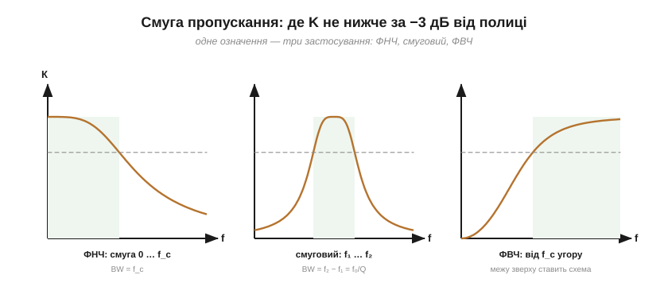
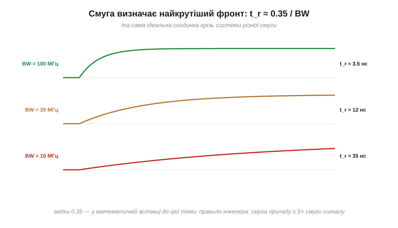
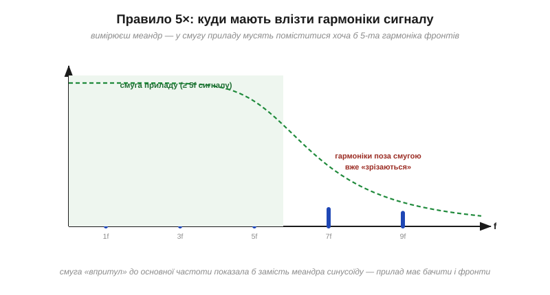
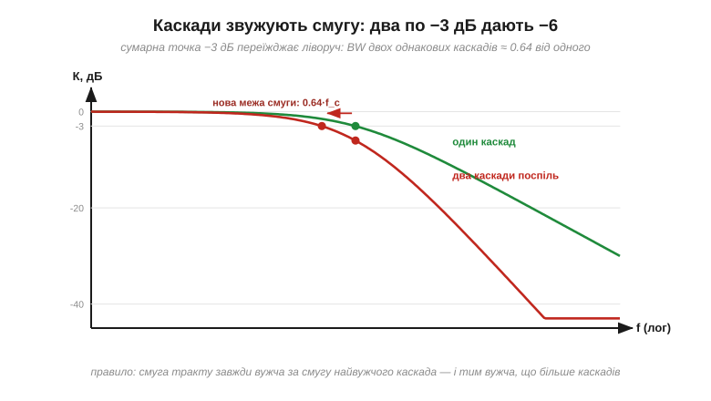
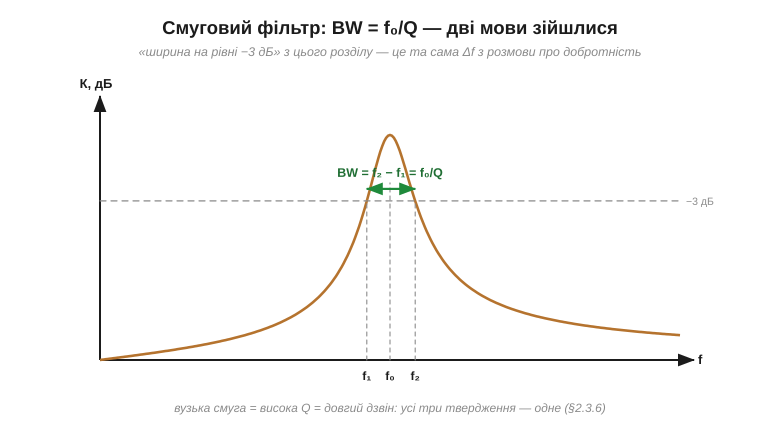

# Смуга пропускання й точка −3 дБ

«Осцилограф 100 МГц», «підсилювач 20 Гц – 20 кГц», «давач зі смугою 1 кГц» — жодна характеристика не трапляється в описах техніки частіше, ніж **смуга**. Інтуїтивно все ясно: це діапазон частот, які система «тягне». Але інтуїції замало, коли треба порівняти два даташити, вибрати прилад для вимірювання чи зрозуміти, чому тракт із трьох гарних каскадів раптом «не тягне» те, що тягнув кожен окремо. Щоб дати раду таким питанням, смугу треба зробити точним числом, з'ясувати, що відбувається на її краях, — і вивести два правила, якими інженери користуються щодня: зв'язок смуги з найкрутішим фронтом і звуження смуги в каскадах.

### Означення: −3 дБ від полиці

**Смуга пропускання** (*bandwidth*, BW) — це діапазон частот, у якому передача кола не падає більш ніж на **3 дБ** від рівня полиці (максимуму). Межі діапазону — це [точки зрізу](topic:hw-analog/frequency-response):


*Одне означення на всі випадки. У ФНЧ смуга тягнеться від нуля до f_c, тож BW = f_c. У смугового — між двома точками −3 дБ: BW = f₂ − f₁. У ФВЧ смуга йде від f_c «угору» — реальну верхню межу ставлять інші частини схеми.*

Межею обрано саме −3 дБ тому, що [це половина потужності](topic:hw-analog/decibels): точка енергетично однозначна й зручно прив'язана до зламу асимптот. Але чесність вимагає сказати: це **конвенція**. У відеотехніці інколи означують смугу за −6 дБ, у прецизійних трактах — за −1 дБ чи −0.1 дБ («плоска» смуга). Тож перше правило даташит-грамотності: порівнюючи смуги, перевірте, *за яким рівнем* їх означено.

> 🧮 **Математична вставка:** [чому −3 дБ — це половина потужності й 0.707 амплітуди](topic:hw-analog/bandwidth-3db/math-half-power.md). Звідки точно 1/√2, чому 10·log(½) і 20·log(0.707) — одне число, Піфагорів доказ, що фільтр на f_c віддає рівно половину, — і чим ця точка заслужила роль межі смуги.

**Приклад (що насправді каже «смуга 1 МГц»).** Однополюсний підсилювач зі смугою 1 МГц:

```
на 1 МГц:   −3 дБ   → 0.707 амплітуди (і фаза вже −45°!)
на 2 МГц:   −7 дБ   → 0.45
на 10 МГц:  −20 дБ  → 0.1
```

«Смуга 1 МГц» не означає «до 1 МГц все ідеально, далі нічого»: на самому краю сигнал уже втратив 30% і чверть оберту фази, а за краєм згасає поступово. Тому **робочий діапазон** беруть із запасом усередині смуги — зазвичай у 3–5 разів вужчим.

### Смуга ↔ швидкість: t_r ≈ 0.35/BW

Найкорисніший наслідок означення — місток до часу, рідня парі «[τ ↔ f_c](topic:hw-analog/rc-low-pass)». Система з обмеженою смугою не вміє робити скільки завгодно крутих фронтів: її **час наростання** (*rise time*, від 10% до 90% сходинки) жорстко прив'язаний до смуги:

```
t_r ≈ 0.35 / BW        (для одного полюса; звідки 0.35 — у вставці до теми)
```


*Та сама ідеальна сходинка після систем зі смугою 100, 30 і 10 МГц: фронти 3.5, 12 і 35 нс. Система не може показати фронт, коротший за власний t_r, — вона показує свій.*

**Приклад (вибір осцилографа).** Осцилограф зі смугою 100 МГц має власний t_r ≈ 3.5 нс. Подайте йому фронт 2 нс — і він намалює ≈4 нс: ви побачите **його** швидкість, а не сигналу. Звідси інженерне правило **5×**: смуга вимірювального приладу має бути щонайменше вп'ятеро ширшою за смугу сигналу — тоді внесок приладу в побачений фронт стає незначним.


*Той самий зміст [спектральною мовою](topic:hw-analog/frequency-response): форму меандра тримають непарні гармоніки, і прилад мусить пропустити хоча б п'яту. Смуга «впритул» до основної частоти показала б замість прямокутника синусоїду.*

> 🧮 **Математична вставка:** [фронт і смуга — звідки t_r ≈ 0.35/BW](topic:hw-analog/bandwidth-3db/math-risetime-bandwidth.md). Виведення в чотири рядки (0.35 — це ln 9/2π), чому фронт міряють між 10% і 90%, «Піфагор у часі» для каскадів із прикладом віднімання фронту осцилографа — і коли коефіцієнт чесніше брати 0.45.

### Каскади: смуга стискається

Другий щоденний наслідок. Поставимо два однакові каскади послідовно — кожен зі своєю смугою BW. На старій частоті зрізу кожен дає −3 дБ, разом — **−6 дБ** ([децибели додаються](topic:hw-analog/decibels)). А сумарна точка −3 дБ переїжджає туди, де кожен каскад втрачає лише по 1.5 дБ — **ліворуч**:


*Один каскад проти двох таких самих: на старій f_c тепер −6 дБ, а нова межа смуги — приблизно 0.64·f_c. Три каскади дали б ≈0.51·f_c. Смуга тракту завжди вужча за смугу найвужчого каскада.*

Число для пам'яті: **два однакові однополюсні каскади мають смугу ≈ 0.64** від одиночної; три — ≈ 0.51. Ця сама арифметика працює і в часі (через t_r ≈ 0.35/BW): часи наростання каскадів складаються приблизно як корінь із суми квадратів — t_r(тракту) = √(t_r₁² + t_r₂² + …). Саме за цією формулою, до речі, «віднімають» власний фронт осцилографа з виміряного.

**Приклад (чому тракт «не тягне»).** Три підсилювальні каскади, кожен зі смугою 1 МГц, складені в тракт: сумарна смуга ≈ 0.51 МГц — удвічі менша, ніж у кожного! А виміряний фронт замість 0.35 мкс одного каскада стане √3·0.35 ≈ 0.61 мкс. Проєктуючи каскадний тракт, кожен каскад беруть зі смугою з **запасом** відносно вимог до цілого.

### Смуговий фільтр: BW = f₀/Q

Для смугового фільтра означення через −3 дБ змикається з [добротністю](topic:hw-analog/quality-factor): ширина між точками −3 дБ — це рівно та сама Δf з означення добротності, тож


*Резонансний пік мовою смуги: центральна частота f₀, межі f₁ і f₂ на рівні −3 дБ, і ширина BW = f₀/Q. «Вузька смуга», «висока добротність» і «довгий дзвін» — три формулювання однієї властивості.*

```
BW = f₀ / Q
```

Контур приймача з [вставки про Q](topic:hw-analog/quality-factor/math-q-factor.md) — f₀ = 1.59 МГц, Q = 100 — мовою смуги має ширину 16 кГц: рівно стільки, скільки потрібно одній АМ-станції. Добротність і смуга — два погляди на ту саму властивість контуру.

### Смуга і шум

Ще одна причина не брати смугу «із запасом про всяк випадок»: разом із корисними частотами в систему заходить **шум** — і кожен зайвий герц смуги приносить свою частку. Удвічі ширша смуга — приблизно вдвічі більша потужність зібраного шуму при тому самому сигналі. Тому правильна смуга — це **точно під сигнал плюс розумний запас**, а не «якнайширше»: вузька смуга — найдешевший фільтр шуму, який існує. Тут досить самого принципу «ширша смуга — більше шуму»; механізми, що породжують цей шум, — окрема розмова.

### Пастки

- **«Смуга N» ≠ «до N усе ідеально».** На краю смуги вже −3 дБ і ±45° фази; робочий діапазон — усередині з запасом.
- **Порівняння смуг із різних означень.** −3 дБ проти −6 дБ проти «плоскої» — це різні числа для тієї самої залізяки.
- **Забутий каскадний ефект.** Тракт завжди вужчий за найвужчий каскад; множте 0.64/0.51 або складайте t_r квадратично.
- **Вимірювання «впритул».** Прилад зі смугою, рівною сигналу, показує себе, а не сигнал — правило 5×.
- **Гонитва за широкою смугою без потреби.** Зайва смуга — це зайвий шум і зайва чутливість до завад.

> 🔧 **Навіщо це.** Смуга — перше число, яке ви звіряєте між вимогою і даташитом: чи «бачить» осцилограф ваші фронти (t_r ≈ 0.35/BW і правило 5×), чи пройде сигнал давача крізь тракт, скільки каскадів можна скласти, не задушивши смугу. І навпаки — навмисне **звуження** смуги до потреб сигналу: найперший і найдешевший спосіб виграти в шумі. Пара формул цієї теми — 0.35/BW і f₀/Q — входить до десятки найуживаніших оцінок «на серветці» в усій електроніці.

**Смуга пропускання** — діапазон, де передача не падає більш як на 3 дБ від полиці (половина потужності); для ФНЧ це 0…f_c, для смугового — f₂−f₁ = **f₀/Q**. Смуга жорстко зв'язана зі швидкістю: **t_r ≈ 0.35/BW**, і система не показує фронтів, коротших за власний. Каскади звужують смугу (два однакові — до 0.64), а часи наростання складаються квадратично. Смугу обирають під сигнал із запасом — але не ширшою, бо кожен герц приносить шум. Дві формули цієї теми — 0.35/BW і f₀/Q — належать до десятки найуживаніших оцінок «на серветці» в усій електроніці.

---
