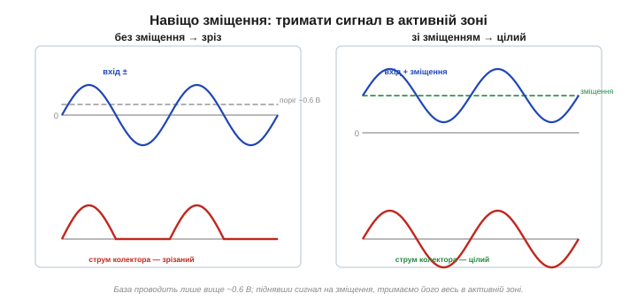
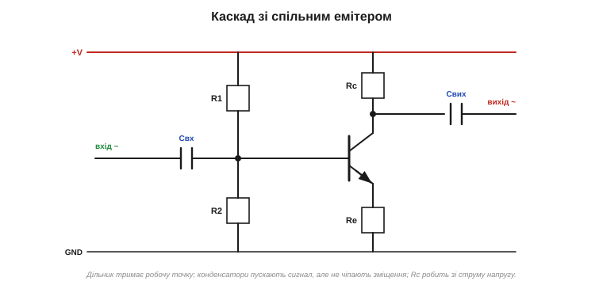
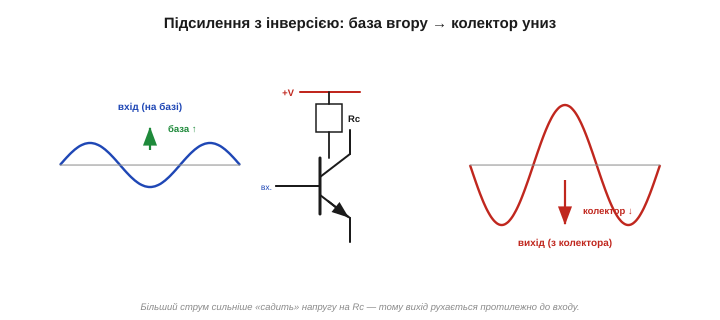
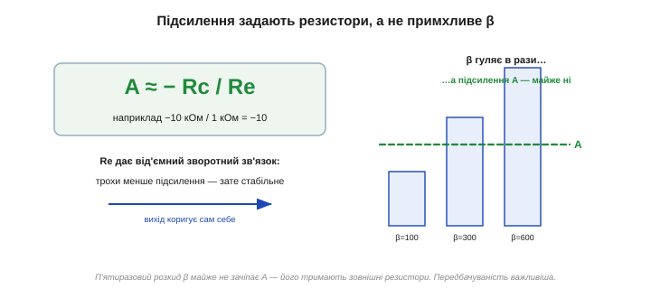
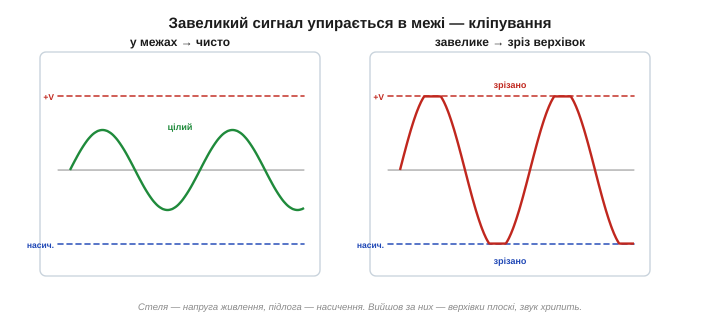
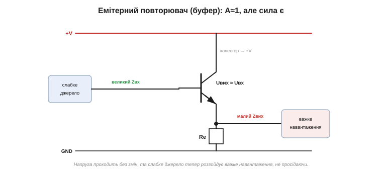

# BJT як підсилювач

Транзистор-[ключ](topic:hw-components/bjt-switch) користується двома крайніми режимами. Та є й друге велике застосування транзистора, заради якого його, власне, і винайшли: **підсилювач**. Тут транзистор не клацає, а тримається в [**активному** режимі](topic:hw-components/bjt-regions) і **плавно** перетворює слабкий сигнал на сильну копію. Це світ аналогової електроніки — і він трохи тонший за ключ, тож рушаймо обережно.

### Завдання й перешкода

Мета проста: зробити з кволого сигналу велику, але **вірну** його копію. Активний режим, де Ic = β·Ib, ніби готовий це дати — пропорційність є. Але є й перешкода. Реальні сигнали (звук, радіо) гойдаються **в обидва боки** — то плюс, то мінус. А струм бази не може бути від'ємним: перехід база–емітер проводить лише в один бік. Якщо подати «сирий» змінний сигнал просто на базу, то додатні півхвилі він підсилить, а від'ємні — **зріже** (транзистор закриється), і вийде не підсилювач, а [випрямляч](topic:hw-power/rectification).


*Якщо подати змінний сигнал прямо на базу, від'ємні півхвилі закриють транзистор, і він їх зріже — вийде спотворення. Розв'язок — підняти сигнал на постійне «зміщення», щоб він увесь лишався в активній зоні (праворуч).*

Підкреслимо слово **вірну**: підсилювач має дати більшу, але **точну** копію — інакше музика звучала б спотворено. Тому й потрібен лінійний (активний) режим, де вихід пропорційний входу. А спроба підсилити «в лоб» дала б лише половину сигналу — той самий ефект, що в [діода-випрямляча](topic:hw-power/rectification): одна півхвиля пройшла, друга зникла. Підсилювач без зміщення — це насправді кепський випрямляч.

А ще зауважте: підсилення «безкоштовне» лише на вигляд. Енергію могутнішого вихідного сигналу дає **джерело живлення**; транзистор лише ліпить за слабким зразком потужну подобу, черпаючи силу з живлення. Тому й підсилювач, і ключ потребують окремого живлення — без нього підсилювати нічим.

### Розв'язок: зміщення (робоча точка)

Хитрість — у **зміщенні** (*bias*). Спершу задають **постійний** струм бази, що тримає транзистор посередині активного режиму — у так званій **робочій точці** (*Q-point*): скажімо, такий, щоб струм колектора був на половині свого діапазону. А вже **поверх** цього постійного зміщення накладають слабкий змінний сигнал. Тепер струм бази гойдається **навколо** робочої точки, та ніколи не падає до нуля — і весь сигнал, обидві його півхвилі, лишається в активній зоні й чесно підсилюється.

Образно: ми підняли «гойдалку» сигналу на поміст, щоб вона не вдарялась об землю на нижньому розмаху. Зміщення — це той поміст.

Як саме виставляють робочу точку? Постійним струмом у базу — найчастіше через **дільник напруги** з двох резисторів, що задає сталу напругу на базі, а отже, і сталий струм колектора. Цей постійний струм тече **завжди**, навіть без сигналу, — ось чому класичний підсилювач у спокої постійно щось споживає (на відміну від ключа, що вимкнений майже не їсть). Точку ставлять так, щоб напруга на колекторі була десь **посередині** між живленням і нулем: тоді є простір гойдатися і вгору, і вниз.

> 🧮 **Математична вставка:** [робоча точка й навантажувальна пряма](topic:hw-analog/bjt-amplifier/math-load-line.md). Графічний інструмент, що знаходить «середину» точно: пряма Vce = Vcc − Ic·Rc на сімействі вихідних характеристик, її перетин із кривою зміщення — робоча точка Q; видно, чому Q посередині дає найбільший чистий розмах, звідки інверсія й як із нахилу прямої читається підсилення. До того ж той самий емітерний резистор Re, що задасть підсилення, ще й **утримує** робочу точку: підросте струм випадково (скажімо, від нагріву) — на Re впаде більше напруги, це трохи прикриє транзистор і поверне струм назад. Один зворотний зв'язок працює і на стабільність точки, і на стабільність підсилення воднораз.

Корисний образ: робоча точка — це постійний «приплив», а сигнал — невеликі **хвильки** поверх нього. Транзистор увесь час відкритий приблизно наполовину (приплив тримає його там), а слабкий вхід лише трохи розгойдує його туди-сюди навколо цієї точки. На виході виходить та сама хвилька, але велика. Тому, до речі, на вході й на виході ставлять [**розділові конденсатори**](topic:hw-components/capacitor-uses): вони пропускають змінну «хвильку» сигналу, але не дають постійному припливу зміщення витекти до сусідніх кіл чи зіпсувати їхні власні робочі точки. Сигнал їде «верхи» на зміщенні всередині каскаду — і сходить із нього на виході чистим.

### Схема зі спільним емітером

Найпоширеніший підсилювальний каскад — **зі спільним емітером** (*common-emitter*). Його кістяк:

- резистор колектора **Rc** — від плюса живлення до колектора (на ньому й «проявиться» підсилений сигнал);
- емітер — на землю (зазвичай через невеликий резистор **Re**);
- база **зміщена** (наприклад, дільником напруги), щоб задати робочу точку;
- вхідний сигнал заводять на базу **через конденсатор** — він [пропускає змінний сигнал, але блокує постійне зміщення](topic:hw-components/capacitor-uses);
- вихід знімають із колектора, теж через конденсатор.


*Каскад зі спільним емітером. Дільник задає робочу точку на базі; вхідний конденсатор пускає сигнал, але не чіпає зміщення; Rc перетворює струм колектора на напругу; вихід знімають із колектора. Re стабілізує роботу.*

> 🔌 **Компонентна вставка:** [найпростіший підсилювач на макетці — спільний емітер](topic:hw-analog/bjt-amplifier/comp-common-emitter.md). Зберемо цей каскад руками: конкретні номінали (BC547, 9 В, R1/R2, Rc, Re, конденсатори), як виставити робочу точку мультиметром (Vc ≈ половина живлення), що покаже осцилограф (більший перевернутий сигнал, кліп) — і пастки макетки (фон 50 Гц, земля, контакти).

Навіщо тут конденсатори? Бо сигнал змінний, а зміщення постійне, і їх треба **розв'язати**. Вхідний конденсатор пропускає змінний сигнал на базу, але не дає джерелу сигналу збити ретельно виставлене постійне зміщення (він [блокує постійку](topic:hw-components/capacitor-uses)). Вихідний так само віддає назовні лише змінну складову, не випускаючи постійної напруги колектора. Дільник на базі, Rc у колекторі, Re в емітері та два конденсатори зв'язку — ось і весь типовий каскад.

### Як воно підсилює (і перевертає)

Стежмо за подіями. Напруга на базі трохи **зросла** → струм бази зріс → струм колектора зріс у β разів → крізь Rc потекло більше струму → на Rc впало більше напруги → отже, напруга на колекторі **впала**. Маленький підйом на вході — велике падіння на виході. Тобто каскад **підсилює** і водночас **перевертає** сигнал (вхід угору — вихід униз). Уся магія перетворення «струм → напруга» — у резисторі Rc: зміна струму колектора, помножена на Rc, і дає велику зміну вихідної напруги.


*Маленький підйом напруги на базі викликає велике падіння на колекторі (бо більший струм сильніше «садить» напругу на Rc). Вихід — підсилена й **перевернута** копія входу. Резистор Rc перетворює зміну струму на зміну напруги.*

Чому саме інверсія? Бо вихід ми знімаємо з колектора, а напруга там — це «живлення мінус падіння на Rc». Більший струм колектора — більше падіння на Rc — менше лишається на колекторі. Тож коли вхід штовхає струм **угору**, вихідна напруга йде **вниз**, і навпаки. Інверсія — природний наслідок того, що сигнал ми читаємо «згори» резистора. (У повторювачі, де вихід беруть з емітера, інверсії якраз немає.)

### Підсилення = −Rc/Re

Наскільки сильно підсилює? Коефіцієнт підсилення за напругою — це відношення зміни виходу до зміни входу. Для каскаду з емітерним резистором він напрочуд простий:

```
Підсилення ≈ − Rc / Re
```

Мінус — це інверсія. А головне диво: підсилення задають **резистори** Rc і Re, а **не** примхливе β транзистора! Хочете підсилення 10 — беріть Rc у десять разів більший за Re. Це і є хитрість, що приборкує [примхливе β транзистора](topic:hw-components/bjt-gain): емітерний резистор створює **від'ємний зворотний зв'язок**, який стабілізує і робочу точку, і підсилення, роблячи їх незалежними від розкиду β. Платимо за це частиною підсилення — зате схема працює передбачувано з будь-яким транзистором.


*Коефіцієнт підсилення ≈ −Rc/Re — його задають два резистори, а не β. Емітерний резистор Re дає від'ємний зворотний зв'язок: трохи жертвуємо підсиленням заради того, щоб воно не «плавало» від екземпляра до екземпляра. Передбачуваність важливіша за голу величину.*

> 🔧 **Навіщо це.** Ось чому реальні підсилювачі майже завжди мають емітерний резистор (або глибший зворотний зв'язок): без нього підсилення дорівнювало б β й «плавало» б у рази між транзисторами та з температурою. Зі зворотним зв'язком підсилення задане резисторами — стабільне, повторюване, передбачуване. Це той самий принцип, на якому стоїть і [операційний підсилювач](topic:hw-analog/ideal-opamp): не довіряй точному підсиленню приладу — задай його зовнішніми резисторами.

Покажемо стабільність на числах. Хай Rc = 10 кОм, Re = 1 кОм — підсилення ≈ −10, і воно таке і для транзистора з β = 80, і для β = 400: різниця β у п'ять разів майже не зачіпає підсилення, бо його тримають резистори. Без Re підсилення дорівнювало б приблизно β — і стрибало б у ті самі п'ять разів від екземпляра до екземпляра, що для якісного звуку неприйнятно. Ось чому жертва частиною підсилення заради зворотного зв'язку — майже завжди вигідний обмін. А бракує підсилення — ставлять **кілька** каскадів поспіль, і їхні підсилення перемножуються. Саме так, нарощуючи каскади й обплітаючи їх зворотним зв'язком, зрештою дійшли до [**операційного підсилювача**](topic:hw-analog/ideal-opamp) — мікросхеми з велетенським власним підсиленням, якій лишилося тільки задати зовнішніми резисторами, скільки того підсилення використати.

### Обмеження сигналу: кліпування

Підсилювати безкарно можна лише **малий** сигнал. Якщо вхід завеликий, вихідний розмах упреться в «стелю» (живлення) чи «підлогу» (насичення), і верхівки сигналу **зріжуться** — це **кліпування** (*clipping*), грубе спотворення. Тому сигнал тримають достатньо малим, щоб транзистор увесь час лишався в активній зоні, не зриваючись у насичення чи відсічку.


*Якщо розмах на виході перевищує межі (живлення згори, насичення знизу), верхівки зрізаються — кліпування. Підсилений сигнал спотворюється. Тому в підсилювачі тримають сигнал у межах лінійної ділянки.*

Простір, у якому вихід може гойдатися без кліпування, звуть **запасом** (*headroom*). Що ближче робоча точка до середини й що менший сигнал, то більший запас. У звуці кліпування чути як хрипке спотворення на гучних місцях — знак, що підсилювачеві забракло запасу. Тому потужні підсилювачі живлять вищою напругою: більше «стелі» — більший неспотворений розмах. Тож «слабкий сигнал» — поняття відносне: слабкий **проти** запасу. Мілівольти на вході каскаду з підсиленням 100 дадуть на виході вольти — і якщо запас лише кілька вольтів, навіть такий «слабкий» вхід уже близько до межі.

### Повторювач: підсилювач, що не підсилює напругу

Є ще одна корисна схема — **емітерний повторювач** (*emitter follower*), де вихід знімають не з колектора, а з **емітера**. Він **не** підсилює напругу (коефіцієнт ≈ 1!) — навіщо ж він? Бо підсилює **струм/потужність** і служить **буфером**: має великий вхідний опір (майже не навантажує джерело сигналу) і малий вихідний (легко жене потужне навантаження). Це «перетворювач опорів»: ставлять його, коли слабке джерело має розкачати важке навантаження, не просівши.


*Емітерний повторювач: вихід із емітера, напруга та сама (підсилення ≈1), зате великий вхідний опір і малий вихідний. Це буфер: слабке джерело крізь нього розгойдує важке навантаження, не просідаючи.*

Навіщо буфер на ділі? Уявіть слабке джерело сигналу (давач чи попередній каскад із великим вихідним опором) і важке навантаження (динамік, довгий кабель). Під'єднай їх напряму — навантаження «просадить» кволе джерело, і сигнал зів'яне. Повторювач стає між ними: великим вхідним опором він майже не вантажить джерело, а малим вихідним — легко гойдає навантаження. Напруга та сама, але тепер за нею стоїть «сила».

### Три способи ввімкнення

Залежно від того, який вивід спільний для входу й виходу, є три класичні схеми. **Спільний емітер** (наш головний) — підсилює і напругу, і струм, перевертає сигнал; робоча конячка. **Спільний колектор** (він же емітерний повторювач) — буфер, підсилення напруги ≈1. **Спільна база** — рідкісна, для дуже високих частот. На практиці майже всі каскади — це спільний емітер та повторювач; із них і складають складніші підсилювачі.

Підсилювачі на транзисторах — усюди, де слабкий сигнал треба зробити сильним: мікрофонний підсилювач, радіоприймач, аудіотракт, кола давачів. Сьогодні їх частіше будують на готових [мікросхемах-операційниках](topic:hw-analog/ideal-opamp), але всередині тих мікросхем — ті самі транзисторні каскади зі спільним емітером і повторювачі. А коли власного підсилення одного каскаду бракує — їх ставлять [послідовно, керуючи навантаженням за даташитом транзистора](root:embedded/bjt-load-driving), і підсилення каскадів перемножуються.
