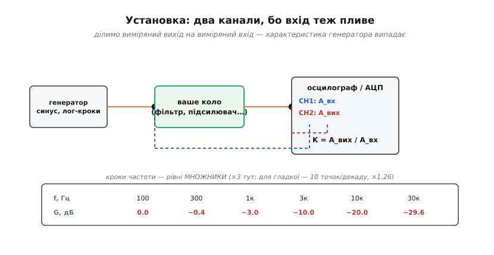
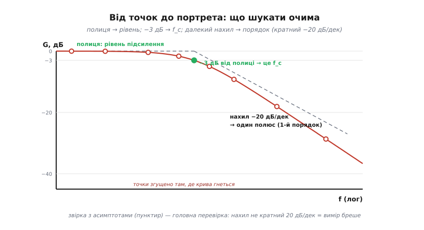

# ⚙️ Зняти АЧХ власноруч: свіп, таблиця, діаграма Боде

Намалювати власну амплітудно-частотну характеристику кола простіше, ніж здається: треба лише пройтися частотою від краю до краю й на кожному кроці записати, у скільки разів коло послабило (чи підсилило) сигнал. Цей прохід частотою зветься **свіпом** (*sweep* — «прочісування»), і саме він стоїть усередині кожного автоматичного «Bode plot» на сучасному осцилографі. Метод той самий, що в [пошуку резонансу свіпом](topic:hw-analog/lc-resonance): тільки там шукають один максимум, а тут знімають **увесь портрет** кола — з децибелами, логарифмічною віссю частот і, за бажання, фазою. Спецобладнання не потрібне: вистачить генератора синуса, двоканального осцилографа — або навіть мікроконтролера, якщо лабораторія кишенькова.

### Установка: чому каналів два

Подаємо синус на вхід кола, міряємо вихід — здавалося б, досить одного каналу. Ні: амплітуда самого генератора теж залежить від частоти. У нього своя, неідеальна характеристика, та й [коло його підвантажує](topic:hw-analog/rc-low-pass) по-різному на різних частотах, просаджуючи джерело. Якщо вважати вхід сталим, ця похибка повністю переповзе у вашу криву й видасть себе за поведінку кола. Тому міряємо **обидві** напруги — і вхідну, і вихідну — та ділимо виміряне на виміряне:


*CH1 дивиться на вхід кола, CH2 — на вихід; коефіцієнт передачі K = A_вих/A_вх рахується для кожної частоти. У відношенні двох вимірів примхи генератора скорочуються — лишається чиста характеристика кола. Кроки частоти беруться рівними множниками, не рівними герцами.*

Кроки частоти беріть **логарифмічно** — рівними множниками. Для грубого ескізу досить трьох точок на декаду («1–2–5», далі «10–20–50»…); для гладкої кривої — десяти точок на декаду, тобто множника ×1.26 (це 10^0.1, та сама [логарифмічна шкала, що й у децибелах](topic:hw-analog/decibels)). Лінійний крок тут — типова пастка початківця: він змарнує сотню точок на останню декаду й залишить майже голим усе цікаве внизу, де частоти тісні.

### Алгоритм одним поглядом

```
для f від f_min до f_max лог-кроками (× стала):
    1. встанови частоту, НЕ міняючи амплітуди
    2. зачекай встановлення (≥ 5τ кола; для резонансного — ~Q періодів!)
    3. виміряй A_вх (CH1) і A_вих (CH2) тим самим способом
       (розмах або RMS — байдуже, аби всюди однаково)
    4. запиши G = 20·log10(A_вих/A_вх)
    5. (фаза, за потреби) виміряй зсув Δt між нуль-переходами:
       φ = −360°·f·Δt
повтори згущеним кроком там, де G змінюється швидко
```

Два кроки тут важать більше за решту. **Очікування встановлення** (крок 2): після зміни частоти коло ще «дзвенить» перехідним процесом, і поспішний вимір зніме суміш старого відгуку з новим. Для простого RC досить п'яти сталих часу, але контур із [добротністю Q](topic:hw-analog/quality-factor) пам'ятає минуле близько Q періодів — біля резонансу поспіх занижує й розмазує пік. **Малий рівень сигналу** (крок 1): перевантажене коло стає нелінійним, на виході виростають гармоніки, яких на вході не було, — а весь метод мовчки спирається на те, що [на виході та сама частота, що й на вході](topic:hw-analog/frequency-response).

### Робочий код: свіп на мікроконтролері

Найдешевший повноцінний вимірювач АЧХ — сам мікроконтролер. Синус він добуває з [ШІМ плюс RC-згладжування](topic:hw-analog/rc-low-pass) (ідея «середнього з імпульсів») або з копійчаного DDS-модуля; вхід і вихід кола читає двома каналами АЦП. Амплітуду беремо найпростішим чесним способом — **розмах** (peak-to-peak): за кілька періодів збираємо максимум і мінімум вибірок, їхня різниця і є подвоєна амплітуда. Дільник «розмах на розмах» прибирає сталу складову й не потребує калібрування АЦП — масштаб скорочується.

Нижче — серце прошивки: один крок свіпу, від встановлення частоти до децибелів. Код реальний (стиль STM32/ESP-class HAL), а не псевдокод; зайве для суті винесено за дужки коментарями.

:::tabs
```c
#include <math.h>
#include <stdint.h>

#define ADC_FS    3.3f      // повна шкала АЦП, В
#define ADC_MAX   4095.0f   // 12-бітний АЦП
#define SETTLE_MS 50        // > 5·τ кола (тут τ ≈ 160 мкс для f_c=1 кГц)
#define WINDOW    2000      // скільки вибірок беремо на одну точку

// зовнішні примітиви плати:
void  gen_set_freq(float hz);         // перелаштувати DDS/ШІМ-генератор
void  delay_ms(uint32_t ms);
float adc_read(uint8_t ch);           // одна вибірка, у вольтах

// розмах (peak-to-peak) каналу за вікно вибірок
static float measure_pp(uint8_t ch) {
    float vmin = ADC_FS, vmax = 0.0f;
    for (int i = 0; i < WINDOW; i++) {
        float v = adc_read(ch);
        if (v < vmin) vmin = v;
        if (v > vmax) vmax = v;
    }
    return vmax - vmin;                // подвоєна амплітуда
}

// одна точка АЧХ: повертає підсилення в децибелах
static float bode_point(float f) {
    gen_set_freq(f);                  // крок 1: частота змінилась…
    delay_ms(SETTLE_MS);              // крок 2: …дати колу встановитися
    float a_in  = measure_pp(0);      // крок 3: CH0 — вхід кола
    float a_out = measure_pp(1);      //         CH1 — вихід кола
    return 20.0f * log10f(a_out / a_in); // крок 4: відношення → дБ
}

void bode_sweep(float f_min, float f_max, int per_decade) {
    float mult = powf(10.0f, 1.0f / per_decade);   // лог-крок: рівний множник
    for (float f = f_min; f <= f_max * 1.001f; f *= mult) {
        float g = bode_point(f);
        printf("%8.1f Hz   %+6.1f dB\n", f, g);    // у файл/UART → у графік
    }
}
```
```python
import math
import time

ADC_FS    = 3.3      # повна шкала АЦП, В
ADC_MAX   = 4095.0   # 12-бітний АЦП
SETTLE_MS = 50       # > 5·τ кола (тут τ ≈ 160 мкс для f_c=1 кГц)
WINDOW    = 2000     # скільки вибірок беремо на одну точку

# зовнішні примітиви плати (MicroPython на тому самому МК):
#   gen_set_freq(hz) — перелаштувати DDS/ШІМ-генератор
#   time.sleep_ms(ms) — затримка
#   adc_read(ch)     — одна вибірка, у вольтах

# розмах (peak-to-peak) каналу за вікно вибірок
def measure_pp(ch):
    vmin, vmax = ADC_FS, 0.0
    for _ in range(WINDOW):
        v = adc_read(ch)
        if v < vmin: vmin = v
        if v > vmax: vmax = v
    return vmax - vmin                 # подвоєна амплітуда

# одна точка АЧХ: повертає підсилення в децибелах
def bode_point(f):
    gen_set_freq(f)                    # крок 1: частота змінилась…
    time.sleep_ms(SETTLE_MS)           # крок 2: …дати колу встановитися
    a_in  = measure_pp(0)              # крок 3: CH0 — вхід кола
    a_out = measure_pp(1)              #         CH1 — вихід кола
    return 20.0 * math.log10(a_out / a_in)  # крок 4: відношення → дБ

def bode_sweep(f_min, f_max, per_decade):
    mult = 10.0 ** (1.0 / per_decade)  # лог-крок: рівний множник
    f = f_min
    while f <= f_max * 1.001:
        g = bode_point(f)
        print("%8.1f Hz   %+6.1f dB" % (f, g))  # у файл/UART → у графік
        f *= mult
```
:::

Виклик `bode_sweep(100.0f, 30000.0f, 3)` пройде від 100 Гц до 30 кГц трьома точками на декаду. Для [RC-ФНЧ](topic:hw-analog/rc-low-pass) зі зрізом 1 кГц прошивка надрукує саме той стовпчик, що в таблиці нижче, — і його точки лягають на діаграму без жодного ручного обчислення.

**Приклад (звірка з теорією).** Для одиночного полюса підсилення задано формулою `G = −10·log10(1 + (f/f_c)²)`. Підставивши f_c = 1 кГц:

```
   f, Гц     виміряно (код)     теорія −10·log10(1+(f/f_c)²)
    100          −0.0 дБ              −0.04 дБ
    300          −0.4 дБ              −0.37 дБ
   1000          −3.0 дБ              −3.01 дБ   ← зріз f_c
   3000         −10.0 дБ             −10.00 дБ
  10000         −20.0 дБ             −20.04 дБ   ← рівно декада → −20 дБ
  30000         −29.6 дБ             −29.55 дБ
```

Збіг до десятих долей дає головне: метод чесний, а різниця між сусідніми декадами рівно −20 дБ підтверджує, що це коло **першого порядку**.

> 🔧 **Навіщо це.** Кілька рядків `printf` через UART — і ви маєте власний аналізатор АЧХ за ціною плати, що вже лежить на столі. Та сама прошивка перевіряє [вхідний RC-фільтр](topic:hw-analog/rc-low-pass) перед АЦП, шукає прихований резонанс у тракті живлення чи знімає смугу саморобного підсилювача — без осцилографа за тисячі гривень.

### Від таблиці до діаграми

Відкладіть надруковані точки на логарифмічній осі частот і дБ-осі — і прочитайте власну криву тими ж очима, що й чужу з даташита:


*Полиця → рівень підсилення; точка на −3 дБ від полиці → частота зрізу f_c; далекий нахил → порядок кола (кратний −20 дБ/дек). Пунктирні асимптоти — найкраща перевірка вимірювання: справжні кола не вміють у «−27 дБ на декаду».*

Звірка з асимптотами — це і є контроль якості. Нахил, не кратний −20 дБ/дек, або полиця, що «дихає» від частоти, майже завжди означають перевантаження, наводку чи неврахований [вхідний дільник зі щупа](topic:hw-analog/voltage-divider), а не екзотичне коло. Реальна крива має лежати на 3 дБ нижче зламу асимптот — рівно стільки, скільки видно на діаграмі в точці f_c.

### Фаза і кишенькові варіанти

Фазову панель знімають тим самим проходом. Найпростіше — виміряти затримку Δt між нуль-переходами обох каналів (формула в алгоритмі); ще наочніше — пустити канали в режим XY й дивитися на [фігуру Ліссажу](topic:hw-components/phase-shift): на зрізі, де фаза −45°, еліпс упізнається миттєво, а на ±90° вироджується в коло.

Без лабораторного генератора теж усе виходить. **Звукова карта** комп'ютера — чесний генератор і двоканальний «осцилограф» до приблизно 20 кГц: цього вистачає на всі аудіо- й більшість сенсорних фільтрів, а програм-аналізаторів АЧХ під неї повно. **Мікроконтролер** робить те саме для своїх кіл — код вище якраз про це. А «розумні» осцилографи з вбудованим генератором мають готову кнопку «Bode plot»: вона автоматично жене генератор по частотах, захоплює обидва канали й будує дві панелі — тепер ви знаєте, що саме крутиться в неї всередині, бо самі написали цей цикл.

### Пастки

- **Свіп без затримки** — головна. Поспіх біля гострого резонансу занижує, розширює й зсуває пік: контур не встигає розгойдатися. Що добротніший об'єкт, то повільніше треба йти — це прямий наслідок зв'язку часу й частоти.
- **Засильний сигнал.** Перевантажений каскад породжує гармоніки, і вимір перестає бути вимірюванням однієї частоти. Тримайте розмах малим — у лінійній зоні кола.
- **Лінійний крок частоти.** Згаяні точки вгорі, гола картина внизу. Завжди рівні множники, не рівні герци.
- **Тісний зв'язок із приладом.** Щуп — це теж [ємність](topic:hw-analog/rc-low-pass), і на високих частотах він підвантажує вузол; низькоомний генератор, увімкнений прямо в коло, демпфує його. Під'єднуйтеся слабко, інакше виміряєте характеристику з'єднання, а не кола.
- **Один канал замість двох.** Найпідступніше: крива виходить правдоподібна, але в неї вшита характеристика генератора. Завжди ділимо вихід на одночасно виміряний вхід.

Зняти АЧХ — універсальний спосіб **побачити** будь-яке коло як фільтр: перевірити, чи ріже воно там, де розраховано, знайти прихований резонанс, виміряти смугу, навіть упізнати невідому «чорну скриньку» за зламами її портрета. А головне — після десятка власноруч знятих кривих діаграми Боде з даташитів перестають бути картинками й стають мовою, якою ви думаєте про схему.
