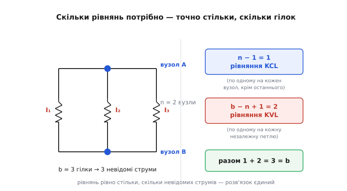
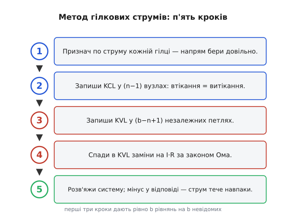
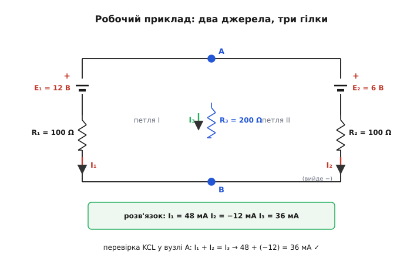

# Метод гілкових струмів

<preknowlist>
- [Закони Кірхгофа](root:hw-analog/kirchhoff-laws) — закон струмів (баланс у вузлі) і закон напруг (баланс уздовж контуру); на цих двох правилах стоїть увесь метод.
- [Закон Ома](root:hw-analog/ohms-law) — напруга на резисторі дорівнює струму, помноженому на опір: U = I·R.
- [Вузли, гілки й контури](root:hw-analog/nodes-branches-loops) — топологія кола: що таке вузол, гілка й замкнений контур і як їх лічити.
- [Системи лінійних рівнянь](root:math-algebra/linear-systems) — як розв'язати кілька рівнянь із кількома невідомими.
</preknowlist>

Дайте будь-яке коло з резисторів і джерел — і попросіть знайти всі струми в ньому. [Закон Ома](root:hw-analog/ohms-law) дасть по одному співвідношенню на кожен резистор, [закони Кірхгофа](root:hw-analog/kirchhoff-laws) — баланси в кожному вузлі й уздовж кожного контуру. Рівнянь, здавалося б, аж занадто. І саме тут ховається найтонше місце всієї теорії кіл: **скільки рівнянь писати, які саме, і чому їх має вийти рівно стільки, скільки невідомих, — ні на одне більше, ні на одне менше**. Напишеш забагато — вони почнуть суперечити одне одному або повторюватися; замало — коло лишиться недовизначеним, і струми не знайдуться.

Систематичну відповідь на це дає **метод гілкових струмів** (англ. *branch-current method*) — найпряміший з алгоритмів аналізу кіл. Його мета проста: щоб ви взяли будь-яку схему з резисторів і джерел, подивилися на неї — і без вагань сказали, скільки невідомих, скільки рівнянь, звідки їх узяти й як довести до розв'язку. Не завчений ритуал, а розуміння, чому інакше бути не може. Зберемо строгу покрокову рецептуру й доведемо її до числа на живому прикладі, де відповідь навіть здивує знаком.

## Що ми взагалі шукаємо

Спершу домовимося про слова, бо вся акуратність методу починається саме тут.

**Гілка** (англ. *branch*) — це ділянка схеми між двома сусідніми вузлами, якою тече **один спільний струм**. Резистор, послідовна пара «джерело + резистор», просто дріт — усе це гілки, якщо вздовж них струм ніде не розгалужується. Ключове: **уся гілка несе один струм**, бо заряду нема куди подітися між її кінцями.

**Вузол** (англ. *node*) — точка, де сходяться три чи більше гілок; саме там струм розщеплюється або зливається. Дві гілки, з'єднані «кінець у кінець» без відгалуження, вузла не утворюють — це просто одна довша гілка.

> 🔧 **Навіщо це.** Плутанина «що тут гілка, а що вузол» — головна причина, чому в новачка виходить забагато або замало рівнянь. Якщо порахувати гілки неправильно, уся система розсиплеться: буде більше невідомих, ніж рівнянь (недовизначено), або менше (перевизначено й суперечливо). Тому перший погляд на схему — це завжди «полічи гілки й вузли», і лише тоді берися за рівняння.

Гілка несе один струм, вузол розщеплює струм, контур — замкнений шлях; точні означення й те, як [топологія кола](root:hw-analog/nodes-branches-loops) (а не його електрика) визначає число незалежних вузлів і контурів, розібрані окремо — саме на цьому триматиметься весь рахунок рівнянь нижче.

Тепер головна ідея методу, і вона підкупає прямотою. **За невідомі беремо струми гілок.** Не напруги, не потенціали вузлів — саме струми, по одному на кожну гілку. Чому це розумно? Бо струм гілки — це та єдина величина, якої вистачає, щоб відновити геть усе інше: знаєш струм гілки й опір її резистора — за законом Ома маєш напругу на ньому; знаєш напруги — маєш потенціали точок. Струми гілок — це **мінімальний повний набір невідомих**: менше взяти не можна (не вистачить, щоб описати коло), а більше й не треба.

Отже, якщо в колі `b` гілок, у нас `b` невідомих струмів. Уся задача звелася до одного питання: **де взяти рівно `b` рівнянь, щоб вони були незалежні й сумісні?** Відповідь дають два закони Кірхгофа, і те, як вони діляться між вузлами й контурами, — найкрасивіша частина.

## Чому рівнянь виходить рівно стільки, скільки гілок

Тут працює справжня магія — і вона не електрична, а **топологічна**: усе визначається тим, як гілки з'єднані між собою, а не тим, які там резистори чи джерела. Розберімо по черзі, звідки беруться рівняння й чому їх сума точно дорівнює `b`.

**Рівняння від закону струмів.** [Закон струмів](root:hw-analog/kcl) (KCL) — у будь-якому вузлі алгебраїчна сума струмів дорівнює нулю, бо вузол не комора й заряду не накопичує, — дає по одному рівнянню на кожен вузол: сума втікань дорівнює сумі витікань. Якщо вузлів `n`, здавалося б, маємо `n` рівнянь. Але тут криється пастка, і її треба зрозуміти до кінця, бо саме на ній спотикаються.

Останнє рівняння KCL — **зайве**, воно не несе нової інформації. Уявіть, що ви записали баланс струмів для всіх вузлів, крім одного. Кожна гілка з'єднує два вузли: струм, що з однієї точки зору «витікає», з іншої «втікає», тож у сумі всіх рівнянь кожен струм з'являється двічі — раз зі знаком плюс, раз зі знаком мінус — і повністю скорочується. Тому сума всіх `n` рівнянь KCL дає тотожність `0 = 0`. А отже, знаючи будь-які `n−1` із них, останнє ви відновите автоматично — воно нічого не додає. Незалежних рівнянь струму рівно:

```
незалежних KCL  =  n − 1
```

Інтуїція за цим така: заряд, що не накопичується в `n−1` вузлах, не має куди подітися й в останньому — той сам собою збалансований. Один вузол завжди «безкоштовний».

**Рівняння від закону напруг.** Решту рівнянь дає [закон напруг](root:hw-analog/kvl) (KVL): уздовж будь-якого замкненого контуру алгебраїчна сума напруг дорівнює нулю, бо, обійшовши контур і повернувшись у вихідну точку, заряд опиняється на тому самому потенціалі, тож підйоми джерел дорівнюють спадам на елементах.

Скільки незалежних контурів у колі? Знову ж таки, не скільки завгодно: контурів у складній схемі можна намалювати безліч (будь-який замкнений шлях — контур), але **незалежних** серед них — строго обмежене число. Незалежний контур — це такий, що додає бодай одну гілку, якої не було в попередніх; щойно контур можна скласти з уже врахованих гілок, його рівняння виводиться з інших і нового не дає. Топологія кола відповідає точною формулою:

```
незалежних KVL  =  b − n + 1
```

Звідки вона? Уявімо, що будуємо коло поступово. Візьмемо `n` вузлів і почнемо з'єднувати їх гілками. Перші `n−1` гілок можна прокласти так, що жодного замкненого шляху ще не виникне — це **кістякове дерево** (англ. *spanning tree*), що сполучає всі вузли, але петель не має. Кожна **наступна** гілка, додана до дерева, неминуче замикає рівно один новий контур — бо обидва її кінці вже сполучені деревом, і нова гілка дає альтернативний шлях. Таких «зайвих» гілок понад дерево рівно `b − (n−1) = b − n + 1`, і кожна народжує один незалежний контур. Ось і вся формула — чиста топологія, жодної електрики.

Тепер складімо докупи. Незалежних рівнянь усього:

```
(n − 1)  +  (b − n + 1)  =  b
```

`n` скорочується, лишається рівно `b`. **Стільки рівнянь, скільки невідомих струмів гілок.** Не випадковість, а наслідок того, як улаштований будь-який зв'язний граф: скільки гілок ви додали понад дерево — стільки й незалежних контурів; скільки вузлів мінус один — стільки й незалежних балансів струму; у сумі — рівно число гілок. Система квадратна, і — для звичайного лінійного кола — має єдиний розв'язок.


*Топологія сама диктує число рівнянь. У колі з b = 3 гілками й n = 2 вузлами невідомих струмів три (I₁, I₂, I₃). Закон струмів дає n − 1 = 1 незалежне рівняння (другий вузол — «безкоштовний»), закон напруг дає b − n + 1 = 2 рівняння (дві незалежні петлі). Разом 1 + 2 = 3 = b: рівнянь рівно стільки, скільки невідомих.*

> 🔧 **Навіщо це.** Ця арифметика — ваш запобіжник від помилки. Перш ніж писати бодай одне рівняння, полічіть `b` і `n` та випишіть очікуване: `n−1` рівнянь струму, `b−n+1` рівнянь напруги. Якщо потім у вас вийшло інакше — ви або взяли залежний контур (лишній), або пропустили вузол. Ця перевірка ловить помилку ще до алгебри, коли її дешево виправити.

## П'ять кроків: рецептура

Тепер зберемо все в послідовність, якою можна користуватися механічно — і водночас розуміти кожен крок. Метод гілкових струмів — це п'ять дій, і жодна з них не потребує здогадів.


*Метод гілкових струмів як покрокова рецептура. Перші три кроки дають рівно b рівнянь на b невідомих; четвертий переводить напруги в струми законом Ома; п'ятий доводить систему до числа. Мінус у відповіді — не помилка, а підказка, що струм тече проти обраного напряму.*

**Крок 1. Признач по струму кожній гілці — напрям бери довільно.** Це найважливіший психологічний момент методу, і його треба зрозуміти правильно. Ви **не знаєте** наперед, куди насправді тече струм у кожній гілці, — і не мусите знати. Просто намалюйте стрілку в будь-який бік і назвіть цей струм `I₁`, `I₂`, … Якщо ви вгадали напрям — відповідь вийде додатною; якщо помилилися — **від'ємною**, і це не помилка, а точна вказівка: «струм тече навпаки, а за величиною ось стільки». Метод самокоригується за знаком, тому гадати про напрями — марна трата часу.

**Крок 2. Запиши KCL у `n−1` вузлах.** Виберіть будь-які `n−1` вузлів (один лишіть — він «безкоштовний») і для кожного напишіть: сума струмів, що втікають за вашими стрілками, дорівнює сумі тих, що витікають. Це `n−1` рівнянь, і всі вони незалежні.

**Крок 3. Запиши KVL у `b−n+1` незалежних петлях.** Виберіть незалежні контури — найпростіше брати «елементарні вічка» схеми, найменші замкнені шляхи, що не містять інших гілок усередині (кожне таке вічко гарантовано додає нову гілку). Для кожного оберіть напрям обходу (скажімо, за годинниковою стрілкою) і пройдіть ним, ставлячи знаки: підйом, коли входите в джерело з мінуса в плюс; спад, коли струм тече крізь резистор у бік вашого обходу. Це `b−n+1` рівнянь.

**Крок 4. Спади в KVL заміни на `I·R` за [законом Ома](root:hw-analog/ohms-law).** У рівняннях KVL спад на кожному резисторі — це поки що абстрактна «напруга». Закон Ома перетворює її на струм: напруга на резисторі дорівнює струму крізь нього, помноженому на опір, `U = I·R`, де `I` — струм саме тієї гілки. Після підстановки у ваших рівняннях лишаються **тільки невідомі струми** — жодних окремих напруг. Ось де три закони змикаються в одне: саме Ом переводить рівняння напруг у рівняння струмів.

**Крок 5. Розв'яжи систему; мінус у відповіді — струм тече навпаки.** Тепер у вас `b` лінійних рівнянь на `b` невідомих струмів. Це звичайна [система лінійних рівнянь](root:math-algebra/linear-systems) — якщо рівнянь стільки ж, скільки невідомих, і вони незалежні, розв'язок єдиний; беріть будь-який спосіб: підстановку, вилучення змінних, матрицю. Отримані числа — струми гілок; від'ємні означають лише зворотний напрям. Далі напруги на всіх елементах дає той самий закон Ома.

Зверніть увагу на розподіл праці. Кроки 2–3 — це чиста **топологія**: дивимося, як гілки з'єднані, і виписуємо баланси. Крок 4 — єдине місце, де в гру входять власне **числа елементів** (опори й напруги джерел). Крок 5 — чиста **алгебра**. Метод чітко розділяє «як з'єднано» і «які значення», і саме тому він такий надійний: помилку в топології видно окремо від помилки в арифметиці.

## Робочий приклад: два джерела, і струм тече не туди

Візьмемо коло, на якому метод показує себе в повній красі, — з **двома** джерелами. Такі схеми не зводяться до простого дільника, бо джерела «сперечаються», хто задає струм; тут без повної системи не обійтися. І — що найповчальніше — один зі струмів вийде **від'ємним**, тож ми на живому прикладі побачимо, що означає «напрям обрано неправильно».

Схема така. Дві паралельні гілки-джерела зверху зливаються у вузлі A і живлять спільний резистор `R₃` посередині, а через нього струм повертається у вузол B. Ліва гілка: джерело `E₁ = 12 В` послідовно з `R₁ = 100 Ω`. Права гілка: `E₂ = 6 В` послідовно з `R₂ = 100 Ω`. Спільна середня гілка: `R₃ = 200 Ω`.


*Коло з двома джерелами й трьома гілками. Струми I₁ (крізь E₁, R₁) та I₂ (крізь E₂, R₂) обидва спрямовані у вузол A, струм I₃ — донизу крізь R₃. Розв'язок: I₁ = 48 мА, I₃ = 36 мА, а I₂ = −12 мА — мінус означає, що насправді струм у правій гілці тече проти обраної стрілки. Перевірка законом струмів у вузлі A сходиться: 48 + (−12) = 36 мА.*

Полічимо спочатку топологію, як велить дисципліна. Гілок три (ліва, права, середня) — `b = 3`. Вузлів два (A і B) — `n = 2`. Отже, очікуємо `n−1 = 1` рівняння струму й `b−n+1 = 3−2+1 = 2` рівняння напруги, разом три — точно за числом невідомих `I₁`, `I₂`, `I₃`. Тепер за рецептурою.

**Крок 1** уже зроблено на схемі: `I₁` тече вниз крізь ліву гілку в бік A, `I₂` — вниз крізь праву гілку в бік A, `I₃` — вниз крізь `R₃` від A до B. Напрями обрано довільно; подивимося, чи вгадали.

**Крок 2 (KCL у вузлі A).** У вузол A втікають `I₁` і `I₂`, витікає `I₃`:

```
I₁ + I₂ = I₃
```

**Крок 3 (KVL у двох вічках).** Ліва петля йде через `E₁`, `R₁` і `R₃`; права — через `E₂`, `R₂` і `R₃`. Обходимо кожну так, щоб джерело було підйомом, а резистори — спадами:

```
петля I:    E₁ = I₁·R₁ + I₃·R₃
петля II:   E₂ = I₂·R₂ + I₃·R₃
```

**Крок 4 (підстановка `I·R` вже виконана в кроці 3).** Спади ми одразу записали як `I·R`, тож у трьох рівняннях лишилися самі струми. Підставимо числа й виключимо `I₃`, скориставшись `I₃ = I₁ + I₂` із першого рівняння:

```
петля I:    12 = 100·I₁ + 200·(I₁ + I₂)  =  300·I₁ + 200·I₂
петля II:    6 = 100·I₂ + 200·(I₁ + I₂)  =  200·I₁ + 300·I₂
```

**Крок 5 (розв'язання системи).** Маємо дві прості рівності на два струми:

```
300·I₁ + 200·I₂ = 12
200·I₁ + 300·I₂ =  6
```

Виключимо `I₂`: помножимо перше рівняння на 300, друге — на 200, і віднімемо друге від першого. Тоді доданки з `I₂` (це `200·300·I₂` в обох) скоротяться:

```
(300·300 − 200·200)·I₁ = 12·300 − 6·200
(90000 − 40000)·I₁     = 3600 − 1200
50000·I₁               = 2400
I₁ = 2400 / 50000 = 0.048 А = 48 мА
```

Тепер `I₂` — з будь-якого рівняння, скажімо з другого:

```
200·(0.048) + 300·I₂ = 6
9.6 + 300·I₂          = 6
300·I₂               = 6 − 9.6 = −3.6
I₂ = −3.6 / 300 = −0.012 А = −12 мА
```

Ось і той самий від'ємний струм. Він **не** означає, що ми десь помилилися, — він означає, що в правій гілці струм насправді тече **проти** нашої стрілки: не вниз до вузла A, а вгору від нього. І фізика ясна: ліве джерело `E₁ = 12 В` удвічі сильніше за праве `E₂ = 6 В`, тож воно не лише живить `R₃`, а ще й «продавлює» струм назад у слабшу праву гілку, заряджаючи, так би мовити, її джерело. Метод побачив це сам, без наших підказок.

Тепер `I₃` — просто з балансу у вузлі A:

```
I₃ = I₁ + I₂ = 0.048 + (−0.012) = 0.036 А = 36 мА
```

І перевірка, без якої розрахунок не завершений, — підставимо в обидва рівняння KVL і переконаймося, що підйоми джерел точно дорівнюють спадам:

```
петля I:   I₁·R₁ + I₃·R₃ = 0.048·100 + 0.036·200 = 4.8 + 7.2 = 12 В = E₁   ✓
петля II:  I₂·R₂ + I₃·R₃ = (−0.012)·100 + 0.036·200 = −1.2 + 7.2 = 6 В = E₂  ✓
```

Обидві петлі зійшлися до напруг своїх джерел — знак, що розв'язок правильний. Зверніть увагу на спад `U₂ = I₂·R₂ = −1.2 В`: від'ємний, бо струм тече проти нашого напряму, і в рівнянні це чесно враховано знаком. Ось той самий розрахунок у коді — компактна процедура, що розв'язує будь-яке таке дводжерельне тригілкове коло:

:::tabs
```cpp
// Метод гілкових струмів для кола: два джерела (E1,R1) і (E2,R2),
// спільний резистор R3. Струми I1,I2 — у вузол A, I3 — крізь R3.
// Виключивши I3 = I1 + I2, дістаємо систему двох рівнянь на I1, I2:
//   (R1+R3)·I1 +   R3  ·I2 = E1
//     R3  ·I1 + (R2+R3)·I2 = E2
// Розв'язуємо через визначник 2×2 (правило Крамера).
struct Branch { float I1, I2, I3; };

Branch branch_currents(float E1, float E2, float R1, float R2, float R3)
{
    float a11 = R1 + R3, a12 = R3;      // коефіцієнти рівняння петлі I
    float a21 = R3,      a22 = R2 + R3; // коефіцієнти рівняння петлі II
    float det = a11 * a22 - a12 * a21;  // визначник системи (≠ 0 для реального кола)

    float I1 = (E1 * a22 - a12 * E2) / det;  // струм лівої гілки
    float I2 = (a11 * E2 - E1 * a21) / det;  // струм правої гілки (може бути < 0)
    float I3 = I1 + I2;                       // закон струмів у вузлі A
    // інваріант: I1·R1 + I3·R3 == E1  і  I2·R2 + I3·R3 == E2 (контроль KVL)
    return { I1, I2, I3 };
}
// branch_currents(12, 6, 100, 100, 200) -> I1=48 мА, I2=−12 мА, I3=36 мА
```
```c
// Метод гілкових струмів для кола: два джерела (E1,R1) і (E2,R2),
// спільний резистор R3. Струми I1,I2 — у вузол A, I3 — крізь R3.
// Виключивши I3 = I1 + I2, дістаємо систему двох рівнянь на I1, I2:
//   (R1+R3)·I1 +   R3  ·I2 = E1
//     R3  ·I1 + (R2+R3)·I2 = E2
// Розв'язуємо через визначник 2×2 (правило Крамера).
void branch_currents(float E1, float E2, float R1, float R2, float R3,
                     float *I1, float *I2, float *I3)
{
    float a11 = R1 + R3, a12 = R3;      // коефіцієнти рівняння петлі I
    float a21 = R3,      a22 = R2 + R3; // коефіцієнти рівняння петлі II
    float det = a11 * a22 - a12 * a21;  // визначник системи (≠ 0 для реального кола)

    *I1 = (E1 * a22 - a12 * E2) / det;  // струм лівої гілки
    *I2 = (a11 * E2 - E1 * a21) / det;  // струм правої гілки (може бути < 0)
    *I3 = *I1 + *I2;                    // закон струмів у вузлі A
    // інваріант: I1·R1 + I3·R3 == E1  і  I2·R2 + I3·R3 == E2 (контроль KVL)
}
// branch_currents(12, 6, 100, 100, 200, …) -> I1=48 мА, I2=−12 мА, I3=36 мА
```
```python
# Метод гілкових струмів для кола: два джерела (E1,R1) і (E2,R2),
# спільний резистор R3. Струми I1,I2 — у вузол A, I3 — крізь R3.
# Виключивши I3 = I1 + I2, дістаємо систему двох рівнянь на I1, I2:
#   (R1+R3)·I1 +   R3  ·I2 = E1
#     R3  ·I1 + (R2+R3)·I2 = E2
# Розв'язуємо через визначник 2×2 (правило Крамера).
def branch_currents(E1, E2, R1, R2, R3):
    a11, a12 = R1 + R3, R3        # коефіцієнти рівняння петлі I
    a21, a22 = R3,      R2 + R3   # коефіцієнти рівняння петлі II
    det = a11 * a22 - a12 * a21   # визначник системи (≠ 0 для реального кола)

    I1 = (E1 * a22 - a12 * E2) / det  # струм лівої гілки
    I2 = (a11 * E2 - E1 * a21) / det  # струм правої гілки (може бути < 0)
    I3 = I1 + I2                       # закон струмів у вузлі A
    # інваріант: I1·R1 + I3·R3 == E1  і  I2·R2 + I3·R3 == E2 (контроль KVL)
    return I1, I2, I3
# branch_currents(12, 6, 100, 100, 200) -> I1=48 мА, I2=−12 мА, I3=36 мА
```
:::

Визначник `det = (100+200)·(100+200) − 200·200 = 90000 − 40000 = 50000` — саме той множник, що з'явився при вилученні. Він не нуль, тому розв'язок існує і єдиний; нульовий визначник означав би вироджене коло (наприклад, джерело, замкнене саме на себе), де струм не визначений однозначно.

## Де межа й що зрослося з чим

Метод гілкових струмів — найпрямолінійніший із систематичних: він бере за невідомі те, що ми зрештою й хочемо знати (струми гілок), і механічно виписує рівно `b` рівнянь. Його сила — прозорість: кожне рівняння прямо відповідає фізичному факту (баланс у вузлі, обхід контуру), і кожна невідома — реальний струм. Його ціна — розмір: невідомих рівно стільки, скільки гілок, а гілок у щільній схемі багато. Система на десять гілок — це десять рівнянь, і розв'язувати їх руками втомливо.

Саме тому з часом винайшли **економніші** методи, що зменшують число невідомих, спираючись на ту саму топологічну арифметику. [Метод контурних струмів](root:hw-analog/mesh-analysis) бере за невідомі не струми гілок, а уявні струми, що «циркулюють» у незалежних вічках, — і тим одразу задовольняє закон струмів сам собою, лишаючи тільки `b−n+1` рівнянь напруги. Метод потенціалів вузлів іде з іншого боку — бере за невідомі потенціали вузлів і лишає `n−1` рівнянь. Обидва — це не нова фізика, а розумніший вибір невідомих над тим самим фундаментом Кірхгофа; хто зрозумів метод гілкових струмів, той зрозуміє і їх, бо вони лише згортають частину рівнянь наперед.

Для алгебри великого кола рівняння зручно записати матрицею й розв'язувати [методом Гаусса](root:math-algebra/gauss-elimination) — систематичним вилученням змінних через перетворення рядків до трикутного вигляду, звідки невідомі знаходять зворотним ходом, — а не вручну підстановкою.

І одне чесне уточнення про межу. Уся ця рецептура спирається на те, що елементи **лінійні** — опір не залежить від струму, тож `U = I·R` з постійним `R`, і рівняння виходять лінійними. Для резисторів, ідеальних джерел і (на змінному струмі) для конденсаторів та котушок це так. Але щойно в колі з'являється **нелінійний** елемент — діод, транзистор, — де струм і напруга пов'язані кривою, а не прямою, система з лінійної стає нелінійною, і просте вилучення вже не працює: такі кола розв'язують чисельно, крок за кроком наближаючись до відповіді. Закони Кірхгофа при цьому **не зраджують** — вони так само дають рівно `b` рівнянь; змінюється лише те, що підставляється замість `I·R`, і як ці рівняння потім розв'язувати. Фундамент той самий, надбудова інша.

Отже, метод гілкових струмів — це базовий, найчесніший алгоритм теорії кіл: полічи гілки й вузли, признач струми, випиши `n−1` балансів і `b−n+1` обходів, підстав закон Ома, розв'яжи. Рівнянь завжди рівно стільки, скільки невідомих, — бо так улаштована топологія будь-якого кола, — а від'ємна відповідь не карає за помилку, а підказує правду про напрям. Усе інше в аналізі кіл — лише розумніші способи зробити те саме коротше.
