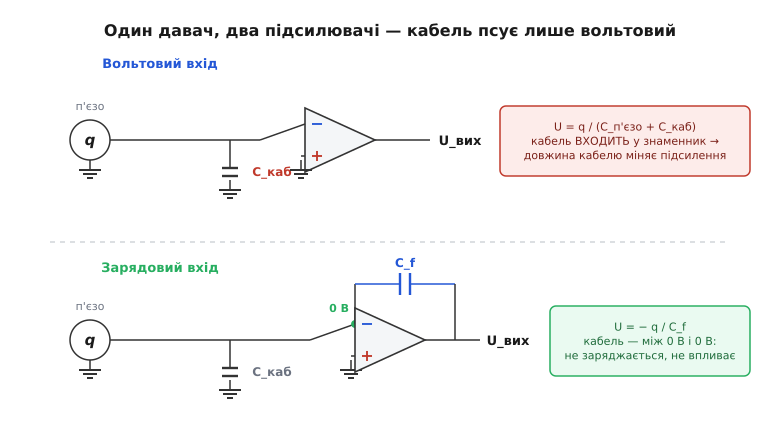
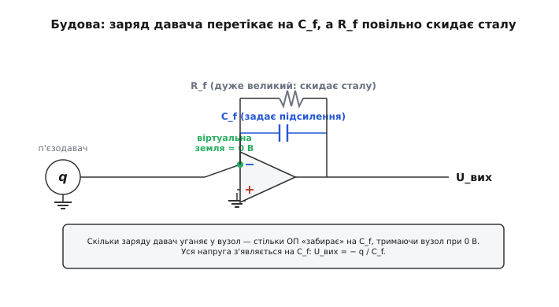
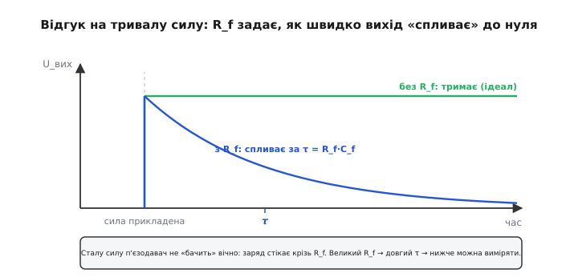

# Зарядовий підсилювач

Є цілий клас давачів, які віддають не напругу й не струм, а **заряд**. Стиснули кварцову пластинку — вона виштовхнула на свої грані крихітну порцію електронів, пропорційну до сили. Відпустили — заряд повернувся. Такий давач — це не батарейка з певною напругою, а радше **насос заряду**: він знає, *скільки* заряду виштовхнути, але напруга, яка при цьому виникне, залежить від того, на яку ємність цей заряд потрапить. І ось тут починається проблема, заради якої й вигадали зарядовий підсилювач.

Уявіть п'єзоелектричний [давач](root:hw-sensing/piezoelectric-transducer) на двигуні й двометровий кабель до приладу. Давач виштовхнув заряд q. Цей заряд розмазався по власній ємності давача й по ємності кабелю — а напруга, яку ви виміряєте, дорівнює `q` поділити на суму цих ємностей. Замінили кабель на довший — ємність зросла, напруга на тому самому заряді **впала**. Той самий удар по давачу дає різні покази лише тому, що ви переклали проводку. Для вимірювального приладу це катастрофа: чутливість «гуляє» від монтажу.

Зарядовий підсилювач (англ. *charge amplifier* — буквально «підсилювач заряду», хоча насправді це перетворювач заряду на напругу) усуває цю залежність раз і назавжди. Він робить хитру річ: тримає вхід давача при **нулі вольтів** і змушує весь заряд перетекти на один-єдиний, точно відомий конденсатор. Тоді вихідна напруга визначається лише цим конденсатором — а ні кабель, ні власна ємність давача в неї більше не входять. Розберімо, як саме це досягається й чому це працює.

## Чому напруга на п'єзодавачі — ненадійна величина

Спершу треба чітко побачити, з чим маємо справу. П'єзоелектрична пластинка — це, по суті, **конденсатор із вбудованим джерелом заряду**. Деформація вштовхує в неї заряд q (кулони), а сама пластинка має власну ємність C_давача (між своїми гранями). Якщо більше нікуди заряду подітися, він сяде на цю ємність і дасть напругу:

```
U = q / C_давача
```

Це й була б наша корисна величина — та сама напруга, яку «вольтовий» підхід намагається виміряти буфером із дуже високим вхідним опором. Біда в тому, що **кабель теж має ємність** — десятки пікофарад на метр, — і вона під'єднана паралельно до ємності давача. Заряду однаково, де сидіти, тож він розподіляється по всьому, що бачить:

```
U = q / (C_давача + C_кабелю + C_входу)
```

Заряд q від сили не змінився — а напруга впала, бо знаменник виріс. Звідси два болючі наслідки. По-перше, **чутливість залежить від довжини кабелю**: помінявши метровий кабель на трьохметровий, ви тихо змінили калібрування приладу. По-друге, ємність кабелю **пливе** — від температури, від згину, від руху, — і разом із нею пливе чутливість. Вимірюєш силу, а насправді міряєш ще й те, як сьогодні лежить провід.

> 🔧 **Навіщо це.** На реальному стенді давач і прилад майже ніколи не стоять поряд: акселерометр — на вібростолі, прилад — у стійці за кілька метрів; давач тиску в горінні двигуна — а підсилювач у безпечному місці. Якби чутливість залежала від кабелю, кожну заміну проводки доводилося б перекалібровувати, а будь-який рух кабелю забруднював би сигнал. Зарядовий підхід дозволяє тягнути **довгі кабелі** й не думати про їхню ємність — саме тому вся індустріальна п'єзовимірювальна техніка побудована на ньому.


*Угорі — вольтовий вхід: ємність кабелю входить у знаменник, тож довжина проводу міняє підсилення. Унизу — зарядовий вхід: вузол давача утримано при нулі вольтів, ємність кабелю стоїть між нулем і нулем, не заряджається й на результат не впливає. Уся напруга народжується на зворотному конденсаторі C_f.*

## Головна ідея: тримати вхід при нулі й перелити заряд на свій конденсатор

Що, якби ми **не дозволили** напрузі на давачі рости взагалі? Якби вузол, до якого під'єднано давач, силоміць тримався при нулі вольтів, то ємність кабелю, що висить між цим вузлом і землею, опинилася б **між нулем і нулем**. На ній нема різниці потенціалів — отже, вона не набирає заряду й узагалі випадає з гри. Те саме з власною ємністю давача. Заряд, який давач виштовхує, не має куди сісти всередині — і мусить кудись піти. Якщо єдиний шлях для нього — на наш власний, заздалегідь відомий конденсатор, то напруга з'явиться **тільки** на ньому, за нашими правилами.

Саме це й робить зарядовий підсилювач. Він складається з [операційного підсилювача](root:hw-analog/ideal-opamp) та конденсатора C_f, увімкненого в зворотний зв'язок — від виходу назад на інвертувальний вхід. П'єзодавач під'єднано до того ж інвертувального входу, а неінвертувальний вхід посаджено на землю.

Тепер працює фундаментальна властивість операційного підсилювача з негативним зворотним зв'язком: він робить усе можливе, щоб напруга на його двох входах **зрівнялася**. Це називають [віртуальною землею](root:hw-analog/virtual-ground) — інвертувальний вхід «притягнуто» до того ж потенціалу, що й заземлений неінвертувальний, тобто до нуля, хоча гальванічно з землею він не з'єднаний. Підсилювач домагається цього, гойдаючи свій вихід: щойно давач виштовхне заряд і спробує підняти напругу на вузлі, підсилювач опускає вихід рівно настільки, щоб **стягнути** цей заряд на C_f і повернути вузол до нуля.

Виходить акуратний баланс заряду. Скільки кулонів давач уганяє у вузол — стільки ж підсилювач мусить «прийняти» на конденсатор C_f, аби втримати вузол при нулі. А заряд на конденсаторі та напруга на ньому пов'язані просто: `q = C · U`. Раз увесь заряд давача q опинився на C_f, напруга на C_f дорівнює `q / C_f`. Один кінець C_f сидить на віртуальній землі (нуль), отже інший кінець — вихід підсилювача — стоїть рівно на цій напрузі. З урахуванням того, що підсилювач інвертує:

```
U_вих = − q / C_f
```

Ось і вся серцевина. Вихідна напруга пропорційна заряду давача, а коефіцієнт задає **один конденсатор** — той, що ми самі поставили й значення якого точно знаємо. Ані ємність кабелю, ані ємність давача в цю формулу **не входять**. Проблема, з якої ми почали, зникла.


*Інвертувальний вузол утримано при нулі (віртуальна земля). Заряд давача змушений перетекти на зворотний конденсатор C_f — на ньому й народжується вся вихідна напруга U_вих = − q / C_f. Великий зворотний резистор R_f увімкнено паралельно до C_f, щоб дати сталій складовій повільно стікати й не давати виходу «вповзти» в насичення.*

## Чому це працює: погляд через закон збереження заряду

Варто на мить затриматися на тому, *чому* заряд обов'язково йде саме на C_f, а не розтікається абикуди — бо в цьому вся суть. Інвертувальний вхід ідеального операційного підсилювача струму **не бере** (його вхідний опір величезний). Отже, до вузла віртуальної землі сходяться лише два шляхи для заряду: від давача й через C_f. Закон збереження заряду в цьому вузлі невблаганний: скільки втекло одним шляхом, стільки прийшло іншим. Якщо давач вштовхнув +q, то рівно −q мусило прийти з боку C_f — інакше на вузлі накопичився б заряд і його напруга зрушила б з нуля, а підсилювач цього не допускає.

Тому ємність кабелю, хоч і висить на тому самому вузлі, **не краде** заряд: щоб узяти заряд, на ній мала б з'явитися напруга, а вузол тримається при нулі. Конденсатор без напруги заряду не несе. Кабель присутній фізично, але електрично невидимий — він стоїть між нулем (віртуальна земля) і нулем (справжня земля).

Аналогія: уявіть вузький жолоб, рівень води в якому насос-регулятор тримає **строго на нулі**, негайно відкачуючи все, що надходить, у мірний бак. Скільки б води давач не підлив у жолоб, рівень не підніметься — уся вода опиниться в баку, і ви прочитаєте об'єм там. Бічні кишені жолоба (ємність кабелю) могли б набрати води, лише якби рівень піднявся, — але він не піднімається, тож кишені лишаються порожні й на показ бака не впливають. Аналогія ламається в одному: справжня вода тече сама під дією тяжіння, а тут заряд «відкачує» активний підсилювач, і робить він це лише доти, доки має запас вихідної напруги й швидкості; вичерпався запас — баланс порушиться (про це нижче).

**Worked-приклад: яку напругу дасть удар по акселерометру.** Візьмемо п'єзоелектричний [акселерометр](root:hw-sensing/accelerometer) із чутливістю 5 пКл на кожен g прискорення (типова величина для давача на заряд). Хочемо, щоб на виході виходило 100 мВ на g. Який поставити C_f?

```
Чутливість виходу:  S_U = q_на_g / C_f
Хочемо:             0.100 В/g = 5e-12 Кл/g / C_f
Звідси:             C_f = 5e-12 / 0.100
                    C_f = 50e-12 Ф = 50 пКл... → 50 пФ
```

Тобто 50 пФ у зворотному зв'язку дають 100 мВ/g. А тепер ключове: підвісьте давач хоч на 5-метровий кабель із ємністю 500 пФ — чутливість **не зміниться**, бо C_кабелю у формулу не входить. Перевіримо це обчислення в коді, як його робив би прошивковий калькулятор налаштувань:

```c
// Підбір зворотного конденсатора зарядового підсилювача.
// q_per_unit — заряд давача на одиницю вимірюваної величини, Кл.
// out_per_unit — бажана вихідна напруга на ту саму одиницю, В.
// Результат — ємність C_f у фарадах.
float charge_amp_cf(float q_per_unit, float out_per_unit)
{
    return q_per_unit / out_per_unit;     // C_f = q / U_вих
}
// charge_amp_cf(5.0e-12f, 0.100f) -> 50e-12 Ф (50 пФ), незалежно від кабелю
```

Зверніть увагу на красу інверсії: щоб зробити підсилювач **чутливішим** (більше вольтів на той самий заряд), C_f треба **зменшувати**. Маленький конденсатор — велике підсилення. Це протилежно інтуїції «більше — сильніше», але прямо випливає з `U = q / C`.

## Сталу силу втримати не вдасться: зворотний резистор і час стікання

Досі ми мовчки припускали, що підсилювач може тримати заряд на C_f скільки завгодно довго. На жаль, ні — і причина в тому, що **жоден конденсатор не ідеальний, і жоден підсилювач теж**. Інвертувальний вхід операційного підсилювача все ж бере крихітний струм зміщення (вхідний струм спокою), та й сам C_f трохи підтікає. Цей паразитний струм нема куди дівати, окрім як заряджати C_f — і вихід поволі «вповзає» до однієї з шин живлення, аж поки не впреться в неї й підсилювач не «осліпне». Лишиш такий підсилювач надовго — і він сам собою заїде в насичення, ще до будь-якого корисного сигналу.

Тому паралельно до C_f завжди ставлять **зворотний резистор R_f** — дуже великий, типово від сотень мегаомів до сотень гігаомів. Він дає накопиченому заряду повільно стікати, утримуючи робочу точку виходу десь посередині. Але задарма нічого не буває: цей самий резистор **стікає й корисний заряд** від давача. Пара R_f і C_f утворює сталу часу:

```
τ = R_f · C_f
```

За цей час відгук на раптову, а потім сталу силу спадає в e разів (приблизно до 37 % від початкового). Тобто зарядовий підсилювач — це, по суті, **давач змін**: швидку подію він передає чесно, а от справді статичну силу «забуває» зі сталою часу τ. Це принципова межа, а не дефект складання: п'єзоелектрика з резистивним скиданням не вміє міряти строго постійну величину.


*Сила прикладена в певний момент і далі стала. В ідеалі (без R_f) вихід стрибнув би й тримався. З реальним R_f він стрибає, а тоді експоненційно «спливає» до нуля зі сталою часу τ = R_f·C_f. Чим більший R_f, тим довша τ і тим нижчі частоти можна виміряти.*

Звідси — компроміс проєктування. Хочеш міряти **повільні** процеси (низькі частоти) — бери R_f якомога більшим, щоб τ була довгою. Платиш за це двома речами. По-перше, велетенський резистор сам по собі шумить і чутливий до **струмів витоку** по платі: бруд, флюс чи волога створюють паралельний шлях, не гірший за сам R_f, і «з'їдають» заряд. По-друге, чим більший R_f, тим помітніша похибка від вхідного струму зміщення: цей струм, помножений на R_f, дає сталий зсув на виході (дрейф), який із нагріванням ще й росте. Тому в зарядових підсилювачах ставлять операційні підсилювачі з **мізерним вхідним струмом** — польові (JFET- чи CMOS-вхід), а навколо інвертувального вузла на платі роблять [охоронне кільце](root:hw-analog/driven-shield-and-triax) й дбають про чистоту, щоб витоки не зіпсували те, заради чого все затівалося.

> 🔧 **Навіщо це.** Вибір R_f — це пряме рішення «яку найнижчу частоту я хочу бачити». Для вібродіагностики двигуна, де цікаві десятки й сотні герців, вистачить помірного R_f і короткої τ — заразом і дрейф менший. Для давача тиску, де подія триває секунди, R_f беруть гігаомним, миряться з вищим дрейфом і ретельно відмивають плату. Розуміючи τ = R_f·C_f, ви свідомо ставите межу свого приладу знизу, а не отримуєте її випадково.

## Чим це відрізняється від звичайного підсилювача напруги

Корисно поставити зарядовий підсилювач поряд із двома сусідами, щоб межі стали різкими.

**Проти буфера напруги.** «Вольтовий» спосіб — поставити поруч із давачем повторювач напруги з надвисоким вхідним опором і виміряти `q / C_давача`. Він простіший і не потребує гігаомних резисторів, але приречений на залежність від ємності кабелю: давач і підсилювач доводиться тримати **майже впритул**, аби кабель не зіпсував чутливість. Зарядовий спосіб дозволяє рознести їх далеко. Грубо кажучи: вольтовий вхід міряє **напругу** на давачі (а вона залежить від усіх ємностей), зарядовий — **заряд** (а він не залежить ні від чого, окрім самої деформації).

**Проти трансімпедансного підсилювача.** Близький родич — [трансімпедансний підсилювач](root:hw-analog/transimpedance-amplifier), що перетворює вхідний **струм** на напругу через зворотний **резистор** (`U = −I·R`). Схема — та сама віртуальна земля на інвертувальному вході, та сама ідея «не дати напрузі вузла зрушити». Різниця лише в тому, що в зворотному зв'язку: резистор перетворює сталий струм, конденсатор — накопичений заряд. Власне, заряд — це проінтегрований струм (`q = ∫I dt`), і конденсатор у зворотному зв'язку якраз **інтегрує** вхідний струм. Тому зарядовий підсилювач можна чесно назвати [інтегратором](root:hw-analog/integrator-differentiator) струму давача: він збирає всі електрони, що приходять, і показує їх сумарну кількість. Це й пояснює, чому він так природно пасує до п'єзодавача, який віддає саме порцію заряду на кожну зміну сили.

З цього кута зрозуміла й роль R_f: чистий інтегратор без скидання набирав би будь-який, навіть найдрібніший сталий струм у нескінченність, тож R_f перетворює ідеальний інтегратор на **«протікаючий»** — він інтегрує швидкі зміни, але повільно забуває старе, не даючи виходу втекти.

## Що це дає на практиці

Зберімо нитку докупи. П'єзодавач — це джерело заряду, і його корисна величина — саме заряд, а не напруга, бо напруга залежить від випадкових ємностей навколо. Зарядовий підсилювач приймає цей заряд на вузол, який сам тримає при нулі вольтів, і змушує весь заряд перетекти на один точно відомий конденсатор C_f. Через це вихід `U_вих = − q / C_f` залежить **лише** від давача й одного нашого конденсатора — кабель, хоч би який довгий, випадає з рівняння. Ціна — неможливість міряти строго сталу величину (заряд повільно стікає крізь R_f зі сталою часу τ = R_f·C_f) і потреба в підсилювачі з мізерним вхідним струмом та чистій платі без витоків.

Саме тому зарядовий підсилювач — стандартний «передпідсилювач» для всього сімейства п'єзоелектричних давачів: акселерометрів, давачів сили й тиску, гідрофонів, давачів акустичної емісії. Скрізь, де чутливий елемент віддає заряд, а прилад стоїть на відстані, на вході сигнального тракту майже напевно стоїть саме він. Народилася ця схема [наприкінці 1940-х](root:hw-analog/charge-amplifier/hist-charge-amp.md) разом із промисловою п'єзовимірювальною технікою — і відтоді її ідея не змінилася, бо змінювати в ній, по суті, нічого.
