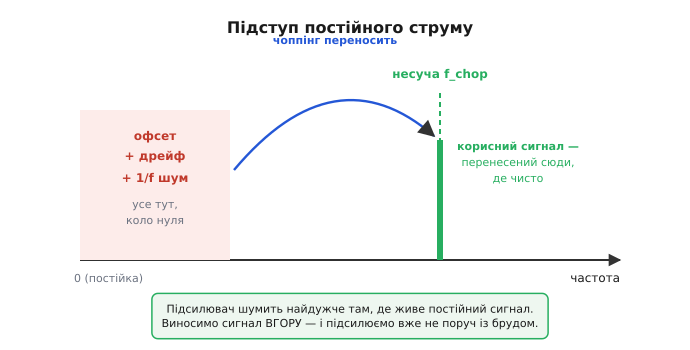
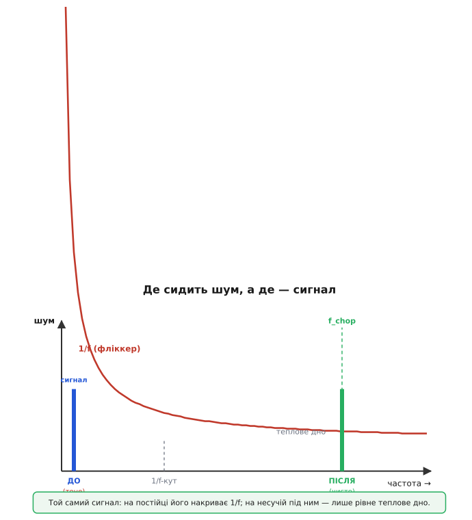
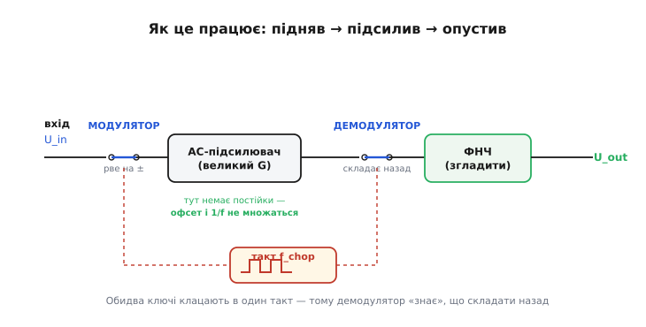
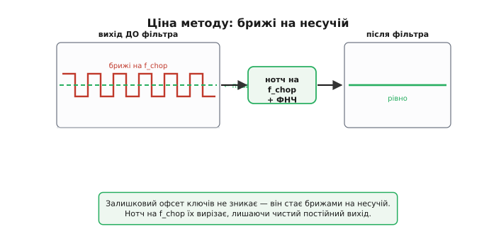

# Чопперний підсилювач: коли постійку підсилюють, перетворивши її на змінну

Уявіть, що треба підсилити термопару. Її сигнал — десятки мікровольтів, повільний, по суті постійний: гарячий спай нагрівся — напруга підросла на мікровольти за секунди. Здавалося б, став підсилювач із підсиленням тисячу — і маєш десятки мілівольтів, читай скільки хочеш. Та коли вмикаєш реальну схему, на виході не чистий рівень, а напруга, що сама собою повзе: за годину з'їхала на еквівалентні десятки мікровольтів на вході, за день — ще, на холоді — інакше, ніж у теплі. Підсилювач додав до крихітного корисного сигналу власну паразитну напругу — і вона того ж порядку, що й сам сигнал, ще й гуляє. Уся мікровольтова правда потонула.

Корінь біди в тому, що **постійний сигнал** будь-який підсилювач спотворює найгірше. Чопперний підсилювач обходить це хитрим вивертом: він **не підсилює постійку як постійку** — він спершу перетворює її на змінну, підсилює змінну (це підсилювач уміє чисто), а тоді складає назад у постійку. Звідси й назва: англ. *chop* — «рубати, кришити»; вхідний сигнал ріжуть на шматки змінного струму, ними й оперують.

> 🔧 **Навіщо це.** Це техніка для слабких повільних сигналів, де ціна питання — мікровольти: термопари, тензодавачі, струмові шунти, електроди біопотенціалів, мости давачів тиску. Там, де звичайний підсилювач своїм власним зсувом і його плавзанням забиває весь корисний сигнал, чопперний прибирає цю похибку майже в нуль — і робить вимір, що тримається роками й у будь-яку погоду. Без цього виверту прецизійної постійнострумової техніки просто не було б.

## Чому саме постійку підсилювати найважче

Щоб зрозуміти виверт, треба спершу чесно побачити ворога. У будь-якого підсилювача є дві вади, що б'ють саме по постійних і повільних сигналах, і обидві ростуть, коли частота сигналу йде до нуля.

Перша — **зсув нуля** (англ. *offset*, «зміщення»). Через те, що дві половини вхідного каскаду ніколи не однакові до останнього атома, підсилювач поводиться так, ніби на вхід йому хтось постійно подає малу напругу, якої там немає. Подай на обидва входи нуль — на виході все одно щось є. Зведений до входу, цей фальшивий сигнал — від одиниць мікровольтів у доброму підсилювачі до мілівольтів у пересічного. Для звукового чи радіосигналу байдуже: змінну складову конденсатор пропустить, а сталий зсув відріже. Але корисний сигнал термопари **сам постійний** — він невіддільний від зсуву, бо обидва живуть на тій самій «нульовій частоті». Відрізати зсув, не відрізавши сигналу, неможливо.

Друга, ще підступніша, — **дрейф** (англ. *drift*, «знесення»): той зсув не стоїть на місці, а повзе з температурою й з часом. Нагрівся корпус на десяток градусів — зсув з'їхав. Минув рік — кристал постарів, з'їхав ще. Дрейф зсуву меряють у мікровольтах на градус; у звичайного підсилювача це одиниці-десятки мкВ/°C. Для мікровольтового сигналу це катастрофа: вимір, відкалібрований уранці, по обіді вже бреше — і не тому, що змінився давач, а тому, що поплив сам підсилювач.

> Зсув, його дрейф і всі інші відхилення реального підсилювача від ідеального суматора живуть у темі [реальний операційний підсилювач](topic:hw-analog/real-opamp-limits): звідки береться вхідний зсув, чому він повзе з температурою, які ще є вхідні струми й обмеження. Тут досить знати: зсув — фальшива вхідна напруга порядку мікровольтів-мілівольтів, а дрейф — її повзання, і обидва найдужче псують саме постійні сигнали.

До цих двох додається третій, окремий гравець — **фліккер-шум**, або шум типу 1/f (англ. *flicker* — «мерехтіння»). Це власний шум підсилювача, чия особливість у тому, що його щільність **росте, коли частота падає**: на високих частотах його майже немає, а ближче до постійки він здіймається тим вище, чим повільніший сигнал. Виходить, у найгіршому для нас місці — на низьких частотах, де живе повільний корисний сигнал, — шум підсилювача саме найбільший.

Складімо три факти докупи. Зсув, дрейф і фліккер — усі троє чатують **унизу частотного діапазону, біля нуля**. А наш корисний сигнал, на лихо, сидить рівно там. Підсилювати його там, де він є, — означає підсилювати разом із ним усю цю мерзоту. Звідси й народжується ідея: **а що, якби сигнал звідти забрати?**


*Уся «брудна» частина — зсув, його дрейф і фліккер-шум — живе коло нульової частоти. Чоппінг переносить корисний сигнал угору, на несучу частоту, і підсилює його вже там, подалі від бруду.*

## Виверт: підняти сигнал туди, де чисто

Ось серцевина методу, і її варто прожити повільно, бо вона напрочуд красива.

Зсув і дрейф підсилювача **прибиті до постійки** — вони завжди коло нуля. Корисний же сигнал ми можемо **пересунути куди завгодно по частоті**, якщо схитруємо. Тож зробімо так: на вході швидко-швидко перемикаймо полярність сигналу — раз пряма, раз обернена, раз пряма, раз обернена, тисячі разів на секунду. Що вийде? Сталий вхід (наша постійка) обернеться на **меандр** — прямокутну змінну напругу частотою перемикання. Корисний постійний сигнал ми тим самим **підняли на несучу частоту** (англ. *carrier* — «носій»): тепер уся його енергія сидить не на нулі, а на частоті чоппінга та її гармоніках.

Це й називають **модуляцією** — перенесенням повільного сигналу на високу несучу. Тепер дивовижне: ведімо цей меандр у підсилювач. Підсилювач помножить **усе** — і корисний меандр на несучій, і свій зсув із дрейфом на нулі. Але ці двоє тепер **на різних частотах**. Корисне — нагорі, на несучій. Зсув і фліккер — унизу, коло нуля, де й були. Уперше за всю історію їх можна **розділити**, бо вони більше не накладені одне на одне.


*Той самий корисний сигнал у двох місцях. На постійці (ліворуч) його накриває фліккер-шум, що здіймається до 1/f-кута. На несучій (праворуч) під сигналом — лише рівне теплове дно: тут підсилювати чисто.*

Лишилося складене розібрати назад. Після підсилення робимо **те саме перемикання полярності, у той самий такт** — і корисний меандр «розгортається» назад у постійку: де ми перевернули на вході, там перевертаємо й на виході, і два перевороти один одного гасять — сигнал випрямляється у свій початковий сталий рівень, тільки вже в G разів більший. А зсув і фліккер підсилювача, що сиділи на постійці, **це друге перемикання навпаки підіймає на несучу** — і відносить геть від корисного сигналу. Тепер його легко відрізати простим фільтром низьких частот: корисне — внизу, паразитне — вгорі.

Це перетворення назад зветься **демодуляцією** (повернення сигналу з несучої вниз) і працює лише тому, що обидва перемикачі клацають **синхронно, в один такт від спільного генератора**. Демодулятор «знає», коли модулятор перевернув сигнал, і перевертає рівно тоді ж — тому й складає правильно. Звідси й важлива назва прийому: **синхронне детектування**. Підсилюється все, але назад у постійку складається **тільки те, що клацало в такт із генератором**. Усе, що в такт не клацало, — зсув, дрейф, фліккер, випадкові наводки — лишається нагорі й відсіюється. Вийшов фільтр такої гостроти, якої простими RC-ланками не зробиш: він пропускає лише сигнал, синхронний із власним тактом, і глухий до решти.


*Сигнал проходить тракт зліва направо: модулятор-ключ ріже постійку на змінну, AC-підсилювач множить її без свого зсуву, демодулятор-ключ у той самий такт складає назад у постійку, фільтр згладжує. Обидва ключі веде спільний тактовий генератор.*

## Ключі замість контактів: чим «рубають» сигнал

У першому чопперному підсилювачі кінця 1940-х це перемикання робив справжній механічний вібратор — електромагнітна пластинка, що з гулом торгала контакти сотні разів на секунду, по черзі замикаючи то прямий, то обернений вхід. Звідти й слово «чоппер» дослівно: щось, що фізично рубає. Те громіздке гудюче залізо стояло в перших аналогових обчислювачах і прецизійних приладах — і працювало, бо механічний контакт майже не має власного зсуву: замкнув — провід, розімкнув — розрив, жодної фальшивої напруги він не додає.

Сьогодні роль «рубача» грають **польові транзистори-ключі** (MOSFET): крихітні перемикачі всередині мікросхеми, що замикаються й розмикаються мільйони разів на секунду без жодного зносу й гулу. Принцип той самий, що в механічного вібратора, тільки перемикання тепер тверде, швидке й вічне.

> Як саме польовий транзистор працює ключем — чому в провідному стані він майже як шматок дроту з малим опором, а в закритому майже не пропускає струму, і чому це робить його ідеальним «рубачем» для чоппінга — у темі [польовий транзистор як ключ](topic:hw-components/mosfet-switch). Тут досить образу: керована напругою перемичка, що чисто замикає й розмикає коло.

Те, що ключ майже не має власного зсуву, — це і є ключова перевага: модулятор і демодулятор самі **не додають похибки**, яку ми так старанно виганяємо з підсилювача. Якби перемикачі мали свій зсув, уся затія втратила б сенс. Тому весь зсув і дрейф у чопперному тракті визначає **не підсилювач** (його похибку ми винесли на несучу й відфільтрували), а **досконалість самих ключів** — а вона дуже висока.

## Чим за це платять: брижі та обмежена смуга

Краси без ціни не буває, і чесна стаття мусить показати, де метод кусає.

Перше — **залишкові брижі** (англ. *ripple*) на виході. Реальний ключ не ідеальний: щоразу, коли польовий транзистор перемикається, він кидає в коло крихітний пакет заряду — це зветься **інжекцією заряду** (англ. *charge injection*). Ці мікроскопічні поштовхи стаються рівно в такт із чоппінгом, тож вони складаються в **залишкову напругу на несучій частоті**, що просочується на вихід дрібною пилкою. Парадокс: метод, що вбиває зсув підсилювача, лишає по собі власний маленький зсув від перемикання. Його, на щастя, теж можна прибрати — він на чітко відомій частоті несучої, тож його вирізають **нотч-фільтром** (вузькою режекторною ланкою, налаштованою точно на f_chop) або петлею гасіння брижів. Сучасні мікросхеми роблять це всередині, і назовні брижі вже придушені.


*Інжекція заряду ключів дає на виході дрібні брижі на частоті чоппінга (ліворуч). Нотч-фільтр, налаштований точно на f_chop, плюс фільтр низьких частот вирізають їх — і лишається рівний постійний вихід (праворуч).*

> Як режекторна ланка вирізає одну вузьку частоту, майже не чіпаючи решти — і чому це саме те, що треба для брижів на несучій, — у темі [режекторний (нотч) фільтр](topic:hw-analog/notch-filter). Тут досить ідеї: фільтр-«яма», прозорий усюди, крім однієї частоти, де глибоко глушить.

Друге — **обмежена смуга**. Сигнал доводиться переносити на несучу й назад, а несуча сама має бути набагато вища за корисні частоти, інакше складати назад нема як без спотворень. Тому чопперний підсилювач — інструмент для **повільних** сигналів: постійки й низьких частот, добре нижчих за частоту чоппінга. Для мегагерців він не годиться: там сигнал швидший за саме «рубання». Це не вада, а межа призначення — чопперний живе там, де треба не швидкість, а **бездоганна точність на постійці**.

## Скільки це в числах

Абстракція стає відчутною, щойно підставити реальні цифри сучасної мікросхеми та порівняти з тим, що дав би звичайний підсилювач у тій самій задачі.

**Вимір термопари типовим і чопперним підсилювачем.** Термопара віддає корисний сигнал близько 40 мкВ на кожен градус різниці спаїв; підсилення тракту — 100; за зміну температура в кімнаті з приладом гуляє на 15 °C. Порахуймо похибку від самого підсилювача, зведену до входу, для двох варіантів.

```
Звичайний прецизійний підсилювач:
  зсув               U_os  ≈ 100 мкВ
  дрейф зсуву        TC    ≈ 1 мкВ/°C
  похибка від дрейфу = TC · ΔT = 1 · 15 = 15 мкВ
  разом на вході     ≈ 100 + 15 = 115 мкВ
  у градусах         115 / 40 ≈ 2.9 °C  ← брехня майже на три градуси!

Чопперний (zero-drift) підсилювач:
  зсув               U_os  ≈ 10 мкВ
  дрейф зсуву        TC    ≈ 0.05 мкВ/°C
  похибка від дрейфу = 0.05 · 15 = 0.75 мкВ
  разом на вході     ≈ 10 + 0.75 ≈ 10.8 мкВ
  у градусах         10.8 / 40 ≈ 0.27 °C  ← десята частка градуса
```

Різниця разюча: той самий вимір, той самий давач — а похибка від підсилювача впала з майже трьох градусів до чверті градуса, **на порядок**. І, що головне, у чопперного вона майже **не повзе** з температурою: дрейф 0.05 мкВ/°C означає, що калібрування, зроблене вранці, по обіді все ще чесне. Числа взято з реальної zero-drift мікросхеми (зсув 10 мкВ, дрейф 0.05 мкВ/°C — клас, який без чоппінга недосяжний); частота чоппінга в таких приладах — десятки-сотні кілогерців, набагато вище за повільний сигнал термопари.

Ось як це виглядає у прошивці, коли тим самим АЦП міряєш напругу й переводиш у градуси. Уся принада чопперного входу в тому, що з рівняння **зникає член калібрування дрейфу**:

```c
// Термопара через чопперний (zero-drift) підсилювач, підсилення 100.
// Зсув підсилювача ~10 мкВ і майже не повзе → у код його можна НЕ заводити.
#define GAIN        100.0f      // підсилення тракту
#define UV_PER_C    40.0f       // мкВ на градус різниці спаїв (тип K, грубо)

float temperature_c(float adc_volts)
{
    // зводимо вихід назад до входу (ділимо на підсилення) → мікровольти
    float input_uv = (adc_volts / GAIN) * 1e6f;
    // напряму в градуси: зсувом і дрейфом нехтуємо — чоппер прибрав їх за нас
    return input_uv / UV_PER_C;
}
```

Зі звичайним підсилювачем цей самий код довелося б рятувати: тримати в пам'яті виміряний на заводі зсув, віднімати його, а потім ще й щоразу підправляти на поточну температуру кристала за окремим температурним коефіцієнтом — інакше похибка в ті майже три градуси з'їла б увесь вимір. Чопперний вхід **викидає цю морочливу математику**: апаратура вже зробила те, що інакше довелося б латати програмою, причому зробила точніше, ніж будь-яке заводське калібрування.

## Де воно живе

Сам прийом «модулюй — підсилюй — демодулюй» ширший за один компонент. Найчастіше його зустрічають як готову начинку **операційного підсилювача з нульовим дрейфом**: чоппінг там захований усередині, а назовні — звичайні виводи, тільки зсув і дрейф на порядки менші за норму. Той самий синхронний детектор лежить в основі **синхронних підсилювачів** (lock-in), що витягають слабкий сигнал на відомій частоті з-під шуму, який його перевищує в рази, — у фізичних вимірах, оптиці, спектроскопії. І той самий виверт працює в багатьох давачах, де треба вловити крихітну повільну зміну: мостах тиску, магнітометрах, ваговимірювальних шкалах.

> Як саме чоппінг убудовують в операційний підсилювач, чим він відрізняється від спорідненого прийому самокалібрування (auto-zero), і яку реальну мікросхему взяти — у темі [операційний підсилювач із нульовим дрейфом](topic:hw-analog/auto-zero-opamp). Там же — історія Голдберга й перших вібраторних чопперів. Тут ми розбирали сам прийом як спосіб оброблення сигналу; там — його втілення в конкретному компоненті.

Спільне в усіх застосуваннях одне, і його варто закарбувати як суть теми. Звичайний підсилювач **бореться** зі своїм зсувом і дрейфом — їх трудно вибирають, калібрують, термостатують, і все одно лишається хвіст. Чопперний **обходить** їх зовсім: він не намагається зробити підсилювач ідеальним на постійці — він просто **прибирає сигнал звідти, де підсилювач поганий, у те місце, де він гарний**, а тоді повертає назад. Не виправлення вади, а зміна задачі так, щоб вади не було де проявитися. У цьому й уся краса.
