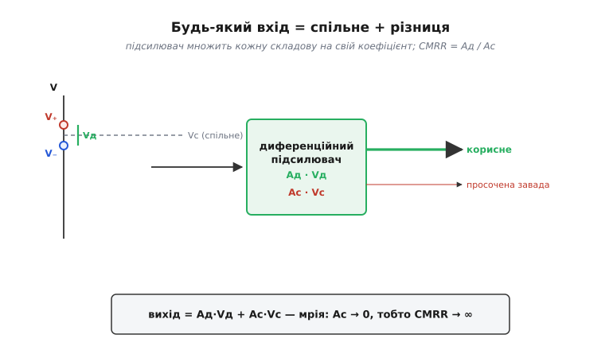
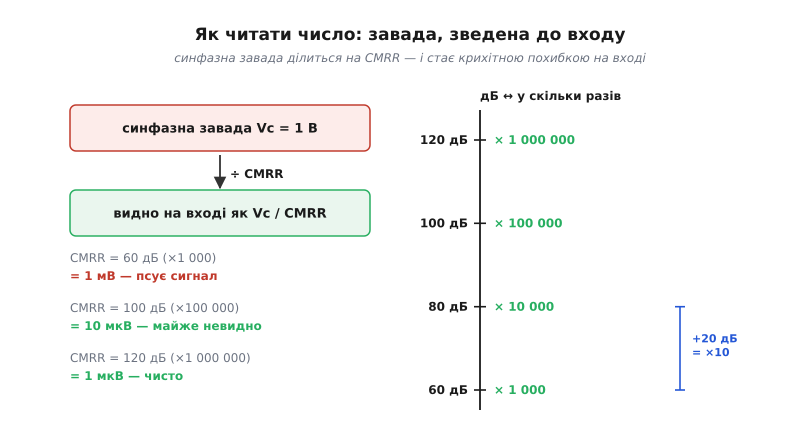
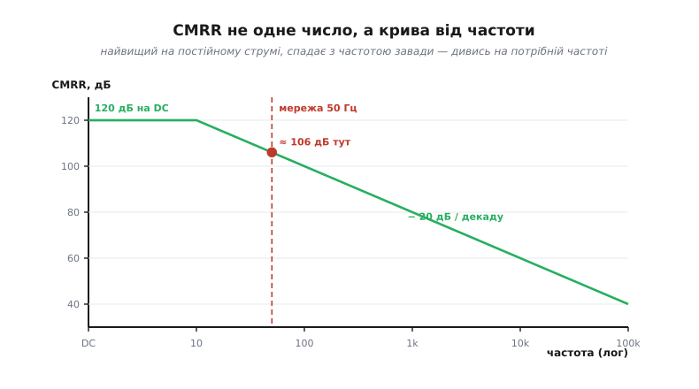

# Коефіцієнт придушення синфазного сигналу (CMRR)

Уявіть два дроти, що тягнуться від давача до плати, а між ними живе крихітна корисна напруга — лічені мілівольти. Біда в тому, що обидва дроти водночас підняті на спільний рівень у кілька вольтів: половина живлення мостової схеми, наведена з мережі завада, «попливле» опорне. Цей спільний рівень у сотні разів більший за корисний сигнал, і він **однаковий** на обох дротах. Питання, на якому тримається вся точна аналогова техніка, звучить просто: як побудувати підсилювач, що бачить **різницю** двох дротів і не помічає того, що на них **спільне**? Число, яким міряють, наскільки добре це вдалося, і зветься **коефіцієнт придушення синфазного сигналу** (англ. *common-mode rejection ratio*, скорочено **CMRR**).

Слово «синфазний» (common-mode — «спільного ладу») тут — ключове. Воно описує не якийсь окремий сигнал, що ми його подаємо, а **складову** будь-якої пари напруг. Тож почнімо з того, як узагалі розкласти те, що приходить на два входи.

### Розклад: будь-який вхід — це спільне плюс різниця

Хай на двох входах підсилювача дві напруги, V₊ і V₋. Здавалося б, це просто дві незалежні величини. Та для диференційного підсилювача природніше дивитися на них інакше — розкласти на дві інші, кожна зі своїм фізичним змістом.

**Диференційна** складова (англ. *differential* — «різницева») — це їхня **різниця**, і саме в ній сидить корисна інформація:

```
Vд = V₊ − V₋
```

**Синфазна** складова — це їхнє **спільне** значення, середнє двох входів; найчастіше це і є завада чи п'єдестал:

```
Vс = (V₊ + V₋) / 2
```

Будь-яку пару входів можна точно скласти назад із цих двох частин. Якщо обидва дроти піднялися на 1 В, а корисної різниці немає — це чисто синфазний сигнал. Якщо один піднявся на 5 мВ, а другий на стільки ж опустився — це чисто диференційний. У житті завжди є й те, й інше водночас: маленька різниця, що гойдається на великому спільному тлі.


*Дві вхідні напруги зручно бачити як спільний п'єдестал Vс і різницю Vд, що сидить на ньому. Диференційний підсилювач мав би помножити лише різницю; усе спільне — викинути. Наскільки чисто він це робить, і каже CMRR.*

Тепер мету видно ясно. Хороший підсилювач для двох дротів має **велике** підсилення для різниці й **нульове** — для спільного. Реальний так не вміє: він підсилює обидві складові, кожну зі своїм коефіцієнтом. Назвемо їх **Aд** (диференційне підсилення) і **Aс** (синфазне підсилення). Тоді вихід чесно описується одним рядком:

```
Vвих = Aд·Vд + Aс·Vс
```

Перший доданок — те, заради чого все робиться. Другий — паразитна цівка завади, що просочилася на вихід. Ідеал — Aс = 0; реальність — Aс маленьке, але **ненульове**.

### CMRR — це відношення двох підсилень

CMRR і є мірою того, наскільки сильніше схема реагує на корисну різницю, ніж на спільну заваду — тобто просто відношення двох підсилень:

```
CMRR = Aд / Aс          (у разах)
```

Що більше це число, то краще. Велике Aд і крихітне Aс дають велике CMRR — і означають, що з виходу майже зник усе, що було однакове на входах. Якби Aс дорівнювало нулю, CMRR було б нескінченним: підсилювач взагалі не помічав би спільного. Так не буває, але прагнуть саме туди.

Тут варто відразу зняти одне непорозуміння. CMRR — це не «скільки завади на виході», а **відношення**, властивість самого підсилювача, не залежна від того, велика чи мала завада на вході. Це як ККД двигуна: він каже, яка **частка** входу марнується, а не скільки палива ви залили. Тому CMRR можна заздалегідь записати в характеристиці приладу — це його паспортна чеснота, а вже скільки завади просочиться на конкретному стенді, рахується множенням цієї чесноти на реальну заваду.

> 🔧 **Навіщо це.** CMRR — перше число, на яке дивляться, обираючи підсилювач для давача: тензоміст, термопара, шунт струму, електроди ЕКГ. Усі вони дають слабку різницю на тлі великого спільного, і саме CMRR вирішує, чи побачите ви корисний сигнал, чи його затопить завада. Низький CMRR не «трохи погіршує» вимірювання — він може зробити його взагалі неможливим.

### Децибели: чому число завжди велике й логарифмічне

Хороший CMRR — це десятки й сотні тисяч разів, а буває й мільйон. Возитися з такими числами незручно, тому CMRR майже завжди подають у [децибелах](topic:hw-analog/decibels) — логарифмічній шкалі, що стискає величезний діапазон у дві-три цифри:

```
CMRR(дБ) = 20·log₁₀(Aд / Aс)
```

Коефіцієнт перед логарифмом тут саме **20**, а не 10, бо CMRR — це відношення двох **амплітуд** напруги, а не потужностей; для амплітуд децибел означають через 20·log₁₀. Звідси випливає правило, яке варто закарбувати: **кожні +20 дБ — це рівно вдесятеро краще придушення**. Тому різниця між приладом на 80 і на 100 дБ — не «на чверть краще», а **в десять разів** чистіше відкинута завада.

```
   60 дБ  →  у 1 000 разів
   80 дБ  →  у 10 000 разів
  100 дБ  →  у 100 000 разів
  120 дБ  →  у 1 000 000 разів
```

Тримати ці кілька опорних точок у голові варто, щоб миттєво читати характеристику: побачив «100 дБ» — одразу знаєш, що спільне придушене в сто тисяч разів, без щоразового піднесення десятки до степеня.

### Як перевести CMRR на корисні величини

Саме число в децибелах ще нічого не каже про те, чи вистачить його для вашої задачі. Щоб відповісти, заваду **зводять до входу**: питають, якою еквівалентною помилкою на вході обернеться синфазна завада, пройшовши крізь придушення. А зведена до входу помилка — це просто завада, поділена на CMRR (у разах):

```
Vпомилка(вх) = Vс / CMRR
```

Логіка проста. Синфазна завада Vс дає на виході Aс·Vс. Якби та сама добавка прийшла на вхід уже як корисна різниця, на виході вона дала б Aд·Vпомилка. Прирівнявши вихідні внески, дістаємо Vпомилка = Vс·(Aс/Aд) = Vс/CMRR. Тобто CMRR прямо каже, у скільки разів зменшиться завада, перш ніж стане нерозрізненною від корисного сигналу.


*Щоб зрозуміти, чи досить даного CMRR, заваду зводять до входу: ділять на CMRR. Той самий 1 В завади при 60 дБ дає 1 мВ похибки (псує сигнал), а при 120 дБ — лише 1 мкВ (чисто). Праворуч — драбина: кожні +20 дБ — це ще десятикратне придушення.*

Доведемо це до живого числа.

**Скільки завади просочиться: 1 В синфазного при CMRR = 100 дБ.** Давач дає корисні 10 мВ; на обидва дроти навелася синфазна завада 1 В; підсилювач має CMRR = 100 дБ.

```
CMRR(дБ) = 100  →  у разах: 10^(100/20) = 10⁵ = 100 000
Vпомилка(вх) = 1 В / 100 000 = 10 мкВ = 0.01 мВ
частка від корисного: 0.01 мВ / 10 мВ = 0.1 %
```

Завада в сто разів більша за сигнал обернулася на похибку в одну тисячну від нього — її практично не видно. А якби CMRR був жалюгідні 40 дБ (у 100 разів), та сама завада дала б 1 В / 100 = 10 мВ — рівно стільки ж, скільки корисний сигнал, і вимірювання було б знищене. Ось ціна кожних 20 дБ.

У прошивці це зведення — кілька рядків. Перевести паспортні децибели в реальну похибку на вході корисно прямо в коді, коли рахуєте бюджет точності каналу:

:::tabs
```c
#include <math.h>

// Похибка на вході (В) від синфазної завади vcm (В)
// за паспортного cmrr_db (дБ).
float cm_error_input(float vcm, float cmrr_db) {
    float ratio = powf(10.0f, cmrr_db / 20.0f);  // дБ → у разах
    return vcm / ratio;                          // зведена до входу завада
}

// Приклад: 1 В синфазного, CMRR = 100 дБ
// cm_error_input(1.0f, 100.0f) -> 1.0e-5 В = 10 мкВ
```
```python
import math

# Похибка на вході (В) від синфазної завади vcm (В)
# за паспортного cmrr_db (дБ).
def cm_error_input(vcm, cmrr_db):
    ratio = 10.0 ** (cmrr_db / 20.0)  # дБ → у разах
    return vcm / ratio                # зведена до входу завада

# Приклад: 1 В синфазного, CMRR = 100 дБ
# cm_error_input(1.0, 100.0) -> 1e-05 В = 10 мкВ
```
```js
// Похибка на вході (В) від синфазної завади vcm (В)
// за паспортного cmrrDb (дБ).
function cmErrorInput(vcm, cmrrDb) {
  const ratio = 10 ** (cmrrDb / 20);  // дБ → у разах
  return vcm / ratio;                 // зведена до входу завада
}

// Приклад: 1 В синфазного, CMRR = 100 дБ
// cmErrorInput(1.0, 100.0) -> 1e-5 В = 10 мкВ
```
```go
package main

import "math"

// Похибка на вході (В) від синфазної завади vcm (В)
// за паспортного cmrrDB (дБ).
func cmErrorInput(vcm, cmrrDB float64) float64 {
	ratio := math.Pow(10, cmrrDB/20) // дБ → у разах
	return vcm / ratio               // зведена до входу завада
}

// Приклад: 1 В синфазного, CMRR = 100 дБ
// cmErrorInput(1.0, 100.0) -> 1e-05 В = 10 мкВ
```
:::

> 🔧 **Навіщо це.** Зведення завади до входу — головний практичний прийом із CMRR. Воно ставить характеристику приладу й вашу реальну заваду в один ряд із корисним сигналом, і ви бачите бюджет помилки в тих самих мілівольтах, що й корисне. Без цього «100 дБ» — порожня цифра; з ним — конкретні мікровольти, які або тонуть у шумі АЦП, або ні.

### Звідки CMRR береться: симетрія

CMRR — не подарунок природи, а наслідок дуже точної **симетрії** всередині підсилювача. Серце майже кожного диференційного входу — [диференційна пара](topic:hw-analog/opamp-input-stage): два однакові транзистори зі спільним «хвостом» — джерелом сталого струму. Сталий хвіст дає фіксований струм, і цей струм **ділиться** між двома транзисторами; сума завжди та сама, питання лише в тому, кому скільки дістанеться. А це залежить лише від різниці напруг на двох входах. Підняли обидва входи разом — обидва транзистори змінюють умови однаково, поділ хвоста не зрушується ні на йоту, вихід стоїть. Розійшлися входи — поділ перекосився, вихід реагує. Пара від природи бачить лише різницю — звідси й беруться високі Aд і низьке Aс.

Тримається ж усе на двох речах: на тому, що транзистори **однакові**, і на тому, що хвіст справді **сталий**. Якби замість джерела струму там стояв простий резистор, синфазний підйом обох входів **підняв** би й загальний струм — і просочився б на вихід; що «ідеальніший» хвіст (що менше він зважає на напругу на собі), то краще пара душить спільне. Саме тому пару роблять на одному кристалі, де два транзистори виходять майже близнюками, а замість резистора в хвості ставлять джерело струму. Будь-яка асиметрія — мікроскопічна різниця транзисторів, неідеальний хвіст — відкриває спільному сигналові лазівку на вихід і знижує CMRR.

Та сама думка пояснює, чому **зовнішня** схема навколо ОП теж важить. Найпростіший «віднімач» — один [операційний підсилювач](topic:hw-analog/opamp) із чотирма резисторами, [різницевий каскад](topic:hw-analog/summing-difference-amp), — у теорії має Aс = 0. Та рівно нуль виходить лише за **ідеально узгоджених** чотирьох резисторів; у житті вони з допуском, і саме розкид номіналів народжує паразитне Aс. На дорогих 0.1-відсоткових резисторах простий віднімач витискає лише близько 54 дБ — тоді як сам ОП може мати всі 120. Тобто CMRR готового вузла обмежує **найслабша** ланка симетрії: чи то спареність транзисторів усередині, чи то узгодженість резисторів зовні. Саме тому, коли потрібен по-справжньому високий CMRR, беруть не саморобний віднімач, а [інструментальний підсилювач](topic:hw-analog/instrumentation-amp), де узгодження резисторів роблять на заводі лазерним підрізанням, а вхідний каскад додає власне придушення. Звідки беруться ті 54 дБ і чому три ОП б'ють один — у [🧮 вставці про CMRR інструментального підсилювача](topic:hw-analog/instrumentation-amp/math-inamp-cmrr.md).

### CMRR — не одне число, а крива від частоти

Найпоширеніша пастка: узяти красиве «120 дБ» із першого рядка характеристики й заспокоїтися. Бо ці 120 дБ — для **постійного** й повільного сигналу. Реальний CMRR не сталий: він найвищий на нулі частоти й **спадає**, щойно частота завади росте.


*CMRR подають не одним числом, а кривою. На постійному струмі — полиця (тут 120 дБ), далі спад приблизно −20 дБ на декаду. Завада, яку треба відкинути, найчастіше — мережеві 50 Гц; саме там і треба читати CMRR, а не на красивій цифрі з постійного струму.*

Винні дві речі. Перша — власне підсилення ОП саме **падає з частотою**, а з ним меншає й диференційне Aд, тож відношення Aд/Aс погіршується. Друга — паразитні **ємності**, через які синфазний сигнал просочується на вихід в обхід симетрії; що вища частота, то легше струмові пройти крізь ємність, то більшає Aс. Разом вони й дають спад CMRR із частотою.

Для практики висновок простий і важливий. Завада, яку зазвичай треба відкинути, — це наведені з електромережі **50 Гц** (у багатьох країнах 60 Гц). Тому дивитися треба на CMRR **саме на цій частоті**, а не на постійному струмі. На характеристиці приладу для цього є крива CMRR від частоти: на нулі може стояти 120 дБ, на 50 Гц — уже, скажімо, 100, а на кілогерцах — ще менше.

**Бюджет завади на робочій частоті.** Та сама синфазна завада 1 В, але це мережеві 50 Гц, а на цій частоті прилад дає не 120, а лише 90 дБ.

```
CMRR(50 Гц) = 90 дБ  →  у разах: 10^(90/20) ≈ 31 623
Vпомилка(вх) = 1 В / 31 623 ≈ 31.6 мкВ
```

Проти 1 мкВ, який обіцяли б паспортні 120 дБ, реальна похибка на робочій частоті — понад тридцять мікровольтів, у тридцять разів гірше. Якщо корисний сигнал — десятки мікровольтів (а в електродів ЕКГ це саме так), різниця між «читати по характеристиці на DC» і «читати на 50 Гц» вирішує, працює прилад чи ні.

> 🔧 **Навіщо це.** Беручи CMRR із характеристики, завжди питайте: на **якій частоті**? Для боротьби з мережевою наводкою важливий CMRR на 50/60 Гц, а він буває на десятки децибелів нижчий за паспортний максимум на постійному струмі. Звідси й практичні наслідки: дроти від давача краще вести **витою парою** (щоб наводка лишалася справді синфазною, бо CMRR душить лише точно спільне), а саму заваду — давити ще й до підсилювача.

### Коротка історія: пара з довгим хвостом

Здатність бачити різницю й не помічати спільного народилася задовго до мікросхем — на радіолампах, у схемі, яку назвали **парою з довгим хвостом** (англ. *long-tailed pair*). Її коріння — у вимірюванні слабких біологічних сигналів, де корисне завжди тоне в наводках. Як це поняття складалося, хто додав сталий хвіст заради придушення спільного і чому в патентах поряд стоять імена з різних країн — у [📜 вставці про пару з довгим хвостом](topic:hw-analog/cmrr/hist-long-tailed-pair.md).

### На чому це тримається

CMRR — це не окремий прилад, а **число-характеристика** будь-якого диференційного вузла, від одного [ОП](topic:hw-analog/opamp) до [інструментального підсилювача](topic:hw-analog/instrumentation-amp). Воно виростає із симетрії [диференційної пари](topic:hw-analog/opamp-input-stage) всередині та з узгодженості резисторів зовні, читається в [децибелах](topic:hw-analog/decibels) і завжди залежить від частоти. А практичний бік — слабка різниця на тлі великої спільної завади (тензоміст, термопара, шунт, біопотенціали) — це і є та задача, заради якої CMRR узагалі вигадали міряти.

> 🔧 **Навіщо це.** Запам'ятайте три речі — і CMRR перестане бути загадковою цифрою. Перше: CMRR = Aд/Aс — відношення, скільки разів придушено спільне. Друге: щоб дізнатися реальну похибку, заваду **ділять на CMRR** і дивляться в мікровольтах поряд із корисним сигналом. Третє: CMRR **спадає з частотою**, тож для мережевої наводки беріть значення на 50/60 Гц, а не на постійному струмі. Цих трьох звичок вистачає, щоб не обдурити себе красивою цифрою з першого рядка характеристики.
