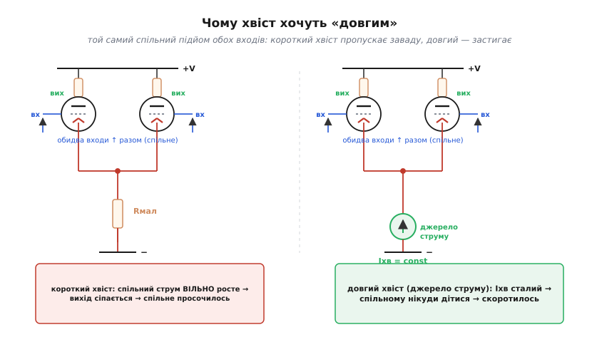

# 📜 Пара з довгим хвостом: як навчилися бачити різницю

Сьогодні диференційний вхід — настільки звична річ, що про нього не думають: відкрий будь-який операційний підсилювач, і на вході в нього сидять два однакові транзистори зі спільним «хвостом». Але цю схему не вивели з рівнянь і не вигадали для підсилювачів. Її виштовхнула цілком конкретна, майже відчайдушна потреба: почути електричний шепіт живого нерва на тлі ревіння завад. Історія пари з довгим хвостом (англ. *long-tailed pair*) — це історія про те, як інженери й фізіологи незалежно одне від одного підійшли до однієї й тієї самої ідеї, і як одна патентна заявка 1936 року виявилася корінням майже всієї подальшої аналогової техніки.

## Завдання, з якого все почалося: сигнал, що тоне

Уявіть лабораторію нейрофізіолога початку 1930-х. До препарованого нерва чи до шкіри голови підведено електроди, а з них треба зняти потенціал — справжній електричний слід роботи живої тканини. Біда в тому, що цей слід мізерний: потенціал дії нерва — це міцні десятки мілівольтів просто на мембрані, але те, що доходить до зовнішніх електродів, — уже частки мілівольта, а хвилі мозку (те, що згодом назвуть електроенцефалограмою) — лічені **мікровольти**. Підсилити таке треба в тисячі разів.

І тут вилазить підступ, який не дає просто «підсилити сильніше». Електроди ловлять не лише корисний потенціал. Вони, як дві антени, однаково ловлять усе, що наведено навколо: гул освітлювальної мережі, поля від трансформаторів, статику. Ця наведена завада на обох електродах **однакова** і в десятки разів більша за корисне. Звичайний підсилювач, який міряє напругу одного входу проти землі, підсилить усе разом — і завада затопить сигнал намертво. Прибавиш підсилення — гучнішим стане й гул.

Вихід був видний тим, хто вмів дивитися: треба підсилювати не напругу кожного електрода окремо, а **різницю** між ними. Корисний потенціал на двох електродах різний (на те він і локальна подія в тканині), а наведена завада — однакова. Якби схема брала тільки різницю, завада, що сидить порівну на обох входах, при відніманні скоротилася б сама собою, а корисна різниця лишилася. Це й є те, що пізніше назвуть придушенням синфазного сигналу (англ. *common-mode rejection*). Лишалося втілити «віднімач» на тому, що було під рукою, — на радіолампах.

> 🔧 **Навіщо це.** Та сама задача жива й досі, просто електроди стали іншими. Знімаєте ви ЕКГ, працюєте з тензомостом, міряєте струм шунтом — щоразу корисне приходить як **слабка різниця на тлі великого спільного**. Пара з довгим хвостом і її нащадки — це і є відповідь схемотехніки на цю задачу; розуміючи, звідки вона взялася, легше відчути, *чому* в неї саме така будова.

## Перші підступи: Метьюз і малюнок із помилкою

Найраніший слід схеми, дуже схожої на пару з довгим хвостом, лишив британський нейрофізіолог **Брайан Метьюз** (англ. *Bryan Matthews*) у 1934 році. Він працював у Кембриджі, у колі Едгара Едріана (англ. *Edgar Adrian*) — того самого, що отримав Нобелівську премію за дослідження роботи нейронів, — і будував апаратуру, щоб реєструвати слабкі біопотенціали. У його публікації того року креслення підсилювача містить дві лампи, чиї катоди зведено докупи, — впізнавана риса майбутньої схеми.

Цікавий нюанс, через який Метьюзові не приписують саму схему однозначно: у надрукованому кресленні, найімовірніше, була **помилка рисувальника**. За тим, як з'єднано елементи на схемі, видно — автор, схоже, мав на думці справжню пару з довгим хвостом, але опубліковане зображення цьому точно не відповідає. Тому історично коректно сказати так: Метьюз дуже близько підійшов до ідеї і, ймовірно, тримав її в голові, але документ, який можна було б назвати першим **певним** кресленням схеми, лишив не він. Це типова для історії техніки ситуація — ідея вже носиться в повітрі лабораторій, а чіткого, недвозначного першоджерела ще немає.

*Статус доказовості: усталено, що Метьюз публікував близьку схему 1934 року; теза про «помилку рисувальника» і про те, що він задумував саме пару з довгим хвостом, — обґрунтоване припущення істориків техніки, а не доведений факт.*

## Алан Блюмлайн і патент 1936 року

Перше **певне, недвозначне** креслення пари з довгим хвостом лишив зовсім не фізіолог, а інженер зі світу звукозапису — **Алан Дауер Блюмлайн** (англ. *Alan Dower Blumlein*). Заявку він подав 1936 року; патент відомий під номерами GB 482740 (британський) і US 2,185,367 (американський).

Варто на мить спинитися на самій постаті, бо навколо «національних винахідників» легко наплести міфів, а тут усе можна сказати точно. Блюмлайн народився 29 червня 1903 року в Гемпстеді (Лондон) і був британцем — англійцем за громадянством і вихованням. Його родовід змішаний і добре задокументований: батько, Семмі Блюмлайн, — народжений у Німеччині натуралізований британець із єврейським корінням по своєму батькові; мати, Джессі Дауер, — шотландка. Тобто перед нами не «німецький» і не якийсь іще винахідник за зручною етикеткою, а британський інженер зі змішаним німецько-єврейсько-шотландським родоводом — і саме так його чесно й описати.

Працював Блюмлайн на той час уже в **EMI** (англ. *Electric and Musical Industries*) — компанії, що утворилася 1931 року злиттям грамофонних фірм, куди він перейшов із Columbia Graphophone. Це важлива деталь для розуміння, **чому** саме він вивів схему до чіткого вигляду. Блюмлайн був феноменально плідним інженером звуку й телебачення: за коротке життя він набрав близько 128 патентів, серед яких — система стереозвуку (він називав її «біноуральною»; патент GB 394,325, поданий 1931 року), що й досі лежить в основі стереозапису. Людина, яка щодня воювала за чистоту звукового тракту, природно вперлася в ту саму проблему, що й фізіологи: як підсилити корисне й не підсилити спільну заваду. Тільки прийшла вона до пари з довгим хвостом не від нерва, а від звукової апаратури.

Доля Блюмлайна обірвалася рано й трагічно, і це теж частина його ваги для техніки. Під час Другої світової він став однією з центральних постатей у розробці бортового радару **H2S** — системи, що дозволяла бомбардувальникам «бачити» землю крізь хмари. 7 червня 1942 року, за тиждень до 39-річчя, він загинув у катастрофі літака Halifax під час випробувань цього радару: двигун загорівся через незатягнуту гайку. Колеги вважали, що зі смертю Блюмлайна проєкт H2S приречений, — настільки на ньому все трималося. Схема, яку він між іншим запатентував 1936-го, пережила його на десятиліття й розрослася так, як він навряд чи міг уявити.

*Статус доказовості: усталено — дати життя, родовід, місце роботи (EMI), патент 1936 року на схему, патент на стерео 1931 року, загибель 1942 року під час робіт над H2S. Формулювання «винайшов пару з довгим хвостом» обережніше: Блюмлайнові належить перше **певне** креслення в патенті, але сама ідея визрівала в кількох місцях водночас, тож «винахід» тут — колективний, а не одноосібний.*

## Чому «довгий хвіст» — і чому саме він давить спільне

Назва схеми спершу спантеличує: до чого тут хвіст? «Хвіст» (англ. *tail*) — це спільний провід, що відходить **донизу** від з'єднаних разом катодів двох ламп (а в пізнішій транзисторній версії — від з'єднаних емітерів) до джерела живлення. На принципових схемах того часу він тягнувся вниз помітним відрізком із резистором — звідси й образ «хвоста». А «довгий» — бо для роботи схеми цей хвіст має являти собою **великий опір**: що більший, то краще. Ось тут і ховається вся суть, заради якої схему й цінують.

Розберімо причинно-наслідковий ланцюжок повільно, бо саме в ньому народжується високе придушення спільного.

Дві однакові лампи (чи транзистори) поділяють спільний струм, що тече через хвіст. Сума струму двох плечей завжди дорівнює тому, що пропускає хвіст; питання лише, кому скільки дістанеться. Поділ перекошується **різницею** напруг на двох входах — і це те, заради чого схема й існує: на різницю вона відгукується жваво.

А тепер уявімо, що на обидва входи прийшов **однаковий** сигнал — спільна завада підняла їх разом. Обом лампам однаково «захотілося» пропустити більше струму. Якби хвіст був звичайним невеликим резистором, цей додатковий струм безперешкодно потік би вниз — і поділ між плечима хоч і не перекосився б, та **загальний** струм виріс би, а з ним сіпнувся б і вихід. Спільна завада просочилася б наскрізь.

Тут і вступає в гру «довжина» хвоста. Великий опір у хвості — це провід, який **опирається будь-якій зміні спільного струму**. Лампи разом захотіли потягти більше — але на великому опорі хвоста одразу підскочить спадання напруги, підніме спільну катодну точку й тим самим **прибере** ту надбавку, яку лампи хотіли. Хвіст працює як від'ємний зворотний зв'язок, але лише для **спільного** руху: для синфазного підйому він стіна, а поділ струму між плечима (тобто реакцію на різницю) він не чіпає взагалі. Що більший опір хвоста, то жорсткіше він тримає спільний струм незмінним і то менше спільного просочується на вихід — то вище придушення синфазного. Тому хвіст хочуть якомога «довший».

Гранична думка очевидна: ідеальним хвостом було б джерело **сталого струму** — провід, що пропускає рівно стільки, скільки задано, і не дозволяє спільному руху змінити цю величину ні на йоту. Нескінченний опір, нескінченне придушення спільного. У лампову епоху цього досягали як могли — великим резистором, а часто третьою лампою-пентодом у ролі хвоста, бо пентод поводиться майже як джерело струму. Коли прийшли транзистори, місце «довгого хвоста» зайняло справжнє транзисторне джерело струму — і саме воно стоїть у хвості диференційних входів сучасних мікросхем. Назва прижилася як данина схемі-прабатькові, хоча буквального довгого резистора там уже й немає.

*Ліворуч хвіст короткий — спільний підйом обох входів вільно жене зайвий струм униз, і вихід сіпається. Праворуч хвіст довгий: великий опір (у ідеалі — джерело струму) тримає спільний струм незмінним, тож спільному нікуди подітися й воно скорочується. Реакцію на різницю хвіст не зачіпає — звідси й високе придушення синфазного саме від «довжини» хвоста.*

Якщо вже знайома сама ідея сталого хвоста й поділу струму між плечима — глибше про те, як симетрія пари породжує високе придушення спільного, у статті про [диференційну пару](root:hw-analog/opamp-input-stage). А загальне число, яким міряють цю чесноту, розкладено в темі-власниці про [CMRR](root:hw-analog/cmrr).

## Ідея визрівала в кількох головах: Шмітт, Оффнер, Тенніс

Було б неправдою сказати, що Блюмлайн «винайшов» схему, а решта її лише застосувала. Друга половина 1930-х — це той рідкісний випадок, коли одна ідея проростає одночасно в кількох незалежних місцях, бо її дозріла потреба. До кінця десятиліття пару з довгим хвостом у тому чи іншому вигляді описали ще кілька людей, і майже всі — знову зі світу **вимірювання живих сигналів**.

**Отто Герберт Шмітт** (англ. *Otto Herbert Schmitt*), американський біофізик, описав свою версію 1937 року. Постать це визначна: саме Шмітт — батько біомедичної інженерії як галузі, а його ім'я носить знаменитий тригер Шмітта. Тут варто бути обережним з атрибуцією, бо джерела інколи прямо пишуть, що Шмітт «винайшов диференційний підсилювач», — а це стикається з пріоритетом Блюмлайна 1936 року. Чесне формулювання таке: Шмітт прийшов до схеми незалежно й зробив для її поширення дуже багато, але першість **певного** креслення лишається за патентом Блюмлайна; до того ж сам Шмітт, за свідченнями, гірко жалкував, що **не запатентував** низку своїх ідей (зокрема катодний повторювач і диференційний підсилювач) — тож відсутність патенту не означає відсутності внеску, але й не дає пріоритету в строгому сенсі.

**Френк Оффнер** (англ. *Frank Offner*), американський інженер і фізіолог, теж описав схему 1937 року — і теж у контексті реєстрації фізіологічних сигналів; його ім'я згодом стане відоме завдяки приладам для електрофізіології. **Ян Фрідріх Тенніс** (нім. *Jan Friedrich Tönnies*), німецький фізіолог і конструктор приладів, додав свою версію 1938 року, працюючи над тією самою задачею — підсиленням біопотенціалів.

Помітили закономірність? Інженер звуку (Блюмлайн), нейрофізіологи й біофізики (Метьюз, Шмітт, Оффнер, Тенніс) — усі вони за кілька років незалежно дійшли до тієї самої схеми, бо всіх притисла одна й та сама стіна: корисне тоне у спільній заваді. Це гарний приклад того, що винаходи рідко бувають одноосібними. Правильно говорити не «хто винайшов», а «як ідея визріла»: потреба підсилювати різницю була настільки нагальною й загальною, що схема мусила з'явитися — і з'явилася майже водночас у кількох головах по обидва боки океану.

*Статус доказовості: усталено — внесок Шмітта (1937), Оффнера (1937), Тенніса (1938) і фізіологічний контекст їхньої роботи. Поширене в популярних джерелах «Шмітт винайшов диференційний підсилювач» — національно-біографічне спрощення, що стикається з пріоритетом Блюмлайна; точніше казати про незалежне відкриття й колективне визрівання ідеї.*

## Від нерва до обчислень: несподіваний поворот

Найцікавіше з парою з довгим хвостом сталося там, де її ніхто не чекав, — у перших обчислювальних машинах. Здавалося б, схема для тихого підсилення біопотенціалів — і раптом серце цифрового комп'ютера. Як так?

Річ у тім, що пара з довгим хвостом виявилася чудовим **перемикачем** і логічним елементом, і саме ті її властивості, що цінні у вимірюванні, виявилися безцінними в обчисленні. Машина тих часів складалася з тисяч ламп, і кожна лампа — трохи інакша за сусідню, а з часом ще й «старіє». Звичайна схема, чутлива до параметрів конкретної лампи, у такій машині захлинулася б накопиченим розкидом. А пара з довгим хвостом дивиться на **різницю** входів і майже байдужа до того, які саме лампи в неї встромлено: розкид параметрів б'є по обох плечах однаково — як спільна завада — і так само скорочується. Та сама несприйнятливість до спільного, що рятувала слабкий сигнал від наводки, тепер рятувала логіку від мінливості тисяч ламп.

До списку чеснот схеми для цифрової техніки додавалися високе підсилення, стабільність цього підсилення, високий вхідний опір, добра здатність «обрізати» сигнал у чітку сходинку і — важлива дрібниця — те, що в одному з виконань вона **не перевертає** сигнал. Тому пара з довгим хвостом стала основою логіки в кількох піонерських британських машинах. Її широко застосували в Pilot ACE — машині, що виросла з ідей Алана Тюрінга (англ. *Alan Turing*), — та в її нащадках, а також в EDSAC Моріса Вілкса (англ. *Maurice Wilkes*). Про EDSAC навіть лишилася промовиста деталь: у ньому **не було жодного інвертора** — настільки зручною виявилася неперевертальна пара. І не випадково ці машини народилися в Британії: їх будували люди з кола Блюмлайна та його сучасників, для яких пара з довгим хвостом була рідною схемою.

*Статус доказовості: усталено — застосування пари з довгим хвостом у ранніх британських обчислювальних машинах (Pilot ACE та нащадки, EDSAC) і перелік її переваг як перемикача; деталь про відсутність інверторів в EDSAC наводять як характерну рису машини.*

## Чому ця схема пережила всі епохи

Лампи відійшли, прийшли транзистори — і пара з довгим хвостом не зникла, а навпаки, розквітла. Перехід виявився майже буквальним перекладом: дві лампи стали двома транзисторами, з'єднані катоди — з'єднаними емітерами, а «довгий хвіст»-резистор — транзисторним джерелом струму. Уся логіка лишилася та сама: пара бачить різницю, душить спільне, а сталий хвіст відповідає за глибину цього придушення.

І ось де ховається тиха велич цієї схеми. Коли стали робити операційні підсилювачі — спершу на лампах, потім на дискретних транзисторах, а тоді на одному кристалі, — на вході кожного з них поставили саме пару з довгим хвостом. Інакше й бути не могло: операційний підсилювач за визначенням підсилює **різницю** двох входів, а це рівно те, що пара вміє від народження. Вона лягла на кремній ще краще, ніж на лампи: на одному кристалі два транзистори виходять майже близнюками, симетрія майже ідеальна, а отже й придушення спільного — високе «задарма». Сьогодні майже кожна мікросхема операційного підсилювача містить щонайменше одну таку пару на вході.

Тож коли ви дивитесь у характеристику операційного підсилювача й читаєте там рядок «CMRR — 120 дБ», ви читаєте, по суті, оцінку того, наскільки добре виконав свою роботу прямий нащадок схеми, яку Алан Блюмлайн накреслив 1936 року заради чистоти звуку, а нейрофізіологи його часу — заради того, щоб почути шепіт нерва. Одна й та сама ідея — бачити різницю й не помічати спільного — пройшла від препарованого нерва через перші комп'ютери до кожного аналогового входу сучасної електроніки. Рідко буває, щоб одне схемне рішення так довго лишалося доречним; пара з довгим хвостом — саме такий випадок, і тримається вона на тій самій простій думці, що завжди: вся точність — у різниці, а спільне треба прибрати.
