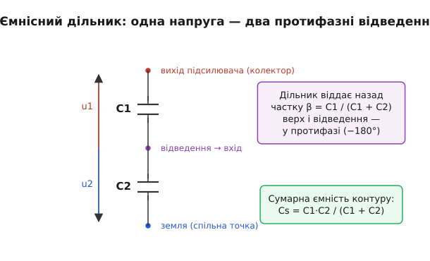
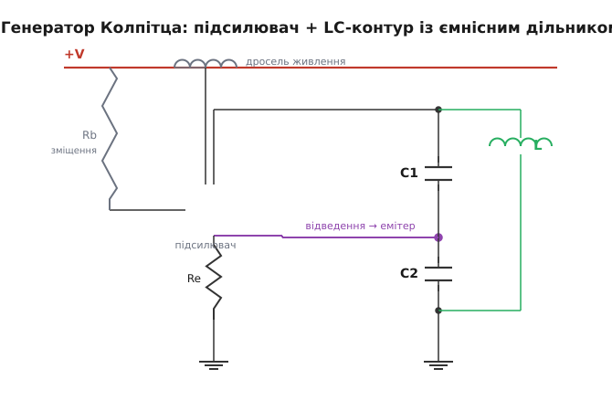

# Генератор Колпітца

Уявіть, що вам треба зробити пристрій, який сам собою видає чистий синусоїдальний сигнал на якійсь високій частоті — скажімо, 50 мегагерц для гетеродина приймача чи для радіопередавача. Жодного входу, лише живлення; увімкнув — і на виході гойдається стабільна синусоїда. Звідки їй узятися, якщо ми нічого туди не подаємо? І як змусити її гойдатися рівно на потрібній частоті, а не на якій заманеться? Відповідь, яку вже понад сто років ставлять у незліченні радіосхеми, — **генератор Колпітца**: підсилювач, коливальний LC-контур і два конденсатори, що повертають частину сигналу назад так, аби він сам себе підживлював.

Назва — від прізвища інженера [Едвіна Колпітца](topic:hw-analog/colpitts-oscillator/hist-colpitts-hartley.md), що 1918 року в дослідницькій лабораторії Western Electric придумав цю схему як «ємнісного двійника» вже відомого тоді генератора з котушками. Уся її особливість, що відрізняє її від родичів, ховається саме в тих двох конденсаторах. Розберімо, чому вони там, як із них народжується незатухаюче коливання й де ховаються підступи.

> 🔧 **Навіщо це.** Коли інженерові потрібне високочастотне джерело синусоїди — гетеродин у радіоприймачі, носійна частота передавача, тактовий сигнал для радіоканалу, — найперше, що спадає на думку, це генератор Колпітца. Він простий (один транзистор і кілька пасивних деталей), добре поводиться на десятках і сотнях мегагерц, де багатьом іншим схемам уже зле, і дає відносно чистий спектр. Тому його впізнавання й розуміння — базова навичка кожного, хто має справу з радіочастотою.

## Звідки взагалі береться коливання

Почнімо з найдивнішого: чому схема, у яку нічого не подають, починає видавати сигнал? Адже на вході спокій, живлення стале — звідки гойдання?

Будь-який генератор — це **підсилювач, охоплений позитивним зворотним зв'язком** через частотно-вибірковий елемент. Думка тут проста до краси. Підсилювач бере свій вхід і робить його більшим. Якщо ми влаштуємо так, щоб частина виходу поверталася на вхід **синфазно** — підсилюючи те, що там уже є, а не гасячи, — то навіть найдрібніший випадковий поштовх почне сам себе роздувати. У момент увімкнення на вході завжди є крихітний теплові шуми, мішанина всіх частот. Петля підхоплює цю мішанину; та її складова, що повертається «в ногу» сама із собою, наростає з кожним обходом кола, поки не впреться в межу — рейки живлення, далі яких розмах не пускає сама схема. Відтоді амплітуда стала, і ми маємо стабільне коливання, народжене буквально з нічого, з шуму.

Щоб це сталося, мусять виконатися [дві умови Баркгаузена](topic:hw-analog/loop-gain) разом. По-перше, петлеве підсилення на робочій частоті — не менше за одиницю: підсилювач має повертати рівно стільки енергії, скільки з'їдають втрати. По-друге, повний зсув фази по колу — нуль або кратний 360°, щоб сигнал, обійшовши петлю, повернувся синфазно сам із собою. Уся хитрість конкретної схеми генератора — у тому, **як** вона забезпечує ці дві умови й, головне, як змушує їх збігатися **лише на одній частоті**, а не на якій завгодно. Бо інакше схема загуділа б де попало.

> 🔧 **Навіщо це.** Цей погляд — «генератор = підсилювач + позитивний зв'язок через вибірковий елемент» — універсальний. Він однаково пояснює і кварцовий [генератор П'єрса](topic:hw-analog/pierce-oscillator) у мікроконтролері, і Колпітца на радіочастоті, і прості RC-генератори. Щойно ви бачите нову схему генератора, перше питання — «де тут підсилювач, де вибірковий елемент і як набирається 360°». Колпітц — найчистіший приклад, на якому цю звичку зручно виробити.

## LC-контур задає частоту

Вибірковий елемент у Колпітці — **коливальний контур** із котушки L та конденсаторів. Це серце схеми, тож згадаймо, чому він уміє вибирати частоту.

Конденсатор і котушка обмінюються енергією, як хитавиця обмінює висоту на швидкість. [Контур із L і C](topic:hw-analog/lc-resonance) має одну природну частоту, на якій цей обмін відбувається сам собою: енергія перетікає з електричного поля конденсатора в магнітне поле котушки й назад, туди-сюди, з певним темпом. Що менші L і C, то швидший обмін — то вища частота. Це резонанс, і він гострий: контур охоче «дзвенить» рівно на своїй частоті й глушить усе інше. Саме ця вибірковість і потрібна генераторові, щоб зафіксувати одну-єдину частоту коливань.

В ідеальному контурі коливання тривали б вічно. Але реальні котушка й конденсатор мають втрати (опір дроту, недосконалість діелектрика), і вони поступово гасять дзвін — як хитавиця без підштовхування зупиняється від тертя. Завдання решти схеми — підштовхувати контур у такт, рівно поповнюючи втрачене. Підсилювач і є тим, хто штовхає; контур задає темп.

## Головна ідея Колпітца: ємнісний дільник

А тепер те, що робить Колпітца саме Колпітцем. Конденсатор у контурі не один — їх **два, послідовно**, а від точки між ними йде відведення. Цей **ємнісний дільник** і є фірмовим знаком схеми.

Навіщо ділити конденсатор надвоє? Згадаймо обидві умови. Підсилювач (звичайний транзисторний каскад) переважно сам **перевертає** сигнал — додає 180° фази. Щоб зворотний зв'язок став позитивним, бракує ще 180°. І ось де працює дільник: коли на верхньому кінці контуру напруга йде вгору, на нижньому (відносно середньої точки) вона йде вниз — два кінці дільника завжди **в протифазі** один до одного відносно відведення. Тобто ємнісний дільник сам по собі дає той зсув, якого бракувало. Сигнал знімають із одного кінця, повертають на інший — і повний оберт фази складається в потрібні 360°.


*Ємнісний дільник із двох конденсаторів C1 і C2. Верхній кінець — вихід підсилювача, середня точка (відведення) — те, що повертають на вхід, нижній кінець — спільна земля. Коли напруга на верхньому кінці росте відносно відведення, на нижньому вона відносно того ж відведення падає: два кінці завжди в протифазі. Частку, що повертається, задає відношення ємностей β = C1/(C1+C2), а сумарна ємність контуру — їхнє послідовне з'єднання Cs = C1·C2/(C1+C2).*

Друга роль дільника — задати, **скільки** сигналу повернути. Бо умова про петлеве підсилення вимагає, щоб після всіх втрат у петлі сигнал усе ж наростав. Дільник віддає назад не весь вихід, а лише його частку, що дорівнює відношенню ємностей:

```
β = C1 / (C1 + C2)
```

Чим більший C1 проти C2, тим більшу частку виходу повертають на вхід — тим легше виконати умову самозбудження. Це важіль, яким проєктувальник балансує схему: повернути замало — генерація не запуститься; повернути забагато — сигнал сильно спотвориться об рейки. Зазвичай беруть щось посередині.

І третя роль тих самих двох конденсаторів — вони ж **входять у контур** і визначають частоту. Для коливального контуру C1 і C2 з'єднані послідовно (сигнальний струм тече крізь обидва, бо середня точка для змінного струму не «нікуди» — вона навантажена входом підсилювача, але цей вплив зазвичай малий). Послідовне з'єднання дає меншу сумарну ємність:

```
Cs = C1 · C2 / (C1 + C2)
```

Саме ця Cs разом із котушкою L і задає частоту резонансу. Тобто одна пара конденсаторів робить три справи заразом: перевертає фазу, дозує зворотний зв'язок і входить у контур, що визначає частоту. Економність, за яку схему й цінують.

## Як це працює крок за кроком

Складімо все докупи й простежмо за сигналом.


*Класична схема Колпітца. Транзистор — підсилювач; від живлення до колектора йде дросель (велика котушка, що пропускає постійний струм, але не дає сигналу витекти в шину). Коливальний контур: котушка L паралельно ємнісному дільнику C1–C2. Верх контуру під'єднано до виходу підсилювача (колектора), середню точку дільника повертають на вхід (емітер), низ — на землю. Резистори Rb та Re задають режим транзистора по постійному струму, не заважаючи сигналу.*

Транзистор тут — підсилювач. Резистори Rb (на базі) та Re (на емітері) виставляють його робочу точку: скільки постійного струму крізь нього тече у спокої. Це звичайне [зміщення транзистора](topic:hw-components/bjt-operation) — без нього транзистор або замкнений, або повністю відкритий, і підсилювати не може. До коливань ці резистори стосунку майже не мають, вони лише «вмикають» транзистор у потрібний режим.

Коливальний контур — котушка L паралельно ємнісному дільнику. Верхній кінець контуру з'єднано з виходом підсилювача (колектором), середню точку дільника повертають на його вхід, нижній кінець сидить на землі. Дросель між живленням і колектором пропускає постійний струм для живлення транзистора, але для змінного сигналу виглядає великим опором — щоб коливання не «втекло» в шину живлення, а лишалося в контурі.

Тепер сам цикл. У момент увімкнення в контурі з'являється крихітний шумовий поштовх. Контур відгукується на ньому найсильніше на своїй резонансній частоті — починає на ній дзвеніти. Це коливання, поділене дільником, повертається на вхід транзистора. Транзистор підсилює його й віддає назад на верх контуру — синфазно, бо дільник додав потрібні 180° до тих 180°, що дав сам транзистор. Поповнений сигнал знову проходить контур, знову ділиться, знову підсилюється. З кожним колом амплітуда росте — поки не впреться в рейки живлення, де підсилення транзистора природно падає, і ріст зупиняється. Установлюється стабільна синусоїда рівно на частоті контуру.

Звідки береться сама стабільність амплітуди? Зі **спаду підсилення на великому сигналі**. Поки розмах малий, транзистор працює в лінійній зоні з підсиленням більшим за потрібне — коливання наростають. Та щойно розмах сягає меж (транзистор то майже замикається, то заходить у насичення), його ефективне підсилення на основній частоті падає. Амплітуда зупиняється рівно там, де середнє за період підсилення зрівноважує втрати. Це саморегулювання вбудоване у фізику транзистора — окремої схеми обмеження не треба.

## Частота й умова запуску — в числах

Дві формули вирішують усе. Перша — **частота**: вона задана котушкою й послідовною ємністю дільника. Це звичайна резонансна частота LC-контуру, тільки замість «просто C» туди йде Cs:

```
f₀ = 1 / (2·π·√(L · Cs))         де   Cs = C1·C2/(C1+C2)
```

Друга — **умова запуску**. Щоб генерація почалася, підсилення транзистора має з запасом перекрити поділ сигналу дільником. Якщо знехтувати тонкощами, потрібно, щоб підсилення «по струму» транзистора (його [крутість](topic:hw-analog/transconductance) gm, помножена на опір навантаженого контуру) перевищило відношення ємностей:

```
запуск, коли   gm · Rp  >  C2 / C1
```

де Rp — еквівалентний опір втрат контуру на резонансі. Інтуїція проста: дільник віддає назад частку C1/(C1+C2), а «бачить» транзистор як навантаження співвідношення C2/C1 — і підсилювач мусить це співвідношення подолати з запасом, інакше коливання згасне. Звідки точно береться ця нерівність і чому навантажений контур поводиться як від'ємний опір — окрема, варта уваги [математика від першопричини](topic:hw-analog/colpitts-oscillator/math-startup-condition.md).

**Worked-приклад: контур на 7 МГц.** Хочемо генератор на 7 мегагерц (аматорський діапазон 40 метрів). Беремо котушку L = 1 мкГн (типове значення для такої частоти). Яка потрібна сумарна ємність Cs?

```
f₀ = 1 / (2·π·√(L·Cs))   →   Cs = 1 / ( (2·π·f₀)² · L )

2·π·f₀ = 2 · 3.1416 · 7·10⁶ = 4.40·10⁷ рад/с
(2·π·f₀)² = 1.93·10¹⁵
Cs = 1 / (1.93·10¹⁵ · 1·10⁻⁶) = 1 / (1.93·10⁹) = 517·10⁻¹² Ф ≈ 517 пФ
```

Тепер розкладемо Cs ≈ 517 пФ на два конденсатори. Візьмемо для зручності рівні: C1 = C2 = C. Послідовно вони дають Cs = C/2, отже C = 2·Cs ≈ 1034 пФ. На практиці беруть стандартні номінали, найближчі — наприклад C1 = C2 = 1000 пФ (тоді Cs = 500 пФ, частота вийде близько 7.1 МГц — у межах підстроювання котушкою). Перевіримо це арифметикою, яку зручно тримати в коді під час проєктування:

:::tabs
```cpp
#include <cmath>

// Резонансна частота контуру Колпітца за котушкою й парою конденсаторів.
// L — у генрі, C1, C2 — у фарадах; результат — у герцах.
float colpitts_freq(float L, float C1, float C2)
{
    float Cs = (C1 * C2) / (C1 + C2);     // послідовна ємність дільника
    return 1.0f / (2.0f * static_cast<float>(M_PI) * std::sqrt(L * Cs));
}
// colpitts_freq(1e-6f, 1000e-12f, 1000e-12f) -> ~7.12e6 Гц (7.12 МГц)
```
```python
import math

# Резонансна частота контуру Колпітца за котушкою й парою конденсаторів.
# L — у генрі, C1, C2 — у фарадах; результат — у герцах.
def colpitts_freq(L, C1, C2):
    Cs = (C1 * C2) / (C1 + C2)            # послідовна ємність дільника
    return 1.0 / (2.0 * math.pi * math.sqrt(L * Cs))

# colpitts_freq(1e-6, 1000e-12, 1000e-12) -> ~7.12e6 Гц (7.12 МГц)
```
:::

Зверніть увагу: частоту тут задають **пасивні** деталі — котушка й конденсатори, чиї номінали стабільні. Транзистор лише поповнює енергію; його розкид і дрейф на частоту впливають слабко (трохи — через власні ємності, але це другий порядок). Тому генератор тримає частоту досить добре, поки стабільні L і C.

## Чому два конденсатори, а не дві котушки

Логічне питання: а можна було б зробити навпаки — дільник із двох **котушок**, а конденсатор лишити один? Можна, і така схема існує — це [генератор Гартлі](topic:hw-analog/colpitts-oscillator/hist-colpitts-hartley.md), історичний попередник Колпітца. Він робить те саме, тільки відведення бере з дільника індуктивностей, а не ємностей. Дві схеми — **електричні двійники**: усюди, де в Колпітці конденсатор, у Гартлі котушка, і навпаки.


*Дуальність Колпітца й Гартлі. Ліворуч (Колпітц): відведення знімають із дільника двох конденсаторів, а котушка стоїть паралельно. Праворуч (Гартлі): відведення знімають із дільника двох котушок, а паралельно стоїть конденсатор. Однакова роль елементів, лише C і L помінялися місцями — тому схеми звуть електричними двійниками.*

То чому ж на радіочастоті частіше бачимо саме Колпітца? Бо два **конденсатори** зробити точними, дешевими й стабільними легше, ніж дві котушки. Котушка — деталь капризна: її індуктивність залежить від намотування, осердя, температури, сусідніх металів; дві спарені котушки з потрібним відведенням ще й важче виготовити однаково. Конденсатори ж бувають дуже точні й стабільні, і пара їх — тривіальна. До того ж на високих частотах ємнісний дільник дає чистіший сигнал: паразитні ємності монтажу просто додаються до C1 і C2 (стають частиною контуру), тоді як у Гартлі ті самі паразити псують роботу. Тому Колпітц витіснив Гартлі майже скрізь, де йдеться про десятки й сотні мегагерц.

## Підступи, про які варто знати

Кілька речей, які відрізняють робочий генератор від того, що «не заводиться» або «гуляє».

**Якість контуру вирішує чистоту.** Що менші втрати в котушці й конденсаторах — то «дзвінкіший» контур ([вища його добротність Q](topic:hw-analog/quality-factor)), то вужча смуга, у якій він резонує, і то чистіший спектр генерації. Контур із поганою котушкою (товсті втрати) дає «брудний» сигнал із розмитою частотою й помітним [фазовим шумом](topic:hw-components/phase-noise) — тремтінням частоти, що псує і приймачі, і передавачі. Тому в Колпітці не шкодують на добру котушку.

**Запас підсилення — але не надмірний.** Умову запуску треба виконати з запасом (зазвичай у 2–3 рази), щоб генератор надійно стартував за будь-якої температури й розкиду деталей. Але надмірний запас означає, що транзистор сильно «б'ється» об рейки, сигнал спотворюється, з'являються гармоніки, частота трохи «пливе» від нелінійності. Гарний проєкт балансує: достатньо для надійного старту, не більше.

**Навантаження зриває генерацію.** Якщо підключити навантаження прямо до контуру, воно додасть втрат і може збити генерацію або зсунути частоту. Тому вихід майже завжди знімають через **буфер** (окремий каскад, що ізолює контур від зовнішнього світу) або з малозв'язаної точки. Це ж стосується й вимірювання: торкнутися контуру щупом осцилографа — додати паразитну ємність прямо в чутливий вузол, зсунути частоту, а часом і зірвати коливання. Дивляться генератор обережно, через буфер.

**Стабільність частоти обмежена.** Колпітц тримає частоту краще за RC-генератори, але гірше за [кварцові](topic:hw-analog/pierce-oscillator). Котушка й конденсатори помалу дрейфують із температурою, частота повзе. Для точних застосунків замість котушкового контуру ставлять кварц — тоді схему звуть генератором Колпітца на кристалі, і вона поєднує знайому топологію з кварцовою стабільністю. Але це вже про точність; принцип ємнісного дільника лишається той самий.

Підсумуймо суть. Генератор Колпітца — це підсилювач, що підштовхує LC-контур у такт його власному резонансу, а зворотний зв'язок бере з **ємнісного дільника** з двох послідовних конденсаторів. Ці два конденсатори роблять одразу три справи: перевертають фазу до потрібних 360°, дозують частку повернутого сигналу й задають частоту контуру разом із котушкою. Звідси й популярність схеми на радіочастоті: мінімум деталей, легке настроювання, чистий сигнал там, де іншим уже важко.
